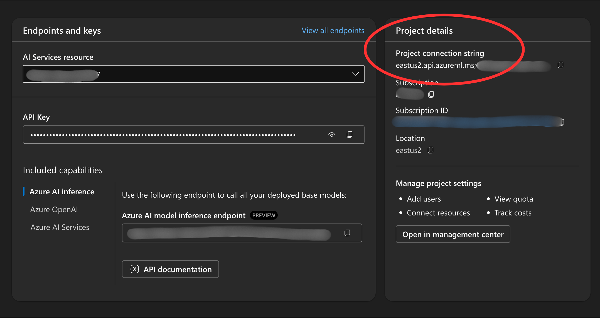

# သင်တန်းအတွက် Setup ပြင်ဆင်ခြင်း

## မိတ်ဆက်

ဒီသင်ခန်းစာမှာ သင်တန်းအတွင်းပါဝင်တဲ့ code sample တွေကို ဘယ်လိုအသုံးပြုရမယ်ဆိုတာကိုလေ့လာသွားမှာဖြစ်ပါတယ်။

## Repository ကို Clone လုပ်ခြင်း သို့မဟုတ် Fork လုပ်ခြင်း

ပထမဆုံးအဆင့်အနေနဲ့ GitHub မှာရှိတဲ့ Repository ကို **clone လုပ်ပါ** သို့မဟုတ် **fork လုပ်ပါ**။ ဒါဆိုရ် သင့်ရဲ့ ကိုယ်ပိုင် version ရလာပြီး၊ ကိုယ်တိုင် code ကို run လုပ်၊ စမ်းသပ်၊ ပြုပြင်နိုင်ပါလိမ့်မယ်။

အောက်ပါ link ကိုနှိပ်၍ fork လုပ်နိုင်ပါတယ် -  
👉 [Repo ကို fork လုပ်ရန်](https://github.com/microsoft/ai-agents-for-beginners/fork)

Fork လုပ်ပြီးပါက သင့်ရဲ့ ကိုယ်ပိုင် repository ကို အောက်ပါလင့်ခ်မှာတွေ့နိုင်ပါတယ် -


## Code ကို Run လုပ်ခြင်း

ဒီသင်တန်းမှာတော့ AI Agent တွေကို တည်ဆောက်ဖို့အတွက် လက်တွေ့ကျကျ လေ့လာနိုင်အောင် Jupyter Notebooks များဖြင့် တင်ထားပေးပါတယ်။

Code sampleအတွက် အောက်ကFramework ထဲက တစ်ခုခုအသုံးပြုလို့ရပါတယ် -

---

### **GitHub Account ဖြင့် အသုံးပြုခြင်း (အခမဲ့)**

1. **Semantic Kernel Agent Framework + GitHub Models Marketplace**  
   **ဖိုင်အမည်** – `semantic-kernel.ipynb`

2. **AutoGen Framework + GitHub Models Marketplace**  
   **ဖိုင်အမည်** – `autogen.ipynb`

---

### **Azure Subscription လိုအပ်သော**

3. **Azure AI Foundry + Azure AI Agent Service**  
   **ဖိုင်အမည်** – `azureaiagent.ipynb`

---

Framework သုံးမျိုးလုံးကိုလည်း စမ်းသပ်ကြည့်ဖို့ အကြံပြုပါတယ်၊ ဘယ်ဟာက သင့်နဲ့အကောင်းဆုံး လိုက်ဖက်တယ်ဆိုတာကို စမ်းသပ်ကြည့်ဖို့ပါ။

သင်ရွေးချယ်မယ့် option ပေါ်မူတည်ပြီး အောက်မှာဖော်ပြထားတဲ့ setup လုပ်ငန်းစဉ်များ မတူညီနိုင်ပါဘူး
## လိုအပ်ချက်များ (Requirements)

- Python 3.12 နှင့်အထက်
- GitHub Models Marketplace ကို အသုံးပြုရန်အတွက် - GitHub Account တစ်ခု -
- Azure AI Foundry ကို အသုံးပြုရန်အတွက် - Azure Subscription 
- Azure AI Agent Service ကို အသုံးပြုရန်အတွက် - Azure AI Foundry Account တသ်ခု -

ဒီ repository ရဲ့ root directory မှာ `requirements.txt` ဖိုင်တစ်ခု ပါဝင်ပါတယ်။  
ဒီဖိုင်တွင် code sample များကို run ဖို့လိုအပ်တဲ့ Python package များကို စုစည်းဖော်ပြထားပါတယ်။

အောက်ပါ command ကို terminal တွင် run လုပ်ခြင်းဖြင့် install လုပ်နိုင်ပါသည် –

```bash
pip install -r requirements.txt
```
💡 **အကြံပြုချက်** – Dependencyများ မရှုပ်ထွေးအောင် Python Virtual Environment တစ်ခုဖန်တီးပြီး အသုံးပြုဖို့ အကြံပြုလိုပါသည်။

---

## GitHub Models အသုံးပြုသည့် Samples များအတွက် Setup လုပ်ခြင်း

### အဆင့် ၁ – GitHub Personal Access Token (PAT) ရယူခြင်း

ဒီသင်တန်းအတွင်းမှာ GitHub Models Marketplace ကို အသုံးပြုပြီး Large Language Models (LLMs) များကို အခမဲ့အသုံးပြုခွင့်ပေးထားပါတယ်။  
AI Agents များတည်ဆောက်ဖို့အတွက် GitHub Personal Access Token (PAT) တစ်ခုလိုအပ်ပါသည်။

PAT ကိုရယူရန် သင့် GitHub အကောင့်ထဲမှ  
👉 **[Personal Access Tokens settings](https://github.com/settings/personal-access-tokens)** ကိုသွားပါ။

ဘယ်ဘက် sidebar မှာ **Fine-grained tokens** ကိုရွေးချယ်ပြီး  
**Generate new token** ကို နှိပ်ပါ။

Token အသစ်ဖန်တီးရာတွင် အောက်ပါအချက်အလက်များကို ဖြည့်သွင်းရပါမည် –

- **Token အမည်** – သင်သိရှိအောင် အထင်ရှားဆုံးနာမည်ပေးရန်  
- **သက်တမ်း (Expiration)** – အကြံပြုချက်: **၃၀ ရက်**  
- **အသုံးပြုခွင့် (Scopes)** – **Public Repositories** ကိုသာရွေးပါ  

Token ဖန်တီးပြီးပါက  
🔑 **သတိထား** – Token ကို **Copy လုပ်ထားပါ**။ GitHub မှာ Token ကို နောက်မှ ပြသမည်မဟုတ်ပါ။

ထို Token ကို သင်တန်းတွင် ပါဝင်တဲ့ `.env` ဖိုင်ထဲတွင် ထည့်သွင်းရန် လိုအပ်ပါသည်။

---

🛡️ **သတိပေးချက်** –  
Token များသည် လုံခြုံရေးအတွက် အချိန်ပိုင်းသက်တမ်းရှိသည့်အတွက် `.env` ဖိုင်တွင်သာ သိမ်းထားပြီး  
Version Control (Git) ထဲသို့ မထည့်သင့်ပါ။  
သင့် Code ကို GitHub တွင် push မလုပ်မီ `.gitignore` ထဲတွင် `.env` ဖိုင် ပါဝင်ကြောင်း သေချာစစ်ဆေးပါ။
### Step 2: Create Your `.env` File

To create your `.env` file run the following command in your terminal.

```bash
cp .env.example .env
```

This will copy the example file and create a `.env` in your directory and where you fill in the values for the environment variables.

With your token copied, open the `.env` file in your favorite text editor and paste your token into the `GITHUB_TOKEN` field.

You should now be able to run the code samples of this course.

## Set Up for Samples using Azure AI Foundry and Azure AI Agent Service

### Step 1: Retrieve Your Azure Project Connection String

Follow the steps to creating a project and agent in Azure AI Foundry found here: [Create a project in Azure AI Foundry](https://learn.microsoft.com/en-us/azure/ai-services/agents/quickstart?pivots=ai-foundry-portal?WT.mc_id=academic-105485-koreyst)

Once you have created your project, you will need to retrieve the connection string for your project.

This can be done by going to the **Overview** page of your project in the Azure AI Foundry portal.



### Step 2: Create Your `.env` File

To create your `.env` file run the following command in your terminal.

```bash
cp .env.example .env
```

This will copy the example file and create a `.env` in your directory and where you fill in the values for the environment variables.

With your token copied, open the `.env` file in your favorite text editor and paste your token into the `PROJECT_CONNECTION_STRING` field.

### Step 3: Sign in to Azure

As a security best practice, we'll use [keyless authentication](https://learn.microsoft.com/azure/developer/ai/keyless-connections?tabs=csharp%2Cazure-cli?WT.mc_id=academic-105485-koreyst) to authenticate to Azure OpenAI with Microsoft Entra ID. Before you can do so, you'll first need to install the **Azure CLI** per the [installation instructions](https://learn.microsoft.com/cli/azure/install-azure-cli?WT.mc_id=academic-105485-koreyst) for your operating system.

Next, open a terminal and run `az login --use-device-code` to sign in to your Azure account.

Once you've logged in, select your subscription in the terminal.


## Additional Envionment Variables - Azure Search and Azure OpenAI 

For the Agentic RAG Lesson - Lesson 5 - there are samples that use Azure Search and Azure OpenAI.

If you want to run these samples, you will need to add the following environment variables to your `.env` file:

### Overview Page (Project)

- `AZURE_SUBSCRIPTION_ID` - Check **Project details** on the **Overview** page of your project.

- `AZURE_AI_PROJECT_NAME` - Look at the top of the **Overview** page for your project.

- `AZURE_OPENAI_SERVICE` - Find this in the **Included capabilities** tab for **Azure OpenAI Service** on the **Overview** page.

### Management Center

- `AZURE_OPENAI_RESOURCE_GROUP` - Go to **Project properties** on the **Overview** page of the **Management Center**.

- `GLOBAL_LLM_SERVICE` - Under **Connected resources**, find the **Azure AI Services** connection name. If not listed, check the **Azure portal** under your resource group for the AI Services resource name.

### Models + Endpoints Page

- `AZURE_OPENAI_EMBEDDING_DEPLOYMENT_NAME` - Select your embedding model (e.g., `text-embedding-ada-002`) and note the **Deployment name** from the model details.

- `AZURE_OPENAI_CHAT_DEPLOYMENT_NAME` - Select your chat model (e.g., `gpt-4o-mini`) and note the **Deployment name** from the model details.

### Azure Portal

- `AZURE_OPENAI_ENDPOINT` - Look for **Azure AI services**, click on it, then go to **Resource Management**, **Keys and Endpoint**, scroll down to the "Azure OpenAI endpoints", and copy the one that says "Language APIs".

- `AZURE_OPENAI_API_KEY` - From the same screen, copy KEY 1 or KEY 2.

- `AZURE_SEARCH_SERVICE_ENDPOINT` - Find your **Azure AI Search** resource, click it, and see **Overview**.

- `AZURE_SEARCH_API_KEY` - Then go to **Settings** and then **Keys** to copy the primary or secondary admin key.

### External Webpage

- `AZURE_OPENAI_API_VERSION` - Visit the [API version lifecycle](https://learn.microsoft.com/en-us/azure/ai-services/openai/api-version-deprecation#latest-ga-api-release) page under **Latest GA API release**.

### Setup keyless authentication

Rather than hardcode your credentials, we'll use a keyless connection with Azure OpenAI. To do so, we'll import `DefaultAzureCredential` and later call the `DefaultAzureCredential` function to get the credential.

```python
from azure.identity import DefaultAzureCredential, InteractiveBrowserCredential
```

## Stuck Somewhere?

If you have any issues running this setup, hop into our <a href="https://discord.gg/kzRShWzttr" target="_blank">Azure AI Community Discord</a> or <a href="https://github.com/microsoft/ai-agents-for-beginners/issues?WT.mc_id=academic-105485-koreyst" target="_blank">create an issue</a>.

## Next Lesson

You are now ready to run the code of this course, happy learning more about the world of AI Agents! 

[Introduction to AI Agents and Agent Use Cases](../01-intro-to-ai-agents/README.md)
