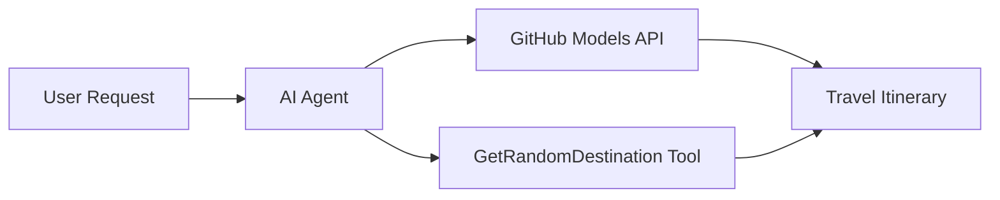

# 🌍 AI Travel Agent with Microsoft Agent Framework (.NET)

## 📋 Scenario Overview

This notebook demonstrates how to build an intelligent travel planning agent using the Microsoft Agent Framework for .NET. The agent can automatically generate personalized day-trip itineraries for random destinations around the world.

**Key Capabilities:**
- 🎲 **Random Destination Selection**: Uses a custom tool to pick vacation spots
- 🗺️ **Intelligent Trip Planning**: Creates detailed day-by-day itineraries
- 🔄 **Real-time Streaming**: Supports both immediate and streaming responses
- 🛠️ **Custom Tool Integration**: Demonstrates how to extend agent capabilities

## 🔧 Technical Architecture

### Core Technologies
- **Microsoft Agent Framework**: Latest .NET implementation for AI agent development
- **GitHub Models Integration**: Uses GitHub's AI model inference service
- **OpenAI API Compatibility**: Leverages OpenAI client libraries with custom endpoints
- **Secure Configuration**: Environment-based API key management

### Key Components
1. **AIAgent**: The main agent orchestrator that handles conversation flow
2. **Custom Tools**: `GetRandomDestination()` function available to the agent
3. **Chat Client**: GitHub Models-backed conversation interface
4. **Streaming Support**: Real-time response generation capabilities

### Integration Pattern


## 🚀 Getting Started

**Prerequisites:**
- .NET 10.0 or higher
- GitHub Models API access token
- Environment variables configured in `.env` file

**Required Environment Variables:**
```env
GITHUB_TOKEN=your_github_token
GITHUB_ENDPOINT=https://models.inference.ai.azure.com
GITHUB_MODEL_ID=gpt-4o-mini
```

Run the code sample below in sequence to see the travel agent in action!

---

## .NET Single File App: AI Travel Agent Example

See `01-dotnet-agent-framework.cs` for the complete runnable code sample.

```bash
dotnet run 01-dotnet-agent-framework.cs
```

### Sample Code

```csharp
static string GetRandomDestination()
{
    var destinations = new List<string>
    {
        "Paris, France",
        "Tokyo, Japan",
        "New York City, USA",
        "Sydney, Australia",
        "Rome, Italy",
        "Barcelona, Spain",
        "Cape Town, South Africa",
        "Rio de Janeiro, Brazil",
        "Bangkok, Thailand",
        "Vancouver, Canada"
    };
    var random = new Random();
    int index = random.Next(destinations.Count);
    return destinations[index];
}

// Extract configuration from environment variables
var github_endpoint = Environment.GetEnvironmentVariable("GITHUB_ENDPOINT") ?? throw new InvalidOperationException("GITHUB_ENDPOINT is not set.");
var github_model_id = Environment.GetEnvironmentVariable("GITHUB_MODEL_ID") ?? "gpt-4o-mini";
var github_token = Environment.GetEnvironmentVariable("GITHUB_TOKEN") ?? throw new InvalidOperationException("GITHUB_TOKEN is not set.");

// Configure OpenAI Client Options
var openAIOptions = new OpenAIClientOptions()
{
    Endpoint = new Uri(github_endpoint)
};

// Initialize OpenAI Client with GitHub Models Configuration
var openAIClient = new OpenAIClient(new ApiKeyCredential(github_token), openAIOptions);

// Create AI Agent with Travel Planning Capabilities
AIAgent agent = openAIClient
    .GetChatClient(github_model_id)
    .CreateAIAgent(
        instructions: "You are a helpful AI Agent that can help plan vacations for customers at random destinations",
        tools: [AIFunctionFactory.Create(GetRandomDestination)]
    );

// Execute Agent: Plan a Day Trip (Non-Streaming)
Console.WriteLine(await agent.RunAsync("Plan me a day trip"));

// Execute Agent: Plan a Day Trip (Streaming Response)
await foreach (var update in agent.RunStreamingAsync("Plan me a day trip"))
{
    Console.Write(update);
}
```