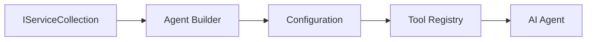

# 🎨 Agentic Design Patterns with GitHub Models (.NET)

## 📋 Learning Objectives

This example demonstrates enterprise-grade design patterns for building intelligent agents using the Microsoft Agent Framework in .NET with GitHub Models integration. You'll learn professional patterns and architectural approaches that make agents production-ready, maintainable, and scalable.

### Enterprise Design Patterns

- 🏭 **Factory Pattern**: Standardized agent creation with dependency injection
- 🔧 **Builder Pattern**: Fluent agent configuration and setup
- 🧵 **Thread-Safe Patterns**: Concurrent conversation management
- 📋 **Repository Pattern**: Organized tool and capability management

## 🎯 .NET-Specific Architectural Benefits

### Enterprise Features

- **Strong Typing**: Compile-time validation and IntelliSense support
- **Dependency Injection**: Built-in DI container integration
- **Configuration Management**: IConfiguration and Options patterns
- **Async/Await**: First-class asynchronous programming support

### Production-Ready Patterns

- **Logging Integration**: ILogger and structured logging support
- **Health Checks**: Built-in monitoring and diagnostics
- **Configuration Validation**: Strong typing with data annotations
- **Error Handling**: Structured exception management

## 🔧 Technical Architecture

### Core .NET Components

- **Microsoft.Extensions.AI**: Unified AI service abstractions
- **Microsoft.Agents.AI**: Enterprise agent orchestration framework
- **GitHub Models Integration**: High-performance API client patterns
- **Configuration System**: appsettings.json and environment integration

### Design Pattern Implementation



## 🏗️ Enterprise Patterns Demonstrated

### 1. **Creational Patterns**

- **Agent Factory**: Centralized agent creation with consistent configuration
- **Builder Pattern**: Fluent API for complex agent configuration
- **Singleton Pattern**: Shared resources and configuration management
- **Dependency Injection**: Loose coupling and testability

### 2. **Behavioral Patterns**

- **Strategy Pattern**: Interchangeable tool execution strategies
- **Command Pattern**: Encapsulated agent operations with undo/redo
- **Observer Pattern**: Event-driven agent lifecycle management
- **Template Method**: Standardized agent execution workflows

### 3. **Structural Patterns**

- **Adapter Pattern**: GitHub Models API integration layer
- **Decorator Pattern**: Agent capability enhancement
- **Facade Pattern**: Simplified agent interaction interfaces
- **Proxy Pattern**: Lazy loading and caching for performance

## 📚 .NET Design Principles

### SOLID Principles

- **Single Responsibility**: Each component has one clear purpose
- **Open/Closed**: Extensible without modification
- **Liskov Substitution**: Interface-based tool implementations
- **Interface Segregation**: Focused, cohesive interfaces
- **Dependency Inversion**: Depend on abstractions, not concretions

### Clean Architecture

- **Domain Layer**: Core agent and tool abstractions
- **Application Layer**: Agent orchestration and workflows
- **Infrastructure Layer**: GitHub Models integration and external services
- **Presentation Layer**: User interaction and response formatting

## 🔒 Enterprise Considerations

### Security

- **Credential Management**: Secure API key handling with IConfiguration
- **Input Validation**: Strong typing and data annotation validation
- **Output Sanitization**: Secure response processing and filtering
- **Audit Logging**: Comprehensive operation tracking

### Performance

- **Async Patterns**: Non-blocking I/O operations
- **Connection Pooling**: Efficient HTTP client management
- **Caching**: Response caching for improved performance
- **Resource Management**: Proper disposal and cleanup patterns

### Scalability

- **Thread Safety**: Concurrent agent execution support
- **Resource Pooling**: Efficient resource utilization
- **Load Management**: Rate limiting and backpressure handling
- **Monitoring**: Performance metrics and health checks

## 🚀 Production Deployment

- **Configuration Management**: Environment-specific settings
- **Logging Strategy**: Structured logging with correlation IDs
- **Error Handling**: Global exception handling with proper recovery
- **Monitoring**: Application insights and performance counters
- **Testing**: Unit tests, integration tests, and load testing patterns

Ready to build enterprise-grade intelligent agents with .NET? Let's architect something robust! 🏢✨

## 🚀 Getting Started

### Prerequisites

- [.NET 10 SDK](https://dotnet.microsoft.com/download/dotnet/10.0) or higher
- [GitHub Models API access token](https://docs.github.com/github-models/github-models-at-scale/using-your-own-api-keys-in-github-models)

### Required Environment Variables

```bash
# zsh/bash
export GH_TOKEN=<your_github_token>
export GH_ENDPOINT=https://models.github.ai/inference
export GH_MODEL_ID=openai/gpt-5-mini
```

```powershell
# PowerShell
$env:GH_TOKEN = "<your_github_token>"
$env:GH_ENDPOINT = "https://models.github.ai/inference"
$env:GH_MODEL_ID = "openai/gpt-5-mini"
```

### Sample Code

To run the code example,

```bash
# zsh/bash
chmod +x ./03-dotnet-agent-framework.cs
./03-dotnet-agent-framework.cs
```

Or using the dotnet CLI:

```bash
dotnet run ./03-dotnet-agent-framework.cs
```

See [`03-dotnet-agent-framework.cs`](./03-dotnet-agent-framework.cs) for the complete code.

```csharp

```