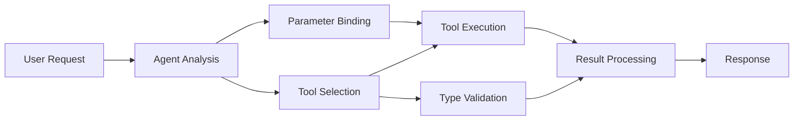

# 🛠️ Advanced Tool Use with GitHub Models (.NET)

## 📋 Learning Objectives

This notebook demonstrates enterprise-grade tool integration patterns using the Microsoft Agent Framework in .NET with GitHub Models. You'll learn to build sophisticated agents with multiple specialized tools, leveraging C#'s strong typing and .NET's enterprise features.

### Advanced Tool Capabilities You'll Master

- 🔧 **Multi-Tool Architecture**: Building agents with multiple specialized capabilities
- 🎯 **Type-Safe Tool Execution**: Leveraging C#'s compile-time validation
- 📊 **Enterprise Tool Patterns**: Production-ready tool design and error handling
- 🔗 **Tool Composition**: Combining tools for complex business workflows

## 🎯 .NET Tool Architecture Benefits

### Enterprise Tool Features

- **Compile-Time Validation**: Strong typing ensures tool parameter correctness
- **Dependency Injection**: IoC container integration for tool management
- **Async/Await Patterns**: Non-blocking tool execution with proper resource management
- **Structured Logging**: Built-in logging integration for tool execution monitoring

### Production-Ready Patterns

- **Exception Handling**: Comprehensive error management with typed exceptions
- **Resource Management**: Proper disposal patterns and memory management
- **Performance Monitoring**: Built-in metrics and performance counters
- **Configuration Management**: Type-safe configuration with validation

## 🔧 Technical Architecture

### Core .NET Tool Components

- **Microsoft.Extensions.AI**: Unified tool abstraction layer
- **Microsoft.Agents.AI**: Enterprise-grade tool orchestration
- **GitHub Models Integration**: High-performance API client with connection pooling

### Tool Execution Pipeline



## 🛠️ Tool Categories & Patterns

### 1. **Data Processing Tools**

- **Input Validation**: Strong typing with data annotations
- **Transform Operations**: Type-safe data conversion and formatting
- **Business Logic**: Domain-specific calculation and analysis tools
- **Output Formatting**: Structured response generation

### 2. **Integration Tools** 

- **API Connectors**: RESTful service integration with HttpClient
- **Database Tools**: Entity Framework integration for data access
- **File Operations**: Secure file system operations with validation
- **External Services**: Third-party service integration patterns

### 3. **Utility Tools**

- **Text Processing**: String manipulation and formatting utilities
- **Date/Time Operations**: Culture-aware date/time calculations
- **Mathematical Tools**: Precision calculations and statistical operations
- **Validation Tools**: Business rule validation and data verification

Ready to build enterprise-grade agents with powerful, type-safe tool capabilities in .NET? Let's architect some professional-grade solutions! 🏢⚡

## 🚀 Getting Started

### Prerequisites

- [.NET 10 SDK](https://dotnet.microsoft.com/download/dotnet/10.0) or higher
- [GitHub Models API access token](https://docs.github.com/github-models/github-models-at-scale/using-your-own-api-keys-in-github-models)

### Required Environment Variables

```bash
# zsh/bash
export GH_TOKEN=<your_github_token>
export GH_ENDPOINT=https://models.github.ai/inference
export GH_MODEL_ID=openai/gpt-5-mini
```

```powershell
# PowerShell
$env:GH_TOKEN = "<your_github_token>"
$env:GH_ENDPOINT = "https://models.github.ai/inference"
$env:GH_MODEL_ID = "openai/gpt-5-mini"
```

### Sample Code

To run the code example,

```bash
# zsh/bash
chmod +x ./04-dotnet-agent-framework.cs
./04-dotnet-agent-framework.cs
```

Or using the dotnet CLI:

```bash
dotnet run ./04-dotnet-agent-framework.cs
```

See [`04-dotnet-agent-framework.cs`](./04-dotnet-agent-framework.cs) for the complete code.

```csharp

```