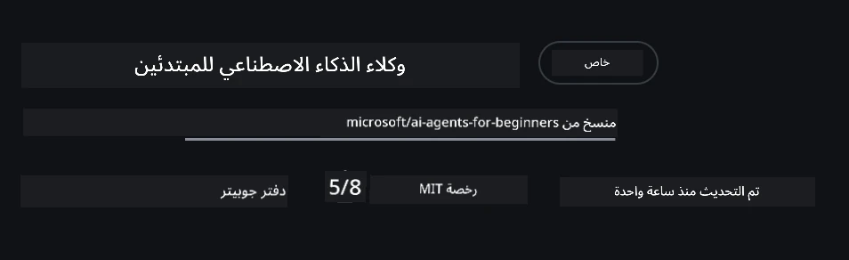
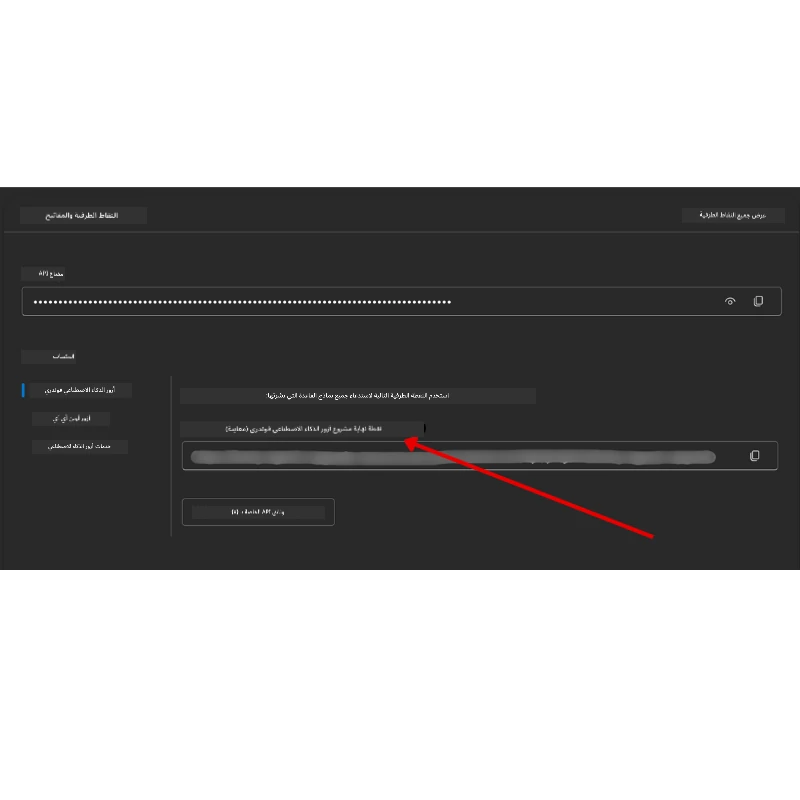

# إعداد الدورة

## مقدمة

ستغطي هذه الدرس كيفية تشغيل عينات الشفرة الخاصة بهذه الدورة.

## انضم إلى المتعلمين الآخرين واحصل على المساعدة

قبل أن تبدأ في استنساخ المستودع الخاص بك، انضم إلى [قناة ديسكورد لوكلاء الذكاء الاصطناعي للمبتدئين](https://aka.ms/ai-agents/discord) للحصول على أي مساعدة في الإعداد، أو أي أسئلة حول الدورة، أو للتواصل مع متعلمين آخرين.

## استنساخ أو تفرع هذا المستودع

للبدء، يرجى استنساخ أو تفرع مستودع GitHub. هذا سيمكنك من الحصول على نسختك الخاصة من مواد الدورة حتى تتمكن من تشغيل واختبار وتعديل الشفرة!

يمكن القيام بذلك بالنقر على الرابط لـ <a href="https://github.com/microsoft/ai-agents-for-beginners/fork" target="_blank">تفرع المستودع</a>

يجب أن يكون لديك الآن نسختك الخاصة من هذا الدورة في الرابط التالي:



### استنساخ سطحي (موصى به للورشة / Codespaces)

  > يمكن أن يكون المستودع الكامل كبيرًا (~3 جيجابايت) عند تحميل التاريخ الكامل وجميع الملفات. إذا كنت ستحضر الورشة فقط أو تحتاج إلى مجلدات دروس قليلة فقط، فإن الاستنساخ السطحي (أو الاستنساخ الجزئي) يحمل كمية أقل بكثير.

#### استنساخ سطحي سريع — أقل تاريخ تحميل، كل الملفات

استبدل `<your-username>` في الأوامر أدناه برابط التفرع الخاص بك (أو رابط upstream إذا كنت تفضل).

لاستنساخ فقط أحدث سجل commit (تحميل صغير):

```bash
git clone --depth 1 https://github.com/<your-username>/ai-agents-for-beginners.git
```

لاستنساخ فرع محدد:

```bash
git clone --depth 1 --branch <branch-name> https://github.com/<your-username>/ai-agents-for-beginners.git
```

#### استنساخ جزئي (متفرق) — أقل عدد من الكتل + فقط المجلدات المختارة

هذا يستخدم الاستنساخ الجزئي و sparse-checkout (يتطلب Git 2.25+ ويفضل Git حديث مع دعم الاستنساخ الجزئي):

```bash
git clone --depth 1 --filter=blob:none --sparse https://github.com/<your-username>/ai-agents-for-beginners.git
```

ادخل إلى مجلد المستودع:

```bash
cd ai-agents-for-beginners
```

ثم حدد المجلدات التي تريدها (مثال أدناه يوضح مجلدين):

```bash
git sparse-checkout set 00-course-setup 01-intro-to-ai-agents
```

بعد الاستنساخ والتحقق من الملفات، إذا كنت تحتاج فقط إلى الملفات وترغب في توفير مساحة (بدون سجل git)، يرجى حذف بيانات المستودع (💀 لا رجوع فيه — ستفقد كل وظائف git):

```bash
# زش/باش
rm -rf .git
```

```powershell
# باورشيل
Remove-Item -Recurse -Force .git
```

#### استخدام GitHub Codespaces (موصى به لتجنب التحميلات الكبيرة محلياً)

- أنشئ مساحة كود جديدة لهذا المستودع عبر [واجهه GitHub](https://github.com/codespaces).  

- في طرفية مساحة الكود التي أنشأتها حديثًا، شغل أحد أوامر الاستنساخ السطحي/المتفرق أعلاه لإحضار مجلدات الدروس التي تحتاجها فقط إلى بيئة مساحة الكود.
- اختياري: بعد الاستنساخ داخل الـ Codespaces، قم بإزالة مجلد .git لاستعادة مساحة إضافية (شاهد أوامر الحذف أعلاه).
- ملاحظة: إذا كنت تفضل فتح المستودع مباشرة في Codespaces (بدون استنساخ إضافي)، يرجى العلم أن Codespaces ستبني بيئة devcontainer وقد توفر أكثر مما تحتاج.

#### نصائح

- استبدل دائماً رابط الاستنساخ برابط التفرع الخاص بك إذا كنت تريد التعديل/الالتزام.
- إذا كنت تحتاج لاحقًا إلى المزيد من التاريخ أو الملفات، يمكنك جلبها أو تعديل sparse-checkout لتشمل مجلدات إضافية.

## تشغيل الشفرة

تقدم هذه الدورة سلسلة من دفاتر Jupyter التي يمكنك تشغيلها للحصول على تجربة عملية في بناء وكلاء الذكاء الاصطناعي.

تستخدم عينات الشفرة **إطار عمل Microsoft Agent Framework (MAF)** مع `FoundryChatClient`، الذي يتصل مع **خدمة Microsoft Foundry Agent V2** (واجهة برمجة التطبيقات للردود) عبر **Microsoft Foundry**.

جميع دفاتر Python الموسومة بـ `*-python-agent-framework.ipynb`.

## المتطلبات

- Python 3.12+
  - **ملاحظة**: إذا لم تكن قد نصبت Python3.12، تأكد من تثبيتها. ثم أنشئ بيئة افتراضية باستخدام python3.12 لضمان تثبيت الإصدارات الصحيحة من ملف requirements.txt.
  
    >مثال

    أنشئ مجلد البيئة الافتراضية Python venv:

    ```bash
    python -m venv venv
    ```

    ثم فعّل بيئة venv لـ:

    ```bash
    # زد شيل/باش
    source venv/bin/activate
    ```
  
    ```dos
    # Command Prompt for Windows
    venv\Scripts\activate
    ```

- .NET 10+: لعينات الشفرة التي تستخدم .NET، تأكد من تثبيت [.NET 10 SDK](https://dotnet.microsoft.com/download/dotnet/10.0) أو أحدث. ثم تحقق من إصدار SDK المثبت لديك:

    ```bash
    dotnet --list-sdks
    ```

- **Azure CLI** — مطلوب للمصادقة. ثبت من [aka.ms/installazurecli](https://aka.ms/installazurecli).
- **اشتراك Azure** — للوصول إلى Microsoft Foundry وخدمة Microsoft Foundry Agent.
- **مشروع Microsoft Foundry** — مشروع به نموذج نشر (مثل `gpt-5-mini`). انظر [الخطوة 1](#الخطوة-1-إنشاء-مشروع-microsoft-foundry) أدناه.

أدرجنا ملف `requirements.txt` في جذر هذا المستودع يحتوي على كل حزم Python المطلوبة لتشغيل عينات الشفرة.

يمكنك تثبيتها عن طريق تشغيل الأمر التالي في الطرفية داخل جذر المستودع:

```bash
pip install -r requirements.txt
```

نوصي بإنشاء بيئة افتراضية Python لتجنب أي تعارضات ومشاكل.

## إعداد VSCode

تأكد من استخدامك الإصدار الصحيح من Python في VSCode.


## إعداد Microsoft Foundry وخدمة Microsoft Foundry Agent

### الخطوة 1: إنشاء مشروع Microsoft Foundry

تحتاج إلى **محور** Microsoft Foundry و**مشروع** به نموذج منشور لتشغيل دفاتر Jupyter.

1. اذهب إلى [ai.azure.com](https://ai.azure.com) وسجل الدخول بحساب Azure الخاص بك.
2. أنشئ **محور** أو استخدم محوراً موجوداً. انظر: [نظرة عامة على موارد المحور](https://learn.microsoft.com/azure/ai-foundry/concepts/ai-resources).
3. داخل المحور، أنشئ **مشروع**.
4. انشر نموذجاً (مثل `gpt-5-mini`) من **Models + Endpoints** → **Deploy model**.

### الخطوة 2: استرداد نقطة نهاية المشروع واسم نشر النموذج

من مشروعك في بوابة Microsoft Foundry:

- **نقطة نهاية المشروع** — اذهب إلى صفحة **نظرة عامة** وانسخ عنوان URL الخاص بالنقطة النهائية.



- **اسم نشر النموذج** — اذهب إلى **Models + Endpoints**، اختر النموذج المنشور، ودوّن **اسم النشر** (مثل `gpt-5-mini`).

### الخطوة 3: سجل الدخول إلى Azure باستخدام `az login`

تعتمد معظم دفاتر Jupyter على المصادقة عبر **تسجيل الدخول باستخدام Azure CLI** — باستخدام `AzureCliCredential` أو `DefaultAzureCredential` (كلاهما يستخدم جلسة `az login` الخاصة بك) من حزمة `azure-identity` — لذلك لا تحتاج إلى مفاتيح API. بعض الدروس والتكاملات الاختيارية تستخدم مفاتيح API؛ تحقق من متطلبات كل درس لأي متغيرات بيئية إضافية. هذا يتطلب تسجيل الدخول عبر Azure CLI.

1. **ثبت Azure CLI** إذا لم تكن قد فعلت ذلك بعد: [aka.ms/installazurecli](https://aka.ms/installazurecli)

2. **سجل الدخول** بتشغيل:

    ```bash
    az login
    ```

    أو إذا كنت في بيئة بعيدة/Codespace بدون متصفح:

    ```bash
    az login --use-device-code
    ```

3. **اختر اشتراكك** إذا طُلب منك — اختر الاشتراك الذي يحتوي على مشروع Foundry الخاص بك.

4. **تحقق** من تسجيل دخولك:

    ```bash
    az account show
    ```

> **لماذا `az login`؟** تقوم دفاتر Jupyter بالمصادقة باستخدام `AzureCliCredential` (أو `DefaultAzureCredential`، والتي تلتقط أيضاً تسجيل دخول Azure CLI) من حزمة `azure-identity`. هذا يعني أن جلسة Azure CLI الخاصة بك توفر بيانات الاعتماد — لا مفاتيح API أو أسرار في ملف `.env`. هذه [أفضل ممارسة أمنية](https://learn.microsoft.com/azure/developer/ai/keyless-connections).

### الخطوة 4: أنشئ ملف `.env` الخاص بك

انسخ ملف المثال:

```bash
# زد شل/باش
cp .env.example .env
```

```powershell
# باورشيل
Copy-Item .env.example .env
```

افتح `.env` واملأ القيمتين التاليتين:

```env
AZURE_AI_PROJECT_ENDPOINT=https://<your-project>.services.ai.azure.com/api/projects/<your-project-id>
AZURE_AI_MODEL_DEPLOYMENT_NAME=gpt-5-mini
```

| المتغير | مكان العثور عليه |
|----------|-----------------|
| `AZURE_AI_PROJECT_ENDPOINT` | بوابة Foundry → مشروعك → صفحة **نظرة عامة** |
| `AZURE_AI_MODEL_DEPLOYMENT_NAME` | بوابة Foundry → **Models + Endpoints** → اسم نموذجك المنشور |

هذا يكفي لمعظم الدروس! ستقوم دفاتر Jupyter بالمصادقة تلقائياً عبر جلسة `az login` الخاصة بك.

### الخطوة 5: تثبيت تبعيات Python

```bash
pip install -r requirements.txt
```

نوصي بتشغيل هذا داخل البيئة الافتراضية التي أنشأتها سابقاً.

## إعداد اختياري: Azure AI Search (الدروس 5 و 16)

دفاتر الدرس 5 (Agentic RAG) و الدرس 16 تعمل مباشرة مع **قاعدة معرفة في الذاكرة** — لا تحتاج إلى موارد Azure إضافية. إذا أردت دعمها بفهرس حقيقي في **Azure AI Search**، لاحظ أن دفتر الدرس 16 يستخدم حالياً مصادقة عبر المفتاح: يتحول من البحث في الذاكرة إلى Azure AI Search فقط عندما يتم تعيين **كلا من** `AZURE_SEARCH_SERVICE_ENDPOINT` و `AZURE_SEARCH_API_KEY`، وإلا يبقى في البحث في الذاكرة — لذا لتشغيله مع فهرس حقيقي يجب تعيين مفتاح المسؤول أيضاً. المصادقة بدون مفاتيح مع Microsoft Entra ID (RBAC) هي النهج الموصى به لكود الإنتاج الخاص بك، متوافق مع تدفق `az login` المستخدم في كل مكان آخر في الدورة.

تنطبق خطوات RBAC أدناه على أمثلة دليل الإعداد والكود الخاص بك. لا تتيح المصادقة بدون مفاتيح في دفتر الدرس 16؛ الدرس 16 ما زال يتطلب كلاً من نقطة النهاية والمفتاح الإداري لاستخدام Azure AI Search.

1. **فعّل التحكم بالوصول المبني على الأدوار** على خدمة البحث الخاصة بك:

    ```bash
    az search service update --name <service-name> --resource-group <resource-group> --auth-options aadOrApiKey
    ```

2. **عيّن لنفسك الأدوار المطلوبة** (إنشاء/تحميل الفهارس والاستعلام):

    ```bash
    az role assignment create --assignee <your-user-or-principal-id> --role "Search Service Contributor" --scope $(az search service show -g <resource-group> -n <service-name> --query id -o tsv)
    az role assignment create --assignee <your-user-or-principal-id> --role "Search Index Data Contributor" --scope $(az search service show -g <resource-group> -n <service-name> --query id -o tsv)
    ```

3. **أضف النقطة النهاية** إلى ملف `.env` الخاص بك:

| المتغير | مكان العثور عليه |
|----------|-----------------|
| `AZURE_SEARCH_SERVICE_ENDPOINT` | بوابة Azure → مورد **Azure AI Search** الخاص بك → **نظرة عامة** → URL |
| `AZURE_SEARCH_API_KEY` | مطلوب (مع نقطة النهاية) لتمكين Azure AI Search في دفتر الدرس 16، الذي يستخدم المصادقة عبر المفتاح. بوابة Azure → **الإعدادات** → **المفاتيح** → مفتاح المسؤول الرئيسي |

> **لماذا بدون مفاتيح؟** تمنح مفاتيح المسؤول وصول كتابة كامل لخدمة البحث الخاصة بك وقد تتسرب عبر ملفات `.env`. مع RBAC، تستخدم هوية `az login` الخاصة بك بدلاً من ذلك — نفس نمط Entra ID بدون مفاتيح الذي تستخدمه دفاتر الدورة (عبر `AzureCliCredential` / `DefaultAzureCredential`). انظر [الاتصال بـ Azure AI Search باستخدام الأدوار](https://learn.microsoft.com/azure/search/search-security-rbac).

انظر [دليل إعداد Azure AI Search](./AzureSearch.md) لأمثلة كاملة على إنشاء الفهارس في Python و .NET.

## إعداد إضافي للدروس التي تستدعي Azure OpenAI مباشرة (الدروس 6 و 8)

بعض دفاتر الدروس 6 و 8 تستدعي **Azure OpenAI** مباشرة (باستخدام **واجهة البرمجة للردود**) بدلاً من المرور عبر مشروع Microsoft Foundry. استخدمت هذه العينات سابقاً نماذج GitHub، والتي أصبحت مهملة ولا تدعم واجهة البرمجة للردود. أضف هذه المتغيرات إلى ملف `.env` الخاص بك:

| المتغير | مكان العثور عليه |
|----------|-----------------|
| `AZURE_OPENAI_ENDPOINT` | بوابة Azure → مورد **Azure OpenAI** الخاص بك → **مفاتيح ونقطة النهاية** → نقطة النهاية (مثلاً `https://<your-resource>.openai.azure.com`) |
| `AZURE_OPENAI_DEPLOYMENT` | اسم النموذج المنشور لديك (مثلاً `gpt-5-mini`) الذي يدعم واجهة البرمجة للردود |
| `AZURE_OPENAI_API_KEY` | اختياري — فقط إذا استخدمت مصادقة بالمفتاح بدلاً من `az login` / Entra ID |

> تستخدم واجهة برمجة ردود API نقطة نهاية ثابتة `/openai/v1/`، لذا لا داعي لـ `api-version`. سجل الدخول باستخدام `az login` لاستخدام مصادقة Entra ID بدون مفاتيح.

## مزود بديل: MiniMax (متوافق مع OpenAI)

يوفر [MiniMax](https://platform.minimaxi.com/) نماذج ذات سياق كبير (حتى 204 ألف رمز) عبر واجهة برمجة تطبيقات متوافقة مع OpenAI. حيث أن `OpenAIChatClient` في Microsoft Agent Framework يعمل مع أي نقطة نهاية متوافقة مع OpenAI، يمكنك استخدام MiniMax كبديل مباشر للدروس التي تستخدم `OpenAIChatClient`.

أضف هذه المتغيرات إلى ملف `.env` الخاص بك:

| المتغير | مكان العثور عليه |
|----------|-----------------|
| `MINIMAX_API_KEY` | [منصة MiniMax](https://platform.minimaxi.com/) → مفاتيح API |
| `MINIMAX_BASE_URL` | استخدم `https://api.minimax.io/v1` (القيمة الافتراضية) |
| `MINIMAX_MODEL_ID` | اسم النموذج المطلوب استخدامه (مثلاً `MiniMax-M3`) |

**نماذج مثال**: `MiniMax-M3` (موصى به)، `MiniMax-M2.7`، `MiniMax-M2.7-highspeed` (ردود أسرع). أسماء النماذج وتوافرها قد تتغير مع الوقت، والوصول إلى نموذج معين قد يعتمد على حسابك.

عينات الشفرة التي تستخدم `OpenAIChatClient` (مثلاً، مسار حجز الفنادق في الدرس 14) ستكتشف تلقائياً وتستخدم إعداد MiniMax الخاص بك عندما يكون `MINIMAX_API_KEY` مُحددًا.


## مزود بديل: Foundry Local (تشغيل النماذج على الجهاز)

[Foundry Local](https://foundrylocal.ai) هو بيئة تشغيل خفيفة الوزن تقوم بتنزيل وإدارة وتقديم نماذج اللغة **كليًا على جهازك الخاص** من خلال واجهة برمجة تطبيقات متوافقة مع OpenAI — دون الحاجة إلى السحابة.

نظرًا لأن `OpenAIChatClient` في إطار عمل Microsoft Agent يعمل مع أي نقطة نهاية متوافقة مع OpenAI، فإن Foundry Local هو بديل محلي جاهز بدلاً من Azure OpenAI.

**1. تثبيت Foundry Local**

```bash
# ويندوز
winget install Microsoft.FoundryLocal

# ماك أو إس
brew install foundrylocal
```

**2. تنزيل وتشغيل نموذج** (وهذا أيضًا يشغل الخدمة المحلية):

```bash
foundry model list          # عرض النماذج المتوفرة
foundry model run phi-4-mini
```

**3. تثبيت SDK بايثون** المستخدم لاكتشاف نقطة النهاية المحلية:

```bash
pip install foundry-local-sdk
```

**4. توجيه إطار عمل Microsoft Agent نحو نموذجك المحلي:**

```python
from foundry_local import FoundryLocalManager
from agent_framework.openai import OpenAIChatClient

# يقوم بتنزيل النموذج (إذا لزم الأمر) ويخدمه محليًا، ثم يكتشف نقطة النهاية/المنفذ.
manager = FoundryLocalManager("phi-4-mini")

chat_client = OpenAIChatClient(
    base_url=manager.endpoint,      # مثلاً http://localhost:<port>/v1
    api_key=manager.api_key,        # دائمًا "غير مطلوب" لـ Foundry Local
    model_id=manager.get_model_info("phi-4-mini").id,
)

agent = chat_client.as_agent(
    name="LocalAgent",
    instructions="You are a helpful assistant running fully on-device.",
)
```

> **ملاحظة:** يوفر Foundry Local نقطة نهاية **تكملة الدردشة** متوافقة مع OpenAI. استخدمها للتطوير المحلي وسيناريوهات العمل دون اتصال. للحصول على مجموعة ميزات **واجهة برمجة استجابات API** الكاملة (المحادثات ذات الحالة، إلخ)، استخدم Azure OpenAI أو مشروع Microsoft Foundry.

## إعداد إضافي للدرس 8 (تدفق عمل إسناد Bing)

يستخدم دفتر العمل الشرطي في الدرس 8 **إسناد Bing** عبر Microsoft Foundry. إذا كنت تخطط لتشغيل هذا المثال، أضف هذا المتغير إلى ملف `.env` الخاص بك:

| المتغير | مكان العثور عليه |
|----------|-----------------|
| `BING_CONNECTION_ID` | بوابة Microsoft Foundry → مشروعك → **الإدارة** → **الموارد المتصلة** → اتصال Bing الخاص بك → انسخ معرف الاتصال |

## استكشاف الأخطاء وإصلاحها

### أخطاء التحقق من شهادة SSL على macOS

إذا كنت تستخدم macOS وواجهت خطأ مثل:

```plaintext
ssl.SSLCertVerificationError: [SSL: CERTIFICATE_VERIFY_FAILED] certificate verify failed: self-signed certificate in certificate chain
```

هذه مشكلة معروفة مع بايثون على macOS حيث لا يتم الثقة تلقائيًا في شهادات SSL الخاصة بالنظام. جرب الحلول التالية بالترتيب:

**الخيار 1: تشغيل سكربت تثبيت الشهادات لبايثون (موصى به)**

```bash
# استبدل 3.XX بإصدار بايثون المثبت لديك (مثلاً، 3.12 أو 3.13):
/Applications/Python\ 3.XX/Install\ Certificates.command
```

**الخيار 2: استخدام `connection_verify=False` في دفتر الملاحظات الخاص بك (لمدفوعات نماذج GitHub فقط)**

في دفتر ملاحظات الدرس 6 (`06-building-trustworthy-agents/code_samples/06-system-message-framework.ipynb`)، يوجد بالفعل حل بديل معلق بالتعليق. قم بإلغاء تعليق `connection_verify=False` عند مواجهة أخطاء الشهادة:

```python
client = ChatCompletionsClient(
    endpoint=endpoint,
    credential=AzureKeyCredential(token),
    connection_verify=False,  # تعطيل التحقق من SSL إذا واجهت أخطاء في الشهادة
)
```

> **⚠️ تحذير:** تعطيل تحقق SSL (`connection_verify=False`) يقلل الأمان لأنه يتخطى التحقق من الشهادة. استخدم هذا فقط كحل مؤقت في بيئات التطوير. لا تستخدمه في الإنتاج.

**الخيار 3: تثبيت واستخدام `truststore`**

```bash
pip install truststore
```

ثم أضف التالي في أعلى دفتر الملاحظات أو السكربت قبل القيام بأي طلبات شبكة:

```python
import truststore
truststore.inject_into_ssl()
```

## عالق في مكان ما؟

إذا واجهت أية مشاكل في تشغيل هذا الإعداد، انضم إلى <a href="https://discord.gg/kzRShWzttr" target="_blank">ديسكورد مجتمع Azure AI</a> أو <a href="https://github.com/microsoft/ai-agents-for-beginners/issues?WT.mc_id=academic-105485-koreyst" target="_blank">أنشئ مشكلة</a>.

## الدرس التالي

أنت الآن مستعد لتشغيل كود هذه الدورة. أتمنى لك تعلمًا سعيدًا أكثر حول عالم وكلاء الذكاء الاصطناعي! 

[مقدمة إلى وكلاء الذكاء الاصطناعي وحالات استخدام الوكلاء](../01-intro-to-ai-agents/README.md)

---

<!-- CO-OP TRANSLATOR DISCLAIMER START -->
**تنويه**:
تمت ترجمة هذا المستند باستخدام خدمة الترجمة بالذكاء الاصطناعي [Co-op Translator](https://github.com/Azure/co-op-translator). بينما نسعى للدقة، يرجى العلم أن الترجمات الآلية قد تحتوي على أخطاء أو عدم دقة. يجب اعتبار المستند الأصلي بلغته الأصلية المصدر الرسمي والمعتمد. للمعلومات الهامة، يُنصح بالاستعانة بترجمة بشرية محترفة. نحن غير مسؤولين عن أي سوء فهم أو تفسير ناتج عن استخدام هذه الترجمة.
<!-- CO-OP TRANSLATOR DISCLAIMER END -->