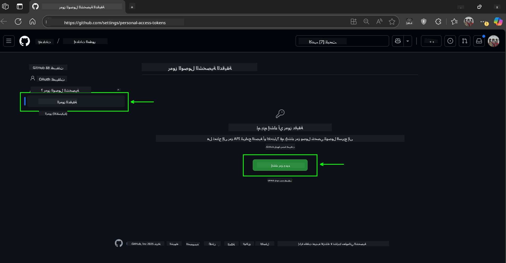
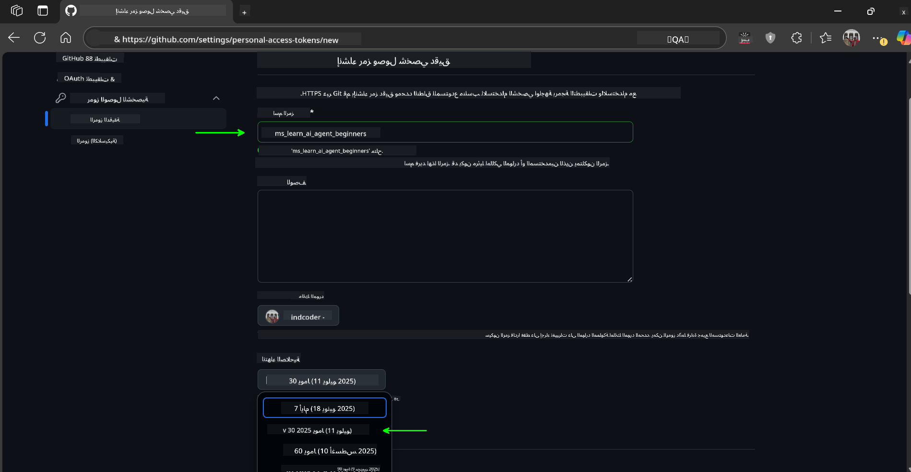

<!--
CO_OP_TRANSLATOR_METADATA:
{
  "original_hash": "76945069b52a49cd0432ae3e0b0ba22e",
  "translation_date": "2025-07-12T07:43:28+00:00",
  "source_file": "00-course-setup/README.md",
  "language_code": "ar"
}
-->
في حساب GitHub الخاص بك.

اختر خيار `Fine-grained tokens` على الجانب الأيسر من شاشتك.

    ثم اختر `Generate new token`.

    

1. أدخل اسمًا وصفيًا للرمز يعكس الغرض منه، مما يسهل التعرف عليه لاحقًا. قم بتعيين تاريخ انتهاء الصلاحية (موصى به: 30 يومًا؛ يمكنك اختيار فترة أقصر مثل 7 أيام إذا كنت تفضل وضعًا أكثر أمانًا).

    

1. قم بتحديد نطاق الرمز ليقتصر على النسخة المستنسخة من هذا المستودع.

    

1. قم بتقييد أذونات الرمز: ضمن **Permissions**، قم بتفعيل **Account Permissions**، وانتقل إلى **Models** وقم بتمكين الوصول للقراءة فقط المطلوب لنماذج GitHub.

    

    

انسخ الرمز الجديد الذي قمت بإنشائه الآن. ستقوم بإضافته إلى ملف `.env` المضمن في هذه الدورة.

### الخطوة 2: إنشاء ملف `.env`

لإنشاء ملف `.env`، قم بتشغيل الأمر التالي في الطرفية.

```bash
cp .env.example .env
```

سيقوم هذا بنسخ ملف المثال وإنشاء ملف `.env` في مجلدك حيث يمكنك ملء القيم لمتغيرات البيئة.

بعد نسخ الرمز الخاص بك، افتح ملف `.env` في محرر النصوص المفضل لديك والصق الرمز في الحقل `GITHUB_TOKEN`.

يجب أن تكون الآن قادرًا على تشغيل نماذج الكود لهذه الدورة.

## الإعداد لتشغيل العينات باستخدام Azure AI Foundry وخدمة Azure AI Agent

### الخطوة 1: استرجاع نقطة النهاية لمشروع Azure الخاص بك

اتبع الخطوات لإنشاء مركز ومشروع في Azure AI Foundry الموجودة هنا: [نظرة عامة على موارد المركز](https://learn.microsoft.com/en-us/azure/ai-foundry/concepts/ai-resources)

بمجرد إنشاء مشروعك، ستحتاج إلى استرجاع سلسلة الاتصال الخاصة بمشروعك.

يمكنك فعل ذلك بالذهاب إلى صفحة **نظرة عامة** لمشروعك في بوابة Azure AI Foundry.


### الخطوة 2: إنشاء ملف `.env`

لإنشاء ملف `.env`، قم بتشغيل الأمر التالي في الطرفية.

```bash
cp .env.example .env
```

سيقوم هذا بنسخ ملف المثال وإنشاء ملف `.env` في مجلدك حيث يمكنك ملء القيم لمتغيرات البيئة.

بعد نسخ الرمز الخاص بك، افتح ملف `.env` في محرر النصوص المفضل لديك والصق الرمز في الحقل `PROJECT_ENDPOINT`.

### الخطوة 3: تسجيل الدخول إلى Azure

كأفضل ممارسة أمنية، سنستخدم [المصادقة بدون مفتاح](https://learn.microsoft.com/azure/developer/ai/keyless-connections?tabs=csharp%2Cazure-cli?WT.mc_id=academic-105485-koreyst) للمصادقة على Azure OpenAI باستخدام Microsoft Entra ID. قبل أن تتمكن من القيام بذلك، ستحتاج أولاً إلى تثبيت **Azure CLI** وفقًا لـ [تعليمات التثبيت](https://learn.microsoft.com/cli/azure/install-azure-cli?WT.mc_id=academic-105485-koreyst) لنظام التشغيل الخاص بك.

بعد ذلك، افتح الطرفية وقم بتشغيل `az login --use-device-code` لتسجيل الدخول إلى حساب Azure الخاص بك.

بمجرد تسجيل الدخول، اختر اشتراكك في الطرفية.

## متغيرات بيئة إضافية - Azure Search و Azure OpenAI

في درس Agentic RAG - الدرس 5 - هناك عينات تستخدم Azure Search و Azure OpenAI.

إذا كنت ترغب في تشغيل هذه العينات، ستحتاج إلى إضافة متغيرات البيئة التالية إلى ملف `.env` الخاص بك:

### صفحة النظرة العامة (المشروع)

- `AZURE_SUBSCRIPTION_ID` - تحقق من **تفاصيل المشروع** في صفحة **Overview** لمشروعك.

- `AZURE_AI_PROJECT_NAME` - انظر إلى أعلى صفحة **Overview** لمشروعك.

- `AZURE_OPENAI_SERVICE` - ابحث عن هذا في علامة التبويب **Included capabilities** لخدمة **Azure OpenAI Service** في صفحة **Overview**.

### مركز الإدارة

- `AZURE_OPENAI_RESOURCE_GROUP` - انتقل إلى **خصائص المشروع** في صفحة **Overview** لمركز الإدارة.

- `GLOBAL_LLM_SERVICE` - تحت **الموارد المتصلة**، ابحث عن اسم اتصال **خدمات Azure AI**. إذا لم يكن مدرجًا، تحقق من **بوابة Azure** ضمن مجموعة الموارد الخاصة بك لاسم مورد خدمات AI.

### صفحة النماذج + نقاط النهاية

- `AZURE_OPENAI_EMBEDDING_DEPLOYMENT_NAME` - اختر نموذج التضمين الخاص بك (مثل `text-embedding-ada-002`) ولاحظ **اسم النشر** من تفاصيل النموذج.

- `AZURE_OPENAI_CHAT_DEPLOYMENT_NAME` - اختر نموذج الدردشة الخاص بك (مثل `gpt-4o-mini`) ولاحظ **اسم النشر** من تفاصيل النموذج.

### بوابة Azure

- `AZURE_OPENAI_ENDPOINT` - ابحث عن **خدمات Azure AI**، انقر عليها، ثم اذهب إلى **إدارة الموارد**، **المفاتيح ونقطة النهاية**، ومرر للأسفل إلى "نقاط نهاية Azure OpenAI"، وانسخ النقطة التي تقول "واجهات برمجة التطبيقات اللغوية".

- `AZURE_OPENAI_API_KEY` - من نفس الشاشة، انسخ المفتاح 1 أو المفتاح 2.

- `AZURE_SEARCH_SERVICE_ENDPOINT` - ابحث عن مورد **Azure AI Search** الخاص بك، انقر عليه، واطلع على **النظرة العامة**.

- `AZURE_SEARCH_API_KEY` - ثم انتقل إلى **الإعدادات** ثم **المفاتيح** لنسخ المفتاح الإداري الأساسي أو الثانوي.

### صفحة ويب خارجية

- `AZURE_OPENAI_API_VERSION` - قم بزيارة صفحة [دورة حياة إصدار API](https://learn.microsoft.com/en-us/azure/ai-services/openai/api-version-deprecation#latest-ga-api-release) ضمن **أحدث إصدار API GA**.

### إعداد المصادقة بدون مفاتيح

بدلاً من ترميز بيانات الاعتماد الخاصة بك بشكل ثابت، سنستخدم اتصالًا بدون مفتاح مع Azure OpenAI. للقيام بذلك، سنستورد `DefaultAzureCredential` وسنستدعي لاحقًا دالة `DefaultAzureCredential` للحصول على بيانات الاعتماد.

```python
from azure.identity import DefaultAzureCredential, InteractiveBrowserCredential
```

## هل واجهت مشكلة؟

إذا واجهت أي مشاكل في تشغيل هذا الإعداد، انضم إلى مجتمعنا

أو

.

## الدرس التالي

أنت الآن جاهز لتشغيل نماذج الكود لهذه الدورة. نتمنى لك تعلمًا ممتعًا عن عالم وكلاء الذكاء الاصطناعي!

[مقدمة عن وكلاء الذكاء الاصطناعي وحالات الاستخدام](../01-intro-to-ai-agents/README.md)

**إخلاء المسؤولية**:  
تم ترجمة هذا المستند باستخدام خدمة الترجمة بالذكاء الاصطناعي [Co-op Translator](https://github.com/Azure/co-op-translator). بينما نسعى لتحقيق الدقة، يرجى العلم أن الترجمات الآلية قد تحتوي على أخطاء أو معلومات غير دقيقة. يجب اعتبار المستند الأصلي بلغته الأصلية المصدر الموثوق. للحصول على معلومات حاسمة، يُوصى بالاستعانة بترجمة بشرية احترافية. نحن غير مسؤولين عن أي سوء فهم أو تفسيرات خاطئة تنشأ عن استخدام هذه الترجمة.