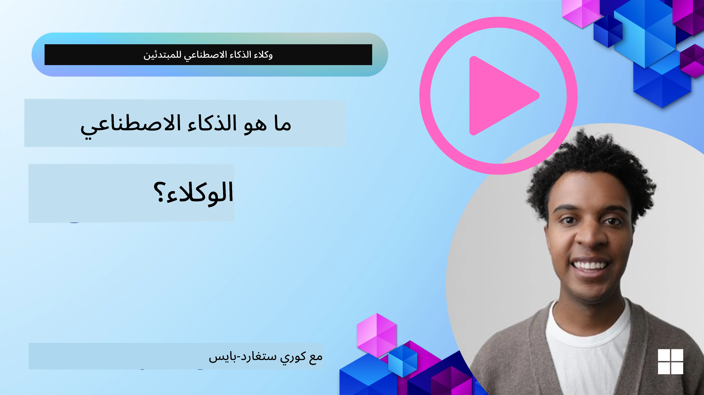
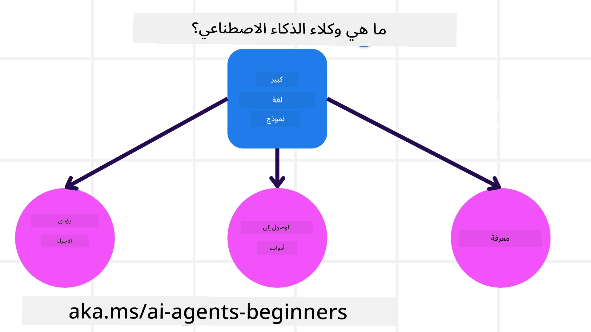
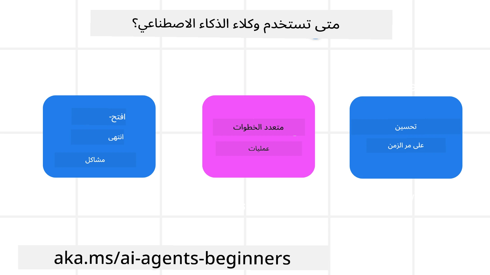

> _(انقر على الصورة أعلاه لمشاهدة فيديو هذا الدرس)_

# مقدمة في وكلاء الذكاء الاصطناعي وحالات استخدام الوكلاء

مرحبًا بكم في دورة "AI Agents for Beginners"! تقدم هذه الدورة معرفة أساسية وأمثلة عملية لبناء وكلاء الذكاء الاصطناعي.

انضم إلى <a href="https://discord.gg/kzRShWzttr" target="_blank">مجتمع Azure AI على Discord</a> للالتقاء بمتعلمين آخرين وبناة وكلاء الذكاء الاصطناعي وطرح أي أسئلة لديك حول هذه الدورة.

لبدء هذه الدورة، نبدأ بفهم أفضل لما هي وكلاء الذكاء الاصطناعي وكيف يمكننا استخدامها في التطبيقات وسير العمل التي نبنيها.

## مقدمة

يغطي هذا الدرس:

- ما هي وكلاء الذكاء الاصطناعي وما هي الأنواع المختلفة للوكلاء؟
- ما حالات الاستخدام التي تناسب وكلاء الذكاء الاصطناعي وكيف يمكنهم مساعدتنا؟
- ما هي بعض اللبنات الأساسية عند تصميم حلول عاملية؟

## أهداف التعلم
بعد إكمال هذا الدرس، يجب أن تكون قادرًا على:

- فهم مفاهيم وكلاء الذكاء الاصطناعي وكيف تختلف عن حلول الذكاء الاصطناعي الأخرى.
- تطبيق وكلاء الذكاء الاصطناعي بأكثر الطرق كفاءة.
- تصميم حلول عاملة بشكل منتج لكل من المستخدمين والعملاء.

## تعريف وكلاء الذكاء الاصطناعي وأنواع وكلاء الذكاء الاصطناعي

### ما هي وكلاء الذكاء الاصطناعي؟

وكلاء الذكاء الاصطناعي هم **أنظمة** تمكّن **النماذج اللغوية الكبيرة(LLMs)** من **أداء إجراءات** من خلال توسيع قدراتهم بمنح نماذج LLMs **الوصول إلى أدوات** و**المعرفة**.

لنقسّم هذا التعريف إلى أجزاء أصغر:

- **نظام** - من المهم التفكير في الوكلاء ليس كمكوّن واحد فقط ولكن كنظام من العديد من المكوّنات. على المستوى الأساسي، مكونات وكيل الذكاء الاصطناعي هي:
  - **البيئة** - المساحة المحددة التي يعمل فيها وكيل الذكاء الاصطناعي. على سبيل المثال، إذا كان لدينا وكيل حجز سفر، يمكن أن تكون البيئة هي نظام حجز السفر الذي يستخدمه الوكيل لإكمال المهام.
  - **أجهزة الاستشعار** - تحتوي البيئات على معلومات وتقدّم ملاحظات. يستخدم وكلاء الذكاء الاصطناعي أجهزة الاستشعار لجمع وتفسير هذه المعلومات حول الحالة الحالية للبيئة. في مثال وكيل حجز السفر، يمكن لنظام الحجز أن يزوّد بمعلومات مثل توفر الفنادق أو أسعار الرحلات.
  - **المشغلات** - بمجرد أن يتلقى وكيل الذكاء الاصطناعي الحالة الحالية للبيئة، يحدد الوكيل للإجراء الحالي ما العمل الذي يجب تنفيذه لتغيير البيئة. بالنسبة لوكيل حجز السفر، قد يكون ذلك حجز غرفة متاحة للمستخدم.

**النماذج اللغوية الكبيرة** - وُجد مفهوم الوكلاء قبل إنشاء النماذج اللغوية الكبيرة. ميزة بناء وكلاء الذكاء الاصطناعي باستخدام النماذج اللغوية الكبيرة هي قدرتها على تفسير لغة الإنسان والبيانات. تتيح هذه القدرة للنماذج اللغوية الكبيرة تفسير معلومات البيئة وتحديد خطة لتغيير البيئة.

**أداء إجراءات** - خارج أنظمة وكلاء الذكاء الاصطناعي، تقتصر النماذج اللغوية الكبيرة على الحالات التي يكون فيها الإجراء توليد محتوى أو معلومات استنادًا إلى موجه المستخدم. داخل أنظمة وكلاء الذكاء الاصطناعي، يمكن للنماذج اللغوية الكبيرة إتمام مهام عن طريق تفسير طلب المستخدم واستخدام الأدوات المتاحة في بيئتها.

**الوصول إلى الأدوات** - تحدد الأدوات التي يمكن لنموذج LLM الوصول إليها 1) البيئة التي تعمل فيها و2) مطوّر وكيل الذكاء الاصطناعي. في مثال وكيل السفر الخاص بنا، تقتصر أدوات الوكيل على العمليات المتاحة في نظام الحجز، و/أو يمكن للمطوّر تقييد وصول الوكيل إلى أدوات متعلقة بالرحلات فقط.

**الذاكرة + المعرفة** - يمكن أن تكون الذاكرة قصيرة الأجل في سياق المحادثة بين المستخدم والوكيل. على المدى الطويل، وبخلاف المعلومات المقدمة من البيئة، يمكن لوكلاء الذكاء الاصطناعي أيضًا استرجاع المعرفة من أنظمة وخدمات وأدوات أخرى، وحتى من وكلاء آخرين. في مثال وكيل السفر، قد تكون هذه المعرفة معلومات تفضيلات السفر الخاصة بالمستخدم الموجودة في قاعدة بيانات العملاء.

### الأنواع المختلفة للوكلاء

الآن بعد أن لدينا تعريف عام لوكلاء الذكاء الاصطناعي، دعونا ننظر إلى بعض أنواع الوكلاء المحددة وكيف سيتم تطبيقها على وكيل حجز السفر.

| **Agent Type**                | **Description**                                                                                                                       | **Example**                                                                                                                                                                                                                   |
| ----------------------------- | ------------------------------------------------------------------------------------------------------------------------------------- | ----------------------------------------------------------------------------------------------------------------------------------------------------------------------------------------------------------------------------- |
| **Simple Reflex Agents**      | Perform immediate actions based on predefined rules.                                                                                  | Travel agent interprets the context of the email and forwards travel complaints to customer service.                                                                                                                          |
| **Model-Based Reflex Agents** | Perform actions based on a model of the world and changes to that model.                                                              | Travel agent prioritizes routes with significant price changes based on access to historical pricing data.                                                                                                             |
| **Goal-Based Agents**         | Create plans to achieve specific goals by interpreting the goal and determining actions to reach it.                                  | Travel agent books a journey by determining necessary travel arrangements (car, public transit, flights) from the current location to the destination.                                                                                |
| **Utility-Based Agents**      | Consider preferences and weigh tradeoffs numerically to determine how to achieve goals.                                               | Travel agent maximizes utility by weighing convenience vs. cost when booking travel.                                                                                                                                          |
| **Learning Agents**           | Improve over time by responding to feedback and adjusting actions accordingly.                                                        | Travel agent improves by using customer feedback from post-trip surveys to make adjustments to future bookings.                                                                                                               |
| **Hierarchical Agents**       | Feature multiple agents in a tiered system, with higher-level agents breaking tasks into subtasks for lower-level agents to complete. | Travel agent cancels a trip by dividing the task into subtasks (for example, canceling specific bookings) and having lower-level agents complete them, reporting back to the higher-level agent.                                     |
| **Multi-Agent Systems (MAS)** | Agents complete tasks independently, either cooperatively or competitively.                                                           | Cooperative: Multiple agents book specific travel services such as hotels, flights, and entertainment. Competitive: Multiple agents manage and compete over a shared hotel booking calendar to book customers into the hotel. |

## متى نستخدم وكلاء الذكاء الاصطناعي

في القسم السابق، استخدمنا حالة استخدام وكيل السفر لشرح كيفية استخدام الأنواع المختلفة من الوكلاء في سيناريوهات مختلفة من حجز السفر. سنستمر في استخدام هذا التطبيق طوال الدورة.

دعونا ننظر إلى أنواع حالات الاستخدام التي تناسب استخدام وكلاء الذكاء الاصطناعي بشكل أفضل:

- **المشكلات مفتوحة النهايات** - السماح لنموذج LLM بتحديد الخطوات اللازمة لإكمال مهمة لأنه لا يمكن دائمًا ترميزها بشكل صارم في سير عمل.
- **العمليات متعددة الخطوات** - المهام التي تتطلب مستوى من التعقيد حيث يحتاج وكيل الذكاء الاصطناعي إلى استخدام أدوات أو معلومات على مدى عدة تدويرات بدلاً من استرجاع لمرة واحدة.  
- **التحسين مع مرور الوقت** - المهام التي يمكن للوكيل أن يتحسّن فيها مع مرور الوقت من خلال تلقي ملاحظات من بيئته أو من المستخدمين من أجل تقديم منفعة أفضل.

نغطي المزيد من الاعتبارات لاستخدام وكلاء الذكاء الاصطناعي في درس بناء وكلاء ذكاء اصطناعي موثوقين.

## أساسيات الحلول العاملية

### تطوير الوكيل

الخطوة الأولى في تصميم نظام وكيل الذكاء الاصطناعي هي تحديد الأدوات والإجراءات والسلوكيات. في هذه الدورة، نركّز على استخدام **خدمة Azure AI Agent** لتحديد وكلائنا. فهي تقدم ميزات مثل:

- اختيار نماذج مفتوحة مثل OpenAI وMistral وLlama
- استخدام بيانات مرخّصة عبر مزودين مثل Tripadvisor
- استخدام أدوات OpenAPI 3.0 المعيارية

### أنماط Agentic

التواصل مع النماذج اللغوية الكبيرة يتم من خلال الموجهات. نظرًا للطبيعة شبه المستقلة للوكلاء، ليس من الممكن دائمًا أو مطلوبًا إعادة توجيه النموذج يدويًا بعد حدوث تغيير في البيئة. نستخدم **أنماط Agentic** التي تسمح لنا بموجهة النموذج على عدة خطوات بطريقة أكثر قابلية للتوسع.

تنقسم هذه الدورة إلى بعض الأنماط Agentic الشائعة الحالية.

### أُطر Agentic

تسمح أُطر Agentic للمطورين بتنفيذ أنماط Agentic من خلال الشيفرة. تقدم هذه الأُطر قوالب وإضافات وأدوات لتحسين تعاون الوكلاء. توفر هذه المزايا قدرات لرصد أفضل واستكشاف أخطاء أنظمة الوكلاء وإصلاحها.

في هذه الدورة، سنستكشف Microsoft Agent Framework (MAF) لبناء وكلاء جاهزين للإنتاج.

## أمثلة الشيفرة

- Python: [Agent Framework](./code_samples/01-python-agent-framework.ipynb)
- .NET: [Agent Framework](./code_samples/01-dotnet-agent-framework.md)

## هل لديك المزيد من الأسئلة حول وكلاء الذكاء الاصطناعي؟

انضم إلى [مجتمع Microsoft Foundry على Discord](https://aka.ms/ai-agents/discord) للالتقاء بمتعلمين آخرين، وحضور ساعات المكتب والحصول على إجابات لأسئلتك حول وكلاء الذكاء الاصطناعي.

## الدرس السابق

[Course Setup](../00-course-setup/README.md)

## الدرس التالي

[Exploring Agentic Frameworks](../02-explore-agentic-frameworks/README.md)

---

<!-- CO-OP TRANSLATOR DISCLAIMER START -->
إخلاء المسؤولية:
تمت ترجمة هذا المستند باستخدام خدمة الترجمة الآلية [Co-op Translator](https://github.com/Azure/co-op-translator). بينما نسعى للدقة، يُرجى ملاحظة أن الترجمات الآلية قد تحتوي على أخطاء أو عدم دقة. يجب اعتبار الوثيقة الأصلية بلغتها الأصلية المصدر المرجعي والموثوق. للمعلومات الحساسة أو الحرجة، يوصَى بالاستعانة بمترجم بشري محترف. لسنا مسؤولين عن أي سوء فهم أو تفسيرات خاطئة تنشأ عن استخدام هذه الترجمة.
<!-- CO-OP TRANSLATOR DISCLAIMER END -->