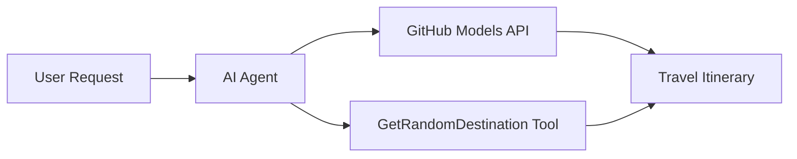

# 🌍 وكيل السفر الذكي باستخدام إطار عمل Microsoft Agent (.NET)

## 📋 نظرة عامة على السيناريو

يستعرض هذا الدفتر كيفية بناء وكيل ذكي لتخطيط السفر باستخدام إطار عمل Microsoft Agent لـ .NET. يمكن للوكيل إنشاء خطط رحلات يومية مخصصة تلقائيًا لوجهات عشوائية حول العالم.

**القدرات الرئيسية:**
- 🎲 **اختيار الوجهة العشوائية**: يستخدم أداة مخصصة لاختيار أماكن العطلات
- 🗺️ **تخطيط رحلات ذكي**: ينشئ خطط يومية مفصلة للرحلات
- 🔄 **البث في الوقت الحقيقي**: يدعم الاستجابات الفورية والمستمرة
- 🛠️ **دمج الأدوات المخصصة**: يوضح كيفية توسيع قدرات الوكيل

## 🔧 الهيكل الفني

### التقنيات الأساسية
- **إطار عمل Microsoft Agent**: أحدث تنفيذ لـ .NET لتطوير وكلاء الذكاء الاصطناعي
- **دمج نماذج GitHub**: يستخدم خدمة استنتاج نماذج الذكاء الاصطناعي من GitHub
- **التوافق مع OpenAI API**: يعتمد على مكتبات عملاء OpenAI مع نقاط نهاية مخصصة
- **التكوين الآمن**: إدارة مفاتيح API بناءً على البيئة

### المكونات الرئيسية
1. **AIAgent**: المنسق الرئيسي للوكيل الذي يدير تدفق المحادثة
2. **الأدوات المخصصة**: وظيفة `GetRandomDestination()` المتاحة للوكيل
3. **عميل المحادثة**: واجهة محادثة مدعومة بنماذج GitHub
4. **دعم البث**: قدرات إنشاء الاستجابات في الوقت الحقيقي

### نمط التكامل


## 🚀 البدء

**المتطلبات الأساسية:**
- .NET 9.0 أو أعلى
- رمز الوصول إلى API لنماذج GitHub
- متغيرات البيئة مهيأة في ملف `.env`

**متغيرات البيئة المطلوبة:**
```env
GITHUB_TOKEN=your_github_token
GITHUB_ENDPOINT=https://models.inference.ai.azure.com
GITHUB_MODEL_ID=gpt-4o-mini
```

قم بتشغيل الخلايا أدناه بالتسلسل لرؤية وكيل السفر أثناء العمل!

---

## .NET Single File App: AI Travel Agent Example

See `01-dotnet-agent-framework.cs` for the complete runnable code sample.

قم بتشغيل نموذج الكود أدناه:

```bash
dotnet run 01-dotnet-agent-framework.cs
```

### Sample Code

```csharp
static string GetRandomDestination()
{
    var destinations = new List<string>
    {
        "Paris, France",
        "Tokyo, Japan",
        "New York City, USA",
        "Sydney, Australia",
        "Rome, Italy",
        "Barcelona, Spain",
        "Cape Town, South Africa",
        "Rio de Janeiro, Brazil",
        "Bangkok, Thailand",
        "Vancouver, Canada"
    };
    var random = new Random();
    int index = random.Next(destinations.Count);
    return destinations[index];
}

// Extract configuration from environment variables
var github_endpoint = Environment.GetEnvironmentVariable("GITHUB_ENDPOINT") ?? throw new InvalidOperationException("GITHUB_ENDPOINT is not set.");
var github_model_id = Environment.GetEnvironmentVariable("GITHUB_MODEL_ID") ?? "gpt-4o-mini";
var github_token = Environment.GetEnvironmentVariable("GITHUB_TOKEN") ?? throw new InvalidOperationException("GITHUB_TOKEN is not set.");

// Configure OpenAI Client Options
var openAIOptions = new OpenAIClientOptions()
{
    Endpoint = new Uri(github_endpoint)
};

// Initialize OpenAI Client with GitHub Models Configuration
var openAIClient = new OpenAIClient(new ApiKeyCredential(github_token), openAIOptions);

// Create AI Agent with Travel Planning Capabilities
AIAgent agent = openAIClient
    .GetChatClient(github_model_id)
    .CreateAIAgent(
        instructions: "You are a helpful AI Agent that can help plan vacations for customers at random destinations",
        tools: [AIFunctionFactory.Create(GetRandomDestination)]
    );

// Execute Agent: Plan a Day Trip (Non-Streaming)
Console.WriteLine(await agent.RunAsync("Plan me a day trip"));

// Execute Agent: Plan a Day Trip (Streaming Response)
await foreach (var update in agent.RunStreamingAsync("Plan me a day trip"))
{
    Console.Write(update);
}
```
