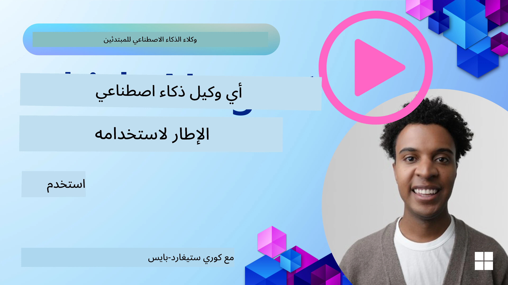

[](https://youtu.be/ODwF-EZo_O8?si=1xoy_B9RNQfrYdF7)

> _(انقر على الصورة أعلاه لمشاهدة فيديو هذا الدرس)_

# استكشاف أُطُر وكلاء الذكاء الاصطناعي

أُطُر وكلاء الذكاء الاصطناعي هي منصات برمجية مصممة لتبسيط إنشاء ونشر وإدارة وكلاء الذكاء الاصطناعي. توفر هذه الأُطُر للمطوِّرين مكونات جاهزة، وتجريدات، وأدوات تُسهِم في تسريع تطوير أنظمة الذكاء الاصطناعي المعقدة.

تساعد هذه الأُطُر المطوِّرين على التركيز على الجوانب الفريدة لتطبيقاتهم من خلال توفير نهج موحَّد للتحديات الشائعة في تطوير وكلاء الذكاء الاصطناعي. فهي تعزز القابلية للتوسع، وسهولة الوصول، والكفاءة في بناء أنظمة الذكاء الاصطناعي.

## المقدمة 

سيغطي هذا الدرس ما يلي:

- ما هي أُطُر وكلاء الذكاء الاصطناعي وماذا تُمكن المطورين من تحقيقه؟
- كيف يمكن للفرق استخدام هذه الأُطُر لنمذجة أولية سريعة، والتكرار، وتحسين قدرات وكيلهم؟
- ما الفروقات بين الأُطُر والأدوات التي أنشأتها Microsoft (<a href="https://aka.ms/ai-agents-beginners/ai-agent-service" target="_blank">خدمة Azure AI Agent</a> و <a href="https://learn.microsoft.com/azure/ai-services/openai/how-to/responses" target="_blank">إطار عمل Microsoft Agent</a>)؟
- هل يمكنني دمج أدواتي الحالية في منظومة Azure مباشرة، أم أحتاج حلولاً مستقلة؟
- ما هي خدمة Azure AI Agents وكيف تساعدني؟

## أهداف التعلم

تهدف هذه الدرسة إلى مساعدتك على فهم:

- دور أُطُر وكلاء الذكاء الاصطناعي في تطوير الذكاء الاصطناعي.
- كيفية الاستفادة من أُطُر وكلاء الذكاء الاصطناعي لبناء وكلاء ذكيين.
- القدرات الرئيسية التي تُمكّنها أُطُر وكلاء الذكاء الاصطناعي.
- الفروقات بين إطار عمل Microsoft Agent وخدمة Azure AI Agent.

## ما هي أُطُر وكلاء الذكاء الاصطناعي وماذا تُمكّن المطورين من القيام به؟

يمكن للأُطُر التقليدية للذكاء الاصطناعي أن تساعدك في دمج الذكاء الاصطناعي في تطبيقاتك وتحسين هذه التطبيقات بالطرق التالية:

- **التخصيص**: يمكن للذكاء الاصطناعي تحليل سلوك وتفضيلات المستخدم لتقديم توصيات ومحتوى وتجارب مخصَّصة.
مثال: تستخدم خدمات البث مثل Netflix الذكاء الاصطناعي لاقتراح أفلام وعروض استنادًا إلى تاريخ المشاهدة، مما يعزز تفاعل المستخدم ورضاه.
- **الأتمتة والكفاءة**: يمكن للذكاء الاصطناعي أتمتة المهام المتكررة، وتبسيط سير العمل، وتحسين الكفاءة التشغيلية.
مثال: تستخدم تطبيقات خدمة العملاء روبوتات دردشة مدعومة بالذكاء الاصطناعي للتعامل مع الاستفسارات الشائعة، مما يقلل أوقات الاستجابة ويتيح لوكلاء البشر التعامل مع القضايا الأكثر تعقيدًا.
- **تحسين تجربة المستخدم**: يمكن للذكاء الاصطناعي تحسين تجربة المستخدم العامة بتوفير ميزات ذكية مثل التعرف على الصوت، ومعالجة اللغة الطبيعية، والنص التنبؤي.
مثال: تستخدم المساعدات الافتراضية مثل Siri وGoogle Assistant الذكاء الاصطناعي لفهم والاستجابة لأوامر الصوت، مما يسهل على المستخدمين التفاعل مع أجهزتهم.

### كل هذا يبدو رائعًا، فلماذا نحتاج إلى إطار عمل لوكلاء الذكاء الاصطناعي؟

تمثل أُطُر وكلاء الذكاء الاصطناعي شيئًا أكثر من مجرد أُطُر ذكاء اصطناعي تقليدية. فهي مصممة لتمكين إنشاء وكلاء ذكيين يمكنهم التفاعل مع المستخدمين، ووكلاء آخرين، والبيئة لتحقيق أهداف محددة. يمكن لهؤلاء الوكلاء إظهار سلوك مستقل، واتخاذ قرارات، والتكيف مع الظروف المتغيرة. لنلقِ نظرة على بعض القدرات الرئيسية التي تُمكّنها أُطُر وكلاء الذكاء الاصطناعي:

- **تعاون وتنسيق الوكلاء**: تمكّن إنشاء عدة وكلاء ذكاء اصطناعي يمكنهم العمل معًا والتواصل والتنسيق لحل مهام معقدة.
- **أتمتة وإدارة المهام**: توفر آليات لأتمتة سير عمل متعدد الخطوات، وتفويض المهام، وإدارة المهام ديناميكيًا بين الوكلاء.
- **فهم سياقي والتكيف**: تزود الوكلاء بقدرة على فهم السياق، والتكيف مع البيئات المتغيرة، واتخاذ قرارات استنادًا إلى معلومات في الوقت الفعلي.

خلاصة القول، تتيح لك الوكلاء تحقيق المزيد، والارتقاء بالأتمتة إلى مستوى أعلى، وإنشاء أنظمة أكثر ذكاءً يمكنها التكيف والتعلم من بيئتها.

## كيف تنمذج بسرعة، وتتكرر، وتحسن قدرات الوكيل بسرعة؟

هذا مشهد متحرك بسرعة، لكن هناك بعض الأمور الشائعة عبر معظم أُطُر وكلاء الذكاء الاصطناعي التي يمكن أن تساعدك على النمذجة الأولية والتكرار سريعًا وهي المكونات المعيارية، وأدوات التعاون، والتعلم في الوقت الفعلي. دعونا نتعمق في هذه النقاط:

- **استخدم مكونات معيارية**: تقدم SDKs مكونات جاهزة مثل موصّلات AI والذاكرة، واستدعاء الدوال باستخدام اللغة الطبيعية أو مكونات إضافية برمجية (plugins)، وقوالب المطالبة، والمزيد.
- **استفد من أدوات التعاون**: صمم وكلاء بأدوار ومهام محددة، مما يمكّنهم من اختبار وصقل سير العمل التعاوني.
- **تعلّم في الزمن الحقيقي**: نفّذ حلقات تغذية راجعة حيث يتعلم الوكلاء من التفاعلات ويضبطون سلوكهم ديناميكيًا.

### استخدم المكونات المعيارية

تقدم SDKs مثل إطار عمل Microsoft Agent مكونات جاهزة مثل موصلات AI، تعريفات الأدوات، وإدارة الوكلاء.

**كيف يمكن للفرق استخدام هذه**: يمكن للفرق تجميع هذه المكونات بسرعة لإنشاء نموذج أولي وظيفي دون البدء من الصفر، مما يسمح بالتجريب السريع والتكرار.

**كيف يعمل ذلك عمليًا**: يمكنك استخدام محلل مسبق البناء لاستخراج المعلومات من مدخلات المستخدم، ووحدة ذاكرة لتخزين واسترجاع البيانات، ومولد مطالبات للتفاعل مع المستخدمين، وكل ذلك دون الحاجة لبناء هذه المكونات من الصفر.

**مثال على الكود**. لننظر إلى مثال عن كيفية استخدام إطار عمل Microsoft Agent مع `AzureAIProjectAgentProvider` لجعل النموذج يستجيب لمدخلات المستخدم مع استدعاء أدوات:

``` python
# مثال على إطار عمل وكيل مايكروسوفت بلغة بايثون

import asyncio
import os
from typing import Annotated

from agent_framework.azure import AzureAIProjectAgentProvider
from azure.identity import AzureCliCredential


# تعريف دالة أداة نموذجية لحجز السفر
def book_flight(date: str, location: str) -> str:
    """Book travel given location and date."""
    return f"Travel was booked to {location} on {date}"


async def main():
    provider = AzureAIProjectAgentProvider(credential=AzureCliCredential())
    agent = await provider.create_agent(
        name="travel_agent",
        instructions="Help the user book travel. Use the book_flight tool when ready.",
        tools=[book_flight],
    )

    response = await agent.run("I'd like to go to New York on January 1, 2025")
    print(response)
    # النتيجة النموذجية: تم حجز رحلتك إلى نيويورك في 1 يناير 2025 بنجاح. رحلات آمنة! ✈️🗽


if __name__ == "__main__":
    asyncio.run(main())
```

ما يمكنك ملاحظته من هذا المثال هو كيف يمكنك الاستفادة من محلل مسبق البناء لاستخراج المعلومات الأساسية من مدخلات المستخدم، مثل الأصل والوجهة وتاريخ طلب حجز رحلة. يتيح لك هذا النهج المعياري التركيز على المنطق على مستوى أعلى.

### الاستفادة من أدوات التعاون

تسهل أُطُر مثل إطار عمل Microsoft Agent إنشاء عدة وكلاء يمكنهم العمل معًا.

**كيف يمكن للفرق استخدام هذه**: يمكن للفرق تصميم وكلاء بأدوار ومهام محددة، مما يمكّنهم من اختبار وصقل سير العمل التعاوني وتحسين كفاءة النظام بشكل عام.

**كيف يعمل ذلك عمليًا**: يمكنك إنشاء فريق من الوكلاء حيث يتمتع كل وكيل بوظيفة متخصصة، مثل استرجاع البيانات، التحليل، أو اتخاذ القرار. يمكن لهؤلاء الوكلاء التواصل ومشاركة المعلومات لتحقيق هدف مشترك، مثل الإجابة على استفسار المستخدم أو إكمال مهمة.

**مثال على الكود (إطار عمل Microsoft Agent)**:

```python
# إنشاء عدة وكلاء يعملون معًا باستخدام إطار عمل وكيل مايكروسوفت

import os
from agent_framework.azure import AzureAIProjectAgentProvider
from azure.identity import AzureCliCredential

provider = AzureAIProjectAgentProvider(credential=AzureCliCredential())

# وكيل استرجاع البيانات
agent_retrieve = await provider.create_agent(
    name="dataretrieval",
    instructions="Retrieve relevant data using available tools.",
    tools=[retrieve_tool],
)

# وكيل تحليل البيانات
agent_analyze = await provider.create_agent(
    name="dataanalysis",
    instructions="Analyze the retrieved data and provide insights.",
    tools=[analyze_tool],
)

# تشغيل الوكلاء بالتسلسل على مهمة
retrieval_result = await agent_retrieve.run("Retrieve sales data for Q4")
analysis_result = await agent_analyze.run(f"Analyze this data: {retrieval_result}")
print(analysis_result)
```

ما تراه في الكود السابق هو كيف يمكنك إنشاء مهمة تتضمن عدة وكلاء يعملون معًا لتحليل البيانات. يؤدي كل وكيل وظيفة محددة، وتُنفَّذ المهمة عبر تنسيق عمل الوكلاء لتحقيق النتيجة المطلوبة. من خلال إنشاء وكلاء مكرّسين بأدوار متخصصة، يمكنك تحسين كفاءة وأداء المهام.

### التعلُّم في الوقت الفعلي

توفر الأُطُر المتقدمة قدرات لفهم السياق في الوقت الفعلي والتكيف.

**كيف يمكن للفرق استخدام هذه**: يمكن للفرق تنفيذ حلقات تغذية راجعة حيث يتعلم الوكلاء من التفاعلات ويضبطون سلوكهم ديناميكيًا، مما يؤدي إلى تحسين مستمر وصقل للقدرات.

**كيف يعمل ذلك عمليًا**: يمكن للوكلاء تحليل ملاحظات المستخدم، وبيانات البيئة، ونتائج المهام لتحديث قاعدة معارفهم، وضبط خوارزميات اتخاذ القرار، وتحسين الأداء مع مرور الوقت. تُمكّن عملية التعلم التكرارية هذه الوكلاء من التكيف مع الظروف المتغيرة وتفضيلات المستخدمين، مما يعزز فعالية النظام الشاملة.

## ما الفروقات بين إطار عمل Microsoft Agent وخدمة Azure AI Agent؟

هناك العديد من الطرق لمقارنة هذه المقاربات، لكن لنلقِ نظرة على بعض الفروقات الرئيسية من حيث التصميم، والقدرات، وحالات الاستخدام المستهدفة:

## إطار عمل Microsoft Agent (MAF)

يوفر إطار عمل Microsoft Agent SDK مبسَّطًا لبناء وكلاء الذكاء الاصطناعي باستخدام `AzureAIProjectAgentProvider`. يمكّن المطورين من إنشاء وكلاء يستفيدون من نماذج Azure OpenAI مع استدعاء أدوات مدمج، وإدارة المحادثات، وأمن بمستوى المؤسسات عبر هوية Azure.

**حالات الاستخدام**: بناء وكلاء ذكاء اصطناعي جاهزين للإنتاج مع استخدام الأدوات، وسير عمل متعدد الخطوات، وسيناريوهات تكامل على مستوى المؤسسات.

فيما يلي بعض المفاهيم الأساسية المهمة في إطار عمل Microsoft Agent:

- **الوكلاء**. يُنشأ الوكيل عبر `AzureAIProjectAgentProvider` ويُكوَّن باسم، وتعليمات، وأدوات. يمكن للوكيل أن:
  - **معالجة رسائل المستخدم** وتوليد استجابات باستخدام نماذج Azure OpenAI.
  - **استدعاء الأدوات** تلقائيًا استنادًا إلى سياق المحادثة.
  - **الحفاظ على حالة المحادثة** عبر تفاعلات متعددة.

  إليك مقتطف كود يوضح كيفية إنشاء وكيل:

    ```python
    import os
    from agent_framework.azure import AzureAIProjectAgentProvider
    from azure.identity import AzureCliCredential

    provider = AzureAIProjectAgentProvider(credential=AzureCliCredential())
    agent = await provider.create_agent(
        name="my_agent",
        instructions="You are a helpful assistant.",
    )

    response = await agent.run("Hello, World!")
    print(response)
    ```

- **الأدوات**. يدعم الإطار تعريف الأدوات كدوال Python يمكن للوكيل استدعاؤها تلقائيًا. تُسجَّل الأدوات عند إنشاء الوكيل:

    ```python
    def get_weather(location: str) -> str:
        """Get the current weather for a location."""
        return f"The weather in {location} is sunny, 72\u00b0F."

    agent = await provider.create_agent(
        name="weather_agent",
        instructions="Help users check the weather.",
        tools=[get_weather],
    )
    ```

- **تنسيق عدة وكلاء**. يمكنك إنشاء عدة وكلاء بتخصصات مختلفة وتنسيق عملهم:

    ```python
    planner = await provider.create_agent(
        name="planner",
        instructions="Break down complex tasks into steps.",
    )

    executor = await provider.create_agent(
        name="executor",
        instructions="Execute the planned steps using available tools.",
        tools=[execute_tool],
    )

    plan = await planner.run("Plan a trip to Paris")
    result = await executor.run(f"Execute this plan: {plan}")
    ```

- **تكامل هوية Azure**. يستخدم الإطار `AzureCliCredential` (أو `DefaultAzureCredential`) للمصادقة الآمنة بدون مفاتيح، مما يلغي الحاجة لإدارة مفاتيح API مباشرةً.

## خدمة Azure AI Agent

تعد خدمة Azure AI Agent إضافة أحدث، تم تقديمها في Microsoft Ignite 2024. تتيح تطوير ونشر وكلاء الذكاء الاصطناعي مع نماذج أكثر مرونة، مثل استدعاء نماذج مفتوحة المصدر مباشرةً مثل Llama 3 وMistral وCohere.

توفر خدمة Azure AI Agent آليات أمان أقوى للمؤسسات وطرق تخزين بيانات، مما يجعلها مناسبة لتطبيقات المؤسسات.

تعمل خارج الصندوق مع إطار عمل Microsoft Agent لبناء ونشر الوكلاء.

الخدمة حاليًا في العرض العام التمهيدي (Public Preview) وتدعم Python وC# لبناء الوكلاء.

باستخدام SDK بايثون لخدمة Azure AI Agent، يمكننا إنشاء وكيل مع أداة يعرّفها المستخدم:

```python
import asyncio
from azure.identity import DefaultAzureCredential
from azure.ai.projects import AIProjectClient

# تعريف وظائف الأداة
def get_specials() -> str:
    """Provides a list of specials from the menu."""
    return """
    Special Soup: Clam Chowder
    Special Salad: Cobb Salad
    Special Drink: Chai Tea
    """

def get_item_price(menu_item: str) -> str:
    """Provides the price of the requested menu item."""
    return "$9.99"


async def main() -> None:
    credential = DefaultAzureCredential()
    project_client = AIProjectClient.from_connection_string(
        credential=credential,
        conn_str="your-connection-string",
    )

    agent = project_client.agents.create_agent(
        model="gpt-4o-mini",
        name="Host",
        instructions="Answer questions about the menu.",
        tools=[get_specials, get_item_price],
    )

    thread = project_client.agents.create_thread()

    user_inputs = [
        "Hello",
        "What is the special soup?",
        "How much does that cost?",
        "Thank you",
    ]

    for user_input in user_inputs:
        print(f"# User: '{user_input}'")
        message = project_client.agents.create_message(
            thread_id=thread.id,
            role="user",
            content=user_input,
        )
        run = project_client.agents.create_and_process_run(
            thread_id=thread.id, agent_id=agent.id
        )
        messages = project_client.agents.list_messages(thread_id=thread.id)
        print(f"# Agent: {messages.data[0].content[0].text.value}")


if __name__ == "__main__":
    asyncio.run(main())
```

### المفاهيم الأساسية

تحتوي خدمة Azure AI Agent على المفاهيم الأساسية التالية:

- **الوكيل**. تتكامل خدمة Azure AI Agent مع Microsoft Foundry. داخل AI Foundry، يعمل وكيل الذكاء الاصطناعي كـ "خدمة ميكرو ذكية" يمكن استخدامها للإجابة على الأسئلة (RAG)، أو تنفيذ إجراءات، أو أتمتة سير العمل بالكامل. يحقّق ذلك من خلال دمج قوة نماذج التوليد مع أدوات تتيح له الوصول إلى مصادر بيانات العالم الحقيقي والتفاعل معها. فيما يلي مثال على وكيل:

    ```python
    agent = project_client.agents.create_agent(
        model="gpt-4o-mini",
        name="my-agent",
        instructions="You are helpful agent",
        tools=code_interpreter.definitions,
        tool_resources=code_interpreter.resources,
    )
    ```

    في هذا المثال، يتم إنشاء وكيل باستخدام النموذج `gpt-4o-mini`، واسم `my-agent`، وتعليمات `You are helpful agent`. يُزَوَّد الوكيل بالأدوات والموارد لأداء مهام تفسير الكود.

- **الخيط والرسائل**. الخيط مفهوم مهم آخر. يمثل المحادثة أو التفاعل بين الوكيل والمستخدم. يمكن استخدام الخيوط لتتبع تقدم المحادثة، وتخزين معلومات السياق، وإدارة حالة التفاعل. إليك مثالًا على خيط:

    ```python
    thread = project_client.agents.create_thread()
    message = project_client.agents.create_message(
        thread_id=thread.id,
        role="user",
        content="Could you please create a bar chart for the operating profit using the following data and provide the file to me? Company A: $1.2 million, Company B: $2.5 million, Company C: $3.0 million, Company D: $1.8 million",
    )
    
    # Ask the agent to perform work on the thread
    run = project_client.agents.create_and_process_run(thread_id=thread.id, agent_id=agent.id)
    
    # Fetch and log all messages to see the agent's response
    messages = project_client.agents.list_messages(thread_id=thread.id)
    print(f"Messages: {messages}")
    ```

    في الكود السابق، يتم إنشاء خيط. بعد ذلك، تُرسَل رسالة إلى الخيط. عن طريق استدعاء `create_and_process_run`، يُطلَب من الوكيل أداء عمل على الخيط. وأخيرًا، تُسترجَع الرسائل وتُسجَّل لرؤية استجابة الوكيل. تشير الرسائل إلى تقدم المحادثة بين المستخدم والوكيل. من المهم أيضًا أن نفهم أن الرسائل يمكن أن تكون من أنواع مختلفة مثل نص، صورة، أو ملف، أي أن عمل الوكلاء قد أدى إلى مثلًا صورة أو استجابة نصية. بصفتك مطورًا، يمكنك بعد ذلك استخدام هذه المعلومات لمعالجة الاستجابة أكثر أو عرضها للمستخدم.

- **التكامل مع إطار عمل Microsoft Agent**. تعمل خدمة Azure AI Agent بسلاسة مع إطار عمل Microsoft Agent، مما يعني أنه يمكنك بناء وكلاء باستخدام `AzureAIProjectAgentProvider` ونشرهم عبر خدمة الوكيل لسيناريوهات الإنتاج.

**حالات الاستخدام**: تم تصميم خدمة Azure AI Agent لتطبيقات المؤسسات التي تتطلب نشر وكلاء ذكاء اصطناعي آمن، وقابل للتوسع، ومرن.

## ما الفرق بين هذه المقاربات؟
 
قد يبدو أن هناك تداخلًا، لكن هناك بعض الاختلافات الرئيسية من حيث التصميم والقدرات وحالات الاستخدام المستهدفة:
 
- **Microsoft Agent Framework (MAF)**: هو SDK جاهز للإنتاج لبناء وكلاء الذكاء الاصطناعي. يوفر واجهة برمجة مبسطة لإنشاء وكلاء مع استدعاء الأدوات، وإدارة المحادثات، وتكامل هوية Azure.
- **Azure AI Agent Service**: هي منصة وخدمة نشر في Azure Foundry للوكلاء. تقدم اتصالًا مضمّنًا بخدمات مثل Azure OpenAI وAzure AI Search وBing Search وتنفيذ الكود.
 
لا تزال غير متأكد أيهما تختار؟

### حالات الاستخدام
 
لنرَ إن كان بإمكاننا مساعدتك من خلال استعراض بعض حالات الاستخدام الشائعة:
 
> س: أنا أبني تطبيقات وكلاء ذكاء اصطناعي للإنتاج وأرغب في البدء بسرعة
>

>ج: إطار عمل Microsoft Agent خيار رائع. يوفر واجهة برمجة بسيطة وأسلوبية عبر `AzureAIProjectAgentProvider` تتيح لك تعريف وكلاء بأدوات وتعليمات في بضعة أسطر من الكود.

>س: أحتاج إلى نشر بمستوى مؤسسي مع تكاملات Azure مثل Search وتنفيذ الكود
>
> ج: خدمة Azure AI Agent هي الأنسب. إنها خدمة منصة توفر قدرات مدمجة لنماذج متعددة، وAzure AI Search، وBing Search، وAzure Functions. يجعل من السهل بناء وكلائك في بوابة Foundry ونشرهم على نطاق واسع.
 
> س: ما زلت محتارًا، أعطني خيارًا واحدًا فقط
>
> ج: ابدأ بإطار عمل Microsoft Agent لبناء وكلائك، ثم استخدم خدمة Azure AI Agent عندما تحتاج إلى نشرها وتوسيعها في بيئة الإنتاج. يتيح لك هذا النهج التكرار السريع على منطق وكيلك مع وجود مسار واضح لنشر مؤسسي.
 
دعونا نلخص الفروقات الرئيسية في جدول:

| Framework | Focus | Core Concepts | Use Cases |
| --- | --- | --- | --- |
| Microsoft Agent Framework | SDK مبسَّط للوكلاء مع استدعاء الأدوات | الوكلاء، الأدوات، هوية Azure | بناء وكلاء الذكاء الاصطناعي، استخدام الأدوات، سير العمل متعدد الخطوات |
| Azure AI Agent Service | نماذج مرنة، أمان للمؤسسات، توليد الكود، استدعاء الأدوات | القابلية للتجزئة، التعاون، تنسيق العمليات | نشر وكلاء ذكاء اصطناعي آمن وقابل للتوسع ومرن |

## هل يمكنني دمج أدواتي الموجودة في منظومة Azure مباشرة، أم أحتاج حلولًا مستقلة؟
الإجابة هي نعم، يمكنك دمج أدوات نظام Azure البيئي الحالية مباشرة مع Azure AI Agent Service، خاصةً لأنه تم بناؤه للعمل بانسجام مع خدمات Azure الأخرى. يمكنك على سبيل المثال دمج Bing وAzure AI Search وAzure Functions. هناك أيضًا تكامل عميق مع Microsoft Foundry.

كما يدمج Microsoft Agent Framework أيضًا مع خدمات Azure عبر `AzureAIProjectAgentProvider` وهوية Azure، مما يتيح لك استدعاء خدمات Azure مباشرة من أدوات الوكيل الخاصة بك.

## أمثلة على الأكواد

- Python: [إطار عمل الوكلاء](./code_samples/02-python-agent-framework.ipynb)
- .NET: [إطار عمل الوكلاء](./code_samples/02-dotnet-agent-framework.md)

## هل لديك المزيد من الأسئلة حول أُطر عمل وكلاء الذكاء الاصطناعي؟

انضم إلى [خادم Microsoft Foundry على Discord](https://aka.ms/ai-agents/discord) للالتقاء بمتعلمين آخرين، وحضور ساعات العمل، والحصول على إجابات لأسئلتك حول وكلاء الذكاء الاصطناعي.

## المراجع

- <a href="https://techcommunity.microsoft.com/blog/azure-ai-services-blog/introducing-azure-ai-agent-service/4298357" target="_blank">خدمة Azure Agent</a>
- <a href="https://learn.microsoft.com/azure/ai-services/openai/how-to/responses" target="_blank">Microsoft Agent Framework - استجابات Azure OpenAI</a>
- <a href="https://learn.microsoft.com/azure/ai-services/agents/overview" target="_blank">خدمة Azure AI Agent</a>

## الدرس السابق

[مقدمة إلى وكلاء الذكاء الاصطناعي وحالات استخدامهم](../01-intro-to-ai-agents/README.md)

## الدرس التالي

[فهم أنماط التصميم الوكيلية](../03-agentic-design-patterns/README.md)

---

<!-- CO-OP TRANSLATOR DISCLAIMER START -->
إخلاء المسؤولية:
تمت ترجمة هذا المستند باستخدام خدمة الترجمة الآلية Co-op Translator (https://github.com/Azure/co-op-translator). بينما نسعى إلى الدقة، يرجى العلم أن الترجمات الآلية قد تحتوي على أخطاء أو عدم دقة. يجب اعتبار المستند الأصلي بلغته الأصلية المرجع المعتمد. للمعلومات الحرجة، يوصى بالاستعانة بترجمة بشرية احترافية. لا نتحمل أي مسؤولية عن أي سوء فهم أو تفسيرات خاطئة ناتجة عن استخدام هذه الترجمة.
<!-- CO-OP TRANSLATOR DISCLAIMER END -->