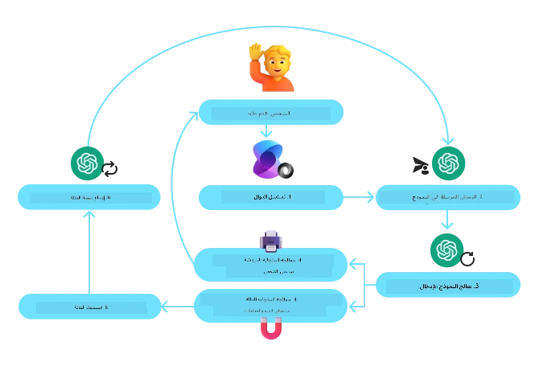
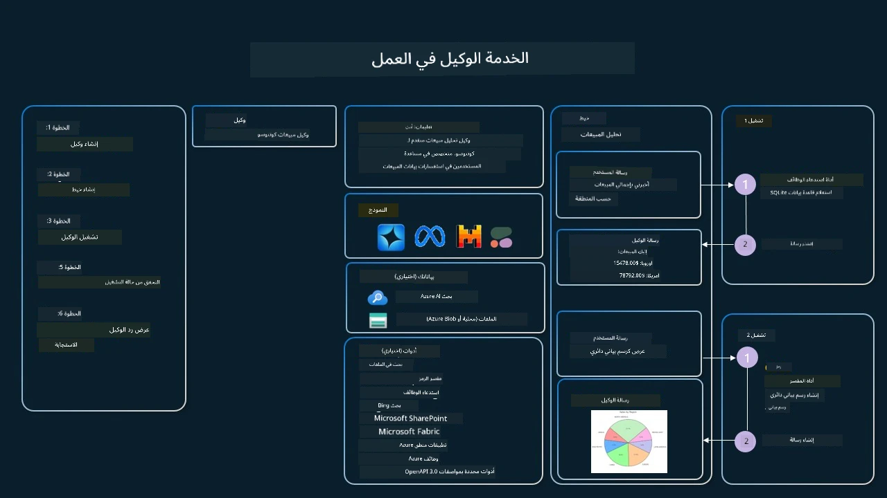

[](https://youtu.be/vieRiPRx-gI?si=cEZ8ApnT6Sus9rhn)

> _(انقر على الصورة أعلاه لعرض فيديو هذا الدرس)_

# نمط تصميم استخدام الأدوات

الأدوات مثيرة للاهتمام لأنها تسمح لوكلاء الذكاء الاصطناعي بامتلاك نطاق أوسع من القدرات. بدلاً من أن يكون لدى الوكيل مجموعة محدودة من الإجراءات التي يمكنه تنفيذها، بإضافة أداة، يمكن للوكيل الآن تنفيذ مجموعة واسعة من الإجراءات. في هذا الفصل، سننظر في نمط تصميم استخدام الأدوات، الذي يصف كيف يمكن لوكلاء الذكاء الاصطناعي استخدام أدوات محددة لتحقيق أهدافهم.

## المقدمة

في هذا الدرس، نسعى للإجابة عن الأسئلة التالية:

- ما هو نمط تصميم استخدام الأدوات؟
- ما هي الحالات التي يمكن تطبيقه عليها؟
- ما هي العناصر/المكونات اللازمة لتنفيذ نمط التصميم؟
- ما هي الاعتبارات الخاصة باستخدام نمط تصميم استخدام الأدوات لبناء وكلاء ذكاء اصطناعي جديرين بالثقة؟

## أهداف التعلم

بعد إكمال هذا الدرس، ستتمكن من:

- تعريف نمط تصميم استخدام الأدوات وهدفه.
- تحديد حالات الاستخدام التي يمكن فيها تطبيق نمط تصميم استخدام الأدوات.
- فهم العناصر الرئيسية اللازمة لتنفيذ نمط التصميم.
- التعرف على الاعتبارات لضمان الثقة في وكلاء الذكاء الاصطناعي الذين يستخدمون هذا النمط.

## ما هو نمط تصميم استخدام الأدوات؟

يركز **نمط تصميم استخدام الأدوات** على منح نماذج اللغة الكبيرة (LLMs) القدرة على التفاعل مع أدوات خارجية لتحقيق أهداف محددة. الأدوات هي كود يمكن تنفيذه بواسطة الوكيل لأداء إجراءات. يمكن أن تكون الأداة دالة بسيطة مثل الحاسبة، أو استدعاء API لخدمة طرف ثالث مثل البحث عن أسعار الأسهم أو توقعات الطقس. في سياق وكلاء الذكاء الاصطناعي، تم تصميم الأدوات ليتم تنفيذها بواسطة الوكلاء استجابةً لـ**مكالمات الدوال التي يولدها النموذج**.

## ما هي الحالات التي يمكن تطبيقه عليها؟

يمكن لوكلاء الذكاء الاصطناعي الاستفادة من الأدوات لإكمال مهام معقدة، استرجاع معلومات، أو اتخاذ قرارات. يُستخدم نمط تصميم استخدام الأدوات غالبًا في السيناريوهات التي تتطلب تفاعلًا ديناميكياً مع أنظمة خارجية مثل قواعد البيانات، خدمات الويب، أو مفسرات الأكواد. هذه القدرة مفيدة للعديد من حالات الاستخدام المختلفة بما في ذلك:

- **استرجاع المعلومات الديناميكي:** يمكن للوكلاء الاستعلام من واجهات برمجة التطبيقات الخارجية أو قواعد البيانات لجلب بيانات محدثة (مثل الاستعلام من قاعدة بيانات SQLite لتحليل البيانات، جلب أسعار الأسهم أو معلومات الطقس).
- **تنفيذ وتفسير الأكواد:** يمكن للوكلاء تنفيذ الأكواد أو النصوص لحل المشكلات الرياضية، إنشاء تقارير، أو إجراء محاكاة.
- **أتمتة سير العمل:** أتمتة العمليات المتكررة أو متعددة الخطوات من خلال دمج أدوات مثل جداول المهام، خدمات البريد الإلكتروني، أو خطوط أنابيب البيانات.
- **دعم العملاء:** يمكن للوكلاء التفاعل مع أنظمة إدارة علاقات العملاء، منصات التذاكر، أو قواعد المعرفة لحل استفسارات المستخدمين.
- **إنشاء وتحرير المحتوى:** يمكن للوكلاء الاستفادة من أدوات مثل مدققي القواعد النحوية، ملخصات النصوص، أو أدوات تقييم سلامة المحتوى للمساعدة في مهام إنشاء المحتوى.

## ما هي العناصر/المكونات اللازمة لتنفيذ نمط تصميم استخدام الأدوات؟

تتيح هذه المكونات لوكيل الذكاء الاصطناعي أداء مجموعة واسعة من المهام. دعونا ننظر إلى العناصر الأساسية اللازمة لتنفيذ نمط تصميم استخدام الأدوات:

- **مخططات الدوال/الأدوات**: تعريفات مفصلة للأدوات المتاحة، بما في ذلك اسم الدالة، الغرض، المعلمات المطلوبة، والمخرجات المتوقعة. تمكن هذه المخططات نموذج اللغة الكبير من فهم الأدوات المتاحة وكيفية بناء طلبات صحيحة.

- **منطق تنفيذ الدوال**: يتحكم في طريقة ووقت استدعاء الأدوات بناءً على نية المستخدم وسياق المحادثة. قد يشمل ذلك وحدات التخطيط، آليات التوجيه، أو تدفقات شرطية تحدد استخدام الأداة بشكل ديناميكي.

- **نظام معالجة الرسائل**: المكونات التي تدير سير المحادثة بين مدخلات المستخدم، استجابات نموذج اللغة الكبير، استدعاءات الأدوات، ومخرجات الأدوات.

- **إطار تكامل الأدوات**: البنية التحتية التي تربط الوكيل بالأدوات المختلفة، سواء كانت دوال بسيطة أو خدمات خارجية معقدة.

- **معالجة الأخطاء والتحقق**: آليات للتعامل مع فشل تنفيذ الأداة، التحقق من المعلمات، وإدارة الاستجابات غير المتوقعة.

- **إدارة الحالة**: تتبع سياق المحادثة، التفاعلات السابقة مع الأدوات، والبيانات المستمرة لضمان التناسق عبر التفاعلات متعددة الأدوار.

بعد ذلك، دعونا نلقي نظرة على استدعاء الدوال/الأدوات بمزيد من التفصيل.

### استدعاء الدوال/الأدوات

استدعاء الدوال هو الطريقة الأساسية التي تمكن نماذج اللغة الكبيرة (LLMs) من التفاعل مع الأدوات. غالبًا ما ترى 'الدالة' و'الأداة' يستخدمان بالتبادل لأن 'الدوال' (كتل من الكود القابل لإعادة الاستخدام) هي 'الأدوات' التي يستخدمها الوكلاء لتنفيذ المهام. لكي يتم استدعاء كود دالة معينة، يجب على نموذج اللغة الكبير مقارنة طلب المستخدم مع وصف الدوال. لتحقيق ذلك، يتم إرسال مخطط يحتوي على أوصاف جميع الدوال المتاحة إلى نموذج اللغة الكبير. ثم يختار نموذج اللغة الكبير الدالة الأنسب للمهمة ويرجع اسمها وحججها. يتم استدعاء الدالة المختارة، ويتم إرسال استجابتها مرة أخرى إلى النموذج، الذي يستخدم المعلومات للرد على طلب المستخدم.

لكي يتمكن المطورون من تنفيذ استدعاء الدوال للوكلاء، ستحتاج إلى:

1. نموذج لغة كبير يدعم استدعاء الدوال
2. مخطط يحتوي على أوصاف الدوال
3. الكود لكل دالة موصوفة

دعونا نستخدم مثال الحصول على الوقت الحالي في مدينة لتوضيح ذلك:

1. **تهيئة نموذج لغة كبير يدعم استدعاء الدوال:**

    ليست كل النماذج تدعم استدعاء الدوال، لذلك من المهم التحقق مما إذا كان نموذج اللغة الكبير الذي تستخدمه يدعم ذلك. <a href="https://learn.microsoft.com/azure/ai-services/openai/how-to/function-calling" target="_blank">Azure OpenAI</a> يدعم استدعاء الدوال. يمكننا أن نبدأ بتهيئة عميل Azure OpenAI.

    ```python
    # تهيئة عميل Azure OpenAI
    client = AzureOpenAI(
        azure_endpoint = os.getenv("AZURE_AI_PROJECT_ENDPOINT"), 
        api_key=os.getenv("AZURE_OPENAI_API_KEY"),  
        api_version="2024-05-01-preview"
    )
    ```

1. **إنشاء مخطط دالة:**

    بعد ذلك سنقوم بتعريف مخطط JSON يحتوي على اسم الدالة، وصف لما تفعله الدالة، وأسماء وأوصاف معلمات الدالة.
    ثم نأخذ هذا المخطط ونعطيه للعميل الذي أنشأناه سابقًا، مع طلب المستخدم للعثور على الوقت في سان فرانسيسكو. المهم ملاحظته هو أن **مكالمة الأداة** هي ما يتم إرجاعه، **وليس** الإجابة النهائية على السؤال. كما ذُكر سابقًا، يحدد نموذج اللغة الكبير اسم الدالة التي اختارها للمهمة، والحجج التي سيتم تمريرها إليها.

    ```python
    # وصف الدالة للنموذج للقراءة
    tools = [
        {
            "type": "function",
            "function": {
                "name": "get_current_time",
                "description": "Get the current time in a given location",
                "parameters": {
                    "type": "object",
                    "properties": {
                        "location": {
                            "type": "string",
                            "description": "The city name, e.g. San Francisco",
                        },
                    },
                    "required": ["location"],
                },
            }
        }
    ]
    ```
   
    ```python
  
    # رسالة المستخدم الأولية
    messages = [{"role": "user", "content": "What's the current time in San Francisco"}] 
  
    # أول استدعاء لواجهة برمجة التطبيقات: اطلب من النموذج استخدام الوظيفة
      response = client.chat.completions.create(
          model=deployment_name,
          messages=messages,
          tools=tools,
          tool_choice="auto",
      )
  
      # معالجة استجابة النموذج
      response_message = response.choices[0].message
      messages.append(response_message)
  
      print("Model's response:")  

      print(response_message)
  
    ```

    ```bash
    Model's response:
    ChatCompletionMessage(content=None, role='assistant', function_call=None, tool_calls=[ChatCompletionMessageToolCall(id='call_pOsKdUlqvdyttYB67MOj434b', function=Function(arguments='{"location":"San Francisco"}', name='get_current_time'), type='function')])
    ```
  
1. **الكود المطلوب لتنفيذ المهمة:**

    الآن بعدما اختار نموذج اللغة الكبير الدالة التي يجب تشغيلها، يجب تنفيذ الكود الذي يؤدي المهمة.
    يمكننا تنفيذ الكود للحصول على الوقت الحالي بلغة بايثون. كما سنحتاج إلى كتابة الكود لاستخراج الاسم والحجج من رسالة الاستجابة للحصول على النتيجة النهائية.

    ```python
      def get_current_time(location):
        """Get the current time for a given location"""
        print(f"get_current_time called with location: {location}")  
        location_lower = location.lower()
        
        for key, timezone in TIMEZONE_DATA.items():
            if key in location_lower:
                print(f"Timezone found for {key}")  
                current_time = datetime.now(ZoneInfo(timezone)).strftime("%I:%M %p")
                return json.dumps({
                    "location": location,
                    "current_time": current_time
                })
      
        print(f"No timezone data found for {location_lower}")  
        return json.dumps({"location": location, "current_time": "unknown"})
    ```

     ```python
     # التعامل مع استدعاءات الدالة
      if response_message.tool_calls:
          for tool_call in response_message.tool_calls:
              if tool_call.function.name == "get_current_time":
     
                  function_args = json.loads(tool_call.function.arguments)
     
                  time_response = get_current_time(
                      location=function_args.get("location")
                  )
     
                  messages.append({
                      "tool_call_id": tool_call.id,
                      "role": "tool",
                      "name": "get_current_time",
                      "content": time_response,
                  })
      else:
          print("No tool calls were made by the model.")  
  
      # الاستدعاء الثاني لواجهة برمجة التطبيقات: الحصول على الاستجابة النهائية من النموذج
      final_response = client.chat.completions.create(
          model=deployment_name,
          messages=messages,
      )
  
      return final_response.choices[0].message.content
     ```

     ```bash
      get_current_time called with location: San Francisco
      Timezone found for san francisco
      The current time in San Francisco is 09:24 AM.
     ```

استدعاء الدوال هو جوهر معظم، إن لم يكن كل، تصميم استخدام الأدوات لدى الوكلاء، ومع ذلك فإن تنفيذه من الصفر قد يكون تحديًا في بعض الأحيان.
كما تعلمنا في [الدرس 2](../../../02-explore-agentic-frameworks) توفر أُطُر العمل الوكيلة لبنات بناء معدة مسبقًا لتنفيذ استخدام الأدوات.

## أمثلة لاستخدام الأدوات مع أُطُر العمل الوكيلة

إليك بعض الأمثلة على كيفية تنفيذ نمط تصميم استخدام الأدوات باستخدام أطر العمل الوكيلة المختلفة:

### إطار عمل مايكروسوفت للوكيل

<a href="https://learn.microsoft.com/azure/ai-services/agents/overview" target="_blank">إطار عمل مايكروسوفت للوكيل</a> هو إطار عمل ذكاء اصطناعي مفتوح المصدر لبناء وكلاء الذكاء الاصطناعي. يبسط عملية استخدام استدعاء الدوال بالسماح لك بتعريف الأدوات كدوال بايثون مع المزين `@tool`. يدير الإطار التفاعل المستمر بين النموذج والكود الخاص بك. كما يوفر الوصول إلى أدوات مدمجة مسبقًا مثل البحث في الملفات ومفسر الأكواد عبر `AzureAIProjectAgentProvider`.

يُوضح الرسم البياني التالي عملية استدعاء الدوال باستخدام إطار عمل مايكروسوفت للوكيل:



في إطار عمل مايكروسوفت للوكيل، تُعرَّف الأدوات كدوال مزينة. يمكننا تحويل دالة `get_current_time` التي رأيناها سابقًا إلى أداة باستخدام المزين `@tool`. يقوم الإطار تلقائيًا بتسلسل الدالة ومعلماتها، وإنشاء المخطط لإرساله إلى نموذج اللغة الكبير.

```python
from agent_framework import tool
from agent_framework.azure import AzureAIProjectAgentProvider
from azure.identity import AzureCliCredential

@tool
def get_current_time(location: str) -> str:
    """Get the current time for a given location"""
    ...

# إنشاء العميل
provider = AzureAIProjectAgentProvider(credential=AzureCliCredential())

# إنشاء وكيل وتشغيله مع الأداة
agent = await provider.create_agent(name="TimeAgent", instructions="Use available tools to answer questions.", tools=get_current_time)
response = await agent.run("What time is it?")
```
  
### خدمة وكيل Azure AI

<a href="https://learn.microsoft.com/azure/ai-services/agents/overview" target="_blank">خدمة وكيل Azure AI</a> هي إطار عمل وكيل أحدث يهدف إلى تمكين المطورين من بناء، نشر، وتوسيع وكلاء ذكاء اصطناعي عالي الجودة وقابل للتوسعة بشكل آمن دون الحاجة لإدارة موارد الحوسبة والتخزين الأساسية. وهي مفيدة بشكل خاص لتطبيقات المؤسسات لأنها خدمة مُدارة بالكامل مع أمان على مستوى المؤسسات.

عند المقارنة بالتطوير باستخدام API نموذج اللغة الكبير مباشرةً، توفر خدمة وكيل Azure AI بعض المزايا، بما في ذلك:

- استدعاء الأدوات تلقائيًا – لا حاجة لتحليل مكالمة الأداة، استدعاء الأداة، والتعامل مع الاستجابة؛ فكل ذلك يتم الآن على جانب الخادم
- إدارة البيانات بشكل آمن – بدلاً من إدارة حالة المحادثة بنفسك، يمكنك الاعتماد على الخيوط لتخزين كل المعلومات التي تحتاجها
- أدوات جاهزة للاستخدام – أدوات يمكنك استخدامها للتفاعل مع مصادر بياناتك، مثل Bing، بحث Azure AI، ودوال Azure.

يمكن تقسيم الأدوات المتاحة في خدمة وكيل Azure AI إلى فئتين:

1. أدوات المعرفة:
    - <a href="https://learn.microsoft.com/azure/ai-services/agents/how-to/tools/bing-grounding?tabs=python&pivots=overview" target="_blank">التأصيل باستخدام Bing Search</a>
    - <a href="https://learn.microsoft.com/azure/ai-services/agents/how-to/tools/file-search?tabs=python&pivots=overview" target="_blank">البحث في الملفات</a>
    - <a href="https://learn.microsoft.com/azure/ai-services/agents/how-to/tools/azure-ai-search?tabs=azurecli%2Cpython&pivots=overview-azure-ai-search" target="_blank">بحث Azure AI</a>

2. أدوات الإجراءات:
    - <a href="https://learn.microsoft.com/azure/ai-services/agents/how-to/tools/function-calling?tabs=python&pivots=overview" target="_blank">استدعاء الدوال</a>
    - <a href="https://learn.microsoft.com/azure/ai-services/agents/how-to/tools/code-interpreter?tabs=python&pivots=overview" target="_blank">مفسر الأكواد</a>
    - <a href="https://learn.microsoft.com/azure/ai-services/agents/how-to/tools/openapi-spec?tabs=python&pivots=overview" target="_blank">أدوات معرّفة بواسطة OpenAPI</a>
    - <a href="https://learn.microsoft.com/azure/ai-services/agents/how-to/tools/azure-functions?pivots=overview" target="_blank">دوال Azure</a>

تسمح خدمة الوكيل لنا باستخدام هذه الأدوات معًا كمجموعة أدوات (`toolset`). كما تستخدم أيضًا `الخيوط` التي تتتبع تاريخ الرسائل من محادثة معينة.

تخيل أنك وكيل مبيعات في شركة تُدعى Contoso. ترغب في تطوير وكيل محادثة يمكنه الإجابة على الأسئلة المتعلقة ببيانات المبيعات الخاصة بك.

تُظهر الصورة التالية كيف يمكنك استخدام خدمة وكيل Azure AI لتحليل بيانات المبيعات:



لاستخدام أي من هذه الأدوات مع الخدمة، يمكننا إنشاء عميل وتعريف أداة أو مجموعة أدوات. لتنفيذ هذا عمليًا، يمكننا استخدام كود بايثون التالي. سيكون نموذج اللغة الكبير قادرًا على النظر إلى مجموعة الأدوات وقررت استخدام الدالة التي أنشأها المستخدم `fetch_sales_data_using_sqlite_query`، أو مفسر الأكواد المدمج اعتمادًا على طلب المستخدم.

```python 
import os
from azure.ai.projects import AIProjectClient
from azure.identity import DefaultAzureCredential
from fetch_sales_data_functions import fetch_sales_data_using_sqlite_query # دالة fetch_sales_data_using_sqlite_query الموجودة في ملف fetch_sales_data_functions.py.
from azure.ai.projects.models import ToolSet, FunctionTool, CodeInterpreterTool

project_client = AIProjectClient.from_connection_string(
    credential=DefaultAzureCredential(),
    conn_str=os.environ["PROJECT_CONNECTION_STRING"],
)

# تهيئة مجموعة الأدوات
toolset = ToolSet()

# تهيئة وكيل استدعاء الدوال مع دالة fetch_sales_data_using_sqlite_query وإضافتها إلى مجموعة الأدوات
fetch_data_function = FunctionTool(fetch_sales_data_using_sqlite_query)
toolset.add(fetch_data_function)

# تهيئة أداة مفسر الشيفرة البرمجية وإضافتها إلى مجموعة الأدوات.
code_interpreter = code_interpreter = CodeInterpreterTool()
toolset.add(code_interpreter)

agent = project_client.agents.create_agent(
    model="gpt-4o-mini", name="my-agent", instructions="You are helpful agent", 
    toolset=toolset
)
```

## ما هي الاعتبارات الخاصة باستخدام نمط تصميم استخدام الأدوات لبناء وكلاء ذكاء اصطناعي يمكن الوثوق بهم؟

قلق شائع مع SQL الذي يُنشأ ديناميكيًا بواسطة نماذج اللغة الكبيرة هو الأمان، وخصوصًا خطر حقن SQL أو العمليات الخبيثة، مثل حذف أو العبث بقاعدة البيانات. في حين أن هذه المخاوف صحيحة، يمكن التخفيف منها بشكل فعال من خلال تكوين أذونات الوصول إلى قاعدة البيانات بشكل صحيح. بالنسبة لمعظم قواعد البيانات، يتضمن ذلك تكوين قاعدة البيانات على صيغة القراءة فقط. بالنسبة لخدمات قواعد البيانات مثل PostgreSQL أو Azure SQL، يجب تعيين دور قراءة فقط (SELECT) للتطبيق.

تشغيل التطبيق في بيئة آمنة يعزز الحماية كذلك. في سيناريوهات المؤسسات، عادة ما يتم استخراج البيانات وتحويلها من أنظمة التشغيل إلى قاعدة بيانات قراءة فقط أو مستودع بيانات مع مخطط سهل الاستخدام. يضمن هذا النهج أن البيانات آمنة، محسنة من حيث الأداء والوصول، وأن التطبيق لديه وصول محدود للقراءة فقط.

## أكواد عينة

- بايثون: [إطار عمل الوكيل](./code_samples/04-python-agent-framework.ipynb)
- .NET: [إطار عمل الوكيل](./code_samples/04-dotnet-agent-framework.md)

## هل لديك مزيد من الأسئلة حول أنماط تصميم استخدام الأدوات؟

انضم إلى [خادم Microsoft Foundry في Discord](https://aka.ms/ai-agents/discord) للقاء متعلمين آخرين، حضور ساعات المكتب، والحصول على إجابات لأسئلتك حول وكلاء الذكاء الاصطناعي.

## مصادر إضافية

- <a href="https://microsoft.github.io/build-your-first-agent-with-azure-ai-agent-service-workshop/" target="_blank">ورشة عمل خدمة وكلاء Azure AI</a>
- <a href="https://github.com/Azure-Samples/contoso-creative-writer/tree/main/docs/workshop" target="_blank">ورشة عمل Contoso Creative Writer متعدد الوكلاء</a>
- <a href="https://learn.microsoft.com/azure/ai-services/agents/overview" target="_blank">نظرة عامة على إطار عمل وكلاء مايكروسوفت</a>

## الدرس السابق

[فهم أنماط التصميم الوكيل](../03-agentic-design-patterns/README.md)

## الدرس التالي
[دليل وكيل RAG](../05-agentic-rag/README.md)

---

<!-- CO-OP TRANSLATOR DISCLAIMER START -->
**تنويه**:  
تمت ترجمة هذا المستند باستخدام خدمة الترجمة الآلية [Co-op Translator](https://github.com/Azure/co-op-translator). بينما نسعى لتحقيق الدقة، يرجى العلم أن الترجمات الآلية قد تحتوي على أخطاء أو عدم دقة. يجب اعتبار المستند الأصلي بلغته الأصلية هو المصدر المعتمد. للمعلومات الحرجة، يُنصح بالاستعانة بترجمة بشرية محترفة. نحن غير مسؤولين عن أي سوء فهم أو تفسيرات خاطئة قد تنشأ عن استخدام هذه الترجمة.
<!-- CO-OP TRANSLATOR DISCLAIMER END -->