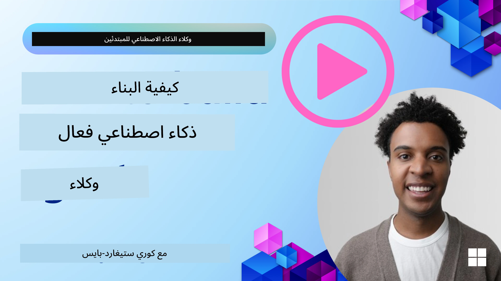
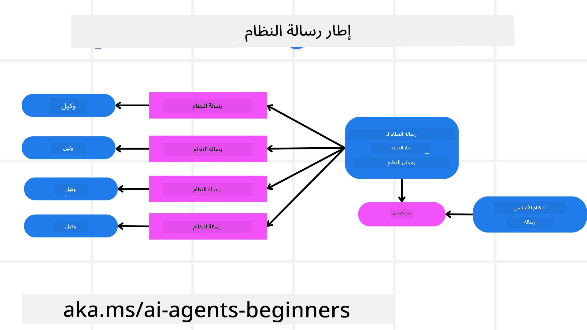
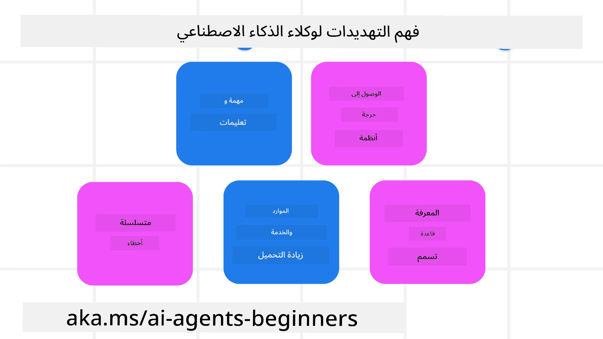
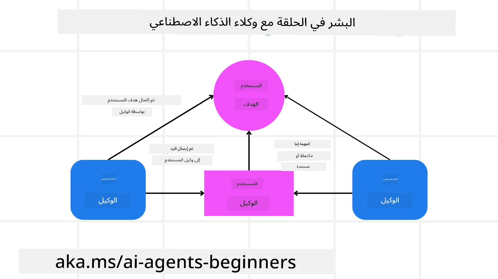

[](https://youtu.be/iZKkMEGBCUQ?si=Q-kEbcyHUMPoHp8L)

> _(انقر على الصورة أعلاه لمشاهدة فيديو هذه الدرس)_

# بناء وكلاء ذكاء اصطناعي جديرين بالثقة

## المقدمة

سيتناول هذا الدرس:

- كيفية بناء ونشر وكلاء ذكاء اصطناعي آمنين وفعّالين
- اعتبارات أمنية مهمة عند تطوير وكلاء الذكاء الاصطناعي.
- كيفية الحفاظ على خصوصية البيانات والمستخدم عند تطوير وكلاء الذكاء الاصطناعي.

## أهداف التعلم

بعد إكمال هذا الدرس، ستعرف كيف:

- تحديد وتخفيف المخاطر عند إنشاء وكلاء ذكاء اصطناعي.
- تنفيذ تدابير أمنية لضمان إدارة البيانات والوصول بشكل صحيح.
- إنشاء وكلاء ذكاء اصطناعي يحافظون على خصوصية البيانات ويوفرون تجربة مستخدم عالية الجودة.

## الأمان

دعونا ننظر أولاً إلى بناء تطبيقات وكيل آمنة. الأمان يعني أن الوكيل الذكاء الاصطناعي يعمل كما هو مصمم. كمطوّرين لتطبيقات الوكيل، لدينا طرق وأدوات لتعظيم الأمان:

### بناء إطار عمل لرسائل النظام

إذا سبق لك بناء تطبيق ذكاء اصطناعي باستخدام نماذج اللغة الكبيرة (LLMs)، فأنت تعرف أهمية تصميم موجه النظام أو رسالة النظام المتينة. تحدد هذه الموجهات القواعد الفوقية، التعليمات، والإرشادات حول كيفية تفاعل نموذج اللغة الكبير مع المستخدم والبيانات.

بالنسبة لوكلاء الذكاء الاصطناعي، فإن موجه النظام أكثر أهمية حيث سيحتاج الوكلاء إلى تعليمات محددة للغاية لإكمال المهام التي قمنا بتصميمها لهم.

لإنشاء موجهات نظام قابلة للتوسع، يمكننا استخدام إطار عمل رسالة النظام لبناء وكيل واحد أو أكثر في تطبيقنا:



#### الخطوة 1: إنشاء رسالة نظام فوقية

سيستخدم نموذج اللغة الكبير الموجه الفوقي لتوليد موجهات النظام للوكلاء الذين ننشئهم. نصممه كمثال حتى نتمكن من إنشاء عدة وكلاء بكفاءة إذا لزم الأمر.

إليك مثال على رسالة نظام فوقية سنعطيها لنموذج اللغة الكبير:

```plaintext
You are an expert at creating AI agent assistants. 
You will be provided a company name, role, responsibilities and other
information that you will use to provide a system prompt for.
To create the system prompt, be descriptive as possible and provide a structure that a system using an LLM can better understand the role and responsibilities of the AI assistant. 
```

#### الخطوة 2: إنشاء موجه أساسي

الخطوة التالية هي إنشاء موجه أساسي لوصف وكيل الذكاء الاصطناعي. يجب أن تتضمن دور الوكيل، المهام التي سيكملها الوكيل، وأي مسؤوليات أخرى للوكيل.

إليك مثالاً:

```plaintext
You are a travel agent for Contoso Travel that is great at booking flights for customers. To help customers you can perform the following tasks: lookup available flights, book flights, ask for preferences in seating and times for flights, cancel any previously booked flights and alert customers on any delays or cancellations of flights.  
```

#### الخطوة 3: تقديم رسالة نظام أساسية للنموذج

الآن يمكننا تحسين رسالة النظام هذه من خلال تقديم رسالة النظام الفوقية كرسالة النظام بالإضافة إلى رسالة النظام الأساسية الخاصة بنا.

سيؤدي هذا إلى إنتاج رسالة نظام مصممة بشكل أفضل لتوجيه وكلاء الذكاء الاصطناعي لدينا:

```markdown
**Company Name:** Contoso Travel  
**Role:** Travel Agent Assistant

**Objective:**  
You are an AI-powered travel agent assistant for Contoso Travel, specializing in booking flights and providing exceptional customer service. Your main goal is to assist customers in finding, booking, and managing their flights, all while ensuring that their preferences and needs are met efficiently.

**Key Responsibilities:**

1. **Flight Lookup:**
    
    - Assist customers in searching for available flights based on their specified destination, dates, and any other relevant preferences.
    - Provide a list of options, including flight times, airlines, layovers, and pricing.
2. **Flight Booking:**
    
    - Facilitate the booking of flights for customers, ensuring that all details are correctly entered into the system.
    - Confirm bookings and provide customers with their itinerary, including confirmation numbers and any other pertinent information.
3. **Customer Preference Inquiry:**
    
    - Actively ask customers for their preferences regarding seating (e.g., aisle, window, extra legroom) and preferred times for flights (e.g., morning, afternoon, evening).
    - Record these preferences for future reference and tailor suggestions accordingly.
4. **Flight Cancellation:**
    
    - Assist customers in canceling previously booked flights if needed, following company policies and procedures.
    - Notify customers of any necessary refunds or additional steps that may be required for cancellations.
5. **Flight Monitoring:**
    
    - Monitor the status of booked flights and alert customers in real-time about any delays, cancellations, or changes to their flight schedule.
    - Provide updates through preferred communication channels (e.g., email, SMS) as needed.

**Tone and Style:**

- Maintain a friendly, professional, and approachable demeanor in all interactions with customers.
- Ensure that all communication is clear, informative, and tailored to the customer's specific needs and inquiries.

**User Interaction Instructions:**

- Respond to customer queries promptly and accurately.
- Use a conversational style while ensuring professionalism.
- Prioritize customer satisfaction by being attentive, empathetic, and proactive in all assistance provided.

**Additional Notes:**

- Stay updated on any changes to airline policies, travel restrictions, and other relevant information that could impact flight bookings and customer experience.
- Use clear and concise language to explain options and processes, avoiding jargon where possible for better customer understanding.

This AI assistant is designed to streamline the flight booking process for customers of Contoso Travel, ensuring that all their travel needs are met efficiently and effectively.

```

#### الخطوة 4: التكرار والتحسين

القيمة من إطار عمل رسالة النظام هذا هي القدرة على توسيع إنشاء رسائل النظام من عدة وكلاء بسهولة بالإضافة إلى تحسين رسائل النظام بمرور الوقت. من النادر أن يكون لديك رسالة نظام تعمل في المرة الأولى لحالة الاستخدام الكاملة الخاصة بك. القدرة على إجراء تعديلات صغيرة وتحسينات من خلال تغيير رسالة النظام الأساسية وتشغيلها عبر النظام ستمكنك من المقارنة وتقييم النتائج.

## فهم التهديدات

لبناء وكلاء ذكاء اصطناعي جديرين بالثقة، من المهم فهم وتخفيف المخاطر والتهديدات لوكيل الذكاء الاصطناعي الخاص بك. دعونا نلقي نظرة على بعض التهديدات المختلفة لوكلاء الذكاء الاصطناعي وكيف يمكنك التخطيط والاستعداد بشكل أفضل لها.



### المهمة والتعليمات

**الوصف:** يحاول المهاجمون تغيير تعليمات أو أهداف وكيل الذكاء الاصطناعي من خلال التوجيه أو التلاعب بالمدخلات.

**التخفيف:** تنفيذ فحوص التحقق ومرشحات الإدخال لاكتشاف الموجهات الخطرة المحتملة قبل معالجتها بواسطة وكيل الذكاء الاصطناعي. بما أن هذه الهجمات تتطلب عادة تفاعلاً متكررًا مع الوكيل، فإن تحديد عدد من الدوران في المحادثة هو طريقة أخرى لمنع هذه الأنواع من الهجمات.

### الوصول إلى الأنظمة الحرجة

**الوصف:** إذا كان لوكيل الذكاء الاصطناعي وصول إلى أنظمة وخدمات تخزن بيانات حساسة، يمكن للمهاجمين اختراق التواصل بين الوكيل وهذه الخدمات. يمكن أن تكون هذه هجمات مباشرة أو محاولات غير مباشرة للحصول على معلومات عن هذه الأنظمة عبر الوكيل.

**التخفيف:** يجب أن يحصل وكلاء الذكاء الاصطناعي على الوصول إلى الأنظمة على أساس "الحاجة فقط" لمنع هذه الأنواع من الهجمات. يجب أيضًا أن يكون الاتصال بين الوكيل والنظام آمناً. تنفيذ التوثيق والتحكم في الوصول هو طريقة أخرى لحماية هذه المعلومات.

### التحميل الزائد للموارد والخدمات

**الوصف:** يمكن لوكلاء الذكاء الاصطناعي الوصول إلى أدوات وخدمات مختلفة لإكمال المهام. يمكن للمهاجمين استغلال هذه القدرة للهجوم على هذه الخدمات عن طريق إرسال حجم كبير من الطلبات عبر وكيل الذكاء الاصطناعي، مما قد يؤدي إلى فشل النظام أو ارتفاع التكاليف.

**التخفيف:** تنفيذ سياسات لتحديد عدد الطلبات التي يمكن لوكيل الذكاء الاصطناعي إرسالها إلى خدمة معينة. كما أن تحديد عدد دورات المحادثة والطلبات المرسلة إلى وكيل الذكاء الاصطناعي هو طريقة أخرى لمنع هذه الأنواع من الهجمات.

### تسمم قاعدة المعرفة

**الوصف:** هذا النوع من الهجوم لا يستهدف وكيل الذكاء الاصطناعي مباشرة، بل يستهدف قاعدة المعرفة والخدمات الأخرى التي سيستخدمها الوكيل. قد يشمل هذا إفساد البيانات أو المعلومات التي سيستخدمها الوكيل لإتمام مهمة، مما يؤدي إلى ردود متحيزة أو غير مقصودة للمستخدم.

**التخفيف:** إجراء التحقق المنتظم من البيانات التي سيستخدمها الوكيل في عمليات سير العمل الخاصة به. تأكد من أن الوصول إلى هذه البيانات آمن ولا يتم تغييره إلا من قبل أشخاص موثوقين لتجنب هذا النوع من الهجوم.

### الأخطاء المتسلسلة

**الوصف:** يحصل وكلاء الذكاء الاصطناعي على أدوات وخدمات مختلفة لإكمال المهام. يمكن أن تؤدي الأخطاء التي يتسبب بها المهاجمون إلى إخفاقات في أنظمة أخرى متصلة بالوكيل، مما يجعل الهجوم أكثر انتشارًا ويصعب استكشافه.

**التخفيف:** إحدى الطرق لتجنب هذا هي تشغيل وكيل الذكاء الاصطناعي في بيئة محدودة، مثل أداء المهام داخل حاوية Docker، لمنع الهجمات المباشرة على النظام. إنشاء آليات بديلة ومنطق إعادة المحاولة عند استجابة أنظمة معينة بخطأ هو طريقة أخرى لمنع انهيارات النظام الأكبر.

## التفاعل البشري داخل الحلقة

طريقة فعالة أخرى لبناء أنظمة وكلاء ذكاء اصطناعي جديرين بالثقة هي استخدام التفاعل البشري داخل الحلقة. هذا يخلق تدفقًا حيث يمكن للمستخدمين تقديم ملاحظات للوكلاء أثناء التشغيل. يتصرف المستخدمون أساساً كوكلاء في نظام متعدد الوكلاء من خلال تقديم الموافقة أو إنهاء العملية الجارية.



إليك مقتطف كود يستخدم إطار العمل Microsoft Agent ليُظهر كيف يتم تنفيذ هذا المفهوم:

```python
import os
from agent_framework.azure import AzureAIProjectAgentProvider
from azure.identity import AzureCliCredential

# إنشاء المزود بموافقة بشرية ضمن العملية
provider = AzureAIProjectAgentProvider(
    credential=AzureCliCredential(),
)

# إنشاء الوكيل بخطوة موافقة بشرية
response = provider.create_response(
    input="Write a 4-line poem about the ocean.",
    instructions="You are a helpful assistant. Ask for user approval before finalizing.",
)

# يمكن للمستخدم مراجعة الرد والموافقة عليه
print(response.output_text)
user_input = input("Do you approve? (APPROVE/REJECT): ")
if user_input == "APPROVE":
    print("Response approved.")
else:
    print("Response rejected. Revising...")
```

## الخلاصة

يتطلب بناء وكلاء ذكاء اصطناعي جديرين بالثقة تصميمًا دقيقًا، تدابير أمنية قوية، وتكرارًا مستمرًا. من خلال تنفيذ أنظمة توجيه ميتا منظمة، وفهم التهديدات المحتملة، وتطبيق استراتيجيات التخفيف، يمكن للمطورين إنشاء وكلاء ذكاء اصطناعي آمنين وفعّالين. بالإضافة إلى ذلك، يضمن دمج نهج التفاعل البشري داخل الحلقة بقاء وكلاء الذكاء الاصطناعي متوافقين مع احتياجات المستخدم مع تقليل المخاطر. مع استمرار تطور الذكاء الاصطناعي، سيكون الحفاظ على موقف استباقي تجاه الأمان والخصوصية والاعتبارات الأخلاقية هو المفتاح لتعزيز الثقة والموثوقية في أنظمة الذكاء الاصطناعي.

### هل لديك المزيد من الأسئلة حول بناء وكلاء ذكاء اصطناعي جديرين بالثقة؟

انضم إلى [Microsoft Foundry Discord](https://aka.ms/ai-agents/discord) للقاء متعلمين آخرين، حضور ساعات المكتب، والحصول على إجابات عن أسئلة وكلاء الذكاء الاصطناعي الخاصة بك.

## موارد إضافية

- <a href="https://learn.microsoft.com/azure/ai-studio/responsible-use-of-ai-overview" target="_blank">نظرة عامة على الذكاء الاصطناعي المسؤول</a>
- <a href="https://learn.microsoft.com/azure/ai-studio/concepts/evaluation-approach-gen-ai" target="_blank">تقييم نماذج الذكاء الاصطناعي التوليدية وتطبيقات الذكاء الاصطناعي</a>
- <a href="https://learn.microsoft.com/azure/ai-services/openai/concepts/system-message?context=%2Fazure%2Fai-studio%2Fcontext%2Fcontext&tabs=top-techniques" target="_blank">رسائل نظام السلامة</a>
- <a href="https://blogs.microsoft.com/wp-content/uploads/prod/sites/5/2022/06/Microsoft-RAI-Impact-Assessment-Template.pdf?culture=en-us&country=us" target="_blank">نموذج تقييم المخاطر</a>

## الدرس السابق

[Agentic RAG](../05-agentic-rag/README.md)

## الدرس التالي

[تصميم نمط التخطيط](../07-planning-design/README.md)

---

<!-- CO-OP TRANSLATOR DISCLAIMER START -->
**تنويه**:  
تمت ترجمة هذا المستند باستخدام خدمة الترجمة الآلية [Co-op Translator](https://github.com/Azure/co-op-translator). بينما نسعى لتحقيق الدقة، يرجى ملاحظة أن الترجمات الآلية قد تحتوي على أخطاء أو عدم دقة. يجب اعتبار المستند الأصلي بلغته الأصلية المصدر المعتمد. للمعلومات المهمة، يُنصح بالاستعانة بترجمة بشرية محترفة. نحن غير مسؤولين عن أي سوء فهم أو تفسيرات خاطئة ناتجة عن استخدام هذه الترجمة.
<!-- CO-OP TRANSLATOR DISCLAIMER END -->