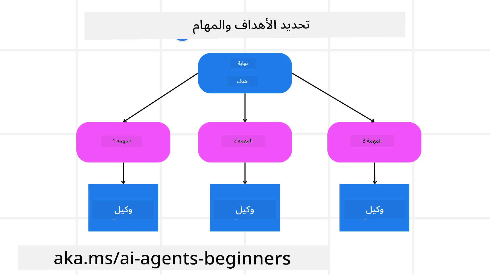

[](https://youtu.be/kPfJ2BrBCMY?si=9pYpPXp0sSbK91Dr)

> _(انقر على الصورة أعلاه لمشاهدة فيديو هذا الدرس)_

# تصميم التخطيط

## المقدمة

سيغطي هذا الدرس

* تحديد هدف واضح شامل وتقسيم مهمة معقدة إلى مهام قابلة للإدارة.
* الاستفادة من الإخراج المنظم للحصول على استجابات أكثر موثوقية وقابلية للقراءة آليًا.
* تطبيق نهج قائم على الأحداث للتعامل مع المهام الديناميكية والمدخلات غير المتوقعة.

## أهداف التعلم

بعد إتمام هذا الدرس، سيكون لديك فهم حول:

* تحديد وتعيين هدف شامل لوكيل الذكاء الاصطناعي، مع ضمان معرفته الواضحة بما يجب تحقيقه.
* تفكيك مهمة معقدة إلى مهام فرعية قابلة للإدارة وتنظيمها في تسلسل منطقي.
* تجهيز الوكلاء بالأدوات المناسبة (مثل أدوات البحث أو أدوات تحليل البيانات)، وتحديد متى وكيف يتم استخدامها، والتعامل مع الحالات غير المتوقعة التي تنشأ.
* تقييم نتائج المهام الفرعية، وقياس الأداء، والتكرار على الإجراءات لتحسين الناتج النهائي.

## تحديد الهدف الشامل وتقسيم المهمة



معظم المهام الحقيقية معقدة للغاية للتعامل معها في خطوة واحدة. يحتاج وكيل الذكاء الاصطناعي إلى هدف موجز لتوجيه تخطيطه وأفعاله. على سبيل المثال، ضع في اعتبارك الهدف:

    "إنشاء خطة سفر لمدة 3 أيام."

بينما هو سهل البيان، إلا أنه يحتاج إلى تحسين. كلما كان الهدف أوضح، كان بإمكان الوكيل (وكل المتعاونين من البشر) التركيز بشكل أفضل على تحقيق النتيجة الصحيحة، مثل إنشاء خطة شاملة مع خيارات الرحلات الجوية، وتوصيات الفنادق، واقتراحات الأنشطة.

### تفكيك المهمة

تصبح المهام الكبيرة أو المعقدة أكثر قابلية للإدارة عند تقسيمها إلى مهام فرعية موجهة نحو الهدف.
لمثال خطة السفر، يمكنك تفكيك الهدف إلى:

* حجز الرحلات الجوية
* حجز الفندق
* تأجير السيارات
* التخصيص الشخصي

يمكن بعد ذلك التعامل مع كل مهمة فرعية بواسطة وكلاء أو عمليات مخصصة. قد يتخصص وكيل في البحث عن أفضل عروض الرحلات الجوية، وآخر يركز على حجوزات الفنادق، وهكذا. يمكن لوكيل تنسيقي أو "تحت" تجميع هذه النتائج في خطة واحدة متماسكة للمستخدم النهائي.

يسمح هذا النهج المعياري أيضًا بالتحسينات التدريجية. على سبيل المثال، يمكنك إضافة وكلاء متخصصين في توصيات الطعام أو اقتراحات النشاطات المحلية وتحسين الخطة مع مرور الوقت.

### الإخراج المنظم

يمكن لنماذج اللغة الكبيرة (LLMs) توليد إخراج منظم (مثل JSON) يسهل على الوكلاء أو الخدمات اللاحقة تحليله ومعالجته. هذا مفيد بشكل خاص في سياق متعدد الوكلاء، حيث يمكننا تنفيذ هذه المهام بعد استلام إخراج التخطيط.

توضح مقتطفة بايثون التالية وكيل تخطيط بسيط يقوم بتفكيك هدف إلى مهام فرعية وتوليد خطة منظمة:

```python
from pydantic import BaseModel
from enum import Enum
from typing import List, Optional, Union
import json
import os
from typing import Optional
from pprint import pprint
from agent_framework.azure import AzureAIProjectAgentProvider
from azure.identity import AzureCliCredential

class AgentEnum(str, Enum):
    FlightBooking = "flight_booking"
    HotelBooking = "hotel_booking"
    CarRental = "car_rental"
    ActivitiesBooking = "activities_booking"
    DestinationInfo = "destination_info"
    DefaultAgent = "default_agent"
    GroupChatManager = "group_chat_manager"

# نموذج المهمة الفرعية للسفر
class TravelSubTask(BaseModel):
    task_details: str
    assigned_agent: AgentEnum  # نريد تعيين المهمة للوكيل

class TravelPlan(BaseModel):
    main_task: str
    subtasks: List[TravelSubTask]
    is_greeting: bool

provider = AzureAIProjectAgentProvider(credential=AzureCliCredential())

# تحديد رسالة المستخدم
system_prompt = """You are a planner agent.
    Your job is to decide which agents to run based on the user's request.
    Provide your response in JSON format with the following structure:
{'main_task': 'Plan a family trip from Singapore to Melbourne.',
 'subtasks': [{'assigned_agent': 'flight_booking',
               'task_details': 'Book round-trip flights from Singapore to '
                               'Melbourne.'}
    Below are the available agents specialised in different tasks:
    - FlightBooking: For booking flights and providing flight information
    - HotelBooking: For booking hotels and providing hotel information
    - CarRental: For booking cars and providing car rental information
    - ActivitiesBooking: For booking activities and providing activity information
    - DestinationInfo: For providing information about destinations
    - DefaultAgent: For handling general requests"""

user_message = "Create a travel plan for a family of 2 kids from Singapore to Melbourne"

response = client.create_response(input=user_message, instructions=system_prompt)

response_content = response.output_text
pprint(json.loads(response_content))
```

### وكيل التخطيط مع تنسيق متعدد الوكلاء

في هذا المثال، يستقبل وكيل التوجيه الدلالي طلب المستخدم (مثل "أحتاج خطة فندق لرحلتي.").

ثم يقوم المخطط بـ:

* استلام خطة الفندق: يأخذ المخطط رسالة المستخدم وبناءً على موجه النظام (بما في ذلك تفاصيل الوكلاء المتاحين) يولد خطة سفر منظمة.
* سرد الوكلاء وأدواتهم: يحتوي سجل الوكلاء على قائمة بالوكلاء (مثل الرحلات الجوية، الفندق، تأجير السيارات، والأنشطة) إلى جانب الوظائف أو الأدوات التي يقدمونها.
* توجيه الخطة إلى الوكلاء المعنيين: اعتمادًا على عدد المهام الفرعية، إما يرسل المخطط الرسالة مباشرة لوكيل مخصص (للسيناريوهات ذات المهمة الواحدة) أو ينسق عبر مدير دردشة جماعية للتعاون متعدد الوكلاء.
* تلخيص النتيجة: أخيرًا، يلخص المخطط الخطة المنتجة للوضوح.
يوضح نموذج كود بايثون التالي هذه الخطوات:

```python

from pydantic import BaseModel

from enum import Enum
from typing import List, Optional, Union

class AgentEnum(str, Enum):
    FlightBooking = "flight_booking"
    HotelBooking = "hotel_booking"
    CarRental = "car_rental"
    ActivitiesBooking = "activities_booking"
    DestinationInfo = "destination_info"
    DefaultAgent = "default_agent"
    GroupChatManager = "group_chat_manager"

# نموذج المهمة الفرعية للسفر

class TravelSubTask(BaseModel):
    task_details: str
    assigned_agent: AgentEnum # نريد تعيين المهمة للوكيل

class TravelPlan(BaseModel):
    main_task: str
    subtasks: List[TravelSubTask]
    is_greeting: bool
import json
import os
from typing import Optional

from agent_framework.azure import AzureAIProjectAgentProvider
from azure.identity import AzureCliCredential

# إنشاء العميل

provider = AzureAIProjectAgentProvider(credential=AzureCliCredential())

from pprint import pprint

# تحديد رسالة المستخدم

system_prompt = """You are a planner agent.
    Your job is to decide which agents to run based on the user's request.
    Below are the available agents specialized in different tasks:
    - FlightBooking: For booking flights and providing flight information
    - HotelBooking: For booking hotels and providing hotel information
    - CarRental: For booking cars and providing car rental information
    - ActivitiesBooking: For booking activities and providing activity information
    - DestinationInfo: For providing information about destinations
    - DefaultAgent: For handling general requests"""

user_message = "Create a travel plan for a family of 2 kids from Singapore to Melbourne"

response = client.create_response(input=user_message, instructions=system_prompt)

response_content = response.output_text

# طباعة محتوى الرد بعد تحميله كجيسون

pprint(json.loads(response_content))
```

ما يلي هو الإخراج من الكود السابق ويمكنك بعد ذلك استخدام هذا الإخراج المنظم لتوجيهه إلى `assigned_agent` وتلخيص خطة السفر للمستخدم النهائي.

```json
{
    "is_greeting": "False",
    "main_task": "Plan a family trip from Singapore to Melbourne.",
    "subtasks": [
        {
            "assigned_agent": "flight_booking",
            "task_details": "Book round-trip flights from Singapore to Melbourne."
        },
        {
            "assigned_agent": "hotel_booking",
            "task_details": "Find family-friendly hotels in Melbourne."
        },
        {
            "assigned_agent": "car_rental",
            "task_details": "Arrange a car rental suitable for a family of four in Melbourne."
        },
        {
            "assigned_agent": "activities_booking",
            "task_details": "List family-friendly activities in Melbourne."
        },
        {
            "assigned_agent": "destination_info",
            "task_details": "Provide information about Melbourne as a travel destination."
        }
    ]
}
```

دفتر ملاحظات يحتوي على نموذج الكود السابق متاح [هنا](07-python-agent-framework.ipynb).

### التخطيط التكراري

بعض المهام تتطلب تبادلًا أو إعادة تخطيط، حيث تؤثر نتيجة إحدى المهام الفرعية على المهمة التالية. على سبيل المثال، إذا اكتشف الوكيل تنسيق بيانات غير متوقع أثناء حجز الرحلات الجوية، فقد يحتاج إلى تعديل استراتيجيته قبل الانتقال إلى حجوزات الفنادق.

بالإضافة إلى ذلك، يمكن أن تؤدي ملاحظات المستخدم (مثل قرار بشري يفضل رحلة جوية أبكر) إلى إعادة تخطيط جزئي. يضمن هذا النهج الديناميكي والتكراري توافق الحل النهائي مع القيود الواقعية وتفضيلات المستخدم المتغيرة.

مثال على الكود

```python
from agent_framework.azure import AzureAIProjectAgentProvider
from azure.identity import AzureCliCredential
#.. كما في الشفرة السابقة وتمرير تاريخ المستخدم والخطة الحالية

system_prompt = """You are a planner agent to optimize the
    Your job is to decide which agents to run based on the user's request.
    Below are the available agents specialized in different tasks:
    - FlightBooking: For booking flights and providing flight information
    - HotelBooking: For booking hotels and providing hotel information
    - CarRental: For booking cars and providing car rental information
    - ActivitiesBooking: For booking activities and providing activity information
    - DestinationInfo: For providing information about destinations
    - DefaultAgent: For handling general requests"""

user_message = "Create a travel plan for a family of 2 kids from Singapore to Melbourne"

response = client.create_response(
    input=user_message,
    instructions=system_prompt,
    context=f"Previous travel plan - {TravelPlan}",
)
# .. إعادة التخطيط وإرسال المهام إلى الوكلاء المعنيين
```

للتخطيط الأكثر شمولاً، قم بزيارة منشور مدونة Magnetic One <a href="https://www.microsoft.com/research/articles/magentic-one-a-generalist-multi-agent-system-for-solving-complex-tasks" target="_blank">لمقال حل المهام المعقدة</a>.

## الملخص

في هذا المقال نظرنا إلى مثال على كيفية إنشاء مخطط يمكنه اختيار الوكلاء المتاحين المعرفين بشكل ديناميكي. يقوم ناتج المخطط بتفكيك المهام وتكليف الوكلاء بحيث يمكن تنفيذها. من المفترض أن يكون لدى الوكلاء وصول إلى الوظائف/الأدوات المطلوبة لأداء المهمة. بالإضافة إلى الوكلاء يمكن تضمين أنماط أخرى مثل الانعكاس، الملخص، والدردشة الدائرية لتخصيص إضافي.

## الموارد الإضافية

Magentic One - نظام متعدد الوكلاء عام لحل المهام المعقدة وقد حقق نتائج مبهرة في عدة معايير قياسية تحديّة للوكيل. المرجع: <a href="https://www.microsoft.com/research/articles/magentic-one-a-generalist-multi-agent-system-for-solving-complex-tasks" target="_blank">Magentic One</a>. في هذا التطبيق، يقوم المنسق بإنشاء خطط محددة للمهام ويفوض هذه المهام إلى الوكلاء المتاحين. بالإضافة إلى التخطيط، يستخدم المنسق آلية تتبع لمراقبة تقدم المهمة ويعيد التخطيط حسب الحاجة.

### هل لديك المزيد من الأسئلة حول نمط تصميم التخطيط؟

انضم إلى [Discord الخاص بـ Microsoft Foundry](https://aka.ms/ai-agents/discord) للقاء متعلمين آخرين، حضور ساعات المكتب والحصول على إجابات لأسئلة وكلاء الذكاء الاصطناعي الخاصة بك.

## الدرس السابق

[بناء وكلاء ذكاء اصطناعي يمكن الوثوق بهم](../06-building-trustworthy-agents/README.md)

## الدرس التالي

[نمطة تصميم متعدد الوكلاء](../08-multi-agent/README.md)

---

<!-- CO-OP TRANSLATOR DISCLAIMER START -->
**إخلاء المسؤولية**:  
تمت ترجمة هذا المستند باستخدام خدمة الترجمة الآلية [Co-op Translator](https://github.com/Azure/co-op-translator). بينما نسعى لتحقيق الدقة، يرجى العلم أن الترجمات الآلية قد تحتوي على أخطاء أو عدم دقة. يجب اعتبار المستند الأصلي بلغته الأصلية المصدر الرسمي والموثوق. للحصول على معلومات دقيقة وحاسمة، يُنصح بالاعتماد على الترجمة البشرية المهنية. نحن غير مسؤولين عن أي سوء فهم أو تحريف ينتج عن استخدام هذه الترجمة.
<!-- CO-OP TRANSLATOR DISCLAIMER END -->