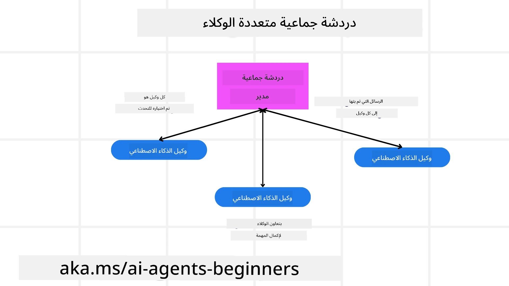
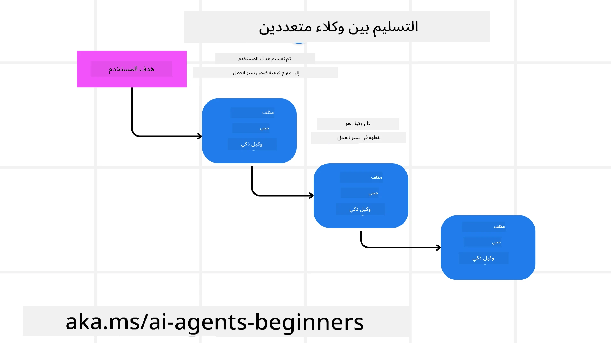
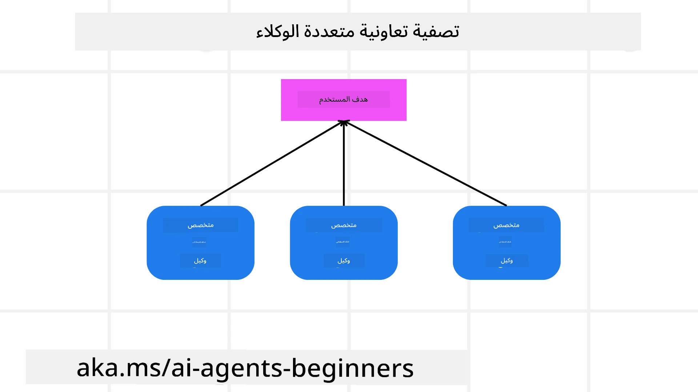

> _(انقر على الصورة أعلاه لمشاهدة فيديو هذا الدرس)_

# أنماط تصميم متعدد الوكلاء

بمجرد أن تبدأ في العمل على مشروع يتضمن عدة وكلاء، ستحتاج إلى النظر في نمط تصميم متعدد الوكلاء. ومع ذلك، قد لا يكون واضحًا على الفور متى يتم التحول إلى متعدد الوكلاء وما هي المزايا.

## مقدمة

في هذا الدرس، نسعى للإجابة على الأسئلة التالية:

- ما هي السيناريوهات التي يكون فيها متعدد الوكلاء قابلاً للتطبيق؟
- ما هي مزايا استخدام متعدد الوكلاء بالمقارنة مع وجود وكيل واحد يقوم بمهام متعددة؟
- ما هي اللبنات الأساسية لتنفيذ نمط تصميم متعدد الوكلاء؟
- كيف نحصل على رؤية لكيفية تفاعل الوكلاء المتعددين مع بعضهم البعض؟

## أهداف التعلم

بعد هذا الدرس، يجب أن تكون قادرًا على:

- تحديد السيناريوهات التي يكون فيها متعدد الوكلاء قابلاً للتطبيق
- التعرف على مزايا استخدام متعدد الوكلاء مقارنةً بوكيل واحد.
- فهم اللبنات الأساسية لتنفيذ نمط تصميم متعدد الوكلاء.

ما هي الصورة الأكبر؟

*متعدد الوكلاء هو نمط تصميم يسمح لعدة وكلاء بالعمل معًا لتحقيق هدف مشترك*.

يُستخدم هذا النمط على نطاق واسع في مجالات متعددة، بما في ذلك الروبوتات، الأنظمة المستقلة، والحوسبة الموزعة.

## السيناريوهات التي يكون فيها متعدد الوكلاء قابلاً للتطبيق

فما هي السيناريوهات التي تعتبر حالة استخدام جيدة لاستخدام متعدد الوكلاء؟ الجواب هو أن هناك العديد من السيناريوهات حيث يكون توظيف عدة وكلاء مفيدًا خاصة في الحالات التالية:

- **أحمال العمل الكبيرة**: يمكن تقسيم أحمال العمل الكبيرة إلى مهام أصغر وتكليف وكلاء مختلفين بها، مما يسمح بالمعالجة المتوازية والإنجاز الأسرع. مثال على ذلك هو في حالة مهمة معالجة بيانات كبيرة.
- **المهام المعقدة**: يمكن تفكيك المهام المعقدة، مثل أحمال العمل الكبيرة، إلى مهام فرعية أصغر وتكليف وكلاء مختلفين متخصّصين في جانب معين من المهمة. مثال جيد على ذلك هو في حالة المركبات الذاتية القيادة حيث يدير وكلاء مختلفون الملاحة، واكتشاف العقبات، والتواصل مع مركبات أخرى.
- **تخصص متنوع**: يمكن أن يكون للوكلاء المختلفين تخصصات متنوعة، مما يسمح لهم بالتعامل مع جوانب مختلفة من المهمة بشكل أكثر فعالية من وكيل واحد. في هذه الحالة، مثال جيد هو في مجال الرعاية الصحية حيث يمكن للوكلاء إدارة التشخيص، وخطط العلاج، ومراقبة المريض.

## مزايا استخدام متعدد الوكلاء مقارنةً بوكيل واحد

يمكن أن يعمل نظام وكيل واحد بشكل جيد للمهام البسيطة، ولكن للمهام الأكثر تعقيدًا، يمكن أن يوفر استخدام عدة وكلاء العديد من المزايا:

- **التخصص**: يمكن أن يتخصص كل وكيل في مهمة معينة. نقص التخصص في وكيل واحد يعني وجود وكيل يمكنه القيام بكل شيء ولكنه قد يتحير بشأن ما يجب القيام به عند مواجهة مهمة معقدة. على سبيل المثال، قد ينتهي به الأمر بأداء مهمة ليس هو الأنسب لها.
- **القابلية للتوسع**: من الأسهل توسيع الأنظمة عن طريق إضافة وكلاء أكثر بدلاً من تحميل وكيل واحد بمهام كثيرة.
- **تحمّل الأخطاء**: إذا تعطل وكيل واحد، يمكن للآخرين الاستمرار في العمل، مما يضمن موثوقية النظام.

لنأخذ مثالاً، دعنا نحجز رحلة لمستخدم. نظام وكيل واحد سيتعين عليه التعامل مع جميع جوانب عملية حجز الرحلة، من إيجاد الرحلات إلى حجز الفنادق وتأجير السيارات. لتحقيق هذا بنظام وكيل واحد، يحتاج الوكيل إلى امتلاك أدوات للتعامل مع كل هذه المهام. قد يؤدي هذا إلى نظام معقد وموحد يصعب صيانته وتطويره. أما نظام متعدد الوكلاء، فيمكن أن يحوي وكلاء مختلفين متخصصين في إيجاد الرحلات، وحجز الفنادق، وتأجير السيارات. هذا يجعل النظام أكثر تنظيمًا وأسهل في الصيانة وقابلًا للتوسع.

قارن هذا بمكتب سفر يديره زوجان مقابل مكتب سفر يديره امتياز. في الحالة الأولى، سيكون هناك وكيل واحد يتعامل مع جميع جوانب حجز الرحلة، بينما في حالة الامتياز، سيكون هناك وكلاء مختلفون يتعاملون مع جوانب مختلفة من عملية الحجز.

## اللبنات الأساسية لتنفيذ نمط تصميم متعدد الوكلاء

قبل أن تتمكن من تنفيذ نمط تصميم متعدد الوكلاء، تحتاج إلى فهم اللبنات الأساسية التي تشكل هذا النمط.

لنجعل هذا أكثر وضوحًا مرة أخرى بالنظر إلى مثال حجز رحلة لمستخدم. في هذه الحالة، تشمل اللبنات الأساسية:

- **تواصل الوكلاء**: يحتاج وكلاء إيجاد الرحلات، حجز الفنادق، وتأجير السيارات إلى التواصل ومشاركة المعلومات حول تفضيلات وقيود المستخدم. تحتاج إلى تحديد البروتوكولات والأساليب لهذا التواصل. ما يعنيه ذلك عمليًا هو أن وكيل إيجاد الرحلات يحتاج إلى التواصل مع وكيل حجز الفنادق لضمان حجز الفندق لنفس تواريخ الرحلة. هذا يعني أن الوكلاء يحتاجون إلى مشاركة معلومات تواريخ سفر المستخدم، مما يعني أنه يجب عليك تحديد *أي الوكلاء يتشاركون المعلومات وكيف يتم ذلك*.
- **آليات التنسيق**: يحتاج الوكلاء إلى تنسيق أفعالهم لضمان تلبية تفضيلات وقيود المستخدم. قد يكون تفضيل المستخدم هو حجز فندق قريب من المطار، بينما قيد قد يكون أن السيارات المستأجرة متوفرة فقط في المطار. هذا يعني أن وكيل حجز الفنادق يحتاج إلى التنسيق مع وكيل تأجير السيارات لضمان تلبية تفضيلات وقيود المستخدم. هذا يعني أنه يجب عليك تحديد *كيف يقوم الوكلاء بتنسيق أفعالهم*.
- **هيكلية الوكيل**: يحتاج الوكلاء إلى وجود هيكل داخلي لاتخاذ القرارات والتعلم من تفاعلاتهم مع المستخدم. هذا يعني أن وكيل إيجاد الرحلات يحتاج إلى وجود هيكل داخلي لاتخاذ قرارات حول الرحلات التي يوصي بها المستخدم. يعني ذلك أنه يجب عليك تحديد *كيف يتخذ الوكلاء القرارات ويتعلمون من تفاعلاتهم مع المستخدم*. أمثلة على كيفية تعلم الوكيل وتحسينه يمكن أن تكون أن وكيل إيجاد الرحلات قد يستخدم نموذج تعلم الآلة لتوصية الرحلات للمستخدم بناءً على تفضيلاته السابقة.
- **الرؤية في تفاعلات متعدد الوكلاء**: تحتاج إلى الحصول على رؤية لكيفية تفاعل الوكلاء المتعددين مع بعضهم البعض. هذا يعني أنه يجب أن تمتلك أدوات وتقنيات لتتبع أنشطة الوكلاء وتفاعلاتهم. يمكن أن يكون ذلك في شكل أدوات تسجيل ومراقبة، أدوات تصور، ومقاييس الأداء.
- **أنماط متعدد الوكلاء**: هناك أنماط مختلفة لتنفيذ أنظمة متعدد الوكلاء، مثل الهيكليات المركزية، اللامركزية، والهجينة. تحتاج إلى تحديد النمط الأنسب لحالة الاستخدام الخاصة بك.
- **التدخل البشري**: في معظم الحالات، سيكون لديك تدخل بشري ويجب عليك توجيه الوكلاء متى يطلبون تدخل الإنسان. يمكن أن يكون ذلك في شكل طلب المستخدم لفندق معين أو رحلة لم يوصي بها الوكلاء أو طلب تأكيد قبل حجز الرحلة أو الفندق.

## الرؤية في تفاعلات متعدد الوكلاء

من المهم أن تمتلك رؤية لكيفية تفاعل الوكلاء المتعددين مع بعضهم البعض. هذه الرؤية أساسية لأجل تصحيح الأخطاء، تحسين الأداء، وضمان فعالية النظام بشكل عام. لتحقيق ذلك، تحتاج إلى امتلاك أدوات وتقنيات لتتبع أنشطة الوكلاء وتفاعلاتهم. يمكن أن يكون ذلك في شكل أدوات تسجيل ومراقبة، أدوات تصور، ومقاييس الأداء.

على سبيل المثال، في حالة حجز رحلة لمستخدم، يمكنك أن تمتلك لوحة تحكم تظهر حالة كل وكيل، تفضيلات وقيود المستخدم، والتفاعلات بين الوكلاء. يمكن أن تعرض هذه اللوحة تواريخ سفر المستخدم، الرحلات التي أوصى بها وكيل الرحلات، الفنادق التي أوصى بها وكيل الفنادق، والسيارات التي أوصى بها وكيل تأجير السيارات. هذا سيعطيك رؤية واضحة لكيفية تفاعل الوكلاء مع بعضهم البعض وهل يتم تلبية تفضيلات وقيود المستخدم.

لننظر إلى كل من هذه الجوانب بمزيد من التفصيل.

- **أدوات التسجيل والمراقبة**: تريد تسجيل كل إجراء يتخذه وكيل. يمكن أن تخزن إدخالات السجل معلومات عن الوكيل الذي قام بالإجراء، الإجراء الذي تم، وقت اتخاذ الإجراء، ونتيجة الإجراء. يمكن استخدام هذه المعلومات لتصحيح الأخطاء، والoptimization، والمزيد.
- **أدوات التصور**: تساعد أدوات التصور على رؤية التفاعلات بين الوكلاء بطريقة أكثر بديهية. على سبيل المثال، يمكنك أن تمتلك رسمًا بيانيًا يُظهر تدفق المعلومات بين الوكلاء. يمكن أن يساعد هذا في تحديد الاختناقات، عدم الكفاءة، ومشاكل أخرى في النظام.
- **مقاييس الأداء**: تساعد مقاييس الأداء على تتبع فعالية نظام متعدد الوكلاء. على سبيل المثال، يمكنك تتبع الوقت المستغرق لإكمال مهمة، عدد المهام المكتملة لكل وحدة زمنية، ودقة التوصيات التي يقدمها الوكلاء. يمكن أن تساعد هذه المعلومات في تحديد مجالات للتحسين وتحسين النظام.

## أنماط متعدد الوكلاء

دعنا نغوص في بعض الأنماط المحددة التي يمكننا استخدامها لإنشاء تطبيقات متعددة الوكلاء. إليك بعض الأنماط المثيرة للاهتمام التي تستحق النظر:

### الدردشة الجماعية

هذا النمط مفيد عندما تريد إنشاء تطبيق دردشة جماعية حيث يمكن للعديد من الوكلاء التواصل مع بعضهم البعض. تشمل الحالات النموذجية لهذا النمط التعاون الجماعي، دعم العملاء، والشبكات الاجتماعية.

في هذا النمط، يمثل كل وكيل مستخدمًا في الدردشة الجماعية، ويتم تبادل الرسائل بين الوكلاء باستخدام بروتوكول رسائل. يمكن للوكلاء إرسال رسائل إلى الدردشة الجماعية، استقبال رسائل منها، والرد على رسائل من وكلاء آخرين.

يمكن تنفيذ هذا النمط باستخدام هيكلية مركزية حيث تتم توجيه كل الرسائل عبر خادم مركزي، أو هيكلية لامركزية حيث يتم تبادل الرسائل مباشرة.

### التسليم

هذا النمط مفيد عندما تريد إنشاء تطبيق يمكن فيه لوكلاء متعددين تسليم المهام لبعضهم البعض.

تشمل الاستخدامات النموذجية لهذا النمط دعم العملاء، إدارة المهام، وأتمتة سير العمل.

في هذا النمط، يمثل كل وكيل مهمة أو خطوة في سير العمل، ويمكن للوكلاء تسليم المهام لوكلاء آخرين بناءً على قواعد محددة مسبقًا.

### التصفية التعاونية

هذا النمط مفيد عندما تريد إنشاء تطبيق يمكن فيه لعدة وكلاء التعاون لتقديم توصيات للمستخدمين.

السبب الذي يجعلك ترغب في تعاون عدة وكلاء هو أن كل وكيل يمكن أن يكون لديه خبرة مختلفة ويمكنه المساهمة في عملية التوصية بطرق مختلفة.

لنأخذ مثالًا حيث يريد مستخدم توصية بأفضل سهم لشرائه في سوق الأسهم.

- **خبير صناعي**: يمكن أن يكون أحد الوكلاء خبيرًا في صناعة محددة.
- **التحليل الفني**: وكيل آخر يمكن أن يكون خبيرًا في التحليل الفني.
- **التحليل الأساسي**: ووكيل آخر يمكن أن يكون خبيرًا في التحليل الأساسي. من خلال التعاون، يمكن لهؤلاء الوكلاء تقديم توصية شاملة أكثر للمستخدم.

## سيناريو: عملية الاسترداد

فكر في سيناريو حيث يحاول زبون استرداد مبلغ منتج ما، يمكن أن يكون هناك العديد من الوكلاء المشاركين في هذه العملية لكن لنقسمهم إلى وكلاء مخصصين لهذه العملية ووكلاء عامين يمكن استخدامهم في عمليات أخرى.

**الوكلاء المخصصون لعملية الاسترداد**:

التالي بعض الوكلاء الذين قد يشاركون في عملية الاسترداد:

- **وكيل العميل**: هذا الوكيل يمثل العميل وهو المسؤول عن بدء عملية الاسترداد.
- **وكيل البائع**: هذا الوكيل يمثل البائع وهو المسؤول عن معالجة عملية الاسترداد.
- **وكيل الدفع**: هذا الوكيل يمثل عملية الدفع وهو المسؤول عن إعادة دفع العميل.
- **وكيل الحلول**: هذا الوكيل يمثل عملية الحلول وهو المسؤول عن حل أي مشاكل تنشأ أثناء عملية الاسترداد.
- **وكيل الامتثال**: هذا الوكيل يمثل عملية الامتثال وهو المسؤول عن ضمان توافق عملية الاسترداد مع اللوائح والسياسات.

**الوكلاء العامون**:

هؤلاء الوكلاء يمكن استخدامهم في أجزاء أخرى من عملك.

- **وكيل الشحن**: يمثل هذا الوكيل عملية الشحن وهو المسؤول عن شحن المنتج مرة أخرى إلى البائع. يمكن استخدام هذا الوكيل لكل من عملية الاسترداد والشحن العام للمنتج على سبيل المثال.
- **وكيل الملاحظات**: يمثل هذا الوكيل عملية جمع الملاحظات وهو المسؤول عن جمع الملاحظات من العميل. يمكن جمع الملاحظات في أي وقت وليس فقط أثناء عملية الاسترداد.
- **وكيل التصعيد**: يمثل هذا الوكيل عملية التصعيد وهو المسؤول عن تصعيد القضايا إلى مستوى دعم أعلى. يمكنك استخدام هذا النوع من الوكلاء لأي عملية تحتاج فيها إلى تصعيد المشكلة.
- **وكيل الإشعارات**: يمثل هذا الوكيل عملية الإشعار وهو المسؤول عن إرسال الإشعارات إلى العميل في مراحل مختلفة من عملية الاسترداد.
- **وكيل التحليلات**: يمثل هذا الوكيل عملية التحليلات وهو المسؤول عن تحليل البيانات المتعلقة بعملية الاسترداد.
- **وكيل التدقيق**: يمثل هذا الوكيل عملية التدقيق وهو المسؤول عن تدقيق عملية الاسترداد لضمان تنفيذها بشكل صحيح.
- **وكيل التقارير**: يمثل هذا الوكيل عملية التقارير وهو المسؤول عن إنشاء تقارير حول عملية الاسترداد.
- **وكيل المعرفة**: يمثل هذا الوكيل عملية المعرفة وهو المسؤول عن الحفاظ على قاعدة معرفية من المعلومات المتعلقة بعملية الاسترداد. يمكن أن يكون هذا الوكيل ملمًا بكل من الاستردادات وأجزاء أخرى من عملك.
- **وكيل الأمان**: يمثل هذا الوكيل عملية الأمان وهو المسؤول عن ضمان أمان عملية الاسترداد.
- **وكيل الجودة**: يمثل هذا الوكيل عملية الجودة وهو المسؤول عن ضمان جودة عملية الاسترداد.

القائمة السابقة تضم العديد من الوكلاء لكل من عملية الاسترداد المحددة وكذلك الوكلاء العامين الذين يمكن استخدامهم في أجزاء أخرى من عملك. نأمل أن يعطيك هذا فكرة عن كيفية اتخاذ قرار بشأن الوكلاء التي ستستخدمها في نظام متعدد الوكلاء الخاص بك.

## المهمة

صمم نظامًا متعدد الوكلاء لعملية دعم العملاء. حدد الوكلاء المشاركين في العملية، أدوارهم ومسؤولياتهم، وكيفية تفاعلهم مع بعضهم البعض. اعتبر كلًا من الوكلاء المخصصين لعملية دعم العملاء والوكلاء العامين الذين يمكن استخدامهم في أجزاء أخرى من عملك.
> فكر قليلاً قبل أن تقرأ الحل التالي، قد تحتاج إلى وكلاء أكثر مما تعتقد.

> نصيحة: فكر في المراحل المختلفة لعملية دعم العملاء واعتبر أيضًا الوكلاء المطلوبين لأي نظام.

## الحل

[الحل](./solution/solution.md)

## فحوصات المعرفة

سؤال: متى يجب أن تفكر في استخدام عدة وكلاء؟

- [ ] A1: عندما يكون لديك عبء عمل صغير ومهمة بسيطة.
- [ ] A2: عندما يكون لديك عبء عمل كبير.
- [ ] A3: عندما يكون لديك مهمة بسيطة.

[اختبار الحل](./solution/solution-quiz.md)

## الملخص

في هذا الدرس، نظرنا في نمط تصميم الوكلاء المتعددين، بما في ذلك السيناريوهات التي يكون فيها الوكلاء المتعددون مناسبين، ومزايا استخدام الوكلاء المتعددين مقارنة بالوكيل الواحد، ومكونات بناء تنفيذ نمط تصميم الوكلاء المتعددين، وكيفية الحصول على رؤية لكيفية تفاعل الوكلاء المتعددين مع بعضهم البعض.

### هل لديك المزيد من الأسئلة حول نمط تصميم الوكلاء المتعددين؟

انضم إلى [خادم Discord الخاص بـ Microsoft Foundry](https://aka.ms/ai-agents/discord) للقاء المتعلمين الآخرين، وحضور ساعات العمل، والحصول على إجابات لأسئلتك حول وكلاء الذكاء الاصطناعي.

## موارد إضافية

- <a href="https://learn.microsoft.com/azure/ai-services/agents/overview" target="_blank">توثيق إطار عمل وكيل مايكروسوفت</a>
- <a href="https://www.analyticsvidhya.com/blog/2024/10/agentic-design-patterns/" target="_blank">أنماط التصميم الوكلي</a>

## الدرس السابق

[تخطيط التصميم](../07-planning-design/README.md)

## الدرس التالي

[الوعي الفوقي في وكلاء الذكاء الاصطناعي](../09-metacognition/README.md)

---

<!-- CO-OP TRANSLATOR DISCLAIMER START -->
**إخلاء المسؤولية**:  
تمت ترجمة هذا المستند باستخدام خدمة الترجمة الآلية [Co-op Translator](https://github.com/Azure/co-op-translator). بينما نسعى لضمان الدقة، يرجى العلم أن الترجمات الآلية قد تحتوي على أخطاء أو عدم دقة. يجب اعتبار الوثيقة الأصلية بلغتها الأصلية هي المصدر الرسمي والمعتمد. للحصول على معلومات هامة، يُنصح بالترجمة الاحترافية بواسطة مترجم بشري. نحن غير مسؤولين عن أي سوء فهم أو تفسيرات خاطئة ناتجة عن استخدام هذه الترجمة.
<!-- CO-OP TRANSLATOR DISCLAIMER END -->