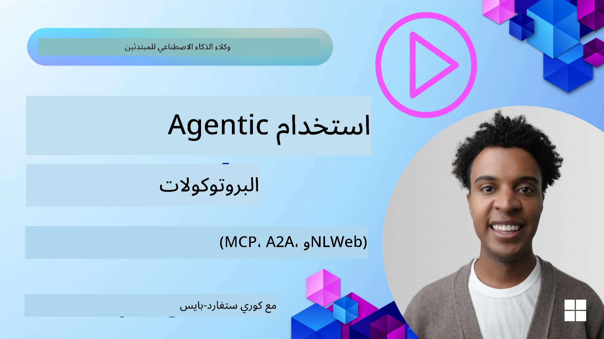
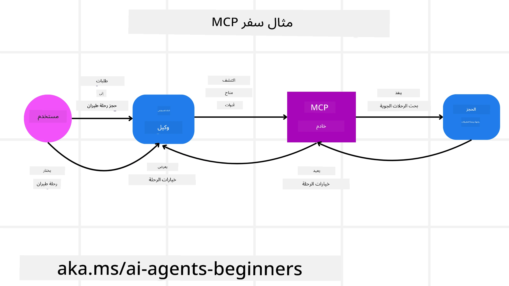
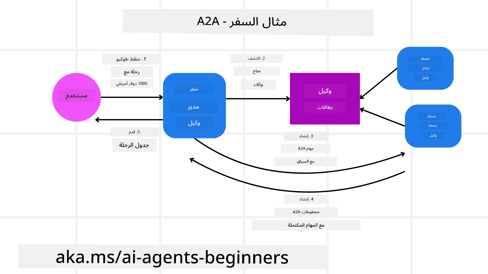
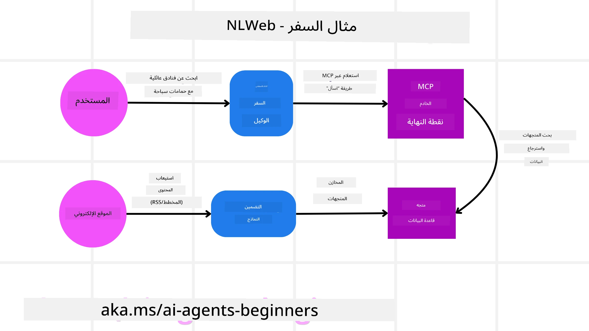

# استخدام بروتوكولات الوكلاء (MCP, A2A وNLWeb)

> _(انقر على الصورة أعلاه لمشاهدة فيديو هذا الدرس)_

مع تزايد استخدام وكلاء الذكاء الاصطناعي، يزداد أيضاً الحاجة إلى بروتوكولات تضمن التوحيد والأمان ودعم الابتكار المفتوح. في هذا الدرس، سنغطي 3 بروتوكولات تسعى لتلبية هذه الحاجة - **بروتوكول سياق النموذج (MCP)**، **وكيل إلى وكيل (A2A)** و**الويب اللغوي الطبيعي (NLWeb)**.

## مقدمة

في هذا الدرس، سنغطي:

• كيف يتيح **MCP** لوكلاء الذكاء الاصطناعي الوصول إلى أدوات وبيانات خارجية لإتمام مهام المستخدم.

• كيف يمكّن **A2A** التواصل والتعاون بين وكلاء الذكاء الاصطناعي المختلفين.

• كيف يجلب **NLWeb** واجهات باللغة الطبيعية إلى أي موقع ويب مما يتيح لوكلاء الذكاء الاصطناعي اكتشاف المحتوى والتفاعل معه.

## أهداف التعلم

• **تحديد** الغرض الأساسي وفوائد MCP وA2A وNLWeb في سياق وكلاء الذكاء الاصطناعي.

• **شرح** كيف يسهل كل بروتوكول التواصل والتفاعل بين نماذج اللغة الكبيرة (LLMs)، والأدوات، والوكلاء الآخرين.

• **التعرّف** على الأدوار المميزة التي يلعبها كل بروتوكول في بناء أنظمة وكيلية معقدة.

## بروتوكول سياق النموذج

The **بروتوكول سياق النموذج (MCP)** هو معيار مفتوح يوفر طريقة موحدة للتطبيقات لتقديم السياق والأدوات إلى نماذج اللغة الكبيرة. هذا يمكّن "محوّل عالمي" لمصادر البيانات والأدوات المختلفة التي يمكن لوكلاء الذكاء الاصطناعي الاتصال بها بشكل متسق.

لننظر إلى مكونات MCP، والفوائد مقارنة باستخدام واجهات برمجة التطبيقات المباشرة، ومثال لكيفية استخدام وكلاء الذكاء الاصطناعي لخادم MCP.

### MCP Core Components

MCP يعمل على **بنية عميل-خادم** والمكونات الأساسية هي:

• **Hosts** هي تطبيقات LLM (على سبيل المثال محرر شفرات مثل VSCode) التي تبدأ الاتصالات إلى خادم MCP.

• **Clients** هي مكونات داخل تطبيق المضيف التي تحافظ على اتصالات واحد لواحد مع الخوادم.

• **Servers** هي برامج خفيفة تعرض قدرات محددة.

مدمجة في البروتوكول هي ثلاث بدائيات أساسية والتي تمثل قدرات خادم MCP:

• **Tools**: هي إجراءات أو وظائف منفصلة يمكن لوكيل الذكاء الاصطناعي استدعاؤها لأداء فعل ما. على سبيل المثال، قد يكشف خدمة الطقس عن أداة "get weather"، أو قد يكشف خادم التجارة الإلكترونية عن أداة "purchase product". تعلن خوادم MCP عن اسم كل أداة ووصفها ومخطط الإدخال/الإخراج في قائمة قدراتها.

• **Resources**: هي عناصر بيانات أو مستندات للقراءة فقط يمكن أن يوفرها خادم MCP، ويمكن للعملاء استرجاعها عند الطلب. أمثلة تشمل محتويات الملفات، سجلات قواعد البيانات، أو سجلات الأحداث. يمكن أن تكون الموارد نصية (مثل الشفرة أو JSON) أو ثنائية (مثل الصور أو ملفات PDF).

• **Prompts**: هي قوالب محددة مسبقًا توفر اقتراحات للـ prompts، مما يسمح بسير عمل أكثر تعقيدًا.

### فوائد MCP

MCP يقدم مزايا كبيرة لوكلاء الذكاء الاصطناعي:

• **اكتشاف أدوات ديناميكي**: يمكن للوكلاء استقبال قائمة بالأدوات المتاحة من الخادم بشكل ديناميكي مع أوصاف لما تقوم به. هذا يتباين مع واجهات برمجة التطبيقات التقليدية، التي تتطلب غالبًا برمجة ثابتة للتكاملات، مما يعني أن أي تغيير في واجهة برمجة التطبيقات يستلزم تحديث الشفرة. يقدم MCP نهج "الدمج مرة واحدة"، مما يؤدي إلى قدرة تكيف أكبر.

• **التشغيل البيني عبر نماذج اللغة**: يعمل MCP عبر نماذج لغة مختلفة، مما يوفر المرونة لتغيير النماذج الأساسية لتقييم أداء أفضل.

• **أمان موحد**: يتضمن MCP طريقة مصادقة قياسية، مما يحسّن القابلية للتوسع عند إضافة وصول إلى خوادم MCP إضافية. هذا أبسط من إدارة مفاتيح وأنواع مصادقة مختلفة لواجهات برمجة التطبيقات التقليدية المختلفة.

### مثال MCP

تخيل أن مستخدمًا يريد حجز رحلة جوية باستخدام مساعد ذكي يعمل بواسطة MCP.

1. **الاتصال**: يتصل المساعد الذكي (عميل MCP) بخادم MCP الذي توفره شركة الطيران.

2. **اكتشاف الأدوات**: يسأل العميل خادم MCP الخاص بشركة الطيران، "ما الأدوات المتاحة لديكم؟" يرد الخادم بأدوات مثل "search flights" و"book flights".

3. **استدعاء الأداة**: ثم تطلب من المساعد الذكي، "يرجى البحث عن رحلة من بورتلاند إلى هونولولو." يحدد المساعد الذكي، باستخدام نموذج اللغة الخاص به، أنه يحتاج إلى استدعاء أداة "search flights" ويمرر المعاملات ذات الصلة (المغادرة، الوجهة) إلى خادم MCP.

4. **التنفيذ والاستجابة**: يقوم خادم MCP، بصفته غلافًا، بإجراء الاستدعاء الفعلي إلى واجهة حجز شركة الطيران الداخلية. ثم يستلم معلومات الرحلة (مثل بيانات JSON) ويعيدها إلى المساعد الذكي.

5. **تفاعل إضافي**: يعرض المساعد الذكي خيارات الرحلة. بمجرد اختيارك لرحلة، قد يستدعي المساعد أداة "book flight" على نفس خادم MCP، مكتملاً الحجز.

## بروتوكول وكيل إلى وكيل (A2A)

بينما يركز MCP على ربط نماذج اللغة بالأدوات، يأخذ **بروتوكول وكيل إلى وكيل (A2A)** الأمر خطوة أبعد بتمكين التواصل والتعاون بين وكلاء الذكاء الاصطناعي المختلفين. يربط A2A وكلاء الذكاء الاصطناعي عبر مؤسسات وبيئات وأطر تقنية مختلفة لإكمال مهمة مشتركة.

سنفحص مكونات وفوائد A2A، إلى جانب مثال حول كيفية تطبيقه في تطبيق السفر الخاص بنا.

### المكونات الأساسية لـA2A

يركز A2A على تمكين التواصل بين الوكلاء وجعلهم يعملون معًا لإكمال جزء من مهمة المستخدم. تساهم كل مكوّن من مكونات البروتوكول في ذلك:

#### Agent Card

ممشابهاً لكيفية مشاركة خادم MCP لقائمة الأدوات، تحتوي بطاقة الوكيل على:
- اسم الوكيل .
- **وصف للمهام العامة** التي يكملها.
- **قائمة بالمهارات المحددة** مع أوصاف لمساعدة الوكلاء الآخرين (أو حتى المستخدمين البشريين) على فهم متى ولماذا قد يرغبون في استدعاء ذلك الوكيل.
- **current Endpoint URL** الخاص بالوكيل
- **الإصدار** و**القدرات** للوكيل مثل الاستجابات المتدفقة والإشعارات الدفعية.

#### Agent Executor

المسؤول عن **تمرير سياق محادثة المستخدم إلى الوكيل البعيد**؛ يحتاج الوكيل البعيد هذا لفهم المهمة التي يجب إكمالها. في خادم A2A، يستخدم الوكيل نموذج اللغة الكبير الخاص به لتحليل الطلبات الواردة وتنفيذ المهام باستخدام أدواته الداخلية الخاصة.

#### Artifact

بمجرد أن يكمل الوكيل البعيد المهمة المطلوبة، يتم إنشاء منتجه العملي كأثر. يحتوي الأثر على **نتيجة عمل الوكيل**، و**وصف ما تم إنجازه**، و**السياق النصي** الذي يتم إرساله عبر البروتوكول. بعد إرسال الأثر، يتم إغلاق الاتصال مع الوكيل البعيد حتى يتم الحاجة إليه مرة أخرى.

#### Event Queue

يُستخدم هذا المكوّن **لمعالجة التحديثات وتمرير الرسائل**. يكون مهمًا بشكل خاص في الإنتاج لأنظمة الوكلاء لمنع إغلاق الاتصال بين الوكلاء قبل اكتمال المهمة، خاصة عندما قد تستغرق مدة إكمال المهام وقتًا أطول.

### فوائد A2A

• **تعزيز التعاون**: يمكّن الوكلاء من بائعين ومنصات مختلفة من التفاعل، ومشاركة السياق، والعمل معًا، مما يسهل الأتمتة السلسة عبر أنظمة كانت متصلة تقليديًا بشكل منفصل.

• **مرونة اختيار النموذج**: يمكن لكل وكيل A2A أن يقرر أي نموذج لغة كبير يستخدم لخدمة طلباته، مما يسمح بنماذج محسّنة أو مخصصة لكل وكيل، على عكس اتصال نموذج واحد في بعض سيناريوهات MCP.

• **مصادقة مدمجة**: يتم دمج المصادقة مباشرة في بروتوكول A2A، مما يوفر إطار أمني قوي لتفاعلات الوكلاء.

### مثال A2A

لنوسع سيناريو حجز السفر الخاص بنا، ولكن هذه المرة باستخدام A2A.

1. **طلب المستخدم إلى نظام متعدد الوكلاء**: يتفاعل المستخدم مع عميل/وكيل A2A "وكيل السفر"، ربما بقوله، "يرجى حجز رحلة كاملة إلى هونولولو للأسبوع المقبل، بما في ذلك الرحلات الجوية والفندق وسيارة للإيجار".

2. **تنسيق بواسطة وكيل السفر**: يستلم وكيل السفر هذا الطلب المعقد. يستخدم نموذج اللغة الخاص به للتفكير في المهمة وتحديد أنه يحتاج للتفاعل مع وكلاء متخصصين آخرين.

3. **التواصل بين الوكلاء**: ثم يستخدم وكيل السفر بروتوكول A2A للاتصال بوكلاء تابعين، مثل "وكيل شركة الطيران"، و"وكيل الفندق"، و"وكيل تأجير السيارات" التي أنشأتها شركات مختلفة.

4. **تفويض تنفيذ المهام**: يرسل وكيل السفر مهام محددة إلى هؤلاء الوكلاء المتخصصين (مثل "Find flights to Honolulu"، "Book a hotel"، "Rent a car"). كل من هؤلاء الوكلاء المتخصصين، الذين يشغلون نماذج اللغة الخاصة بهم ويستخدمون أدواتهم الخاصة (والتي قد تكون خوادم MCP بحد ذاتها)، ينفذ الجزء المحدد من الحجز.

5. **الاستجابة المجمعة**: بمجرد أن تكمل جميع الوكلاء التابعين مهامهم، يجمع وكيل السفر النتائج (تفاصيل الرحلة، تأكيد الفندق، حجز السيارة) ويرسل استجابة شاملة بأسلوب المحادثة إلى المستخدم.

## الويب اللغوي الطبيعي (NLWeb)

لطالما كانت مواقع الويب الوسيلة الأساسية للمستخدمين للوصول إلى المعلومات والبيانات عبر الإنترنت.

لننظر إلى المكونات المختلفة لـNLWeb، وفوائد NLWeb ومثال لكيفية عمل NLWeb في تطبيق السفر الخاص بنا.

### مكونات NLWeb

- **تطبيق NLWeb (كود الخدمة الأساسي)**: النظام الذي يعالج أسئلة اللغة الطبيعية. يربط الأجزاء المختلفة للمنصة لإنشاء الردود. يمكنك التفكير فيه كمحرك يُشغّل ميزات اللغة الطبيعية في الموقع.

- **بروتوكول NLWeb**: هذه مجموعة أساسية من القواعد للتفاعل باللغة الطبيعية مع موقع ويب. يعيد الردود في شكل JSON (غالبًا باستخدام Schema.org). هدفه إنشاء أساس بسيط لـ "الويب الذكي" بنفس الطريقة التي جعل بها HTML من الممكن مشاركة المستندات عبر الإنترنت.

- **خادم MCP (نقطة نهاية بروتوكول سياق النموذج)**: يعمل كل إعداد NLWeb أيضًا كخادم **MCP**. هذا يعني أنه يمكنه **مشاركة الأدوات (مثل طريقة "ask") والبيانات** مع أنظمة ذكاء اصطناعي أخرى. عمليًا، يجعل ذلك محتوى وإمكانات الموقع قابلة للاستخدام من قبل وكلاء الذكاء الاصطناعي، مما يسمح للموقع بأن يصبح جزءًا من "نظام الوكلاء" الأوسع.

- **نماذج التضمين**: تُستخدم هذه النماذج **لتحويل محتوى الموقع إلى تمثيلات رقمية تُسمى متجهات** (التضمينات). تلتقط هذه المتجهات المعنى بطريقة يمكن لأجهزة الحاسوب مقارنتها والبحث فيها. تُخزن في قاعدة بيانات خاصة، ويمكن للمستخدمين اختيار نموذج التضمين الذي يرغبون في استخدامه.

- **قاعدة بيانات المتجهات (آلية الاسترجاع)**: تخزن هذه القاعدة **تضمينات محتوى الموقع**. عندما يطرح شخص ما سؤالاً، يفحص NLWeb قاعدة بيانات المتجهات للعثور بسرعة على أكثر المعلومات ملاءمة. تعطي قائمة سريعة بالإجابات المحتملة، مرتبة حسب التشابه. يعمل NLWeb مع أنظمة تخزين متجهات مختلفة مثل Qdrant وSnowflake وMilvus وAzure AI Search وElasticsearch.

### مثال NLWeb

لنعد إلى موقع حجز السفر الخاص بنا، لكن هذه المرة يعمل بالاستناد إلى NLWeb.

1. **استيعاب البيانات**: يتم تنسيق كتالوجات المنتجات الحالية لموقع السفر (مثل قوائم الرحلات، أوصاف الفنادق، حزم الجولات) باستخدام Schema.org أو تحميلها عبر خلاصات RSS. تقوم أدوات NLWeb باستيعاب هذه البيانات المهيكلة، وإنشاء التضمينات، وتخزينها في قاعدة بيانات متجهات محلية أو بعيدة.

2. **استعلام باللغة الطبيعية (بشري)**: يزور المستخدم الموقع وبدلاً من التنقل عبر القوائم، يكتب في واجهة الدردشة: "ابحث لي عن فندق مناسب للعائلات في هونولولو مع مسبح للأسبوع المقبل".

3. **معالجة NLWeb**: يستقبل تطبيق NLWeb هذا الاستعلام. يرسله إلى نموذج اللغة لفهمه وفي الوقت ذاته يبحث في قاعدة بيانات المتجهات الخاصة به عن قوائم الفنادق ذات الصلة.

4. **نتائج دقيقة**: يساعد نموذج اللغة في تفسير نتائج البحث من قاعدة البيانات، وتحديد أفضل المطابقات بناءً على معايير "مناسب للعائلات"، "مسبح"، و"هونولولو"، ثم ينسق استجابة باللغة الطبيعية. والأهم أن الاستجابة تشير إلى فنادق فعلية من كتالوج الموقع، متجنبة المعلومات المُختلقة.

5. **تفاعل وكيل الذكاء الاصطناعي**: لأن NLWeb يعمل كخادم MCP، يمكن لوكيل سفر ذكي خارجي أيضًا الاتصال بنسخة NLWeb الخاصة بهذا الموقع. يمكن لوكيل الذكاء الاصطناعي بعد ذلك استخدام الدالة `ask("Are there any vegan-friendly restaurants in the Honolulu area recommended by the hotel?")`. ستقوم مثيبت NLWeb بمعالجة هذا، مستفيدة من قاعدة بيانات معلومات المطاعم (إذا تم تحميلها)، وإرجاع استجابة JSON منظمة.

### هل لديك المزيد من الأسئلة حول MCP/A2A/NLWeb؟

انضم إلى [خادم Microsoft Foundry على Discord](https://aka.ms/ai-agents/discord) للالتقاء بمتعلمين آخرين، وحضور ساعات المكتب، والحصول على إجابات لأسئلة وكلاء الذكاء الاصطناعي الخاصة بك.

## الموارد

- [MCP للمبتدئين](https://aka.ms/mcp-for-beginners)  
- [توثيق MCP](https://learn.microsoft.com/python/api/overview/azure/ai-projects-readme)
- [مستودع NLWeb](https://github.com/nlweb-ai/NLWeb)
- [إطار عمل الوكلاء من Microsoft](https://aka.ms/ai-agents-beginners/agent-framewrok)

---

<!-- CO-OP TRANSLATOR DISCLAIMER START -->
**إخلاء المسؤولية**:
تمت ترجمة هذا المستند باستخدام خدمة الترجمة الآلية [Co-op Translator](https://github.com/Azure/co-op-translator). بينما نسعى إلى الدقة، يرجى العلم أن الترجمات الآلية قد تحتوي على أخطاء أو عدم دقة. يجب اعتبار المستند الأصلي بلغته الأصلية المصدر المعتمد. بالنسبة للمعلومات الحرجة، يوصى بالاستعانة بترجمة بشرية محترفة. لا نتحمل أي مسؤولية عن أي سوء فهم أو تفسير قد ينشأ عن استخدام هذه الترجمة.
<!-- CO-OP TRANSLATOR DISCLAIMER END -->