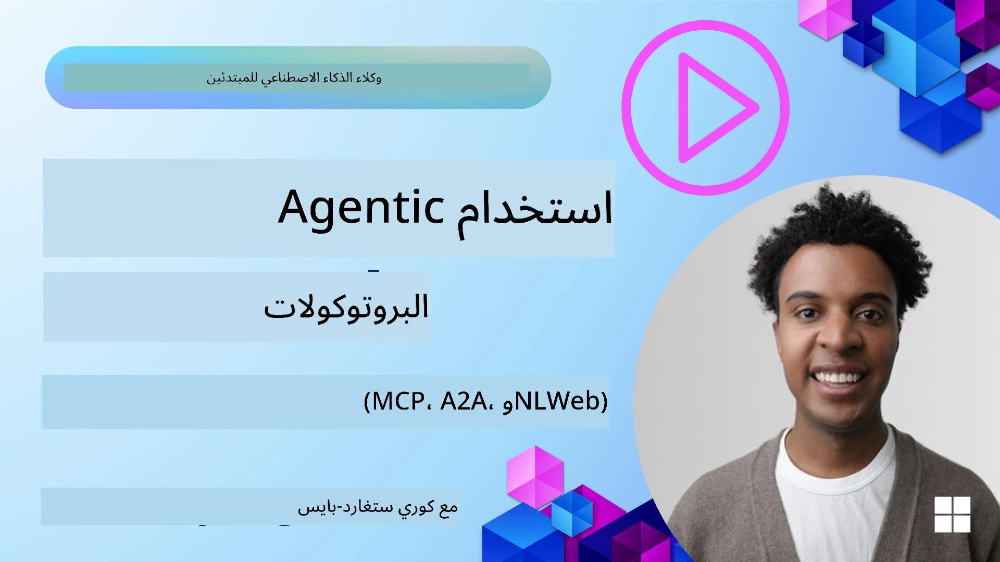
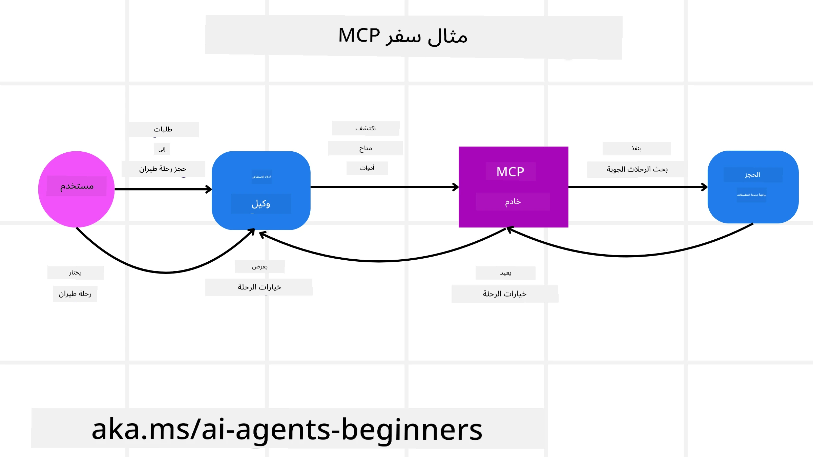
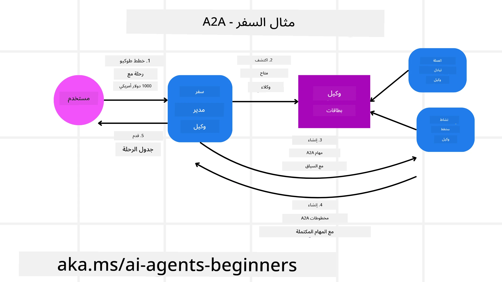
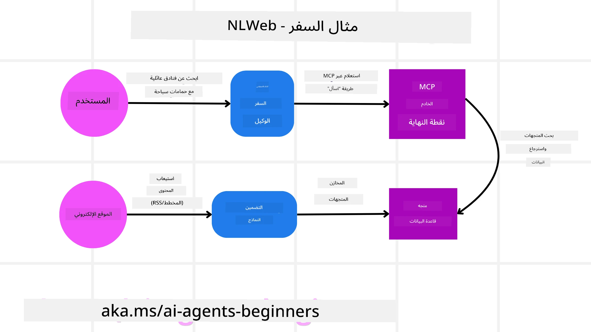

# استخدام بروتوكولات الوكيل (MCP، A2A و NLWeb)

> _(انقر على الصورة أعلاه لمشاهدة فيديو هذا الدرس)_

مع ازدياد استخدام وكلاء الذكاء الاصطناعي، يزداد أيضاً الحاجة إلى بروتوكولات تضمن التوحيد القياسي، الأمان، ودعم الابتكار المفتوح. في هذا الدرس، سوف نغطي 3 بروتوكولات تهدف إلى تلبية هذه الحاجة - بروتوكول سياق النموذج (MCP)، من وكيل إلى وكيل (A2A)، والويب باللغة الطبيعية (NLWeb).

## المقدمة

في هذا الدرس، سنغطي:

• كيف يسمح **MCP** لوكلاء الذكاء الاصطناعي بالوصول إلى الأدوات والبيانات الخارجية لإكمال مهام المستخدم.

• كيف يتيح **A2A** التواصل والتعاون بين وكلاء الذكاء الاصطناعي المختلفين.

• كيف يعزز **NLWeb** واجهات اللغة الطبيعية على أي موقع، مما يمكنك وكلاء الذكاء الاصطناعي من اكتشاف المحتوى والتفاعل معه.

## أهداف التعلم

• **تحديد** الهدف الأساسي والفوائد لبروتوكولات MCP، A2A، و NLWeb في سياق وكلاء الذكاء الاصطناعي.

• **شرح** كيف يسهل كل بروتوكول التواصل والتفاعل بين نماذج اللغة الكبيرة، الأدوات، والوكلاء الآخرين.

• **الاعتراف** بالأدوار المميزة التي يلعبها كل بروتوكول في بناء أنظمة وكلاء معقدة.

## بروتوكول سياق النموذج

**بروتوكول سياق النموذج (MCP)** هو معيار مفتوح يوفر طريقة موحدة للتطبيقات لتقديم السياق والأدوات لنماذج اللغة الكبيرة. هذا يمكّن "محولًا عالميًا" لمصادر البيانات والأدوات المختلفة التي يمكن لوكلاء الذكاء الاصطناعي الاتصال بها بطريقة متسقة.

دعونا نلقي نظرة على مكونات MCP، الفوائد مقارنة باستخدام API مباشرة، ومثال على كيفية استخدام وكلاء الذكاء الاصطناعي لخادم MCP.

### المكونات الأساسية لـ MCP

يعمل MCP على بنية **عميل-خادم** والمكونات الأساسية هي:

• **المضيفون** هم تطبيقات نماذج اللغة الكبيرة (مثل محرر الشفرات VSCode) التي تبدأ الاتصالات بخادم MCP.

• **العملاء** هم مكونات داخل تطبيق المضيف تحافظ على اتصالات واحد لواحد مع الخوادم.

• **الخوادم** هي برامج خفيفة تعرض قدرات محددة.

يتضمن البروتوكول ثلاث primitives أساسية تمثل قدرات خادم MCP:

• **الأدوات**: هي إجراءات أو وظائف محددة يمكن لوكيل الذكاء الاصطناعي استدعاؤها لأداء عمل. مثلاً، خدمة الطقس قد تعرض أداة "الحصول على الطقس"، أو خادم التجارة الإلكترونية قد يعرض أداة "شراء منتج". تعلن خوادم MCP عن اسم الأداة، وصفها، ومخطط الإدخال/الإخراج في قائمة قدراتها.

• **الموارد**: هي عناصر بيانات أو مستندات للقراءة فقط يمكن لخادم MCP توفيرها، ويمكن للعملاء استرجاعها عند الطلب. أمثلة تشمل محتويات الملفات، سجلات قواعد البيانات، أو ملفات السجل. الموارد يمكن أن تكون نصية (مثل الشفرة أو JSON) أو ثنائية (مثل الصور أو ملفات PDF).

• **المطالبات**: هي قوالب معدة مسبقًا تقدم مطالبات مقترحة، مما يسمح بسير عمل أكثر تعقيدًا.

### فوائد MCP

يقدم MCP مزايا كبيرة لوكلاء الذكاء الاصطناعي:

• **اكتشاف الأدوات ديناميكيًا**: يمكن للوكلاء تلقّي قائمة بالأدوات المتاحة من الخادم مع وصف ما تقوم به. هذا على عكس واجهات API التقليدية التي غالبًا ما تتطلب برمجيات ثابتة للتكامل، مما يعني أن أي تغيير في API يستوجب تحديث الكود. MCP يقدم نهج "تكامل مرة واحدة"، ما يؤدي إلى مرونة أكبر.

• **التشغيل البيني بين نماذج اللغة الكبيرة**: يعمل MCP عبر نماذج مختلفة، مما يوفر مرونة لتبديل النماذج الأساسية من أجل تقييم أداء أفضل.

• **الأمان الموحد**: يتضمن MCP طريقة مصادقة معيارية، تحسن من القدرة على التوسع عند إضافة وصول إلى خوادم MCP إضافية. هذا أبسط من إدارة مفاتيح وأنواع مصادقة مختلفة لواجهات API التقليدية المتنوعة.

### مثال MCP

تخيّل أن المستخدم يريد حجز رحلة باستخدام مساعد ذكي يعمل عبر MCP.

1. **الاتصال**: يتصل المساعد الذكي (عميل MCP) بخادم MCP تقدمه شركة طيران.

2. **اكتشاف الأدوات**: يطلب العميل من خادم MCP الخاص بشركة الطيران، "ما هي الأدوات المتاحة لديكم؟" يرد الخادم بأدوات مثل "البحث عن الرحلات" و"حجز الرحلات".

3. **استدعاء الأداة**: ثم تطلب من المساعد الذكي، "يرجى البحث عن رحلة من بورتلاند إلى هونولولو." يستخدم المساعد الذكي نموذج اللغة الخاص به ويدرك أنه يجب عليه استدعاء أداة "البحث عن الرحلات" مع تمرير المعطيات ذات الصلة (المغادرة، الوجهة) لخادم MCP.

4. **التنفيذ والرد**: يعمل خادم MCP كغلاف، وينفذ الاستدعاء الفعلي لواجهة حجز شركة الطيران الداخلية. بعد استقبال معلومات الرحلة (مثل بيانات JSON) يرسلها مرة أخرى إلى المساعد الذكي.

5. **التفاعل المستمر**: يعرض المساعد الخيارات المتاحة للرحلات. بمجرد اختيارك رحلة معينة، قد يستدعي المساعد أداة "حجز الرحلة" على نفس خادم MCP لإكمال الحجز.

## بروتوكول من وكيل إلى وكيل (A2A)

بينما يركز MCP على ربط نماذج اللغة الكبيرة بالأدوات، يذهب بروتوكول **من وكيل إلى وكيل (A2A)** خطوة أبعد من خلال تمكين التواصل والتعاون بين وكلاء الذكاء الاصطناعي المختلفين. يربط A2A وكلاء الذكاء الاصطناعي عبر منظمات وبيئات وتقنيات مختلفة لإتمام مهمة مشتركة.

سنستعرض مكونات وفوائد A2A، جنبًا إلى جنب مع مثال على كيفية تطبيقه في تطبيق السفر الخاص بنا.

### المكونات الأساسية لـ A2A

يركز A2A على تمكين التواصل بين الوكلاء والعمل سويةً لإنجاز جزء من مهمة المستخدم. كل مكون من البروتوكول يساهم في ذلك:

#### بطاقة الوكيل

على غرار مشاركة خادم MCP قائمة الأدوات، تحتوي بطاقة الوكيل على:
- اسم الوكيل.
- **وصف للمهام العامة** التي ينفذها.
- **قائمة بالمهارات المحددة** مع أوصاف لمساعدة الوكلاء الآخرين (أو حتى المستخدمين) على فهم متى ولماذا يرغبون في استدعاء هذا الوكيل.
- **عنوان نقطة النهاية الحالي** للوكيل.
- **الإصدار** و**القدرات** الخاصة بالوكيل مثل التدفق الحي للردود والإشعارات الفورية.

#### منفذ الوكيل

مسؤول عن **تمرير سياق محادثة المستخدم إلى الوكيل عن بعد**، يحتاج الوكيل البعيد هذا لفهم المهمة التي يتعين إنجازها. في خادم A2A، يستخدم الوكيل نموذج اللغة الكبير الخاص به لتحليل الطلبات الواردة وتنفيذ المهام باستخدام أدواته الداخلية.

#### المنتج (Artifact)

بعد أن يكمل الوكيل البعيد المهمة المطلوبة، يتم إنشاء منتج عمل كـ artifact. يحتوي المنتج **على نتيجة عمل الوكيل**، و**وصف لما تم إنجازه**، و**سياق النص** الذي يُرسل عبر البروتوكول. بعد إرسال artifact، يتم إغلاق الاتصال مع الوكيل البعيد حتى الحاجة إليه مجددًا.

#### قائمة الأحداث

تُستخدم هذه المكونة لـ **معالجة التحديثات وتمرير الرسائل**. وهي مهمة خصوصًا في الإنتاج لأنظمة الوكلاء لمنع إغلاق الاتصال بين الوكلاء قبل اكتمال المهمة، خاصةً عندما تستغرق أوقات إكمال المهام فترة طويلة.

### فوائد A2A

• **تعزيز التعاون**: يمكّن الوكلاء من بائعين ومنصات مختلفة من التفاعل، مشاركة السياق، والعمل معًا، مما يسهل الأتمتة السلسة عبر أنظمة تقليديًا منفصلة.

• **مرونة اختيار النموذج**: يمكن لكل وكيل A2A أن يختار نموذج اللغة الكبير الذي يستخدمه لخدمة طلباته، مما يسمح باستخدام نماذج محسنة أو مخصصة لكل وكيل، بخلاف اتصال LLM واحد في بعض سيناريوهات MCP.

• **المصادقة المدمجة**: تتضمن المصادقة مدمجة مباشرة في بروتوكول A2A، مما يوفر إطار أمني قوي لتفاعلات الوكلاء.

### مثال A2A

دعونا نوسّع في سيناريو حجز السفر الخاص بنا، لكن هذه المرة باستخدام A2A.

1. **طلب المستخدم إلى وكلاء متعددين**: يتفاعل المستخدم مع وكيل/عميل A2A يُدعى "وكيل السفر"، ربما بقول، "يرجى حجز رحلة كاملة إلى هونولولو للأسبوع القادم تشمل الطيران، فندق، وتأجير سيارة".

2. **تنسيق من وكيل السفر**: يتلقى وكيل السفر هذا الطلب المعقد. يستخدم نموذج اللغة الخاص به ليحلل المهمة ويحدد أنه يحتاج للتفاعل مع وكلاء متخصصين آخرين.

3. **التواصل بين الوكلاء**: يستخدم وكيل السفر بعد ذلك بروتوكول A2A للاتصال بالوكلاء الفرعيين، مثل "وكيل شركة الطيران"، "وكيل الفندق"، و"وكيل تأجير السيارات" التي أنشأتها شركات مختلفة.

4. **تنفيذ المهام المفوضة**: يرسل وكيل السفر مهامًا محددة لهؤلاء الوكلاء المتخصصين (مثل "البحث عن رحلات إلى هونولولو"، "حجز فندق"، "تأجير سيارة"). كل واحد من هؤلاء الوكلاء المتخصصين، الذين يشغلون نماذج اللغة الخاصة بهم ويستخدمون أدواتهم (التي قد تكون خوادم MCP في حد ذاتها)، ينفذ جزءه الخاص من الحجز.

5. **الرد الموحد**: عندما ينهي كل الوكلاء الفرعيين مهامهم، يجمع وكيل السفر النتائج (تفاصيل الرحلات، تأكيد الفندق، حجز السيارة) ويرسل ردًا شاملًا بأسلوب محادثة إلى المستخدم.

## الويب باللغة الطبيعية (NLWeb)

لطالما كانت المواقع الإلكترونية الوسيلة الأساسية للمستخدمين للوصول إلى المعلومات والبيانات عبر الإنترنت.

دعونا نلقي نظرة على مكونات NLWeb المختلفة، فوائد NLWeb، ومثال لكيفية عمل NLWeb من خلال تطبيق السفر الخاص بنا.

### مكونات NLWeb

- **تطبيق NLWeb (كود الخدمة الأساسية)**: النظام الذي يعالج الأسئلة باللغة الطبيعية. يربط أجزاء النظام المختلفة لإنشاء ردود. يمكن اعتباره **المحرك الذي يدعم ميزات اللغة الطبيعية** على الموقع.

- **بروتوكول NLWeb**: هو **مجموعة قواعد أساسية للتفاعل باللغة الطبيعية** مع موقع إلكتروني. يعيد الردود بصيغة JSON (غالبًا باستخدام Schema.org). هدفه هو إنشاء أساس بسيط لـ "ويب الذكاء الاصطناعي"، تمامًا كما جعل HTML من الممكن مشاركة الوثائق عبر الإنترنت.

- **خادم MCP (نقطة نهاية بروتوكول سياق النموذج)**: كل نظام NLWeb يعمل أيضًا كـ **خادم MCP**. هذا يعني أنه يمكنه **مشاركة الأدوات (مثل طريقة "ask") والبيانات** مع أنظمة ذكاء اصطناعي أخرى. عمليًا، يجعل هذا محتوى الموقع وقدراته قابلة للاستخدام بواسطة الوكلاء، مما يسمح للموقع بأن يصبح جزءًا من "نظام الوكلاء" الأوسع.

- **نماذج التضمين**: تُستخدم هذه النماذج **لتحويل محتوى الموقع إلى تمثيلات عددية تُسمى متجهات** (embeddings). تلتقط هذه المتجهات المعنى بطريقة يمكن للحواسيب مقارنتها والبحث فيها. تُخزن في قاعدة بيانات خاصة، ويمكن للمستخدمين اختيار نموذج التضمين الذي يرغبون في استخدامه.

- **قاعدة بيانات المتجهات (آلية الاسترجاع)**: تخزن هذه القاعدة **تضمينات محتوى الموقع**. عند طرح سؤال، يفحص NLWeb قاعدة بيانات المتجهات لإيجاد المعلومات الأكثر صلة بسرعة. يعطي قائمة سريعة للإجابات المحتملة، مرتبة حسب التشابه. يعمل NLWeb مع أنظمة تخزين متجهات مختلفة مثل Qdrant و Snowflake و Milvus و Azure AI Search و Elasticsearch.

### NLWeb كمثال

لنأخذ موقع حجز السفر الخاص بنا مرة أخرى، لكن هذه المرة مزود بـ NLWeb.

1. **استيعاب البيانات**: يتم تنسيق قوائم المنتجات الحالية (مثل قوائم الرحلات، وصف الفنادق، حزم الجولات) باستخدام Schema.org أو يتم تحميلها عبر خلاصات RSS. تقوم أدوات NLWeb بامتصاص هذه البيانات المنظمة، إنشاء التضمينات، وتخزينها في قاعدة بيانات متجهات محلية أو عن بُعد.

2. **سؤال باللغة الطبيعية (البشر)**: يزور المستخدم الموقع وبدلاً من التنقل عبر القوائم، يكتب في واجهة محادثة: "ابحث لي عن فندق مناسب للعائلات في هونولولو مع مسبح للأسبوع المقبل".

3. **معالجة NLWeb**: يستقبل تطبيق NLWeb هذا السؤال. يرسله إلى نموذج اللغة الكبيرة للفهم، وفي الوقت ذاته يبحث في قاعدة بيانات المتجهات عن قوائم الفنادق ذات الصلة.

4. **نتائج دقيقة**: يساعد نموذج اللغة في تفسير نتائج البحث، تحديد أفضل التطابقات بناءً على معايير "مناسب للعائلات"، "مسبح"، و"هونولولو"، ثم ينشئ ردًا باللغة الطبيعية. والأهم من ذلك، يشير الرد إلى فنادق فعلية من كتالوج الموقع، متجنبًا المعلومات المختلقة.

5. **تفاعل وكيل الذكاء الاصطناعي**: بما أن NLWeb يعمل كخادم MCP، يمكن لوكيل السفر الذكي خارجيًا الاتصال بمنصة NLWeb الخاصة بهذا الموقع. يمكن للوكيل استخدام طريقة `ask` في MCP لسؤال الموقع مباشرة: `ask("هل توجد مطاعم نباتية موصى بها بالقرب من الفندق في منطقة هونولولو؟")`. يعالج NLWeb هذا الطلب باستخدام قاعدة بيانات المطاعم (إن تم تحميلها) ويرد برد منسق بصيغة JSON.

### هل لديك المزيد من الأسئلة حول MCP/A2A/NLWeb؟

انضم إلى [خادم Discord الخاص بـ Microsoft Foundry](https://discord.com/invite/ATgtXmAS5D) لتلتقي مع متعلمين آخرين، تحضر ساعات العمل، وتحصل على إجابات لأسئلتك حول وكلاء الذكاء الاصطناعي.

## الموارد

- [MCP للمبتدئين](https://aka.ms/mcp-for-beginners)  
- [توثيق MCP](https://learn.microsoft.com/python/api/overview/azure/ai-projects-readme)
- [مستودع NLWeb](https://github.com/nlweb-ai/NLWeb)
- [إطار عمل وكيل Microsoft](https://learn.microsoft.com/en-us/agent-framework/overview/?wt.mc_id=youtube_26688_organicsocial_reactor&pivots=programming-language-python)

## الدرس السابق

[وكلاء الذكاء الاصطناعي في البيئة الإنتاجية](../10-ai-agents-production/README.md)

## الدرس التالي

[هندسة السياق لوكلاء الذكاء الاصطناعي](../12-context-engineering/README.md)

---

<!-- CO-OP TRANSLATOR DISCLAIMER START -->
**تنويه**:
تمت ترجمة هذا المستند باستخدام خدمة الترجمة بالذكاء الاصطناعي [Co-op Translator](https://github.com/Azure/co-op-translator). بينما نسعى للدقة، يرجى العلم أن الترجمات الآلية قد تحتوي على أخطاء أو عدم دقة. يجب اعتبار المستند الأصلي بلغته الأصلية المصدر الرسمي والمعتمد. للمعلومات الهامة، يُنصح بالاستعانة بترجمة بشرية محترفة. نحن غير مسؤولين عن أي سوء فهم أو تفسير ناتج عن استخدام هذه الترجمة.
<!-- CO-OP TRANSLATOR DISCLAIMER END -->