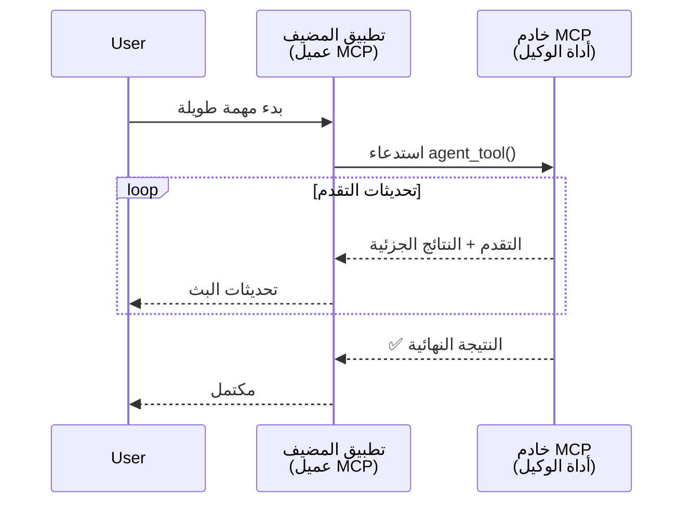
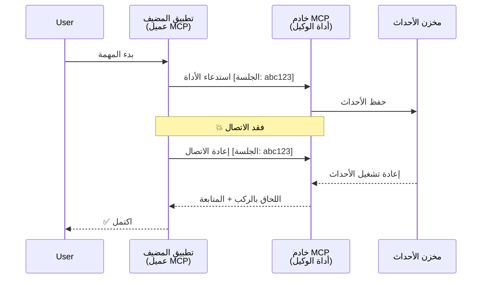
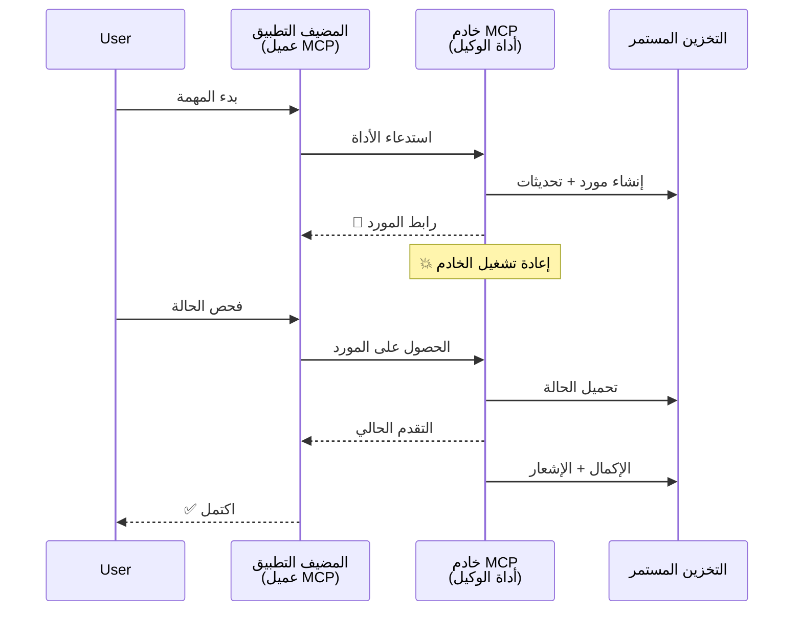
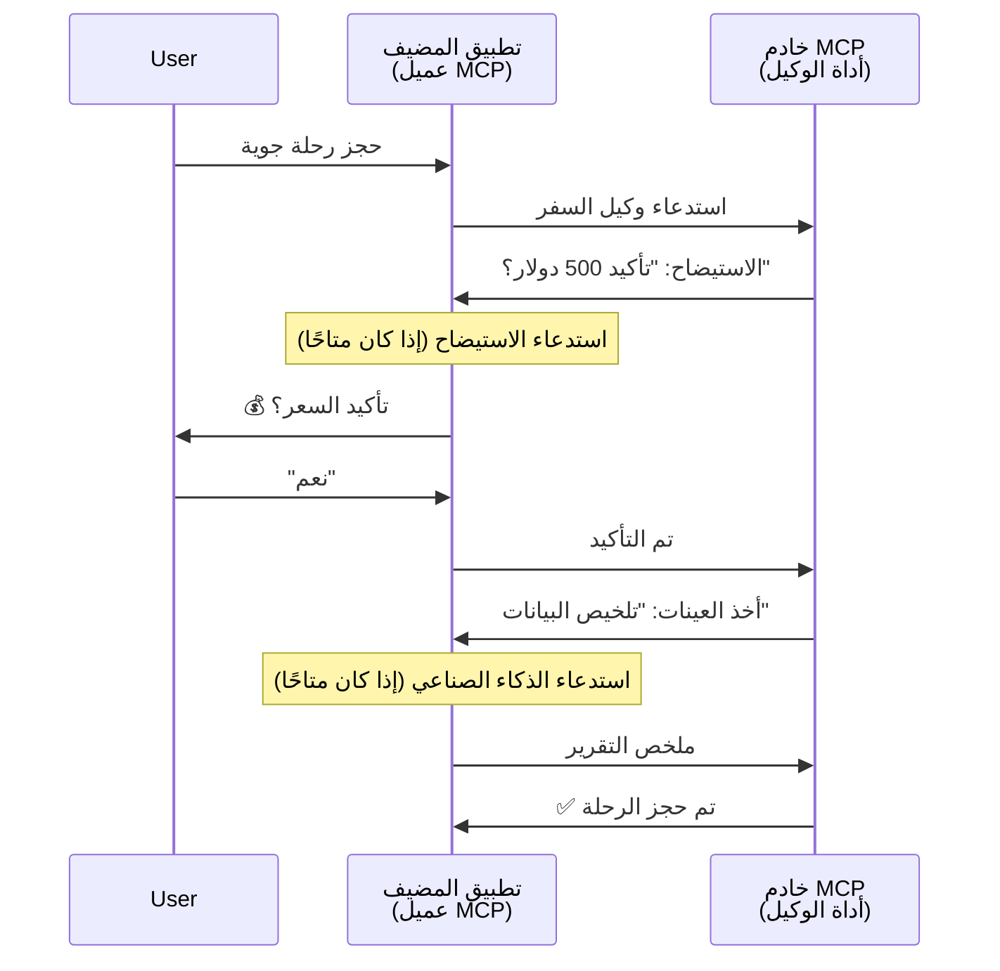

# بناء أنظمة الاتصال بين الوكلاء باستخدام MCP

> ملخص سريع - هل يمكنك بناء اتصال Agent2Agent على MCP؟ نعم!

لقد تطور MCP بشكل كبير يتجاوز هدفه الأصلي المتمثل في "توفير السياق لنماذج اللغة الكبيرة". مع التحسينات الأخيرة التي تشمل [التدفقات القابلة للاستئناف](https://modelcontextprotocol.io/docs/concepts/transports#resumability-and-redelivery)، [الاستيضاح](https://modelcontextprotocol.io/specification/2025-06-18/client/elicitation)، [العينة](https://modelcontextprotocol.io/specification/2025-06-18/client/sampling)، والإشعارات ([التقدم](https://modelcontextprotocol.io/specification/2025-06-18/basic/utilities/progress) و [الموارد](https://modelcontextprotocol.io/specification/2025-06-18/schema#resourceupdatednotification))، أصبح MCP الآن يوفر أساسًا قويًا لبناء أنظمة اتصال معقدة بين الوكلاء.

## المفهوم الخاطئ حول الوكيل/الأداة

مع قيام المزيد من المطورين باستكشاف الأدوات ذات السلوكيات الوكيلة (تشغيل لفترات طويلة، قد تتطلب إدخالات إضافية أثناء التنفيذ، إلخ)، يوجد misconception شائع بأن MCP غير مناسب في الأساس لأن الأمثلة المبكرة لأدواته كانت تركز على أنماط طلب-استجابة بسيطة.

هذا التصور قديم. تم تحسين مواصفات MCP بشكل كبير خلال الأشهر الأخيرة مع قدرات تغلق الفجوة لبناء سلوكيات وكيلة طويلة الأمد:

- **البث والنتائج الجزئية**: تحديثات التقدم في الوقت الحقيقي أثناء التنفيذ
- **القابلية للاستئناف**: يمكن للعملاء إعادة الاتصال والمتابعة بعد الانفصال
- **الثبات**: تبقى النتائج بعد إعادة تشغيل الخادم (مثلاً عبر روابط الموارد)
- **تعدد الأدوار**: إدخال تفاعلي أثناء التنفيذ عبر الاستيضاح والعينة

يمكن تركيب هذه الميزات لتمكين تطبيقات وكيلة ومتعددة وكلاء معقدة، كلها تعمل على بروتوكول MCP.

للمرجعية، سنشير إلى الوكيل كـ "أداة" متوفرة على خادم MCP. هذا يعني وجود تطبيق مضيف ينفذ عميل MCP الذي ينشئ جلسة مع خادم MCP ويمكنه استدعاء الوكيل.

## ما الذي يجعل أداة MCP "وكيلية"؟

قبل الخوض في التنفيذ، دعونا نحدد القدرات الأساسية للبنية التحتية اللازمة لدعم الوكلاء طويلِّي الأمد.

> سنعرف الوكيل ككيان قادر على العمل بصورة مستقلة لفترات ممتدة، وقادر على التعامل مع مهام معقدة قد تتطلب تفاعلات متعددة أو تعديلات بناءً على التغذية الراجعة في الوقت الحقيقي.

### 1. البث والنتائج الجزئية

أنماط الطلب-الاستجابة التقليدية لا تعمل للمهام طويلة الأمد. يحتاج الوكلاء إلى توفير:

- تحديثات تقدم في الوقت الحقيقي
- نتائج وسيطة

**دعم MCP**: إعلامات تحديث الموارد تتيح بث نتائج جزئية، رغم أن هذا يتطلب تصميمًا دقيقًا لتجنب التعارضات مع نموذج طلب/استجابة JSON-RPC بواحد إلى واحد.

| الميزة                        | حالة الاستخدام                                                                                                                                                             | دعم MCP                                                                                   |
| ---------------------------- | -------------------------------------------------------------------------------------------------------------------------------------------------------------------------- | ----------------------------------------------------------------------------------------- |
| تحديثات التقدم في الوقت الحقيقي | يطلب المستخدم مهمة هجرة قاعدة الشفرة. يقوم الوكيل ببث التقدم: "10% - تحليل التبعيات... 25% - تحويل ملفات TypeScript... 50% - تحديث الاستيرادات..."                        | ✅ إشعارات التقدم                                                                        |
| النتائج الجزئية               | مهمة "توليد كتاب" تبث النتائج الجزئية، مثال: 1) مخطط القصة، 2) قائمة الفصول، 3) كل فصل عند الانتهاء. يمكن للمضيف الفحص، الإلغاء، أو إعادة التوجيه في أي مرحلة.           | ✅ يمكن "تمديد" الإشعارات لتشمل النتائج الجزئية انظر الاقتراحات في PR 383، 776              |

<div align="center" style="font-style: italic; font-size: 0.95em; margin-bottom: 0.5em;">
<strong>الشكل 1:</strong> يوضح هذا الرسم كيف يقوم وكيـل MCP ببث تحديثات تقدم في الوقت الحقيقي ونتائج جزئية لتطبيق المضيف أثناء مهمة طويلة الأمد، ما يمكّن المستخدم من مراقبة التنفيذ في الوقت الفعلي.
</div>



### 2. القابلية للاستئناف

يجب أن يتعامل الوكلاء مع انقطاعات الشبكة بسلاسة:

- إعادة الاتصال بعد انفصال العميل
- المتابعة من حيث توقفوا (إعادة تسليم الرسائل)

**دعم MCP**: نقل StreamableHTTP في MCP يدعم اليوم استئناف الجلسة وإعادة تسليم الرسائل باستخدام معرفات الجلسة ومعرفات الحدث الأخيرة. الملاحظة الهامة هنا أن الخادم يجب أن ينفذ EventStore يمكّن من إعادة تشغيل الأحداث عند إعادة اتصال العميل.
تجدر الإشارة إلى وجود اقتراح مجتمعي (PR #975) يستكشف التدفقات القابلة للاستئناف غير المعتمدة على النقل.

| الميزة          | حالة الاستخدام                                                                                                                                               | دعم MCP                                                                  |
| -------------- | ------------------------------------------------------------------------------------------------------------------------------------------------------------ | ------------------------------------------------------------------------ |
| القابلية للاستئناف | العميل ينقطع أثناء مهمة طويلة الأمد. عند إعادة الاتصال، تستأنف الجلسة مع إعادة تشغيل الأحداث المفقودة، تستمر بسلاسة من حيث توقفت.                             | ✅ نقل StreamableHTTP مع معرفات الجلسة، إعادة تشغيل الأحداث، وEventStore |

<div align="center" style="font-style: italic; font-size: 0.95em; margin-bottom: 0.5em;">
<strong>الشكل 2:</strong> يوضح هذا الرسم كيف يسمح نقل StreamableHTTP وEventStore في MCP باستئناف الجلسات بسلاسة: إذا انقطع العميل، يمكنه إعادة الاتصال وإعادة تشغيل الأحداث المفقودة، مستمراً في المهمة دون فقدان التقدم.
</div>



### 3. الثبات

يحتاج الوكلاء طويلو الأمد إلى حالة دائمة:

- تبقى النتائج بعد إعادة تشغيل الخادم
- يمكن استرجاع الحالة بشكل غير مباشر
- تتبع التقدم عبر الجلسات

**دعم MCP**: يدعم MCP الآن نوع إرجاع رابط المورد لاستدعاءات الأدوات. اليوم، نمط ممكن هو تصميم أداة تنشئ مورداً وتُرجع فوراً رابط المورد. يمكن للأداة الاستمرار في معالجة المهمة في الخلفية وتحديث المورد. ويمكن للعميل أن يختار استطلاع حالة هذا المورد للحصول على نتائج جزئية أو كاملة (بناءً على تحديثات المورد التي يقدمها الخادم) أو الاشتراك للحصول على إشعارات تحديث.

أحد القيود هنا هو أن استطلاع الموارد أو الاشتراك في التحديثات يمكن أن يستهلك الموارد مع تداعيات على النطاق الكبير. هناك اقتراح مجتمعي مفتوح (بما في ذلك #992) يستكشف إمكانية تضمين webhooks أو مشغلات يمكن للخادم استخدامها لإبلاغ العميل/تطبيق المضيف بالتحديثات.

| الميزة  | حالة الاستخدام                                                                                                                                    | دعم MCP                                                        |
| -------- | ------------------------------------------------------------------------------------------------------------------------------------------------- | ---------------------------------------------------------------- |
| الثبات   | تعطل الخادم أثناء مهمة ترحيل البيانات. نتائج التقدم تبقى بعد إعادة التشغيل، يمكن للعميل التحقق من الحالة والمتابعة عبر المورد الدائم.               | ✅ روابط الموارد مع تخزين دائم وإشعارات الحالة                  |

اليوم، نمط شائع هو تصميم أداة تنشئ مورداً وتعيد فوراً رابط المورد. يمكن للأداة معالجة المهمة في الخلفية، إصدار إشعارات الموارد التي تعمل كمستجدات تقدم أو تشمل نتائج جزئية، وتحديث المحتوى في المورد حسب الحاجة.

<div align="center" style="font-style: italic; font-size: 0.95em; margin-bottom: 0.5em;">
<strong>الشكل 3:</strong> يوضح هذا الرسم كيف يستخدم وكلاء MCP الموارد الدائمة وإشعارات الحالة لضمان بقاء المهام طويلة الأمد بعد إعادة تشغيل الخادم، مما يسمح للعملاء بفحص التقدم واسترجاع النتائج حتى بعد حدوث أعطال.
</div>



### 4. التفاعلات متعددة الأدوار

غالبًا ما يحتاج الوكلاء إلى إدخالات إضافية أثناء التنفيذ:

- توضيحات أو موافقات بشرية
- مساعدة ذكية لاتخاذ قرارات معقدة
- تعديل المعلمات بشكل ديناميكي

**دعم MCP**: مدعوم بالكامل عبر الاستيضاح (للإدخال البشري) والعينة (لإدخال الذكاء الاصطناعي).

| الميزة               | حالة الاستخدام                                                                                                                                          | دعم MCP                                                |
| --------------------- | ------------------------------------------------------------------------------------------------------------------------------------------------------- | ------------------------------------------------------- |
| التفاعلات متعددة الأدوار | وكيل حجز سفر يطلب تأكيد السعر من المستخدم، ثم يطلب من الذكاء الاصطناعي تلخيص بيانات السفر قبل إتمام الحجز.                                        | ✅ الاستيضاح للإدخال البشري، العينة لإدخال الذكاء الاصطناعي |

<div align="center" style="font-style: italic; font-size: 0.95em; margin-bottom: 0.5em;">
<strong>الشكل 4:</strong> يوضح هذا الرسم كيف يمكن لوكلاء MCP استيضاح الإدخال البشري تفاعليًا أو طلب مساعدة الذكاء الاصطناعي أثناء التنفيذ، مما يدعم سير العمل المعقد والمتعدد الأدوار مثل التأكيدات واتخاذ القرارات الديناميكية.
</div>



## تنفيذ وكلاء طويلين الأمد على MCP - نظرة عامة على الكود

كجزء من هذا المقال، نقدم [مستودع كود](https://github.com/victordibia/ai-tutorials/tree/main/MCP%20Agents) يحتوي على تنفيذ كامل للوكلاء طويلين الأمد باستخدام MCP Python SDK مع نقل StreamableHTTP لاستئناف الجلسة وإعادة تسليم الرسائل. يوضح التنفيذ كيف يمكن تركيب قدرات MCP لتمكين سلوكيات معقدة تشبه الوكلاء.

تحديدًا، ننفذ خادمًا به أداتان وكيلتان رئيسيتان:

- **وكيل السفر** - يحاكي خدمة حجز سفر مع تأكيد السعر عبر الاستيضاح
- **وكيل البحث** - ينفذ مهام البحث مع ملخصات مساعدة بواسطة الذكاء الاصطناعي عبر العينة

كل الوكلاء يظهرون تحديثات تقدم في الوقت الحقيقي، تأكيدات تفاعلية، وقدرات كاملة لاستئناف الجلسة.

### مفاهيم التنفيذ الرئيسية

تظهر الأقسام التالية تنفيذ الوكيل على جانب الخادم وتعامل المضيف على جانب العميل لكل قدرة:

#### البث وتحديثات التقدم - حالة المهمة في الوقت الحقيقي

يتيح البث للوكلاء توفير تحديثات تقدم في الوقت الحقيقي أثناء المهام طويلة الأمد، مع إبقاء المستخدمين على اطلاع بحالة المهمة والنتائج الوسيطة.

**تنفيذ الخادم (الوكيل يرسل إشعارات التقدم):**

```python
# من server/server.py - وكيل السفر يرسل تحديثات التقدم
for i, step in enumerate(steps):
    await ctx.session.send_progress_notification(
        progress_token=ctx.request_id,
        progress=i * 25,
        total=100,
        message=step,
        related_request_id=str(ctx.request_id)
    )
    await anyio.sleep(2)  # محاكاة العمل

# بديل: تسجيل الرسائل من أجل تحديثات تفصيلية خطوة بخطوة
await ctx.session.send_log_message(
    level="info",
    data=f"Processing step {current_step}/{steps} ({progress_percent}%)",
    logger="long_running_agent",
    related_request_id=ctx.request_id,
)
```

**تنفيذ العميل (المضيف يستقبل تحديثات التقدم):**

```python
# من client/client.py - التعامل مع الإشعارات في الوقت الحقيقي
async def message_handler(message) -> None:
    if isinstance(message, types.ServerNotification):
        if isinstance(message.root, types.LoggingMessageNotification):
            console.print(f"📡 [dim]{message.root.params.data}[/dim]")
        elif isinstance(message.root, types.ProgressNotification):
            progress = message.root.params
            console.print(f"🔄 [yellow]{progress.message} ({progress.progress}/{progress.total})[/yellow]")

# تسجيل معالج الرسائل عند إنشاء الجلسة
async with ClientSession(
    read_stream, write_stream,
    message_handler=message_handler
) as session:
```

#### الاستيضاح - طلب إدخال المستخدم

يتيح الاستيضاح للوكلاء طلب إدخال المستخدم أثناء التنفيذ. هذا ضروري للتأكيدات، التوضيحات، أو الموافقات أثناء المهام طويلة الأمد.

**تنفيذ الخادم (الوكيل يطلب تأكيد):**

```python
# من server/server.py - وكيل السفر يطلب تأكيد السعر
elicit_result = await ctx.session.elicit(
    message=f"Please confirm the estimated price of $1200 for your trip to {destination}",
    requestedSchema=PriceConfirmationSchema.model_json_schema(),
    related_request_id=ctx.request_id,
)

if elicit_result and elicit_result.action == "accept":
    # تابع الحجز
    logger.info(f"User confirmed price: {elicit_result.content}")
elif elicit_result and elicit_result.action == "decline":
    # إلغاء الحجز
    booking_cancelled = True
```

**تنفيذ العميل (المضيف يوفر رد الاستيضاح):**

```python
# من client/client.py - التعامل مع طلبات الاستيضاح الخاصة بالعميل
async def elicitation_callback(context, params):
    console.print(f"💬 Server is asking for confirmation:")
    console.print(f"   {params.message}")

    response = console.input("Do you accept? (y/n): ").strip().lower()

    if response in ['y', 'yes']:
        return types.ElicitResult(
            action="accept",
            content={"confirm": True, "notes": "Confirmed by user"}
        )
    else:
        return types.ElicitResult(
            action="decline",
            content={"confirm": False, "notes": "Declined by user"}
        )

# تسجيل رد النداء عند إنشاء الجلسة
async with ClientSession(
    read_stream, write_stream,
    elicitation_callback=elicitation_callback
) as session:
```

#### العينة - طلب المساعدة من الذكاء الاصطناعي

تتيح العينة للوكلاء طلب مساعدة نموذج اللغة الكبير لاتخاذ قرارات معقدة أو توليد محتوى أثناء التنفيذ. هذا يمكّن سير عمل هجين بين الإنسان والذكاء الاصطناعي.

**تنفيذ الخادم (الوكيل يطلب المساعدة الذكية):**

```python
# من الخادم/server.py - وكيل البحث يطلب ملخص الذكاء الاصطناعي
sampling_result = await ctx.session.create_message(
    messages=[
        SamplingMessage(
            role="user",
            content=TextContent(type="text", text=f"Please summarize the key findings for research on: {topic}")
        )
    ],
    max_tokens=100,
    related_request_id=ctx.request_id,
)

if sampling_result and sampling_result.content:
    if sampling_result.content.type == "text":
        sampling_summary = sampling_result.content.text
        logger.info(f"Received sampling summary: {sampling_summary}")
```

**تنفيذ العميل (المضيف يوفر رد العينة):**

```python
# من client/client.py - التعامل مع طلبات أخذ العينات بواسطة العميل
async def sampling_callback(context, params):
    message_text = params.messages[0].content.text if params.messages else 'No message'
    console.print(f"🧠 Server requested sampling: {message_text}")

    # في تطبيق حقيقي، يمكن أن تستدعي هذه دالة واجهة برمجة تطبيقات نموذج اللغة الكبير
    # لأغراض العرض، نقدم استجابة وهمية
    mock_response = "Based on current research, MCP has evolved significantly..."

    return types.CreateMessageResult(
        role="assistant",
        content=types.TextContent(type="text", text=mock_response),
        model="interactive-client",
        stopReason="endTurn"
    )

# تسجيل الدالة العكسية عند إنشاء الجلسة
async with ClientSession(
    read_stream, write_stream,
    sampling_callback=sampling_callback,
    elicitation_callback=elicitation_callback
) as session:
```

#### القابلية للاستئناف - استمرار الجلسة عبر الانقطاعات

تضمن القابلية للاستئناف بقاء مهام الوكيل الطويلة الأمد حية خلال انقطاعات العميل واستمرارها بسلاسة عند إعادة الاتصال. يتم تنفيذ ذلك من خلال مخازن الأحداث ورموز الاستئناف.

**تنفيذ مخزن الأحداث (الخادم يحتفظ بحالة الجلسة):**

```python
# من server/event_store.py - مخزن أحداث بسيط في الذاكرة
class SimpleEventStore(EventStore):
    def __init__(self):
        self._events: list[tuple[StreamId, EventId, JSONRPCMessage]] = []
        self._event_id_counter = 0

    async def store_event(self, stream_id: StreamId, message: JSONRPCMessage) -> EventId:
        """Store an event and return its ID."""
        self._event_id_counter += 1
        event_id = str(self._event_id_counter)
        self._events.append((stream_id, event_id, message))
        return event_id

    async def replay_events_after(self, last_event_id: EventId, send_callback: EventCallback) -> StreamId | None:
        """Replay events after the specified ID for resumption."""
        start_index = None
        stream_id = None
        for index, (event_stream_id, event_id, _) in enumerate(self._events):
            if event_id == last_event_id:
                start_index = index + 1
                stream_id = event_stream_id
                break

        if start_index is None:
            return None

        # إعادة تشغيل الأحداث الأحدث فقط من تدفق الجلسة الأصلي.
        for event_stream_id, event_id, message in self._events[start_index:]:
            if event_stream_id != stream_id:
                continue
            await send_callback(EventMessage(message, event_id))

        return stream_id

# من server/server.py - تمرير مخزن الأحداث إلى مدير الجلسة
def create_server_app(event_store: Optional[EventStore] = None) -> Starlette:
    server = ResumableServer()

    # إنشاء مدير الجلسة مع مخزن الأحداث للاستئناف
    session_manager = StreamableHTTPSessionManager(
        app=server,
        event_store=event_store,  # يمكّن مخزن الأحداث استئناف الجلسة
        json_response=False,
        security_settings=security_settings,
    )

    return Starlette(routes=[Mount("/mcp", app=session_manager.handle_request)])

# الاستخدام: التهيئة مع مخزن الأحداث
event_store = SimpleEventStore()
app = create_server_app(event_store)
```

**بيانات العميل مع رمز الاستئناف (العميل يعيد الاتصال باستخدام الحالة المخزنة):**

```python
# استئناف العميل مع البيانات الوصفية
if existing_tokens and existing_tokens.get("resumption_token"):
    # استخدام رمز الاستئناف الموجود للمتابعة من حيث توقفنا
    metadata = ClientMessageMetadata(
        resumption_token=existing_tokens["resumption_token"],
    )
else:
    # إنشاء استدعاء لحفظ رمز الاستئناف عند استلامه
    def enhanced_callback(token: str):
        protocol_version = getattr(session, 'protocol_version', None)
        token_manager.save_tokens(session_id, token, protocol_version, command, args)

    metadata = ClientMessageMetadata(
        on_resumption_token_update=enhanced_callback,
    )

# إرسال الطلب مع البيانات الوصفية للاستئناف
result = await session.send_request(
    types.ClientRequest(
        types.CallToolRequest(
            method="tools/call",
            params=types.CallToolRequestParams(name=command, arguments=args)
        )
    ),
    types.CallToolResult,
    metadata=metadata,
)
```

تحافظ تطبيقات المضيف على معرفات الجلسات ورموز الاستئناف محليًا، مما يمكّنها من إعادة الاتصال بجلسات موجودة دون فقدان التقدم أو الحالة.

### تنظيم الكود

<div align="center" style="font-style: italic; font-size: 0.95em; margin-bottom: 0.5em;">
<strong>الشكل 5:</strong> بنية نظام الوكلاء المستند إلى MCP
</div>

```mermaid
graph LR
    User([المستخدم]) -->|"مهمة"| Host[المضيف<br/>(عميل MCP)]
    Host -->|قائمة الأدوات| Server[خادم MCP]
    Server -->|يعرض| AgentsTools[الوكلاء كأدوات]
    AgentsTools -->|مهمة| AgentA[وكيل السفر]
    AgentsTools -->|مهمة| AgentB[وكيل البحث]

    Host -->|يراقب| StateUpdates[تقدم وتحديثات الحالة]
    Server -->|ينشر| StateUpdates

    class User user;
    class AgentA,AgentB agent;
    class Host,Server,StateUpdates core;
```

**الملفات الرئيسية:**

- **`server/server.py`** - خادم MCP قابل للاستئناف مع وكلاء السفر والبحث الذين يظهرون الاستيضاح، العينة، وتحديثات التقدم
- **`client/client.py`** - تطبيق مضيف تفاعلي بدعم الاستئناف، مع معالجات رد الاتصال، وإدارة الرموز
- **`server/event_store.py`** - تنفيذ مخزن الأحداث الذي يمكّن استئناف الجلسات وإعادة تسليم الرسائل

## التوسع إلى اتصال متعدد الوكلاء على MCP

يمكن توسيع التنفيذ أعلاه إلى أنظمة متعددة وكلاء من خلال تحسين ذكاء ونطاق تطبيق المضيف:

- **تفكيك المهمة الذكي**: يقوم المضيف بتحليل طلبات المستخدم المعقدة وتقسيمها إلى مهام فرعية لوكلاء متخصصين مختلفين
- **تنسيق متعدد الخوادم**: يحافظ المضيف على اتصالات مع عدة خوادم MCP، كل منها يعرض قدرات وكلاء مختلفة
- **إدارة حالة المهمة**: يتتبع المضيف التقدم عبر مهام وكلاء متزامنة متعددة، متعاملًا مع التبعيات والتسلسل
- **المتانة والمحاولات المتكررة**: يدير المضيف الأعطال، ينفذ منطق المحاولة، ويعيد توجيه المهام عندما يصبح الوكلاء غير متوفرين
- **تركيب النتائج**: يدمج المضيف المخرجات من عدة وكلاء في نتائج نهائية متماسكة

يتطور المضيف من عميل بسيط إلى منسق ذكي، ينظم قدرات الوكلاء الموزعة مع الحفاظ على نفس قاعدة بروتوكول MCP.

## الخاتمة

تمكّن قدرات MCP المحسنة - إشعارات الموارد، الاستيضاح/العينة، التدفقات القابلة للاستئناف، والموارد الدائمة - التفاعلات المعقدة بين الوكلاء مع الحفاظ على بساطة البروتوكول.

## البدء

هل أنت مستعد لبناء نظام agent2agent الخاص بك؟ اتبع هذه الخطوات:

### 1. تشغيل العرض التوضيحي

```bash
# بدء الخادم مع مخزن الأحداث للاستئناف
python -m server.server --port 8006

# في نافذة طرفية أخرى، قم بتشغيل العميل التفاعلي
python -m client.client --url http://127.0.0.1:8006/mcp
```

**الأوامر المتاحة في الوضع التفاعلي:**

- `travel_agent` - حجز السفر مع تأكيد السعر عبر الاستيضاح
- `research_agent` - بحث موضوعات مع ملخصات مساعدة بالذكاء الاصطناعي عبر العينة
- `list` - عرض جميع الأدوات المتاحة
- `clean-tokens` - مسح رموز الاستئناف
- `help` - عرض مساعدة تفصيلية للأوامر
- `quit` - خروج من العميل

### 2. اختبار قدرات الاستئناف

- بدء وكيل طويل الأمد (مثلاً `travel_agent`)
- مقاطعة العميل أثناء التنفيذ (Ctrl+C)
- إعادة تشغيل العميل - سيستأنف تلقائيًا من حيث توقف

### 3. الاستكشاف والتوسع

- **استكشف الأمثلة**: تفقد هذا [mcp-agents](https://github.com/victordibia/ai-tutorials/tree/main/MCP%20Agents)
- **انضم للمجتمع**: شارك في مناقشات MCP على GitHub
- **جرّب بنفسك**: ابدأ بمهمة طويلة الأمد بسيطة وأضف تدريجيًا البث، والاستئناف، وتنسيق متعدد الوكلاء

هذا يوضح كيف يمكّن MCP سلوكيات الوكلاء الذكية مع الحفاظ على بساطة الأدوات.

بشكل عام، مواصفات بروتوكول MCP تتطور بسرعة؛ يُشجع القارئ على مراجعة موقع التوثيق الرسمي لأحدث التحديثات - https://modelcontextprotocol.io/introduction

---

<!-- CO-OP TRANSLATOR DISCLAIMER START -->
**تنويه**:
تمت ترجمة هذا المستند باستخدام خدمة الترجمة بالذكاء الاصطناعي [Co-op Translator](https://github.com/Azure/co-op-translator). بينما نسعى للدقة، يرجى العلم أن الترجمات الآلية قد تحتوي على أخطاء أو عدم دقة. يجب اعتبار المستند الأصلي بلغته الأصلية المصدر الرسمي والمعتمد. للمعلومات الهامة، يُنصح بالاستعانة بترجمة بشرية محترفة. نحن غير مسؤولين عن أي سوء فهم أو تفسير ناتج عن استخدام هذه الترجمة.
<!-- CO-OP TRANSLATOR DISCLAIMER END -->