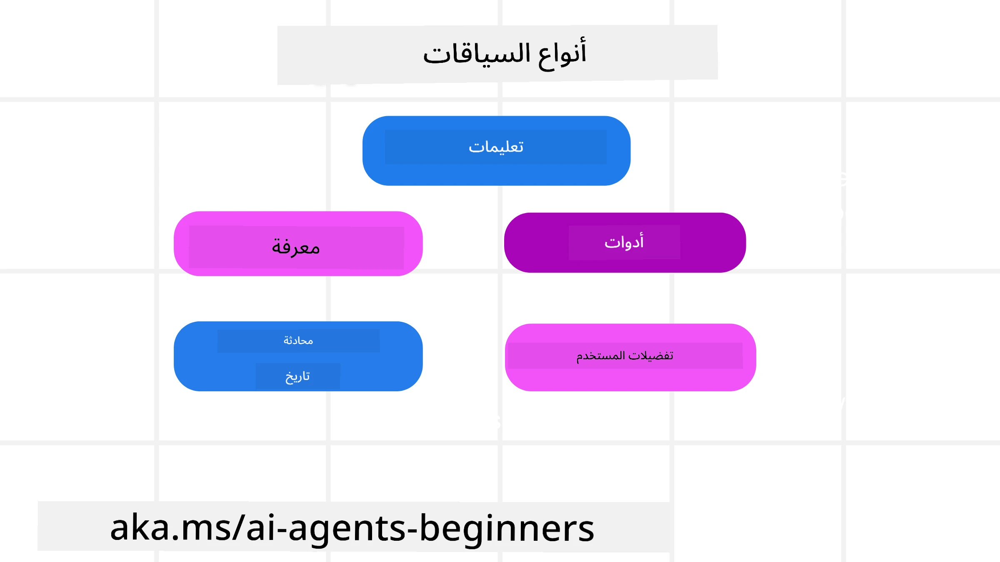
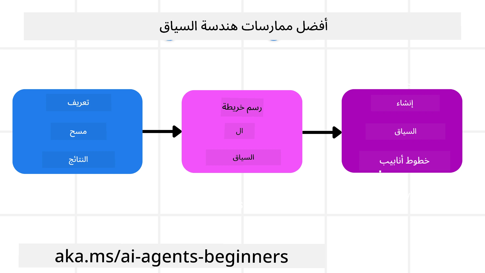

# هندسة السياق لوكلاء الذكاء الاصطناعي

> _(انقر على الصورة أعلاه لمشاهدة فيديو هذا الدرس)_

فهم تعقيد التطبيق الذي تبني له وكيل ذكاء اصطناعي مهم لصنع واحد موثوق به. نحتاج إلى بناء وكلاء ذكاء اصطناعي يديرون المعلومات بفعالية لتلبية الاحتياجات المعقدة التي تتجاوز هندسة المطالبات.

في هذا الدرس، سنتعرف على ماهية هندسة السياق ودورها في بناء وكلاء الذكاء الاصطناعي.

## المقدمة

سيتناول هذا الدرس:

• **ما هي هندسة السياق** ولماذا تختلف عن هندسة المطالبات.

• **استراتيجيات هندسة السياق الفعالة**، بما في ذلك كيفية كتابة المعلومات، واختيارها، وضغطها، وعزلها.

• **أخطاء شائعة في السياق** يمكن أن تفسد وكيل الذكاء الاصطناعي الخاص بك وكيفية إصلاحها.

## أهداف التعلم

بعد إتمام هذا الدرس، ستتمكن من فهم كيفية:

• **تعريف هندسة السياق** وتمييزها عن هندسة المطالبات.

• **تحديد المكونات الرئيسية للسياق** في تطبيقات النماذج اللغوية الضخمة (LLM).

• **تطبيق استراتيجيات لكتابة، اختيار، ضغط، وعزل السياق** لتحسين أداء الوكيل.

• **التعرف على أخطاء السياق الشائعة** مثل التسميم، التشتت، الالتباس، والتصادم، وتنفيذ تقنيات التخفيف منها.

## ما هي هندسة السياق؟

بالنسبة لوكلاء الذكاء الاصطناعي، السياق هو ما يدفع تخطيط وكيل الذكاء الاصطناعي لاتخاذ إجراءات معينة. هندسة السياق هي ممارسة التأكد من أن وكيل الذكاء الاصطناعي يمتلك المعلومات الصحيحة لإتمام الخطوة التالية من المهمة. نافذة السياق محدودة الحجم، لذا كمنشئي الوكلاء نحتاج إلى بناء أنظمة وعمليات لإدارة إضافة، إزالة، وتجميع المعلومات في نافذة السياق.

### هندسة المطالبات مقابل هندسة السياق

تركز هندسة المطالبات على مجموعة واحدة من التعليمات الثابتة لتوجيه وكلاء الذكاء الاصطناعي بفعالية عبر مجموعة من القواعد. أما هندسة السياق فهي كيفية إدارة مجموعة ديناميكية من المعلومات، بما في ذلك المطالبة الأولية، لضمان امتلاك وكيل الذكاء الاصطناعي لما يحتاجه مع مرور الوقت. الفكرة الرئيسية حول هندسة السياق هي جعل هذه العملية قابلة للتكرار وموثوقة.

### أنواع السياق

من المهم أن نتذكر أن السياق ليس شيئًا واحدًا فقط. المعلومات التي يحتاجها وكيل الذكاء الاصطناعي يمكن أن تأتي من مجموعة متنوعة من المصادر المختلفة ويعتمد علينا ضمان تمكين الوكيل من الوصول إلى هذه المصادر:

أنواع السياق التي قد يحتاج وكيل الذكاء الاصطناعي لإدارتها تشمل:

• **التعليمات:** هذه تشبه "قواعد" الوكيل – المطالبات، رسائل النظام، أمثلة قليلة (تُظهر للذكاء الاصطناعي كيفية القيام بشيء ما)، ووصف الأدوات التي يمكن أن يستخدمها. هنا يلتقي تركيز هندسة المطالبات مع هندسة السياق.

• **المعرفة:** تشمل الحقائق، المعلومات المسترجعة من قواعد البيانات، أو الذكريات طويلة المدى التي جمعها الوكيل. يشتمل ذلك على دمج نظام الاسترجاع المعزز بالتوليد (RAG) إذا كان الوكيل يحتاج إلى الوصول إلى مخازن المعرفة وقواعد البيانات المختلفة.

• **الأدوات:** هي تعريفات الوظائف الخارجية، واجهات برمجة التطبيقات (APIs) وخوادم MCP التي يمكن للوكيل استدعاؤها، مع النتائج أو الردود التي يحصل عليها من استخدامها.

• **تاريخ المحادثة:** الحوار الجاري مع المستخدم. مع مرور الوقت، تصبح هذه المحادثات أطول وأكثر تعقيدًا مما يعني أنها تشغل مساحة في نافذة السياق.

• **تفضيلات المستخدم:** المعلومات التي تعلمها الوكيل عن تفضيلات المستخدم أو كرهه مع مرور الوقت. يمكن تخزينها واستدعاؤها عند اتخاذ قرارات رئيسية لمساعدة المستخدم.

## استراتيجيات هندسة السياق الفعالة

### استراتيجيات التخطيط

تبدأ هندسة السياق الجيدة بالتخطيط الجيد. إليك نهجًا سيساعدك على البدء في التفكير بكيفية تطبيق مفهوم هندسة السياق:

1. **تحديد نتائج واضحة** - يجب تعريف نتائج المهام التي سيتم تعيينها لوكلاء الذكاء الاصطناعي بشكل واضح. أجب عن السؤال - "كيف سيبدو العالم عندما يُكمل وكيل الذكاء الاصطناعي مهمته؟" بعبارات أخرى، ما التغيير أو المعلومات أو الاستجابة التي يجب أن يحصل عليها المستخدم بعد التفاعل مع الوكيل.

2. **رسم خريطة السياق** - بعد تحديد نتائج وكيل الذكاء الاصطناعي، تحتاج إلى الإجابة عن سؤال "ما المعلومات التي يحتاجها وكيل الذكاء الاصطناعي لإكمال هذه المهمة؟" بهذه الطريقة يمكنك البدء في رسم خريطة السياق حيث يمكن العثور على هذه المعلومات.

3. **إنشاء خطوط أنابيب للسياق** - بعد أن تعرف مكان المعلومات، تحتاج إلى الإجابة عن السؤال "كيف سيحصل الوكيل على هذه المعلومات؟" يمكن القيام بذلك بطرق متعددة تشمل RAG، استخدام خوادم MCP، وأدوات أخرى.

### استراتيجيات عملية

التخطيط مهم لكن بمجرد بدء تدفق المعلومات إلى نافذة سياق وكيلنا، نحتاج إلى استراتيجيات عملية لإدارتها:

#### إدارة السياق

بينما ستُضاف بعض المعلومات تلقائيًا إلى نافذة السياق، هندسة السياق تعني اتخاذ دور أكثر نشاطًا تجاه هذه المعلومات والتي يمكن تنفيذها عبر بعض الاستراتيجيات:

 1. **دفتر ملاحظات الوكيل**
  يسمح هذا لوكيل الذكاء الاصطناعي بتدوين ملاحظات حول المعلومات ذات الصلة بالمهام الحالية وتفاعلات المستخدم خلال جلسة واحدة. يجب أن يكون هذا منفصلًا عن نافذة السياق في ملف أو كائن وقت تشغيل يمكن للوكيل استرجاعه لاحقًا خلال هذه الجلسة إذا دعت الحاجة.

 2. **الذكريات**
 دفاتر الملاحظات جيدة لإدارة المعلومات خارج نافذة السياق لجلسة واحدة. تمكن الذكريات الوكلاء من تخزين واسترجاع المعلومات ذات الصلة عبر جلسات متعددة. قد تشمل هذه الملخصات، تفضيلات المستخدم، وردود الفعل لتحسينات مستقبلية.

 3. **ضغط السياق**
 عندما تنمو نافذة السياق وتقترب من حدها، يمكن استخدام تقنيات مثل التلخيص والاقتطاع. يشمل ذلك الاحتفاظ فقط بالمعلومات الأكثر صلة أو إزالة الرسائل القديمة.
  
 4. **أنظمة متعددة الوكلاء**
 تطوير أنظمة متعددة الوكلاء هو شكل من أشكال هندسة السياق لأن لكل وكيل نافذة سياق خاصة به. كيفية مشاركة هذا السياق وتمريره إلى وكلاء مختلفين هو أمر آخر يجب التخطيط له عند بناء هذه الأنظمة.
  
 5. **بيئات الحماية (Sandbox)**
 إذا كان الوكيل يحتاج إلى تشغيل بعض الشفرات أو معالجة كميات كبيرة من المعلومات في مستند، فقد يتطلب ذلك عددًا كبيرًا من الرموز لمعالجة النتائج. بدلاً من تخزين كل هذا في نافذة السياق، يمكن للوكيل استخدام بيئة حماية قادرة على تشغيل هذه الشيفرة وقراءة النتائج والمعلومات ذات الصلة فقط.
  
 6. **كائنات حالة وقت التشغيل**
 يتم ذلك بإنشاء حاويات للمعلومات لإدارة الحالات التي يحتاج فيها الوكيل إلى الوصول إلى معلومات معينة. بالنسبة لمهمة معقدة، سيمكن هذا الوكيل من تخزين نتائج كل خطوة فرعية للمهمة خطوة بخطوة، مما يسمح للسياق بالبقاء متصلًا فقط بتلك الخطوة الفرعية المحددة.

#### فحص السياق

بعد تطبيق إحدى هذه الاستراتيجيات، يُستحسن التحقق مما استقبله نموذج الاتصال التالي فعليًا. سؤال تصحيحي مفيد هو:

> هل حمّل الوكيل الكثير من السياق، أو السياق الخطأ، أو فاته سياق كان يحتاجه؟

لا تحتاج إلى تسجيل المطالبات الخام، مخرجات الأدوات، أو محتويات الذاكرة للإجابة على هذا السؤال. في الإنتاج، يُفضل سجلات فحص سياق صغيرة تلتقط العدادات، المعرفات، التجزئات، وتسميات السياسات:

- **الاختيار:** تتبع عدد الأجزاء المرشحة، الأدوات، أو الذكريات التي تمت مراجعتها، عدد المختارة، وأي قاعدة أو درجة تسببت في تصفية البقية.
- **الضغط:** سجّل نطاق المصدر أو معرف التتبع، معرف الملخص، تقدير عدد الرموز قبل وبعد الضغط، وما إذا تم استبعاد المحتوى الخام من الاتصال التالي.
- **العزل:** لاحظ أي مهمة فرعية نفذت في وكيل، جلسة، أو حاوية منفصلة، الملخص المحدود الذي أُعيد، وما إذا كانت مخرجات أدوات كبيرة بقيت خارج سياق الوكيل الرئيسي.
- **الذاكرة و RAG:** خزّن معرفات مستندات الاسترجاع، معرفات الذاكرة، الدرجات، المعرفات المختارة، وحالة الحجب بدلًا من النص الكامل المسترجع.
- **السلامة والخصوصية:** فضّل التجزئات، المعرفات، دلاء الرموز، وتسميات السياسات على نص المطالبة الحساسة، معطيات الأدوات، نتائج الأدوات، أو محتويات ذاكرة المستخدم.

الهدف ليس الاحتفاظ بالمزيد من السياق، بل ترك دليل كافٍ يسمح للمطور بمعرفة أي استراتيجية سياقية تم تنفيذها وما إذا كانت غيّرت اتصال النموذج التالي بالطريقة المقصودة.

### مثال على هندسة السياق

لنفترض أننا نريد من وكيل ذكاء اصطناعي أن **"يحجز لي رحلة إلى باريس."**

• وكيل بسيط يستخدم هندسة المطالبات فقط قد يرد فقط: **"حسنًا، متى تود الذهاب إلى باريس؟"** فهو يعالج سؤالك المباشر فقط في الوقت الذي طرحه المستخدم.

• وكيل يستخدم استراتيجيات هندسة السياق الموضحة سيفعل أكثر من ذلك بكثير. قبل حتى الرد، قد يقوم نظامه بـ:

  ◦ **فحص تقويمك** للعثور على مواعيد متاحة (استرجاع بيانات الوقت الفعلي).

 ◦ **استدعاء تفضيلات السفر السابقة** (من الذاكرة طويلة المدى) مثل شركة الطيران المفضلة، الميزانية، أو تفضيل الرحلات المباشرة.

 ◦ **تحديد الأدوات المتاحة** لحجز الرحلات والفنادق.

- ثم، قد يكون الرد المثال:  "مرحبًا [اسمك]! أرى أنك متاح في الأسبوع الأول من أكتوبر. هل أبحث عن رحلات مباشرة إلى باريس على [شركة الطيران المفضلة] ضمن ميزانيتك العادية [الميزانية]؟". هذا الرد الغني والواعٍ بالسياق يوضح قوة هندسة السياق.

## أخطاء شائعة في السياق

### تسميم السياق

**ما هو:** عندما تدخل هلوسة (معلومات خاطئة مولدة بواسطة النموذج اللغوي الكبير) أو خطأ في السياق وتتم الإشارة إليها باستمرار، مما يدفع الوكيل لمتابعة أهداف مستحيلة أو تطوير استراتيجيات غير منطقية.

**ما ينبغي عمله:** تنفيذ **التحقق من صحة السياق** و **العزل**. التحقق من المعلومات قبل إضافتها إلى الذاكرة طويلة المدى. إذا تم اكتشاف تسميم محتمل، ابدأ سياقات جديدة لمنع انتشار المعلومات السيئة.

**مثال حجز السفر:** وكيلك يتخيل وجود **رحلة مباشرة من مطار محلي صغير إلى مدينة دولية بعيدة** لا تقدم فعليًا رحلات دولية. يتم حفظ هذه التفاصيل غير الواقعية في السياق. لاحقًا، عندما تطلب من الوكيل الحجز، يستمر في محاولة العثور على تذاكر لهذا المسار المستحيل، مما يؤدي إلى أخطاء متكررة.

**الحل:** تنفيذ خطوة **للتحقق من وجود الرحلة والمسارات باستخدام API في الوقت الحقيقي** _قبل_ إضافة تفاصيل الرحلة إلى سياق عمل الوكيل. إذا فشل التحقق، تُعزل المعلومات الخاطئة ولا تُستخدم بعد ذلك.

### تشتت السياق

**ما هو:** عندما يصبح السياق كبيرًا جدًا بحيث يتركز النموذج بشكل زائد على التاريخ المتراكم بدلاً من استخدام ما تعلمه أثناء التدريب، مما يؤدي إلى أفعال متكررة أو غير مفيدة. قد تبدأ النماذج بارتكاب أخطاء حتى قبل امتلاء نافذة السياق.

**ما ينبغي عمله:** استخدام **تلخيص السياق**. ضغط المعلومات المتراكمة بشكل دوري إلى ملخصات أقصر، مع الحفاظ على التفاصيل المهمة وإزالة التاريخ المكرر. هذا يساعد على "إعادة ضبط" التركيز.

**مثال حجز السفر:** لقد ناقشت وجهات سفر كثيرة حلمت بها لفترة طويلة، بما في ذلك سرد تفصيلي لرحلتك على الظهر قبل عامين. عندما تطلب أخيرًا **"العثور على رحلة رخيصة للشهر القادم"،** ينغمس الوكيل في التفاصيل القديمة غير ذات الصلة ويستمر في السؤال عن معدات التنزه الخاصة بك أو خطط رحلاتك السابقة، متجاهلًا طلبك الحالي.

**الحل:** بعد عدد معين من التبادلات أو عندما يكبر السياق كثيرًا، يجب على الوكيل **تلخيص أهم وأحدث أجزاء المحادثة** – مع التركيز على تواريخ وجهة سفرك الحالية – واستخدام هذا الملخص المكثف للاتصال التالي بالنموذج، متجاهلًا المحادثة التاريخية الأقل صلة.

### ارتباك السياق

**ما هو:** عندما يسبب السياق غير الضروري، وغالبًا في شكل عدد كبير جدًا من الأدوات المتاحة، أن يولّد النموذج ردودًا سيئة أو يستدعي أدوات غير مناسبة. النماذج الأصغر عرضة بشكل خاص لهذا.

**ما ينبغي عمله:** تنفيذ **إدارة تحميل الأدوات** باستخدام تقنيات RAG. خزّن أوصاف الأدوات في قاعدة بيانات متجهة واختر _فقط_ الأدوات الأكثر صلة لكل مهمة محددة. تظهر الأبحاث أن تحديد الأدوات إلى أقل من 30 أداة أفضل.

**مثال حجز السفر:** لدى وكيلك وصول إلى عشرات الأدوات: `book_flight`، `book_hotel`، `rent_car`، `find_tours`، `currency_converter`، `weather_forecast`، `restaurant_reservations`، وغيرها. تسأل، **"ما أفضل طريقة للتنقل في باريس؟"** بسبب العدد الكبير من الأدوات، يختلط الأمر على الوكيل ويحاول استدعاء `book_flight` _داخل_ باريس، أو `rent_car` رغم أنك تفضل النقل العام، لأن أوصاف الأدوات قد تتداخل أو ببساطة لا يستطيع التمييز بينها.

**الحل:** استخدم **RAG على أوصاف الأدوات**. عندما تسأل عن التنقل في باريس، يسترجع النظام _فقط_ الأدوات الأكثر صلة مثل `rent_car` أو `public_transport_info` بناءً على سؤالك، مقدمًا "حزمة أدوات" مركزة للنموذج اللغوي.

### تصادم السياق

**ما هو:** عندما توجد معلومات متضاربة ضمن السياق، مما يؤدي إلى استدلال غير متناسق أو ردود نهائية سيئة. يحدث هذا غالبًا عندما تصل المعلومات على مراحل، وتبقى الافتراضات المبكرة والخاطئة في السياق.

**ما ينبغي عمله:** استخدم **تقليم السياق** و**التفريغ**. التقليم يعني إزالة المعلومات القديمة أو المتضاربة مع وصول تفاصيل جديدة. التفريغ يوفر للنموذج مساحة عمل "دفتر ملاحظات" منفصلة لمعالجة المعلومات دون إرباك السياق الرئيسي.
**مثال على حجز السفر:** تبلغ وكيلك في البداية، **"أريد الطيران في الدرجة الاقتصادية."** في وقت لاحق من المحادثة، تغير رأيك وتقول، **"في الواقع، لهذه الرحلة، دعنا نختار الدرجة التجارية."** إذا ظلت كلا التعليمات موجودة في السياق، فقد يتلقى الوكيل نتائج بحث متضاربة أو يختلط عليه الأمر في تحديد أي تفضيل يجب أن يُعطى الأولوية.

**الحل:** تنفيذ **تقليم السياق**. عندما تتعارض تعليمات جديدة مع تعليمات قديمة، تتم إزالة التعليمات الأقدم أو استبدالها صراحة في السياق. بدلاً من ذلك، يمكن للوكيل استخدام **لوحة ملاحظات** للمصالحة بين التفضيلات المتضاربة قبل اتخاذ القرار، مما يضمن أن التعليمات النهائية والمتسقة فقط هي التي توجه أفعاله.

## هل لديك المزيد من الأسئلة حول هندسة السياق؟

انضم إلى [Microsoft Foundry Discord](https://aka.ms/ai-agents/discord) للتعرف على متعلمين آخرين، وحضور ساعات العمل، والحصول على إجابات على أسئلة وكلاء الذكاء الاصطناعي الخاصة بك.

---

<!-- CO-OP TRANSLATOR DISCLAIMER START -->
**تنويه**:
تمت ترجمة هذا المستند باستخدام خدمة الترجمة بالذكاء الاصطناعي [Co-op Translator](https://github.com/Azure/co-op-translator). بينما نسعى للدقة، يرجى العلم أن الترجمات الآلية قد تحتوي على أخطاء أو عدم دقة. يجب اعتبار المستند الأصلي بلغته الأصلية المصدر الرسمي والمعتمد. للمعلومات الهامة، يُنصح بالاستعانة بترجمة بشرية محترفة. نحن غير مسؤولين عن أي سوء فهم أو تفسير ناتج عن استخدام هذه الترجمة.
<!-- CO-OP TRANSLATOR DISCLAIMER END -->