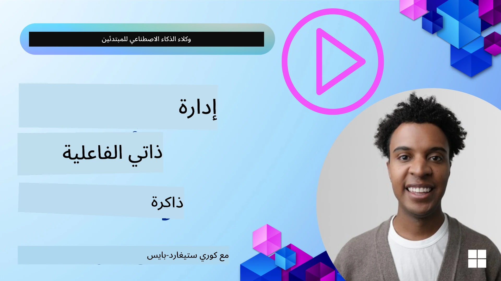

# الذاكرة لوكلاء الذكاء الاصطناعي 

عند مناقشة الفوائد الفريدة لإنشاء وكلاء ذكاء اصطناعي، يُناقَشان شيئان بشكل رئيسي: القدرة على استدعاء الأدوات لإتمام المهام والقدرة على التحسن بمرور الوقت. تشكل الذاكرة أساس إنشاء وكيل قادر على التحسن الذاتي يمكنه خلق تجارب أفضل لمستخدمينا.

في هذا الدرس، سننظر في ما هي الذاكرة لوكلاء الذكاء الاصطناعي وكيف يمكننا إدارتها واستخدامها لصالح تطبيقاتنا.

## المقدمة

يغطي هذا الدرس:

• **فهم ذاكرة وكلاء الذكاء الاصطناعي**: ما هي الذاكرة ولماذا هي أساسية للوكلاء.

• **تنفيذ وتخزين الذاكرة**: طرق عملية لإضافة قدرات الذاكرة إلى وكلائك، مع التركيز على الذاكرة قصيرة المدى وطويلة المدى.

• **جعل وكلاء الذكاء الاصطناعي يتحسنون ذاتياً**: كيف تُمكِّن الذاكرة الوكلاء من التعلم من التفاعلات السابقة والتحسن مع الزمن.

## التطبيقات المتاحة

يتضمن هذا الدرس دليلين تفصيليين في دفاتر ملاحظات:

• **[13-agent-memory.ipynb](./13-agent-memory.ipynb)**: ينفذ الذاكرة باستخدام Mem0 وAzure AI Search مع Microsoft Agent Framework

• **[13-agent-memory-cognee.ipynb](./13-agent-memory-cognee.ipynb)**: ينفذ الذاكرة المهيكلة باستخدام Cognee، ويبني تلقائياً مخطط معرفة مدعوماً بالـ embeddings، ويُظهر المخطط، ويقدّم استرجاعاً ذكياً

## أهداف التعلم

بعد إكمال هذا الدرس، ستعرف كيفية:

• **التفريق بين أنواع ذاكرة وكلاء الذكاء الاصطناعي المختلفة**، بما في ذلك الذاكرة العاملة، قصيرة المدى، وطويلة المدى، وكذلك الأشكال المتخصصة مثل ذاكرة الشخصية والذاكرة العرضية.

• **تنفيذ وإدارة الذاكرة قصيرة المدى وطويلة المدى للوكلاء** باستخدام Microsoft Agent Framework، والاستفادة من أدوات مثل Mem0 وCognee وWhiteboard memory والتكامل مع Azure AI Search.

• **فهم المبادئ وراء وكلاء الذكاء الاصطناعي القادرين على التحسن الذاتي** وكيف تساهم أنظمة إدارة الذاكرة القوية في التعلم والتكيّف المستمر.

## فهم ذاكرة وكلاء الذكاء الاصطناعي

في جوهرها، **تشير الذاكرة لدى وكلاء الذكاء الاصطناعي إلى الآليات التي تتيح لهم الاحتفاظ بالمعلومات واستدعائها**. يمكن أن تكون هذه المعلومات تفاصيل محددة عن محادثة، تفضيلات المستخدم، إجراءات سابقة، أو حتى أنماط مكتسبة.

بدون ذاكرة، تكون تطبيقات الذكاء الاصطناعي غالباً بلا حالة، مما يعني أن كل تفاعل يبدأ من الصفر. يؤدي ذلك إلى تجربة مستخدم متكررة ومحبطة حيث "ينسى" الوكيل السياق أو التفضيلات السابقة.

### لماذا الذاكرة مهمة؟

ترتبط ذكاء الوكيل ارتباطاً عميقاً بقدرته على استدعاء واستخدام المعلومات الماضية. تُمكّن الذاكرة الوكلاء من أن يكونوا:

• **انعكاسيين**: يتعلمون من الأفعال والنتائج الماضية.

• **تفاعليين**: يحافظون على السياق أثناء محادثة جارية.

• **استباقيين وتفاعليين**: يتوقعون الاحتياجات أو يستجيبون بشكل مناسب بناءً على البيانات التاريخية.

• **مستقلين**: يعملون باستقلالية أكبر من خلال الاستفادة من المعرفة المخزنة.

الهدف من تنفيذ الذاكرة هو جعل الوكلاء أكثر **موثوقية وقدرة**.

### أنواع الذاكرة

#### الذاكرة العاملة

فكّر في هذا كقطعة ورق مسودة يستخدمها الوكيل أثناء مهمة واحدة جارية أو عملية تفكير مستمرة. تحتفظ بالمعلومات الفورية اللازمة لحساب الخطوة التالية.

بالنسبة لوكلاء الذكاء الاصطناعي، تلتقط الذاكرة العاملة في كثير من الأحيان أهم المعلومات من المحادثة، حتى لو كان سجل الدردشة الكامل طويلاً أو مقتطعاً. تركز على استخراج العناصر الرئيسية مثل المتطلبات، الاقتراحات، القرارات، والإجراءات.

**مثال على الذاكرة العاملة**

في وكيل حجز سفر، قد تلتقط الذاكرة العاملة طلب المستخدم الحالي، مثل "أريد حجز رحلة إلى باريس". يُحتفظ بهذا المطلب المحدد في سياق الوكيل الفوري لتوجيه التفاعل الحالي.

#### الذاكرة قصيرة المدى

يحتفظ هذا النوع من الذاكرة بالمعلومات لمدة محادثة واحدة أو جلسة واحدة. إنها سياق الدردشة الحالي، مما يسمح للوكيل بالعودة إلى الأدوار السابقة في الحوار.

**مثال على الذاكرة قصيرة المدى**

إذا سأل المستخدم، "كم تكلفة رحلة إلى باريس؟" ثم تابع بـ "ماذا عن الإقامة هناك؟"، تضمن الذاكرة قصيرة المدى أن يعرف الوكيل أن "هناك" تشير إلى "باريس" في نفس المحادثة.

#### الذاكرة طويلة المدى

هذه معلومات تستمر عبر محادثات أو جلسات متعددة. تسمح للوكيل بتذكر تفضيلات المستخدم، التفاعلات التاريخية، أو المعرفة العامة على مدى فترات ممتدة. هذا مهم من أجل التخصيص.

**مثال على الذاكرة طويلة المدى**

قد تخزن ذاكرة طويلة المدى أن "بن يحب التزلج والأنشطة الخارجية، ويحب القهوة مع منظر جبلي، ويرغب في تجنب مسارات التزلج المتقدمة بسبب إصابة سابقة". تؤثر هذه المعلومات، المتعلمة من تفاعلات سابقة، على التوصيات في جلسات تخطيط السفر المستقبلية، مما يجعلها مخصصة للغاية.

#### ذاكرة الشخصية

يساعد هذا النوع المتخصص من الذاكرة الوكيل على تطوير "شخصية" أو "هوية" متسقة. تتيح للوكيل تذكر تفاصيل عن نفسه أو دوره المقصود، مما يجعل التفاعلات أكثر سلاسة وتركيزًا.

**مثال على ذاكرة الشخصية**
إذا صُمم وكيل السفر ليكون "مخطط تزلج خبير"، فقد تعزز ذاكرة الشخصية هذا الدور، مما يؤثر على ردوده لتتماشى مع نبرة ومعرفة الخبير.

#### الذاكرة العرضية/تسلسلية الإجراءات

تخزن هذه الذاكرة تسلسل الخطوات التي يتخذها الوكيل أثناء مهمة معقدة، بما في ذلك النجاحات والإخفاقات. إنها تشبه تذكر "حلقات" أو تجارب سابقة للتعلم منها.

**مثال على الذاكرة العرضية**

إذا حاول الوكيل حجز رحلة محددة وفشل ذلك بسبب عدم التوفر، يمكن لذاكرة الحلقات تسجيل هذا الفشل، مما يسمح للوكيل بتجربة رحلات بديلة أو إعلام المستخدم بالمشكلة بطريقة أكثر وعيًا في محاولة لاحقة.

#### ذاكرة الكيانات

يتضمن هذا استخراج وتذكر كيانات محددة (مثل الأشخاص أو الأماكن أو الأشياء) والأحداث من المحادثات. يتيح للوكيل بناء فهم منظم للعناصر الرئيسية التي نوقشت.

**مثال على ذاكرة الكيانات**

من محادثة حول رحلة سابقة، قد يستخرج الوكيل "باريس"، "برج إيفل"، و"عشاء في مطعم Le Chat Noir" ككيانات. في تفاعل مستقبلي، يمكن للوكيل استدعاء "Le Chat Noir" وعرض إجراء حجز جديد هناك.

#### Structured RAG (استرجاع معزز للتوليد المهيكل)

بينما RAG هي تقنية أوسع، يبرز "Structured RAG" كتقنية ذاكرة قوية. يستخرج معلومات كثيفة ومهيكلة من مصادر متنوعة (محادثات، رسائل بريد إلكتروني، صور) ويستخدمها لتعزيز الدقة والاسترجاع والسرعة في الردود. على عكس RAG الكلاسيكي الذي يعتمد فقط على التشابه الدلالي، يعمل Structured RAG مع البنية الجوهرية للمعلومات.

**مثال على Structured RAG**

بدلاً من مطابقة الكلمات الرئيسية فقط، يمكن لـ Structured RAG تحليل تفاصيل الرحلة (الوجهة، التاريخ، الوقت، شركة الطيران) من بريد إلكتروني وتخزينها بصورة مهيكلة. هذا يسمح باستعلامات دقيقة مثل "ما الرحلة التي حجزتها إلى باريس يوم الثلاثاء؟"

## تنفيذ وتخزين الذاكرة

يتضمن تنفيذ الذاكرة لوكلاء الذكاء الاصطناعي عملية منهجية لإدارة الذاكرة، والتي تشمل توليدها، تخزينها، استرجاعها، دمجها، تحديثها، وحتى "نسيانها" (أو حذفها). يُعد الاسترجاع جانباً حاسماً بشكل خاص.

### أدوات ذاكرة متخصصة

#### Mem0

إحدى طرق تخزين وإدارة ذاكرة الوكيل هي استخدام أدوات متخصصة مثل Mem0. يعمل Mem0 كطبقة ذاكرة مستمرة، مما يتيح للوكلاء استدعاء التفاعلات ذات الصلة، تخزين تفضيلات المستخدم والسياق الواقعي، والتعلم من النجاحات والإخفاقات مع مرور الوقت. الفكرة هنا أن الوكلاء بلا حالة يتحولون إلى وكلاء ذو حالة.

يعمل عبر **خط أنابيب ذاكرة ذو مرحلتين: الاستخراج والتحديث**. أولاً، تُرسَل الرسائل المضافة إلى سلسلة الوكيل إلى خدمة Mem0، التي تستخدم نموذج لغوي كبير لتلخيص سجل المحادثة واستخراج ذكريات جديدة. بعد ذلك، تحدد مرحلة التحديث المدفوعة بالنموذج اللغوي ما إذا كان يجب إضافة هذه الذكريات أو تعديلها أو حذفها، وتخزنها في مخزن بيانات هجين يمكن أن يشمل قواعد بيانات متجهية، وقواعد بيانات رسومية، وقواعد بيانات مفتاحية-قيمة. يدعم هذا النظام أيضاً أنواع ذاكرة متنوعة ويمكنه دمج ذاكرة الرسم البياني لإدارة العلاقات بين الكيانات.

#### Cognee

نهج قوي آخر هو استخدام **Cognee**، ذاكرة دلالية مفتوحة المصدر لوكلاء الذكاء الاصطناعي تحول البيانات المهيكلة وغير المهيكلة إلى مخططات معرفة قابلة للاستعلام مدعومة بالـ embeddings. يوفر Cognee **بنية مخزن مزدوجة** تجمع بين بحث التشابه المتجهي والعلاقات الرسومية، مما يمكّن الوكلاء من فهم ليس فقط ما المعلومات المتشابهة، بل كيف ترتبط المفاهيم بعضها ببعض.

يتفوق في **الاسترجاع الهجين** الذي يدمج تشابه المتجهات، بنية الرسم البياني، واستدلال النموذج اللغوي - من البحث في القطع الخام إلى الإجابة المستندة إلى الرسم البياني. يحافظ النظام على **ذاكرة حية** تتطور وتنمو بينما تظل قابلة للاستعلام كمخطط موحد متصل، داعماً كلًا من سياق الجلسة قصيرة المدى والذاكرة الدائمة طويلة المدى.

يوضح دليل Cognee في دفتر الملاحظات ([13-agent-memory-cognee.ipynb](./13-agent-memory-cognee.ipynb)) بناء طبقة ذاكرة موحدة هذه، مع أمثلة عملية على استيعاب مصادر بيانات متنوعة، تصور مخطط المعرفة، والاستعلام باستخدام استراتيجيات بحث مختلفة مُفصّلة لاحتياجات وكيل محددة.

### تخزين الذاكرة باستخدام RAG

بعيداً عن أدوات الذاكرة المتخصصة مثل Mem0، يمكنك الاستفادة من خدمات بحث قوية مثل **Azure AI Search كخلفية لتخزين واسترجاع الذكريات**، خاصة لـ Structured RAG.

يتيح لك هذا تأصيل ردود الوكيل ببياناتك الخاصة، مما يضمن إجابات أكثر صلة ودقة. يمكن استخدام Azure AI Search لتخزين ذكريات سفر محددة للمستخدم، أو كتالوجات المنتجات، أو أي معرفة نطاقية أخرى.

تدعم Azure AI Search قدرات مثل **Structured RAG**، التي تتفوق في استخراج واسترجاع معلومات كثيفة ومهيكلة من مجموعات بيانات كبيرة مثل سجلات المحادثات، الرسائل الإلكترونية، أو حتى الصور. هذا يوفر "دقة واستدعاء فائقين" مقارنة بنهج قطع النص التقليدية وembeddings.

## جعل وكلاء الذكاء الاصطناعي يتحسنون ذاتياً

نمط شائع لوكلاء يتحسنون ذاتياً يتضمن إدخال **"وكيل المعرفة"**. يراقب هذا الوكيل المنفصل المحادثة الرئيسية بين المستخدم والوكيل الأساسي. دوره هو:

1. **تحديد المعلومات القيمة**: تحديد ما إذا كان أي جزء من المحادثة يستحق الحفظ كمعرفة عامة أو كتفضيل مستخدم محدد.

2. **الاستخراج والتلخيص**: تلخيص التعلم أو التفضيل الأساسي من المحادثة.

3. **التخزين في قاعدة معرفة**: الحفاظ على هذه المعلومات المستخرجة، غالباً في قاعدة بيانات متجهية، بحيث يمكن استرجاعها لاحقاً.

4. **تعزيز الاستعلامات المستقبلية**: عندما يبدأ المستخدم استعلاماً جديداً، يسترجع وكيل المعرفة المعلومات المخزنة ذات الصلة ويلحقها بمطالبة المستخدم، موفراً سياقاً حاسماً للوكيل الأساسي (مماثل لـ RAG).

### تحسينات للذاكرة

• **إدارة الكمون**: لتجنب إبطاء تفاعلات المستخدم، يمكن استخدام نموذج أرخص وأسرع في البداية للتحقق بسرعة مما إذا كانت المعلومة تستحق التخزين أو الاسترجاع، مع استدعاء عملية الاستخراج/الاسترجاع الأكثر تعقيداً عند الضرورة فقط.

• **صيانة قاعدة المعرفة**: بالنسبة لقاعدة معرفة متنامية، يمكن نقل المعلومات الأقل استخداماً إلى "التخزين البارد" لإدارة التكاليف.

## هل لديك المزيد من الأسئلة حول ذاكرة الوكلاء؟

انضم إلى [Microsoft Foundry Discord](https://aka.ms/ai-agents/discord) للالتقاء بمتعلمين آخرين، حضور ساعات المكتب، والحصول على إجابات لأسئلتك حول وكلاء الذكاء الاصطناعي.

---

<!-- CO-OP TRANSLATOR DISCLAIMER START -->
إخلاء المسؤولية:
تمت ترجمة هذا المستند باستخدام خدمة الترجمة الآلية Co-op Translator (https://github.com/Azure/co-op-translator). بينما نسعى إلى الدقة، يرجى ملاحظة أن الترجمات الآلية قد تحتوي على أخطاء أو معلومات غير دقيقة. يجب اعتبار المستند الأصلي بلغته الأصلية المصدر المعتمد. بالنسبة للمعلومات الحرجة، يُنصح بالاعتماد على ترجمة بشرية محترفة. لا نتحمل أي مسؤولية عن أي سوء فهم أو تفسيرات خاطئة ناتجة عن استخدام هذه الترجمة.
<!-- CO-OP TRANSLATOR DISCLAIMER END -->