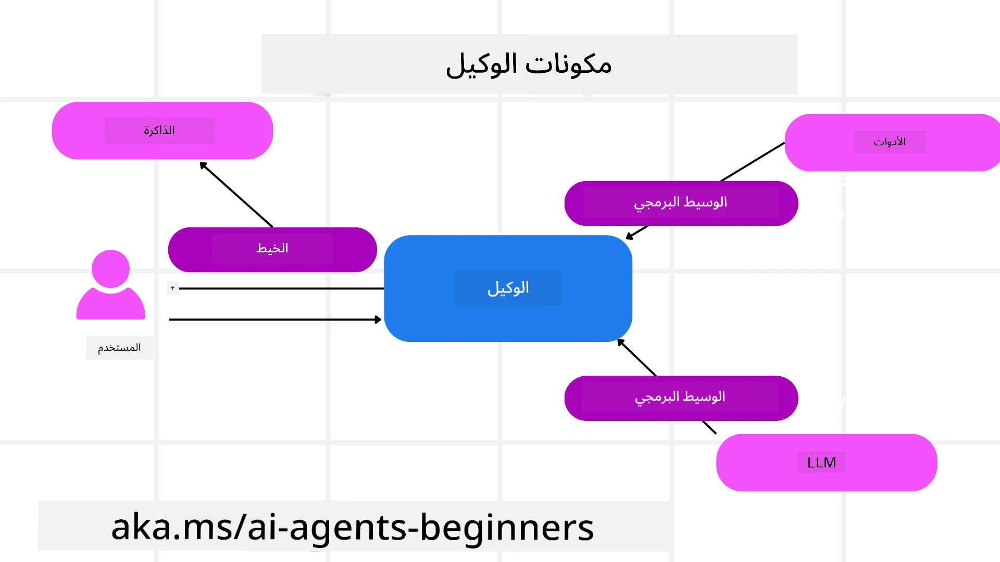

# استكشاف إطار عمل Microsoft Agent


### مقدمة

ستغطي هذه الدرس:

- فهم إطار عمل Microsoft Agent: الميزات الرئيسية والقيمة  
- استكشاف المفاهيم الأساسية لإطار عمل Microsoft Agent
- أنماط MAF المتقدمة: سير العمل، البرامج الوسيطة والذاكرة

## أهداف التعلم

بعد إكمال هذا الدرس، ستعرف كيفية:

- بناء وكلاء ذكاء اصطناعي جاهزين للإنتاج باستخدام إطار عمل Microsoft Agent
- تطبيق الميزات الأساسية لإطار عمل Microsoft Agent على حالات الاستخدام الخاصة بالوكيل الخاص بك
- استخدام أنماط متقدمة تشمل سير العمل، البرامج الوسيطة، وقابلية المراقبة

## عينات الكود 

يمكن العثور على عينات الكود الخاصة بـ [Microsoft Agent Framework (MAF)](https://aka.ms/ai-agents-beginners/agent-framewrok) في هذا المستودع تحت ملفات `xx-python-agent-framework` و `xx-dotnet-agent-framework`.

## فهم إطار عمل Microsoft Agent


[Microsoft Agent Framework (MAF)](https://aka.ms/ai-agents-beginners/agent-framewrok) هو الإطار الموحد لشركة مايكروسوفت لبناء وكلاء الذكاء الاصطناعي. يقدم المرونة لمعالجة مجموعة واسعة من حالات الاستخدام الوكلائي التي تُرى في بيئات الإنتاج والبحث بما في ذلك:

- **تنسيق الوكيل المتسلسل** في السيناريوهات التي تتطلب سير عمل خطوة بخطوة.
- **التنسيق المتزامن** في السيناريوهات التي تحتاج إلى إكمال المهام في نفس الوقت.
- **تنسيق الدردشة الجماعية** في السيناريوهات التي يمكن فيها للوكلاء التعاون معا في مهمة واحدة.
- **تنسيق التسليم المتتابع** في السيناريوهات التي يقوم فيها الوكلاء بتسليم المهمة لبعضهم البعض مع إتمام المهام الفرعية.
- **التنسيق المغناطيسي** في السيناريوهات التي ينشئ فيها وكيل المدير قائمة مهام ويعدلها ويتولى تنسيق الوكلاء الفرعيين لإتمام المهمة.

لتوفير وكلاء ذكاء اصطناعي في الإنتاج، يحتوي MAF أيضًا على ميزات لـ:

- **المراقبة** من خلال استخدام OpenTelemetry حيث يتم تتبع كل إجراء يقوم به وكيل الذكاء الاصطناعي بما في ذلك استدعاء الأدوات، خطوات التنسيق، تدفقات المنطق، ومراقبة الأداء عبر لوحات معلومات Microsoft Foundry.
- **الأمان** من خلال استضافة الوكلاء محليًا على Microsoft Foundry والذي يشمل ضوابط أمان مثل الوصول بناءً على الدور، معالجة البيانات الخاصة، والسلامة المدمجة للمحتوى.
- **التحمل** حيث يمكن لعمليات الوكيل وسير العمل التوقف مؤقتًا، الاستئناف، والتعافي من الأخطاء مما يتيح عمليات طويلة الأمد.
- **التحكم** بدعم سير العمل الذي يشمل التفاعل البشري حيث يتم تعليم المهام التي تتطلب موافقة بشرية.

يركز إطار عمل Microsoft Agent أيضًا على قابلية التشغيل البيني من خلال:

- **كونه محايد السحابة** - يمكن تشغيل الوكلاء في الحاويات، محليًا أو عبر عدة سحب مختلفة.
- **كونه محايد المزود** - يمكن إنشاء الوكلاء من خلال SDK المفضل لديك بما في ذلك Azure OpenAI و OpenAI
- **دمج المعايير المفتوحة** - يمكن للوكلاء استخدام بروتوكولات مثل Agent-to-Agent(A2A) و Model Context Protocol (MCP) لاكتشاف واستخدام وكلاء وأدوات أخرى.
- **الإضافات والموصلات** - يمكن إنشاء اتصالات بخدمات البيانات والذاكرة مثل Microsoft Fabric و SharePoint و Pinecone و Qdrant.

دعونا نلقي نظرة على كيفية تطبيق هذه الميزات على بعض المفاهيم الأساسية لإطار عمل Microsoft Agent.

## المفاهيم الأساسية لإطار عمل Microsoft Agent

### الوكلاء



**إنشاء الوكلاء**

يتم إنشاء الوكيل عن طريق تعريف خدمة الاستدلال (مزود LLM)، مجموعة من التعليمات التي يتبعها وكيل الذكاء الاصطناعي، واسم معين `name`:

```python
agent = AzureOpenAIChatClient(credential=AzureCliCredential()).create_agent( instructions="You are good at recommending trips to customers based on their preferences.", name="TripRecommender" )
```
  
في الأعلى يتم استخدام `Azure OpenAI`، لكن يمكن إنشاء الوكلاء باستخدام مجموعة متنوعة من الخدمات بما في ذلك `Microsoft Foundry Agent Service`:

```python
AzureAIAgentClient(async_credential=credential).create_agent( name="HelperAgent", instructions="You are a helpful assistant." ) as agent
```
  
OpenAI `Responses`، `ChatCompletion` APIs

```python
agent = OpenAIResponsesClient().create_agent( name="WeatherBot", instructions="You are a helpful weather assistant.", )
```
  
```python
agent = OpenAIChatClient().create_agent( name="HelpfulAssistant", instructions="You are a helpful assistant.", )
```
  
أو وكلاء بعيدين باستخدام بروتوكول A2A:

```python
agent = A2AAgent( name=agent_card.name, description=agent_card.description, agent_card=agent_card, url="https://your-a2a-agent-host" )
```
  
**تشغيل الوكلاء**

يتم تشغيل الوكلاء باستخدام الطرق `.run` أو `.run_stream` للردود غير المتدفقة أو المتدفقة.

```python
result = await agent.run("What are good places to visit in Amsterdam?")
print(result.text)
```
  
```python
async for update in agent.run_stream("What are the good places to visit in Amsterdam?"):
    if update.text:
        print(update.text, end="", flush=True)

```
  
يمكن أيضًا تخصيص تشغيل كل وكيل عبر خيارات مثل `max_tokens` المستخدمة بواسطة الوكيل، `tools` التي يستطيع الوكيل استدعائها، وحتى النموذج `model` المستخدم للوكيل.

هذا مفيد في الحالات التي تتطلب نماذج أو أدوات محددة لإكمال مهمة المستخدم.

**الأدوات**

يمكن تعريف الأدوات عند تعريف الوكيل:

```python
def get_attractions( location: Annotated[str, Field(description="The location to get the top tourist attractions for")], ) -> str: """Get the top tourist attractions for a given location.""" return f"The top attractions for {location} are." 


# عند إنشاء ChatAgent مباشرةً

agent = ChatAgent( chat_client=OpenAIChatClient(), instructions="You are a helpful assistant", tools=[get_attractions]

```
  
وأيضًا عند تشغيل الوكيل:

```python

result1 = await agent.run( "What's the best place to visit in Seattle?", tools=[get_attractions] # الأداة المقدمة لهذا التشغيل فقط )
```
  
**خيوط الوكيل**

تُستخدم خيوط الوكيل للتعامل مع المحادثات متعددة الأدوار. يمكن إنشاء الخيوط عن طريق:

- استخدام `get_new_thread()` والذي يُمكن حفظ الخيط مع مرور الوقت
- إنشاء خيط تلقائيًا عند تشغيل وكيل ويظل الخيط موجودًا فقط أثناء فترة التشغيل الحالية.

لإنشاء خيط، يبدو الكود كما يلي:

```python
# إنشاء خيط جديد.
thread = agent.get_new_thread() # تشغيل الوكيل مع الخيط.
response = await agent.run("Hello, I am here to help you book travel. Where would you like to go?", thread=thread)

```
  
يمكنك بعد ذلك تسلسل الخيط ليُخزن للاستخدام لاحقًا:

```python
# إنشاء مؤشر ترابط جديد.
thread = agent.get_new_thread() 

# تشغيل الوكيل مع مؤشر الترابط.

response = await agent.run("Hello, how are you?", thread=thread) 

# تسلسل مؤشر الترابط للتخزين.

serialized_thread = await thread.serialize() 

# إلغاء تسلسل حالة مؤشر الترابط بعد التحميل من التخزين.

resumed_thread = await agent.deserialize_thread(serialized_thread)
```
  
**البرامج الوسيطة للوكيل**

يتفاعل الوكلاء مع الأدوات و LLMs لإكمال مهام المستخدمين. في بعض السيناريوهات، نرغب في تنفيذ أو تتبع الإجراءات بين هذه التفاعلات. تتيح لنا البرامج الوسيطة للوكيل تنفيذ ذلك من خلال:

*البرامج الوظيفية الوسيطة*

تتيح هذه البرامج تنفيذ إجراء بين الوكيل والأداة/الدالة التي سيتم استدعاؤها. مثال على ذلك هو الرغبة في تسجيل الدخول على استدعاء الدالة.

في الكود أدناه، يقوم `next` بتحديد ما إذا كان يجب استدعاء البرنامج الوسيط التالي أو الدالة الفعلية.

```python
async def logging_function_middleware(
    context: FunctionInvocationContext,
    next: Callable[[FunctionInvocationContext], Awaitable[None]],
) -> None:
    """Function middleware that logs function execution."""
    # معالجة مسبقة: تسجيل قبل تنفيذ الوظيفة
    print(f"[Function] Calling {context.function.name}")

    # الاستمرار إلى الوسيط التالي أو تنفيذ الوظيفة
    await next(context)

    # معالجة لاحقة: تسجيل بعد تنفيذ الوظيفة
    print(f"[Function] {context.function.name} completed")
```
  
*البرامج الوسيطة للدردشة*

تتيح هذه البرامج تنفيذ أو تسجيل إجراء بين الوكيل والطلبات بين الـ LLM.

تحتوي هذه على معلومات مهمة مثل `messages` التي يتم إرسالها إلى خدمة الذكاء الاصطناعي.

```python
async def logging_chat_middleware(
    context: ChatContext,
    next: Callable[[ChatContext], Awaitable[None]],
) -> None:
    """Chat middleware that logs AI interactions."""
    # المعالجة المسبقة: تسجيل قبل استدعاء الذكاء الاصطناعي
    print(f"[Chat] Sending {len(context.messages)} messages to AI")

    # استمر إلى الوسيط التالي أو خدمة الذكاء الاصطناعي
    await next(context)

    # المعالجة اللاحقة: تسجيل بعد استجابة الذكاء الاصطناعي
    print("[Chat] AI response received")

```
  
**ذاكرة الوكيل**

كما تم تغطيته في درس `Agentic Memory`، الذاكرة عنصر مهم لتمكين الوكيل من العمل على سياقات مختلفة. يقدم MAF عدة أنواع مختلفة من الذاكرات:

*التخزين داخل الذاكرة*

هذه هي الذاكرة المخزنة في الخيوط طوال وقت تشغيل التطبيق.

```python
# إنشاء موضوع جديد.
thread = agent.get_new_thread() # تشغيل الوكيل مع الموضوع.
response = await agent.run("Hello, I am here to help you book travel. Where would you like to go?", thread=thread)
```
  
*الرسائل المستمرة*

تُستخدم هذه الذاكرة عند تخزين سجل المحادثة عبر جلسات مختلفة. يتم تعريفها باستخدام `chat_message_store_factory`:

```python
from agent_framework import ChatMessageStore

# إنشاء متجر رسائل مخصص
def create_message_store():
    return ChatMessageStore()

agent = ChatAgent(
    chat_client=OpenAIChatClient(),
    instructions="You are a Travel assistant.",
    chat_message_store_factory=create_message_store
)

```
  
*الذاكرة الديناميكية*

تضاف هذه الذاكرة إلى السياق قبل تشغيل الوكلاء. يمكن تخزين هذه الذكريات في خدمات خارجية مثل mem0:

```python
from agent_framework.mem0 import Mem0Provider

# استخدام Mem0 لقدرات الذاكرة المتقدمة
memory_provider = Mem0Provider(
    api_key="your-mem0-api-key",
    user_id="user_123",
    application_id="my_app"
)

agent = ChatAgent(
    chat_client=OpenAIChatClient(),
    instructions="You are a helpful assistant with memory.",
    context_providers=memory_provider
)

```
  
**مراقبة الوكيل**

المراقبة مهمة لبناء أنظمة وكيل موثوقة وقابلة للصيانة. يدمج MAF مع OpenTelemetry لتوفير تتبع ومقاييس لمراقبة أفضل.

```python
from agent_framework.observability import get_tracer, get_meter

tracer = get_tracer()
meter = get_meter()
with tracer.start_as_current_span("my_custom_span"):
    # افعل شيئًا
    pass
counter = meter.create_counter("my_custom_counter")
counter.add(1, {"key": "value"})
```
  
### سير العمل

يقدم MAF سير عمل هو خطوات معرفة مسبقا لإكمال مهمة ويتضمن وكلاء ذكاء اصطناعي كعناصر في تلك الخطوات.

يتكون سير العمل من مكونات مختلفة تسمح بتحكم أفضل في التدفق. كما أن سير العمل يمكنه تفعيل **تنسيق متعدد الوكلاء** و**نقاط التحقق** لحفظ حالات سير العمل.

المكونات الأساسية لسير العمل هي:

**المنفذون**

يتلقون الرسائل الواردة، يؤدون المهام الموكلة إليهم، ثم ينتجون رسالة ناتجة. هذا يدفع سير العمل إلى الأمام نحو إكمال المهمة الأكبر. يمكن أن يكون المنفذ وكيل ذكاء اصطناعي أو منطق مخصص.

**الحواف**

تُستخدم لتعريف تدفق الرسائل في سير العمل. يمكن أن تكون:

*الحواف المباشرة* - اتصالات بسيطة واحد لواحد بين المنفذين:

```python
from agent_framework import WorkflowBuilder

builder = WorkflowBuilder()
builder.add_edge(source_executor, target_executor)
builder.set_start_executor(source_executor)
workflow = builder.build()
```
  
*الحواف الشرطية* - تفعّل بعد تحقيق شرط معين. على سبيل المثال، عندما تكون غرف الفنادق غير متوفرة، يمكن للمنفذ اقتراح خيارات أخرى.

*حواف التبديل-الحالة* - توجيه الرسائل إلى منفذين مختلفين بناءً على شروط محددة. على سبيل المثال، إذا كان لدى عميل السفر أولوية وصول، فسيتم التعامل مع مهامهم عبر سير عمل آخر.

*حواف التوزيع* - إرسال رسالة واحدة إلى عدة أهداف.

*حواف الجمع* - جمع عدة رسائل من منفذين مختلفين وإرسالها إلى هدف واحد.

**الأحداث**

لتوفير مراقبة أفضل لسير العمل، يقدم MAF أحداثًا مدمجة للتنفيذ بما في ذلك:

- `WorkflowStartedEvent` - بدء تنفيذ سير العمل  
- `WorkflowOutputEvent` - إنتاج سير العمل لمخرجات  
- `WorkflowErrorEvent` - وقوع خطأ أثناء سير العمل  
- `ExecutorInvokeEvent` - بدء تنفيذ المنفذ  
- `ExecutorCompleteEvent` - إتمام تنفيذ المنفذ  
- `RequestInfoEvent` - إصدار طلب

## أنماط MAF المتقدمة

الأقسام أعلاه تغطي المفاهيم الأساسية لإطار عمل Microsoft Agent. مع بناء وكلاء أكثر تعقيدًا، إليك بعض الأنماط المتقدمة للنظر فيها:

- **تركيب البرامج الوسيطة**: ربط عدة معالجات برامج وسيطة (تسجيل الدخول، المصادقة، تحديد المعدل) باستخدام البرامج الوظيفية ودردشة البرامج الوسيطة للتحكم الدقيق في سلوك الوكيل.
- **نقاط التحقق في سير العمل**: استخدام أحداث سير العمل والتسلسل لحفظ واستئناف عمليات الوكيل طويلة الأمد.
- **اختيار الأدوات الديناميكي**: دمج RAG على وصف الأدوات مع تسجيل الأدوات في MAF لعرض الأدوات ذات الصلة فقط لكل استعلام.
- **التسليم متعدد الوكلاء**: استخدام حواف سير العمل والتوجيه الشرطي لتنسيق التسليم بين الوكلاء المتخصصين.

## عينات الكود 

يمكن العثور على عينات الكود لإطار عمل Microsoft Agent في هذا المستودع تحت ملفات `xx-python-agent-framework` و `xx-dotnet-agent-framework`.

## هل لديك المزيد من الأسئلة حول إطار عمل Microsoft Agent؟

انضم إلى [مايكروسوفت فوندري ديسكورد](https://aka.ms/ai-agents/discord) للتواصل مع متعلمين آخرين، حضور ساعات المكتب والحصول على إجابات لأسئلتك حول وكلاء الذكاء الاصطناعي.

---

<!-- CO-OP TRANSLATOR DISCLAIMER START -->
**إخلاء المسؤولية**:
تمت ترجمة هذا المستند باستخدام خدمة الترجمة الآلية [Co-op Translator](https://github.com/Azure/co-op-translator). بينما نسعى جاهدين للدقة، يرجى العلم أن الترجمات الآلية قد تحتوي على أخطاء أو عدم دقة. يجب اعتبار المستند الأصلي بلغته الأصلية المصدر المعتمد. للمعلومات الهامة، يُنصح بالاستعانة بترجمة مهنية بشرية. نحن غير مسؤولين عن أي سوء فهم أو تفسير خاطئ ناتج عن استخدام هذه الترجمة.
<!-- CO-OP TRANSLATOR DISCLAIMER END -->