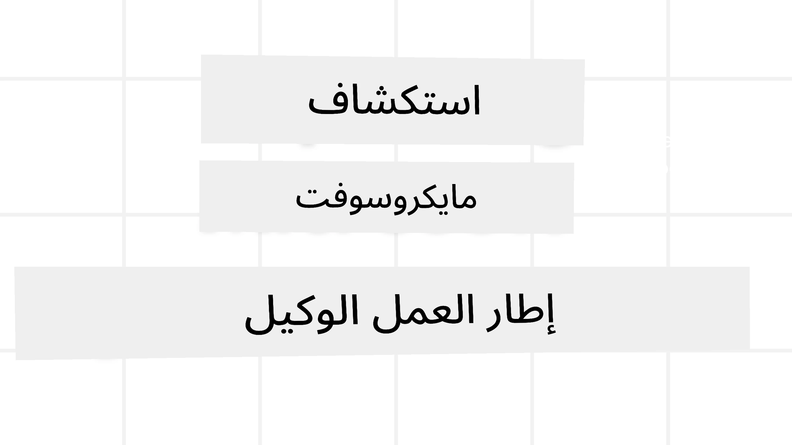
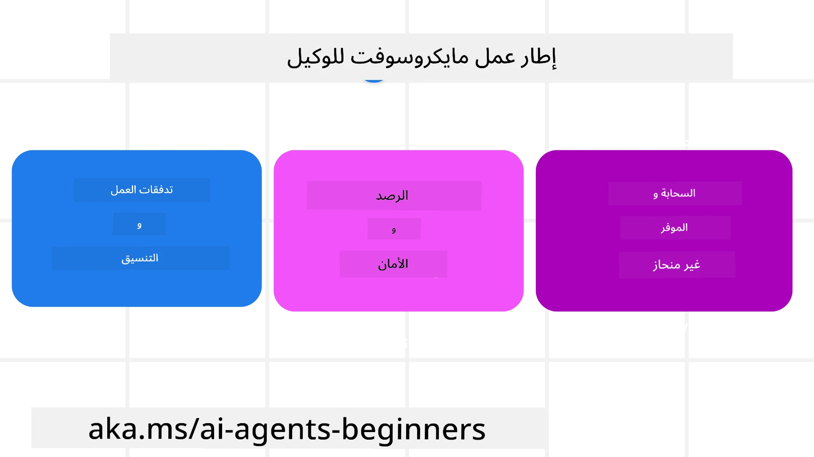
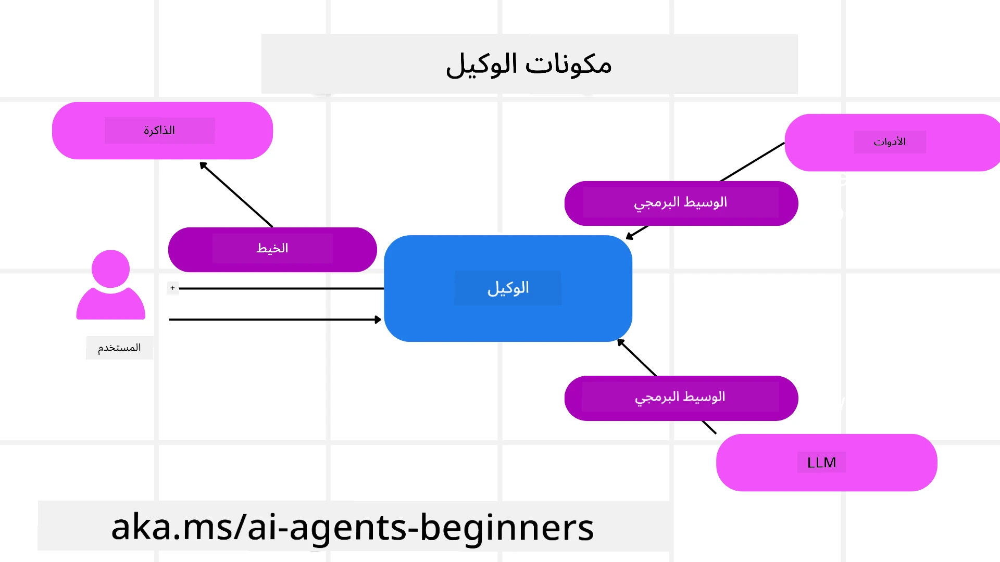

# استكشاف إطار عمل مايكروسوفت إيجنت



### مقدمة

ستغطي هذه الدرس:

- فهم إطار عمل مايكروسوفت إيجنت: الميزات الرئيسية والقيمة  
- استكشاف المفاهيم الرئيسية لإطار عمل مايكروسوفت إيجنت
- أنماط متقدمة في MAF: سير العمل، البرمجيات الوسيطة، والذاكرة

## أهداف التعلم

بعد إكمال هذا الدرس، ستعرف كيفية:

- بناء وكلاء ذكاء اصطناعي جاهزين للإنتاج باستخدام إطار عمل مايكروسوفت إيجنت
- تطبيق الميزات الأساسية لإطار عمل مايكروسوفت إيجنت على حالات استخدام الوكلاء الخاصة بك
- استخدام أنماط متقدمة تشمل سير العمل، البرمجيات الوسيطة، والمراقبة

## عينات الكود 

يمكن العثور على عينات كود لـ [Microsoft Agent Framework (MAF)](https://learn.microsoft.com/en-us/agent-framework/overview/?wt.mc_id=youtube_26688_organicsocial_reactor&pivots=programming-language-python) في هذا المستودع تحت ملفات `xx-python-agent-framework` و `xx-dotnet-agent-framework`.

## فهم إطار عمل مايكروسوفت إيجنت



[Microsoft Agent Framework (MAF)](https://learn.microsoft.com/en-us/agent-framework/overview/?wt.mc_id=youtube_26688_organicsocial_reactor&pivots=programming-language-python) هو إطار مايكروسوفت الموحد لبناء وكلاء الذكاء الاصطناعي. يوفر المرونة لمعالجة مجموعة متنوعة من حالات استخدام الوكلاء التي تُرى في بيئات الإنتاج والبحث، بما في ذلك:

- **تنسيق الوكلاء المتسلسل** في السيناريوهات التي تحتاج سير عمل خطوة بخطوة.
- **التنسيق المتزامن** في السيناريوهات التي يحتاج فيها الوكلاء لإكمال المهام في نفس الوقت.
- **تنسيق الدردشة الجماعية** في السيناريوهات التي يمكن أن يتعاون فيها الوكلاء معًا في مهمة واحدة.
- **تنسيق تسليم المهام** في السيناريوهات التي يقوم فيها الوكلاء بتسليم المهمة لبعضهم البعض مع اكتمال المهام الفرعية.
- **التنسيق المغناطيسي** في السيناريوهات التي يقوم فيها وكيل المدير بإنشاء وتعديل قائمة المهام ويتولى تنسيق الوكلاء الفرعيين لإتمام المهمة.

لتقديم وكلاء الذكاء الاصطناعي في بيئة الإنتاج، يشمل MAF أيضًا ميزات لـ:

- **القابلية للملاحظة** عبر استخدام OpenTelemetry حيث يتم تتبع كل إجراء من وكيل الذكاء الاصطناعي بما في ذلك استدعاء الأدوات، خطوات التنسيق، تدفقات الاستدلال، ومراقبة الأداء عبر لوحات معلومات Microsoft Foundry.
- **الأمان** باستضافة الوكلاء محليًا على Microsoft Foundry التي تشمل ضوابط أمان مثل الوصول بناءً على الدور، معالجة البيانات الخاصة، وسلامة المحتوى المدمجة.
- **التحمّل** حيث يمكن لوصلات الوكيل وسير العمل التوقف، الاستئناف والاسترداد من الأخطاء مما يمكّن العمليات طويلة الأمد.
- **التحكم** حيث يتم دعم سير العمل الذي يضم عنصرًا بشريًا للموافقة على المهام التي تتطلب ذلك.

يركز إطار عمل مايكروسوفت إيجنت أيضًا على التوافقية عبر:

- **عدم الاعتماد على السحابة** - يمكن تشغيل الوكلاء في الحاويات، داخل المنشآت، وعبر سحب متعددة مختلفة.
- **عدم الاعتماد على المزود** - يمكن إنشاء الوكلاء من خلال SDK المفضل لديك بما في ذلك Azure OpenAI و OpenAI
- **دمج المعايير المفتوحة** - يمكن للوكلاء استخدام البروتوكولات مثل Agent-to-Agent (A2A) وبروتوكول سياق النموذج (MCP) لاكتشاف واستخدام وكلاء وأدوات أخرى.
- **الإضافات والموصلات** - يمكن إنشاء اتصالات بخدمات البيانات والذاكرة مثل Microsoft Fabric، SharePoint، Pinecone و Qdrant.

لننظر كيف يتم تطبيق هذه الميزات على بعض المفاهيم الأساسية لإطار عمل مايكروسوفت إيجنت.

## المفاهيم الرئيسية لإطار عمل مايكروسوفت إيجنت

### الوكلاء



**إنشاء الوكلاء**

يتم إنشاء الوكيل عن طريق تحديد خدمة الاستدلال (مزود LLM)،
مجموعة من التعليمات التي يجب على وكيل الذكاء الاصطناعي اتباعها، واسم معين `name`:

```python
agent = AzureOpenAIChatClient(credential=AzureCliCredential()).create_agent( instructions="You are good at recommending trips to customers based on their preferences.", name="TripRecommender" )
```

المثال أعلاه يستخدم `Azure OpenAI` لكن يمكن إنشاء الوكلاء باستخدام مجموعة من الخدمات بما في ذلك `Microsoft Foundry Agent Service`:

```python
AzureAIAgentClient(async_credential=credential).create_agent( name="HelperAgent", instructions="You are a helpful assistant." ) as agent
```

APIs الخاصة بـ OpenAI `Responses` و `ChatCompletion`

```python
agent = OpenAIResponsesClient().create_agent( name="WeatherBot", instructions="You are a helpful weather assistant.", )
```

```python
agent = OpenAIChatClient().create_agent( name="HelpfulAssistant", instructions="You are a helpful assistant.", )
```

أو [MiniMax](https://platform.minimaxi.com/)، التي توفر واجهة برمجة تطبيقات متوافقة مع OpenAI مع نوافذ سياق كبيرة (حتى 204K توكن):

```python
agent = OpenAIChatClient(base_url="https://api.minimax.io/v1", api_key=os.environ["MINIMAX_API_KEY"], model_id="MiniMax-M3").create_agent( name="HelpfulAssistant", instructions="You are a helpful assistant.", )
```

أو وكلاء عن بُعد باستخدام بروتوكول A2A:

```python
agent = A2AAgent( name=agent_card.name, description=agent_card.description, agent_card=agent_card, url="https://your-a2a-agent-host" )
```

**تشغيل الوكلاء**

يتم تشغيل الوكلاء باستخدام طرق `.run` أو `.run_stream` للردود غير المتدفقة أو المتدفقة على التوالي.

```python
result = await agent.run("What are good places to visit in Amsterdam?")
print(result.text)
```

```python
async for update in agent.run_stream("What are the good places to visit in Amsterdam?"):
    if update.text:
        print(update.text, end="", flush=True)

```

يمكن أيضًا تخصيص خيارات لكل تشغيل وكيل مثل `max_tokens` المستخدمة من قبل الوكيل، و `tools` التي يستطيع الوكيل استدعاؤها، وحتى النموذج `model` نفسه المستخدم من قبل الوكيل.

هذا مفيد في الحالات التي تتطلب نماذج أو أدوات محددة لإكمال مهمة المستخدم.

**الأدوات**

يمكن تعريف الأدوات أثناء تعريف الوكيل:

```python
def get_attractions( location: Annotated[str, Field(description="The location to get the top tourist attractions for")], ) -> str: """Get the top tourist attractions for a given location.""" return f"The top attractions for {location} are." 


# عند إنشاء ChatAgent مباشرةً

agent = ChatAgent( chat_client=OpenAIChatClient(), instructions="You are a helpful assistant", tools=[get_attractions]

```

وأيضًا عند تشغيل الوكيل:

```python

result1 = await agent.run( "What's the best place to visit in Seattle?", tools=[get_attractions] # الأداة المقدمة لهذه الجلسة فقط )
```

**خيوط الوكيل**

تُستخدم خيوط الوكيل للتعامل مع المحادثات متعددة الأدوار. يمكن إنشاء الخيوط إما بواسطة:

- استخدام `get_new_thread()` الذي يتيح حفظ الخيط مع مرور الوقت
- إنشاء خيط تلقائيًا عند تشغيل الوكيل ويستمر الخيط فقط أثناء التشغيل الحالي.

لإنشاء خيط، يبدو الكود كالتالي:

```python
# إنشاء مؤشر ترابط جديد.
thread = agent.get_new_thread() # تشغيل الوكيل مع المؤشر.
response = await agent.run("Hello, I am here to help you book travel. Where would you like to go?", thread=thread)

```

بإمكانك بعد ذلك تسلسل الخيط ليتم تخزينه للاستخدام المستقبلي:

```python
# إنشاء خيط جديد.
thread = agent.get_new_thread() 

# تشغيل الوكيل مع الخيط.

response = await agent.run("Hello, how are you?", thread=thread) 

# تسلسل الخيط للتخزين.

serialized_thread = await thread.serialize() 

# فك تسلسل حالة الخيط بعد التحميل من التخزين.

resumed_thread = await agent.deserialize_thread(serialized_thread)
```

**البرمجيات الوسيطة للوكيل**

يتفاعل الوكلاء مع الأدوات ونماذج اللغة الكبيرة لإكمال مهام المستخدمين. في بعض السيناريوهات، نرغب في تنفيذ أو تتبع التفاعلات بينها. تتيح البرمجيات الوسيطة للوكيل القيام بذلك من خلال:

*البرمجيات الوسيطة الدالية*

تتيح هذه البرمجيات الوسيطة تنفيذ إجراء بين الوكيل والدالة/الأداة التي يستدعيها. مثال على الاستخدام هو الرغبة في تسجيل السجلات عند استدعاء الدالة.

في الكود أدناه، `next` يحدد ما إذا كان يجب استدعاء البرمجيات الوسيطة التالية أو الدالة الفعلية.

```python
async def logging_function_middleware(
    context: FunctionInvocationContext,
    next: Callable[[FunctionInvocationContext], Awaitable[None]],
) -> None:
    """Function middleware that logs function execution."""
    # المعالجة المسبقة: تسجيل قبل تنفيذ الوظيفة
    print(f"[Function] Calling {context.function.name}")

    # المتابعة إلى البرنامج الوسيط التالي أو تنفيذ الوظيفة
    await next(context)

    # المعالجة اللاحقة: تسجيل بعد تنفيذ الوظيفة
    print(f"[Function] {context.function.name} completed")
```

*البرمجيات الوسيطة للمحادثة*

تتيح هذه البرمجيات الوسيطة تنفيذ أو تسجيل إجراء بين الوكيل والطلبات بين نماذج اللغة الكبيرة.

تحتوي هذه على معلومات مهمة مثل `الرسائل` التي تُرسل إلى خدمة الذكاء الاصطناعي.

```python
async def logging_chat_middleware(
    context: ChatContext,
    next: Callable[[ChatContext], Awaitable[None]],
) -> None:
    """Chat middleware that logs AI interactions."""
    # المعالجة المسبقة: تسجيل قبل استدعاء الذكاء الاصطناعي
    print(f"[Chat] Sending {len(context.messages)} messages to AI")

    # المتابعة إلى الوسيط التالي أو خدمة الذكاء الاصطناعي
    await next(context)

    # المعالجة اللاحقة: تسجيل بعد رد الذكاء الاصطناعي
    print("[Chat] AI response received")

```

**ذاكرة الوكيل**

كما تمت تغطيته في درس `Agentic Memory`، الذاكرة عنصر هام enables لتمكين الوكيل من العمل عبر سياقات مختلفة. يقدم MAF عدة أنواع مختلفة من الذكريات:

*التخزين في الذاكرة*

هي الذاكرة المخزنة في الخيوط أثناء وقت تشغيل التطبيق.

```python
# إنشاء سلسلة جديدة.
thread = agent.get_new_thread() # تشغيل الوكيل باستخدام السلسلة.
response = await agent.run("Hello, I am here to help you book travel. Where would you like to go?", thread=thread)
```

*الرسائل المستمرة*

تُستخدم هذه الذاكرة عند تخزين سجل المحادثة عبر جلسات مختلفة. يتم تعريفها باستخدام `chat_message_store_factory` :

```python
from agent_framework import ChatMessageStore

# إنشاء مخزن رسائل مخصص
def create_message_store():
    return ChatMessageStore()

agent = ChatAgent(
    chat_client=OpenAIChatClient(),
    instructions="You are a Travel assistant.",
    chat_message_store_factory=create_message_store
)

```

*الذاكرة الديناميكية*

تضاف هذه الذاكرة إلى السياق قبل تشغيل الوكلاء. يمكن تخزين هذه الذكريات في خدمات خارجية مثل mem0:

```python
from agent_framework.mem0 import Mem0Provider

# استخدام Mem0 لقدرات الذاكرة المتقدمة
memory_provider = Mem0Provider(
    api_key="your-mem0-api-key",
    user_id="user_123",
    application_id="my_app"
)

agent = ChatAgent(
    chat_client=OpenAIChatClient(),
    instructions="You are a helpful assistant with memory.",
    context_providers=memory_provider
)

```

**مراقبة الوكيل**

المراقبة مهمة لبناء أنظمة وكلاء موثوقة وقابلة للصيانة. يدمج MAF مع OpenTelemetry لتوفير التتبع والعدادات لمراقبة أفضل.

```python
from agent_framework.observability import get_tracer, get_meter

tracer = get_tracer()
meter = get_meter()
with tracer.start_as_current_span("my_custom_span"):
    # قم بشيء
    pass
counter = meter.create_counter("my_custom_counter")
counter.add(1, {"key": "value"})
```

### سير العمل

يقدم MAF سير عمل هي خطوات محددة مسبقًا لإكمال مهمة وتتضمن وكلاء ذكاء اصطناعي كعناصر في تلك الخطوات.

تتألف سير العمل من مكونات مختلفة تسمح بتحكم أفضل في تدفق العملية. كما تتيح سير العمل **تنسيق متعدد الوكلاء** و **نقاط التحقق** لحفظ حالات سير العمل.

المكونات الأساسية لسير العمل هي:

**المنفذون**

يستقبل المنفذون الرسائل المدخلة، يؤدون المهام الموكلة إليهم، ثم ينتجون رسالة إخراج. هذا يحرك سير العمل نحو إتمام المهمة الأكبر. يمكن أن يكون المنفذ وكيل ذكاء اصطناعي أو منطق مخصص.

**الحواف**

تُستخدم الحواف لتعريف تدفق الرسائل في سير العمل. يمكن أن تكون:

*الحواف المباشرة* - اتصالات بسيطة من واحد إلى واحد بين المنفذين:

```python
from agent_framework import WorkflowBuilder

builder = WorkflowBuilder()
builder.add_edge(source_executor, target_executor)
builder.set_start_executor(source_executor)
workflow = builder.build()
```

*الحواف الشرطية* - تُفعّل بعد تحقق شرط معين. على سبيل المثال، عندما تكون غرف الفنادق غير متاحة، يمكن للمنفذ اقتراح خيارات أخرى.

*حواف التبديل* - توجيه الرسائل إلى منفذين مختلفين بناءً على شروط محددة. على سبيل المثال، إذا كان لدى زبون السفر وصول أولوية، تُعالَج مهامه عبر سير عمل مختلف.

*حواف التفرع للخارج* - إرسال رسالة واحدة إلى عدة أهداف.

*حواف التجميع* - جمع رسائل متعددة من منفذين مختلفين وإرسالها إلى هدف واحد.

**الأحداث**

لتوفير مراقبة أفضل لسير العمل، يقدم MAF أحداث مدمجة للتنفيذ تشمل:

- `WorkflowStartedEvent`  - يبدأ تنفيذ سير العمل
- `WorkflowOutputEvent` - ينتج سير العمل مخرجًا
- `WorkflowErrorEvent` - يواجه سير العمل خطأ
- `ExecutorInvokeEvent`  - يبدأ المنفذ في المعالجة
- `ExecutorCompleteEvent`  -  ينهي المنفذ المعالجة
- `RequestInfoEvent` - تم إصدار طلب

## أنماط MAF المتقدمة

تغطي الأقسام أعلاه المفاهيم الرئيسية لإطار عمل مايكروسوفت إيجنت. أثناء بناء وكلاء أكثر تعقيدًا، إليك بعض الأنماط المتقدمة للنظر فيها:

- **تركيب البرمجيات الوسيطة**: ربط عدة معالجات وسيطة (التسجيل، المصادقة، تحديد المعدل) باستخدام البرمجيات الوسيطة الدالية والحوارات للتحكم الدقيق بسلوك الوكيل.
- **نقاط تحقق سير العمل**: استخدام أحداث سير العمل والتسلسل لحفظ واستئناف عمليات الوكيل طويلة الأمد.
- **اختيار الأدوات الديناميكي**: دمج RAG على أوصاف الأدوات مع تسجيل الأدوات في MAF لعرض الأدوات الملائمة فقط لكل استعلام.
- **تسليم متعدد الوكلاء**: استخدام حواف سير العمل والتوجيه الشرطي لتنظيم تسليم المهام بين الوكلاء المتخصصين.

## استضافة وكلاء LangChain / LangGraph على Microsoft Foundry

إطار عمل مايكروسوفت إيجنت هو **متوافق مع أطر العمل الأخرى** — لست مقيدًا بالوكلاء المكتوبين باستخدام MAF فقط. إذا كان لديك وكيل مبني بالفعل باستخدام **LangChain** أو **LangGraph**، يمكنك تشغيله كـ **وكيل مستضاف في Microsoft Foundry** بحيث تدير Foundry وقت التشغيل، الجلسات، التوسعة، الهوية، ونقاط النهاية للبروتوكول نيابة عنك، بينما يبقى منطق الوكيل في LangGraph.

يتم ذلك باستخدام حزمة `langchain_azure_ai.agents.hosting`، التي تعرض شبكة LangGraph المترجمة عبر نفس البروتوكولات التي تستخدمها وكلاء Foundry المستضيفون.

**1. تثبيت الإضافة الخاصة بالاستضافة:**

```bash
pip install -U "langchain-azure-ai[hosting]>=1.2.4" azure-identity
```

تقوم الإضافة `hosting` بتثبيت مكتبات بروتوكول Foundry: `azure-ai-agentserver-responses` (نقطة نهاية `/responses` المتوافقة مع OpenAI) و `azure-ai-agentserver-invocations` (نقطة نهاية `/invocations` العامة).

**2. اختر بروتوكول الاستضافة:**

| البروتوكول | فئة المضيف | نقطة النهاية | يستخدم عندما |
|----------|-----------|----------|----------|
| **Responses** | `ResponsesHostServer` | `/responses` | تريد دردشة متوافقة مع OpenAI، تدفق، سجل الردود، وخيوط المحادثة — الخيار الافتراضي الموصى به لوكلاء المحادثة. |
| **Invocations** | `InvocationsHostServer` | `/invocations` | تحتاج إلى شكل JSON مخصص، نقطة نهاية بأسلوب webhook، أو معالجة غير محادثية. |

لأن **واجهة برمجة تطبيقات Responses هي الواجهة الأساسية لتطوير نمط الوكيل في Foundry**، ابدأ مع `ResponsesHostServer` لمعظم الوكلاء.

**3. تكوين المتغيرات البيئية** (`az login` أولًا حتى يتمكن `DefaultAzureCredential` من المصادقة):

```bash
export FOUNDRY_PROJECT_ENDPOINT="https://<resource>.services.ai.azure.com/api/projects/<project>"
export FOUNDRY_MODEL_NAME="gpt-5-mini"
```

عندما يعمل الوكيل لاحقًا كوكيل مستضاف في Foundry، تقوم المنصة بحقن `FOUNDRY_PROJECT_ENDPOINT` تلقائيًا.

**4. عرض وكيل LangGraph عبر بروتوكول Responses:**

```python
import os

from azure.ai.projects import AIProjectClient
from azure.identity import DefaultAzureCredential, get_bearer_token_provider
from langchain.agents import create_agent
from langchain_openai import ChatOpenAI
from langchain_azure_ai.agents.hosting import ResponsesHostServer

_AZURE_AI_SCOPE = "https://ai.azure.com/.default"


def build_chat_model() -> ChatOpenAI:
    project_endpoint = os.environ["FOUNDRY_PROJECT_ENDPOINT"].rstrip("/")
    deployment = os.environ.get("FOUNDRY_MODEL_NAME", "gpt-5-mini")
    credential = DefaultAzureCredential()
    project = AIProjectClient(endpoint=project_endpoint, credential=credential)
    openai_client = project.get_openai_client()
    token_provider = get_bearer_token_provider(credential, _AZURE_AI_SCOPE)

    # هنا ChatOpenAI يستهدف نقطة نهاية (Responses) المتوافقة مع OpenAI في مشروع Foundry.
    return ChatOpenAI(
        model=deployment,
        base_url=str(openai_client.base_url),
        api_key=token_provider,
    )


def main() -> None:
    graph = create_agent(build_chat_model(), tools=[])
    port = int(os.environ.get("PORT", "8088"))
    ResponsesHostServer(graph).run(port=port)


if __name__ == "__main__":
    main()
```

شغله محليًا باستخدام `python main.py`، ثم أرسل طلب Responses إلى `http://localhost:8088/responses`.

**السلوكيات الرئيسية:**

- **المحادثات**: العملاء يواصلون المحادثة بتمرير `previous_response_id` أو معرف `conversation`. إذا تم تجميع رسمك البياني باستخدام نقطة تحقق LangGraph، تقوم Foundry بربط حالة المحادثة بنقطة التحقق (استخدم نقطة تحقق دائمة في الإنتاج؛ `MemorySaver` مناسب للاختبار المحلي).
- **الإنسان في الحلقة**: إذا استخدم رسمك البياني LangGraph `interrupt()`، يعرض `ResponsesHostServer` الانقطاع المعلق كعنصر `function_call` / `mcp_approval_request` في Responses، ويستأنف العملاء مع تطابق `function_call_output` / `mcp_approval_response`.
- **النشر على Foundry**: استخدم CLI مطور Azure — `azd ext install azure.ai.agents`, `azd ai agent init -m <manifest>`, `azd ai agent run` (محلي، يتطلب Docker)، ثم `azd provision` و `azd deploy`. يتطلب نشر الوكيل المستضاف دور **Foundry Project Manager**.

نسخة قابلة للتشغيل من هذا المثال موجودة في [code-samples/14-langchain-hosted-agent.py](../../../14-microsoft-agent-framework/code-samples/14-langchain-hosted-agent.py). للمراجعة الكاملة (بروتوكول Invocations، مخططات الطلب المخصصة، واستكشاف الأخطاء)، راجع [Host LangGraph agents as Foundry hosted agents](https://learn.microsoft.com/azure/foundry/how-to/develop/langchain-hosted-agents).

## عينات الكود 

يمكن العثور على عينات كود لإطار عمل مايكروسوفت إيجنت في هذا المستودع تحت ملفات `xx-python-agent-framework` و `xx-dotnet-agent-framework`.

## هل لديك المزيد من الأسئلة حول إطار عمل مايكروسوفت إيجنت؟

انضم إلى [Microsoft Foundry Discord](https://discord.com/invite/ATgtXmAS5D) لتلتقي مع متعلمين آخرين، تحضر ساعات المكتب وتحصل على إجابات لأسئلتك حول وكلاء الذكاء الاصطناعي.
## الدرس السابق

[الذاكرة لوكلاء الذكاء الاصطناعي](../13-agent-memory/README.md)

## الدرس التالي

[بناء وكلاء استخدام الكمبيوتر (CUA)](../15-browser-use/README.md)

---

<!-- CO-OP TRANSLATOR DISCLAIMER START -->
**تنويه**:
تمت ترجمة هذا المستند باستخدام خدمة الترجمة بالذكاء الاصطناعي [Co-op Translator](https://github.com/Azure/co-op-translator). بينما نسعى للدقة، يرجى العلم أن الترجمات الآلية قد تحتوي على أخطاء أو عدم دقة. يجب اعتبار المستند الأصلي بلغته الأصلية المصدر الرسمي والمعتمد. للمعلومات الهامة، يُنصح بالاستعانة بترجمة بشرية محترفة. نحن غير مسؤولين عن أي سوء فهم أو تفسير ناتج عن استخدام هذه الترجمة.
<!-- CO-OP TRANSLATOR DISCLAIMER END -->