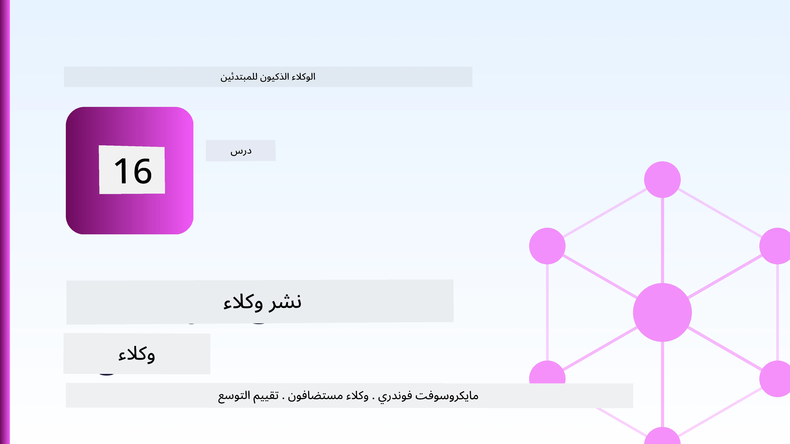
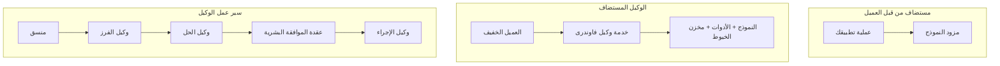
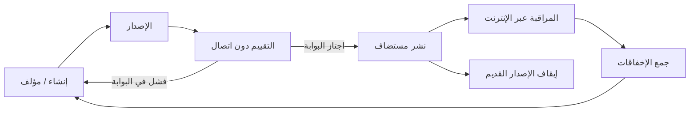
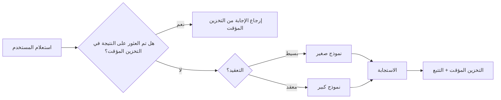
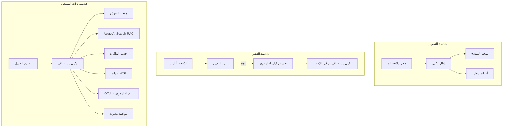

# نشر وكلاء قابلين للتوسع باستخدام Microsoft Foundry



حتى هذه اللحظة في الدورة التدريبية، قمت بإنشاء وكلاء يعملون على حاسوبك المحمول، داخل دفتر ملاحظات، يعملون عن طريق `az login` وبعض متغيرات البيئة. هذا هو الأسلوب الصحيح للتعلم. ولكنه ليس الأسلوب الصحيح لتشغيل وكيل يعتمد عليه الآلاف من العملاء في الساعة الثالثة صباحًا.

هذه الدرسة تتناول الفجوة بين "يعمل على جهازي" و"يعمل بشكل موثوق وبتكلفة معقولة في بيئة الإنتاج." نحن نسد هذه الفجوة باستخدام **Microsoft Foundry** و **خدمة وكلاء Microsoft Foundry**، ونفعل ذلك ببناء وكيل دعم عملاء حقيقي يحتوي على أدوات، استرجاع، ذاكرة، تقييم، ومراقبة.

## مقدمة

ستغطي هذه الدرسة:

- الفرق بين **وكيل نموذجي مبدئي** و **وكيل منشور**، ولماذا الانتقال يتعلق في الغالب بكل شيء *حول* النموذج.
- **أنماط النشر** للوكلاء: استضافة العميل، استضافة الخدمة (الوكلاء المستضافون)، وتنظيم سير العمل.
- **دورة حياة الوكيل** على Microsoft Foundry — الإنشاء، النسخ، النشر، التقييم، المراقبة، التقاعد.
- **استراتيجيات التوسع**: توجيه النموذج، التخزين المؤقت، التزامن، والتصميم بدون حالة.
- **القابلية للملاحظة** باستخدام OpenTelemetry وتتبع Foundry.
- **تحسين التكلفة** من خلال اختيار النموذج، التوجيه، وبوابات التقييم.
- **الاعتبارات المؤسسية**: الحوكمة، الموافقة البشرية، وتشغيل خوادم MCP بأمان في الإنتاج.

## أهداف التعلم

بعد إكمال هذه الدرسة، ستعرف كيف:

- اختيار نمط النشر المناسب لحجم عمل الوكيل المعني.
- نشر وكيل إلى خدمة وكلاء Microsoft Foundry بحيث يتم نسخه، حوكمته، ورصده.
- تجهيز وكيل للتتبع وربط خط أنابيب تقييم يعمل قبل كل إصدار.
- تطبيق توجيه النموذج والتخزين المؤقت للحفاظ على زمن الاستجابة والتكلفة تحت السيطرة عند التوسع.
- إضافة بوابة موافقة بشرية للإجراءات عالية المخاطر ودمج خادم MCP بطريقة آمنة للإنتاج.

## المتطلبات السابقة

تفترض هذه الدرسة أنك قد أكملت الدروس السابقة وتشعر بالراحة مع:

- بناء وكلاء باستخدام [إطار وكلاء Microsoft](../14-microsoft-agent-framework/README.md) (الدروس 14).
- [استخدام الأدوات](../04-tool-use/README.md) (الدرس 4) و [Agentic RAG](../05-agentic-rag/README.md) (الدرس 5).
- [ذاكرة الوكيل](../13-agent-memory/README.md) (الدرس 13) و [بروتوكولات Agentic / MCP](../11-agentic-protocols/README.md) (الدرس 11).
- [الملاحظة والتقييم](../10-ai-agents-production/README.md) (الدرس 10) — هذه الدرسة تبني مباشرة عليه.

ستحتاج أيضًا إلى:

- **اشتراك Azure** ومشروع **Microsoft Foundry** لديه على الأقل نموذج دردشة منشور واحد.
- مصادقة **Azure CLI** (`az login`).
- بايثون 3.12+ والحزم في مستودع [`requirements.txt`](../../../requirements.txt).

## من النموذج الأولي إلى الإنتاج: ما الذي يتغير فعلاً

يشترك الوكيل النموذجي الوكيل الإنتاجي بنفس الحلقة الأساسية — التفكير، استدعاء الأدوات، الاستجابة. ما يتغير هو كل ما يحيط بتلك الحلقة. النموذج يشكل ربما 20% من وكيل الإنتاج؛ الـ 80% المتبقية هي الهيكل التشغيلي.

| القلق | النموذج الأولي | الإنتاج |
| --- | --- | --- |
| **الاستضافة** | يعمل داخل دفتر ملاحظاتك | يعمل كخدمة مستضافة، يتم نسخه وتوزيعه |
| **الهوية** | رمز تسجيل الدخول `az login` الخاص بك | هوية مُدارة بصلاحيات محددة بنطاق RBAC |
| **الحالة** | داخل الذاكرة، تفقد عند إعادة التشغيل | مُخزنة خارجيًا (مخزن الخيوط، خدمة الذاكرة) |
| **الفشل** | ترى تتبع الاستدعاء | عمليات إعادة محاولة، بدائل، صندوق أخطاء، تنبيهات |
| **التكلفة** | "إنها بضع سنتات" | متتبعة لكل طلب، موجهة، مخزنة مؤقتًا، ضمن الميزانية |
| **الجودة** | تقيّم الناتج بصريًا | تقييم تلقائي قبل كل إصدار |
| **الثقة** | توافق على كل إجراء | سياسة + مشارك بشري للإجراءات عالية الخطورة |

احتفظ بهذا الجدول في ذهنك. كل قسم أدناه يرتبط بأحد هذه الصفوف.

## أنماط نشر الوكلاء

هناك ثلاثة أنماط ستستخدمها، غالبًا معًا.

### 1. وكلاء مستضافون من العميل

كائن الوكيل يعيش داخل عملية تطبيق *العميل* الخاصة بك. يستدعي كودك مزود النموذج مباشرة؛ الحلقة المنطقية تعمل في خدمتك. هذا ما قامت به كل الدروس السابقة.

- **استخدمه عندما** تحتاج إلى تحكم كامل في الحلقة، أو وسيط مخصص، أو تضمين الوكيل داخل نظام خلفي موجود.
- **التنازل**: أنت المسؤول عن التوسع، الحالة، والمرونة بنفسك.

### 2. وكلاء مستضافون (خدمة وكلاء Foundry)

الوكيل *مسجل كموارد* في Microsoft Foundry. يتولى Foundry استضافة الحلقة المنطقية، تخزين الخيوط، فرض أمان المحتوى وRBAC، ويجعل الوكيل مرئيًا في بوابة Foundry. يصبح تطبيقك عميلًا خفيفًا ينشئ الخيوط ويقرأ الاستجابات.

- **استخدمه عندما** تريد الديمومة، المراقبة المدمجة، الحوكمة، ومساحة تشغيل أقل.
- **التنازل**: تحكم أقل على المستوى المنخفض مقابل بيئة تشغيل مُدارة.

### 3. سير عمل الوكيل

يتم تركيب عدة وكلاء (وأدوات) في رسم بياني بتحكم صريح بتدفق العمل — خطوات متتابعة، تفرعات، عقد موافقة بشرية، ونقاط تحقق دائمة يمكن إيقافها واستئنافها. هذه هي قدرة **سير العمل** في إطار وكلاء Microsoft المطبقة على مقياس النشر.

- **استخدمه عندما** تمتد مهمة واحدة على عدة وكلاء متخصصين أو تحتاج إلى خطوة موافقة في الوسط.
- **التنازل**: المزيد من الأجزاء المتحركة؛ تحتاج مراقبة على مستوى التنظيم.



## دورة حياة الوكيل على Microsoft Foundry

نشر وكيل ليس مجرد أمر `push` مرة واحدة. إنها حلقة، وتشبه كثيرًا دورة إصدار البرمجيات لأنه هو بالضبط ما هي.



الفكرة الأساسية، المقتبسة من [الدرس 10](../10-ai-agents-production/README.md): **التقييم غير المتصل هو بوابة، وليس مجرد فكرة لاحقة.** لا يتم شحن نسخة جديدة من الوكيل إلا إذا تجاوزت حدود تقييمك. ثم تغذي المراقبة عبر الإنترنت الإخفاقات الواقعية إلى مجموعة اختبارك غير المتصلة. هذه هي الحلقة الكاملة.

## استراتيجيات التوسع

توسيع وكيل يختلف عن توسيع واجهة برمجة تطبيقات ويب بدون حالة، لأن كل طلب يمكن أن يحفز عدة استدعاءات مكلفة للنموذج والأدوات. أربع تقنيات تحمل معظم الحمل.

**معالجة الطلبات بدون حالة.** لا تحتفظ بحالة لكل مستخدم في ذاكرة العملية الخاصة بك. احفظ خيوط المحادثة في مخزن خيوط Foundry أو خدمة ذاكرة بحيث يمكن لأي مثيل معالجة أي طلب. هذا ما يتيح لك التوسع أفقيًا — إضافة مثيلات، بدون جلسات ملتصقة.

**توجيه النموذج.** ليس كل طلب يحتاج إلى النموذج الأكثر قدرة (والأكثر تكلفة). وجّه الطلبات البسيطة — تصنيف النية، الإجابات القصيرة الحقيقية — إلى نموذج صغير وسريع، واحتفظ بالنموذج الكبير للتفكير الحقيقي. يمكن لـ **موجه النموذج** في Foundry أن يفعل ذلك نيابة عنك، أو يمكنك تنفيذ مصنف خفيف بنفسك. ستبني النسخة اليدوية في المختبر.

**تخزين الاستجابات مؤقتًا.** العديد من استفسارات الدعم هي شبه مكررة ("كيف أعيد تعيين كلمة المرور؟"). خزّن إجابات الأسئلة الشائعة وقدمها دون الحاجة للنموذج على الإطلاق. حتى معدل إصابة تخزين مؤقت محدود يقلل التكلفة والزمن بشكل ملحوظ.

**التزامن والضغط العكسي.** لمزودي النموذج حدود معدل. حدد تزامنك، استخدم المحاولات مع تراجع أُسّي، وفشل بأناقة (استجابة "نحن نعمل على الأمر" في قائمة الانتظار أفضل من خطأ 500).



## القابلية للملاحظة في الإنتاج

لا يمكنك تشغيل ما لا يمكنك رؤيته. كما تم تناوله في الدرس 10، يصدّر إطار وكلاء Microsoft تتبعات **OpenTelemetry** أصليًا — كل استدعاء نموذج، وأمر أداة، وخطوة تنظيم تصبح مدى زمني. في الإنتاج، تصدر هذه المديات إلى Microsoft Foundry (أو أي خلفية متوافقة مع OTel) حتى يمكنك:

- تتبع شكوى عميل واحدة عبر كل استدعاء نموذج وأداة.
- مراقبة زمن الاستجابة عند p50/p95 والتكلفة لكل طلب مع مرور الوقت.
- التنبيه على ارتفاع معدلات الخطأ وشذوذات التكلفة قبل أن يلاحظها المستخدمون (أو فريق المالية).

```python
from agent_framework.observability import get_tracer

tracer = get_tracer()

with tracer.start_as_current_span("support_request") as span:
    span.set_attribute("customer.tier", "enterprise")
    span.set_attribute("routed.model", "gpt-5-nano")
    # يتم تتبع تنفيذ الوكيل تلقائيًا داخل هذا الامتداد
```

سمات مثل `customer.tier` و `routed.model` هي ما يحول جدار التتبعات إلى أسئلة قابلة للإجابة ("هل يتم توجيه العملاء المؤسسيين كثيرًا إلى النموذج الصغير؟").

## تحسين التكلفة

تهيمن التوكنات على تكلفة وكلاء الإنتاج. ثلاثة رافعات، حسب الأثر:

1. **حجم النموذج المناسب.** نموذج صغير يتجاوز بوابة تقييمك يكون غالبًا أرخص من نموذج كبير أيضًا يتجاوزها. استخدم التقييم لإثبات أن النموذج الصغير جيد بما يكفي بدلًا من اختيار أكبر نموذج بحرص.
2. **التوجيه حسب التعقيد.** كما ورد أعلاه — ادفع أسعار النموذج الكبير فقط للطلبات التي تحتاج تفكير نموذج كبير.
3. **التخزين المؤقت بقوة.** أرخص استدعاء نموذج هو الذي لا تجريه أبداً.

بوابات التقييم والتحكم في التكلفة هما نفس الانضباط من زاويتين: التقييم يخبرك بـ *أدنى جودة*، والتوجيه والتخزين المؤقت يبقيانك قريبًا من *تكلفة* ذلك الأدنى قدر الإمكان.

## اعتبارات النشر المؤسسي

**الحوكمة.** يرث الوكلاء المستضافون بنية RBAC الخاصة بـ Foundry، أمان المحتوى، وتدقيق السجلات. امنح كل وكيل هوية مُدارة بأقل صلاحيات يحتاجها — وصول للقراءة فقط إلى قاعدة المعرفة، وصول محدد إلى واجهة برمجة تذاكر الدعم، لا شيء أكثر.

**المشاركة البشرية في الحلقة.** بعض الإجراءات خطيرة جدًا لأتمتتها كليًا — إصدار رد أموال، حذف حساب، التصعيد لفريق قانوني. يدعم إطار وكلاء Microsoft أدوات **تتطلب الموافقة**: يقترح الوكيل الإجراء، يتوقف التنفيذ، يوافق أو يرفض إنسان، وتستأنف سير العمل. شاهدت البدائية في [الدرس 6](../06-building-trustworthy-agents/README.md); هنا تقوم بنشرها.

**MCP في الإنتاج.** يتيح لك [MCP](../11-agentic-protocols/README.md) أن يستهلك وكيلك أدوات خارجية عبر واجهة معيارية. في الإنتاج، عالج كل خادم MCP كحدود غير موثوقة: ثبت إصدار الخادم، شغله بهوية مخصصة، تحقق من مخرجاته، ولا تكشف عنه أسرار. خادم MCP هو تبعية، والتبعيات تحتاج إلى تصحيحات، مراجعات، وتحديد معدلات.



هذه الثلاثة الرسوم البيانية — التطوير، النشر، وقت التشغيل — هو نفس الوكيل في ثلاث مراحل من حياته. المختبر التالي يرشدك خلال بنائه.

## مختبر عملي: وكيل دعم عملاء جاهز للإنتاج

افتح [`code_samples/16-python-agent-framework.ipynb`](./code_samples/16-python-agent-framework.ipynb) واشتغل عليه من البداية للنهاية. ستجمع **وكيل دعم عملاء Contoso** مع كل اهتمام إنتاجي موصل:

1. **استدعاء الأدوات** — الاستعلام عن حالة الطلب وفتح تذاكر الدعم.
2. **RAG** — إجابة أسئلة السياسة من قاعدة معرفة (Azure AI Search، مع خيار رجوع في الذاكرة حتى يعمل الدفتر بدون مورد Search).
3. **الذاكرة** — تذكر العميل عبر دورات المحادثة.
4. **توجيه النموذج** — مصنف تعقيد يوجه كل طلب إلى نموذج صغير أو كبير.
5. **تخزين الاستجابات مؤقتًا** — تخدم الأسئلة المتكررة من التخزين المؤقت.
6. **الموافقة البشرية** — تأجيل ردود الأموال التي تزيد عن حد معين حتى التوقيع البشري.
7. **خط أنابيب التقييم** — مجموعة اختبار صغيرة غير متصلة تقيم الوكيل وتعمل كبوابة للإصدار.
8. **القابلية للملاحظة** — تتبع OpenTelemetry حول كل طلب.

### الشرح

تم تنظيم الدفتر بحيث يكون كل اهتمام إنتاجي قسم مستقل وقابل للتشغيل. القلب هو معالج الطلب بالتوجيه والتخزين المؤقت:

```python
async def handle_support_request(query: str, customer_id: str) -> str:
    # ١. قدّم من الذاكرة المؤقتة عندما نستطيع.
    cached = response_cache.get(normalize(query))
    if cached:
        return cached

    # ٢. قم بالتوجيه حسب التعقيد للتحكم في التكلفة.
    model = "gpt-5-nano" if is_simple(query) else "gpt-5-mini"

    # ٣. شغّل الوكيل داخل نطاق تتبع للمراقبة.
    with tracer.start_as_current_span("support_request") as span:
        span.set_attribute("routed.model", model)
        span.set_attribute("customer.id", customer_id)
        response = await support_agent.run(query, model=model)

    # ٤. خزّن وأعد.
    response_cache.set(normalize(query), response.text)
    return response.text
```

بوابة التقييم التي تحرس الإصدار تبدو هكذا:

```python
async def evaluation_gate(agent, test_cases, threshold: float = 0.8) -> bool:
    passed = 0
    for case in test_cases:
        result = await agent.run(case["input"])
        if score_response(result.text, case["expected"]) >= 0.8:
            passed += 1
    pass_rate = passed / len(test_cases)
    print(f"Evaluation pass rate: {pass_rate:.0%} (gate: {threshold:.0%})")
    return pass_rate >= threshold  # يتم النشر فقط إذا اجتاز البوابة
```

اقرأ كل سطر — الدفتر يحافظ على البدائيات صغيرة عمدًا حتى لا يختبئ شيء خلف استدعاء إطار.

## التحقق من وكيل منشور باختبارات الدخان

تعمل بوابة التقييم أعلاه *غير متصل* مقابل كائن الوكيل خاصتك. بمجرد نشر الوكيل كوكيل مستضاف، تحتاج إلى تحقق إضافي، أرخص: **هل نقطة النهاية المنشورة ترد فعلاً؟**

النشر "ناجح" يثبت فقط أن طبقة التحكم قبلت التعريف — لكنه لا يثبت استجابة الوكيل. قد يترك نقص تبعية، توجيه نموذج خاطئ، أو اتصال منتهي نشرًا أخضر يعود بلا شيء. **اختبار الدخان** يكتشف ذلك في ثوانٍ، مع كل نشر، دون تكلفة تقييم كامل.

يأتي هذا المستودع مع خط أنابيب اختبار دخان جاهز للاستخدام مبني على إجراء [AI Smoke Test](https://github.com/marketplace/actions/ai-smoke-test) على GitHub:

- **الفهرس** — [`tests/lesson-16-smoke-tests.json`](../../../tests/lesson-16-smoke-tests.json) يحتوي على مطالبات وتأكيدات لوكيل دعم Contoso (إجابات السياسة المستندة للحقائق، استعلام طلب، الحفاظ على الموضوع، واستمرارية المحادثة متعددة الأدوار). فهارس لوكلاء الدروس الأخرى تعيش بجانبه — انظر [`tests/README.md`](../tests/README.md).
- **سير العمل** — [`.github/workflows/smoke-test.yml`](../../../.github/workflows/smoke-test.yml) يقوم بتسجيل الدخول بـ Azure OIDC ويرسل كل مطالبة إلى نقطة نهاية الردود للوكيل، ويفشل المهمة عند أي فشل تأكيدي.

```yaml
- name: Smoke-test hosted agent
  uses: JFolberth/ai-smoketest@v1
  with:
    project_endpoint: ${{ inputs.project_endpoint }}
    agent_name: ContosoSupportAgent
    tests_file: tests/lesson-16-smoke-tests.json
```


قم بتشغيله من تبويب **الإجراءات** بمجرد نشر وكيلك، مع توفير نقطة نهاية مشروع Foundry واسم الوكيل. تحتاج الهوية الموحدة إلى الدور **Azure AI User** على نطاق مشروع Foundry. فكر في الطبقات على أنها هرم: اختبارات الدخان (هل الوصول متاح ويستجيب؟) تُجرى عند كل نشر، التقييم غير المتصل (هل هو جيد بما يكفي للإصدار؟) يُجرى قبل الترويج، والتقييم المتصل (كيف أداءه في البيئة الحقيقية؟) يعمل باستمرار.

## اختبار المعرفة

اختبر فهمك قبل الانتقال إلى التعيين.

**1. ما هي النسبة التقريبية لإسهام "النموذج" في وكيل الإنتاج، وما هو الباقي؟**

<details>
<summary>الجواب</summary>

النموذج هو أقلية من النظام - غالبًا ما يقال إنه حوالي 20%. والباقي هو الهيكل التشغيلي: الاستضافة والإصدار، الهوية و RBAC، الحالة الخارجية، إدارة الفشل، تتبع التكلفة، التقييم، وضوابط التدخل البشري. الانتقال إلى الإنتاج يتعلق في الغالب ببناء كل شيء *حول* حلقة الاستدلال.
</details>

**2. متى تختار وكيل مستضاف بدلاً من وكيل مستضاف على العميل؟**

<details>
<summary>الجواب</summary>

عندما تريد وقت تشغيل مدار مع متانة مدمجة (الخيوط التي تستمر ويمكن استئنافها)، وقابلية المراقبة، وسلامة المحتوى، و RBAC، وأنت مستعد لتقديم بعض التحكم منخفض المستوى في حلقة الاستدلال مقابل تقليل مساحة التشغيل. يفضل العميل المستضاف عندما تحتاج إلى تحكم كامل في الحلقة أو تقوم بتضمين الوكيل في خلفية موجودة.
</details>

**3. لماذا يجب أن يكون الوكيل القابل للتوسع بدون حالة في ذاكرتة العملية؟**

<details>
<summary>الجواب</summary>

حتى يتمكن أي مثيل من التعامل مع أي طلب، وهذا ما يسمح بالتوسع الأفقي دون جلسات ثابتة. يتم تخزين حالة المحادثة لكل مستخدم في متجر خيوط أو خدمة ذاكرة خارجية. إذا عاشت الحالة في ذاكرة العملية، ستفقدها عند إعادة التشغيل ولا يمكنك توزيع الحمل بحرية.
</details>

**4. ما المشكلة التي يحلها توجيه النموذج، وكيف يرتبط بالتقييم؟**

<details>
<summary>الجواب</summary>

التوجيه يرسل الطلبات البسيطة إلى نموذج صغير ورخيص وسريع ويخصص النموذج الكبير للاستدلال الحقيقي، مما يتحكم في كل من الكمون والتكلفة. يرتبط بالتقييم لأن التقييم هو ما *يثبت* أن النموذج الصغير جيد بما يكفي لفئة من الطلبات — التوجيه بدون تقييم هو مجرد تخمين.
</details>

**5. ما هو "بوابة التقييم" وأين تقع في دورة الحياة؟**

<details>
<summary>الجواب</summary>

بوابة التقييم تجري مجموعة اختبارات غير متصلة ضد نسخة جديدة من الوكيل وتمنع النشر ما لم يتجاوز معدل النجاح عتبة معينة. تقع بين "الإصدار" و "النشر" في دورة الحياة، مما يجعل الجودة شرطًا مسبقًا للإصدار بدلاً من شيء تتحقق منه بعد الإطلاق.
</details>

**6. لماذا يجب التعامل مع خادم MCP كحدود غير موثوق بها في الإنتاج؟**

<details>
<summary>الجواب</summary>

لأنه تبعية خارجية يتصل بها وكيلك. يجب تثبيت نسخته، تشغيله بهوية محددة، التحقق من مخرجاته، تحديد معدل الاستخدام، وعدم كشف الأسرار له — نفس الانضباط الذي تطبقه على أي تبعية طرف ثالث. تتدفق مخرجاته إلى استدلال وكيلك، لذا فإن الثقة غير المصدقة تشكل خطرًا أمنيًا.
</details>

**7. أي تغيير واحد عادةً ما يكون له أكبر تأثير على تكلفة وكيل الإنتاج، ولماذا؟**

<details>
<summary>الجواب</summary>

اختيار الحجم الصحيح للنموذج — استخدام أصغر نموذج يتجاوز بوابة التقييم الخاصة بك. التكلفة تهيمن عليها الرموز، ونموذج أصغر يلبي معيار الجودة يكون دائمًا أرخص تقريبًا من الأكبر. التخزين المؤقت والتوجيه يقللان التكلفة أكثر، ولكن اختيار النموذج الأساسي الصحيح له التأثير الأكبر من الدرجة الأولى.
</details>

**8. ما الدور الذي تلعبه خصائص الفترات مثل `customer.tier` و`routed.model` في القابلية للمراقبة؟**

<details>
<summary>الجواب</summary>

إنها تحول التتبع الخام إلى أسئلة تجارية قابلة للإجابة عليها. بدون خصائص لديك جدار من الفترات؛ معها يمكنك السؤال "هل يتم توجيه عملاء المؤسسات إلى النموذج الصغير بشكل مفرط؟" أو "أي نموذج يتعامل مع أبطأ الطلبات لدينا؟" الخصائص هي كيف تقسم التليمترية بالأبعاد التي تهم عمليتك.
</details>

## التعيين

خذ وكيل دعم العملاء من المختبر وقم بتحصينه لسيناريو محدد: **وكيل دعم فواتير الاشتراك لشركة SaaS.**

يجب أن تتضمن تقديماتك:

1. **استبدال الأدوات** بأدوات ذات صلة بالفوترة: `get_subscription_status`، `get_invoice`، و `issue_credit` (يتطلب الاعتمادات فوق 50 دولار موافقة بشرية).
2. **إضافة ثلاثة مستندات RAG** تغطي سياسة استرداد الشركة، دورة الفوترة، وسياسة الإلغاء.
3. **توسيع مجموعة التقييم** إلى ثمانية حالات على الأقل، بما في ذلك اثنين على الأقل *يجب* أن يفعلا مسار الموافقة البشرية، وتأكيد أن بوابة التقييم تعمل بشكل صحيح للنجاح أو الفشل.
4. **إضافة تقرير تكلفة واحد**: بعد تشغيل عشرة استعلامات مختلطة عبر الوكيل، اطبع عدد تلك التي ذهبت إلى النموذج الصغير، وعدد تلك التي ذهبت إلى النموذج الكبير، وعدد التي تم تقديمها من التخزين المؤقت.

اكتب فقرة قصيرة (في خلية ماركداون) توضح قاعدة توجيه النموذج التي اخترتها وكيف ستتحقق منها مع حركة مرور حقيقية. لا يوجد جواب صحيح واحد — سيتم تقييمك على مدى ترابط مخاوف الإنتاج معًا بشكل منطقي.

## الملخص

في هذا الدرس قمت بنقل وكيل من النموذج الأولي إلى الإنتاج باستخدام Microsoft Foundry:

- الانتقال إلى الإنتاج يتعلق في الغالب بـ **الهيكل التشغيلي** حول النموذج — الاستضافة، الهوية، الحالة، إدارة الفشل، التكلفة، الجودة، والثقة.
- تعلمت **ثلاثة أنماط نشر** — العميل المستضاف، الوكلاء المستضافون، وتدفقات عمل الوكلاء — ومتى يناسب كل منها.
- مشيت عبر **دورة حياة الوكيل**، حيث يعمل التقييم غير المتصل كـ **بوابة للإصدار** والمراقبة المتصلة تغذي الفشل مرة أخرى إلى مجموعة الاختبارات.
- طبقت **استراتيجيات التوسع** — تصميم بدون حالة، توجيه النموذج، التخزين المؤقت، والتزامن المحدود — وربطتها بـ **تحسين التكلفة**.
- ربطت **ضوابط المؤسسات**: RBAC، الموافقة البشرية في الحلقة، وتكامل MCP الآمن للإنتاج.
- بنيت **وكيل دعم عملاء جاهز للإنتاج** يربط كل هذه المخاوف معًا في كود قابل للتشغيل.

الدرس التالي يسير في الرحلة المعاكسة: بدلاً من توسيع الوكلاء إلى السحابة، ستقوم بخفضهم إلى جهاز مطور واحد وتشغيلهم محليًا بالكامل.

## موارد إضافية

- <a href="https://learn.microsoft.com/azure/ai-foundry/what-is-azure-ai-foundry" target="_blank">وثائق Microsoft Foundry</a>
- <a href="https://learn.microsoft.com/azure/ai-foundry/agents/overview" target="_blank">لمحة عامة عن خدمة وكلاء Microsoft Foundry</a>
- <a href="https://learn.microsoft.com/en-us/agent-framework/overview/?wt.mc_id=youtube_26688_organicsocial_reactor&pivots=programming-language-python" target="_blank">إطار عمل وكلاء Microsoft</a>
- <a href="https://learn.microsoft.com/azure/ai-foundry/concepts/model-router" target="_blank">موجّه النموذج في Microsoft Foundry</a>
- <a href="https://learn.microsoft.com/azure/search/search-what-is-azure-search" target="_blank">Azure AI Search</a>
- <a href="https://opentelemetry.io/" target="_blank">OpenTelemetry</a>
- <a href="https://github.com/marketplace/actions/ai-smoke-test" target="_blank">إجراء AI Smoke Test على GitHub</a>
- <a href="https://modelcontextprotocol.io/" target="_blank">بروتوكول سياق النموذج (MCP)</a>

## الدرس السابق

[بناء وكلاء استخدام الكمبيوتر (CUA)](../15-browser-use/README.md)

## الدرس التالي

[إنشاء وكلاء AI محليين](../17-creating-local-ai-agents/README.md)

---

<!-- CO-OP TRANSLATOR DISCLAIMER START -->
**تنويه**:
تمت ترجمة هذا المستند باستخدام خدمة الترجمة بالذكاء الاصطناعي [Co-op Translator](https://github.com/Azure/co-op-translator). بينما نسعى للدقة، يرجى العلم أن الترجمات الآلية قد تحتوي على أخطاء أو عدم دقة. يجب اعتبار المستند الأصلي بلغته الأصلية المصدر الرسمي والمعتمد. للمعلومات الهامة، يُنصح بالاستعانة بترجمة بشرية محترفة. نحن غير مسؤولين عن أي سوء فهم أو تفسير ناتج عن استخدام هذه الترجمة.
<!-- CO-OP TRANSLATOR DISCLAIMER END -->