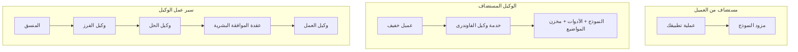
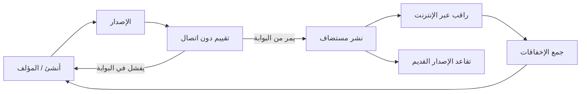
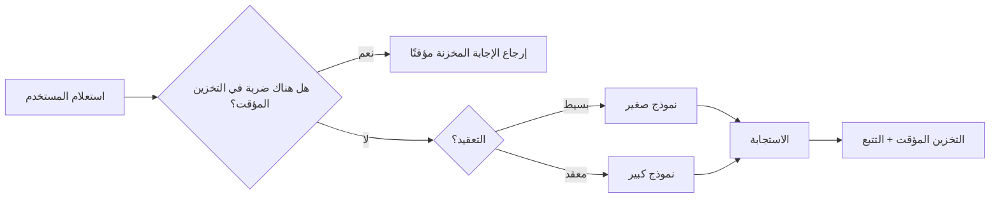
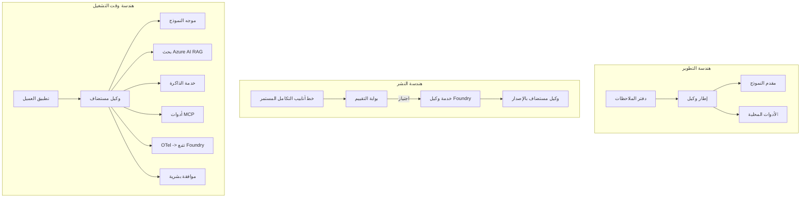

# نشر وكلاء قابلين للتوسع باستخدام Microsoft Foundry


حتى هذه النقطة في الدورة، كنت قد بنيت وكلاء يعملون على جهازك المحمول، داخل دفتر ملاحظات، مدفوعين بواسطة `az login` وقليل من متغيرات البيئة. هذه هي الطريقة الصحيحة للتعلم بالضبط. لكنها ليست الطريقة الصحيحة لتشغيل وكيل يعتمد عليه آلاف العملاء في الساعة 3 صباحًا.

هذا الدرس يدور حول الفجوة بين "يعمل على جهازي" و "يعمل بشكل موثوق وميسور التكلفة في الإنتاج." نحن نغلق تلك الفجوة باستخدام **Microsoft Foundry** و **خدمة وكلاء Microsoft Foundry**، ونقوم بذلك من خلال بناء وكيل دعم عملاء حقيقي يحتوي على أدوات، واسترجاع، وذاكرة، وتقييم، ومراقبة.

## المقدمة

سيغطي هذا الدرس:

- الفرق بين **وكيل نموذجي أولي** و **وكيل منشور**، ولماذا الانتقال يتعلق في الغالب بكل شيء *حول* النموذج.
- **أنماط النشر** للوكلاء: استضافة العميل، استضافة الخدمة (الوكلاء المستضافون)، وتنظيم سير العمل.
- **دورة حياة الوكيل** على Microsoft Foundry — الإنشاء، الإصدار، النشر، التقييم، المراقبة، الإيقاف.
- **استراتيجيات التوسع**: توجيه النموذج، التخزين المؤقت، التزامن، والتصميم بدون حالة.
- **الرصد** باستخدام OpenTelemetry وتتبّع Foundry.
- **تحسين التكلفة** من خلال اختيار النموذج، التوجيه، وبوابات التقييم.
- **اعتبارات المؤسسات**: الحوكمة، الموافقة البشرية، وتشغيل خوادم MCP بأمان في الإنتاج.

## أهداف التعلم

بعد إكمال هذا الدرس، ستعرف كيفية:

- اختيار نمط النشر المناسب لحِمل عمل الوكيل المعطى.
- نشر وكيل إلى خدمة وكلاء Microsoft Foundry ليكون مُصدَرًا، ومحكومًا، وقابلًا للمراقبة.
- تجهيز وكيل للتتبع وربط خط تقييم يعمل قبل كل إصدار.
- تطبيق التوجيه والتخزين المؤقت للنموذج للحفاظ على الكمون والتكلفة تحت السيطرة على نطاق واسع.
- إضافة بوابة موافقة بشرية للإجراءات عالية المخاطر ودمج خادم MCP بطريقة آمنة للإنتاج.

## المتطلبات الأساسية

يفترض هذا الدرس أنك أكملت الدروس السابقة وتشعر بالراحة مع:

- بناء وكلاء باستخدام [إطار عمل وكلاء مايكروسوفت](../14-microsoft-agent-framework/README.md) (الدرس 14).
- [استخدام الأدوات](../04-tool-use/README.md) (الدرس 4) و [RAG الوكالي](../05-agentic-rag/README.md) (الدرس 5).
- [ذاكرة الوكيل](../13-agent-memory/README.md) (الدرس 13) و [بروتوكولات الوكيل / MCP](../11-agentic-protocols/README.md) (الدرس 11).
- [الرصد والتقييم](../10-ai-agents-production/README.md) (الدرس 10) — هذا الدرس يبني عليها مباشرة.

ستحتاج أيضًا إلى:

- **اشتراك Azure** و **مشروع Microsoft Foundry** يحتوي على نموذج دردشة واحد منشور على الأقل.
- واجهة سطر الأوامر لـ **Azure CLI** مصدقة (`az login`).
- Python 3.12+ والحزم في مستودع [`requirements.txt`](../../../requirements.txt).

## من النموذج الأولي إلى الإنتاج: ما يتغير فعليًا

وكيل النموذج الأولي ووكيل الإنتاج يشتركان في الحلقة الأساسية نفسها — التفكير، استدعاء الأدوات، الرد. ما يتغير هو كل شيء ملفوف حول تلك الحلقة. النموذج قد يمثل 20% فقط من وكيل الإنتاج؛ والباقي 80% هو الهيكل التشغيلي.

| الشغل | النموذج الأولي | الإنتاج |
| --- | --- | --- |
| **الاستضافة** | يعمل داخل دفتر ملاحظاتك | يعمل كخدمة مستضافة، مُصدَرة ويتم طرحها |
| **الهوية** | رمز تسجيل دخول `az login` الخاص بك | هوية مُدارة مع صلاحيات RBAC محددة |
| **الحالة** | في الذاكرة، تفقد عند إعادة التشغيل | متخزنة خارجيًا (مخزن ثريد، خدمة ذاكرة) |
| **الفشل** | ترى أثر الخطأ | إعادة المحاولة، التراجع، صندوق الرسائل التالف، التنبيهات |
| **التكلفة** | "إنها بضعة سنتات" | تُتبع لكل طلب، موجهة، مخزنة مؤقتًا، وميزانية |
| **الجودة** | تفحص الإخراج بعينيك | تقيم تلقائيًا قبل كل إصدار |
| **الثقة** | توافق على كل إجراء | سياسة + تدخل بشري للإجراءات الخطرة |

احتفظ بهذا الجدول في ذهنك. كل قسم أدناه يرتبط بأحد هذه الصفوف.

## أنماط نشر الوكلاء

هناك ثلاث أنماط ستستخدمها، غالبًا معًا.

### 1. وكلاء مستضافون على العميل

كائن الوكيل يعيش داخل *عملية التطبيق* الخاصة بك. يتصل كودك بمزود النموذج مباشرة؛ حلقة التفكير تعمل في خدمتك. هذا ما فعله كل درس سابق.

- **استخدمه عندما** تحتاج إلى تحكم كامل في الحلقة، أو برامج وسيطة مخصصة، أو عندما تقوم بدمج الوكيل داخل نظم خلفية موجودة.
- **المقابل**: أنت تتحكم في التوسع، الحالة، والمرونة بنفسك.

### 2. وكلاء مستضافون (خدمة وكلاء Foundry)

الوكيل *مسجل كمورد* في Microsoft Foundry. تستضيف Foundry حلقة التفكير، تخزن الثريدات، تفرض سلامة المحتوى وRBAC، وتجعل الوكيل مرئيًا في بوابة Foundry. يصبح تطبيقك عميلًا خفيفًا ينشئ الثريدات ويقرأ الردود.

- **استخدمه عندما** تريد الديمومة، الرصد المدمج، الحوكمة، وتقليل مساحة العمليات التشغيلية.
- **المقابل**: تحكم أقل على مستوى منخفض مقابل بيئة تشغيل مُدارة.

### 3. سير عمل الوكيل

يتم تجميع عدة وكلاء (وأدوات) في رسم بياني مع تدفق تحكم صريح — خطوات متسلسلة، تشعب، عقد موافقة بشرية، ونقاط تحقق دائمة يمكنها الإيقاف والاستئناف. هذه هي قدرة **سير العمل** في إطار وكلاء Microsoft Applied على نطاق النشر.

- **استخدمه عندما** تمتد مهمة واحدة عبر عدة وكلاء متخصصين أو تتطلب خطوة موافقة في المنتصف.
- **المقابل**: أجزاء متحركة أكثر؛ يحتاج إلى رصد على مستوى التنظيم.



## دورة حياة الوكيل على Microsoft Foundry

نشر وكيل ليس مجرد دفعة `push` مرة واحدة. إنه حلقة، ويشبه كثيرًا دورة إطلاق البرمجيات لأن هذا بالضبط ما هو عليه.



الفكرة الأساسية، المستمدة من [الدرس 10](../10-ai-agents-production/README.md): **التقييم غير المتصل هو بوابة، وليس فكرة لاحقة.** لا يتم شحن نسخة جديدة من الوكيل إلا إذا تجاوزت عتبات التقييم الخاصة بك. ثم تغذي الرصد عبر الإنترنت إخفاقات العالم الحقيقي إلى مجموعة الاختبار غير المتصل الخاصة بك. هذه هي الحلقة بأكملها.

## استراتيجيات التوسع

توسيع وكيل يختلف عن توسيع API ويب بدون حالة، لأن كل طلب يمكن أن يحفز عدة مكالمات للنموذج والأدوات مكلفة. هناك أربع تقنيات تحمل معظم الحمل.

**معالجة الطلب بدون حالة.** لا تحتفظ بأي حالة مستخدم محددة في ذاكرة العملية. احتفظ بخيوط المحادثة في مخزن خيوط Foundry أو خدمة ذاكرة حتى يتمكن أي مثيل من التعامل مع أي طلب. هذا ما يسمح لك بالتوسيع أفقيًا — أضف مثيلات، بدون جلسات ثابتة.

**توجيه النموذج.** ليس كل طلب يحتاج إلى أفضل نموذج لديك (والأكثر تكلفة). وجه الطلبات البسيطة — تصنيف النية، إجابات حقائقية قصيرة — إلى نموذج صغير وسريع، واحتفظ بالنموذج الكبير للتفكير الحقيقي. يمكن لـ **موجه النموذج** في Foundry أن يفعل ذلك نيابة عنك، أو يمكنك تنفيذ مصنف خفيف بنفسك. ستبني النسخة بنفسك في المختبر.

**تخزين الردود مؤقتًا.** العديد من استفسارات الدعم متكررة ("كيف أعيد تعيين كلمة المرور؟"). خزّن إجابات الأسئلة الشائعة وقدمها دون استدعاء النموذج إطلاقًا. حتى معدل إصابة تخزين مؤقت متوسط يقطع التكلفة والكمون بشكل ملحوظ.

**التزامن والضغط العكسي.** مزودو النموذج لديهم حدود على معدل الطلبات. حدد تزامنك، استخدم محاولات الإعادة مع تأخير متزايد تدريجيًا، وفشل بأناقة (رد "نعمل عليه" في الطابور أفضل من خطأ 500).



## الرصد في الإنتاج

لا يمكنك تشغيل ما لا يمكنك رؤيته. كما غطينا في الدرس 10، يصدِر إطار وكلاء Microsoft **OpenTelemetry** تتبعات بشكل أصلي — كل استدعاء نموذج، تشغيل أداة، وخطوة تنظيم تصبح مدى زمني. في الإنتاج، تصدر تلك المدى الزمنية إلى Microsoft Foundry (أو أي خلفية متوافقة مع OTel) بحيث يمكنك:

- تتبع شكوى عميل واحدة من البداية إلى النهاية عبر كل استدعاء نموذج وأداة.
- مراقبة الكمون والتكلفة لكل طلب بمرور الوقت بمقاييس p50/p95.
- التنبيه على نقاط ارتفاع معدل الأخطاء والشذوذ في التكلفة قبل أن يلاحظها المستخدمون (أو فريق المالية).

```python
from agent_framework.observability import get_tracer

tracer = get_tracer()

with tracer.start_as_current_span("support_request") as span:
    span.set_attribute("customer.tier", "enterprise")
    span.set_attribute("routed.model", "gpt-5-nano")
    # يتم تتبع تنفيذ العميل تلقائيًا داخل هذا النطاق
```

السمات مثل `customer.tier` و `routed.model` هي ما يحول جدار التتبعات إلى أسئلة يمكن الإجابة عليها ("هل يتوجه العملاء المؤسسيون إلى النموذج الصغير كثيرًا؟").

## تحسين التكلفة

تهيمن التوكنات على التكلفة في وكلاء الإنتاج. ثلاث رافعات، حسب التأثير:

1. **اختيار حجم النموذج المناسب.** نموذج صغير يتجاوز بوابة التقييم الخاصة بك هو دائمًا أرخص من نموذج كبير يمر أيضاً. استخدم التقييم لإثبات أن النموذج الصغير جيد بما يكفي بدلاً من الاعتماد افتراضياً على الأكبر بدافع الحذر.
2. **التوجيه حسب التعقيد.** كما في الأعلى — ادفع سعر النموذج الكبير فقط للطلبات التي تحتاج إلى تفكير نموذج كبير.
3. **التخزين المؤقت بكثافة.** أرخص مكالمة نموذج هي التي لا تجريها أبدًا.

بوابات التقييم والتحكم في التكلفة هما نفس الانضباط من زاويتين: التقييم يخبرك بـ *أدنى جودة*، والتوجيه والتخزين المؤقت يبقيان التكلفة قريبة من *أدنى مستوى*.

## اعتبارات نشر المؤسسات

**الحوكمة.** وكلاء الاستضافة يرثون RBAC وسلامة المحتوى وتسجيل التدقيق من Foundry. امنح كل وكيل هوية مُدارة بأقل صلاحيات يحتاجها — وصول للقراءة فقط إلى قاعدة المعرفة، وصول مقيد إلى API التذاكر، ولا شيء أكثر.

**المراجعة البشرية.** بعض الإجراءات ذات عواقب كبيرة جدًا لتتم أتمتتها بالكامل — صرف استرداد، حذف حساب، التصعيد إلى فريق قانوني. يدعم إطار وكلاء Microsoft أدوات **تتطلب موافقة**: يقترح الوكيل الإجراء، يتوقف التنفيذ، يوافق إنسان أو يرفض، ثم يستأنف سير العمل. رأيت هذا الحَجر الأساسي في [الدرس 6](../06-building-trustworthy-agents/README.md)؛ هنا تقوم بنشره.

**MCP في الإنتاج.** [MCP](../11-agentic-protocols/README.md) يسمح لوكيلك باستخدام أدوات خارجية من خلال واجهة قياسية. في الإنتاج، عامل كل خادم MCP كحدود غير موثوق بها: ثبت نسخة الخادم، شغله بهوية محددة، تحقق من مخرجاته، ولا تعرض له الأسرار أبدًا. خادم MCP هو اعتماد، والاعتماديات تُصقل، تُراجَع، وتُقيَّد من حيث المعدل.



تلك المخططات الثلاثة — التطوير، النشر، وقت التشغيل — هي نفس الوكيل في ثلاث مراحل من حياته. المختبر الذي يلي يرشدك خلال بناءه.

## مختبر عملي: وكيل دعم عملاء جاهز للإنتاج

افتح [`code_samples/16-python-agent-framework.ipynb`](./code_samples/16-python-agent-framework.ipynb) واعمل من البداية للنهاية. ستجمع **وكيل دعم عملاء Contoso** مع كل اهتمامات الإنتاج مشبوكة:

1. **استدعاء الأدوات** — تحقق من حالة الطلب وافتح تذاكر دعم.
2. **RAG** — أجب عن أسئلة السياسات من قاعدة معرفة (بحوث Azure AI، مع دعم ذاكرة مؤقتة حتى يعمل دفتر الملاحظات بدون مورد بحث).
3. **الذاكرة** — تذكر العميل عبر دوران المحادثة.
4. **توجيه النموذج** — يصنف التعقيد موجهًا كل طلب إلى نموذج صغير أو كبير.
5. **التخزين المؤقت للردود** — تُخدم الأسئلة المتكررة من المخزن المؤقت.
6. **الموافقة البشرية** — توقف الاستردادات فوق حد معين للموافقة البشرية.
7. **خط تقييم** — مجموعة اختبار صغيرة غير متصلة تقيم الوكيل وتعمل كبوابة إصدار.
8. **الرصد** — تتبع OpenTelemetry حول كل طلب.

### الاستعراض

يُنظم دفتر الملاحظات بحيث يكون كل جانب من جوانب الإنتاج قسمًا مستقلاً وقابلًا للتشغيل. القلب منه هو معالج الطلبات مع التوجيه والتخزين المؤقت:

```python
async def handle_support_request(query: str, customer_id: str) -> str:
    # ١. قدّم من الذاكرة المؤقتة عندما نستطيع.
    cached = response_cache.get(normalize(query))
    if cached:
        return cached

    # ٢. قم بالتوجيه حسب التعقيد للسيطرة على التكلفة.
    model = "gpt-5-nano" if is_simple(query) else "gpt-5-mini"

    # ٣. شغّل الوكيل داخل فترة تعقب للمراقبة.
    with tracer.start_as_current_span("support_request") as span:
        span.set_attribute("routed.model", model)
        span.set_attribute("customer.id", customer_id)
        response = await support_agent.run(query, model=model)

    # ٤. خزّن وأعد.
    response_cache.set(normalize(query), response.text)
    return response.text
```

بوابة التقييم التي تحرس إصدارًا تبدو هكذا:

```python
async def evaluation_gate(agent, test_cases, threshold: float = 0.8) -> bool:
    passed = 0
    for case in test_cases:
        result = await agent.run(case["input"])
        if score_response(result.text, case["expected"]) >= 0.8:
            passed += 1
    pass_rate = passed / len(test_cases)
    print(f"Evaluation pass rate: {pass_rate:.0%} (gate: {threshold:.0%})")
    return pass_rate >= threshold  # قم بالنشر فقط إذا نجح البوابة
```

اقرأ كل سطر — يحتفظ الدفتر بالباديّات صغيرة عمدًا بحيث لا يُخفى شيء خلف استدعاء إطار عمل.

## التحقق من وكيل منشور باختبارات التدخين

بوابة التقييم أعلاه تعمل *غير متصل* ضد كائن الوكيل الخاص بك. بمجرد نشر الوكيل كوكلاء مستضاف، تحتاج إلى فحص آخر، أرخص حتى: **هل نقطة النهاية المنشورة ترد فعلاً؟**

النشر "ناجحًا" يثبت فقط أن لوحة التحكم قبلت التعريف — لا يثبت أن الوكيل يرد. اعتماد مفقود، توجيه نموذج خاطئ، أو اتصال منتهي قد يترك نشرًا أخضر لا يرجع شيئًا. اختبار **التدخين** يلتقط هذا في ثوانٍ، عند كل نشر، بدون تكلفة تقييم كامل.

هذا المستودع يقدم خط أنابيب اختبار تدخين جاهز للاستخدام مبني على إجراء GitHub [AI Smoke Test](https://github.com/marketplace/actions/ai-smoke-test):

- **الكتالوج** — [`tests/lesson-16-smoke-tests.json`](../../../tests/lesson-16-smoke-tests.json) يحتوي على مطالبات وادعاءات لوكيل دعم Contoso (إجابات سياسة مستقرة، بحث الطلب، البقاء على الموضوع، واستمرارية خيوط متعددة الأدوار). كتالوجات لوكلاء دروس أخرى تعيش بجانبه — انظر [`tests/README.md`](../tests/README.md).
- **سير العمل** — [`.github/workflows/smoke-test.yml`](../../../.github/workflows/smoke-test.yml) يقوم بتسجيل الدخول باستخدام Azure OIDC ويرسل كل مطلب إلى نقطة استجابات الوكيل، ويفشل المهمة عند أي خطأ في الادعاءات.

```yaml
- name: Smoke-test hosted agent
  uses: JFolberth/ai-smoketest@v1
  with:
    project_endpoint: ${{ inputs.project_endpoint }}
    agent_name: ContosoSupportAgent
    tests_file: tests/lesson-16-smoke-tests.json
```


قم بتشغيله من علامة التبويب **الإجراءات** بمجرد نشر العميل الخاص بك، مع تقديم نقطة نهاية مشروع Foundry واسم العميل الخاص بك. تحتاج الهوية الموحدة إلى دور **مستخدم Azure AI** في نطاق مشروع Foundry. فكّر في الطبقات مثل هرم: اختبارات الدخان (هل هو يمكن الوصول إليه ويرد؟) تُجرى عند كل نشر، التقييم غير المتصل (هل هو جيد بما يكفي للإطلاق؟) يُجرى قبل الترقيّة، والتقييم المتصل (كيف هو أداؤه في الواقع؟) يُجرى بشكل مستمر.

## اختبار المعرفة

اختبر فهمك قبل الانتقال إلى المهمة.

**1. تقريبًا ما هي نسبة "النموذج" في عميل الإنتاج، وما هو الباقي؟**

<details>
<summary>الإجابة</summary>

النموذج هو أقلية في النظام — غالبًا ما يُذكر بأنه حوالي 20٪. الباقي هو الهيكل التشغيلي: الاستضافة وإدارة الإصدارات، الهوية وإدارة الوصول بناءً على الأدوار، الحالة الخارجية، التعامل مع الأخطاء، تتبع التكاليف، التقييم، وضوابط التدخل البشري. الانتقال إلى الإنتاج يتعلق في الغالب ببناء كل شيء *حول* حلقة الاستدلال.
</details>

**2. متى تختار عميل مستضاف بدلاً من عميل مستضاف على جهاز المستخدم؟**

<details>
<summary>الإجابة</summary>

عندما ترغب في بيئة تشغيل مُدارة مع متانة مدمجة (خيوط تستمر ويمكن استئنافها)، قابلية المراقبة، أمان المحتوى، وإدارة الوصول بناءً على الأدوار، وأنت مستعد للتنازل عن بعض التحكم على مستوى منخفض في حلقة الاستدلال مقابل تقليل مساحة العمليات التشغيلية. يفضل العميل المستضاف على جهاز المستخدم عندما تحتاج إلى تحكم كامل في الحلقة أو عند دمج العميل في نظام خلفي موجود.
</details>

**3. لماذا يجب أن يكون العميل القابل للتوسع بدون حالة (stateless) في ذاكرة العملية الخاصة به؟**

<details>
<summary>الإجابة</summary>

لكي يتمكن أي مثيل من التعامل مع أي طلب، وهذا ما يسمح بالتوسع الأفقي بدون جلسات ثابتة. حالة المحادثة لكل مستخدم تُخزن خارجيًا في مخزن خيوط أو خدمة ذاكرة. إذا كانت الحالة تعيش في ذاكرة العملية، فسوف تفقدها عند إعادة التشغيل ولا تستطيع توزيع الحمل بحرية.
</details>

**4. ما المشكلة التي يحلها توجيه النموذج، وكيف يرتبط بالتقييم؟**

<details>
<summary>الإجابة</summary>

التوجيه يرسل الطلبات البسيطة إلى نموذج صغير ورخيص وسريع ويخصص النموذج الكبير للاستدلال الحقيقي، مما يتحكم في كل من الكمون والتكلفة. يرتبط بالتقييم لأن التقييم هو ما *يثبت* أن النموذج الصغير جيد بما يكفي لفئة من الطلبات — التوجيه بدون تقييم هو مجرد تخمين.
</details>

**5. ما هو "بوابة التقييم" وأين تقع في دورة الحياة؟**

<details>
<summary>الإجابة</summary>

بوابة التقييم تُجري مجموعة اختبارات غير متصلة ضد نسخة جديدة من العميل وتمنع النشر ما لم تتجاوز نسبة النجاح عتبة معينة. تقع بين "الإصدار" و"النشر" في دورة الحياة، مما يجعل الجودة شرطًا مسبقًا للإصدار بدلاً من شيء تتحقق منه بعد الإطلاق.
</details>

**6. لماذا يجب معاملة خادم MCP كحدود غير موثوق بها في الإنتاج؟**

<details>
<summary>الإجابة</summary>

لأنه اعتماد خارجي يتصل به عميلك. يجب تحديد نسخته، تشغيله بهوية محدودة النطاق، التحقق من مخرجاته، تحديد معدلات استخدامه، وعدم كشف أسرار له — نفس الانضباط الذي تطبقه على أي اعتماد طرف ثالث. مخرجاته تتدفق إلى استدلال العميل، لذا الثقة غير المُتحقق منها تشكل خطرًا أمنيًا.
</details>

**7. ما التغيير الفردي الذي عادةً ما يكون له أكبر تأثير على تكلفة عميل الإنتاج، ولماذا؟**

<details>
<summary>الإجابة</summary>

اختيار الحجم المناسب للنموذج — استخدام أصغر نموذج ما زال يجتاز بوابة التقييم الخاصة بك. التكلفة يهيمن عليها عدد الرموز، والنموذج الأصغر الذي يفي بمعيار الجودة هو دائمًا أرخص تقريبًا من النموذج الأكبر. بعد ذلك، التخزين المؤقت والتوجيه يقللان التكلفة أكثر، لكن اختيار النموذج الأساسي المناسب له الأثر الأكبر الأولي.
</details>

**8. ما الدور الذي تلعبه خصائص السبانات مثل `customer.tier` و `routed.model` في القابلية للملاحظة؟**

<details>
<summary>الإجابة</summary>

تحول التتبعات الخام إلى أسئلة أعمال يمكن الإجابة عليها. بدون الخصائص لديك جدار من السبانات؛ معها يمكنك أن تسأل "هل يتم توجيه العملاء من الشركات إلى النموذج الصغير كثيرًا جدًا؟" أو "أي نموذج يتعامل مع أبطأ الطلبات لدينا؟" الخصائص هي الطريقة التي تقسم بها بيانات القياس حسب الأبعاد التي تهم تشغيلك.
</details>

## المهمة

خذ عميل دعم العملاء من المختبر وقوِّه لسيناريو معين: **عميل دعم فوترة اشتراك لشركة SaaS.**

يجب أن يتضمن تقديمك:

1. **استبدال الأدوات** بأدوات ذات صلة بالفوترة: `get_subscription_status`، `get_invoice`، و `issue_credit` (الاعتمادات التي تزيد عن 50 دولارًا تتطلب موافقة بشرية).
2. **إضافة ثلاثة مستندات RAG** تغطي سياسة استرداد الشركة، دورة الفوترة، وسياسة الإلغاء.
3. **توسيع مجموعة التقييم** إلى ثماني حالات على الأقل، تشمل حالتين على الأقل *يجب* أن تفعل مسار الموافقة البشرية، وتأكيد أن بوابة التقييم تعمل بشكل صحيح بالنجاح أو الفشل.
4. **إضافة تقرير تكلفة واحد**: بعد تشغيل عشرة طلبات مختلطة عبر العميل، اطبع عدد الطلبات التي ذهبت إلى النموذج الصغير، عدد التي ذهبت إلى النموذج الكبير، وعدد الطلبات التي تمت خدمتها من التخزين المؤقت.

اكتب فقرة قصيرة (في خلية ماركدون) تشرح قاعدة توجيه النماذج التي اخترتها وكيف ستتحقق من صحتها باستخدام حركة المرور الحقيقية. ليست هناك إجابة صحيحة واحدة — سيتم تقييمك على مدى ترابط الاعتبارات الإنتاجية بطريقة متماسكة.

## الملخص

في هذا الدرس انتقلت بعميل من النموذج الأولي إلى الإنتاج باستخدام Microsoft Foundry:

- الانتقال إلى الإنتاج يتعلق في الغالب بـ **الهيكل التشغيلي** حول النموذج — الاستضافة، الهوية، الحالة، التعامل مع الأخطاء، التكلفة، الجودة، والثقة.
- تعلمت ثلاثة **أنماط النشر** — العميل المستضاف على الجهاز، العملاء المستضافون، وتدفقات عمل العميل — ومتى يناسب كل منها.
- استعرضت **دورة حياة العميل**، حيث يعمل التقييم غير المتصل كـ **بوابة للإصدار** وقابلية المراقبة المتصلة تعيد الأخطاء إلى مجموعة الاختبار.
- طبقت **استراتيجيات التوسع** — التصميم بلا حالة، توجيه النموذج، التخزين المؤقت، والتزامن المحدود — وربطتها بـ **تحسين التكلفة**.
- أدخلت **مراقبة المؤسسات**: إدارة الوصول بناءً على الأدوار، الموافقة البشرية داخل الحلقة، والتكامل الآمن مع MCP للإنتاج.
- بنيت **عميل دعم عملاء جاهز للإنتاج** يربط كل هذه الاعتبارات معًا في شفرة قابلة للتشغيل.

الدرس التالي يأخذك في الرحلة المعاكسة: بدلاً من توسيع العملاء إلى السحابة، ستقوم بخفضهم *لجهاز مطور واحد* وتشغيلهم محليًا بالكامل.

## موارد إضافية

- <a href="https://learn.microsoft.com/azure/ai-foundry/what-is-azure-ai-foundry" target="_blank">توثيق Microsoft Foundry</a>
- <a href="https://learn.microsoft.com/azure/ai-foundry/agents/overview" target="_blank">نظرة عامة على خدمة عملاء Microsoft Foundry</a>
- <a href="https://learn.microsoft.com/en-us/agent-framework/overview/?wt.mc_id=youtube_26688_organicsocial_reactor&pivots=programming-language-python" target="_blank">إطار عمل عملاء Microsoft</a>
- <a href="https://learn.microsoft.com/azure/ai-foundry/concepts/model-router" target="_blank">موجه النموذج في Microsoft Foundry</a>
- <a href="https://learn.microsoft.com/azure/search/search-what-is-azure-search" target="_blank">Azure AI Search</a>
- <a href="https://opentelemetry.io/" target="_blank">OpenTelemetry</a>
- <a href="https://github.com/marketplace/actions/ai-smoke-test" target="_blank">إجراء اختبار دخان AI على GitHub</a>
- <a href="https://modelcontextprotocol.io/" target="_blank">بروتوكول سياق النموذج (MCP)</a>

## الدرس السابق

[بناء عملاء استخدام الحاسوب (CUA)](../15-browser-use/README.md)

## الدرس التالي

[إنشاء عملاء AI محليين](../17-creating-local-ai-agents/README.md)

---

<!-- CO-OP TRANSLATOR DISCLAIMER START -->
**تنويه**:
تمت ترجمة هذا المستند باستخدام خدمة الترجمة بالذكاء الاصطناعي [Co-op Translator](https://github.com/Azure/co-op-translator). بينما نسعى للدقة، يرجى العلم أن الترجمات الآلية قد تحتوي على أخطاء أو عدم دقة. يجب اعتبار المستند الأصلي بلغته الأصلية المصدر الرسمي والمعتمد. للمعلومات الهامة، يُنصح بالاستعانة بترجمة بشرية محترفة. نحن غير مسؤولين عن أي سوء فهم أو تفسير ناتج عن استخدام هذه الترجمة.
<!-- CO-OP TRANSLATOR DISCLAIMER END -->