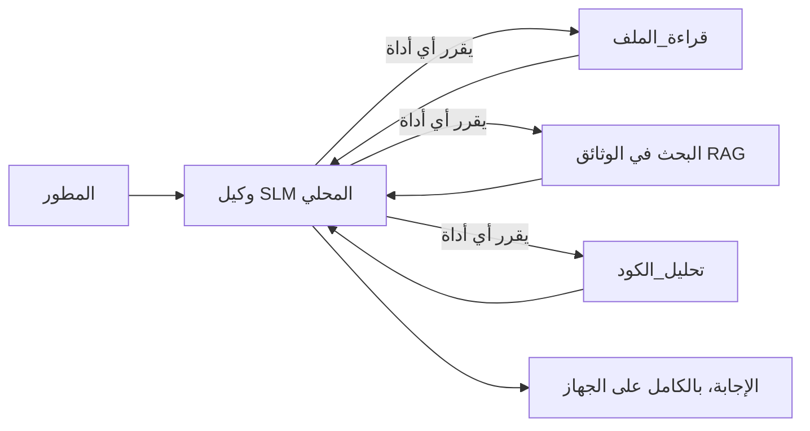
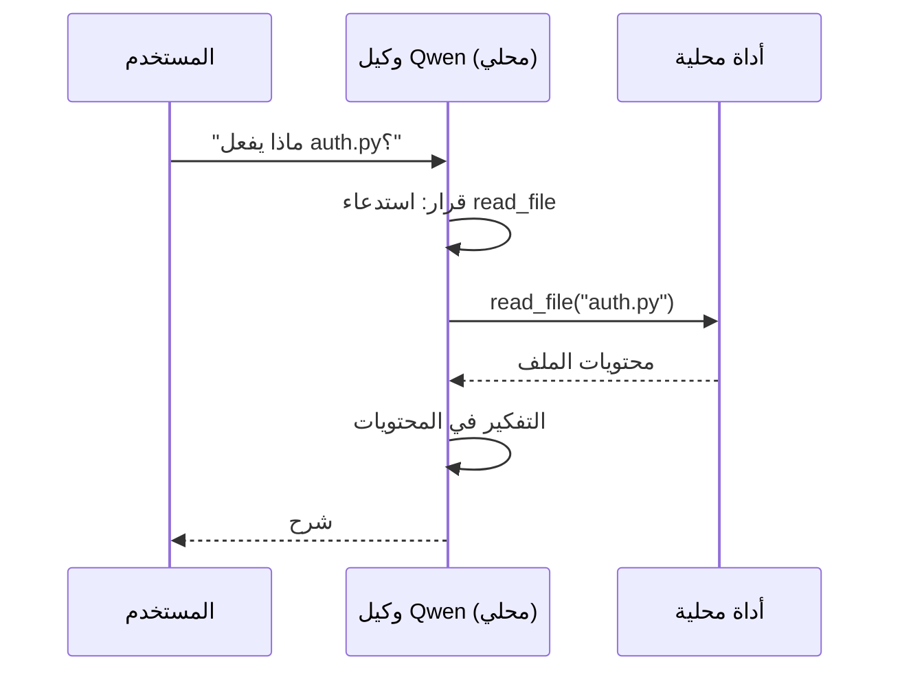
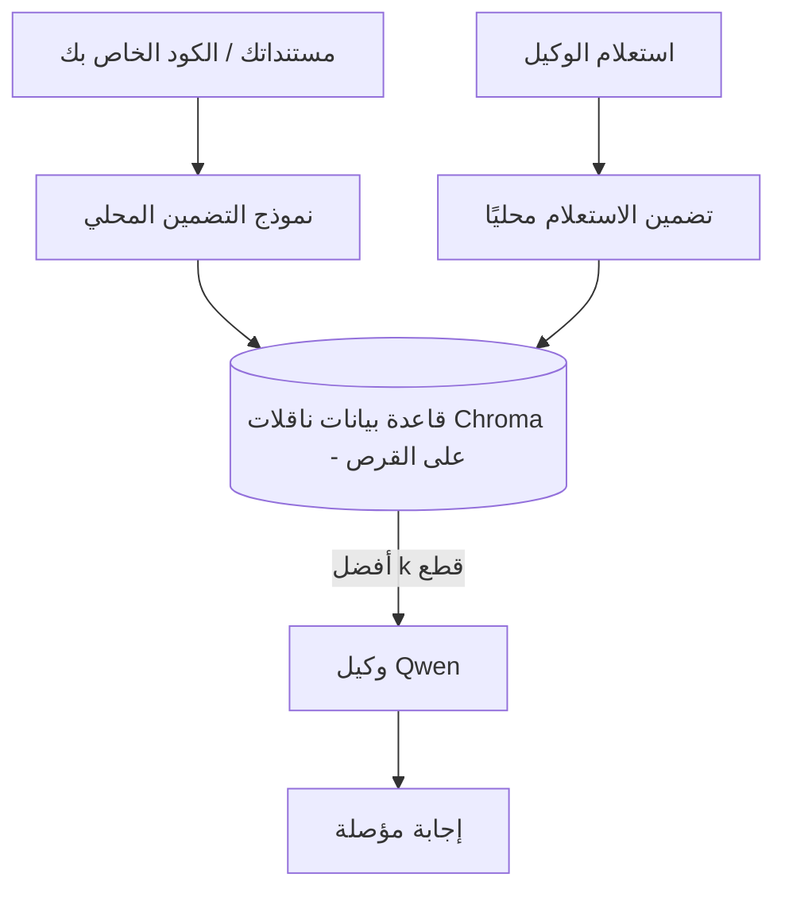
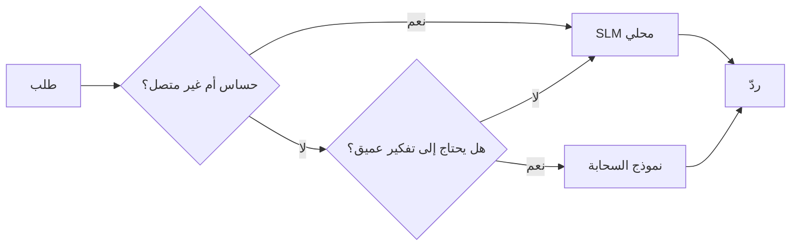

# إنشاء وكلاء ذكاء اصطناعي محليين باستخدام Microsoft Foundry Local و Qwen


الدرس السابق قام بتوسيع الوكلاء *للعمل* في السحابة. هذا الدرس ينقلهم *إلى الأسفل* إلى جهاز واحد فقط. في النهاية سيكون لديك مساعد هندسي يعمل يفكر، يستدعي الأدوات، يقرأ ملفاتك، ويبحث في وثائقك — **بدون أي استدعاء استنتاج من السحابة.**

لماذا قد ترغب في ذلك؟ هناك ثلاثة أسباب تتكرر باستمرار في العمل الهندسي الحقيقي:

- **الخصوصية.** الشفرة والوثائق لا تترك الجهاز أبدًا. لا يُرسل أي تلميح، أو مقتطف، أو بيانات العملاء عبر حدود الشبكة.
- **التكلفة.** الاستنتاج المحلي لا يحمل تكلفة استنادًا لكل رمز. يمكنك التكرار طوال اليوم بسعر الكهرباء فقط.
- **دون اتصال.** على متن طائرة، في منشأة آمنة، أو أثناء انقطاع الخدمة، الوكيل لا يزال يعمل.

المشكلة هي أنك تتبادل نموذج سحابي متقدم مقابل **نموذج لغة صغير (SLM)** يعمل على وحدة المعالجة المركزية، أو وحدة معالجة الرسومات، أو وحدة المعالجة العصبية الخاصة بك. هذا الدرس يتعلق ببناء وكلاء يكونون *جيدين* ضمن هذا القيد بدلاً من التظاهر بعدم وجود القيد.

## مقدمة

هذا الدرس سيغطي:

- **نماذج اللغة الصغيرة (SLMs)** — ما هي، أين تتألق، وأين لا تتألق.
- **Microsoft Foundry Local** — بيئة تشغيل تحمل النماذج وتقدمها على الجهاز من خلال **واجهة برمجة تطبيقات متوافقة مع OpenAI**.
- **نماذج استدعاء الوظائف Qwen** — نماذج SLM تنتج باستمرار استدعاءات أدوات موثوقة، وهو ما يجعل الوكلاء المحليين (وليس مجرد دردشة محلية) ممكنين.
- **الأدوات المحلية، البحث المستند إلى المحتوى (RAG) المحلي، و MCP المحلي** — لمنح الوكيل القدرات بدون السحابة.
- **الأنماط الهجينة** — متى تبقى الأمور محلية ومتى تصل للسحابة.

## أهداف التعلم

بعد إكمال هذا الدرس، ستعرف كيف:

- تشرح المزايا والعيوب لنماذج اللغة الصغيرة وتختار حالات الاستخدام المناسبة للوكلاء المحليين.
- خدمت موديل Qwen محليًا باستخدام Foundry Local والاتصال به من خلال نقطة نهاية متوافقة مع OpenAI.
- بناء وكيل يستدعي الأدوات يعمل بالكامل على محطة العمل الخاصة بك.
- إضافة تقنية البحث المستند إلى المحتوى المحلي (RAG) على ملفاتك باستخدام قاعدة بيانات متجهات محلية (Chroma).
- ربط الوكيل بخادم MCP محلي والتفكير في تصاميم هجينة محلية/سحابية.

## المتطلبات السابقة

هذا الدرس يفترض أنك أنجزت الدروس السابقة وترتاح في:

- [استخدام الأدوات](../04-tool-use/README.md) (الدرس 4) و [Agentic RAG](../05-agentic-rag/README.md) (الدرس 5).
- [بروتوكولات الوكيل / MCP](../11-agentic-protocols/README.md) (الدرس 11).
- [إطار عمل الوكيل من مايكروسوفت](../14-microsoft-agent-framework/README.md) (الدرس 14).

ستحتاج أيضًا إلى:

- محطة عمل مطور. **8 جيجابايت من الذاكرة العشوائية هو الحد الأدنى الواقعي**؛ 16 جيجابايت أو أكثر مريح. وحدة معالجة رسوميات أو وحدة معالجة عصبية تساعد ولكنها غير مطلوبة.
- تثبيت **Microsoft Foundry Local** (انظر قسم الإعداد أدناه).
- بايثون 3.12+ والحزم الموجودة في المستودع [`requirements.txt`](../../../requirements.txt)، بالإضافة إلى `foundry-local-sdk`، و `openai`، و `chromadb` لهذا الدرس.

## نماذج اللغة الصغيرة: الأداة المناسبة للعمل المحلي

نموذج سحابي متقدم به مئات المليارات من المعاملات ومركز بيانات خلفه. نموذج اللغة الصغيرة لديه فقط بضعة مليارات من المعاملات ويجب أن يتناسب مع ذاكرة اللابتوب الخاص بك. هذا الاختلاف يحدد توقعات واضحة.

**نماذج اللغة الصغيرة جيدة في:**

- المهام المهيكلة والمحدودة — التصنيف، الاستخراج، التلخيص لمستند معروف.
- **استدعاء الأدوات** — تحديد الوظيفة التي يجب استدعاؤها وبأي معطيات.
- التكرار السريع، الرخيص، والخاص على بياناتك الخاصة.

**نماذج اللغة الصغيرة أضعف في:**

- الاستدلال المفتوح متعدد الخطوات عبر سياق كبير.
- المعرفة الواسعة بالعالم (لأنها رأت أقل وتنساها أسرع).

الاستراتيجية الرابحة للوكلاء المحليين هي: **دع النموذج الصغير يقوم بالتنسيق، ودع الأدوات تقوم بالعمل الشاق.** النموذج لا يحتاج لأن *يعرف* قاعدة الكود الخاصة بك — يحتاج فقط إلى معرفة متى يستدعي `read_file` و `search_docs`. هذا يلعب مباشرة إلى نقاط قوة النموذج الصغير.



## Microsoft Foundry Local

**Microsoft Foundry Local** هي بيئة تشغيل خفيفة الوزن تنزل، تدير، وتخدم النماذج بالكامل على جهازك. أهم ميزة لدينا هي توفيرها **نقطة نهاية HTTP متوافقة مع OpenAI** — مما يعني أن SDK الخاص بـ OpenAI وعميل OpenAI في إطار عمل الـ Microsoft Agent يعملان عبرها مع تغيير واحد فقط في `base_url`. كل شيء تعلمته عن بناء الوكلاء ينتقل مباشرة؛ فقط نقطة النهاية تنتقل من السحابة إلى `localhost`.

Foundry Local يختار أفضل إصدار للنموذج يناسب جهازك تلقائيًا — إصدار لوحدة المعالجة المركزية، أو إصدار لوحدة معالجة الرسومات CUDA/GPU، أو إصدار وحدة المعالجة العصبية NPU — بحيث لا تحتاج إلى تحسين يدوي لكل جهاز.

### الإعداد

قم بتثبيت Foundry Local (اطلع على الوثائق الخاصة بنظام التشغيل الخاص بك [هنا](https://learn.microsoft.com/azure/ai-foundry/foundry-local/))، ثم تأكد من أنه يعمل:

```bash
# تثبيت (مثال؛ اتبع الوثائق لمنصتك)
winget install Microsoft.FoundryLocal      # ويندوز
# brew install microsoft/foundrylocal/foundrylocal   # ماك أو إس

# قم بتنزيل نموذج Qwen وتشغيله، ثم ابدأ الخدمة المحلية
foundry model run qwen2.5-7b-instruct
foundry service status
```

بمجرد تشغيل الخدمة، سيكون لديك نقطة نهاية محلية متوافقة مع OpenAI (عادة `http://localhost:PORT/v1`). الدفتر يستخدم `foundry-local-sdk` لاكتشاف نقطة النهاية تلقائيًا، لذا لا تحتاج لكتابة رقم المنفذ صلب.

## استدعاء الوظائف Qwen: لماذا هو مهم

الوكيل هو وكيل فقط إذا كان يمكنه استدعاء الأدوات. الكثير من نماذج SLM يمكنها الدردشة لكنها تنتج استدعاءات أدوات غير موثوقة أو مشوهة. نماذج **Qwen** مدربة على استدعاء الوظائف وتصدر هياكل استدعاء الادوات المتناسقة باستمرار — وهذا بالضبط ما يحول نموذج الدردشة المحلي إلى *وكيل* محلي.

التدفق هو حلقة استدعاء الأدوات القياسية التي تعرفها بالفعل، فقط تعمل على الجهاز:



## البحث المستند إلى المحتوى المحلي (Local RAG)

البحث في الوثائق هو المكان الذي يكسب فيه الوكلاء المحليين قيمتهم. بدلاً من الأمل في أن النموذج الصغير قد حفظ مستندات الإطار الخاص بك، تقوم بتضمين تلك المستندات في **قاعدة بيانات متجهات محلية** وتسمح للوكيل باسترجاع الأجزاء ذات الصلة عند الطلب.

نستخدم **Chroma**، مخزن متجهات مضمّن يعمل في نفس العملية بدون خادم لإدارته. الخط الكامل محلي: نموذج التضمين المحلي → المتجهات المحلية → الاسترجاع المحلي → النموذج الصغير المحلي.



هذا هو نفس نمط Agentic RAG من الدرس 5 — التغيير الوحيد هو أن كل مكون يعمل على جهازك.

## خوادم MCP المحلية

[MCP](../11-agentic-protocols/README.md) هو بروتوكول نقل، وليس خدمة سحابية. يمكن تشغيل خادم MCP كعملية محلية على `stdio`، معرّضًا الأدوات للوكيل الخاص بك عبر البروتوكول القياسي. هذا يسمح لك بإعادة استخدام النظام البيئي المتنامي من خوادم MCP — وصول نظام الملفات، عمليات git، استعلامات قواعد البيانات — كل ذلك دون اتصال.

موقف الأمان مختلف عن السحابة، لكنه ليس غائبًا: خادم MCP المحلي لا يزال يعمل بأذونات المستخدم الخاص بك، لذا قم بتحديد نطاق ما يمكنه الوصول إليه (مثل مجلد مشروع، وليس كل مجلد المنزل) وتعامل مع مخرجاته كمدخلات تتحقق منها.

## أنماط هجينة للسحابة والمحلي

الأولوية للمحلي لا تعني فقط محلي. الأنظمة الناضجة توجه بناءً على الحساسية والصعوبة:

| الحالة | مكان التشغيل |
| --- | --- |
| كود/بيانات حساسة، أو بدون اتصال | **نموذج لغة صغير محلي** |
| مهمة بسيطة ومحدودة | **نموذج لغة صغير محلي** (رخيص وسريع) |
| استدلال معقد متعدد الخطوات على بيانات غير حساسة | **نموذج سحابي** |
| كل شيء، أثناء انقطاع الخدمة | **نموذج لغة صغير محلي** (تدرج تدهور انسيابي) |

هذا يعكس فكرة **توجيه النموذج** من الدرس 16 — مع اختلاف أن أحد "النماذج" الآن هو جهازك المحلي. تصميم قوي يعود للنموذج المحلي عندما تكون السحابة غير متاحة، لذلك يتدهور الوكيل في الجودة بدلاً من الفشل الكامل.



## مختبر عملي: مساعد هندسي محلي

افتح [`code_samples/17-local-agent-foundry-local.ipynb`](./code_samples/17-local-agent-foundry-local.ipynb) واعمل عليه. ستبني **مساعدًا هندسيًا محليًا** يعمل كليًا على محطة عملك ويمكنه:

1. **استدعاء الأدوات** — عبر استدعاء الوظائف Qwen من خلال Foundry Local.
2. **إجراء عمليات ملفات محلية** — سرد وقراءة الملفات في مجلد المشروع.
3. **تحليل الكود** — تقرير مقاييس أساسية على ملف المصدر.
4. **البحث في الوثائق** — بحث محلي RAG عبر مجلد الوثائق باستخدام Chroma.
5. **استخدام MCP** — الاتصال بخادم MCP محلي (مع تخطي راقٍ إذا لم يكن مُعدًا).

لا يتم استخدام استنتاج من السحابة في أي نقطة.

### شرح

يتصل المساعد بـ Foundry Local عبر نقطة نهاية متوافقة مع OpenAI، لذا يبدو رمز الوكيل شبه مطابق لدروس السحابة — يتغير فقط العميل:

```python
from foundry_local import FoundryLocalManager
from openai import OpenAI

# فاوندري لوكال يكتشف / ينزل النموذج ويعطينا نقطة نهاية محلية.
manager = FoundryLocalManager(\"qwen2.5-7b-instruct\")
client = OpenAI(base_url=manager.endpoint, api_key=manager.api_key)  # api_key هو عنصر نائب محلي
```

الأدوات هي دوال بايثون عادية محددة النطاق على مجلد المشروع:

```python
def read_file(path: str) -> str:
    \"\"\"Read a file, but only inside the sandboxed project directory.\"\"\"
    full = (PROJECT_ROOT / path).resolve()
    if PROJECT_ROOT not in full.parents and full != PROJECT_ROOT:
        return \"Access denied: path is outside the project directory.\"
    return full.read_text(encoding=\"utf-8\")
```

لاحظ فحص الحماية — حتى محليًا، الأداة التي تقرأ المسارات العشوائية تشكل مخاطرة. الدفتر يحافظ على كل أداة مقتصرة على جذر مشروع واحد.

## اختبار المعرفة

اختبر فهمك قبل الانتقال إلى المهمة.

**1. اذكر سببين ملموسين لتشغيل وكيل محلي بدلاً من تشغيله في السحابة.**

<details>
<summary>الإجابة</summary>

أي اثنين من: **الخصوصية** (الكود والبيانات لا تترك الجهاز)، **التكلفة** (لا توجد فاتورة استنتاج لكل رمز)، و**القدرة على العمل دون اتصال** (يعمل بدون شبكة — على متن طائرة، في منشأة آمنة، أو أثناء انقطاع الخدمة). القيود التنظيمية/الامتثالية التي تمنع إرسال البيانات خارج الجهاز هي سبب شائع للخصوصية.
</details>

**2. ما هو التقسيم الموصى به للعمل بين نموذج اللغة الصغيرة والأدوات في وكيل محلي، ولماذا؟**

<details>
<summary>الإجابة</summary>

دَع النموذج الصغير **ينسق** (يقرر أي أداة يستدعي وبأي معطيات) ودَع **الأدوات تقوم بالعمل الشاق** (قراءة الملفات، استرجاع الوثائق، حساب النتائج). نماذج SLM قوية في اتخاذ قرارات محدودة مثل اختيار الأداة لكنها أضعف في المعرفة الواسعة والاستدلال متعدد الخطوات الطويل، لذا الاعتماد على الأدوات يلعب إلى نقاط قوتها.
</details>

**3. ما الذي يجعل من الممكن إعادة استخدام رمز الوكيل السحابي مع Foundry Local؟**

<details>
<summary>الإجابة</summary>

تعرض Foundry Local **نقطة نهاية HTTP متوافقة مع OpenAI**. يعمل SDK الخاص بـ OpenAI وعميل OpenAI في إطار عمل الوكيل عبرها بتغيير `base_url` فقط (واستخدام مفتاح API وهمي محلي). كل شيء آخر في رمز الوكيل يبقى كما هو.
</details>

**4. لماذا نستخدم تحديدًا نموذج استدعاء الوظائف Qwen بدلاً من أي نموذج لغة صغيرة؟**

<details>
<summary>الإجابة</summary>

لأن الوكيل يجب أن ينتج **استدعاءات أدوات** موثوقة ومشكّلة بشكل جيد. الكثير من نماذج SLM يمكنها الدردشة لكنها تصدر هياكل استدعاء أدوات مشوهة أو غير متناسقة. نماذج Qwen مدربة لاستدعاء الوظائف وتنتج استدعاءات أدوات متناسقة، وهذا ما يحول نموذج دردشة محلي إلى وكيل محلي يعمل.
</details>

**5. في خط أنابيب البحث المستند إلى المحتوى المحلي، أي المكونات تعمل على الجهاز؟**

<details>
<summary>الإجابة</summary>

كلها: نموذج التضمين، قاعدة بيانات المتجهات (Chroma على القرص)، خطوة الاسترجاع، والنموذج الصغير. الوثائق تُضمن محليًا، تُخزن محليًا، تُستعادة محليًا، ويُستدل عليها بواسطة نموذج محلي — لا يتصل أي مكون بالسحابة.
</details>

**6. خادم MCP محلي يعمل على جهازك. هل هذا يجعله آمنًا تلقائيًا؟ ما الاحتياطيات التي يجب أن تأخذها؟**

<details>
<summary>الإجابة</summary>

لا. خادم MCP المحلي يعمل بأذونات المستخدم الخاص بك، لذا يمكنه الوصول إلى أي شيء يمكنك الوصول إليه. حدد نطاقه بما يحتاجه فقط (مثلاً، مجلد مشروع واحد بدلاً من كل مجلد المنزل) وتعامل مع مخرجاته كمدخلات للتحقق منها قبل التعامل معها.
</details>

**7. صِف قاعدة توجيه هجينة منطقية تشمل نموذجًا محليًا.**

<details>
<summary>الإجابة</summary>

وجه الطلبات الحساسة أو بدون اتصال إلى نموذج اللغة الصغير المحلي؛ وجه المهام البسيطة والمحدودة إلى النموذج المحلي للسرعة والتكلفة؛ وجه الاستدلال المعقد متعدد الخطوات على بيانات غير حساسة إلى نموذج السحابة؛ وانسحب إلى النموذج المحلي إذا لم تكن السحابة متاحة حتى يتدهور الوكيل بلطف بدلاً من الفشل. هذا هو توجيه النموذج (الدرس 16) مع الجهاز المحلي كأحد النماذج.
</details>

**8. ما هو رقم ذاكرة RAM الحد الأدنى الواقعي لتشغيل الوكيل المحلي في هذا الدرس، وما الذي توفره زيادة الذاكرة؟**

<details>
<summary>الإجابة</summary>

حوالي **8 جيجابايت** هو الحد الأدنى الواقعي؛ 16 جيجابايت أو أكثر مريح. المزيد من الذاكرة يسمح لك بتشغيل نماذج أكبر وأكثر قدرة والاحتفاظ بمزيد من السياق في الذاكرة. وحدة معالجة الرسوميات أو وحدة المعالجة العصبية تسرع الاستنتاج لكنها غير مطلوبة — Foundry Local يختار إصدار CPU عندما لا يكون هناك معجل متاح.
</details>

## المهمة

قم بتوسيع المساعد الهندسي المحلي ليصبح **مراجع وثائق محلي** لمشروع صغير من اختيارك (يمكنك استخدام أحد مجلدات الدروس في هذا المستودع إذا رغبت).

يجب أن يشمل تقديمك:

1. **فهرسة مجلد وثائق/كود حقيقي** إلى Chroma (على الأقل خمسة ملفات).
2. **إضافة أداة `find_todos`** تفحص المشروع بحثًا عن تعليقات `TODO`/`FIXME` وتعيدها مع اسم الملف ورقم السطر — مع الحفاظ على نفس فحص الحماية كما في `read_file`.

3. **اطرح على الوكيل ثلاثة أسئلة** تجبره على دمج الأدوات: سؤال واحد من نوع RAG بحت، وسؤال يتطلب قراءة ملف محدد، وسؤال يتطلب العثور على مهام TODO.
4. **قِس أدائه**: قم بتوقيت كل من الردود الثلاثة وسجلها في خلية ماركداون. قم بالتعليق على ما إذا كان التأخير مقبولاً لعملية العمل التي تنوي اتباعها.

ثم اكتب فقرة قصيرة عن **ما الذي ستنقله إلى السحابة وما الذي ستحتفظ به محليًا** لهذا المراجع، ولماذا. سيتم تقييمك بناءً على ما إذا كانت المكونات المحلية متصلة بشكل صحيح وما إذا كان تفكيرك المختلط منطقيًا — وليس على جودة النموذج.

## ملخص

في هذا الدرس قمت ببناء وكيل يعمل بالكامل على جهازك الخاص:

- **نماذج اللغة الصغيرة (SLMs)** تتنازل عن الاتساع مقابل الخصوصية، والتكلفة، والتشغيل دون اتصال — وتتألق عندما **تنسق الأدوات** بدلاً من حمل كل المعرفة بنفسها.
- **Foundry Local** تخدم النماذج على الجهاز نفسه خلف **نقطة نهاية متوافقة مع OpenAI**، لذلك ينتقل رمز وكيل السحابة الخاص بك مع تعديل بسطر واحد.
- **نماذج Qwen التي تستدعي الوظائف** تجعل من الممكن الاستدعاء الموثوق للأدوات المحلية — وبالتالي للـ *وكلاء* المحليين.
- **RAG محلي** (Chroma) و**MCP المحلي** تمنح الوكيل القدرات دون مغادرة الجهاز.
- **الأنماط المختلطة** تتيح لك التوجيه حسب الحساسية والصعوبة، مع المحلية كخيار احتياطي أنيق.

وهذا يكمل قوس النشر: الدرس 16 قام بتوسيع الوكلاء ليشمل Microsoft Foundry، وهذا الدرس قام بتقليصهم ليعملوا على محطة عمل واحدة. الدرس التالي يتناول الحفاظ على أمان الوكلاء المنشورين.

## موارد إضافية

- <a href="https://learn.microsoft.com/azure/ai-foundry/foundry-local/" target="_blank">توثيق Microsoft Foundry Local</a>
- <a href="https://learn.microsoft.com/azure/ai-foundry/what-is-azure-ai-foundry" target="_blank">توثيق Microsoft Foundry</a>
- <a href="https://learn.microsoft.com/en-us/agent-framework/overview/?wt.mc_id=youtube_26688_organicsocial_reactor&pivots=programming-language-python" target="_blank">إطار عمل Microsoft Agent</a>
- <a href="https://qwen.readthedocs.io/en/latest/framework/function_call.html" target="_blank">توثيق استدعاء الوظائف في Qwen</a>
- <a href="https://modelcontextprotocol.io/" target="_blank">بروتوكول سياق النموذج (MCP)</a>
- <a href="https://docs.trychroma.com/" target="_blank">قاعدة بيانات المتجهات Chroma</a>

## الدرس السابق

[نشر الوكلاء القابلين للتوسع](../16-deploying-scalable-agents/README.md)

## الدرس التالي

[تأمين وكلاء الذكاء الاصطناعي](../18-securing-ai-agents/README.md)

---

<!-- CO-OP TRANSLATOR DISCLAIMER START -->
**تنويه**:
تمت ترجمة هذا المستند باستخدام خدمة الترجمة بالذكاء الاصطناعي [Co-op Translator](https://github.com/Azure/co-op-translator). بينما نسعى للدقة، يرجى العلم أن الترجمات الآلية قد تحتوي على أخطاء أو عدم دقة. يجب اعتبار المستند الأصلي بلغته الأصلية المصدر الرسمي والمعتمد. للمعلومات الهامة، يُنصح بالاستعانة بترجمة بشرية محترفة. نحن غير مسؤولين عن أي سوء فهم أو تفسير ناتج عن استخدام هذه الترجمة.
<!-- CO-OP TRANSLATOR DISCLAIMER END -->