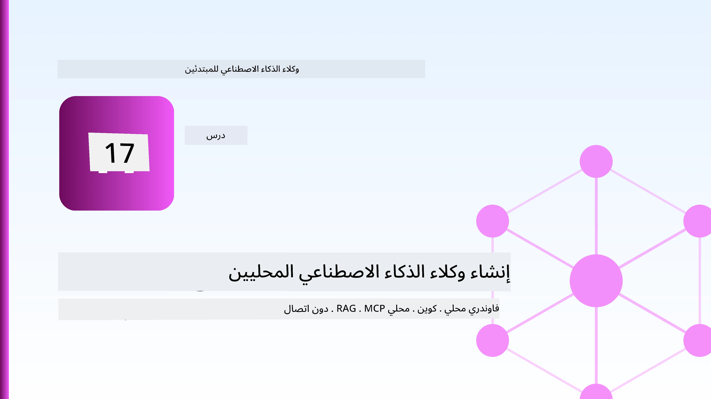
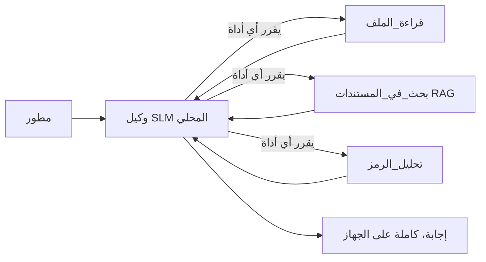
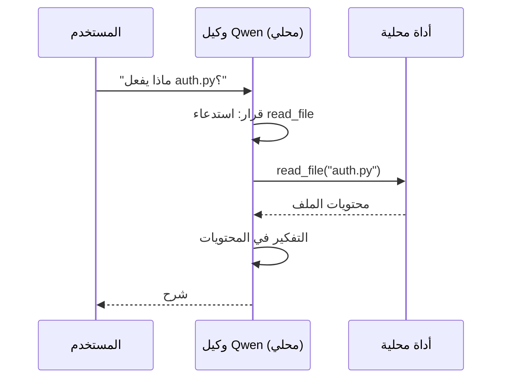
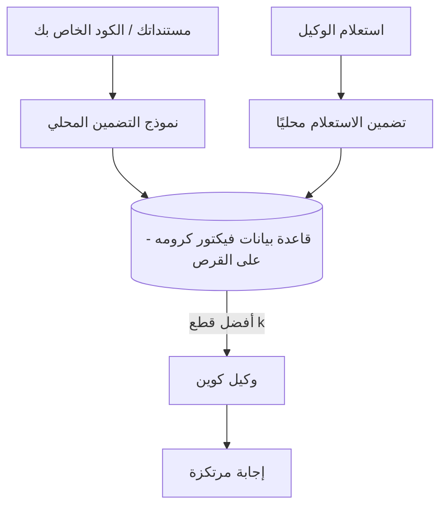
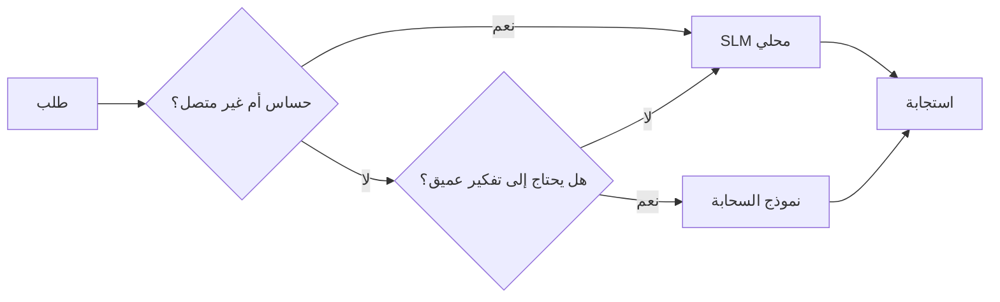

# إنشاء وكلاء ذكاء اصطناعي محليين باستخدام Microsoft Foundry Local و Qwen



الدرس السابق وسع الوكلاء *في السحابة*. هذا الدرس ينزلهم *إلى جهاز واحد*. بنهايته، سيكون لديك مساعد هندسي يعمل يقوم بالتفكير، استدعاء الأدوات، قراءة ملفاتك، والبحث في وثائقك — **دون استدعاء واحد للاستنتاج السحابي.**

لماذا قد ترغب في ذلك؟ هناك ثلاثة أسباب تتكرر بشكل مستمر في العمل الهندسي الحقيقي:

- **الخصوصية.** الشيفرة والوثائق لا تترك الجهاز أبداً. لا موجه أو مقتطف أو بيانات العميل تعبر حدود الشبكة.
- **التكلفة.** الاستنتاج المحلي لا يُحسب حسب كل رمز. يمكنك التكرار طوال اليوم بسعر الكهرباء فقط.
- **بدون اتصال بالإنترنت.** على طائرة، في منشأة مؤمنة، أو أثناء انقطاع الخدمة، الوكيل لا يزال يعمل.

القيد هنا هو أنك تتبادل نموذج سحابي متطور مقابل **نموذج لغة صغير (SLM)** يعمل على معالج الكمبيوتر المركزي (CPU) أو معالج الرسوميات (GPU) أو وحدة المعالجة العصبية (NPU). هذا الدرس يتناول بناء وكلاء يكونون *جيدين* ضمن هذا القيد بدلاً من التظاهر بعدم وجود القيد.

## مقدمة

هذا الدرس سيغطي:

- **نماذج اللغة الصغيرة (SLMs)** — ما هي، أين تتألق، وأين لا.
- **Microsoft Foundry Local** — بيئة تشغيل تقوم بتنزيل وتشغيل النماذج على الجهاز عبر **واجهة برمجة تطبيقات متوافقة مع OpenAI**.
- **نماذج استدعاء الدوال Qwen** — نماذج SLM تنتج استدعاءات أدوات بشكل موثوق، وهو ما يجعل الوكلاء المحليين ممكنين (وليس مجرد دردشة محلية).
- **الأدوات المحلية، البحث المعتمد على الاسترجاع المحلي (RAG)، وخادم MCP المحلي** — يمنح الوكيل القدرة بدون الحاجة للسحابة.
- **الأنماط الهجينة** — متى تحتفظ بالأشياء محلياً ومتى تلجأ للسحابة.

## أهداف التعلم

بعد إتمام هذا الدرس، ستعرف كيف:

- تشرح مميزات نماذج اللغة الصغيرة وتختار حالات الاستخدام المناسبة للوكلاء المحليين.
- تشغيل نموذج Qwen محلياً باستخدام Foundry Local والاتصال به عبر نقطة نهاية متوافقة مع OpenAI.
- بناء وكيل يستدعي الأدوات ويعمل بالكامل على محطة العمل الخاصة بك.
- إضافة بحث معتمد على الاسترجاع المحلي (RAG) على مستنداتك باستخدام قاعدة بيانات متجهات محلية (Chroma).
- ربط الوكيل بخادم MCP محلي والتفكير في تصاميم هجينة تجمع بين المحلي والسحابة.

## المتطلبات الأساسية

يفترض هذا الدرس أنك قد أكملت الدروس السابقة وأنك مرتاح مع:

- [استخدام الأدوات](../04-tool-use/README.md) (الدرس 4) و [البحث المعتمد على الوكلاء](../05-agentic-rag/README.md) (الدرس 5).
- [بروتوكولات الوكلاء / MCP](../11-agentic-protocols/README.md) (الدرس 11).
- [إطار عمل الوكلاء من Microsoft](../14-microsoft-agent-framework/README.md) (الدرس 14).

ستحتاج أيضاً إلى:

- محطة عمل تطوير. **8 جيجابايت ذاكرة وصول عشوائي هي الحد الأدنى الواقعي**؛ 16 جيجابايت أو أكثر مريحة. يساعد وجود معالج رسوميات (GPU) أو وحدة معالجة عصبية (NPU) لكنه غير ضروري.
- تثبيت **Microsoft Foundry Local** (انظر قسم الإعداد أدناه).
- بايثون 3.12+ والحزم الموجودة في المستودع [`requirements.txt`](../../../requirements.txt)، بالإضافة إلى `foundry-local-sdk`، `openai`، و `chromadb` لهذا الدرس.

## نماذج اللغة الصغيرة: الأداة المناسبة للعمل المحلي

نموذج السحابة المتطور يحتوي على مئات المليارات من المعاملات ومركز بيانات خلفه. نموذج اللغة الصغير (SLM) يحتوي على بضعة مليارات من المعاملات ويجب أن يناسب ذاكرة الكمبيوتر المحمول الخاص بك. هذا الاختلاف يحدد توقعات واضحة.

**نماذج اللغة الصغيرة جيدة في:**

- المهام المنظمة والمحدودة — التصنيف، الاستخراج، التلخيص لوثيقة معروفة.
- **استدعاء الأدوات** — اتخاذ القرار بشأن الدالة التي ستُستدعى وبأي معاملات.
- التكرار السريع، الرخيص، والخاص على بياناتك الخاصة.

**نماذج اللغة الصغيرة أضعف في:**

- التفكير المفتوح متعدد القفزات عبر سياق واسع.
- المعرفة العامة الواسعة (رأوا أقل ويفقدون المعلومات بسرعة).

الاستراتيجية الفائزة للوكلاء المحليين هي: **دع نموذج اللغة الصغير ينسق، ودع الأدوات تقوم بالأعمال الثقيلة.** النموذج لا يحتاج أن *يعرف* قاعدة بيانات الشيفرة الخاصة بك — يحتاج أن يعرف متى يستدعي `read_file` و `search_docs`. هذا يلعب مباشرة إلى نقاط القوة لدى نموذج اللغة الصغير.



## Microsoft Foundry Local

**Microsoft Foundry Local** هو بيئة تشغيل خفيفة تقوم بتنزيل النماذج، إدارتها، وتشغيلها بالكامل على جهازك. أهم ميزاته لنا هو أنه يوفر **نقطة نهاية HTTP متوافقة مع OpenAI** — مما يعني أن مكتبة OpenAI وإطار عمل الوكيل من Microsoft يمكنهما العمل ضدها مع تغيير واحد فقط في `base_url`. كل شيء تعلمته عن بناء الوكلاء ينتقل مباشرة؛ فقط نقطة النهاية تنتقل من السحابة إلى `localhost`.

يقوم Foundry Local أيضاً باختيار أفضل نسخة من النموذج لهاردوير جهازك تلقائياً — نسخة CPU، نسخة CUDA/GPU، أو نسخة NPU — لذلك لا تحتاج لتحسين يدوي لكل جهاز.

### الإعداد

قم بتثبيت Foundry Local (انظر [التوثيق](https://learn.microsoft.com/azure/ai-foundry/foundry-local/) لنظام التشغيل الخاص بك)، ثم تحقق من أنه يعمل:

```bash
# قم بالتثبيت (مثال: اتبع الوثائق لمنصتك)
winget install Microsoft.FoundryLocal      # ويندوز
# brew install microsoft/foundrylocal/foundrylocal   # ماك او إس

# قم بتنزيل وتشغيل نموذج Qwen، ثم ابدأ الخدمة المحلية
foundry model run qwen2.5-7b-instruct
foundry service status
```

بمجرد تشغيل الخدمة، لديك نقطة نهاية محلية متوافقة مع OpenAI (عادةً تكون `http://localhost:PORT/v1`). يستخدم الدفتر `foundry-local-sdk` لاكتشاف نقطة النهاية تلقائياً، لذلك لا تحتاج لإدخال رقم المنفذ يدوياً.

## استدعاء دوال Qwen: لماذا هو مهم

الوكيل هو وكيل فقط إذا استطاع استدعاء الأدوات. العديد من نماذج اللغة الصغيرة تستطيع الدردشة لكنها تنتج استدعاءات أدوات غير موثوقة أو مشوهة. نماذج **Qwen** مدربة على استدعاء الدوال وتصدر بنى استدعاء أدوات صحيحة باستمرار — وهذا بالضبط ما يحول نموذج الدردشة المحلي إلى وكيل محلي.

التدفق هو الحلقة القياسية لاستدعاء الأدوات التي تعرفها بالفعل، فقط تعمل على الجهاز:



## البحث المعتمد على الاسترجاع المحلي (Local RAG)

البحث في الوثائق هو المكان الذي يحقق فيه الوكلاء المحليون قيمتهم. بدلاً من الاعتماد على حفظ نموذج اللغة الصغير لوثائق الإطار الخاص بك، تقوم بتضمين تلك الوثائق في **قاعدة بيانات متجهات محلية** وتسمح للوكيل باسترجاع الأجزاء ذات الصلة عند الطلب.

نستخدم **Chroma**، متجر متجهات مضمن يعمل داخل العملية بدون خادم لإدارته. المسار كله محلي: نموذج التضمين → المتجهات المحلية → الاسترجاع المحلي → نموذج اللغة المحلي.



هذا هو نفس نمط البحث المعتمد على الوكلاء من الدرس 5 — التغيير الوحيد هو أن كل مكون يعمل على جهازك.

## خوادم MCP المحلية

[MCP](../11-agentic-protocols/README.md) هو بروتوكول نقل، وليس خدمة سحابية. يمكن تشغيل خادم MCP كعملية محلية على `stdio`، يجعل الأدوات متاحة لوكيلك عبر البروتوكول القياسي. هذا يسمح لك بإعادة استخدام النظام البيئي المتنامي من خوادم MCP — وصول لنظام الملفات، عمليات git، استعلامات قواعد البيانات — كلها دون اتصال بالإنترنت.

موقف الأمان هنا يختلف عن السحابة لكنه ليس غائباً: خادم MCP المحلي لا يزال يعمل بصلاحيات المستخدم الخاص بك، لذلك قيد ما يمكنه الوصول إليه (مثل مجلد مشروع معين وليس كامل مجلد المنزل) واعتبر مخرجاته كمدخلات للتحقق منها قبل استخدامها.

## أنماط هجينة بين السحابة والمحلي

النهج المحلي أولاً لا يعني محلي فقط. الأنظمة الناضجة توزع المهام حسب الحساسية والصعوبة:

| الحالة | مكان التشغيل |
| --- | --- |
| كود/بيانات حساسة، أو بدون اتصال | **نموذج لغة صغير محلي** |
| مهمة بسيطة ومحدودة | **نموذج لغة صغير محلي** (رخيص، سريع) |
| تفكير متعدد القفزات صعب على بيانات غير حساسة | **نموذج سحابي** |
| كل شيء أثناء انقطاع الخدمة | **نموذج لغة صغير محلي** (تدهور سلس) |

هذا يعكس فكرة **توجيه النماذج** من الدرس 16 — ولكن أحد "النماذج" هو الآن جهازك الخاص. التصميم المتين يرجع إلى المحلي إذا لم تكن السحابة متاحة، بحيث يتدهور أداء الوكيل تدريجياً بدلاً من الفشل الكامل.



## مختبر عملي: مساعد هندسي محلي

افتح [`code_samples/17-local-agent-foundry-local.ipynb`](./code_samples/17-local-agent-foundry-local.ipynb) واتبعه. ستبني **مساعداً هندسياً محلياً** يعمل بالكامل على محطة عملك ويمكنه:

1. **استدعاء الأدوات** — عبر استدعاء دوال Qwen من خلال Foundry Local.
2. **أداء عمليات ملفات محلية** — سرد وقراءة الملفات في مجلد المشروع.
3. **تحليل الشيفرة** — تقديم مقاييس أساسية على ملف المصدر.
4. **البحث في الوثائق** — بحث معتمد على RAG محلي ضمن مجلد الوثائق بواسطة Chroma.
5. **استخدام MCP** — الاتصال بخادم MCP محلي (مع تخطي أنيق إذا لم يكن موجوداً).

لا يُستخدم استنتاج سحابي في أي نقطة.

### المرور التفصيلي

المساعد يتصل بـ Foundry Local عبر نقطة نهاية متوافقة مع OpenAI، لذا كود الوكيل يبدو مماثلاً تقريباً لدروس السحابة — فقط العميل يتغير:

```python
from foundry_local import FoundryLocalManager
from openai import OpenAI

# يكتشف Foundry Local النموذج/يقوم بتنزيله ويعطينا نقطة نهاية محلية.
manager = FoundryLocalManager(\"qwen2.5-7b-instruct\")
client = OpenAI(base_url=manager.endpoint, api_key=manager.api_key)  # api_key هو عنصر نائب محلي
```

الأدوات هي دوال بايثون عادية مخصصة لمجلد مشروع:

```python
def read_file(path: str) -> str:
    \"\"\"Read a file, but only inside the sandboxed project directory.\"\"\"
    full = (PROJECT_ROOT / path).resolve()
    if PROJECT_ROOT not in full.parents and full != PROJECT_ROOT:
        return \"Access denied: path is outside the project directory.\"
    return full.read_text(encoding=\"utf-8\")
```

لاحظ فحص الحماية — حتى محلياً، أداة تقرأ مسارات عشوائية تشكل خطراً. الدفتر يحدد كل أداة ضمن جذر مشروع واحد.

## اختبار المعرفة

اختبر فهمك قبل الانتقال إلى المهمة.

**1. اذكر سببين واضحين لتشغيل وكيل محلي بدلاً من السحابة.**

<details>
<summary>الإجابة</summary>

أي اثنين من: **الخصوصية** (الشيفرة والبيانات لا تترك الجهاز)، **التكلفة** (لا فاتورة استنتاج لكل رمز)، و **القدرة على العمل بدون اتصال** (يعمل بدون شبكة — على متن طائرة، في منشأة مؤمنة، أو أثناء انقطاع). القيود التنظيمية التي تمنع إرسال البيانات خارج الجهاز هي سبب شائع للخصوصية.
</details>

**2. ما هو التقسيم الموصى به للعمل بين نموذج اللغة الصغير وأدواته في وكيل محلي، ولماذا؟**

<details>
<summary>الإجابة</summary>

دع نموذج اللغة الصغير **ينسق** (يقرر أي أداة يستدعي وبأي معاملات) ودع **الأدوات تقوم بالأعمال الثقيلة** (قراءة الملفات، استرجاع الوثائق، حساب النتائج). نماذج اللغة الصغيرة قوية في القرارات المحدودة مثل اختيار الأداة لكنها أضعف في المعرفة الواسعة والتفكير متعدد الخطوات، لذا الاعتماد على الأدوات يلعب على نقاط قوتها.
</details>

**3. ما الذي يجعل من الممكن إعادة استخدام كود وكيل السحابة مع Foundry Local؟**

<details>
<summary>الإجابة</summary>

يكشف Foundry Local عن **نقطة نهاية HTTP متوافقة مع OpenAI**. مكتبة OpenAI وعميل OpenAI في إطار عمل الوكيل يعملان ضدها بتغيير `base_url` فقط (واستخدام مفتاح API محلي). كل شيء آخر في كود الوكيل يبقى كما هو.
</details>

**4. لماذا نستخدم تحديداً نموذج استدعاء دوال Qwen بدلاً من أي نموذج لغة صغير؟**

<details>
<summary>الإجابة</summary>

لأن الوكيل يجب أن ينتج استدعاءات أدوات موثوقة وصحيحة. العديد من نماذج اللغة الصغيرة يمكنها الدردشة لكنها تصدر بنى استدعاء أدوات مشوهة أو غير متسقة. نماذج Qwen مدربة على استدعاء الدوال وتصدر استدعاءات أدوات متسقة، وهذا هو الذي يحول نموذج الدردشة المحلي إلى وكيل محلي يعمل.
</details>

**5. في خط أنابيب البحث المعتمد على الاسترجاع المحلي، أي المكونات تعمل على الجهاز؟**

<details>
<summary>الإجابة</summary>

كلها: نموذج التضمين، قاعدة البيانات المتجهية (Chroma، على القرص)، خطوة الاسترجاع، ونموذج اللغة الصغير. تُدمج الوثائق محلياً، تُخزن محلياً، تسترجع محلياً، ويُفكر فيها بواسطة نموذج محلي — لا يلمس أي مكون السحابة.
</details>

**6. خادم MCP محلي يعمل على جهازك. هل يجعله هذا آمناً تلقائياً؟ ما الاحتياطات التي يجب أن تتخذها؟**

<details>
<summary>الإجابة</summary>

لا. خادم MCP المحلي يعمل بصلاحيات المستخدم الخاص بك، لذا يمكنه الوصول إلى أي شيء يمكنك الوصول إليه. حدّ من نطاقه لما يحتاجه فقط (مثل مجلد مشروع واحد بدلاً من مجلد المنزل كله) واعتبر مخرجاته مدخلات للتحقق قبل التصرف بناءً عليها.
</details>

**7. صف قاعدة توجيه هجينة معقولة تشمل نموذجاً محلياً.**

<details>
<summary>الإجابة</summary>

وجه الطلبات الحساسة أو التي لا تتصل عبر الإنترنت إلى نموذج اللغة الصغير المحلي؛ وجه المهام البسيطة والمحدودة إلى النموذج المحلي للسرعة والتكلفة؛ وجه التفكير متعدد القفزات الصعب على بيانات غير حساسة إلى نموذج سحابي؛ وارجع إلى النموذج المحلي إذا لم تتوفر السحابة بحيث يتدهور أداء الوكيل بشكل سلس بدلاً من الفشل الكامل. هذا هو توجيه النماذج (الدرس 16) مع الجهاز المحلي كأحد النماذج.
</details>

**8. ما هو الحد الأدنى الواقعي لذاكرة الوصول العشوائي لتشغيل الوكيل المحلي في هذا الدرس، وماذا تحصل عليه بذاكرة أكبر؟**

<details>
<summary>الإجابة</summary>

حوالي **8 جيجابايت** هو الحد الأدنى الواقعي؛ 16 جيجابايت أو أكثر مريحة. المزيد من الذاكرة يتيح لك تشغيل نماذج أكبر وأكثر قدرة واحتفاظ بالسياق في الذاكرة. المعالج الرسومي أو وحدة المعالجة العصبية يسرعان الاستنتاج لكنه غير مطلوب — يختار Foundry Local نسخة CPU إذا لم يكن هناك مساعد.
</details>

## المهمة

وسع المساعد الهندسي المحلي إلى **مراجع وثائق محلي** لمشروع صغير تختاره (استخدم أحد مجلدات دروس هذا المستودع إذا رغبت).

يجب أن يتضمن عملك:

1. **فهرسة مجلد وثائق/شيفرة حقيقي** إلى Chroma (على الأقل خمسة ملفات).
2. **إضافة أداة `find_todos`** التي تفحص المشروع للتعليقات التي تحتوي `TODO`/`FIXME` وتُرجعها مع اسم الملف ورقم السطر — مع الحفاظ على نفس فحص الحماية مثل أداة `read_file`.

3. **اطرح على الوكيل ثلاثة أسئلة** تُجبره على دمج الأدوات: سؤال واحد من نوع RAG بحت، وسؤال يتطلب قراءة ملف محدد، وسؤال يتطلب العثور على TODOs.
4. **قِس الأداء**: قم بقياس زمن كل من الردود الثلاثة وسجِّلها في خلية ماركداون. علِّق على ما إذا كان التأخير مقبولًا لسير عملك المقصود.

ثم اكتب فقرة قصيرة عن **ما الذي ستنقله إلى السحابة وما الذي ستبقيه محليًا** لهذا المراجع، ولماذا. سيتم تقييمك بناءً على ما إذا كانت المكونات المحلية متصلة بشكل صحيح وعلى ما إذا كان استدلالك المختلط سليمًا — وليس جودة النموذج.

## الملخص

في هذا الدرس قمت ببناء وكيل يعمل بالكامل على جهازك الخاص:

- **نماذج اللغة الصغيرة (SLMs)** تقدم عرضًا مقابل الخصوصية والتكلفة والعمل دون اتصال — وتتميز عندما **تنظم الأدوات** بدلاً من حمل كل المعرفة بنفسها.
- **Foundry Local** يخدم النماذج على الجهاز خلف **نقطة نهاية متوافقة مع OpenAI**، لذا ينتقل كود وكيل السحابة الخاص بك بتغيير سطر واحد.
- **نماذج Qwen التي تستدعي الوظائف** تجعل استدعاء الأدوات المحلية موثوقًا — ومن ثم الوكلاء المحليين — ممكنًا.
- **RAG المحلي** (Chroma) و**MCP المحلي** يمنحان الوكيل القدرة دون مغادرة الجهاز.
- **الأنماط المختلطة** تتيح لك التوجيه حسب الحساسية والصعوبة، مع الرجوع المحلي كخطة بديلة أنيقة.

هذا يكمل محور النشر: الدرس 16 قام بتوسيع الوكلاء داخل Microsoft Foundry، وهذا الدرس قام بتصغيرهم ليعملوا على محطة عمل واحدة. الدرس التالي يتناول كيفية الحفاظ على أمان الوكلاء المنشورين.

## مصادر إضافية

- <a href="https://learn.microsoft.com/azure/ai-foundry/foundry-local/" target="_blank">توثيق Microsoft Foundry Local</a>
- <a href="https://learn.microsoft.com/azure/ai-foundry/what-is-azure-ai-foundry" target="_blank">توثيق Microsoft Foundry</a>
- <a href="https://learn.microsoft.com/en-us/agent-framework/overview/?wt.mc_id=youtube_26688_organicsocial_reactor&pivots=programming-language-python" target="_blank">إطار عمل Microsoft Agent</a>
- <a href="https://qwen.readthedocs.io/en/latest/framework/function_call.html" target="_blank">توثيق استدعاء الدالة في Qwen</a>
- <a href="https://modelcontextprotocol.io/" target="_blank">بروتوكول سياق النموذج (MCP)</a>
- <a href="https://docs.trychroma.com/" target="_blank">قاعدة بيانات متجهات Chroma</a>

## الدرس السابق

[نشر وكلاء قابلين للتوسع](../16-deploying-scalable-agents/README.md)

## الدرس التالي

[تأمين وكلاء الذكاء الاصطناعي](../18-securing-ai-agents/README.md)

---

<!-- CO-OP TRANSLATOR DISCLAIMER START -->
**تنويه**:
تمت ترجمة هذا المستند باستخدام خدمة الترجمة بالذكاء الاصطناعي [Co-op Translator](https://github.com/Azure/co-op-translator). بينما نسعى للدقة، يرجى العلم أن الترجمات الآلية قد تحتوي على أخطاء أو عدم دقة. يجب اعتبار المستند الأصلي بلغته الأصلية المصدر الرسمي والمعتمد. للمعلومات الهامة، يُنصح بالاستعانة بترجمة بشرية محترفة. نحن غير مسؤولين عن أي سوء فهم أو تفسير ناتج عن استخدام هذه الترجمة.
<!-- CO-OP TRANSLATOR DISCLAIMER END -->