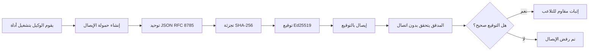
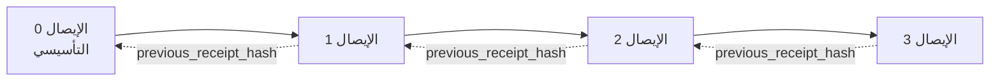

[شاهد فيديو الدرس: تأمين وكلاء الذكاء الاصطناعي باستلامات تشفيرية](https://youtu.be/PLACEHOLDER_VIDEO_ID)

> _(فيديو الدرس والصورة المصغرة ستُضاف من قِبل فريق محتوى مايكروسوفت بعد الدمج، بما يتوافق مع نمط الدرس 14 / 15.)_

# تأمين وكلاء الذكاء الاصطناعي باستلامات تشفيرية

## مقدمة

سيغطي هذا الدرس:

- لماذا تعتبر سجلات التدقيق لوكلاء الذكاء الاصطناعي مهمة للامتثال، وتصحيح الأخطاء، والثقة.
- ما هو الاستلام التشفيري وكيف يختلف عن سجل غير موقع.
- كيفية إنتاج استلام موقع لاستدعاء أداة من الوكيل باستخدام بايثون بسيط.
- كيفية التحقق من استلام دون اتصال واكتشاف التلاعب.
- كيفية ربط الاستلامات بحيث يؤدي حذف أو إعادة ترتيب واحدة إلى كسر السلسلة.
- ما الذي تثبته الاستلامات وما لا تثبته صراحة.

## أهداف التعلم

بعد إكمال هذا الدرس، ستعرف كيفية:

- تحديد أوضاع الفشل التي تحفز إثبات المرجعية التشفيرية لإجراءات الوكيل.
- إنتاج استلام موقع باستخدام Ed25519 على حمولة JSON معيارية.
- التحقق من الاستلام بشكل مستقل باستخدام مفتاح التوقيع العام فقط.
- اكتشاف التلاعب عبر إعادة تشغيل التحقق على استلام معدل.
- بناء تسلسل استلامات مربوط بالهاش وشرح سبب أهمية السلسلة.
- التعرف على الحدود بين ما تثبته الاستلامات (النسبة، السلامة، الترتيب) وما لا تثبته (صحة الإجراء، صحة السياسة).

## المشكلة: سجل تدقيق وكيلك

تخيل أنك نشرت وكيل ذكاء اصطناعي لشركة Contoso Travel. يقرأ الوكيل طلبات العملاء، يستدعي واجهة برمجة تطبيقات الرحلات للبحث عن الخيارات، ويحجز المقاعد نيابة عن العميل. في الربع الأخير، عالج الوكيل 50,000 حجز.

وصل اليوم مدقق. يطرح سؤالًا بسيطًا: "أرني ما فعله وكيلك."

تسلمه ملفات السجل الخاصة بك. ينظر المدقق إليها ويسأل السؤال الأصعب: "كيف أعلم أن هذه السجلات لم تُعدّل؟"

هذه هي مشكلة سجل التدقيق. يعتمد معظم نشرات الوكلاء اليوم على:

- **سجلات التطبيق**: يكتبها الوكيل نفسه، قابلة للتعديل من أي شخص يملك وصول إلى نظام الملفات.
- **خدمات تسجيل السحاب**: تظهر التلاعب على مستوى المنصة فقط إذا وثق المدقق بمشغل المنصة.
- **سجلات معاملات قاعدة البيانات**: مناسبة جيدًا لتغييرات قواعد البيانات لكنها ليست للأدوات ذات الاستدعاءات العشوائية.

لا يمكن لأي من هذه الإجابة على سؤال المدقق دون أن يثق المدقق بشخص ما (أنت، مزود السحابة، بائع قاعدة البيانات). للاستخدام الداخلي، يكون هذا الثقة مقبولة غالبًا. بالنسبة لأعباء العمل المنظمة (المالية، الصحية، وأي شيء يخضع لقانون الذكاء الاصطناعي للاتحاد الأوروبي)، فهي غير مقبولة.

تُحل الاستلامات التشفيرية هذه المشكلة بجعل كل إجراء لوكيل قابلًا للتحقق بشكل مستقل. لا يحتاج المدقق إلى الوثوق بك، بل يحتاج فقط إلى مفتاحك العام والاستلام نفسه.

## ما هو الاستلام التشفيري؟

الاستلام هو كائن JSON يسجل ما فعله الوكيل، موقعًا بتوقيع رقمي.


  
يبدو الاستلام الحد الأدنى كالتالي:

```json
{
  "type": "agent.tool_call.v1",
  "agent_id": "contoso-travel-bot",
  "tool_name": "lookup_flights",
  "tool_args_hash": "sha256:a3f9c1...",
  "result_hash": "sha256:7b2e1d...",
  "policy_id": "contoso-travel-policy-v3",
  "timestamp": "2026-04-25T14:30:00Z",
  "sequence": 47,
  "previous_receipt_hash": "sha256:9d4e6a...",
  "signature": {
    "alg": "EdDSA",
    "sig": "c5af83...",
    "public_key": "8f3b2c..."
  }
}
```
  
ثلاث خصائص تقوم بالعمل:

1. **التوقيع**. يُوقّع الاستلام من خلال بوابة الوكيل باستخدام مفتاح خاص Ed25519. يمكن لأي شخص لديه المفتاح العام المقابل التحقق من التوقيع دون اتصال. التلاعب بأي حقل يبطل التوقيع.

2. **الترميز المعياري**. قبل التوقيع، يتم تسلسل الاستلام باستخدام مخطط تحقيق المعيارية JSON (JCS، RFC 8785). هذا يضمن أن تنفيذين ينتجان نفس الاستلام المنطقي ينتجان ناتجًا مطابقًا للبايت. بدون التوحيد، ستنتج مكتبات JSON مختلفة توقيعات مختلفة على نفس المحتوى.

3. **ربط التجزئة**. يربط حقل `previous_receipt_hash` كل استلام بالاستلام السابق له. حذف أو إعادة ترتيب الاستلامات يكسر كل الاستلامات التي تليه. يصبح التلاعب مرئيًا على مستوى السلسلة حتى وإن تم تخطي التوقيعات الفردية.

معًا توفر هذه الخصائص ثلاث ضمانات:

- **النسبة**: هذا المفتاح وقع هذا المحتوى.
- **السلامة**: المحتوى لم يتغير منذ التوقيع.
- **الترتيب**: جاء هذا الاستلام بعد ذلك الاستلام في السلسلة.

## إنتاج استلام في بايثون

لا تحتاج إلى مكتبة خاصة لإنتاج استلام. البدائيات التشفيرية متوفرة على نطاق واسع والمنطق يتألف من بضعة أسطر بايثون.

تتبع التمارين العملية في `code_samples/18-signed-receipts.ipynb` التدفق الكامل. النسخة الملخصة:

```python
import json
import hashlib
import base64
from nacl import signing
from jcs import canonicalize  # JSON المرادف حسب RFC 8785

def b64url_nopad(data: bytes) -> str:
    return base64.urlsafe_b64encode(data).decode("ascii").rstrip("=")

def sha256_canonical(obj) -> str:
    """SHA-256 of a Python object's JCS-canonical JSON form."""
    return f"sha256:{hashlib.sha256(canonicalize(obj)).hexdigest()}"

# إنشاء أو تحميل مفتاح توقيع (في الإنتاج، يخزن في خزنة المفاتيح)
signing_key = signing.SigningKey.generate()
verify_key = signing_key.verify_key

# بناء حمولة الإيصال (بدون توقيع حتى الآن)
tool_args = {"origin": "SYD", "destination": "LAX"}
tool_result = [{"flight": "QF11", "price": 1850, "stops": 0}]

payload = {
    "type": "agent.tool_call.v1",
    "agent_id": "contoso-travel-bot",
    "tool_name": "lookup_flights",
    "tool_args_hash": sha256_canonical(tool_args),
    "result_hash": sha256_canonical(tool_result),
    "policy_id": "contoso-travel-policy-v3",
    "timestamp": "2026-04-25T14:30:00Z",
    "sequence": 0,
    "previous_receipt_hash": None,
}

# تحويل إلى الشكل المعياري، تجزئة، توقيع.
canonical_bytes = canonicalize(payload)
message_hash = hashlib.sha256(canonical_bytes).digest()
signature_bytes = signing_key.sign(message_hash).signature

# إرفاق كائن توقيع منظم.
receipt = {
    **payload,
    "signature": {
        "alg": "EdDSA",
        "sig": b64url_nopad(signature_bytes),
        "public_key": b64url_nopad(bytes(verify_key)),
    },
}
```
  
هذه هي سلسلة التوقيع بأكملها. تمشي التمارين في دفتر الملاحظات عبر كل خطوة.

## التحقق من استلام واكتشاف التلاعب

التحقق هو العملية العكسية:

```python
import base64
import hashlib
from nacl import signing
from nacl.exceptions import BadSignatureError
from jcs import canonicalize

def b64url_decode(s: str) -> bytes:
    padding = "=" * ((4 - len(s) % 4) % 4)
    return base64.urlsafe_b64decode(s + padding)

def verify_receipt(receipt: dict) -> bool:
    # التوقيع هو كائن منظم: {"alg"، "sig"، "public_key"}.
    sig_obj = receipt.get("signature")
    if not sig_obj or sig_obj.get("alg") != "EdDSA":
        return False

    # إعادة بناء الحمولة التي تم توقيعها فعليًا (كل شيء ما عدا التوقيع).
    payload = {k: v for k, v in receipt.items() if k != "signature"}

    canonical_bytes = canonicalize(payload)
    message_hash = hashlib.sha256(canonical_bytes).digest()

    try:
        verify_key = signing.VerifyKey(b64url_decode(sig_obj["public_key"]))
        verify_key.verify(message_hash, b64url_decode(sig_obj["sig"]))
        return True
    except BadSignatureError:
        return False
```
  
تأخذ هذه الدالة استلامًا وتعيد `True` إذا كان التوقيع صالحًا، و`False` خلاف ذلك. لا مكالمة شبكة، لا اعتماد على خدمة، لا حاجة للثقة في طرف ثالث.

لمشاهدة اكتشاف التلاعب عمليًا، يشرح الدفتر:

1. إنتاج استلام صالح والتأكد من أنه يتحقق.
2. تعديل بايت واحد في حقل `tool_args_hash`.
3. إعادة التحقق ورؤية الفشل.

هذه هي البرهنة العملية على أن الاستلامات مقاومة للتلاعب: أي تعديل، مهما كان صغيرًا، يكسر التوقيع.

## ربط الاستلامات لوكلاء متعددين الخطوات

يحمي استلام موقع واحد إجراءً واحدًا. تحمي سلسلة من الاستلامات تسلسلًا.


  
يسجل كل استلام تجزئة الاستلام السابق له. لحذف الاستلام 2 بهدوء، يجب على المهاجم إما:

- تعديل حقل `previous_receipt_hash` في الاستلام 3 (يكسر توقيع الاستلام 3)، أو
- تزوير توقيع جديد على استلام 3 معدل (يتطلب المفتاح الخاص للوكيل).

إذا كان المفتاح الخاص في خزنة مفاتيح الأجهزة وتنشر المفتاح العام مع كل استلام، فإن أي هجوم غير ممكن بدون اكتشاف.

يمشي الدفتر عبر:

1. بناء سلسلة من ثلاثة استلامات.
2. التحقق من أن حقل `previous_receipt_hash` لكل استلام يطابق تجزئة الاستلام السابق الفعلي.
3. التلاعب باستلام في المنتصف ورؤية السلسلة تكسر في تلك النقطة بالضبط.

هذه هي الطريقة لإنتاج سجل تدقيق يمكن للمدقق الخارجي التحقق منه دون الحاجة للثقة بك.

## ما تثبته الاستلامات (وما لا تثبته)

هذا هو القسم الأهم في هذا الدرس. الاستلامات قوية لكن قوتها محدودة.

**الاستلامات تثبت ثلاثة أشياء:**

1. **النسبة**: مفتاح محدد وقع حمولة محددة.
2. **السلامة**: الحمولة لم تتغير منذ التوقيع.
3. **الترتيب**: هذا الاستلام جاء بعد ذلك الاستلام في سلسلة التجزئة.

**الاستلامات لا تثبت:**

1. **الصحة**: أن إجراء الوكيل كان الإجراء الصحيح. يمكن توقيع الاستلام على إجابة خاطئة بنفس السهولة كما على إجابة صحيحة.
2. **الامتثال للسياسة**: أن السياسة المشار إليها في `policy_id` قد تم تقييمها فعلاً، أو أنها كانت ستسمح بهذا الإجراء لو تم التحقق منها. يسجل الاستلام ما زُعم، وليس ما نُفذ.
3. **الهوية خارج المفتاح**: يقول الاستلام "هذا المفتاح وقع هذا المحتوى." لكنه لا يقول "هذا الإنسان فوض هذا." ربط المفتاح بشخص أو مؤسسة يتطلب بنية تحتية مختلفة للهوية (دليل، سجل المفتاح العام، إلخ).
4. **صدق المدخلات**: إذا استلم الوكيل طلبًا معدلًا وتصرف بناء عليه، يسجل الاستلام الإجراء بدقة. الاستلامات تأتي بعد التحقق من صحة المدخلات وليست بديلاً له.

هذه الحدود مهمة لسببين:

- توضح لك ما هي الفائدة من الاستلامات: جعل سلوك الوكيل قابلاً للتدقيق ومرئيًا للتلاعب، حتى عبر حدود تنظيمية.
- تخبرك ما هي الطبقات الإضافية التي تحتاجها: التحقق من المدخلات (الدرس 6)، تنفيذ السياسات (مذكور باختصار أدناه)، وبنية الهوية (خارج نطاق هذا الدرس).

خطأ شائع هو افتراض أن "لدينا استلامات" يعني "لدينا حوكمة." هذا ليس صحيحًا. الاستلامات هي الأساس. الحوكمة هي النظام الذي تبنيه فوقها.

## مراجع الإنتاج

الكود المكتوب في هذا الدرس بسيط عمدًا لكي تقرأ كل سطر وتفهم بالضبط ما يحدث. في الإنتاج لديك خياران:

1. **البناء مباشرة على البدائيات التشفيرية.** الخمسون سطرًا التي رأيتها أعلاه كافية للعديد من الاستخدامات. مكتبة PyNaCl (Ed25519) وحزمة `jcs` (JSON المعياري) مكتبات مدعومة ومراجعة بشكل جيد.

2. **استخدام مكتبة استلام إنتاجية.** تنفذ عدة مشاريع مفتوحة المصدر نفس النمط مع ميزات إضافية (تدوير المفاتيح، التحقق الجماعي، توزيع مجموعة JWK، التكامل مع محركات السياسة):
   - تنسيق الاستلام المستخدم في هذا الدرس يتبع مسودة IETF حالية (`draft-farley-acta-signed-receipts`) في مرحلة المعايير.
   - مجموعة أدوات حوكمة الوكلاء من مايكروسوفت تجمع الاستلامات مع قرارات سياسة قائمة على Cedar؛ انظر الدرس 33 في ذلك المستودع لمثال شامل.
   - توفر الحزم `protect-mcp` (npm) و `@veritasacta/verify` (npm) تنفيذًا بنود للأسلوب، يهدف لتغليف أي خادم MCP بسجل تدقيق مقاوم للتلاعب.

القرار بين الترميز الخاص واستخدام مكتبة يشبه قرار كتابة مكتبة JWT خاصة أو استخدام مكتبة مختبرة: كلاهما معقول؛ المكتبة توفر الوقت وتقلل فراغ المراجعة؛ النهج الذاتي يجبرك على فهم كل بدائي. يعلمك هذا الدرس المسار من الصفر لتكون لديك قاعدة لأي خيار.

## اختبار المعرفة

اختبر فهمك قبل الانتقال إلى التمرين العملي.

**1. الاستلام موقع بمفتاح Ed25519 الخاص بالوكيل. المدقق لديه المفتاح العام فقط. هل يمكن للمدقق التحقق من الاستلام دون اتصال؟**

<details>
<summary>الإجابة</summary>

نعم. يتطلب التحقق باستخدام Ed25519 المفتاح العام والبيانات الموقعة فقط. لا مكالمة شبكة، لا اعتماد على خدمة. هذه الخاصية تجعل الاستلامات مفيدة في بيئات مفصولة عن الشبكة، تعاونية بين مؤسسات متعددة أو منخفضة الثقة.
</details>

**2. يغير المهاجم حقل `policy_id` في الاستلام ليزعم أنه خضع لسياسة أكثر تساهلًا. كان التوقيع على الحمولة الأصلية. ماذا يحدث أثناء التحقق؟**

<details>
<summary>الإجابة</summary>

يفشل التحقق. التوقيع حسب البايتات المعيارية للحمولة الأصلية؛ تعديل أي حقل يغير البايتات، يغير تجزئة SHA-256، ويجعل التوقيع غير صالح. يحتاج المهاجم للمفتاح الخاص لإنتاج توقيع جديد صحيح، وهذا مفقود لديه.
</details>

**3. لماذا يشمل الاستلام `tool_args_hash` و `result_hash` بدلاً من الوسائط والنتيجة الصافيتين؟**

<details>
<summary>الإجابة</summary>

لسببين: أولًا، قد يحتاج الاستلام إلى أرشفة أو نقل في بيئات حيث تسرب المحتوى الخام (معلومات شخصية، بيانات أعمال) مشكلة. التجزئة تحافظ على صغر الاستلام وسرية المحتوى؛ يتحقق المدقق أن التجزئة تطابق نسخة مخزنة منفصلة من المحتوى الفعلي. ثانيًا، التجزئات ذات حجم ثابت؛ الاستلام المحتوي على تجزئات محدد الحجم مهما كان حجم المدخلات والمخرجات.
</details>

**4. يربط حقل `previous_receipt_hash` كل استلام بالسابقة له. إذا حذف المهاجم استلامًا ساكنًا من منتصف السلسلة، فما الذي يصبح غير صالح؟**

<details>
<summary>الإجابة</summary>

كل الاستلامات التي جاءت بعد المحذوفة. لم تعد حقول `previous_receipt_hash` تطابق السلسلة الحقيقية (لأن الاستلام المشار إليه لم يعد موجودًا أو أن السلسلة تشير الآن إلى سلف مختلف). لاخفاء الحذف، يجب على المهاجم إعادة توقيع كل الاستلامات اللاحقة، ما يتطلب المفتاح الخاص.
</details>

**5. تم التحقق من استلام بنجاح. هل هذا يثبت أن إجراء الوكيل كان صحيحًا أو سليمًا أو متوافقًا مع السياسة؟**

<details>
<summary>الإجابة</summary>

لا. يثبت الاستلام الصحيح ثلاثة أشياء: النسبة (هذا المفتاح وقع هذا المحتوى)، السلامة (المحتوى لم يتغير)، والترتيب (هذا الاستلام جاء بعد ذلك). لكنه لا يثبت أن الإجراء كان صحيحًا، أن السياسة المذكورة في `policy_id` تم تقييمها فعلاً، أو أن الوكيل اتبع كل القواعد. تجعل الاستلامات سلوك الوكيل قابلاً للتدقيق، وليس بالضرورة صحيحًا. هذه أهم الحدود في الدرس.
</details>

## تمرين عملي

افتح `code_samples/18-signed-receipts.ipynb` وأكمل الأقسام الأربعة كلها:

1. **القسم 1**: وقّع أول استلام لك وتحقق منه.
2. **القسم 2**: تلاعب في الاستلام وراقب فشل التحقق.
3. **القسم 3**: ابنِ سلسلة من ثلاثة استلامات وتحقق من سلامة السلسلة.
4. **القسم 4**: طبّق النمط على وكيل بُني بإطار عمل Microsoft Agent: غلف استدعاء أداة بتوقيع الاستلام، ثم تحقق من الاستلام بشكل مستقل.

**تحدي إضافي 1:** وسع مخطط الاستلام بحقل إضافي تختاره بنفسك (مثلاً، معرف طلب للتتبع)، حدّث منطق التوقيع المعياري ليشمله، وتأكد أن الاستلام لا يزال يمر عبر التحقق. ثم عدّل الحقل بعد التوقيع وتأكد فشل التحقق. هذا يجبرك على فهم كيف يساهم كل بايت في الترميز المعياري في التوقيع.
**التحدي الإضافي 2:** قم بتجزئة SHA-256 على اثنين من إيصالاتك معًا (دمج بايتاتهم القانونية بترتيب حتمي) ودمج الملخص الناتج كحقل جديد في إيصال ثالث قبل توقيعه. تحقق من أن جميع الإيصالات الثلاثة لا تزال قابلة للتحقق. لقد قمت للتو بإنشاء دليل إدراج خطوة واحدة: يمكن لأي شخص يحمل الإيصال الثالث إثبات أن الإيصالين الأولين كانا موجودين وقت توقيعه، دون الحاجة إلى الكشف عن محتوياتهما. هذا هو النمط الذي تستخدمه إيصالات الكشف الانتقائي على نطاق واسع (التزامات ميركل، RFC 6962).

## الخاتمة

الإيصالات المشفرة تمنح وكلاء الذكاء الاصطناعي مسار تدقيق يكون:

- **قابل للتحقق بشكل مستقل**: يمكن لأي طرف يحمل المفتاح العام التحقق منها، دون الاعتماد على خدمة.
- **مقاوم للتلاعب**: أي تعديل يبطل التوقيع.
- **قابل للنقل**: الإيصال هو ملف JSON صغير؛ يمكن أرشفته ونقله والتحقق منه في أي مكان.
- **متوافق مع المعايير**: مبني على Ed25519 (RFC 8032) و JCS (RFC 8785) و SHA-256، وهي جميعها أدوات واسعة الانتشار.

لا يعتبر بديلاً عن التحقق من صحة المدخلات، أو تنفيذ السياسات، أو بنية الهوية. إنه أساس لتلك الطبقات. عندما تقوم بنشر الوكلاء في أعباء عمل منظمة تنظيميًا، أو سير عمل متعدد المؤسسات، أو أي بيئة لا يمكن فيها الافتراض بأن المراجع المستقبلي سيثق بك، فإن الإيصالات هي الطريقة لجعل مسار التدقيق صادقًا.

أهم نقطة يجب تذكرها: تثبت الإيصالات من قال ماذا ومتى. ولا تثبت أن ما قيل كان صحيحًا أو سليمًا. تمسك بهذه الفكرة بقوة. إنها الفرق بين نظام إسناد صادق ونظام مضلل.

## قائمة التحقق للإنتاج

عندما تكون مستعدًا للانتقال من هذا الدرس إلى نشر وكلاء موقعين بالإيصالات في بيئة حقيقية:

- [ ] **انقل مفتاح التوقيع بعيدًا عن كمبيوتر المطور المحمول.** استخدم Azure Key Vault أو AWS KMS أو وحدة أمان مادية. يجب ألا يعيش المفتاح الخاص الذي يوقع إيصالاتك أبدًا في نظام التحكم بالمصدر أو كنص عادي على أجهزة التطبيقات.
- [ ] **انشر المفتاح العام للتحقق.** يحتاج المراجعون إليه للتحقق دون اتصال. النمط القياسي هو مجموعة JWK على عنوان URL معروف (RFC 7517)، مثلاً `https://your-org.example.com/.well-known/agent-keys.json`.
- [ ] **ثبت السلسلة خارجيًا.** اكتب بشكل دوري أحدث تجزئة رأٍس السلسلة إلى سجل الشفافية (Sigstore Rekor، سلطة توقيت RFC 3161، أو نظام داخلي ثانٍ) حتى يتمكن طرف خارجي من تأكيد "أن هذه السلسلة كانت موجودة في هذا الوقت."
- [ ] **خزن الإيصالات بشكل غير قابل للتغيير.** التخزين المضاف فقط (Azure Storage بسياسات عدم التغيير، AWS S3 Object Lock) يمنع من إعادة كتابة التاريخ داخليًا على مستوى التخزين.
- [ ] **قرر عن فترة الاحتفاظ.** تتطلب العديد من أنظمة الامتثال الاحتفاظ لسنوات متعددة. خطط لنمو الإيصالات (كل إيصال حوالي 500 بايت؛ وكيل يصنع 10 آلاف مكالمة يوميًا ينتج حوالي 1.8 جيجابايت سنويًا).
- [ ] **وثق ما لا تغطيه الإيصالات.** تثبت الإيصالات النسبة والسلامة والترتيب. يجب أن يسرد دليل التشغيل لديك بوضوح الضوابط الإضافية (التحقق من صحة المدخلات، تنفيذ السياسات، تحديد المعدل، بنية الهوية) التي تجتمع مع الإيصالات ضمن هيكل الحوكمة.

### هل لديك المزيد من الأسئلة حول تأمين وكلاء الذكاء الاصطناعي؟

انضم إلى [Discord مايكروسوفت فاوندرِي](https://aka.ms/ai-agents/discord) للقاء متعلمين آخرين، حضور ساعات الدوام، والحصول على إجابات على أسئلتك حول وكلاء الذكاء الاصطناعي.

## ما بعد هذا الدرس

يغطي هذا الدرس توقيع إيصال واحد وتسلسلات متسلسلة بتجزئة. نفس الأدوات الأساسية تخلق عدة أنماط أكثر تقدمًا قد تواجهها مع تطور هيكلك الحوكمي:

- **الكشف الانتقائي.** عندما تُلتزم حقول الإيصال بشكل مستقل (شجرة ميركل على نمط RFC 6962)، يمكنك كشف حقول محددة لمراجعين محددين وإثبات أنّ الباقي لم يتغير دون الكشف عنه. مفيد عندما يجب أن يلبي الإيصال نفسه تدقيقًا شاملاً (يريد الشمولية) وقوانين تقليل البيانات مثل GDPR (تريد أن يرى المراجع أقل قدر ممكن).
- **إبطال الإيصالات.** إذا تم اختراق مفتاح التوقيع، تحتاج إلى طريقة لتعليم كل الإيصالات الموقعة بهذا المفتاح بأنها غير موثوقة من لحظة معينة فصاعدًا. الأنماط القياسية: مفاتيح توقيع قصيرة العمر وقائمة إبطال منشورة، أو سجل شفافية مع إدخالات إبطال.
- **الإيصالات الثنائية / ذات التوقيع المقسم.** بعض التنفيذات تقسم الحمولة الموقع عليها إلى نصف ما قبل التنفيذ (`authorization_*`) ونصف ما بعد التنفيذ (`result_*`) مع توقيعات مستقلة، مفيد عندما يكون قرار التفويض والنتيجة المرصودة يصدران عن فاعلين مختلفين أو في أوقات مختلفة. هذا يضاف بشكل تراكمية على شكل الإيصال الذي تم تدريسه في هذا الدرس.
- **تركيب الحمولة.** يغلق الإيصال أي بايتات تضعها في `result_hash`. الحمولة الواقعية غالبًا أغنى من نتيجة مكالمة أداة واحدة: يمكن أن يشمل التفكير المسبق للقرار (توقع النموذج، الخيارات المدروسة، الأدلة وكمالها، وضع المخاطر، سلسلة المسؤولية، نتيجة البوابة) كلها داخل الحمولة، مغلقة بإيصال واحد. هذا يحافظ على شكل الإيصال بسيطًا ويسمح لتطور مخططات الحمولة حسب المجال.
- **التوافق بين التنفيذات.** يتحقق عدة تنفيذا مستقلين لنفس شكل الإيصال (Python، TypeScript، Rust، Go) من صلاحية تنفيذات بعضها لبعض باستخدام متجهات اختبار مشتركة. إذا كنت تبني تطبيقك الخاص، فالتأكد منه باستخدام المتجهات المنشورة يؤكد تطابق الطريقة.
- **الهجرة لما بعد الكمومية.** Ed25519 منتشر اليوم لكنه ليس مقاومًا للكم. شكل الإيصال مرن بالنسبة للمنهج: يمكن أن يحمل الحقل `signature.alg` قيمة `ML-DSA-65` (معيار التوقيع الكمومي بعد NIST) عندما تحتاج للهجرة. خطط لفترة انتقالية حيث تكون الإيصالات موقعة بشكل مزدوج.

## موارد إضافية

- <a href="https://datatracker.ietf.org/doc/draft-farley-acta-signed-receipts/" target="_blank">مسودة IETF: إيصالات قرارات موقعّة للوصول الآلي بين الأجهزة</a>
- <a href="https://learn.microsoft.com/azure/ai-studio/responsible-use-of-ai-overview" target="_blank">نظرة عامة على الذكاء الاصطناعي المسؤول (Azure AI)</a>
- <a href="https://datatracker.ietf.org/doc/html/rfc8032" target="_blank">RFC 8032: خوارزمية توقيع المنحنى إدواردز (EdDSA)</a>
- <a href="https://datatracker.ietf.org/doc/html/rfc8785" target="_blank">RFC 8785: طريقة تبسيط JSON (JCS)</a>
- <a href="https://datatracker.ietf.org/doc/html/rfc6962" target="_blank">RFC 6962: شفافية الشهادات</a> (بناء شجرة ميركل المستخدم في إيصالات الكشف الانتقائي)
- <a href="https://github.com/microsoft/agent-governance-toolkit/blob/main/docs/tutorials/33-offline-verifiable-receipts.md" target="_blank">أداة حوكمة الوكلاء من مايكروسوفت، الدرس 33: إيصالات قرارات قابلة للتحقق دون اتصال</a>
- <a href="https://github.com/ScopeBlind/agent-governance-testvectors" target="_blank">متجهات اختبار التوافق بين التنفيذات</a> لشكل الإيصال المستخدم في هذا الدرس (Apache-2.0)
- <a href="https://pynacl.readthedocs.io/" target="_blank">توثيق PyNaCl</a> (Ed25519 في بايثون)

## الدرس السابق

[بناء وكلاء استخدام الحاسوب (CUA)](../15-browser-use/README.md)

## الدرس التالي

_(سيحدده مدراء المنهج)_

---

<!-- CO-OP TRANSLATOR DISCLAIMER START -->
**تنويه**:
تمت ترجمة هذا المستند باستخدام خدمة الترجمة بالذكاء الاصطناعي [Co-op Translator](https://github.com/Azure/co-op-translator). بينما نسعى للدقة، يرجى العلم أن الترجمات الآلية قد تحتوي على أخطاء أو عدم دقة. يجب اعتبار المستند الأصلي بلغته الأصلية المصدر الرسمي والمعتمد. للمعلومات الهامة، يُنصح بالاستعانة بترجمة بشرية محترفة. نحن غير مسؤولين عن أي سوء فهم أو تفسير ناتج عن استخدام هذه الترجمة.
<!-- CO-OP TRANSLATOR DISCLAIMER END -->