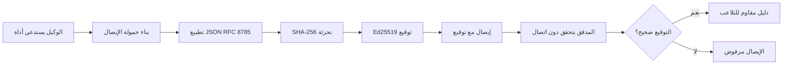

[شاهد فيديو الدرس: تأمين وكلاء الذكاء الاصطناعي بالإيصالات المشفرة](https://youtu.be/PLACEHOLDER_VIDEO_ID)

> _(فيديو الدرس والصورة المصغرة ستتم إضافتها من قبل فريق محتوى Microsoft بعد الدمج، بنفس نمط الدرس 14/15.)_

# تأمين وكلاء الذكاء الاصطناعي بالإيصالات المشفرة

## مقدمة

سيتناول هذا الدرس:

- لماذا تعتبر مسارات التدقيق لوكلاء الذكاء الاصطناعي مهمة للامتثال والتصحيح والثقة.
- ما هو الإيصال المشفر وكيف يختلف عن سجل نصي غير موقّع.
- كيفية إنتاج إيصال موقّع لاستدعاء أداة من قبل الوكيل باستخدام بايثون.
- كيفية التحقق من الإيصال دون اتصال واكتشاف التلاعب.
- كيفية ربط الإيصالات بحيث يؤدي حذف أو إعادة ترتيب واحد منها إلى كسر السلسلة.
- ما تثبته الإيصالات وما لا تثبته صراحةً.

## أهداف التعلم

بعد إكمال هذا الدرس، ستعرف كيفية:

- تحديد أنماط الفشل التي تبرر التوقيع المشفر لأفعال الوكيل.
- إنتاج إيصال موقّع بـ Ed25519 على حمولة JSON أساسية.
- التحقق من الإيصال بشكل مستقل باستخدام المفتاح العام للموقّع فقط.
- اكتشاف التلاعب عن طريق إعادة تشغيل التحقق على إيصال معدّل.
- بناء سلسلة من الإيصالات مربوطة بالتجزئة وشرح أهمية السلسلة.
- التعرف على الحدود بين ما تثبته الإيصالات (الإسناد، السلامة، الترتيب) وما لا تثبته (صحة الفعل، سلامة السياسة).

## المشكلة: مسار تدقيق وكيلك

تخيل أنك نشرت وكيل ذكاء اصطناعي لشركة Contoso Travel. الوكيل يقرأ طلبات العملاء، ويستدعي واجهة برمجة حجوزات الطيران للبحث عن الخيارات، ويحجز المقاعد نيابة عن العميل. في الربع الأخير، قام الوكيل بمعالجة 50,000 حجز.

اليوم يصل مدقق حسابات. يسأل سؤالًا بسيطًا: "أرني ماذا فعل وكيلك."

تعطيه ملفات السجلات الخاصة بك. ينظر إليها المدقق ويسأل السؤال الأصعب: "كيف أعرف أن هذه السجلات لم يتم تحريرها؟"

هذه هي مشكلة مسار التدقيق. معظم نشرات وكلاء الذكاء الاصطناعي اليوم تعتمد على:

- **سجلات التطبيق**: يكتبها الوكيل نفسه، قابلة للتعديل من قبل أي شخص لديه صلاحية الوصول لنظام الملفات.
- **خدمات التسجيل السحابية**: مقاومة للتلاعب على مستوى المنصة ولكن فقط إذا كان المدقق يثق بمشغّل المنصة.
- **سجلات معاملات قاعدة البيانات**: مناسبة لتغييرات قاعدة البيانات ولكن ليس لاستدعاءات الأدوات العشوائية.

لا يمكن لأي من هذه الإجابة على سؤال المدقق دون أن يثق المدقق بشخص ما (أنت، مزود الخدمة السحابية، بائع قاعدة البيانات). للاستخدام الداخلي، غالبًا ما تكون هذه الثقة مقبولة. لأعباء العمل الخاضعة للتنظيم (المالية، الرعاية الصحية، أي شيء يخضع لقانون الذكاء الاصطناعي الأوروبي)، فهي ليست كافية.

الإيصالات المشفرة تحل هذه المشكلة بجعل كل فعل من أفعال الوكيل قابلاً للتحقق بشكل مستقل. المدقق لا يحتاج إلى الثقة بك. يحتاج فقط إلى مفتاحك العام والإيصال نفسه.

## ما هو الإيصال المشفر؟

الإيصال هو كائن JSON يسجل ما فعله الوكيل، موقع بتوقيع رقمي.



إيصال بسيط يبدو هكذا:

```json
{
  "type": "agent.tool_call.v1",
  "agent_id": "contoso-travel-bot",
  "tool_name": "lookup_flights",
  "tool_args_hash": "sha256:a3f9c1...",
  "result_hash": "sha256:7b2e1d...",
  "policy_id": "contoso-travel-policy-v3",
  "timestamp": "2026-04-25T14:30:00Z",
  "sequence": 47,
  "previous_receipt_hash": "sha256:9d4e6a...",
  "signature": {
    "alg": "EdDSA",
    "sig": "c5af83...",
    "public_key": "8f3b2c..."
  }
}
```

كل إيصال يحتوي على:

| الحقل | الغرض |
|-------|---------|
| `type` | يميز الإيصالات عن أنواع البيانات الأخرى |
| `agent_id` | يحدد الوكيل الذي أنتج الفعل |
| `tool_name` | الأداة التي تم استدعاؤها |
| `tool_args_hash` | بصمة وسائط الاستدعاء |
| `result_hash` | بصمة نتيجة الأداة |
| `policy_id` | رابط لسياسة التشغيل وقت الفعل |
| `timestamp` | عندما حدث الفعل |
| `sequence` | عداد متزايد يفرض الترتيب |
| `previous_receipt_hash` | رابط تجزئة للإيصال السابق في السلسلة |
| `signature` | توقيع Ed25519 على كل ما سبق |

## تطبيق الإيصالات

نظام الإيصالات مبني على خطوتين: التوقيع والتحقق.

### تشغيل الإيصالات في وكيل

في الإنتاج، ستقوم بحقن خطوة توقيع في وسيط الوكيل. بعد كل استدعاء أداة، تقوم ببناء إيصال وحساب تجزئته SHA-256، ثم توقيعه بـ Ed25519 قبل تخزينه.

