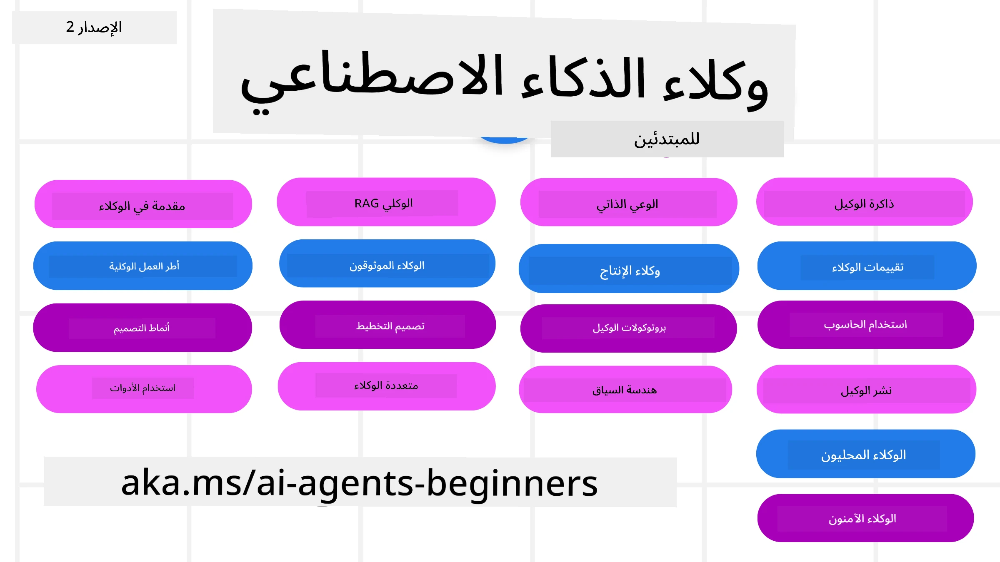

# وكلاء الذكاء الاصطناعي للمبتدئين - دورة تعليمية



## دورة تعلم كل ما تحتاج لمعرفته للبدء في بناء وكلاء الذكاء الاصطناعي

[](https://github.com/microsoft/ai-agents-for-beginners/blob/master/LICENSE?WT.mc_id=academic-105485-koreyst)
[](https://GitHub.com/microsoft/ai-agents-for-beginners/graphs/contributors/?WT.mc_id=academic-105485-koreyst)
[](https://GitHub.com/microsoft/ai-agents-for-beginners/issues/?WT.mc_id=academic-105485-koreyst)
[](https://GitHub.com/microsoft/ai-agents-for-beginners/pulls/?WT.mc_id=academic-105485-koreyst)
[](http://makeapullrequest.com?WT.mc_id=academic-105485-koreyst)

### 🌐 دعم متعدد اللغات

#### مدعوم عبر GitHub Action (آلي ودائم التحديث)

<!-- CO-OP TRANSLATOR LANGUAGES TABLE START -->
[العربية](./README.md) | [البنغالية](../bn/README.md) | [البلغارية](../bg/README.md) | [البرمية (ميانمار)](../my/README.md) | [الصينية (المبسطة)](../zh-CN/README.md) | [الصينية (التقليدية، هونغ كونغ)](../zh-HK/README.md) | [الصينية (التقليدية، ماكاو)](../zh-MO/README.md) | [الصينية (التقليدية، تايوان)](../zh-TW/README.md) | [الكرواتية](../hr/README.md) | [التشيكية](../cs/README.md) | [الدانماركية](../da/README.md) | [الهولندية](../nl/README.md) | [الإستونية](../et/README.md) | [الفنلندية](../fi/README.md) | [الفرنسية](../fr/README.md) | [الألمانية](../de/README.md) | [اليونانية](../el/README.md) | [العبرية](../he/README.md) | [الهندية](../hi/README.md) | [الهنغارية](../hu/README.md) | [الإندونيسية](../id/README.md) | [الإيطالية](../it/README.md) | [اليابانية](../ja/README.md) | [الكانادا](../kn/README.md) | [الخميرية](../km/README.md) | [الكورية](../ko/README.md) | [الليتوانية](../lt/README.md) | [الماليزية](../ms/README.md) | [المالايالامية](../ml/README.md) | [الماراثية](../mr/README.md) | [النيبالية](../ne/README.md) | [البيجين النيجيري](../pcm/README.md) | [النرويجية](../no/README.md) | [الفارسية (اللغة الفارسية)](../fa/README.md) | [البولندية](../pl/README.md) | [البرتغالية (البرازيل)](../pt-BR/README.md) | [البرتغالية (البرتغال)](../pt-PT/README.md) | [البنجابية (غيرموكي)](../pa/README.md) | [الرومانية](../ro/README.md) | [الروسية](../ru/README.md) | [الصربية (السيريلية)](../sr/README.md) | [السلوفاكية](../sk/README.md) | [السلوفينية](../sl/README.md) | [الإسبانية](../es/README.md) | [السواحيلية](../sw/README.md) | [السويدية](../sv/README.md) | [التاغالوغية (الفيليبينية)](../tl/README.md) | [التاميلية](../ta/README.md) | [التيلجو](../te/README.md) | [التايلاندية](../th/README.md) | [التركية](../tr/README.md) | [الأوكرانية](../uk/README.md) | [الأردية](../ur/README.md) | [الفيتنامية](../vi/README.md)

> **تفضل الاستنساخ محليًا؟**
>
> يتضمن هذا المستودع أكثر من 50 ترجمة للغات مما يزيد بشكل كبير من حجم التنزيل. للاستنساخ بدون الترجمات، استخدم السحب الجزئي:
>
> **Bash / macOS / Linux:**
> ```bash
> git clone --filter=blob:none --sparse https://github.com/microsoft/ai-agents-for-beginners.git
> cd ai-agents-for-beginners
> git sparse-checkout set --no-cone '/*' '!translations' '!translated_images'
> ```
>
> **CMD (Windows):**
> ```cmd
> git clone --filter=blob:none --sparse https://github.com/microsoft/ai-agents-for-beginners.git
> cd ai-agents-for-beginners
> git sparse-checkout set --no-cone "/*" "!translations" "!translated_images"
> ```
>
> هذا يمنحك كل ما تحتاجه لإكمال الدورة مع تنزيل أسرع بكثير.
<!-- CO-OP TRANSLATOR LANGUAGES TABLE END -->

**إذا كنت ترغب في دعم لغات ترجمة إضافية، فهي مدرجة [هنا](https://github.com/Azure/co-op-translator/blob/main/getting_started/supported-languages.md).**

[](https://GitHub.com/microsoft/ai-agents-for-beginners/watchers/?WT.mc_id=academic-105485-koreyst)
[](https://GitHub.com/microsoft/ai-agents-for-beginners/network/?WT.mc_id=academic-105485-koreyst)
[](https://GitHub.com/microsoft/ai-agents-for-beginners/stargazers/?WT.mc_id=academic-105485-koreyst)

[](https://discord.gg/nTYy5BXMWG)


## 🌱 البدء

هذه الدورة تحتوي على دروس تغطي أساسيات بناء وكلاء الذكاء الاصطناعي. كل درس يغطي موضوعه الخاص فابدأ من حيثما تريد!

هناك دعم متعدد اللغات لهذه الدورة. اذهب إلى [اللغات المتوفرة هنا](#-multi-language-support). 

إذا كانت هذه هي المرة الأولى التي تبني فيها باستخدام نماذج الذكاء الاصطناعي التوليدية، اطلع على دورتنا [الذكاء الاصطناعي التوليدي للمبتدئين](https://aka.ms/genai-beginners)، التي تتضمن 21 درسًا حول البناء باستخدام GenAI.

لا تنسَ [تقييم (🌟) هذا المستودع](https://docs.github.com/en/get-started/exploring-projects-on-github/saving-repositories-with-stars?WT.mc_id=academic-105485-koreyst) و[تشعب هذا المستودع](https://github.com/microsoft/ai-agents-for-beginners/fork) لتشغيل الكود.

### التقاء متعلمين آخرين، الحصول على إجابات لأسئلتك

إذا واجهت صعوبة أو كان لديك أي أسئلة حول بناء وكلاء الذكاء الاصطناعي، انضم إلى قناة Discord المخصصة في [Microsoft Foundry Discord](https://aka.ms/ai-agents/discord).

### ما تحتاجه 

كل درس في هذه الدورة يتضمن أمثلة كود، والتي يمكن العثور عليها في مجلد code_samples. يمكنك [تشعب هذا المستودع](https://github.com/microsoft/ai-agents-for-beginners/fork) لإنشاء نسخة خاصة بك.  

تستخدم أمثلة الكود في هذه التمارين إطار عمل Microsoft Agent مع خدمة Azure AI Foundry Agent V2:

- [Microsoft Foundry](https://aka.ms/ai-agents-beginners/ai-foundry) - يتطلب حساب Azure

تستخدم هذه الدورة أطر عمل وخدمات وكلاء الذكاء الاصطناعي التالية من Microsoft:

- [إطار عمل Microsoft Agent (MAF)](https://aka.ms/ai-agents-beginners/agent-framework)
- [خدمة Azure AI Foundry Agent V2](https://aka.ms/ai-agents-beginners/ai-agent-service)

تدعم بعض عينات الكود أيضًا مزودي خدمة متوافقين مع OpenAI مثل [MiniMax](https://platform.minimaxi.com/)، الذي يوفر نماذج سياق كبير (حتى 204 ألف رمز). راجع [إعداد الدورة](./00-course-setup/README.md) لتفاصيل التكوين.

لمزيد من المعلومات حول تشغيل الكود لهذه الدورة، اذهب إلى [إعداد الدورة](./00-course-setup/README.md).

## 🙏 هل تريد المساعدة؟

هل لديك اقتراحات أو وجدت أخطاء إملائية أو برمجية؟ [ارفع مشكلة](https://github.com/microsoft/ai-agents-for-beginners/issues?WT.mc_id=academic-105485-koreyst) أو [أنشئ طلب سحب](https://github.com/microsoft/ai-agents-for-beginners/pulls?WT.mc_id=academic-105485-koreyst)


## 📂 كل درس يتضمن

- درسًا مكتوبًا موجودًا في README وفيديو قصير
- أمثلة كود بايثون تستخدم إطار عمل Microsoft Agent مع Azure AI Foundry
- روابط لموارد إضافية لمواصلة التعلم


## 🗃️ الدروس

| **الدرس**                                   | **النص والكود**                                   | **الفيديو**                                            | **تعلم إضافي**                                                                 |
|----------------------------------------------|-------------------------------------------------|-------------------------------------------------------|--------------------------------------------------------------------------------|
| مقدمة عن وكلاء الذكاء الاصطناعي وحالات استخدام الوكلاء | [رابط](./01-intro-to-ai-agents/README.md)        | [فيديو](https://youtu.be/3zgm60bXmQk?si=z8QygFvYQv-9WtO1)  | [رابط](https://aka.ms/ai-agents-beginners/collection?WT.mc_id=academic-105485-koreyst) |
| استكشاف أطر عمل الوكلاء                         | [رابط](./02-explore-agentic-frameworks/README.md) | [فيديو](https://youtu.be/ODwF-EZo_O8?si=Vawth4hzVaHv-u0H)  | [رابط](https://aka.ms/ai-agents-beginners/collection?WT.mc_id=academic-105485-koreyst) |
| فهم أنماط تصميم الوكلاء                          | [رابط](./03-agentic-design-patterns/README.md)   | [فيديو](https://youtu.be/m9lM8qqoOEA?si=BIzHwzstTPL8o9GF)  | [رابط](https://aka.ms/ai-agents-beginners/collection?WT.mc_id=academic-105485-koreyst) |
| نمط تصميم استخدام الأدوات                        | [رابط](./04-tool-use/README.md)                    | [فيديو](https://youtu.be/vieRiPRx-gI?si=2z6O2Xu2cu_Jz46N)  | [رابط](https://aka.ms/ai-agents-beginners/collection?WT.mc_id=academic-105485-koreyst) |
| Agentic RAG                                  | [رابط](./05-agentic-rag/README.md)                | [فيديو](https://youtu.be/WcjAARvdL7I?si=gKPWsQpKiIlDH9A3)  | [رابط](https://aka.ms/ai-agents-beginners/collection?WT.mc_id=academic-105485-koreyst) |
| بناء وكلاء ذكاء اصطناعي موثوقين                   | [رابط](./06-building-trustworthy-agents/README.md)| [فيديو](https://youtu.be/iZKkMEGBCUQ?si=jZjpiMnGFOE9L8OK ) | [رابط](https://aka.ms/ai-agents-beginners/collection?WT.mc_id=academic-105485-koreyst) |
| نمط تصميم التخطيط                                | [رابط](./07-planning-design/README.md)            | [فيديو](https://youtu.be/kPfJ2BrBCMY?si=6SC_iv_E5-mzucnC)  | [رابط](https://aka.ms/ai-agents-beginners/collection?WT.mc_id=academic-105485-koreyst) |
| نمط تصميم الوكلاء المتعددين                       | [رابط](./08-multi-agent/README.md)                | [فيديو](https://youtu.be/V6HpE9hZEx0?si=rMgDhEu7wXo2uo6g)  | [رابط](https://aka.ms/ai-agents-beginners/collection?WT.mc_id=academic-105485-koreyst) |
| نمط تصميم ما وراء الإدراك                 | [رابط](./09-metacognition/README.md)               | [فيديو](https://youtu.be/His9R6gw6Ec?si=8gck6vvdSNCt6OcF)  | [رابط](https://aka.ms/ai-agents-beginners/collection?WT.mc_id=academic-105485-koreyst) |
| وكلاء الذكاء الاصطناعي في الإنتاج                      | [رابط](./10-ai-agents-production/README.md)        | [فيديو](https://youtu.be/l4TP6IyJxmQ?si=31dnhexRo6yLRJDl)  | [رابط](https://aka.ms/ai-agents-beginners/collection?WT.mc_id=academic-105485-koreyst) |
| استخدام البروتوكولات الوكيلية (MCP, A2A و NLWeb) | [رابط](./11-agentic-protocols/README.md)           | [فيديو](https://youtu.be/X-Dh9R3Opn8)                                 | [رابط](https://aka.ms/ai-agents-beginners/collection?WT.mc_id=academic-105485-koreyst) |
| هندسة السياق لوكلاء الذكاء الاصطناعي            | [رابط](./12-context-engineering/README.md)         | [فيديو](https://youtu.be/F5zqRV7gEag)                                 | [رابط](https://aka.ms/ai-agents-beginners/collection?WT.mc_id=academic-105485-koreyst) |
| إدارة الذاكرة الوكيل                      | [رابط](./13-agent-memory/README.md)     |      [فيديو](https://youtu.be/QrYbHesIxpw?si=vZkVwKrQ4ieCcIPx)                                                      |                                                                                        |
| استكشاف إطار عمل مايكروسوفت للوكيل                         | [رابط](./14-microsoft-agent-framework/README.md)                            |                                                            |                                                                                        |
| بناء وكلاء استخدام الحاسب الآلي (CUA)           | [رابط](./15-browser-use/README.md)     |                                                            | [رابط](https://docs.browser-use.com/examples/templates/playwright-integration)         |
| نشر الوكلاء القابلين للتوسع                    | قريباً                            |                                                            |                                                                                        |
| إنشاء وكلاء ذكاء اصطناعي محليين                     | قريباً                               |                                                            |                                                                                        |
| تأمين وكلاء الذكاء الاصطناعي                           | [رابط](./18-securing-ai-agents/README.md)  |                                                            | [رابط](https://aka.ms/ai-agents-beginners/collection?WT.mc_id=academic-105485-koreyst) |

## 🎒 دورات أخرى

فريقنا ينتج دورات أخرى! تفقد:

<!-- CO-OP TRANSLATOR OTHER COURSES START -->
### LangChain
[](https://aka.ms/langchain4j-for-beginners)
[](https://aka.ms/langchainjs-for-beginners?WT.mc_id=m365-94501-dwahlin)
[](https://github.com/microsoft/langchain-for-beginners?WT.mc_id=m365-94501-dwahlin)
---

### Azure / Edge / MCP / وكلاء
[](https://github.com/microsoft/AZD-for-beginners?WT.mc_id=academic-105485-koreyst)
[](https://github.com/microsoft/edgeai-for-beginners?WT.mc_id=academic-105485-koreyst)
[](https://github.com/microsoft/mcp-for-beginners?WT.mc_id=academic-105485-koreyst)
[](https://github.com/microsoft/ai-agents-for-beginners?WT.mc_id=academic-105485-koreyst)

---
 
### سلسلة الذكاء الاصطناعي التوليدي
[](https://github.com/microsoft/generative-ai-for-beginners?WT.mc_id=academic-105485-koreyst)
[-9333EA?style=for-the-badge&labelColor=E5E7EB&color=9333EA)](https://github.com/microsoft/Generative-AI-for-beginners-dotnet?WT.mc_id=academic-105485-koreyst)
[-C084FC?style=for-the-badge&labelColor=E5E7EB&color=C084FC)](https://github.com/microsoft/generative-ai-for-beginners-java?WT.mc_id=academic-105485-koreyst)
[-E879F9?style=for-the-badge&labelColor=E5E7EB&color=E879F9)](https://github.com/microsoft/generative-ai-with-javascript?WT.mc_id=academic-105485-koreyst)

---
 
### التعلم الأساسي
[](https://aka.ms/ml-beginners?WT.mc_id=academic-105485-koreyst)
[](https://aka.ms/datascience-beginners?WT.mc_id=academic-105485-koreyst)
[](https://aka.ms/ai-beginners?WT.mc_id=academic-105485-koreyst)
[](https://github.com/microsoft/Security-101?WT.mc_id=academic-96948-sayoung)
[](https://aka.ms/webdev-beginners?WT.mc_id=academic-105485-koreyst)
[](https://aka.ms/iot-beginners?WT.mc_id=academic-105485-koreyst)
[](https://github.com/microsoft/xr-development-for-beginners?WT.mc_id=academic-105485-koreyst)

---
 
### سلسلة مساعد الطيار
[](https://aka.ms/GitHubCopilotAI?WT.mc_id=academic-105485-koreyst)
[](https://github.com/microsoft/mastering-github-copilot-for-dotnet-csharp-developers?WT.mc_id=academic-105485-koreyst)
[](https://github.com/microsoft/CopilotAdventures?WT.mc_id=academic-105485-koreyst)
<!-- CO-OP TRANSLATOR OTHER COURSES END -->

## 🌟 شكر المجتمع

شكرًا لـ [شيفام جويل](https://www.linkedin.com/in/shivam2003/) على إسهامه بعينات شيفرة مهمة توضح RAG الوكيلي.

## المساهمة

يرحب هذا المشروع بالمساهمات والاقتراحات. معظم المساهمات تتطلب موافقتك على
اتفاقية ترخيص المساهم (CLA) التي تعلن بأن لديك الحق، وفي الواقع تمنحنا
الحقوق لاستخدام مساهمتك. للتفاصيل، قم بزيارة <https://cla.opensource.microsoft.com>.

عند تقديم طلب سحب، سيحدد بوت CLA تلقائيًا ما إذا كنت بحاجة لتوفير
اتفاقية CLA ويزين الطلب بشكل مناسب (مثلاً، تحقق الحالة، تعليق). فقط اتبع التعليمات
المقدمة من البوت. ستحتاج إلى عمل هذا مرة واحدة فقط عبر جميع المخازن التي تستخدم اتفاقيتنا.

اعتمد هذا المشروع على [مدونة قواعد السلوك المصدر المفتوح لمايكروسوفت](https://opensource.microsoft.com/codeofconduct/).
لمزيد من المعلومات راجع [الأسئلة الشائعة عن مدونة قواعد السلوك](https://opensource.microsoft.com/codeofconduct/faq/) أو
تواصل عبر [opencode@microsoft.com](mailto:opencode@microsoft.com) لأي أسئلة أو تعليقات إضافية.

## العلامات التجارية

قد يحتوي هذا المشروع على علامات تجارية أو شعارات لمشاريع أو منتجات أو خدمات. الاستخدام المصرح به لعلامات أو شعارات مايكروسوفت
يخضع ويجب أن يتبع
[إرشادات العلامات التجارية والهوية لمايكروسوفت](https://www.microsoft.com/legal/intellectualproperty/trademarks/usage/general).
يجب ألا يسبب استخدام علامات أو شعارات مايكروسوفت في نسخ معدلة من هذا المشروع لبسًا أو يوحي برعاية مايكروسوفت.
أي استخدام لعلامات أو شعارات لطرف ثالث يخضع لسياسات تلك الأطراف.

## الحصول على المساعدة


إذا واجهت مشكلة أو كانت لديك أي أسئلة حول بناء تطبيقات الذكاء الاصطناعي، انضم إلى:

[](https://aka.ms/foundry/discord)

إذا كان لديك ملاحظات على المنتج أو أخطاء أثناء البناء، قم بزيارة:

[](https://aka.ms/foundry/forum)

---

<!-- CO-OP TRANSLATOR DISCLAIMER START -->
**تنويه**:
تمت ترجمة هذا المستند باستخدام خدمة الترجمة بالذكاء الاصطناعي [Co-op Translator](https://github.com/Azure/co-op-translator). بينما نسعى للدقة، يرجى العلم أن الترجمات الآلية قد تحتوي على أخطاء أو عدم دقة. يجب اعتبار المستند الأصلي بلغته الأصلية المصدر الرسمي والمعتمد. للمعلومات الهامة، يُنصح بالاستعانة بترجمة بشرية محترفة. نحن غير مسؤولين عن أي سوء فهم أو تفسير ناتج عن استخدام هذه الترجمة.
<!-- CO-OP TRANSLATOR DISCLAIMER END -->