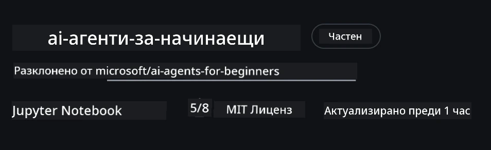

# Настройка на курса

## Въведение

Този урок обяснява как да изпълнявате примерите с код от този курс.

## Присъединете се към други учащи се и получете помощ

Преди да започнете да клонирате своето хранилище, присъединете се към [Discord канал за AI агенти за начинаещи](https://aka.ms/ai-agents/discord), за да получите помощ при настройката, да зададете въпроси за курса или да се свържете с други учащи се.

## Клониране или форкване на това хранилище

За да започнете, моля клонирайте или форкнете GitHub хранилището. Това ще направи ваша собствена версия на материала от курса, така че да можете да изпълнявате, тествате и променяте кода!

This can be done by clicking the link to <a href="https://github.com/microsoft/ai-agents-for-beginners/fork" target="_blank">форкнете хранилището</a>

You should now have your own forked version of this course in the following link:



### Непълно клониране (препоръчително за работилници / Codespaces)

  > Пълното хранилище може да бъде голямо (~3 GB), когато изтеглите пълната история и всички файлове. Ако присъствате само на работилницата или имате нужда само от няколко папки от урока, непълно клониране (или частично клониране) ще ви спести голяма част от това изтегляне чрез скъсяване на историята и/или пропускане на blob-овете.

#### Бързо непълно клониране — минимална история, всички файлове

Replace `<your-username>` in the below commands with your fork URL (or the upstream URL if you prefer).

To clone only the latest commit history (small download):

```bash|powershell
git clone --depth 1 https://github.com/<your-username>/ai-agents-for-beginners.git
```

To clone a specific branch:

```bash|powershell
git clone --depth 1 --branch <branch-name> https://github.com/<your-username>/ai-agents-for-beginners.git
```

#### Частично (sparse) клониране — минимални blob-ове + само избрани папки

This uses partial clone and sparse-checkout (requires Git 2.25+ and recommended modern Git with partial clone support):

```bash|powershell
git clone --depth 1 --filter=blob:none --sparse https://github.com/<your-username>/ai-agents-for-beginners.git
```

Traverse into the repo folder:

```bash|powershell
cd ai-agents-for-beginners
```

Then specify which folders you want (example below shows two folders):

```bash|powershell
git sparse-checkout set 00-course-setup 01-intro-to-ai-agents
```

After cloning and verifying the files, if you only need files and want to free space (no git history), please delete the repository metadata (💀irreversible — you will lose all Git functionality: no commits, pulls, pushes, or history access).

```bash
# zsh/bash
rm -rf .git
```

```powershell
# PowerShell
Remove-Item -Recurse -Force .git
```

#### Използване на GitHub Codespaces (препоръчително за избягване на големи локални изтегляния)

- Създайте нов Codespace за това хранилище чрез [потребителския интерфейс на GitHub](https://github.com/codespaces).  

- В терминала на току-що създадения Codespace стартирайте една от командите за shallow/sparse клониране по-горе, за да вкарате само необходимите папки от урока в работното пространство на Codespace.
- По избор: след клониране вътре в Codespaces, премахнете .git за да възвърнете допълнително пространство (вижте команди за премахване по-горе).
- Забележка: Ако предпочитате да отворите хранилището директно в Codespaces (без допълнително клониране), имайте предвид, че Codespaces ще създаде devcontainer средата и може все още да подготви повече от необходимо. Клониране на непълно копие вътре в чист Codespace ви дава повече контрол върху използването на дисково пространство.

#### Съвети

- Винаги заменяйте URL-а за клониране с вашия форк, ако искате да правите промени/комити.
- Ако по-късно се нуждаете от повече история или файлове, можете да ги изтеглите или да коригирате sparse-checkout, за да включите допълнителни папки.

## Стартиране на кода

Този курс предлага серия Jupyter тетрадки, които можете да изпълнявате, за да получите практически опит при изграждане на AI агенти.

Примерите с код използват **Microsoft Agent Framework (MAF)** с `AzureAIProjectAgentProvider`, който се свързва с **Azure AI Agent Service V2** (Responses API) чрез **Microsoft Foundry**.

Всички Python тетрадки са означени като `*-python-agent-framework.ipynb`.

## Изисквания

- Python 3.12+
  - **ЗАБЕЛЕЖКА**: Ако нямате инсталиран Python3.12, уверете се, че го инсталирате. След това създайте виртуалната среда (venv) с python3.12, за да се гарантира, че правилните версии ще бъдат инсталирани от файла requirements.txt.
  
    > Пример

    Create Python venv directory:

    ```bash|powershell
    python -m venv venv
    ```

    Then activate venv environment for:

    ```bash
    # zsh/bash
    source venv/bin/activate
    ```
  
    ```dos
    # Command Prompt for Windows
    venv\Scripts\activate
    ```

- .NET 10+: За примерните кодове, използващи .NET, уверете се, че сте инсталирали [.NET 10 SDK](https://dotnet.microsoft.com/download/dotnet/10.0) или по-нова версия. След това проверете инсталираната версия на .NET SDK:

    ```bash|powershell
    dotnet --list-sdks
    ```

- **Azure CLI** — Изисква се за удостоверяване. Инсталирайте от [aka.ms/installazurecli](https://aka.ms/installazurecli).
- **Azure Subscription** — За достъп до Microsoft Foundry и Azure AI Agent Service.
- **Microsoft Foundry Project** — Проект с разположен модел (напр. `gpt-4o`). Вижте [Стъпка 1](../../../00-course-setup) по-долу.

We have included a `requirements.txt` file in the root of this repository that contains all the required Python packages to run the code samples.

Можете да ги инсталирате, като изпълните следната команда в терминала в корена на хранилището:

```bash|powershell
pip install -r requirements.txt
```

Препоръчваме да създадете Python виртуална среда, за да избегнете конфликти и проблеми.

## Настройка на VSCode

Уверете се, че използвате правилната версия на Python във VSCode.


## Настройка на Microsoft Foundry и Azure AI Agent Service

### Стъпка 1: Създайте проект в Microsoft Foundry

Ще ви трябва Azure AI Foundry **hub** и **project** с разположен модел, за да изпълните тетрадките.

1. Отидете на [ai.azure.com](https://ai.azure.com) и влезте със своя Azure акаунт.
2. Създайте **hub** (или използвайте съществуващ). Вижте: [Hub resources overview](https://learn.microsoft.com/azure/ai-foundry/concepts/ai-resources).
3. Вътре в hub-а създайте **project**.
4. Разположете модел (напр. `gpt-4o`) от **Models + Endpoints** → **Deploy model**.

### Стъпка 2: Получаване на URL за проекта и името на разгръщането на модела

From your project in the Microsoft Foundry portal:

- **Project Endpoint** — Отидете на страницата **Overview** и копирайте URL-а на крайната точка.


- **Model Deployment Name** — Отидете на **Models + Endpoints**, изберете разположения модел и отбележете **Deployment name** (напр. `gpt-4o`).

### Стъпка 3: Впишете се в Azure с `az login`

Всички тетрадки използват **`AzureCliCredential`** за удостоверяване — няма API ключове за управление. Това изисква да сте влезли чрез Azure CLI.

1. **Инсталирайте Azure CLI** ако още не сте го направили: [aka.ms/installazurecli](https://aka.ms/installazurecli)

2. **Впишете се** чрез изпълнение на:

    ```bash|powershell
    az login
    ```

    Or if you're in a remote/Codespace environment without a browser:

    ```bash|powershell
    az login --use-device-code
    ```

3. **Изберете своя абонамент** ако бъдете подканени — изберете този, съдържащ вашия Foundry проект.

4. **Проверете** че сте влезли:

    ```bash|powershell
    az account show
    ```

> **Защо `az login`?** Тетрадките се удостоверяват чрез `AzureCliCredential` от пакета `azure-identity`. Това означава, че вашата Azure CLI сесия предоставя необходимите идентификационни данни — няма API ключове или тайни в `.env` файла ви. Това е [добра практика за сигурност](https://learn.microsoft.com/azure/developer/ai/keyless-connections).

### Стъпка 4: Създайте вашия `.env` файл

Копирайте примерния файл:

```bash
# zsh/bash
cp .env.example .env
```

```powershell
# PowerShell
Copy-Item .env.example .env
```

Отворете `.env` и попълнете тези две стойности:

```env
AZURE_AI_PROJECT_ENDPOINT=https://<your-project>.services.ai.azure.com/api/projects/<your-project-id>
AZURE_AI_MODEL_DEPLOYMENT_NAME=gpt-4o
```

| Променлива | Къде да го намерите |
|----------|-----------------|
| `AZURE_AI_PROJECT_ENDPOINT` | Портал на Foundry → вашия проект → страница **Overview** |
| `AZURE_AI_MODEL_DEPLOYMENT_NAME` | Портал на Foundry → **Models + Endpoints** → името на вашето разположено копие на модела |

Това е всичко за повечето уроци! Тетрадките ще се удостоверяват автоматично чрез вашата `az login` сесия.

### Стъпка 5: Инсталирайте Python зависимости

```bash|powershell
pip install -r requirements.txt
```

Препоръчваме да стартирате това вътре във виртуалната среда, която създадохте по-рано.

## Допълнителна настройка за Урок 5 (Agentic RAG)

Урок 5 използва **Azure AI Search** за retrieval-augmented generation. Ако планирате да изпълнявате този урок, добавете тези променливи към вашия `.env` файл:

| Променлива | Къде да го намерите |
|----------|-----------------|
| `AZURE_SEARCH_SERVICE_ENDPOINT` | Azure портал → вашият ресурс **Azure AI Search** → **Overview** → URL |
| `AZURE_SEARCH_API_KEY` | Azure портал → вашият ресурс **Azure AI Search** → **Settings** → **Keys** → primary admin key |

## Допълнителна настройка за Урок 6 и Урок 8 (GitHub Models)

Някои тетрадки в уроците 6 и 8 използват **GitHub Models** вместо Azure AI Foundry. Ако планирате да изпълнявате тези примери, добавете тези променливи в `.env` файла си:

| Променлива | Къде да го намерите |
|----------|-----------------|
| `GITHUB_TOKEN` | GitHub → **Settings** → **Developer settings** → **Personal access tokens** |
| `GITHUB_ENDPOINT` | Use `https://models.inference.ai.azure.com` (default value) |
| `GITHUB_MODEL_ID` | Model name to use (e.g. `gpt-4o-mini`) |

## Допълнителна настройка за Урок 8 (Bing Grounding Workflow)

The conditional workflow notebook in lesson 8 uses **Bing grounding** via Azure AI Foundry. If you plan to run that sample, add this variable to your `.env` file:

| Променлива | Къде да го намерите |
|----------|-----------------|
| `BING_CONNECTION_ID` | Azure AI Foundry портал → вашият проект → **Management** → **Connected resources** → вашата Bing връзка → копирайте connection ID |

## Отстраняване на неизправности

### Грешки при проверка на SSL сертификати в macOS

Ако използвате macOS и срещнете грешка като:

```plaintext
ssl.SSLCertVerificationError: [SSL: CERTIFICATE_VERIFY_FAILED] certificate verify failed: self-signed certificate in certificate chain
```

Това е известен проблем с Python на macOS, при който системните SSL сертификати не се доверяват автоматично. Опитайте следните решения по ред:

**Опция 1: Стартирайте скрипта Install Certificates на Python (препоръчително)**

```bash
# Заменете 3.XX с инсталираната версия на Python (например 3.12 или 3.13):
/Applications/Python\ 3.XX/Install\ Certificates.command
```

**Опция 2: Използвайте `connection_verify=False` в тетрадката си (само за тетрадките с GitHub Models)**

В тетрадката за Урок 6 (`06-building-trustworthy-agents/code_samples/06-system-message-framework.ipynb`) вече е включено закоментирано временно решение. Разкоментирайте `connection_verify=False`, когато създавате клиента:

```python
client = ChatCompletionsClient(
    endpoint=endpoint,
    credential=AzureKeyCredential(token),
    connection_verify=False,  # Деактивирайте проверката на SSL, ако срещнете грешки с сертификата
)
```

> **⚠️ Warning:** Деактивирането на проверката на SSL (`connection_verify=False`) намалява сигурността, като пропуска валидирането на сертификата. Използвайте това само като временно решение в развойни среди, никога в продукция.

**Опция 3: Инсталирайте и използвайте `truststore`**

```bash
pip install truststore
```

След това добавете следното в началото на тетрадката или скрипта си преди да направите каквито и да е мрежови повиквания:

```python
import truststore
truststore.inject_into_ssl()
```

## Закъсали някъде?

Ако имате някакви проблеми при изпълнението на тази настройка, включете се в нашия <a href="https://discord.gg/kzRShWzttr" target="_blank">Discord на общността на Azure AI</a> или <a href="https://github.com/microsoft/ai-agents-for-beginners/issues?WT.mc_id=academic-105485-koreyst" target="_blank">създайте issue</a>.

## Следващ урок

Сега сте готови да стартирате кода за този курс. Приятно учене и още открития в света на AI агентите! 

[Въведение в AI агенти и случаи на използване на агенти](../01-intro-to-ai-agents/README.md)

---

<!-- CO-OP TRANSLATOR DISCLAIMER START -->
Отказ от отговорност:
Този документ е преведен с помощта на AI преводаческа услуга Co-op Translator (https://github.com/Azure/co-op-translator). Въпреки че се стремим към точност, имайте предвид, че автоматизираните преводи могат да съдържат грешки или неточности. Оригиналният документ на езика, на който е първоначално написан, трябва да се счита за авторитетен източник. За критична информация се препоръчва професионален човешки превод. Не носим отговорност за никакви недоразумения или погрешни тълкувания, произтичащи от използването на този превод.
<!-- CO-OP TRANSLATOR DISCLAIMER END -->