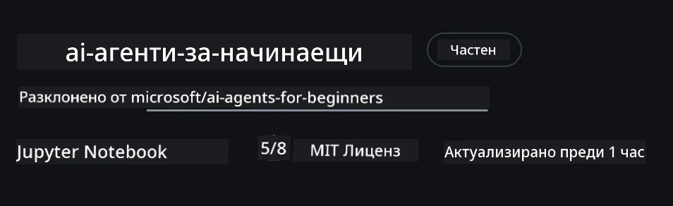
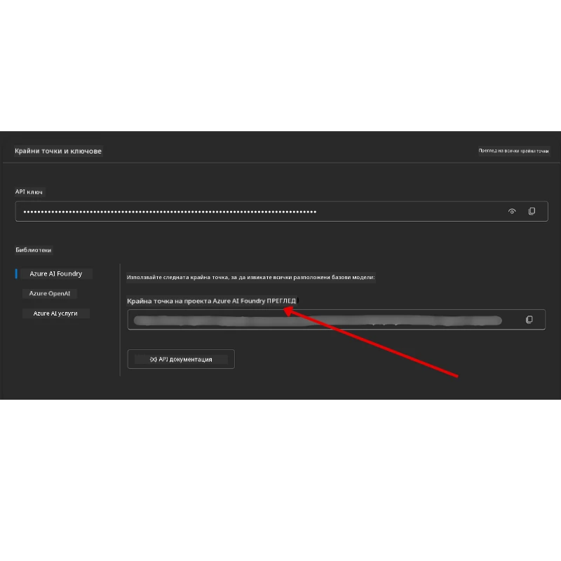

# Настройка на курса

## Въведение

В този урок ще разгледаме как да изпълнявате примерния код от този курс.

## Присъединете се към други учащи и получете помощ

Преди да започнете с клонирането на вашето хранилище, присъединете се към [AI Agents For Beginners Discord channel](https://aka.ms/ai-agents/discord), за да получите помощ с настройката, въпроси относно курса или да се свържете с други учащи.

## Клониране или форк на това хранилище

За да започнете, моля, клонирайте или форкнете GitHub хранилището. Това ще създаде ваша собствена версия на учебния материал, за да можете да изпълнявате, тествате и променяте кода!

Това може да се направи като кликнете на линка за <a href="https://github.com/microsoft/ai-agents-for-beginners/fork" target="_blank">форк на хранилището</a>

Сега трябва да имате собствен форкнат вариант на този курс на следния линк:



### Плитко клониране (препоръчително за работилница / Codespaces)

  >Цялото хранилище може да е голямо (~3 GB), ако изтеглите цялата история и всички файлове. Ако посещавате само работилницата или ви трябват само няколко папки с уроци, плиткото клониране (или оскъдното клониране) изтегля много по-малко.

#### Бързо плитко клониране — минимална история, всички файлове

Заменете `<your-username>` в командите по-долу с URL на вашия форк (или с upstream URL, ако предпочитате).

За да клонирате само най-новата история на комитите (малко изтегляне):

```bash
git clone --depth 1 https://github.com/<your-username>/ai-agents-for-beginners.git
```

За да клонирате конкретен клон:

```bash
git clone --depth 1 --branch <branch-name> https://github.com/<your-username>/ai-agents-for-beginners.git
```

#### Частично (оскъдно) клониране — минимални blob-ове + само избрани папки

Това използва частично клониране и sparse-checkout (изисква Git 2.25+ и се препоръчва модерен Git с поддръжка на частично клониране):

```bash
git clone --depth 1 --filter=blob:none --sparse https://github.com/<your-username>/ai-agents-for-beginners.git
```

Влезте в папката на хранилището:

```bash
cd ai-agents-for-beginners
```

След това посочете кои папки искате (примерът по-долу показва две папки):

```bash
git sparse-checkout set 00-course-setup 01-intro-to-ai-agents
```

След клониране и проверка на файловете, ако ви трябват само файловете и искате да освободите място (без история на git), моля изтрийте метаданните на хранилището (💀 необратимо — ще загубите цялата git функционалност):

```bash
# zsh/bash
rm -rf .git
```

```powershell
# PowerShell
Remove-Item -Recurse -Force .git
```

#### Използване на GitHub Codespaces (препоръчително за избягване на големи локални изтегляния)

- Създайте нов Codespace за това хранилище през [GitHub UI](https://github.com/codespaces).  

- В терминала на новосъздадения codespace стартирайте една от гореописаните команди за плитко/оскъдно клониране, за да донесете само нужните ви папки с уроци в работното пространство на Codespace.
- Опционално: след клониране в Codespaces, премахнете .git, за да си възвърнете допълнително пространство (вижте команди за премахване по-горе).
- Забележка: Ако предпочитате да отворите хранилището директно в Codespaces (без допълнително клониране), знайте, че Codespaces ще конструира devcontainer средата и може все пак да зареди повече от това, което ви трябва.

#### Съвети

- Винаги заменяйте URL за клониране с вашия форк, ако искате да редактирате/комитвате.
- Ако по-късно се нуждаете от повече история или файлове, можете да ги изтеглите, или да коригирате sparse-checkout, за да включите допълнителни папки.

## Стартиране на кода

Този курс предлага серия от Jupyter Notebooks, които можете да стартирате, за да получите практическо преживяване с изграждането на AI агенти.

Примерите в кода използват **Microsoft Agent Framework (MAF)** с `FoundryChatClient`, който се свързва с **Microsoft Foundry Agent Service V2** (API за отговори) чрез **Microsoft Foundry**.

Всички Python notebooks са маркирани като `*-python-agent-framework.ipynb`.

## Изисквания

- Python 3.12+
  - **ЗАБЕЛЕЖКА**: Ако нямате инсталиран Python3.12, уверете се, че го инсталирате. След това създайте вашата виртуална среда с python3.12, за да сте сигурни, че правилните версии се инсталират от файла requirements.txt.
  
    >Пример

    Създаване на директория за Python venv:

    ```bash
    python -m venv venv
    ```

    След това активирайте средата venv за:

    ```bash
    # zsh/bash
    source venv/bin/activate
    ```
  
    ```dos
    # Command Prompt for Windows
    venv\Scripts\activate
    ```

- .NET 10+: За примерния код, използващ .NET, уверете се, че сте инсталирали [.NET 10 SDK](https://dotnet.microsoft.com/download/dotnet/10.0) или по-нова версия. След това проверете версията на инсталирания .NET SDK:

    ```bash
    dotnet --list-sdks
    ```

- **Azure CLI** — Изисква се за удостоверяване. Инсталирайте от [aka.ms/installazurecli](https://aka.ms/installazurecli).
- **Azure абонамент** — За достъп до Microsoft Foundry и Microsoft Foundry Agent Service.
- **Microsoft Foundry проект** — Проект с внедрен модел (например `gpt-5-mini`). Вижте [Стъпка 1](#стъпка-1-създайте-microsoft-foundry-проект) по-долу.

В корена на това хранилище е включен файл `requirements.txt`, който съдържа всички необходими Python пакети за изпълнение на примерния код.

Можете да ги инсталирате, като изпълните следната команда в терминала в корена на хранилището:

```bash
pip install -r requirements.txt
```

Препоръчваме да създадете виртуална Python среда, за да избегнете конфликти и проблеми.

## Настройка на VSCode

Уверете се, че използвате правилната версия на Python във VSCode.


## Настройка на Microsoft Foundry и Microsoft Foundry Agent Service

### Стъпка 1: Създайте Microsoft Foundry проект

За да стартирате ноутбуците, ви е нужен Microsoft Foundry **hub** и **проект** с внедрен модел.

1. Отидете на [ai.azure.com](https://ai.azure.com) и влезте с вашия Azure акаунт.
2. Създайте **hub** (или използвайте съществуващ). Вижте: [Преглед на ресурсите на хъба](https://learn.microsoft.com/azure/ai-foundry/concepts/ai-resources).
3. Вътре в хъба създайте **проект**.
4. Внедрете модел (например `gpt-5-mini`) от **Models + Endpoints** → **Deploy model**.

### Стъпка 2: Извлечете URL на проекта и името на внедрен модел

От вашия проект в портала Microsoft Foundry:

- **Project Endpoint** — Отидете на страницата **Overview** и копирайте URL-то на endpoint.



- **Model Deployment Name** — Отидете на **Models + Endpoints**, изберете вашия внедрен модел и запишете името на **Deployment name** (например `gpt-5-mini`).

### Стъпка 3: Влезте в Azure с `az login`

Повечето ноутбуци се удостоверяват чрез вашето **Azure CLI вписване** — използвайки `AzureCliCredential` или `DefaultAzureCredential` (и двата използват сесията от `az login`) от пакета `azure-identity` — така че не се изискват API ключове. Някои уроци и опционални интеграции използват API ключове; проверете изискванията на всеки урок за допълнителни променливи на средата. Това налага да сте вписани чрез Azure CLI.

1. **Инсталирайте Azure CLI**, ако още не сте го направили: [aka.ms/installazurecli](https://aka.ms/installazurecli)

2. **Впишете се**, като изпълните:

    ```bash
    az login
    ```

    Или ако сте в отдалечена/Codespace среда без браузър:

    ```bash
    az login --use-device-code
    ```

3. **Изберете вашия абонамент**, ако бъде поискано — изберете този, който съдържа вашия Foundry проект.

4. **Проверете** дали сте вписани:

    ```bash
    az account show
    ```

> **Защо `az login`?** Ноутбуците се удостоверяват с помощта на `AzureCliCredential` (или `DefaultAzureCredential`, който също използва вашето вписване в Azure CLI) от пакета `azure-identity`. Това означава, че сесията ви в Azure CLI предоставя удостоверенията — без нужда от API ключове или тайни в `.env` файл. Това е [добра практика за сигурност](https://learn.microsoft.com/azure/developer/ai/keyless-connections).

### Стъпка 4: Създайте вашия `.env` файл

Копирайте примерния файл:

```bash
# zsh/bash
cp .env.example .env
```

```powershell
# PowerShell
Copy-Item .env.example .env
```

Отворете `.env` и попълнете тези две стойности:

```env
AZURE_AI_PROJECT_ENDPOINT=https://<your-project>.services.ai.azure.com/api/projects/<your-project-id>
AZURE_AI_MODEL_DEPLOYMENT_NAME=gpt-5-mini
```

| Променлива | Къде да я намерите |
|----------|-----------------|
| `AZURE_AI_PROJECT_ENDPOINT` | Портал Foundry → вашия проект → страница **Overview** |
| `AZURE_AI_MODEL_DEPLOYMENT_NAME` | Портал Foundry → **Models + Endpoints** → името на вашия внедрен модел |

Това е всичко за повечето уроци! Ноутбуците ще се удостоверят автоматично чрез сесията от `az login`.

### Стъпка 5: Инсталирайте Python зависимости

```bash
pip install -r requirements.txt
```

Препоръчваме да изпълните това вътре във виртуалната среда, която създадохте по-рано.

## Опционална настройка: Azure AI Search (Уроци 5 и 16)

Уроците 5 (Agentic RAG) и 16 ноутбуците работят веднага с **вътрешна база знания** — без допълнителни Azure ресурси. Ако искате да ги подсилите с реален индекс **Azure AI Search**, имайте предвид, че **ноутбукът от урок 16 в момента използва удостоверяване с ключ**: от паметта се превключва на Azure AI Search само когато са зададени **и** `AZURE_SEARCH_SERVICE_ENDPOINT`, **и** `AZURE_SEARCH_API_KEY`, в противен случай остава върху вграденото търсене — за да го стартирате срещу реален индекс, трябва да зададете и административния ключ. Ключовото удостоверяване с Microsoft Entra ID (RBAC) е препоръчителният подход за вашия собствен продукционен код, съобразен с `az login` потока, използван навсякъде в курса.

Следващите RBAC стъпки се прилагат към примерните ръководства и вашия собствен код. Те не активират ключови удостоверяване без ключ в урок 16; урок 16 все още изисква и endpoint, и администраторски ключ, за да използва Azure AI Search.

1. **Активирайте достъп на базата на роли** за вашата търсачна услуга:

    ```bash
    az search service update --name <service-name> --resource-group <resource-group> --auth-options aadOrApiKey
    ```

2. **Назначете си необходимите роли** (създаване/зареждане на индекси и заявки):

    ```bash
    az role assignment create --assignee <your-user-or-principal-id> --role "Search Service Contributor" --scope $(az search service show -g <resource-group> -n <service-name> --query id -o tsv)
    az role assignment create --assignee <your-user-or-principal-id> --role "Search Index Data Contributor" --scope $(az search service show -g <resource-group> -n <service-name> --query id -o tsv)
    ```

3. **Добавете endpoint** във вашия `.env` файл:

| Променлива | Къде да я намерите |
|----------|-----------------|
| `AZURE_SEARCH_SERVICE_ENDPOINT` | Azure портал → вашия ресурс **Azure AI Search** → **Overview** → URL |
| `AZURE_SEARCH_API_KEY` | Задължителен (с endpoint-а) за активиране на Azure AI Search в урок 16, който използва удостоверяване с ключ. Azure портал → **Settings** → **Keys** → основен администраторски ключ |

> **Защо безключово?** Администраторските ключове дават пълен достъп до писане до вашата търсачна услуга и могат да се изтекат чрез `.env` файлове. С RBAC се използва вместо това вашата идентичност от `az login` — същият безключов Entra ID модел, който използват ноутбуците в курса (чрез `AzureCliCredential` / `DefaultAzureCredential`). Вижте [Свързване към Azure AI Search с роли](https://learn.microsoft.com/azure/search/search-security-rbac).

Вижте [ръководството за настройка на Azure AI Search](./AzureSearch.md) за пълни примери за създаване на индекси на Python и .NET.

## Допълнителна настройка за уроците, които използват Azure OpenAI директно (Уроци 6 и 8)

Някои ноутбуци в уроци 6 и 8 използват **Azure OpenAI** директно (чрез **Responses API**) вместо да минават през Microsoft Foundry проект. Тези примери преди са използвали GitHub Models, който вече е остарял и не поддържа Responses API. Добавете тези променливи във вашия `.env` файл:

| Променлива | Къде да я намерите |
|----------|-----------------|
| `AZURE_OPENAI_ENDPOINT` | Azure портал → вашия ресурс **Azure OpenAI** → **Keys and Endpoint** → Endpoint (напр. `https://<your-resource>.openai.azure.com`) |
| `AZURE_OPENAI_DEPLOYMENT` | Името на вашия внедрен модел (напр. `gpt-5-mini`), който поддържа Responses API |
| `AZURE_OPENAI_API_KEY` | По желание — само ако използвате удостоверяване с ключ вместо `az login` / Entra ID |

> Responses API използва стабилен `/openai/v1/` endpoint и не изисква `api-version`. Впишете се с `az login` за използване на безключово удостоверяване с Entra ID.

## Алтернативен доставчик: MiniMax (съвместим с OpenAI)

[MiniMax](https://platform.minimaxi.com/) осигурява модели с голям контекст (до 204K токена) чрез OpenAI-съвместимо API. Тъй като Microsoft Agent Framework и `OpenAIChatClient` работят с всякакъв OpenAI-съвместим endpoint, можете да използвате MiniMax като заместител за уроците, които използват `OpenAIChatClient`.

Добавете тези променливи във вашия `.env` файл:

| Променлива | Къде да я намерите |
|----------|-----------------|
| `MINIMAX_API_KEY` | [MiniMax Platform](https://platform.minimaxi.com/) → API Keys |
| `MINIMAX_BASE_URL` | Използвайте `https://api.minimax.io/v1` (по подразбиране) |
| `MINIMAX_MODEL_ID` | Име на модела за използване (напр., `MiniMax-M3`) |

**Примери модели**: `MiniMax-M3` (препоръчително), `MiniMax-M2.7`, `MiniMax-M2.7-highspeed` (по-бързи отговори). Имената и наличността на моделите могат да се променят с времето, а достъпът до даден модел може да зависи от вашия акаунт.

Примерите в кода, използващи `OpenAIChatClient` (например workflow за резервации в урок 14) автоматично ще открият и използват вашата MiniMax конфигурация, когато `MINIMAX_API_KEY` е зададен.


## Алтернативен доставчик: Foundry Local (Изпълнение на модели на устройството)

[Foundry Local](https://foundrylocal.ai) е леко изпълнение, което изтегля, управлява и обслужва езикови модели **изцяло на вашия собствен компютър** чрез съвместим с OpenAI API — без необходимост от облак.

Тъй като `OpenAIChatClient` на Microsoft Agent Framework работи с всяка съвместима с OpenAI крайна точка, Foundry Local е готов за използване локален заместител на Azure OpenAI.

**1. Инсталирайте Foundry Local**

```bash
# Windows
winget install Microsoft.FoundryLocal

# macOS
brew install foundrylocal
```

**2. Изтеглете и стартирайте модел** (това също стартира локалната услуга):

```bash
foundry model list          # виж наличните модели
foundry model run phi-4-mini
```

**3. Инсталирайте Python SDK** за откриване на локалната крайна точка:

```bash
pip install foundry-local-sdk
```

**4. Насочете Microsoft Agent Framework към вашия локален модел:**

```python
from foundry_local import FoundryLocalManager
from agent_framework.openai import OpenAIChatClient

# Изтегля (ако е необходимо) и обслужва модела локално, след това открива крайна точка/порт.
manager = FoundryLocalManager("phi-4-mini")

chat_client = OpenAIChatClient(
    base_url=manager.endpoint,      # например http://localhost:<port>/v1
    api_key=manager.api_key,        # винаги "не е задължително" за Foundry Local
    model_id=manager.get_model_info("phi-4-mini").id,
)

agent = chat_client.as_agent(
    name="LocalAgent",
    instructions="You are a helpful assistant running fully on-device.",
)
```

> **Забележка:** Foundry Local предлага OpenAI-съвместима крайна точка за **Chat Completions**. Използвайте я за локална разработка и офлайн сценарии. За пълен набор функции на **Responses API** (състояния на разговори и др.) използвайте Azure OpenAI или проект Microsoft Foundry.

## Допълнителна настройка за урок 8 (Процес за основаване на Bing)

Условният работен поток в урок 8 използва **основаване на Bing** чрез Microsoft Foundry. Ако възнамерявате да изпълните този пример, добавете тази променлива във вашия `.env` файл:

| Променлива | Къде да я намерите |
|----------|-----------------|
| `BING_CONNECTION_ID` | Портал Microsoft Foundry → ваш проект → **Управление** → **Свързани ресурси** → вашата Bing връзка → копирайте ID на връзката |

## Отстраняване на проблеми

### Грешки при проверка на SSL сертификат на macOS

Ако сте на macOS и срещнете грешка като:

```plaintext
ssl.SSLCertVerificationError: [SSL: CERTIFICATE_VERIFY_FAILED] certificate verify failed: self-signed certificate in certificate chain
```

Това е известен проблем с Python на macOS, където системните SSL сертификати не се доверяват автоматично. Опитайте следните решения по ред:

**Опция 1: Стартирайте скрипта Install Certificates на Python (препоръчително)**

```bash
# Заменете 3.XX с инсталираната версия на Python (например, 3.12 или 3.13):
/Applications/Python\ 3.XX/Install\ Certificates.command
```

**Опция 2: Използвайте `connection_verify=False` в своя тетрадка (само за GitHub Models тетрадки)**

В тетрадката на Урок 6 (`06-building-trustworthy-agents/code_samples/06-system-message-framework.ipynb`) вече има коментиран заобиколен метод. Премахнете коментара от `connection_verify=False`, когато срещнете грешки с сертификата:

```python
client = ChatCompletionsClient(
    endpoint=endpoint,
    credential=AzureKeyCredential(token),
    connection_verify=False,  # Деактивирайте проверката на SSL, ако срещнете грешки с сертификата
)
```

> **⚠️ Внимание:** Изключването на проверката на SSL (`connection_verify=False`) намалява сигурността, като пропуска валидирането на сертификата. Използвайте това само като временна мярка в среди за разработка. Никога не го използвайте в продукция.

**Опция 3: Инсталирайте и използвайте `truststore`**

```bash
pip install truststore
```

След това добавете следното в началото на вашата тетрадка или скрипт преди да направите мрежови повиквания:

```python
import truststore
truststore.inject_into_ssl()
```

## Застрял ли сте някъде?

Ако имате проблеми с тази настройка, присъединете се към нашия <a href="https://discord.gg/kzRShWzttr" target="_blank">Azure AI Community Discord</a> или <a href="https://github.com/microsoft/ai-agents-for-beginners/issues?WT.mc_id=academic-105485-koreyst" target="_blank">създайте ново съобщение за проблем</a>.

## Следващ урок

Сега сте готови да изпълните кода за този курс. Приятно учене за света на AI агентите! 

[Въведение в AI агентите и случаи на употреба на агентите](../01-intro-to-ai-agents/README.md)

---

<!-- CO-OP TRANSLATOR DISCLAIMER START -->
**Отказ от отговорност**:
Този документ е преведен с помощта на AI преводачески услуга [Co-op Translator](https://github.com/Azure/co-op-translator). Въпреки че се стремим към точност, моля имайте предвид, че автоматизираните преводи могат да съдържат грешки или неточности. Оригиналният документ на неговия роден език трябва да се счита за авторитетен източник. За критична информация се препоръчва професионален човешки превод. Ние не носим отговорност за каквито и да е недоразумения или неправилни тълкувания, произтичащи от използването на този превод.
<!-- CO-OP TRANSLATOR DISCLAIMER END -->