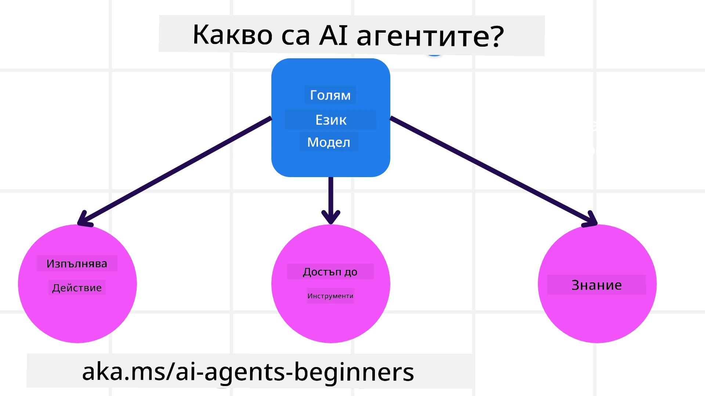
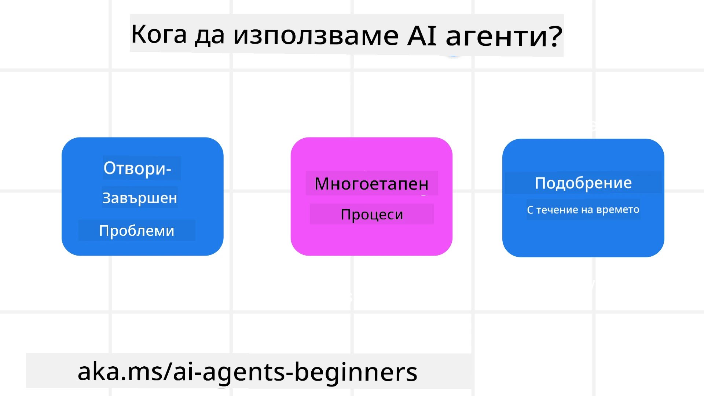

> _(Кликнете върху изображението по-горе, за да гледате видеото на този урок)_

# Въведение в AI агенти и случаи на използване на агенти

Welcome to the "AI Agents for Beginners" course! This course provides fundamental knowledge and applied samples for building AI Agents.

Join the <a href="https://discord.gg/kzRShWzttr" target="_blank">Azure AI Discord общност</a> to meet other learners and AI Agent Builders and ask any questions you have about this course.

To start this course, we begin by getting a better understanding of what AI Agents are and how we can use them in the applications and workflows we build.

## Introduction

This lesson covers:

- Какво представляват AI агентите и кои са различните типове агенти?
- За кои случаи на използване са най-подходящи AI агентите и как могат да ни помогнат?
- Кои са някои от основните градивни елементи при проектирането на агентни решения?

## Learning Goals
After completing this lesson, you should be able to:

- Да разберете концепциите за AI агентите и как те се различават от други AI решения.
- Да прилагате AI агенти по най-ефикасен начин.
- Да проектирате агентни решения продуктивно както за потребителите, така и за клиентите.

## Defining AI Agents and Types of AI Agents

### What are AI Agents?

AI агентите са **системи**, които позволяват на **големи езикови модели(LLMs)** да **извършват действия** чрез разширяване на техните възможности, като предоставят на LLMs **достъп до инструменти** и **знание**.

Let's break this definition into smaller parts:

- **Система** - Важно е да се мисли за агентите не просто като единичен компонент, а като система от много компоненти. На базово ниво компонентите на AI агента са:
  - **Среда** - Дефинираното пространство, в което AI агентът оперира. Например, ако имаме AI агент за резервации при пътуване, средата може да бъде системата за резервации, която AI агентът използва за изпълнение на задачи.
  - **Сензори** - Средите имат информация и предоставят обратна връзка. AI агентите използват сензори, за да събират и тълкуват тази информация за текущото състояние на средата. В примера с агента за резервации при пътуване, системата за резервации може да предоставя информация като наличност на хотели или цени на полети.
  - **Изпълнители** - След като AI агентът получи текущото състояние на средата, за текущата задача агентът определя кое действие да извърши, за да промени средата. За агента за резервации при пътуване това може да бъде резервиране на налична стая за потребителя.

**Големи езикови модели** - Концепцията за агенти е съществувала преди създаването на LLMs. Предимството да се изграждат AI агенти с LLMs е тяхната способност да тълкуват човешкия език и данни. Тази способност позволява на LLMs да интерпретират информацията от средата и да определят план за промяна на средата.

**Извършване на действия** - Извън системите на AI агенти, LLMs са ограничени до ситуации, в които действието е генериране на съдържание или информация на база на подканата на потребителя. В рамките на системите на AI агенти, LLMs могат да изпълняват задачи чрез тълкуване на заявката на потребителя и използване на инструменти, налични в тяхната среда.

**Достъп до инструменти** - До кои инструменти LLM има достъп се определя от 1) средата, в която оперира, и 2) разработчикът на AI агента. В примера с нашия агент за пътувания инструментите на агента са ограничени от операциите, налични в системата за резервации, и/или разработчикът може да ограничи достъпа на агента до полети.

**Памет+Знание** - Паметта може да бъде краткосрочна в контекста на разговора между потребителя и агента. В дългосрочен план, извън информацията, предоставена от средата, AI агентите могат също да извличат знания от други системи, услуги, инструменти и дори от други агенти. В примера с агента за пътувания тези знания могат да бъдат информация за предпочитанията на потребителя при пътуване, намираща се в база данни на клиенти.

### The different types of agents

Now that we have a general definition of AI Agents, let us look at some specific agent types and how they would be applied to a travel booking AI agent.

| **Тип агент**                | **Описание**                                                                                                                       | **Пример**                                                                                                                                                                                                                   |
| ----------------------------- | ------------------------------------------------------------------------------------------------------------------------------------- | ----------------------------------------------------------------------------------------------------------------------------------------------------------------------------------------------------------------------------- |
| **Прости рефлексни агенти**      | Извършват незабавни действия въз основа на предварително дефинирани правила.                                                                                  | Агентът за пътувания тълкува контекста на имейла и препраща оплаквания за пътувания към обслужването на клиенти.                                                                                                                          |
| **Моделно-базирани рефлексни агенти** | Извършват действия въз основа на модел на света и промените в този модел.                                                              | Агентът за пътувания дава приоритет на маршрути с значителни ценови промени въз основа на достъп до исторически данни за ценообразуване.                                                                                                             |
| **Агенти, базирани на цели**         | Създават планове за постигане на конкретни цели чрез тълкуване на целта и определяне на действия за нейното достигане.                                  | Агентът за пътувания резервира пътуване, като определя необходимите транспортни приготовления (кола, обществен транспорт, полети) от текущото местоположение до дестинацията.                                                                                |
| **Агенти, базирани на полезност**      | Вземат предвид предпочитанията и количествено претеглят компромисите, за да определят как да постигнат целите.                                               | Агентът за пътувания максимизира полезността, като претегля удобството спрямо разхода при резервиране на пътуване.                                                                                                                                          |
| **Обучаващи се агенти**           | Подобряват се с времето чрез реагиране на обратна връзка и съответна корекция на действията.                                                        | Агентът за пътувания се усъвършенства чрез използване на обратна връзка от клиенти след пътуване, за да направи корекции в бъдещите резервации.                                                                                                               |
| **Йерархични агенти**       | Съдържат множество агенти в многослойна система, при която висшестепенните агенти разделят задачите на подсъставки за по-нисшестепенни агенти, които да ги изпълнят. | Агентът за пътувания анулира пътуване, като разделя задачата на подсъставки (например анулиране на конкретни резервации) и възлага на по-нискостоящи агенти да ги изпълнят, като докладват обратно на висшестепенния агент.                                     |
| **Мултиагентни системи (MAS)** | Агентите изпълняват задачи независимо, кооперативно или конкурентно.                                                           | Кооперативно: Няколко агента резервират конкретни услуги за пътуване като хотели, полети и развлечения. Конкурентно: Няколко агента управляват и се конкурират за общ график за резервации на хотел, за да настанят клиенти в хотела. |

## When to Use AI Agents

In the earlier section, we used the Travel Agent use-case to explain how the different types of agents can be used in different scenarios of travel booking. We will continue to use this application throughout the course.

Let's look at the types of use cases that AI Agents are best used for:

- **Отворени проблеми** - позволяват на LLM да определи необходимите стъпки за изпълнение на задача, тъй като това не винаги може да бъде твърдо кодирано в работен поток.
- **Многостъпкови процеси** - задачи, които изискват ниво на сложност, при което AI агентът трябва да използва инструменти или информация през множество ходове, вместо чрез еднократно извличане.  
- **Подобрение с течение на времето** - задачи, при които агентът може да се подобрява с времето, като получава обратна връзка от средата или от потребителите, за да предоставя по-висока полезност.

We cover more considerations of using AI Agents in the Building Trustworthy AI Agents lesson.

## Basics of Agentic Solutions

### Agent Development

The first step in designing an AI Agent system is to define the tools, actions, and behaviors. In this course, we focus on using the **Azure AI Agent Service** to define our Agents. It offers features like:

- Избор на отворени модели като OpenAI, Mistral и Llama
- Използване на лицензирани данни чрез доставчици като Tripadvisor
- Използване на стандартизирани OpenAPI 3.0 инструменти

### Agentic Patterns

Communication with LLMs is through prompts. Given the semi-autonomous nature of AI Agents, it isn't always possible or required to manually reprompt the LLM after a change in the environment. We use **Агентни шаблони** that allow us to prompt the LLM over multiple steps in a more scalable way.

This course is divided into some of the current popular Agentic patterns.

### Agentic Frameworks

Agentic Frameworks allow developers to implement agentic patterns through code. These frameworks offer templates, plugins, and tools for better AI Agent collaboration. These benefits provide abilities for better observability and troubleshooting of AI Agent systems.

In this course, we will explore the Microsoft Agent Framework (MAF) for building production-ready AI agents.

## Sample Codes

- Python: [Agent Framework](./code_samples/01-python-agent-framework.ipynb)
- .NET: [Agent Framework](./code_samples/01-dotnet-agent-framework.md)

## Got More Questions about AI Agents?

Join the [Microsoft Foundry Discord](https://aka.ms/ai-agents/discord) to meet with other learners, attend office hours and get your AI Agents questions answered.

## Previous Lesson

[Настройка на курса](../00-course-setup/README.md)

## Next Lesson

[Изследване на агентни рамки](../02-explore-agentic-frameworks/README.md)

---

<!-- CO-OP TRANSLATOR DISCLAIMER START -->
Отказ от отговорност:
Този документ е преведен с помощта на AI преводаческа услуга Co-op Translator (https://github.com/Azure/co-op-translator). Въпреки че се стремим към точност, моля, имайте предвид, че автоматичните преводи могат да съдържат грешки или неточности. Оригиналният документ на езика, на който е написан, трябва да се счита за авторитетен източник. За критична информация се препоръчва професионален превод, извършен от квалифициран преводач. Не носим отговорност за каквито и да е недоразумения или погрешни тълкувания, възникнали в резултат на използването на този превод.
<!-- CO-OP TRANSLATOR DISCLAIMER END -->