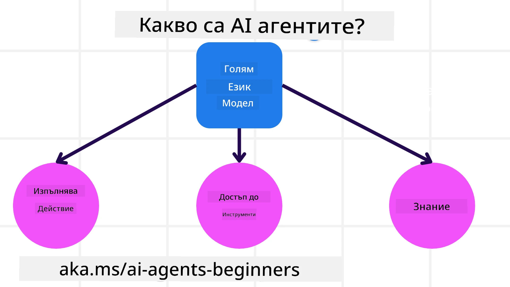
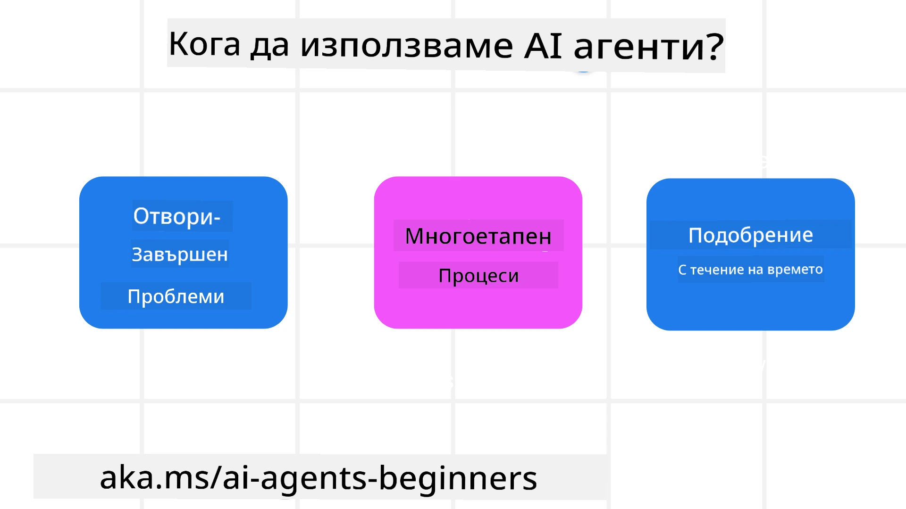

> _(Кликнете върху изображението по-горе, за да гледате видеото за този урок)_

# Въведение в AI агенти и случаи на използване на агенти

Добре дошли в курса **AI агенти за начинаещи**! Този курс ви предоставя основни знания — и реален работещ код — за да започнете да създавате AI агенти от нулата.

Елате да кажете здравей в <a href="https://discord.gg/kzRShWzttr" target="_blank">Azure AI Discord общността</a> — пълна е с обучаващи се и създатели на AI, които с радост отговарят на въпроси.

Преди да започнем да изграждаме, нека се уверим, че наистина разбираме какво е AI агент и кога има смисъл да използваме такъв.

---

## Въведение

Този урок покрива:

- Какво са AI агенти и различните видове, които съществуват
- За какви видове задачи AI агентите са най-подходящи
- Основните градивни елементи, които ще използвате при проектиране на агентско решение

## Цели на обучението

До края на този урок трябва да можете да:

- Обясните какво е AI агент и как се различава от обичайно AI решение
- Разберете кога да използвате AI агент (и кога не)
- Набележите базисен дизайн на агентско решение за реален проблем

---

## Дефиниране на AI агенти и видове AI агенти

### Какво са AI агенти?

Ето един прост начин да го мислим:

> **AI агентите са системи, които позволяват на големите езикови модели (LLM) всъщност да *правят неща* — като им дават инструменти и знания да действат спрямо света, а не само да отговарят на запитвания.**

Нека разгледаме по-подробно:

- **Система** — AI агентът не е просто нещо едно. Това е колекция от части, които работят заедно. В своята същност всеки агент има три компонента:
  - **Среда** — Пространството, в което агентът работи. За агент, резервация на пътуване, това би била самата платформа за резервации.
  - **Сензори** — Как агентът чете текущото състояние на своята среда. Нашият агент за пътувания може да проверява наличност на хотели или цени на полети.
  - **Изпълнители** — Как агентът предприема действия. Агентът за пътувания може да резервира стая, да изпрати потвърждение или да отмени резервация.

- **Големи езикови модели** — Агентите съществуваха преди LLM, но LLM са това, което прави съвременните агенти толкова мощни. Те разбират естествения език, правят заключения за контекста и превръщат неясна потребителска заявка в конкретен план за действие.

- **Изпълняват действия** — Без агент, един LLM само генерира текст. В рамките на агентска система, LLM може всъщност да *изпълни* стъпки — търсене в база данни, извикване на API, изпращане на съобщение.

- **Достъп до инструменти** — Какви инструменти агентът може да използва зависи от (1) средата, в която работи и (2) какво разработчикът му е предоставил. Агент за пътувания може да търси полети, но да не може да редактира клиентски записи — всичко зависи от свързването.

- **Памет + Знания** — Агентите могат да имат краткосрочна памет (текущия разговор) и дългосрочна памет (клиентска база, минали взаимодействия). Агентът за пътувания може да "помни", че предпочитате места до прозореца.

---

### Различните видове AI агенти

Не всички агенти са направени по еднакъв начин. Ето обзор на основните видове, използвайки агента за резервация на пътувания като пример:

| **Тип агент** | **Какво прави** | **Пример с агент за пътуване** |
|---|---|---|
| **Прости рефлексни агенти** | Следва твърдо кодирани правила — няма памет, няма планиране. | Вижда жалба по имейл → препраща я към обслужване на клиенти. Това е всичко. |
| **Моделно базирани рефлексни агенти** | Поддържа вътрешен модел на света и го обновява при промени. | Следи исторически цени на полети и сигнализира маршрути, които изведнъж са скъпи. |
| **Целево базирани агенти** | Има конкретна цел и решава как да я постигне стъпка по стъпка. | Резервира цялото пътуване (полети, кола, хотел) от текущото ви местоположение до крайната дестинация. |
| **Агенти, базирани на полезност** | Не просто намира *някакво* решение — намира *най-доброто*, като преценява компромиси. | Балансира цена спрямо удобство, за да открие пътуване, което най-много отговаря на предпочитанията ви. |
| **Обучаващи се агенти** | Подобряват се с времето, учейки се от обратна връзка. | Адаптира бъдещите препоръки за резервации според резултатите от анкети след пътуванията. |
| **Йерархични агенти** | Високо ниво агент разделя работата на подзадачи и я делегира на подагенти. | Заявка за "отмяна на пътуване" се разделя на: отмени полет, отмени хотел, отмени кола под наем — всеки поет от подагент. |
| **Мултиагентни системи (MAS)** | Множество независими агенти работят заедно (или в конкуренция). | Кооперативно: отделни агенти се грижат за хотели, полети и развлечения. Конкурентно: няколко агенти се конкурират да запълнят хотелски стаи на най-добра цена. |

---

## Кога да използваме AI агенти

Само защото *можете* да използвате AI агент, не означава, че винаги *трябва*. Ето ситуациите, където агенти наистина блестят:

- **Отворени проблеми** — Когато стъпките за решаване на даден проблем не могат да бъдат предварително програмирани. Трябва LLM динамично да открива пътя.
- **Многостъпкови процеси** — Задачи, които изискват използване на инструменти в няколко завъртания, не само еднократно търсене или генериране.
- **Подобрение с времето** — Когато искате системата да се умножава и подобрява на базата на обратна връзка от потребителите или сигнали от средата.

Ще разгледаме по-дълбоко кога (и кога *не*) да използваме AI агенти в урока **Създаване на надеждни AI агенти** по-късно в курса.

---

## Основи на агентските решения

### Разработка на агент

Първото нещо, което правите при създаване на агент е да определите *какво може да прави* — неговите инструменти, действия и поведения.

В този курс използваме **Azure AI Agent Service** като основна платформа. Тя поддържа:

- Модели от доставчици като OpenAI, Mistral и Meta (Llama)
- Лицензирани данни от доставчици като Tripadvisor
- Стандартизирани определения на инструменти по OpenAPI 3.0

### Агентски шаблони

Вие комуникирате с LLM чрез заявки (prompts). При агенти не винаги можете ръчно да създавате всяка заявка — агентът трябва да действа през множество стъпки. Тук идват **Агентските шаблони**. Те са многократно използваеми стратегии за подаване на заявки и оркестрация на LLM по по-мащабируем и надежден начин.

Този курс е структуриран около най-често използваните и полезни агентски шаблони.

### Агентски рамки

Агентските рамки предоставят на разработчиците готови шаблони, инструменти и инфраструктура за изграждане на агенти. Те улесняват:

- Свързването на инструменти и функционалности
- Наблюдението на действията на агента (и дебъгване при проблеми)
- Сътрудничество между множество агенти

В този курс се фокусираме върху **Microsoft Agent Framework (MAF)** за създаване на агенти, готови за производство.

---

## Примери с код

Готови ли сте да го видите в действие? Ето примерите с код за този урок:

- 🐍 Python: [Agent Framework](./code_samples/01-python-agent-framework.ipynb)
- 🔷 .NET: [Agent Framework](./code_samples/01-dotnet-agent-framework.md)

---

## Имате въпроси?

Присъединете се към [Microsoft Foundry Discord](https://discord.com/invite/ATgtXmAS5D), за да се свържете с други обучаващи се, да посетите офис часове и да получите отговори на вашите въпроси за AI агенти от общността.

---

## Предишен урок

[Настройване на курса](../00-course-setup/README.md)

## Следващ урок

[Запознаване с агентските рамки](../02-explore-agentic-frameworks/README.md)

---

<!-- CO-OP TRANSLATOR DISCLAIMER START -->
**Отказ от отговорност**:
Този документ е преведен с помощта на AI преводачески услуга [Co-op Translator](https://github.com/Azure/co-op-translator). Въпреки че се стремим към точност, моля имайте предвид, че автоматизираните преводи могат да съдържат грешки или неточности. Оригиналният документ на неговия роден език трябва да се счита за авторитетен източник. За критична информация се препоръчва професионален човешки превод. Ние не носим отговорност за каквито и да е недоразумения или неправилни тълкувания, произтичащи от използването на този превод.
<!-- CO-OP TRANSLATOR DISCLAIMER END -->