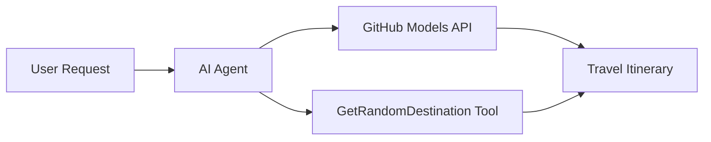

<!--
CO_OP_TRANSLATOR_METADATA:
{
  "original_hash": "23afd9be7b6ba5b69a44c3b6a78e07f6",
  "translation_date": "2025-11-06T10:06:38+00:00",
  "source_file": "01-intro-to-ai-agents/code_samples/01-dotnet-agent-framework.md",
  "language_code": "bg"
}
-->
# 🌍 AI туристически агент с Microsoft Agent Framework (.NET)

## 📋 Преглед на сценария

Тази тетрадка демонстрира как да създадете интелигентен агент за планиране на пътувания, използвайки Microsoft Agent Framework за .NET. Агентът може автоматично да генерира персонализирани маршрути за еднодневни екскурзии до случайни дестинации по света.

**Основни възможности:**
- 🎲 **Случаен избор на дестинация**: Използва персонализиран инструмент за избор на ваканционни места
- 🗺️ **Интелигентно планиране на пътувания**: Създава подробни маршрути ден по ден
- 🔄 **Поточно предаване в реално време**: Поддържа както незабавни, така и поточни отговори
- 🛠️ **Интеграция на персонализирани инструменти**: Демонстрира как да се разширят възможностите на агента

## 🔧 Техническа архитектура

### Основни технологии
- **Microsoft Agent Framework**: Най-новата .NET имплементация за разработка на AI агенти
- **Интеграция с GitHub Models**: Използва услугата за моделиране на GitHub за AI
- **Съвместимост с OpenAI API**: Използва клиентски библиотеки на OpenAI с персонализирани крайни точки
- **Сигурна конфигурация**: Управление на API ключове чрез среда

### Основни компоненти
1. **AIAgent**: Основният оркестратор на агента, който управлява потока на разговорите
2. **Персонализирани инструменти**: Функцията `GetRandomDestination()` достъпна за агента
3. **Chat Client**: Интерфейс за разговори, поддържан от GitHub Models
4. **Поддръжка на поточно предаване**: Възможности за генериране на отговори в реално време

### Модел на интеграция


## 🚀 Първи стъпки

**Предварителни изисквания:**
- .NET 10.0 или по-нова версия
- Достъп до GitHub Models API токен
- Конфигурирани променливи на средата в `.env` файл

**Необходими променливи на средата:**
```env
GITHUB_TOKEN=your_github_token
GITHUB_ENDPOINT=https://models.inference.ai.azure.com
GITHUB_MODEL_ID=gpt-4o-mini
```

Изпълнете примерния код по-долу последователно, за да видите туристическия агент в действие!

---

## .NET приложение в един файл: Пример за AI туристически агент

Вижте `01-dotnet-agent-framework.cs` за пълния примерен код, който може да се изпълни.

```bash
dotnet run 01-dotnet-agent-framework.cs
```

### Примерен код

```csharp
static string GetRandomDestination()
{
    var destinations = new List<string>
    {
        "Paris, France",
        "Tokyo, Japan",
        "New York City, USA",
        "Sydney, Australia",
        "Rome, Italy",
        "Barcelona, Spain",
        "Cape Town, South Africa",
        "Rio de Janeiro, Brazil",
        "Bangkok, Thailand",
        "Vancouver, Canada"
    };
    var random = new Random();
    int index = random.Next(destinations.Count);
    return destinations[index];
}

// Extract configuration from environment variables
var github_endpoint = Environment.GetEnvironmentVariable("GITHUB_ENDPOINT") ?? throw new InvalidOperationException("GITHUB_ENDPOINT is not set.");
var github_model_id = Environment.GetEnvironmentVariable("GITHUB_MODEL_ID") ?? "gpt-4o-mini";
var github_token = Environment.GetEnvironmentVariable("GITHUB_TOKEN") ?? throw new InvalidOperationException("GITHUB_TOKEN is not set.");

// Configure OpenAI Client Options
var openAIOptions = new OpenAIClientOptions()
{
    Endpoint = new Uri(github_endpoint)
};

// Initialize OpenAI Client with GitHub Models Configuration
var openAIClient = new OpenAIClient(new ApiKeyCredential(github_token), openAIOptions);

// Create AI Agent with Travel Planning Capabilities
AIAgent agent = openAIClient
    .GetChatClient(github_model_id)
    .CreateAIAgent(
        instructions: "You are a helpful AI Agent that can help plan vacations for customers at random destinations",
        tools: [AIFunctionFactory.Create(GetRandomDestination)]
    );

// Execute Agent: Plan a Day Trip (Non-Streaming)
Console.WriteLine(await agent.RunAsync("Plan me a day trip"));

// Execute Agent: Plan a Day Trip (Streaming Response)
await foreach (var update in agent.RunStreamingAsync("Plan me a day trip"))
{
    Console.Write(update);
}
```

---

**Отказ от отговорност**:  
Този документ е преведен с помощта на AI услуга за превод [Co-op Translator](https://github.com/Azure/co-op-translator). Въпреки че се стремим към точност, моля, имайте предвид, че автоматизираните преводи може да съдържат грешки или неточности. Оригиналният документ на неговия роден език трябва да се счита за авторитетен източник. За критична информация се препоръчва професионален човешки превод. Ние не носим отговорност за каквито и да било недоразумения или погрешни интерпретации, произтичащи от използването на този превод.