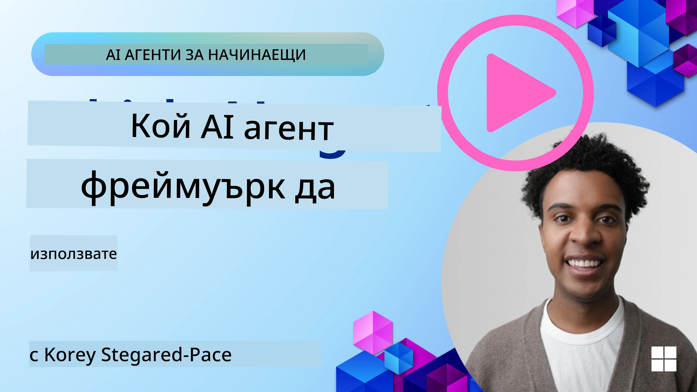

[](https://youtu.be/ODwF-EZo_O8?si=1xoy_B9RNQfrYdF7)

> _(Кликнете върху изображението по-горе, за да гледате видеото на този урок)_

# Проучване на рамките за AI агенти

Рамките за AI агенти са софтуерни платформи, създадени да опростят създаването, внедряването и управлението на AI агенти. Тези рамки предоставят на разработчиците предварително изградени компоненти, абстракции и инструменти, които улесняват разработката на сложни AI системи.

Тези рамки помагат на разработчиците да се фокусират върху уникалните аспекти на своите приложения, като осигуряват стандартизирани подходи към общите предизвикателства при разработката на AI агенти. Те повишават мащабируемостта, достъпността и ефективността при изграждането на AI системи.

## Introduction 

Този урок ще обхване:

- Какво представляват рамките за AI агенти и какво позволяват на разработчиците да постигнат?
- Как екипите могат да използват тези рамки за бързо прототипиране, итерация и подобряване на възможностите на техния агент?
- Какви са разликите между рамките и инструментите, създадени от Microsoft (<a href="https://aka.ms/ai-agents-beginners/ai-agent-service" target="_blank">Azure AI Agent Service</a> и <a href="https://learn.microsoft.com/azure/ai-services/openai/how-to/responses" target="_blank">Microsoft Agent Framework</a>)?
- Мога ли да интегрирам директно съществуващите си инструменти от екосистемата на Azure или ми трябват самостоятелни решения?
- Какво представлява услугата Azure AI Agents и как това ми помага?

## Learning goals

Целите на този урок са да ви помогнат да разберете:

- Ролята на рамките за AI агенти в разработката на AI.
- Как да използвате рамките за AI агенти за изграждане на интелигентни агенти.
- Ключовите възможности, които предоставят рамките за AI агенти.
- Разликите между Microsoft Agent Framework и Azure AI Agent Service.

## What are AI Agent Frameworks and what do they enable developers to do?

Традиционните AI рамки могат да ви помогнат да интегрирате AI в приложенията си и да направят тези приложения по-добри по следните начини:

- **Персонализация**: AI може да анализира поведението и предпочитанията на потребителите, за да предоставя персонализирани препоръки, съдържание и преживявания.
Пример: Потокови услуги като Netflix използват AI, за да предлагат филми и предавания въз основа на историята на гледане, което повишава ангажираността и удовлетворението на потребителите.
- **Автоматизация и ефективност**: AI може да автоматизира повтарящи се задачи, да оптимизира работните потоци и да подобри оперативната ефективност.
Пример: Приложения за обслужване на клиенти използват чатботове, захранвани с AI, за да обработват често срещани запитвания, намалявайки времето за отговор и освобождавайки човешките служители за по-сложни въпроси.
- **Подобрено потребителско изживяване**: AI може да подобри цялостното потребителско изживяване, като предоставя интелигентни функции като разпознаване на глас, обработка на естествен език и предсказуем текст.
Пример: Виртуални асистенти като Siri и Google Assistant използват AI, за да разбират и отговарят на гласови команди, улеснявайки взаимодействието на потребителите с техните устройства.

### That all sounds great right, so why do we need the AI Agent Framework?

Рамките за AI агенти представляват нещо повече от просто AI рамки. Те са проектирани да позволят създаването на интелигентни агенти, които могат да взаимодействат с потребители, други агенти и с околната среда, за да постигат конкретни цели. Тези агенти могат да проявяват автономно поведение, да вземат решения и да се адаптират към променящите се условия. Нека разгледаме някои ключови възможности, които предоставят рамките за AI агенти:

- **Сътрудничество и координация между агенти**: Позволява създаването на множество AI агенти, които могат да работят заедно, да комуникират и да координират дейността си за решаване на сложни задачи.
- **Автоматизация и управление на задачите**: Осигурява механизми за автоматизиране на многостъпкови работни процеси, делегиране на задачи и динамично управление на задачите между агентите.
- **Контекстуално разбиране и адаптация**: Оборудва агентите със способността да разбират контекста, да се адаптират към променяща се среда и да вземат решения въз основа на информация в реално време.

В обобщение, агентите ви позволяват да правите повече, да вдигнете автоматизацията на следващо ниво и да създадете по-интелигентни системи, които могат да се адаптират и да се учат от своята среда.

## How to quickly prototype, iterate, and improve the agent’s capabilities?

Това е бързо развиваща се област, но има някои неща, които са общи за повечето рамки за AI агенти и които могат да ви помогнат бързо да прототипирате и итерарате — а именно модулни компоненти, инструменти за сътрудничество и обучение в реално време. Нека разгледаме тези аспекти:

- **Използвайте модулни компоненти**: AI SDK-ове предлагат предварително изградени компоненти като AI и Memory конектори, извикване на функции чрез естествен език или плъгини за код, шаблони за подсказки и други.
- **Възползвайте се от инструменти за сътрудничество**: Проектирайте агенти с конкретни роли и задачи, което им позволява да тестват и усъвършенстват колаборативни работни потоци.
- **Учене в реално време**: Реализирайте обратни връзки, при които агентите се учат от взаимодействията и динамично адаптират поведението си.

### Use Modular Components

SDK-ове като Microsoft Agent Framework предлагат предварително изградени компоненти като AI конектори, дефиниции на инструменти и управление на агенти.

**Как екипите могат да използват тези**: Екипите могат бързо да сглобят тези компоненти, за да създадат функционален прототип без да започват от нулата, което позволява бързо експериментиране и итерации.

**Как работи в практиката**: Можете да използвате предварително изградeн парсър за извличане на информация от входа на потребителя, модул за памет за съхранение и извличане на данни и генератор на подсказки за взаимодействие с потребителите — всичко това без да изграждате тези компоненти отначало.

**Example code**. Нека разгледаме пример как можете да използвате Microsoft Agent Framework с `AzureAIProjectAgentProvider`, за да накарате модела да отговаря на вход от потребителя с извикване на инструменти:

``` python
# Пример за Microsoft Agent Framework на Python

import asyncio
import os
from typing import Annotated

from agent_framework.azure import AzureAIProjectAgentProvider
from azure.identity import AzureCliCredential


# Дефиниране на примерна функция на инструмент за резервация на пътуване
def book_flight(date: str, location: str) -> str:
    """Book travel given location and date."""
    return f"Travel was booked to {location} on {date}"


async def main():
    provider = AzureAIProjectAgentProvider(credential=AzureCliCredential())
    agent = await provider.create_agent(
        name="travel_agent",
        instructions="Help the user book travel. Use the book_flight tool when ready.",
        tools=[book_flight],
    )

    response = await agent.run("I'd like to go to New York on January 1, 2025")
    print(response)
    # Примерен изход: Вашият полет до Ню Йорк на 1 януари 2025 г. е успешно резервиран. Приятно пътуване! ✈️🗽


if __name__ == "__main__":
    asyncio.run(main())
```

От примера можете да видите как можете да използвате предварително изграден парсър за извличане на ключова информация от входа на потребителя, като например начална точка, дестинация и дата за заявка за резервация на полет. Този модулен подход ви позволява да се фокусирате върху логиката на високо ниво.

### Leverage Collaborative Tools

Рамки като Microsoft Agent Framework улесняват създаването на множество агенти, които могат да работят заедно.

**Как екипите могат да използват тези**: Екипите могат да проектират агенти с конкретни роли и задачи, което им позволява да тестват и усъвършенстват колаборативни работни потоци и да подобрят общата ефективност на системата.

**Как работи в практиката**: Можете да създадете екип от агенти, където всеки агент има специализирана функция, като извличане на данни, анализ или вземане на решения. Тези агенти могат да комуникират и да споделят информация, за да постигнат обща цел, като отговаряне на въпрос на потребител или изпълнение на задача.

**Example code (Microsoft Agent Framework)**:

```python
# Създаване на множество агенти, които работят заедно, използвайки Microsoft Agent Framework

import os
from agent_framework.azure import AzureAIProjectAgentProvider
from azure.identity import AzureCliCredential

provider = AzureAIProjectAgentProvider(credential=AzureCliCredential())

# Агент за извличане на данни
agent_retrieve = await provider.create_agent(
    name="dataretrieval",
    instructions="Retrieve relevant data using available tools.",
    tools=[retrieve_tool],
)

# Агент за анализ на данни
agent_analyze = await provider.create_agent(
    name="dataanalysis",
    instructions="Analyze the retrieved data and provide insights.",
    tools=[analyze_tool],
)

# Стартиране на агентите последователно върху задача
retrieval_result = await agent_retrieve.run("Retrieve sales data for Q4")
analysis_result = await agent_analyze.run(f"Analyze this data: {retrieval_result}")
print(analysis_result)
```

От предишния код се вижда как можете да създадете задача, включваща множество агенти, работещи заедно за анализ на данни. Всеки агент изпълнява специфична функция, а задачата се изпълнява чрез координация между агентите, за да се постигне желаният резултат. Създавайки специализирани агенти с определени роли, можете да подобрите ефективността и производителността на задачите.

### Learn in Real-Time

Разширените рамки предоставят възможности за разбиране на контекст в реално време и адаптация.

**Как екипите могат да използват тези**: Екипите могат да реализират обратни връзки, при които агентите се учат от взаимодействията и динамично коригират поведението си, водещо до непрекъснато подобряване и усъвършенстване на възможностите.

**Как работи в практиката**: Агентите могат да анализират обратна връзка от потребителите, данни от околната среда и резултати от задачи, за да обновят своята база знания, да коригират алгоритмите за вземане на решения и да подобрят производителността с времето. Този итеративен процес на обучение позволява на агентите да се адаптират към променящи се условия и предпочитания на потребителите, подобрявайки общата ефективност на системата.

## What are the differences between the Microsoft Agent Framework and Azure AI Agent Service?

Има много начини да се сравнят тези подходи, но нека разгледаме някои ключови разлики по отношение на дизайна, възможностите и целевите случаи на използване:

## Microsoft Agent Framework (MAF)

Microsoft Agent Framework предоставя опростен SDK за изграждане на AI агенти с помощта на `AzureAIProjectAgentProvider`. Той позволява на разработчиците да създават агенти, които използват модели на Azure OpenAI с вградено извикване на инструменти, управление на разговори и корпоративна сигурност чрез Azure идентичност.

**Сценарии на използване**: Изграждане на готови за продукция AI агенти с използване на инструменти, многостъпкови работни потоци и сценарии за интеграция в предприятия.

Ето някои важни основни концепции на Microsoft Agent Framework:

- **Агенти**. Агент се създава чрез `AzureAIProjectAgentProvider` и се конфигурира с име, инструкции и инструменти. Агентът може:
  - **Да обработва съобщения от потребители** и да генерира отговори с помощта на модели на Azure OpenAI.
  - **Да извиква инструменти** автоматично въз основа на контекста на разговора.
  - **Да поддържа състояние на разговора** през множество взаимодействия.

  Ето фрагмент от код, показващ как да се създаде агент:

    ```python
    import os
    from agent_framework.azure import AzureAIProjectAgentProvider
    from azure.identity import AzureCliCredential

    provider = AzureAIProjectAgentProvider(credential=AzureCliCredential())
    agent = await provider.create_agent(
        name="my_agent",
        instructions="You are a helpful assistant.",
    )

    response = await agent.run("Hello, World!")
    print(response)
    ```

- **Инструменти**. Рамката поддържа дефиниране на инструменти като Python функции, които агентът може да извиква автоматично. Инструментите се регистрират при създаване на агента:

    ```python
    def get_weather(location: str) -> str:
        """Get the current weather for a location."""
        return f"The weather in {location} is sunny, 72\u00b0F."

    agent = await provider.create_agent(
        name="weather_agent",
        instructions="Help users check the weather.",
        tools=[get_weather],
    )
    ```

- **Координация между множество агенти**. Можете да създавате множество агенти с различни специализации и да координирате работата им:

    ```python
    planner = await provider.create_agent(
        name="planner",
        instructions="Break down complex tasks into steps.",
    )

    executor = await provider.create_agent(
        name="executor",
        instructions="Execute the planned steps using available tools.",
        tools=[execute_tool],
    )

    plan = await planner.run("Plan a trip to Paris")
    result = await executor.run(f"Execute this plan: {plan}")
    ```

- **Интеграция с Azure Identity**. Рамката използва `AzureCliCredential` (или `DefaultAzureCredential`) за сигурна автентикация без ключове, елиминирайки необходимостта от управление на API ключове директно.

## Azure AI Agent Service

Azure AI Agent Service е по-скорошно допълнение, представено на Microsoft Ignite 2024. То позволява разработката и внедряването на AI агенти с по-гъвкави модели, като директно извикване на open-source LLM-и като Llama 3, Mistral и Cohere.

Azure AI Agent Service предоставя по-силни механизми за корпоративна сигурност и методи за съхранение на данни, което го прави подходящ за корпоративни приложения.

Работи веднага с Microsoft Agent Framework за изграждане и разгръщане на агенти.

Тази услуга в момента е в Публична предварителна версия и поддържа Python и C# за изграждане на агенти.

С помощта на Python SDK за Azure AI Agent Service можем да създадем агент с потребителски дефиниран инструмент:

```python
import asyncio
from azure.identity import DefaultAzureCredential
from azure.ai.projects import AIProjectClient

# Дефинирайте функции за инструменти
def get_specials() -> str:
    """Provides a list of specials from the menu."""
    return """
    Special Soup: Clam Chowder
    Special Salad: Cobb Salad
    Special Drink: Chai Tea
    """

def get_item_price(menu_item: str) -> str:
    """Provides the price of the requested menu item."""
    return "$9.99"


async def main() -> None:
    credential = DefaultAzureCredential()
    project_client = AIProjectClient.from_connection_string(
        credential=credential,
        conn_str="your-connection-string",
    )

    agent = project_client.agents.create_agent(
        model="gpt-4o-mini",
        name="Host",
        instructions="Answer questions about the menu.",
        tools=[get_specials, get_item_price],
    )

    thread = project_client.agents.create_thread()

    user_inputs = [
        "Hello",
        "What is the special soup?",
        "How much does that cost?",
        "Thank you",
    ]

    for user_input in user_inputs:
        print(f"# User: '{user_input}'")
        message = project_client.agents.create_message(
            thread_id=thread.id,
            role="user",
            content=user_input,
        )
        run = project_client.agents.create_and_process_run(
            thread_id=thread.id, agent_id=agent.id
        )
        messages = project_client.agents.list_messages(thread_id=thread.id)
        print(f"# Agent: {messages.data[0].content[0].text.value}")


if __name__ == "__main__":
    asyncio.run(main())
```

### Core concepts

Azure AI Agent Service има следните основни концепции:

- **Агент**. Azure AI Agent Service се интегрира с Microsoft Foundry. В рамките на AI Foundry, AI агент действа като "умен" микроуслуга, която може да се използва за отговаряне на въпроси (RAG), извършване на действия или пълна автоматизация на работни потоци. Това постига чрез комбиниране на мощта на генеративните AI модели с инструменти, които му позволяват да достъпва и взаимодейства с реални източници на данни. Ето пример за агент:

    ```python
    agent = project_client.agents.create_agent(
        model="gpt-4o-mini",
        name="my-agent",
        instructions="You are helpful agent",
        tools=code_interpreter.definitions,
        tool_resources=code_interpreter.resources,
    )
    ```

    В този пример, агент е създаден с модела `gpt-4o-mini`, име `my-agent` и инструкции `You are helpful agent`. Агентът е оборудван с инструменти и ресурси за изпълнение на задачи, свързани с интерпретиране на код.

- **Thread и съобщения**. Thread (нишката) е още една важна концепция. Тя представлява разговор или взаимодействие между агент и потребител. Нишките могат да се използват за проследяване на напредъка на разговор, съхраняване на контекстна информация и управление на състоянието на взаимодействието. Ето пример за нишка:

    ```python
    thread = project_client.agents.create_thread()
    message = project_client.agents.create_message(
        thread_id=thread.id,
        role="user",
        content="Could you please create a bar chart for the operating profit using the following data and provide the file to me? Company A: $1.2 million, Company B: $2.5 million, Company C: $3.0 million, Company D: $1.8 million",
    )
    
    # Ask the agent to perform work on the thread
    run = project_client.agents.create_and_process_run(thread_id=thread.id, agent_id=agent.id)
    
    # Fetch and log all messages to see the agent's response
    messages = project_client.agents.list_messages(thread_id=thread.id)
    print(f"Messages: {messages}")
    ```

    В предишния код е създадена нишка. След това се изпраща съобщение към нишката. Като се извика `create_and_process_run`, агентът е помолен да извърши работа върху нишката. Накрая съобщенията се извличат и записват, за да се види отговорът на агента. Съобщенията показват напредъка на разговора между потребителя и агента. Също така е важно да се разбере, че съобщенията могат да бъдат от различни типове, като текст, изображение или файл — например работата на агентите може да е довела до изображение или до текстов отговор. Като разработчик, вие след това можете да използвате тази информация, за да обработите допълнително отговора или да го представите на потребителя.

- **Интегрира се с Microsoft Agent Framework**. Azure AI Agent Service работи безпроблемно с Microsoft Agent Framework, което означава, че можете да изграждате агенти с `AzureAIProjectAgentProvider` и да ги внедрявате чрез Agent Service за продукционни сценарии.

**Сценарии на използване**: Azure AI Agent Service е проектирана за корпоративни приложения, които изискват сигурно, мащабируемо и гъвкаво разгръщане на AI агенти.

## What's the difference between these approaches?
 
Звучи като да има припокриване, но има някои ключови разлики по отношение на дизайна, възможностите и целевите случаи на използване:
 
- **Microsoft Agent Framework (MAF)**: Това е SDK, готов за продукция, за изграждане на AI агенти. Той предоставя опростен API за създаване на агенти с извикване на инструменти, управление на разговори и интеграция с Azure идентичност.
- **Azure AI Agent Service**: Това е платформа и услуга за разгръщане в Azure Foundry за агенти. Тя предлага вградена свързаност със услуги като Azure OpenAI, Azure AI Search, Bing Search и изпълнение на код.
 
Все още не сте сигурни коя да изберете?

### Use Cases
 
Нека видим дали можем да ви помогнем, като преминем през някои често срещани сценарии:
 
> Въпрос: Изграждам продукционни AI агент приложения и искам да започна бързо
>
>Отговор: Microsoft Agent Framework е отличен избор. Той предоставя прост, python-ичен API чрез `AzureAIProjectAgentProvider`, който ви позволява да дефинирате агенти с инструменти и инструкции само с няколко реда код.
 
> Въпрос: Имам нужда от корпоративно разгръщане с интеграции на Azure като Search и изпълнение на код
>
> Отговор: Azure AI Agent Service е най-подходящият избор. Това е платформа услуга, която предоставя вградени възможности за множество модели, Azure AI Search, Bing Search и Azure Functions. Лесно е да изграждате вашите агенти в Foundry портала и да ги разгръщате в мащаб.
 
> Въпрос: Все още съм объркан, просто ми дайте една опция
>
> Отговор: Започнете с Microsoft Agent Framework, за да изградите вашите агенти, и след това използвайте Azure AI Agent Service, когато трябва да ги внедрите и мащабирате в продукция. Този подход ви позволява бързо да итерате върху логиката на агента, като същевременно имате ясен път към корпоративно разгръщане.
 
Нека обобщим основните разлики в таблица:

| Framework | Focus | Core Concepts | Use Cases |
| --- | --- | --- | --- |
| Microsoft Agent Framework | Оптимизиран SDK за агенти с възможност за извикване на инструменти | Агенти, Инструменти, Azure идентичност | Изграждане на AI агенти, използване на инструменти, многостъпкови работни потоци |
| Azure AI Agent Service | Гъвкави модели, корпоративна сигурност, генериране на код, извикване на инструменти | Модулност, Сътрудничество, Оркестрация на процеси | Сигурно, мащабируемо и гъвкаво разгръщане на AI агенти |

## Can I integrate my existing Azure ecosystem tools directly, or do I need standalone solutions?
Отговорът е да — можете да интегрирате съществуващите си инструменти от екосистемата Azure директно с Azure AI Agent Service, тъй като той е създаден да работи безпроблемно с другите услуги на Azure. Например можете да интегрирате Bing, Azure AI Search и Azure Functions. Има и дълбока интеграция с Microsoft Foundry.

Microsoft Agent Framework също се интегрира с Azure услуги чрез `AzureAIProjectAgentProvider` и Azure identity, което ви позволява да извиквате Azure услуги директно от вашите агентни инструменти.

## Примери за код

- Python: [Agent Framework](./code_samples/02-python-agent-framework.ipynb)
- .NET: [Agent Framework](./code_samples/02-dotnet-agent-framework.md)

## Имате ли още въпроси относно рамките за AI агенти?

Присъединете се към [Microsoft Foundry Discord](https://aka.ms/ai-agents/discord), за да се срещнете с други обучаващи се, да участвате в консултации и да получите отговори на въпросите си за AI агенти.

## Препратки

- <a href="https://techcommunity.microsoft.com/blog/azure-ai-services-blog/introducing-azure-ai-agent-service/4298357" target="_blank">Azure Agent Service</a>
- <a href="https://learn.microsoft.com/azure/ai-services/openai/how-to/responses" target="_blank">Microsoft Agent Framework - Azure OpenAI Responses</a>
- <a href="https://learn.microsoft.com/azure/ai-services/agents/overview" target="_blank">Azure AI Agent service</a>

## Предишен урок

[Въведение в AI агентите и случаи на използване](../01-intro-to-ai-agents/README.md)

## Следващ урок

[Разбиране на дизайн моделите за агенти](../03-agentic-design-patterns/README.md)

---

<!-- CO-OP TRANSLATOR DISCLAIMER START -->
Отказ от отговорност:
Този документ е преведен с помощта на услуга за автоматичен превод с изкуствен интелект (AI) [Co-op Translator](https://github.com/Azure/co-op-translator). Въпреки че се стремим към точност, имайте предвид, че автоматичните преводи могат да съдържат грешки или неточности. Оригиналният документ на езика, на който е написан, трябва да се счита за авторитетен източник. За критична информация се препоръчва професионален превод, извършен от квалифициран преводач. Ние не носим отговорност за каквито и да е недоразумения или погрешни тълкувания, произтичащи от използването на този превод.
<!-- CO-OP TRANSLATOR DISCLAIMER END -->