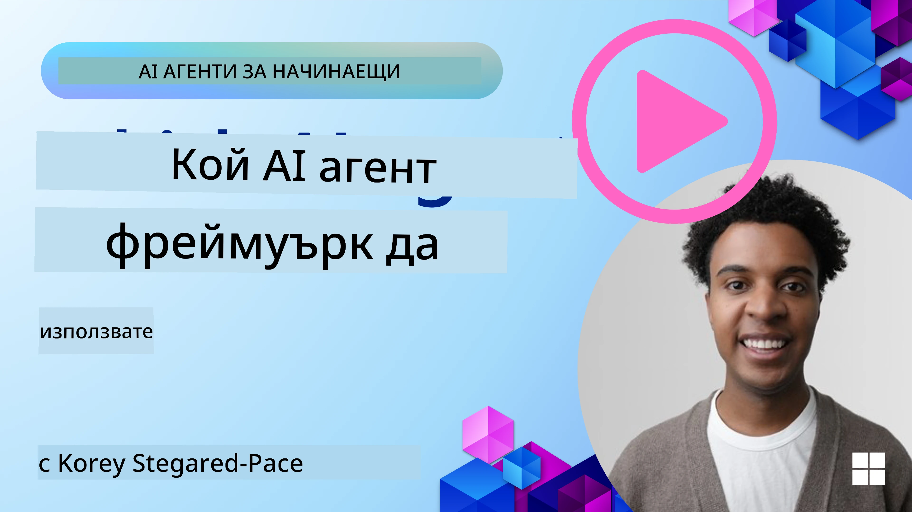

[](https://youtu.be/ODwF-EZo_O8?si=1xoy_B9RNQfrYdF7)

> _(Кликнете върху изображението по-горе, за да гледате видео на този урок)_

# Разгледайте рамките за AI агенти

Рамките за AI агенти са софтуерни платформи, създадени, за да опростят създаването, внедряването и управлението на AI агенти. Тези рамки предоставят на разработчиците предварително изградени компоненти, абстракции и инструменти, които улесняват разработката на сложни AI системи.

Тези рамки помагат на разработчиците да се фокусират върху уникалните аспекти на техните приложения, като предоставят стандартизирани подходи към общи предизвикателства в разработката на AI агенти. Те повишават мащабируемостта, достъпността и ефективността при изграждането на AI системи.

## Въведение

Този урок ще покрие:

- Какво са рамките за AI агенти и какво позволяват на разработчиците да постигнат?
- Как екипите могат бързо да прототипират, итерат и подобряват способностите на своя агент?
- Какви са разликите между рамките и инструментите, създадени от Microsoft (<a href="https://aka.ms/ai-agents-beginners/ai-agent-service" target="_blank">Azure AI Agent Service</a> и <a href="https://learn.microsoft.com/azure/ai-services/openai/how-to/responses" target="_blank">Microsoft Agent Framework</a>)?
- Мога ли да интегрирам директно съществуващите си инструменти от Azure екосистемата или имам нужда от самостоятелни решения?
- Какво представлява услугата Azure AI Agents и как ми помага?

## Цели на обучението

Целите на този урок са да ви помогнат да разберете:

- Ролята на рамките за AI агенти в развитието на AI.
- Как да използвате рамки за AI агенти за изграждане на интелигентни агенти.
- Основните възможности, които рамките за AI агенти осигуряват.
- Разликите между Microsoft Agent Framework и Azure AI Agent Service.

## Какво са рамките за AI агенти и какво позволяват на разработчиците да правят?

Традиционните AI рамки могат да ви помогнат да интегрирате AI във вашите приложения и да ги подобрите по следните начини:

- **Персонализация**: AI може да анализира потребителското поведение и предпочитания, за да предостави персонализирани препоръки, съдържание и изживявания.
Пример: Стрийминг услуги като Netflix използват AI, за да предлагат филми и предавания въз основа на историята на гледане, повишавайки ангажираността и удовлетвореността на потребителите.
- **Автоматизация и ефективност**: AI може да автоматизира повтарящи се задачи, да опрости работния процес и да подобри оперативната ефективност.
Пример: Приложения за обслужване на клиенти използват AI-базирани чатботове за обработка на често задавани въпроси, намалявайки времето за отговор и освобождавайки човешки агенти за по-сложни задачи.
- **Подобрено потребителско изживяване**: AI може да подобри цялостното потребителско преживяване, като предоставя интелигентни функции като разпознаване на глас, обработка на естествен език и предсказване на текст.
Пример: Виртуални асистенти като Siri и Google Assistant използват AI, за да разберат и отговорят на гласови команди, улеснявайки взаимодействието на потребителите с устройствата им.

### Звучи страхотно, нали? Но защо ни трябва рамка за AI агенти?

Рамките за AI агенти са нещо повече от просто AI рамки. Те са проектирани да позволят създаването на интелигентни агенти, които могат да взаимодействат с потребителите, други агенти и средата, за да постигнат конкретни цели. Тези агенти могат да проявяват автономно поведение, да вземат решения и да се адаптират към променящи се условия. Нека разгледаме някои ключови възможности, осигурени от рамките за AI агенти:

- **Сътрудничество и координация между агенти**: Позволяват създаването на множество AI агенти, които могат да работят заедно, да комуникират и координират, за да решават сложни задачи.
- **Автоматизация и управление на задачи**: Предлагат механизми за автоматизиране на многоетапни работни процеси, делегиране на задачи и динамично управление на задачи между агентите.
- **Контекстуално разбиране и адаптация**: Осигуряват на агентите възможността да разберат контекста, да се адаптират към променящата се среда и да вземат решения въз основа на информация в реално време.

В обобщение, агентите ви позволяват да правите повече, да издигнете автоматизацията на следващо ниво и да създавате по-интелигентни системи, които могат да се адаптират и учат от обкръжението си.

## Как бързо да прототипираме, итераме и подобряваме възможностите на агента?

Това е бързо развиваща се област, но има някои общи неща в повечето рамки за AI агенти, които могат да ви помогнат да прототипирате и итерате бързо — а именно модулни компоненти, колаборативни инструменти и учене в реално време. Нека разгледаме тези:

- **Използвайте модулни компоненти**: AI SDK-та предлагат предварително изградени компоненти като AI и паметни конектори, извикване на функции с естествен език или плъгини, шаблони за подкани и други.
- **Използвайте колаборативни инструменти**: Проектирайте агенти с конкретни роли и задачи, позволявайки им да тестват и усъвършенстват колаборативни работни процеси.
- **Учете в реално време**: Реализирайте обратни връзки, при които агентите се учат от взаимодействията и динамично променят поведението си.

### Използвайте модулни компоненти

SDK-та като Microsoft Agent Framework предоставят предварително изградени компоненти като AI конектори, дефиниции на инструменти и управление на агенти.

**Как могат да ги използват екипите**: Екипите могат бързо да сглобят тези компоненти, за да създадат функционален прототип без да започват от нулата, което позволява бързи експерименти и итерации.

**Как работи това на практика**: Можете да използвате предварително създаден парсър за извличане на информация от потребителското въвеждане, модул за памет за съхранение и извличане на данни и генератор на подкани за взаимодействие с потребителите, без да се налага да изграждате тези компоненти сами.

**Примерен код**. Нека да видим пример как можете да използвате Microsoft Agent Framework с `AzureAIProjectAgentProvider`, за да позволите на модела да отговаря на потребителски вход с извикване на инструменти:

``` python
# Пример на Microsoft Agent Framework на Python

import asyncio
import os
from typing import Annotated

from agent_framework.azure import AzureAIProjectAgentProvider
from azure.identity import AzureCliCredential


# Дефинирайте примерна функция на инструмент за резервиране на пътуване
def book_flight(date: str, location: str) -> str:
    """Book travel given location and date."""
    return f"Travel was booked to {location} on {date}"


async def main():
    provider = AzureAIProjectAgentProvider(credential=AzureCliCredential())
    agent = await provider.create_agent(
        name="travel_agent",
        instructions="Help the user book travel. Use the book_flight tool when ready.",
        tools=[book_flight],
    )

    response = await agent.run("I'd like to go to New York on January 1, 2025")
    print(response)
    # Примерен изход: Вашият полет до Ню Йорк на 1 януари 2025 г. е успешно резервиран. Приятно пътуване! ✈️🗽


if __name__ == "__main__":
    asyncio.run(main())
```

От този пример можете да видите как използвате предварително изграден парсър за извличане на ключова информация от потребителския вход, като например начална точка, дестинация и дата на заявка за резервация на полет. Този модулен подход ви позволява да се концентрирате върху логиката на високо ниво.

### Използвайте колаборативни инструменти

Рамки като Microsoft Agent Framework улесняват създаването на множество агенти, които могат да работят заедно.

**Как могат да ги използват екипите**: Екипите могат да проектират агенти с конкретни роли и задачи, позволявайки им да тестват и усъвършенстват колаборативни работни процеси и да подобряват общата ефективност на системата.

**Как работи това на практика**: Можете да създадете екип от агенти, като всеки агент има специализирана функция, например извличане на данни, анализ или вземане на решения. Тези агенти могат да комуникират и споделят информация, за да постигнат обща цел, като например отговор на потребителски въпрос или завършване на задача.

**Примерен код (Microsoft Agent Framework)**:

```python
# Създаване на множество агенти, които работят заедно, използвайки Microsoft Agent Framework

import os
from agent_framework.azure import AzureAIProjectAgentProvider
from azure.identity import AzureCliCredential

provider = AzureAIProjectAgentProvider(credential=AzureCliCredential())

# Агент за извличане на данни
agent_retrieve = await provider.create_agent(
    name="dataretrieval",
    instructions="Retrieve relevant data using available tools.",
    tools=[retrieve_tool],
)

# Агент за анализа на данни
agent_analyze = await provider.create_agent(
    name="dataanalysis",
    instructions="Analyze the retrieved data and provide insights.",
    tools=[analyze_tool],
)

# Изпълнение на агенти последователно по задача
retrieval_result = await agent_retrieve.run("Retrieve sales data for Q4")
analysis_result = await agent_analyze.run(f"Analyze this data: {retrieval_result}")
print(analysis_result)
```

В предходния код може да видите как създавате задача, която включва множество агенти, работещи съвместно за анализ на данни. Всеки агент изпълнява специфична функция, а задачата се осъществява чрез координиране на агентите за постигане на желания резултат. Чрез създаване на посветени агенти със специализирани роли можете да подобрите ефективността и производителността на задачите.

### Учете в реално време

Развитите рамки предлагат възможности за контекстуално разбиране и адаптация в реално време.

**Как могат да ги използват екипите**: Екипите могат да реализират обратни връзки, при които агентите се учат от взаимодействията и динамично променят поведението си, водейки до непрекъснато подобряване и усъвършенстване на способностите.

**Как работи това на практика**: Агентите могат да анализират потребителските отзиви, данни от околната среда и резултати от задачи, за да актуализират базата си знания, да коригират алгоритми за вземане на решения и да повишават производителността си във времето. Този итеративен процес на учене позволява на агентите да се адаптират към променящи се условия и предпочитания на потребителите, подобрявайки общата ефективност на системата.

## Какви са разликите между Microsoft Agent Framework и Azure AI Agent Service?

Има много начини да сравним тези подходи, но нека разгледаме някои ключови различия по отношение на тяхната конструкция, възможности и целеви случаи на употреба:

## Microsoft Agent Framework (MAF)

Microsoft Agent Framework предоставя опростен SDK за изграждане на AI агенти чрез `AzureAIProjectAgentProvider`. Той позволява на разработчиците да създават агенти, които използват Azure OpenAI модели с вградено извикване на инструменти, управление на разговори и корпоративна сигурност чрез Azure идентичност.

**Случаи на използване**: Изграждане на AI агенти готови за продукция с използване на инструменти, многоетапни работни процеси и сценарии за интеграция в предприятия.

Ето някои важни основни концепции на Microsoft Agent Framework:

- **Агенти**. Агент се създава чрез `AzureAIProjectAgentProvider` и се конфигурира с име, инструкции и инструменти. Агентът може:
  - **Да обработва потребителски съобщения** и да генерира отговори с помощта на Azure OpenAI модели.
  - **Автоматично да извиква инструменти** според контекста на разговора.
  - **Да поддържа състояние на разговора** в множество взаимодействия.

  Ето примерен код, който показва как да създадете агент:

    ```python
    import os
    from agent_framework.azure import AzureAIProjectAgentProvider
    from azure.identity import AzureCliCredential

    provider = AzureAIProjectAgentProvider(credential=AzureCliCredential())
    agent = await provider.create_agent(
        name="my_agent",
        instructions="You are a helpful assistant.",
    )

    response = await agent.run("Hello, World!")
    print(response)
    ```

- **Инструменти**. Рамката поддържа дефиниране на инструменти като Python функции, които агентът може да извиква автоматично. Инструментите се регистрират при създаване на агента:

    ```python
    def get_weather(location: str) -> str:
        """Get the current weather for a location."""
        return f"The weather in {location} is sunny, 72\u00b0F."

    agent = await provider.create_agent(
        name="weather_agent",
        instructions="Help users check the weather.",
        tools=[get_weather],
    )
    ```

- **Координация между множество агенти**. Можете да създавате множество агенти с различни специализации и да координирате тяхната работа:

    ```python
    planner = await provider.create_agent(
        name="planner",
        instructions="Break down complex tasks into steps.",
    )

    executor = await provider.create_agent(
        name="executor",
        instructions="Execute the planned steps using available tools.",
        tools=[execute_tool],
    )

    plan = await planner.run("Plan a trip to Paris")
    result = await executor.run(f"Execute this plan: {plan}")
    ```

- **Интеграция с Azure идентичност**. Рамката използва `AzureCliCredential` (или `DefaultAzureCredential`) за сигурна автентикация без ключ, елиминирайки необходимостта от директно управление на API ключове.

## Azure AI Agent Service

Azure AI Agent Service е по-ново добавяне, представено на Microsoft Ignite 2024. Позволява разработка и внедряване на AI агенти с по-гъвкави модели, като директно извикване на откритоизточникови LLM модели като Llama 3, Mistral и Cohere.

Azure AI Agent Service предоставя по-силни механизми за корпоративна сигурност и методи за съхранение на данни, което го прави подходящ за корпоративни приложения.

Работи директно заедно с Microsoft Agent Framework за изграждане и внедряване на агенти.

Тази услуга в момента е в публичен преглед и поддържа Python и C# за създаване на агенти.

Използвайки Python SDK на Azure AI Agent Service, можем да създадем агент с дефиниран от потребителя инструмент:

```python
import asyncio
from azure.identity import DefaultAzureCredential
from azure.ai.projects import AIProjectClient

# Дефинирайте функции на инструмента
def get_specials() -> str:
    """Provides a list of specials from the menu."""
    return """
    Special Soup: Clam Chowder
    Special Salad: Cobb Salad
    Special Drink: Chai Tea
    """

def get_item_price(menu_item: str) -> str:
    """Provides the price of the requested menu item."""
    return "$9.99"


async def main() -> None:
    credential = DefaultAzureCredential()
    project_client = AIProjectClient.from_connection_string(
        credential=credential,
        conn_str="your-connection-string",
    )

    agent = project_client.agents.create_agent(
        model="gpt-4o-mini",
        name="Host",
        instructions="Answer questions about the menu.",
        tools=[get_specials, get_item_price],
    )

    thread = project_client.agents.create_thread()

    user_inputs = [
        "Hello",
        "What is the special soup?",
        "How much does that cost?",
        "Thank you",
    ]

    for user_input in user_inputs:
        print(f"# User: '{user_input}'")
        message = project_client.agents.create_message(
            thread_id=thread.id,
            role="user",
            content=user_input,
        )
        run = project_client.agents.create_and_process_run(
            thread_id=thread.id, agent_id=agent.id
        )
        messages = project_client.agents.list_messages(thread_id=thread.id)
        print(f"# Agent: {messages.data[0].content[0].text.value}")


if __name__ == "__main__":
    asyncio.run(main())
```

### Основни концепции

Azure AI Agent Service включва следните основни концепции:

- **Агент**. Azure AI Agent Service се интегрира с Microsoft Foundry. В рамките на AI Foundry, AI агентът действа като „умен“ микроуслуга, която може да отговаря на въпроси (RAG), да изпълнява действия или напълно да автоматизира работни процеси. Това се постига чрез комбиниране силата на генеративните AI модели с инструменти, които му позволяват да достъпва и взаимодейства с реални източници на данни. Ето пример за агент:

    ```python
    agent = project_client.agents.create_agent(
        model="gpt-4o-mini",
        name="my-agent",
        instructions="You are helpful agent",
        tools=code_interpreter.definitions,
        tool_resources=code_interpreter.resources,
    )
    ```

    В този пример агентът е създаден с модела `gpt-4o-mini`, с име `my-agent` и инструкции „You are helpful agent“. Агентът е оборудван с инструменти и ресурси за изпълнение на задачи за интерпретация на код.

- **Тема и съобщения**. Темата е друга важна концепция. Тя представлява разговор или взаимодействие между агент и потребител. Темите могат да се използват за проследяване на напредъка на разговора, съхранение на контекстова информация и управление на състоянието на взаимодействието. Ето пример за тема:

    ```python
    thread = project_client.agents.create_thread()
    message = project_client.agents.create_message(
        thread_id=thread.id,
        role="user",
        content="Could you please create a bar chart for the operating profit using the following data and provide the file to me? Company A: $1.2 million, Company B: $2.5 million, Company C: $3.0 million, Company D: $1.8 million",
    )
    
    # Помолете агента да изпълни работа по нишката
    run = project_client.agents.create_and_process_run(thread_id=thread.id, agent_id=agent.id)
    
    # Извлечете и регистрирайте всички съобщения, за да видите отговора на агента
    messages = project_client.agents.list_messages(thread_id=thread.id)
    print(f"Messages: {messages}")
    ```

    В предишния код е създадена тема. След това е изпратено съобщение към темата. Като се извика `create_and_process_run`, на агента се възлага да извърши работа по темата. Накрая съобщенията се извличат и записват, за да се види отговорът на агента. Съобщенията показват напредъка на разговора между потребителя и агента. Важно е също да се разбере, че съобщенията могат да бъдат от различен тип, като текст, изображение или файл – тоест работата на агента може да е довела до например изображение или текстов отговор. Като разработчик можете да използвате тази информация, за да обработите по-нататък отговора или да го представите на потребителя.

- **Интеграция с Microsoft Agent Framework**. Azure AI Agent Service работи безпроблемно с Microsoft Agent Framework, което означава, че можете да изграждате агенти с `AzureAIProjectAgentProvider` и да ги внедрявате чрез Agent Service за продукционни сценарии.

**Случаи на използване**: Azure AI Agent Service е проектиран за корпоративни приложения, които изискват сигурно, мащабируемо и гъвкаво внедряване на AI агенти.

## Каква е разликата между тези подходи?

Изглежда има припокриване, но има някои ключови различия по отношение на дизайна, възможностите и целевите сценарии:

- **Microsoft Agent Framework (MAF)**: Пълноценен SDK за изграждане на AI агенти. Предоставя опростен API за създаване на агенти с извикване на инструменти, управление на разговори и интеграция с Azure идентичност.
- **Azure AI Agent Service**: Платформа и услуга за внедряване в Azure Foundry за агенти. Предлага вградена свързаност към услуги като Azure OpenAI, Azure AI Search, Bing Search и изпълнение на код.

Все още не сте сигурни кой да изберете?

### Случаи на използване

Нека видим дали можем да ви помогнем, като разгледаме някои често срещани случаи:

> Въпрос: Изграждам продукционни приложения с AI агенти и искам да започна бързо.
>

>Отговор: Microsoft Agent Framework е отличен избор. Той предоставя прост, Python-ориентиран API чрез `AzureAIProjectAgentProvider`, който ви позволява да дефинирате агенти с инструменти и инструкции само с няколко реда код.

> Въпрос: Имам нужда от корпоративно внедряване с интеграции в Azure като Search и изпълнение на код.
>
> Отговор: Azure AI Agent Service е най-подходящият. Това е платформа, която предоставя вградени възможности за множество модели, Azure AI Search, Bing Search и Azure Functions. Лесно е да изграждате агентите си в Foundry портала и да ги внедрявате в мащаб.

> Въпрос: Все още съм объркан, просто ми дайте една опция.
>
> Отговор: Започнете с Microsoft Agent Framework за изграждане на вашите агенти, а после използвайте Azure AI Agent Service, когато имате нужда да ги внедрите и мащабирате в продукция. Този подход ви позволява бързо да итерате върху логиката на агента, като същевременно осигурява ясен път към корпоративно внедряване.

Нека обобщим ключовите разлики в таблица:

| Рамка | Фокус | Основни концепции | Случаи на използване |
| --- | --- | --- | --- |
| Microsoft Agent Framework | Опростен SDK за агенти с извикване на инструменти | Агенти, Инструменти, Azure идентичност | Изграждане на AI агенти, използване на инструменти, многоетапни работни процеси |
| Azure AI Agent Service | Гъвкави модели, корпоративна сигурност, генериране на код, извикване на инструменти | Модуларност, Сътрудничество, Оркестрация на процеси | Сигурно, мащабируемо и гъвкаво внедряване на AI агенти |

## Мога ли да интегрирам директно съществуващите си инструменти от Azure екосистемата или имам нужда от самостоятелни решения?
Отговорът е да, можете да интегрирате съществуващите си инструменти от екосистемата на Azure директно с Azure AI Agent Service, особено тъй като е създаден да работи безпроблемно с други Azure услуги. Например, можете да интегрирате Bing, Azure AI Search и Azure Functions. Има и дълбока интеграция с Microsoft Foundry.

Microsoft Agent Framework също се интегрира с Azure услуги чрез `AzureAIProjectAgentProvider` и Azure идентичност, което ви позволява да извиквате Azure услуги директно от инструментите на вашия агент.

## Примерни кодове

- Python: [Agent Framework](./code_samples/02-python-agent-framework.ipynb)
- .NET: [Agent Framework](./code_samples/02-dotnet-agent-framework.md)

## Имaте ли още въпроси относно AI Agent Frameworks?

Присъединете се към [Microsoft Foundry Discord](https://discord.com/invite/ATgtXmAS5D), за да се срещнете с други учащи, да посещавате часовете за офис и да получите отговори на вашите въпроси за AI агенти.

## Референции

- <a href="https://techcommunity.microsoft.com/blog/azure-ai-services-blog/introducing-azure-ai-agent-service/4298357" target="_blank">Azure Agent Service</a>
- <a href="https://learn.microsoft.com/azure/ai-services/openai/how-to/responses" target="_blank">Microsoft Agent Framework - Azure OpenAI Responses</a>
- <a href="https://learn.microsoft.com/azure/ai-services/agents/overview" target="_blank">Azure AI Agent service</a>

## Предишен урок

[Въведение в AI агентите и техните случаи на използване](../01-intro-to-ai-agents/README.md)

## Следващ урок

[Разбиране на агентните дизайн модели](../03-agentic-design-patterns/README.md)

---

<!-- CO-OP TRANSLATOR DISCLAIMER START -->
**Отказ от отговорност**:
Този документ е преведен с помощта на AI преводачески услуга [Co-op Translator](https://github.com/Azure/co-op-translator). Въпреки че се стремим към точност, моля имайте предвид, че автоматизираните преводи могат да съдържат грешки или неточности. Оригиналният документ на неговия роден език трябва да се счита за авторитетен източник. За критична информация се препоръчва професионален човешки превод. Ние не носим отговорност за каквито и да е недоразумения или неправилни тълкувания, произтичащи от използването на този превод.
<!-- CO-OP TRANSLATOR DISCLAIMER END -->