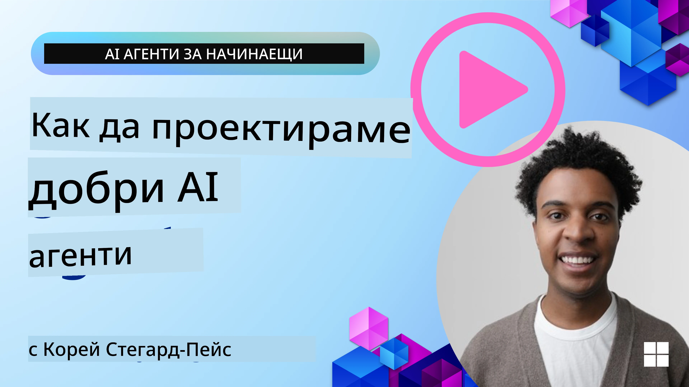
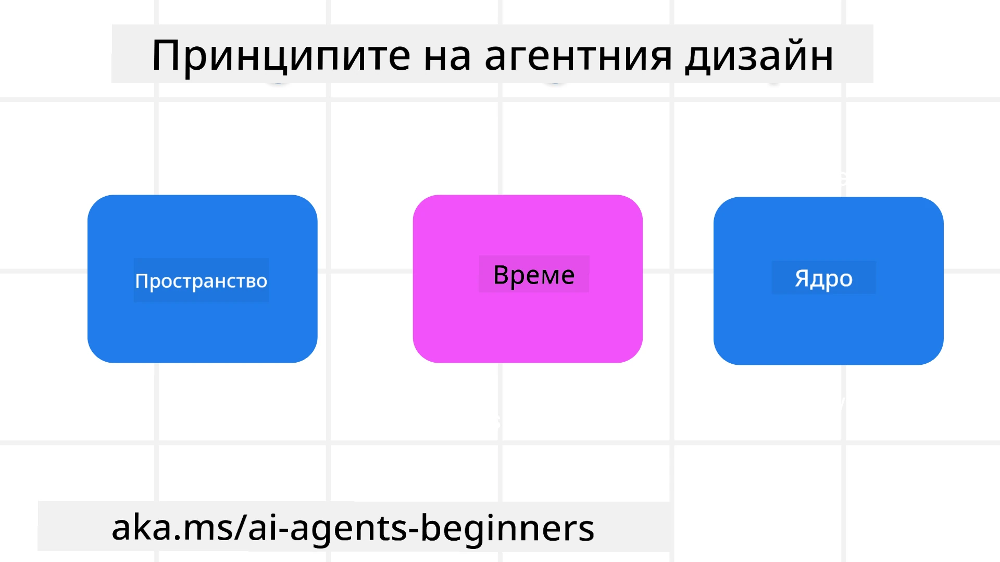

> _(Кликнете върху горното изображение, за да гледате видеото на този урок)_
# Принципи на агентния дизайн на изкуствения интелект

## Въведение

Има много начини да мислим за изграждане на агентни AI системи. Като се има предвид, че неяснотата е характеристика, а не недостатък в дизайна на генеративния AI, понякога е трудно за инженерите да разберат откъде да започнат. Ние създадохме набор от човекоцентрични принципи за UX дизайн, които да позволят на разработчиците да изграждат клиент-ориентирани агентни системи за решаване на техните бизнес нужди. Тези принципи на дизайн не са предписваща архитектура, а по-скоро отправна точка за екипите, които дефинират и изграждат агентни преживявания.

Като цяло, агентите трябва да:

- Разширяват и увеличават човешките възможности (обсъждане, решаване на проблеми, автоматизация и др.)
- Запълват пропуските в знанията (да ме вкарат в час по области на знание, превод и др.)
- Улесняват и подкрепят сътрудничеството по начините, по които ние като индивиди предпочитаме да работим с другите
- Правят ни по-добри версии на себе си (например, личен треньор/мениджър на задачи, помагайки ни да научим емоционална регулация и умения за осъзнатост, изграждане на устойчивост и др.)

## Този урок ще обхване

- Какви са принципите на агентен дизайн
- Какви са някои насоки за следване при прилагането на тези принципи на дизайн
- Някои примери за използване на принципите на дизайн

## Учебни цели

След завършване на този урок, ще можете да:

1. Обясните какво представляват принципите на агентен дизайн
2. Обясните насоките за използване на принципите на агентен дизайн
3. Разберете как да изградите агент, използвайки принципите на агентен дизайн

## Принципите на агентен дизайн

### Агент (пространство)

Това е средата, в която агентът оперира. Тези принципи информират как проектираме агенти за взаимодействие във физически и дигитални светове.

- **Свързване, а не разпадане** – помага да се свързват хора с други хора, събития и приложими знания, за да се улесни сътрудничеството и връзката.
- Агентите помагат да се свързват събития, знания и хора.
- Агентите сближават хората. Те не са предназначени да заменят или омаловажават хората.
- **Лесно достъпен, но понякога невидим** – агентът работи главно на заден план и ни подсеща само когато е релевантно и подходящо.
  - Агентът е лесно откриваем и достъпен за упълномощени потребители на всяко устройство или платформа.
  - Агентът поддържа мултимодални входове и изходи (звук, глас, текст и др.).
  - Агентът може безпроблемно да преминава между преден и заден план; между проактивен и реактивен режим, в зависимост от усещането на нуждите на потребителя.
  - Агентът може да оперира във вид на невидим процес, но неговият път на работа на заден план и сътрудничеството с други агенти са прозрачни и контролируеми от потребителя.

### Агент (време)

Това е как агентът функционира във времето. Тези принципи определят как проектираме агенти, които взаимодействат в миналото, настоящето и бъдещето.

- **Минало**: Размисъл за история, която включва както състояние, така и контекст.
  - Агентът предоставя по-релевантни резултати въз основа на анализ на по-богати исторически данни, отвъд само събитието, хората или състоянията.
  - Агентът създава връзки от минали събития и активно размишлява върху паметта, за да ангажира с настоящите ситуации.
- **Сега**: Подтикване повече, отколкото уведомяване.
  - Агентът въплъщава цялостен подход към взаимодействието с хората. Когато се случи събитие, агентът отива отвъд статичното уведомление или друга статична формалност. Агентът може да опрости процесите или динамично да генерира сигнали, които да насочват вниманието на потребителя в точния момент.
  - Агентът доставя информация въз основа на контекстуалната среда, социалните и културни промени и е персонализиран спрямо намерението на потребителя.
  - Взаимодействието с агента може да бъде постепенно, развиващо се/растящо по сложност, за да даде повече възможности на потребителите в дългосрочен план.
- **Бъдеще**: Адаптиране и развиване.
  - Агентът се адаптира към различни устройства, платформи и модалности.
  - Агентът се адаптира към поведението на потребителя, нуждите за достъпност и е свободно персонализируем.
  - Агентът се формира и развива чрез непрекъснато взаимодействие с потребителя.

### Агент (ядро)

Това са ключовите елементи в ядрото на дизайна на агента.

- **Приемете несигурността, но изградете доверие**.
  - Очаква се определено ниво на несигурност при агента. Несигурността е ключов елемент в дизайна на агента.
  - Доверието и прозрачността са основополагащи слоеве в дизайна на агента.
  - Хората контролират кога агентът е включен/изключен и статусът на агента е ясно видим по всяко време.

## Насоките за прилагане на тези принципи

Когато използвате горните принципи на дизайн, следвайте следните насоки:

1. **Прозрачност**: Информирайте потребителя, че AI е включен, как функционира (включително минали действия) и как да даде обратна връзка и модифицира системата.
2. **Контрол**: Позволете на потребителя да персонализира, специфицира предпочитания и да има контрол върху системата и нейните характеристики (включително възможността да забравя).
3. **Последователност**: Стремете се към постоянен, мултимодален опит на различни устройства и крайни точки. Използвайте познати UI/UX елементи, където е възможно (например, икона на микрофон за гласова интеракция) и редуцирайте когнитивното натоварване на клиента колкото може повече (например, стремете се към кратки отговори, визуални помощни средства и съдържание „Научете повече“).

## Как да проектирате туристически агент, използвайки тези принципи и насоки

Представете си, че проектирате туристически агент, ето как бихте могли да мислите за използване на принципите и насоките:

1. **Прозрачност** – Информирайте потребителя, че туристическият агент е AI-активиран агент. Предоставете някои основни инструкции как да започне (напр. съобщение „Здравей“, примерни подсказки). Ясно документирайте това на страницата на продукта. Покажете списъка с подсказки, които потребителят е използвал в миналото. Изяснете как да се дава обратна връзка (палци нагоре и надолу, бутон за изпращане на обратна връзка и др.). Ясно посочете дали агентът има ограничения по употреба или теми.
2. **Контрол** – Уверете се, че е ясно как потребителят може да модифицира агента след създаването му с неща като системна подсказка. Позволете на потребителя да избира колко подробен да е агентът, стил на писане и всякакви ограничения за теми, на които агентът не трябва да разговаря. Позволете на потребителя да преглежда и изтрива свързани файлове или данни, подсказки и минали разговори.
3. **Последователност** – Уверете се, че иконите за Споделяне на подсказка, добавяне на файл или снимка и тагване на някого или нещо са стандартни и разпознаваеми. Използвайте иконата на кламер за качване/споделяне на файлове с агента и иконата на изображение за качване на графики.

## Примерни кодове

- Python: [Agent Framework](./code_samples/03-python-agent-framework.ipynb)
- .NET: [Agent Framework](./code_samples/03-dotnet-agent-framework.md)

## Имате още въпроси за AI агентните дизайнерски модели?

Присъединете се към [Microsoft Foundry Discord](https://discord.com/invite/ATgtXmAS5D), за да се срещнете с други обучаващи се, да посещавате офис часове и да получите отговори на вашите въпроси за AI агенти.

## Допълнителни ресурси

- <a href="https://openai.com" target="_blank">Практики за управление на агентни AI системи | OpenAI</a>
- <a href="https://microsoft.com" target="_blank">Проект HAX Toolkit - Microsoft Research</a>
- <a href="https://responsibleaitoolbox.ai" target="_blank">Тoolbox за отговорен AI</a>

## Предишен урок

[Изследване на агентни рамки](../02-explore-agentic-frameworks/README.md)

## Следващ урок

[Дизайнерски модел за използване на инструменти](../04-tool-use/README.md)

---

<!-- CO-OP TRANSLATOR DISCLAIMER START -->
**Отказ от отговорност**:
Този документ е преведен с помощта на AI преводачески услуга [Co-op Translator](https://github.com/Azure/co-op-translator). Въпреки че се стремим към точност, моля имайте предвид, че автоматизираните преводи могат да съдържат грешки или неточности. Оригиналният документ на неговия роден език трябва да се счита за авторитетен източник. За критична информация се препоръчва професионален човешки превод. Ние не носим отговорност за каквито и да е недоразумения или неправилни тълкувания, произтичащи от използването на този превод.
<!-- CO-OP TRANSLATOR DISCLAIMER END -->