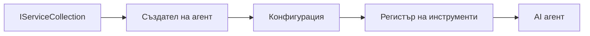

# 🎨 Агентски дизайн патърни с Azure OpenAI (Responses API) (.NET)

## 📋 Учебни цели

Този пример демонстрира предприятияни дизайн патърни за създаване на интелигентни агенти, използвайки Microsoft Agent Framework в .NET с интеграция на Azure OpenAI (Responses API). Ще научите професионални патърни и архитектурни подходи, които правят агентите готови за производство, поддържими и мащабируеми.

### Предприятия дизайн патърни

- 🏭 **Фабричен патърн**: Стандартизирано създаване на агенти с dependency injection
- 🔧 **Builder патърн**: Гъвкава конфигурация и настройка на агенти
- 🧵 **Thread-Safe патърни**: Управление на конкурентни разговори
- 📋 **Repository патърн**: Организирано управление на инструменти и възможности

## 🎯 Специфични архитектурни предимства на .NET

### Предприятия функционалности

- **Силна типизация**: Проверка по време на компилация и поддръжка на IntelliSense
- **Dependency Injection**: Вградена интеграция на DI контейнер
- **Управление на конфигурацията**: IConfiguration и Options патърни
- **Async/Await**: Първокласна поддръжка на асинхронно програмиране

### Патърни подходящи за продукция

- **Логване интеграция**: ILogger и структурирана поддръжка на логване
- **Проверки за здраве**: Вградени мониторинг и диагностика
- **Валидиране на конфигурация**: Силна типизация с данни за анотации
- **Обработка на грешки**: Структурирано управление на изключения

## 🔧 Техническа архитектура

### Основни .NET компоненти

- **Microsoft.Extensions.AI**: Унифицирани AI абстракции на услугите
- **Microsoft.Agents.AI**: Предприятен фреймуърк за оркестрация на агенти
- **Azure OpenAI (Responses API)**: Високопроизводителни API клиент патърни
- **Конфигурационна система**: appsettings.json и интеграция с околната среда

### Имплементация на дизайн патърни



## 🏗️ Демонстрирани предприятияни патърни

### 1. **Създаващи патърни**

- **Agent Factory**: Централизирано създаване на агент с конзистентна конфигурация
- **Builder патърн**: Гъвкав API за комплексна конфигурация на агенти
- **Singleton патърн**: Управление на споделени ресурси и конфигурация
- **Dependency Injection**: Слаба свързаност и възможност за тестване

### 2. **Поведенчески патърни**

- **Strategy патърн**: Подменяеми стратегии за изпълнение на инструменти
- **Command патърн**: Капсулирани операции на агента с undo/redo
- **Observer патърн**: Събитийно ориентирано управление на жизнения цикъл на агента
- **Template Method**: Стандартизирани работни потоци за изпълнение на агенти

### 3. **Структурни патърни**

- **Adapter патърн**: Слой за интеграция с Azure OpenAI (Responses API)
- **Decorator патърн**: Подобряване на възможностите на агента
- **Facade патърн**: Опрощени интерфейси за взаимодействие с агента
- **Proxy патърн**: Ленива зареждане и кеширане за по-добра производителност

## 📚 .NET принципи на дизайн

### SOLID принципи

- **Single Responsibility**: Всеки компонент има една ясна цел
- **Open/Closed**: Разширяем без модификации
- **Liskov Substitution**: Имплементации на инструменти базирани на интерфейси
- **Interface Segregation**: Фокусирани, сплотени интерфейси
- **Dependency Inversion**: Зависимост от абстракции, не от конкретни класове

### Чиста архитектура

- **Domain Layer**: Основни абстракции за агент и инструменти
- **Application Layer**: Оркестрация на агенти и работни потоци
- **Infrastructure Layer**: Интеграция на Azure OpenAI (Responses API) и външни услуги
- **Presentation Layer**: Взаимодействие с потребителя и форматиране на отговори

## 🔒 Предприятия съображения

### Сигурност

- **Управление на идентификационни данни**: Сигурно обработване на API ключове с IConfiguration
- **Валидиране на входните данни**: Силна типизация и валидиране с анотации
- **Саниране на изхода**: Сигурна обработка и филтриране на отговорите
- **Логване на одит**: Изчерпателно проследяване на операциите

### Производителност

- **Async патърни**: Неблокиращи I/O операции
- **Connection Pooling**: Ефективно управление на HTTP клиент
- **Кеширане**: Кеширане на отговори за подобрена производителност
- **Управление на ресурси**: Правилно освобождаване и почистване

### Мащабируемост

- **Thread Safety**: Поддръжка на конкурентно изпълнение на агенти
- **Resource Pooling**: Ефективно използване на ресурси
- **Load Management**: Ограничаване на скоростта и обработка на натоварване
- **Мониторинг**: Метрики за производителност и здравословни проверки

## 🚀 Производствено внедряване

- **Управление на конфигурацията**: Настройки, специфични за средата
- **Стратегия за логване**: Структурирано логване с корелационни идентификатори
- **Обработка на грешки**: Глобално управление на изключения с подходящо възстановяване
- **Мониторинг**: Application insights и броячи на производителността
- **Тестване**: Юнит тестове, интеграционни тестове и модели за товарно тестване

Готови ли сте да изградите предприятияно ниво интелигентни агенти с .NET? Нека създадем нещо стабилно! 🏢✨

## 🚀 Започване

### Изисквания

- [.NET 10 SDK](https://dotnet.microsoft.com/download/dotnet/10.0) или по-нова версия
- Абонамент за [Azure](https://azure.microsoft.com/free/) с ресурс Azure OpenAI и внедрен модел
- [Azure CLI](https://learn.microsoft.com/cli/azure/install-azure-cli) — влезте с `az login`

### Изисквани променливи на средата

```bash
# zsh/bash
export AZURE_OPENAI_ENDPOINT=https://<your-resource>.openai.azure.com
export AZURE_OPENAI_DEPLOYMENT=gpt-4o-mini
# След това влезте, за да може AzureCliCredential да получи токен
az login
```

```powershell
# PowerShell
$env:AZURE_OPENAI_ENDPOINT = "https://<your-resource>.openai.azure.com"
$env:AZURE_OPENAI_DEPLOYMENT = "gpt-4o-mini"
# След това влезте, за да може AzureCliCredential да получи токен
az login
```

### Примерен код

За да стартирате кода,

```bash
# zsh/bash
chmod +x ./03-dotnet-agent-framework.cs
./03-dotnet-agent-framework.cs
```

Или използвайте dotnet CLI:

```bash
dotnet run ./03-dotnet-agent-framework.cs
```

Вижте [`03-dotnet-agent-framework.cs`](../../../../03-agentic-design-patterns/code_samples/03-dotnet-agent-framework.cs) за пълния код.

```csharp
#!/usr/bin/dotnet run

#:package Microsoft.Extensions.AI@10.*
#:package Microsoft.Agents.AI.OpenAI@1.*-*
#:package Azure.AI.OpenAI@2.1.0
#:package Azure.Identity@1.13.1

using System.ComponentModel;

using Microsoft.Agents.AI;
using Microsoft.Extensions.AI;

using Azure.AI.OpenAI;
using Azure.Identity;

// Tool Function: Random Destination Generator
// This static method will be available to the agent as a callable tool
// The [Description] attribute helps the AI understand when to use this function
// This demonstrates how to create custom tools for AI agents
[Description("Provides a random vacation destination.")]
static string GetRandomDestination()
{
    // List of popular vacation destinations around the world
    // The agent will randomly select from these options
    var destinations = new List<string>
    {
        "Paris, France",
        "Tokyo, Japan",
        "New York City, USA",
        "Sydney, Australia",
        "Rome, Italy",
        "Barcelona, Spain",
        "Cape Town, South Africa",
        "Rio de Janeiro, Brazil",
        "Bangkok, Thailand",
        "Vancouver, Canada"
    };

    // Generate random index and return selected destination
    // Uses System.Random for simple random selection
    var random = new Random();
    int index = random.Next(destinations.Count);
    return destinations[index];
}

// Azure OpenAI with the Responses API (stable v1 endpoint). Sign in with `az login`.
var azureEndpoint = Environment.GetEnvironmentVariable("AZURE_OPENAI_ENDPOINT")
    ?? throw new InvalidOperationException("AZURE_OPENAI_ENDPOINT is not set.");
var deployment = Environment.GetEnvironmentVariable("AZURE_OPENAI_DEPLOYMENT") ?? "gpt-4o-mini";

var azureClient = new AzureOpenAIClient(new Uri(azureEndpoint), new AzureCliCredential());

// Define Agent Identity and Comprehensive Instructions
// Agent name for identification and logging purposes
var AGENT_NAME = "TravelAgent";

// Detailed instructions that define the agent's personality, capabilities, and behavior
// This system prompt shapes how the agent responds and interacts with users
var AGENT_INSTRUCTIONS = """
You are a helpful AI Agent that can help plan vacations for customers.

Important: When users specify a destination, always plan for that location. Only suggest random destinations when the user hasn't specified a preference.

When the conversation begins, introduce yourself with this message:
"Hello! I'm your TravelAgent assistant. I can help plan vacations and suggest interesting destinations for you. Here are some things you can ask me:
1. Plan a day trip to a specific location
2. Suggest a random vacation destination
3. Find destinations with specific features (beaches, mountains, historical sites, etc.)
4. Plan an alternative trip if you don't like my first suggestion

What kind of trip would you like me to help you plan today?"

Always prioritize user preferences. If they mention a specific destination like "Bali" or "Paris," focus your planning on that location rather than suggesting alternatives.
""";

// Create AI Agent with Advanced Travel Planning Capabilities
// Get the Responses client for the deployment and create the AI agent
// Configure agent with name, detailed instructions, and available tools
// This demonstrates the .NET agent creation pattern with full configuration
AIAgent agent = azureClient
    .GetOpenAIResponseClient(deployment)
    .CreateAIAgent(
        name: AGENT_NAME,
        instructions: AGENT_INSTRUCTIONS,
        tools: [AIFunctionFactory.Create(GetRandomDestination)]
    );

// Create New Conversation Thread for Context Management
// Initialize a new conversation thread to maintain context across multiple interactions
// Threads enable the agent to remember previous exchanges and maintain conversational state
// This is essential for multi-turn conversations and contextual understanding
AgentThread thread = agent.GetNewThread();

// Execute Agent: First Travel Planning Request
// Run the agent with an initial request that will likely trigger the random destination tool
// The agent will analyze the request, use the GetRandomDestination tool, and create an itinerary
// Using the thread parameter maintains conversation context for subsequent interactions
await foreach (var update in agent.RunStreamingAsync("Plan me a day trip", thread))
{
    await Task.Delay(10);
    Console.Write(update);
}

Console.WriteLine();

// Execute Agent: Follow-up Request with Context Awareness
// Demonstrate contextual conversation by referencing the previous response
// The agent remembers the previous destination suggestion and will provide an alternative
// This showcases the power of conversation threads and contextual understanding in .NET agents
await foreach (var update in agent.RunStreamingAsync("I don't like that destination. Plan me another vacation.", thread))
{
    await Task.Delay(10);
    Console.Write(update);
}
```

---

<!-- CO-OP TRANSLATOR DISCLAIMER START -->
**Отказ от отговорност**:
Този документ е преведен с помощта на AI преводачески услуга [Co-op Translator](https://github.com/Azure/co-op-translator). Въпреки че се стремим към точност, моля имайте предвид, че автоматизираните преводи могат да съдържат грешки или неточности. Оригиналният документ на неговия роден език трябва да се счита за авторитетен източник. За критична информация се препоръчва професионален човешки превод. Ние не носим отговорност за каквито и да е недоразумения или неправилни тълкувания, произтичащи от използването на този превод.
<!-- CO-OP TRANSLATOR DISCLAIMER END -->