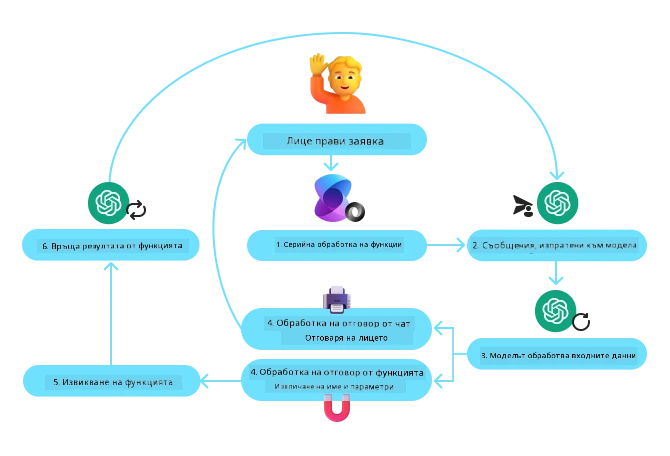
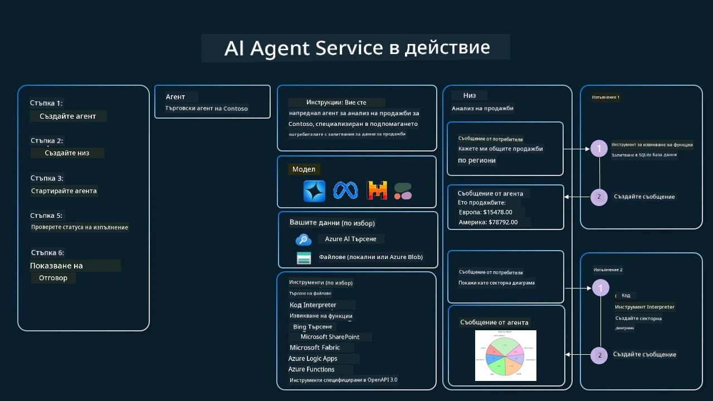

[](https://youtu.be/vieRiPRx-gI?si=cEZ8ApnT6Sus9rhn)

> _(Кликнете върху изображението по-горе, за да гледате видео на този урок)_

# Дизайнерски шаблон за използване на инструменти

Инструментите са интересни, тъй като позволяват на AI агентите да разполагат с по-широк набор от възможности. Вместо агентът да има ограничен набор от действия, които може да извърши, чрез добавяне на инструмент агентът вече може да изпълнява широк кръг от действия. В тази глава ще разгледаме Дизайнерския шаблон за използване на инструменти, който описва как AI агентите могат да използват специфични инструменти, за да постигнат целите си.

## Въведение

В този урок ще се опитаме да отговорим на следните въпроси:

- Какво представлява дизайнерският шаблон за използване на инструменти?
- За какви приложения може да се използва?
- Какви са елементите/строителните блокове, необходими за реализиране на шаблона?
- Какви са специалните съображения при използването на Дизайнерския шаблон за използване на инструменти за изграждане на надеждни AI агенти?

## Учебни цели

След завършване на този урок ще можете:

- Да дефинирате Дизайнерския шаблон за използване на инструменти и неговата цел.
- Да идентифицирате случаи на употреба, при които шаблонът е приложим.
- Да разбирате ключовите елементи, необходими за реализиране на шаблона.
- Да разпознавате съображения за гарантиране на надеждност на AI агентите, използващи този дизайнерски шаблон.

## Какво е Дизайнерският шаблон за използване на инструменти?

**Дизайнерският шаблон за използване на инструменти** се фокусира върху предоставянето на възможност на големите езикови модели (LLMs) да взаимодействат с външни инструменти, за да постигнат конкретни цели. Инструментите са код, който агентът може да изпълни, за да извърши действия. Инструментът може да бъде проста функция, като калкулатор, или API заявка към външна услуга, като проверка на борсови цени или прогноза за времето. В контекста на AI агентите, инструментите са проектирани да се изпълняват от агентите в отговор на **функционални извиквания, генерирани от модела**.

## За какви приложения може да се използва?

AI агентите могат да използват инструменти, за да изпълнят сложни задачи, да извличат информация или да вземат решения. Дизайнерският шаблон за използване на инструменти често се прилага в ситуации, изискващи динамично взаимодействие с външни системи, като бази данни, уеб услуги или интерпретатори на код. Тази способност е полезна за различни случаи на употреба, включително:

- **Динамично извличане на информация:** Агентите могат да изпращат заявки към външни API или бази данни, за да получат актуални данни (например заявка към SQLite база данни за анализ на данни, получаване на цените на акции или информация за времето).
- **Изпълнение и интерпретация на код:** Агентите могат да изпълняват код или скриптове за решаване на математически задачи, създаване на отчети или извършване на симулации.
- **Автоматизация на работни процеси:** Автоматизиране на повтарящи се или многостъпкови работни процеси чрез интегриране на инструменти като планировчици на задачи, имейл услуги или обработващи потоци за данни.
- **Обслужване на клиенти:** Агентите могат да взаимодействат с CRM системи, платформи за билети или бази знания за разрешаване на потребителски запитвания.
- **Генериране и редактиране на съдържание:** Агентите могат да използват инструменти като граматически проверки, обобщения на текст или оценки за безопасност на съдържанието, за да подпомагат задачи по създаване на съдържание.

## Какви са елементите/строителните блокове, необходими за реализиране на дизайнерския шаблон за използване на инструменти?

Тези строителни блокове позволяват на AI агента да изпълнява широк спектър от задачи. Нека разгледаме ключовите елементи, нужни за прилагане на Дизайнерския шаблон за използване на инструменти:

- **Схеми за функции/инструменти:** Подробни определения на наличните инструменти, включително име на функцията, цел, необходими параметри и очаквани резултати. Тези схеми позволяват на LLM да разбере какви инструменти са налични и как да конструира валидни заявки.

- **Логика за изпълнение на функции:** Управлява как и кога се извикват инструментите въз основа на намерението на потребителя и контекста на разговора. Това може да включва планови модули, механизми за маршрутизиране или условни потоци, които динамично определят употребата на инструмента.

- **Система за обработка на съобщения:** Компоненти за управление на разговорния поток между потребителските входове, отговорите на LLM, извикванията към инструменти и техните резултати.

- **Рамка за интеграция на инструменти:** Инфраструктура, която свързва агента с различни инструменти, независимо дали са прости функции или сложни външни услуги.

- **Обработка на грешки и валидиране:** Механизми за справяне с откази при изпълнение на инструменти, валидиране на параметри и управление на непредвидени отговори.

- **Управление на състоянието:** Следи контекста на разговора, предишните взаимодействия с инструменти и персистентни данни, за да се гарантира последователност при многоетапни взаимодействия.

Нека сега разгледаме по-подробно Извикване на функции/инструменти.
 
### Извикване на функции/инструменти

Извикването на функции е основният начин, по който даваме възможност на Големите Езикови Модели (LLMs) да взаимодействат с инструменти. Често ще видите, че "функция" и "инструмент" се използват взаимнозаменяемо, тъй като "функциите" (блокове преповтаряем код) са "инструментите", които агентите използват за извършване на задачи. За да бъде извикан кодът на дадена функция, LLM трябва да сравни заявката на потребителя с описанието на функциите. За това към LLM се изпраща схема, съдържаща описанията на всички налични функции. След това LLM избира най-подходящата функция за задачата и връща нейното име и аргументи. Избраната функция се извиква, отговорът ѝ се изпраща обратно към LLM, който използва информацията, за да отговори на заявката на потребителя.

За разработчиците, които искат да реализират извикване на функции за агенти, са необходими:

1. Модел LLM, който поддържа извикване на функции
2. Схема, съдържаща описания на функциите
3. Кодът на всяка описана функция

Нека използваме пример с получаване на текущото време в даден град, за да илюстрираме:

1. **Инициализиране на LLM, който поддържа извикване на функции:**

    Не всички модели поддържат извикване на функции, затова е важно да проверите дали използваният от вас LLM го поддържа. <a href="https://learn.microsoft.com/azure/ai-services/openai/how-to/function-calling" target="_blank">Azure OpenAI</a> поддържа извикване на функции. Можем да започнем с инициализирането на клиента Azure OpenAI.

    ```python
    # Инициализирайте клиента на Azure OpenAI
    client = AzureOpenAI(
        azure_endpoint = os.getenv("AZURE_AI_PROJECT_ENDPOINT"), 
        api_key=os.getenv("AZURE_OPENAI_API_KEY"),  
        api_version="2024-05-01-preview"
    )
    ```

1. **Създаване на схема за функция:**

    След това ще дефинираме JSON схема, която съдържа името на функцията, описание на това какво прави функцията и имената и описанията на параметрите на функцията.
    След това ще подадем тази схема на създадения по-рано клиент, заедно със заявката на потребителя за намиране на часа в Сан Франциско. Важно е да се отбележи, че се връща **извикване на инструмент**, а **не финалният отговор.** Както беше упоменато по-горе, LLM връща името на функцията, която е избрал за задачата, и аргументите, които ще бъдат подадени.

    ```python
    # Описание на функцията за прочитане от модела
    tools = [
        {
            "type": "function",
            "function": {
                "name": "get_current_time",
                "description": "Get the current time in a given location",
                "parameters": {
                    "type": "object",
                    "properties": {
                        "location": {
                            "type": "string",
                            "description": "The city name, e.g. San Francisco",
                        },
                    },
                    "required": ["location"],
                },
            }
        }
    ]
    ```
   
    ```python
  
    # Първоначално съобщение от потребителя
    messages = [{"role": "user", "content": "What's the current time in San Francisco"}] 
  
    # Първо обаждане към API: Помолете модела да използва функцията
      response = client.chat.completions.create(
          model=deployment_name,
          messages=messages,
          tools=tools,
          tool_choice="auto",
      )
  
      # Обработване на отговора на модела
      response_message = response.choices[0].message
      messages.append(response_message)
  
      print("Model's response:")  

      print(response_message)
  
    ```

    ```bash
    Model's response:
    ChatCompletionMessage(content=None, role='assistant', function_call=None, tool_calls=[ChatCompletionMessageToolCall(id='call_pOsKdUlqvdyttYB67MOj434b', function=Function(arguments='{"location":"San Francisco"}', name='get_current_time'), type='function')])
    ```
  
1. **Кодът на функцията, необходим за изпълнение на задачата:**

    След като LLM е избрал коя функция трябва да бъде стартирана, кодът за изпълнение на задачата трябва да бъде реализиран и изпълнен.
    Можем да имплементираме кода за получаване на текущото време на Python. Също така ще трябва да напишем код за извличане на името и аргументите от response_message, за да получим крайната стойност.

    ```python
      def get_current_time(location):
        """Get the current time for a given location"""
        print(f"get_current_time called with location: {location}")  
        location_lower = location.lower()
        
        for key, timezone in TIMEZONE_DATA.items():
            if key in location_lower:
                print(f"Timezone found for {key}")  
                current_time = datetime.now(ZoneInfo(timezone)).strftime("%I:%M %p")
                return json.dumps({
                    "location": location,
                    "current_time": current_time
                })
      
        print(f"No timezone data found for {location_lower}")  
        return json.dumps({"location": location, "current_time": "unknown"})
    ```

     ```python
     # Обработка на повиквания на функции
      if response_message.tool_calls:
          for tool_call in response_message.tool_calls:
              if tool_call.function.name == "get_current_time":
     
                  function_args = json.loads(tool_call.function.arguments)
     
                  time_response = get_current_time(
                      location=function_args.get("location")
                  )
     
                  messages.append({
                      "tool_call_id": tool_call.id,
                      "role": "tool",
                      "name": "get_current_time",
                      "content": time_response,
                  })
      else:
          print("No tool calls were made by the model.")  
  
      # Второ повикване на API: Вземете крайния отговор от модела
      final_response = client.chat.completions.create(
          model=deployment_name,
          messages=messages,
      )
  
      return final_response.choices[0].message.content
     ```

     ```bash
      get_current_time called with location: San Francisco
      Timezone found for san francisco
      The current time in San Francisco is 09:24 AM.
     ```

Извикването на функции е в сърцето на повечето, ако не и на всички, дизайнерски решения за използване на инструменти при агенти, но неговата реализация от нулата понякога може да е предизвикателство.
Както научихме в [Урок 2](../../../02-explore-agentic-frameworks), агентските рамки ни предлагат предварително изградени строителни блокове за имплементиране на използването на инструменти.
 
## Примери за използване на инструменти с агентски рамки

Ето някои примери за това как можете да реализирате Дизайнерския шаблон за използване на инструменти, използвайки различни агентски рамки:

### Microsoft Agent Framework

<a href="https://learn.microsoft.com/azure/ai-services/agents/overview" target="_blank">Microsoft Agent Framework</a> е отворена рамка за изграждане на AI агенти. Тя опростява процеса на използване на извикване на функции, като ви позволява да дефинирате инструменти като Python функции с декоратор `@tool`. Рамката обработва двупосочната комуникация между модела и вашия код. Осигурява също достъп до предварително изградени инструменти като Търсене на файлове и Интерпретатор на код чрез `AzureAIProjectAgentProvider`.

Следната диаграма илюстрира процеса на извикване на функции с Microsoft Agent Framework:



В Microsoft Agent Framework инструментите се дефинират като декорирани функции. Можем да превърнем функцията `get_current_time`, която видяхме по-рано, в инструмент, като използваме декоратора `@tool`. Рамката автоматично сериализира функцията и нейните параметри, създавайки схемата, която се изпраща на LLM.

```python
from agent_framework import tool
from agent_framework.azure import AzureAIProjectAgentProvider
from azure.identity import AzureCliCredential

@tool
def get_current_time(location: str) -> str:
    """Get the current time for a given location"""
    ...

# Създайте клиента
provider = AzureAIProjectAgentProvider(credential=AzureCliCredential())

# Създайте агент и стартирайте с инструмента
agent = await provider.create_agent(name="TimeAgent", instructions="Use available tools to answer questions.", tools=get_current_time)
response = await agent.run("What time is it?")
```
  
### Azure AI Agent Service

<a href="https://learn.microsoft.com/azure/ai-services/agents/overview" target="_blank">Azure AI Agent Service</a> е по-нова агентска рамка, която е предназначена да даде възможност на разработчиците да създават, разгръщат и разширяват високо качество AI агенти сигурно, без да се налага да управляват основните изчислителни и хранилищни ресурси. Тя е особено полезна за корпоративни приложения, защото е напълно управляема услуга с корпоративна сигурност.

В сравнение с разработка директно чрез LLM API, Azure AI Agent Service предлага някои предимства, включително:

- Автоматично извикване на инструменти – няма нужда да анализирате извикване на инструмент, да извиквате инструмента и да обработвате отговора; всичко това вече се прави сървърно
- Сигурно управлявани данни – вместо да управлявате сами състоянието на разговора, можете да разчитате на нишки, които съхраняват цялата необходима ви информация
- Готови за ползване инструменти – инструменти за взаимодействие с вашите източници на данни, като Bing, Azure AI Search и Azure Functions.

Инструментите, налични в Azure AI Agent Service, могат да се разделят на две категории:

1. Инструменти за знание:
    - <a href="https://learn.microsoft.com/azure/ai-services/agents/how-to/tools/bing-grounding?tabs=python&pivots=overview" target="_blank">Заземяване чрез Bing Search</a>
    - <a href="https://learn.microsoft.com/azure/ai-services/agents/how-to/tools/file-search?tabs=python&pivots=overview" target="_blank">Търсене на файлове</a>
    - <a href="https://learn.microsoft.com/azure/ai-services/agents/how-to/tools/azure-ai-search?tabs=azurecli%2Cpython&pivots=overview-azure-ai-search" target="_blank">Azure AI Search</a>

2. Инструменти за действие:
    - <a href="https://learn.microsoft.com/azure/ai-services/agents/how-to/tools/function-calling?tabs=python&pivots=overview" target="_blank">Извикване на функции</a>
    - <a href="https://learn.microsoft.com/azure/ai-services/agents/how-to/tools/code-interpreter?tabs=python&pivots=overview" target="_blank">Интерпретатор на код</a>
    - <a href="https://learn.microsoft.com/azure/ai-services/agents/how-to/tools/openapi-spec?tabs=python&pivots=overview" target="_blank">Инструменти, дефинирани чрез OpenAPI</a>
    - <a href="https://learn.microsoft.com/azure/ai-services/agents/how-to/tools/azure-functions?pivots=overview" target="_blank">Azure Functions</a>

Agent Service ни позволява да използваме тези инструменти заедно като `toolset`. Той също така използва `threads`, които поддържат историята на съобщенията от конкретен разговор.

Представете си, че сте търговски представител в компания, наречена Contoso. Искате да създадете разговорен агент, който може да отговаря на въпроси относно вашите данни за продажби.

Следното изображение илюстрира как можете да използвате Azure AI Agent Service за анализ на вашите данни за продажбите:



За да използваме някой от тези инструменти с услугата, можем да създадем клиент и да дефинираме инструмент или набор от инструменти. За практическа реализация можем да използваме следния Python код. LLM ще може да разгледа toolset-а и да реши дали да използва потребителски създадената функция `fetch_sales_data_using_sqlite_query`, или предварително създадения Code Interpreter в зависимост от заявката на потребителя.

```python 
import os
from azure.ai.projects import AIProjectClient
from azure.identity import DefaultAzureCredential
from fetch_sales_data_functions import fetch_sales_data_using_sqlite_query # функцията fetch_sales_data_using_sqlite_query, която може да се намери във файла fetch_sales_data_functions.py.
from azure.ai.projects.models import ToolSet, FunctionTool, CodeInterpreterTool

project_client = AIProjectClient.from_connection_string(
    credential=DefaultAzureCredential(),
    conn_str=os.environ["PROJECT_CONNECTION_STRING"],
)

# Инициализиране на набор от инструменти
toolset = ToolSet()

# Инициализиране на агент за извикване на функции с функцията fetch_sales_data_using_sqlite_query и добавянето ѝ към набора от инструменти
fetch_data_function = FunctionTool(fetch_sales_data_using_sqlite_query)
toolset.add(fetch_data_function)

# Инициализиране на инструмента Code Interpreter и добавянето му към набора от инструменти.
code_interpreter = code_interpreter = CodeInterpreterTool()
toolset.add(code_interpreter)

agent = project_client.agents.create_agent(
    model="gpt-4o-mini", name="my-agent", instructions="You are helpful agent", 
    toolset=toolset
)
```

## Какви са специалните съображения при използването на Дизайнерския шаблон за използване на инструменти за изграждане на надеждни AI агенти?

Честа загриженост при динамично генерираните SQL заявки от LLM е сигурността, особено рискът от SQL инжекции или злонамерени действия, като изтриване или манипулиране на базата данни. Докато тези опасения са основателни, те могат ефективно да бъдат смекчени чрез правилна конфигурация на разрешенията за достъп до базата данни. За повечето бази данни това включва конфигуриране на базата данни като само за четене. При бази данни като PostgreSQL или Azure SQL, на приложението трябва да бъде присвоена роля само за четене (SELECT).

Стартирането на приложението в сигурна среда допълнително повишава защитата. В корпоративни сценарии данните обикновено се извличат и трансформират от оперативни системи в база данни или хранилище за данни с достъп само за четене и с потребителски удобна схема. Този подход гарантира, че данните са защитени, оптимизирани за производителност и достъпност, а приложението има ограничен достъп само за четене.

## Примерни кодове

- Python: [Agent Framework](./code_samples/04-python-agent-framework.ipynb)
- .NET: [Agent Framework](./code_samples/04-dotnet-agent-framework.md)

## Имате още въпроси относно Дизайнерските шаблони за използване на инструменти?

Присъединете се към [Microsoft Foundry Discord](https://aka.ms/ai-agents/discord), за да се срещнете с други учащи, да участвате в офис часове и да получите отговори на въпросите си за AI агенти.

## Допълнителни ресурси

- <a href="https://microsoft.github.io/build-your-first-agent-with-azure-ai-agent-service-workshop/" target="_blank">Работилница за Azure AI Agents Service</a>
- <a href="https://github.com/Azure-Samples/contoso-creative-writer/tree/main/docs/workshop" target="_blank">Работилница за многократни агенти Contoso Creative Writer</a>
- <a href="https://learn.microsoft.com/azure/ai-services/agents/overview" target="_blank">Обзор на Microsoft Agent Framework</a>

## Предишен урок

[Разбиране на агентските дизайнерски шаблони](../03-agentic-design-patterns/README.md)

## Следващ урок
[Agentic RAG](../05-agentic-rag/README.md)

---

<!-- CO-OP TRANSLATOR DISCLAIMER START -->
**Отказ от отговорност**:  
Този документ е преведен с помощта на AI преводаческа услуга [Co-op Translator](https://github.com/Azure/co-op-translator). Въпреки че се стремим към точност, моля, имайте предвид, че автоматичните преводи могат да съдържат грешки или неточности. Оригиналният документ на неговия роден език трябва да се счита за авторитетен източник. За критична информация се препоръчва професионален човешки превод. Ние не носим отговорност за никакви недоразумения или неправилни тълкувания, произтичащи от използването на този превод.
<!-- CO-OP TRANSLATOR DISCLAIMER END -->