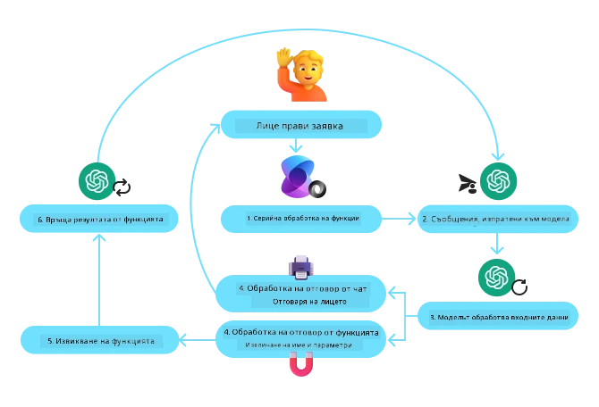
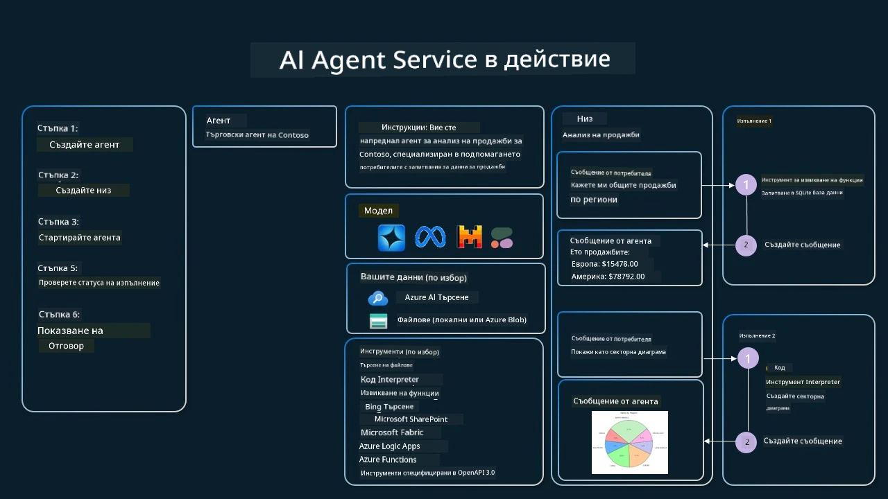

[](https://youtu.be/vieRiPRx-gI?si=cEZ8ApnT6Sus9rhn)

> _(Кликнете върху изображението по-горе, за да гледате видеото на този урок)_

# Дизайн патерн „Използване на инструменти“

Инструментите са интересни, защото позволяват на AI агентите да имат по-широк набор от възможности. Вместо агентът да има ограничен набор от действия, които може да изпълни, чрез добавяне на инструмент, агентът вече може да изпълнява широк кръг действия. В тази глава ще разгледаме дизайн патерна „Използване на инструменти“, който описва как AI агентите могат да използват конкретни инструменти, за да постигнат целите си.

## Въведение

В този урок ще търсим отговор на следните въпроси:

- Какво е дизайн патерн „Използване на инструменти“?
- В какви случаи на употреба може да се приложи?
- Какви са елементите/строителните блокове, необходими за реализиране на дизайн патерна?
- Какви специални съображения трябва да се вземат предвид при използването на дизайн патерна „Използване на инструменти“ за изграждане на надеждни AI агенти?

## Учебни цели

След завършването на този урок ще можете да:

- Дефинирате дизайн патерна „Използване на инструменти“ и неговата цел.
- Идентифицирате случаи на употреба, където дизайн патернът може да се приложи.
- Разбирате ключовите елементи, необходими за прилагане на дизайн патерна.
- Разпознавате съображения за осигуряване на надеждност при AI агенти, използващи този дизайн патерн.

## Какво е дизайн патерн „Използване на инструменти“?

**Дизайн патернът „Използване на инструменти“** се фокусира върху предоставянето на LLM възможността да взаимодейства с външни инструменти за постигане на конкретни цели. Инструментите са код, който може да бъде изпълняван от агент за извършване на действия. Инструмент може да бъде проста функция като калкулатор, или повикване към API на трета страна, например за търсене на цена на акции или прогноза за времето. В контекста на AI агентите, инструментите са проектирани да се изпълняват от агентите в отговор на **функционални повиквания, генерирани от модела**.

## В какви случаи на употреба може да се приложи?

AI агентите могат да използват инструменти, за да изпълняват сложни задачи, да извличат информация или да вземат решения. Дизайн патернът за използване на инструменти често се прилага в сценарии, изискващи динамично взаимодействие с външни системи, като бази данни, уеб услуги или интерпретатори на код. Тази способност е полезна за редица различни случаи на употреба, включително:

- **Динамично извличане на информация:** Агентите могат да правят заявки към външни API или бази данни, за да получават актуални данни (например заявки към SQLite база данни за анализ на данни, извличане на цени на акции или информация за времето).
- **Изпълнение и интерпретиране на код:** Агентите могат да изпълняват код или скриптове за решаване на математически задачи, генериране на доклади или провеждане на симулации.
- **Автоматизация на работни процеси:** Автоматизиране на повторяеми или многостъпкови работни процеси чрез интегриране на инструменти като планировчици на задачи, имейл услуги или данниливи потоци.
- **Обслужване на клиенти:** Агентите могат да взаимодействат с CRM системи, платформи за заявки или бази знания за решаване на потребителски запитвания.
- **Генериране и редактиране на съдържание:** Агентите могат да използват инструменти като граматически проверяващи, текстови резюматори или оценки за безопасност на съдържанието, за да подпомогнат задачи по създаване на съдържание.

## Какви са елементите/строителните блокове, необходими за реализиране на дизайн патерна „Използване на инструменти“?

Тези строителни блокове позволяват на AI агента да изпълнява широк спектър от задачи. Нека разгледаме ключовите елементи, необходими за реализиране на дизайн патерна „Използване на инструменти“:

- **Схеми на функции/инструменти**: Подробни дефиниции на наличните инструменти, включително името на функцията, целта, необходимите параметри и очакваните изходи. Тези схеми позволяват на LLM да разбере какви инструменти са налични и как да конструира валидни заявки.

- **Логика за изпълнение на функции**: Управлява кога и как се повикват инструментите въз основа на намерението на потребителя и контекста на разговора. Това може да включва планови модули, механизми за маршрутизиране или условни потоци, които динамично определят използването на инструменти.

- **Система за управление на съобщенията**: Компоненти, които управляват разговорния поток между потребителските входове, отговорите от LLM, повикванията към инструменти и техните изходи.

- **Рамка за интеграция на инструменти**: Инфраструктура, която свързва агента с различни инструменти, независимо дали са прости функции или сложни външни услуги.

- **Обработка на грешки и валидиране**: Механизми за справяне с неуспешни изпълнения на инструменти, валидиране на параметри и управление на неочаквани отговори.

- **Управление на състоянието**: Следи контекста на разговора, предишните взаимодействия с инструменти и постоянни данни, за да осигури последователност при многоходови взаимодействия.

Следващата тема разглежда по-подробно повикването на функции/инструменти.
 
### Повикване на функции/инструменти

Повикването на функции е основният начин, по който позволяваме на големите езикови модели (LLM) да взаимодействат с инструменти. Често ще виждате „Функция“ и „Инструмент“ използвани взаимозаменяемо, тъй като „функции“ (блокове от повторно използваем код) са „инструментите“, които агентите използват за изпълнение на задачи. За да бъде изпълнен код на функция, LLM трябва да сравни заявката на потребителя с описанието на функциите. За това се изпраща схема, съдържаща описанията на всички налични функции към LLM. След това LLM избира най-подходящата функция за задачата и връща нейното име и аргументи. Избраната функция се извиква, отговорът ѝ се изпраща обратно към LLM, който използва информацията, за да отговори на заявката на потребителя.

За разработчиците, които искат да реализират повикване на функции за агенти, ще са нужни:

1. LLM модел, който поддържа повикване на функции
2. Схема, съдържаща описания на функциите
3. Код за всяка описана функция

Нека илюстрираме с пример за получаване на текущото време в град:

1. **Инициализиране на LLM, който поддържа повикване на функции:**

    Не всички модели поддържат повикване на функции, затова е важно да проверите, че моделът, който използвате, го поддържа. <a href="https://learn.microsoft.com/azure/ai-services/openai/how-to/function-calling" target="_blank">Azure OpenAI</a> поддържа повикване на функции. Можем да започнем, като инициализираме клиента на Azure OpenAI.

    ```python
    # Инициализирайте клиента на Azure OpenAI
    client = AzureOpenAI(
        azure_endpoint = os.getenv("AZURE_AI_PROJECT_ENDPOINT"), 
        api_key=os.getenv("AZURE_OPENAI_API_KEY"),  
        api_version="2024-05-01-preview"
    )
    ```

1. **Създаване на схема на функция:**

    След това ще дефинираме JSON схема, която съдържа името на функцията, описание на това какво прави функцията и имената и описанията на параметрите на функцията.
    След това подаваме тази схема на клиента, създаден по-рано, заедно с заявката на потребителя да открие времето в Сан Франциско. Важно е да се отбележи, че се връща **повикване на инструмент**, **а не** окончателният отговор на въпроса. Както беше споменато по-рано, LLM връща името на функцията, която е избрал за задачата, и аргументите, които ще бъдат предадени на нея.

    ```python
    # Описание на функцията за модела да прочете
    tools = [
        {
            "type": "function",
            "function": {
                "name": "get_current_time",
                "description": "Get the current time in a given location",
                "parameters": {
                    "type": "object",
                    "properties": {
                        "location": {
                            "type": "string",
                            "description": "The city name, e.g. San Francisco",
                        },
                    },
                    "required": ["location"],
                },
            }
        }
    ]
    ```
   
    ```python
  
    # Първоначално съобщение от потребителя
    messages = [{"role": "user", "content": "What's the current time in San Francisco"}] 
  
    # Първо извикване на API: Помолете модела да използва функцията
      response = client.chat.completions.create(
          model=deployment_name,
          messages=messages,
          tools=tools,
          tool_choice="auto",
      )
  
      # Обработете отговора на модела
      response_message = response.choices[0].message
      messages.append(response_message)
  
      print("Model's response:")  

      print(response_message)
  
    ```

    ```bash
    Model's response:
    ChatCompletionMessage(content=None, role='assistant', function_call=None, tool_calls=[ChatCompletionMessageToolCall(id='call_pOsKdUlqvdyttYB67MOj434b', function=Function(arguments='{"location":"San Francisco"}', name='get_current_time'), type='function')])
    ```
  
1. **Кодът на функцията, необходим за извършване на задачата:**

    След като LLM е избрал коя функция трябва да се изпълни, кодът, който изпълнява задачата, трябва да бъде реализиран и изпълнен.
    Можем да реализираме кода, за да получим текущото време на Python. Също така ще трябва да напишем код, който извлича името и аргументите от response_message, за да получим окончателния резултат.

    ```python
      def get_current_time(location):
        """Get the current time for a given location"""
        print(f"get_current_time called with location: {location}")  
        location_lower = location.lower()
        
        for key, timezone in TIMEZONE_DATA.items():
            if key in location_lower:
                print(f"Timezone found for {key}")  
                current_time = datetime.now(ZoneInfo(timezone)).strftime("%I:%M %p")
                return json.dumps({
                    "location": location,
                    "current_time": current_time
                })
      
        print(f"No timezone data found for {location_lower}")  
        return json.dumps({"location": location, "current_time": "unknown"})
    ```

     ```python
     # Обработвайте извиквания на функции
      if response_message.tool_calls:
          for tool_call in response_message.tool_calls:
              if tool_call.function.name == "get_current_time":
     
                  function_args = json.loads(tool_call.function.arguments)
     
                  time_response = get_current_time(
                      location=function_args.get("location")
                  )
     
                  messages.append({
                      "tool_call_id": tool_call.id,
                      "role": "tool",
                      "name": "get_current_time",
                      "content": time_response,
                  })
      else:
          print("No tool calls were made by the model.")  
  
      # Второ повикване на API: Получете окончателния отговор от модела
      final_response = client.chat.completions.create(
          model=deployment_name,
          messages=messages,
      )
  
      return final_response.choices[0].message.content
     ```

     ```bash
      get_current_time called with location: San Francisco
      Timezone found for san francisco
      The current time in San Francisco is 09:24 AM.
     ```

Повикването на функции е в сърцето на повечето, ако не и всички, дизайн патерни за използване на инструменти от агенти, но неговата реализация от нулата понякога може да бъде предизвикателство.
Както научихме в [Урок 2](../../../02-explore-agentic-frameworks), агентните рамки ни предоставят предварително изградени строителни блокове за реализиране на използване на инструменти.
 
## Примери за използване на инструменти с агентни рамки

Ето няколко примера как можете да реализирате дизайн патерна „Използване на инструменти“ с различни агентни рамки:

### Microsoft Agent Framework

<a href="https://learn.microsoft.com/azure/ai-services/agents/overview" target="_blank">Microsoft Agent Framework</a> е open-source AI рамка за изграждане на AI агенти. Тя опростява процеса на използване на повикване на функции, като ви позволява да дефинирате инструменти като Python функции с декоратора `@tool`. Рамката обработва комуникацията напред-назад между модела и вашия код. Също така предоставя достъп до предварително изготвени инструменти като Търсене на файлове и Код интерпретатор чрез `AzureAIProjectAgentProvider`.

Следната диаграма илюстрира процеса на повикване на функции с Microsoft Agent Framework:



В Microsoft Agent Framework инструментите се дефинират като декорирани функции. Можем да преобразуваме функцията `get_current_time`, която видяхме по-рано, в инструмент, като използваме декоратора `@tool`. Рамката автоматично сериализира функцията и нейните параметри, създавайки схемата, която да бъде изпратена към LLM.

```python
from agent_framework import tool
from agent_framework.azure import AzureAIProjectAgentProvider
from azure.identity import AzureCliCredential

@tool
def get_current_time(location: str) -> str:
    """Get the current time for a given location"""
    ...

# Създаване на клиента
provider = AzureAIProjectAgentProvider(credential=AzureCliCredential())

# Създайте агент и стартирайте с инструмента
agent = await provider.create_agent(name="TimeAgent", instructions="Use available tools to answer questions.", tools=get_current_time)
response = await agent.run("What time is it?")
```
  
### Azure AI Agent Service

<a href="https://learn.microsoft.com/azure/ai-services/agents/overview" target="_blank">Azure AI Agent Service</a> е по-нова агентна рамка, предназначена да даде възможност на разработчиците да изграждат, внедряват и скалират сигурно висококачествени и разширяеми AI агенти, без да се налага да управляват основните изчислителни и съхранителни ресурси. Тя е особено полезна за корпоративни приложения, тъй като е напълно управлявана услуга с корпоративна степен на сигурност.

В сравнение с разработка директно с LLM API, Azure AI Agent Service предоставя някои предимства, включително:

- Автоматично повикване на инструменти – няма нужда да анализирате повикване към инструмент, да го извиквате и обработвате отговора; всичко това вече се извършва от сървъра
- Сигурно управлявани данни – вместо да управлявате сами състоянието на разговора, може да използвате нишки за съхраняване на необходимата информация
- Инструменти „от кутията“ – инструменти, които можете да използвате, за да взаимодействате с източници на данни, като Bing, Azure AI Search и Azure Functions.

Инструментите, налични в Azure AI Agent Service, могат да се разделят на две категории:

1. Инструменти за знания:
    - <a href="https://learn.microsoft.com/azure/ai-services/agents/how-to/tools/bing-grounding?tabs=python&pivots=overview" target="_blank">Основа с Bing Search</a>
    - <a href="https://learn.microsoft.com/azure/ai-services/agents/how-to/tools/file-search?tabs=python&pivots=overview" target="_blank">Търсене на файлове</a>
    - <a href="https://learn.microsoft.com/azure/ai-services/agents/how-to/tools/azure-ai-search?tabs=azurecli%2Cpython&pivots=overview-azure-ai-search" target="_blank">Azure AI Search</a>

2. Инструменти за действия:
    - <a href="https://learn.microsoft.com/azure/ai-services/agents/how-to/tools/function-calling?tabs=python&pivots=overview" target="_blank">Повикване на функции</a>
    - <a href="https://learn.microsoft.com/azure/ai-services/agents/how-to/tools/code-interpreter?tabs=python&pivots=overview" target="_blank">Код интерпретатор</a>
    - <a href="https://learn.microsoft.com/azure/ai-services/agents/how-to/tools/openapi-spec?tabs=python&pivots=overview" target="_blank">Инструменти, дефинирани с OpenAPI</a>
    - <a href="https://learn.microsoft.com/azure/ai-services/agents/how-to/tools/azure-functions?pivots=overview" target="_blank">Azure Functions</a>

Услугата Agent Service ни позволява да използваме тези инструменти заедно като „инструментален комплект“ (toolset). Тя също така използва „нишки“ (threads), които проследяват историята на съобщенията от конкретен разговор.

Представете си, че сте търговски агент във фирма на име Contoso. Искате да създадете разговорен агент, който може да отговаря на въпроси относно вашите данни за продажби.

Следната снимка илюстрира как бихте могли да използвате Azure AI Agent Service, за да анализирате данните си за продажби:



За да използваме някой от тези инструменти с услугата, можем да създадем клиент и да дефинираме инструмент или инструментален комплект. За практическата реализация можем да използваме следния Python код. LLM ще може да разгледа инструменталния комплект и да реши дали да използва създадената от потребителя функция `fetch_sales_data_using_sqlite_query`, или предварително изградената Code Interpreter в зависимост от потребителската заявка.

```python 
import os
from azure.ai.projects import AIProjectClient
from azure.identity import DefaultAzureCredential
from fetch_sales_data_functions import fetch_sales_data_using_sqlite_query # функция fetch_sales_data_using_sqlite_query, която може да бъде намерена във файла fetch_sales_data_data_functions.py.
from azure.ai.projects.models import ToolSet, FunctionTool, CodeInterpreterTool

project_client = AIProjectClient.from_connection_string(
    credential=DefaultAzureCredential(),
    conn_str=os.environ["PROJECT_CONNECTION_STRING"],
)

# Инициализиране на набор от инструменти
toolset = ToolSet()

# Инициализиране на агент за извикване на функции с функцията fetch_sales_data_using_sqlite_query и добавянето ѝ към набора от инструменти
fetch_data_function = FunctionTool(fetch_sales_data_using_sqlite_query)
toolset.add(fetch_data_function)

# Инициализиране на инструмент за интерпретатор на код и добавянето му към набора от инструменти.
code_interpreter = CodeInterpreterTool()toolset.add(code_interpreter)

agent = project_client.agents.create_agent(
    model="gpt-4o-mini", name="my-agent", instructions="You are helpful agent", 
    toolset=toolset
)
```

## Какви са специалните съображения при използването на дизайн патерна „Използване на инструменти“ за изграждане на надеждни AI агенти?

Чест проблем при динамично генериран SQL от LLM е сигурността, по-специално рискът от SQL инжекции или злонамерени действия, като изтриване или манипулация на базата данни. Въпреки че тези опасения са валидни, те могат ефективно да бъдат смекчени чрез правилна конфигурация на разрешенията за достъп до базата данни. За повечето бази данни това включва конфигуриране на базата като само за четене. За бази данни като PostgreSQL или Azure SQL, приложението трябва да получи роля само за четене (SELECT).

Изпълнението на приложението в защитена среда също повишава защитата. В корпоративни сценарии, данните обикновено се извличат и трансформират от оперативните системи в база данни или склад за данни само за четене с потребителски удобна схема. Този подход гарантира, че данните са сигурни, оптимизирани за производителност и достъпност и че приложението има ограничен, само за четене достъп.

## Примери с код

- Python: [Agent Framework](./code_samples/04-python-agent-framework.ipynb)
- .NET: [Agent Framework](./code_samples/04-dotnet-agent-framework.md)

## Имате още въпроси относно дизайн патерна „Използване на инструменти“?

Присъединете се към [Microsoft Foundry Discord](https://discord.com/invite/ATgtXmAS5D), за да се срещнете с други обучаващи се, да участвате в офис часове и да получите отговори на въпросите си за AI агенти.

## Допълнителни ресурси

- <a href="https://microsoft.github.io/build-your-first-agent-with-azure-ai-agent-service-workshop/" target="_blank">Работилница за Azure AI Agents Service</a>
- <a href="https://github.com/Azure-Samples/contoso-creative-writer/tree/main/docs/workshop" target="_blank">Contoso Creative Writer Multi-Agent Workshop</a>
- <a href="https://learn.microsoft.com/azure/ai-services/agents/overview" target="_blank">Обзор на Microsoft Agent Framework</a>

## Предишен урок

[Разбиране на агентните дизайн патерни](../03-agentic-design-patterns/README.md)

## Следващ урок
[Agentic RAG](../05-agentic-rag/README.md)

---

<!-- CO-OP TRANSLATOR DISCLAIMER START -->
**Отказ от отговорност**:
Този документ е преведен с помощта на AI преводачески услуга [Co-op Translator](https://github.com/Azure/co-op-translator). Въпреки че се стремим към точност, моля имайте предвид, че автоматизираните преводи могат да съдържат грешки или неточности. Оригиналният документ на неговия роден език трябва да се счита за авторитетен източник. За критична информация се препоръчва професионален човешки превод. Ние не носим отговорност за каквито и да е недоразумения или неправилни тълкувания, произтичащи от използването на този превод.
<!-- CO-OP TRANSLATOR DISCLAIMER END -->