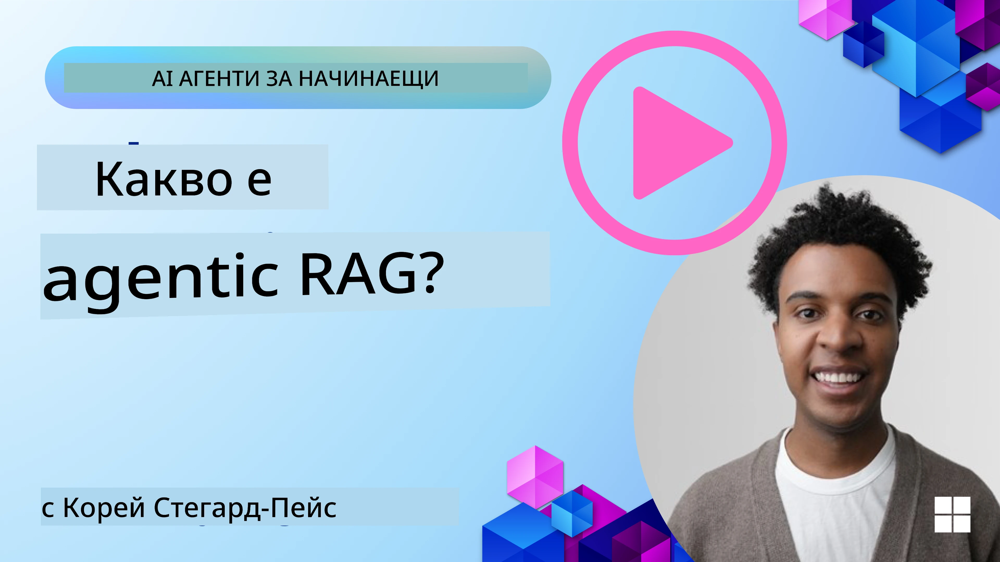
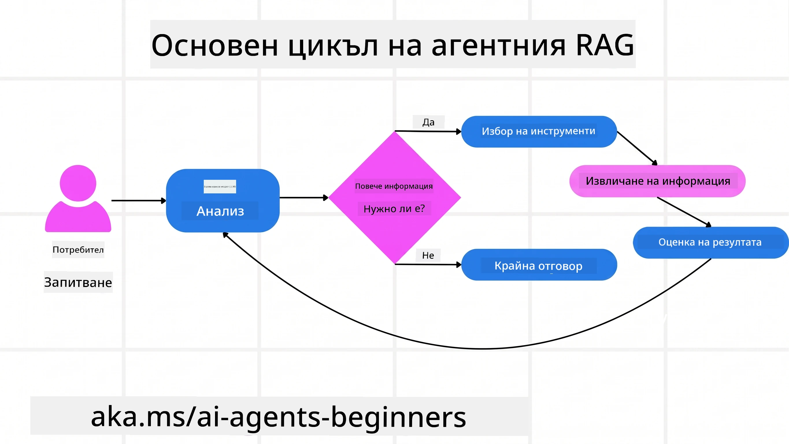
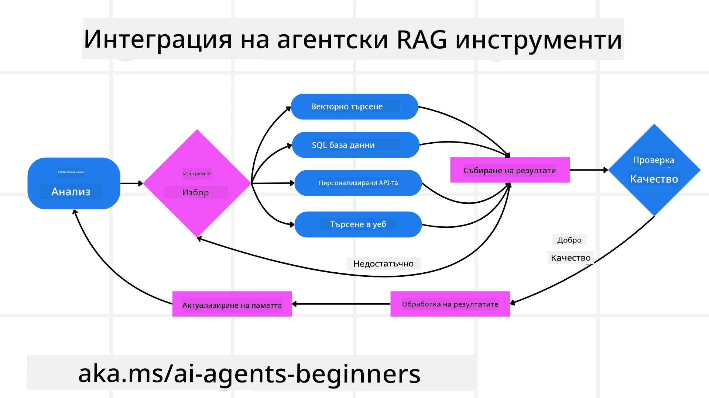
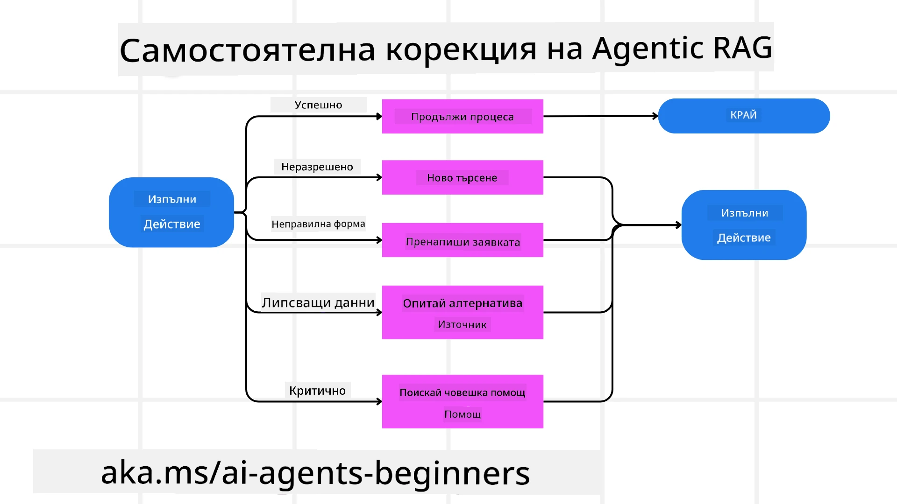
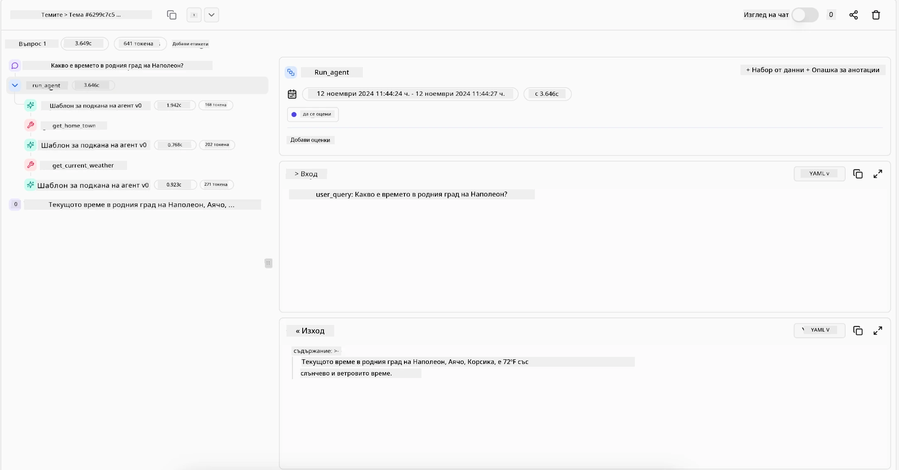

> _(Кликнете върху изображението по-горе, за да гледате видеото на този урок)_

# Agentic RAG

Този урок предоставя изчерпателен преглед на Agentic Retrieval-Augmented Generation (Agentic RAG), нова парадигма в изкуствения интелект, при която големите езикови модели (LLM) автономно планират следващите си стъпки, докато извличат информация от външни източници. За разлика от статичните модели за извличане и след това четене, Agentic RAG включва итеративни повиквания към LLM, редуващи се с използване на инструменти или функции и структурирани изходи. Системата оценява резултатите, усъвършенства заявките, използва допълнителни инструменти при нужда и продължава този цикъл, докато не постигне задоволително решение.

## Въведение

В този урок ще разгледаме

- **Разбиране на Agentic RAG:** Научете за новата парадигма в изкуствения интелект, при която големите езикови модели (LLM) автономно планират следващите си стъпки, докато извличат информация от външни източници на данни.
- **Осъзнаване на итеративния Maker-Checker стил:** Разберете цикъла на итеративни повиквания към LLM, редуващи се с инструментални или функционални повиквания и структурирани изходи, предназначени да подобрят точността и да обработват неправилни заявки.
- **Изследване на практически приложения:** Идентифицирайте сценарии, в които Agentic RAG изпъква, като среди, изискващи точност, сложни взаимодействия с бази данни и разширени работни процеси.

## Учебни цели

След завършване на този урок ще знаете/разбирате:

- **Разбиране на Agentic RAG:** Научете за новата парадигма в изкуствения интелект, при която големите езикови модели (LLM) автономно планират следващите си стъпки, докато извличат информация от външни източници на данни.
- **Итеративен Maker-Checker стил:** Осъзнайте концепцията за цикъл на итеративни повиквания към LLM, редуващи се с инструментални или функционални повиквания и структурирани изходи, предназначени да подобрят точността и да обработват неправилни заявки.
- **Управление на процеса на разсъждение:** Разберете способността на системата да управлява своя процес на разсъждение, като взема решения за подхода към проблемите без да разчита на предварително дефинирани пътища.
- **Работен процес:** Разберете как агентен модел самостоятелно решава да извлече доклади за пазарни тенденции, да идентифицира данни за конкуренти, да корелира вътрешни продажбени метрики, да синтезира резултатите и да оценява стратегията.
- **Итеративни цикли, интеграция на инструменти и памет:** Научете за зависимостта на системата от цикличен модел на взаимодействие, поддържането на състояние и памет през стъпките, за да се избегнат повтарящи се цикли и да се вземат информирани решения.
- **Обработка на грешки и само-корекция:** Изследвайте robustните механизми за само-корекция на системата, включително итерации и повторно запитване, използване на диагностични инструменти и връщане към човешки надзор.
- **Граници на агентността:** Разберете ограниченията на Agentic RAG, със специален фокус върху автономността в специфични домейни, зависимостта от инфраструктурата и спазването на ограничители.
- **Практически случаи и стойност:** Идентифицирайте сценарии, в които Agentic RAG изпъква, като среди, изискващи точност, сложни взаимодействия с бази данни и разширени работни процеси.
- **Управление, прозрачност и доверие:** Научете за важността на управлението и прозрачността, включително обяснимо разсъждение, контрол на пристрастията и човешки надзор.

## Какво е Agentic RAG?

Agentic Retrieval-Augmented Generation (Agentic RAG) е нова парадигма в изкуствения интелект, при която големите езикови модели (LLM) автономно планират следващите си стъпки, докато извличат информация от външни източници. За разлика от статичните модели за извличане и след това четене, Agentic RAG включва итеративни повиквания към LLM, редуващи се с използване на инструменти или функции и структурирани изходи. Системата оценява резултатите, усъвършенства заявките, използва допълнителни инструменти при нужда и продължава този цикъл, докато не постигне задоволително решение. Този итеративен “maker-checker” стил подобрява точността, позволява обработване на неправилни заявки и гарантира висококачествени резултати.

Системата активно управлява процеса на разсъждение, пренаписва неуспешни заявки, избира различни методи за извличане и интегрира множество инструменти — като векторни търсения в Azure AI Search, SQL бази данни или персонализирани API-та — преди да финализира отговора си. Отличителната черта на агентната система е способността ѝ да управлява процеса на разсъждение. Традиционните RAG реализации разчитат на предварително дефинирани пътища, но агентната система автономно определя последователността на стъпките въз основа на качеството на намерената информация.

## Дефиниране на Agentic Retrieval-Augmented Generation (Agentic RAG)

Agentic Retrieval-Augmented Generation (Agentic RAG) е нова парадигма в AI разработките, при която LLM не само извличат информация от външни източници на данни, но и автономно планират следващите си стъпки. За разлика от статичните модели за извличане и четене или внимателно скриптирани последователности от prompt-и, Agentic RAG включва цикъл на итеративни повиквания към LLM, редуващи се с инструментални или функционални повиквания и структурирани изходи. При всяка стъпка системата оценява резултатите, решава дали да усъвършенства заявките си, използва допълнителни инструменти при нужда и продължава този цикъл, докато не постигне задоволително решение.

Този итеративен “maker-checker” стил на работа е предназначен да подобри коректността, да обработва неправилни заявки към структурирани бази данни (например NL2SQL) и да гарантира балансирани, висококачествени резултати. Вместо да разчита само на внимателно създадени вериги от prompt-и, системата активно управлява процеса си на разсъждение. Тя може да пренаписва неуспешни заявки, да избира различни методи за извличане и да интегрира множество инструменти — като векторно търсене в Azure AI Search, SQL бази данни или персонализирани API-та — преди да финализира своя отговор. Това премахва нуждата от прекалено сложни оркестрационни рамки. Вместо това сравнително прост цикъл „LLM повикване → използване на инструмент → LLM повикване → …“ може да произведе сложни и добре обосновани изходи.

## Управление на процеса на разсъждение

Отличителната черта, която прави една система „агентна“, е способността ѝ да управлява процеса си на разсъждение. Традиционните RAG реализации често разчитат на това, че хората предварително определят път за модела: мисловен процес, който очертава какво да се извлича и кога.
Но когато системата е наистина агентна, тя вътрешно решава как да подхожда към проблема. Тя не просто изпълнява скрипт; автономно определя последователността на стъпките въз основа на качеството на намерената информация.
Например, ако ѝ бъде поискано да създаде стратегия за пускане на продукт, тя не разчита само на prompt, който описва целия изследователски и вземащ решения работен процес. Вместо това агентният модел самостоятелно решава да:

1. Извлече актуални доклади за пазарни тенденции с помощта на Bing Web Grounding
2. Идентифицира релевантни данни за конкуренти с използване на Azure AI Search.
3. Корелира исторически вътрешни метрики за продажби чрез Azure SQL Database.
4. Синтезира откритията в съгласувана стратегия, оркестрирана чрез Azure OpenAI Service.
5. Оцени стратегията за пропуски или несъответствия, което налага още един кръг на извличане, ако е необходимо.
Всички тези стъпки — усъвършенстване на заявки, избор на източници, итерации докато е „доволен“ от отговора — са решавани от модела, а не предварително скриптирани от човек.

## Итеративни цикли, интеграция на инструменти и памет

Агентна система разчита на цикличен модел на взаимодействие:

- **Първоначално повикване:** Целта на потребителя (т.е. потребителският prompt) се подава на LLM.
- **Извикване на инструмент:** Ако моделът установи липсваща информация или неясни инструкции, той избира инструмент или метод за извличане — като запитване към векторна база данни (например Azure AI Search Hybrid търсене върху частни данни) или структурирано SQL повикване — за да събере повече контекст.
- **Оценка и усъвършенстване:** След преглед на върнатите данни, моделът решава дали информацията е достатъчна. Ако не, уточнява заявката, опитва друг инструмент или променя подхода си.
- **Повтаряне докато е доволен:** Този цикъл продължава, докато моделът определи, че има достатъчна яснота и доказателства, за да предостави финален добре обоснован отговор.
- **Памет и състояние:** Тъй като системата поддържа състояние и памет през всички стъпки, тя може да си спомня предишни опити и резултати, избягвайки повтарящи се цикли и вземайки по-информирани решения при прогреса.

С времето това създава усещане за еволюиращо разбиране, което позволява на модела да навигира в сложни, многостъпкови задачи без необходимост от постоянна човешка намеса или преправяне на prompt-а.

## Обработка на грешки и само-корекция

Автономността на Agentic RAG включва и robust механизми за само-корекция. Когато системата срещне задънени улици — като извличане на нерелевантни документи или неправилни заявки — тя може:

- **Итерация и повторно запитване:** Вместо да връща нискокачествени отговори, моделът опитва нови стратегии за търсене, пренаписва базови заявки или разглежда алтернативни набори от данни.
- **Използване на диагностични инструменти:** Системата може да извика допълнителни функции, предназначени да ѝ помогнат да диагностицира стъпките на разсъждение или да потвърди коректността на извлечените данни. Инструменти като Azure AI Tracing ще са важни за осигуряване на robust наблюдение и мониторинг.
- **Връщане към човешки надзор:** При високорискови или повтарящо се провалящи се сценарии, моделът може да сигнализира несигурност и да поиска човешко ръководство. След като човек предостави корективна обратна връзка, моделът може да я интегрира за бъдещо обучение.

Този итеративен и динамичен подход позволява на модела да се подобрява непрекъснато, като гарантира, че не е система с еднократно изпълнение, а такава, която се учи от грешките си в рамките на дадена сесия.

## Граници на агентността

Въпреки своята автономия в рамките на задача, Agentic RAG не е еквивалентен на Изкуствен Общ Интелект. Неговите „агентни“ възможности са ограничени до инструментите, източниците на данни и политиките, предоставени от човешките разработчици. Той не може да изобретява собствени инструменти или да излиза извън определените домейни. Вместо това той се отличава с динамичната оркестрация на наличните ресурси.
Основните разлики спрямо по-напреднали AI форми включват:

1. **Автономия в конкретен домейн:** Agentic RAG системите са фокусирани върху достигане на дефинирани от потребителя цели в познат домейн, прилагайки стратегии като пренаписване на заявки или избор на инструменти за подобряване на резултатите.
2. **Зависимост от инфраструктурата:** Възможностите на системата зависят от инструментите и данните, интегрирани от разработчиците. Тя не може да надхвърля тези граници без човешка намеса.
3. **Спазване на ограничители:** Етичните насоки, правилата за съответствие и бизнес политиките остават много важни. Свободата на агента винаги е ограничена от мерки за безопасност и механизми за надзор (с надежда).

## Практически случаи и стойност

Agentic RAG изпъква в сценарии, изискващи итеративно усъвършенстване и прецизност:

1. **Среди с приоритет на точността:** В проверки за съответствие, регулаторни анализи или правни изследвания агентният модел може многократно да проверява факти, да консултира множество източници и да пренаписва заявки, докато не произведе изцяло проверен отговор.
2. **Сложни взаимодействия с бази данни:** При работа със структурирани данни, където заявки често се провалят или се налагат корекции, системата може автономно да усъвършенства заявките си чрез Azure SQL или Microsoft Fabric OneLake, гарантирайки, че крайното извличане съответства на намерението на потребителя.
3. **Разширени работни процеси:** Продължителни сесии могат да се развиват с появата на нова информация. Agentic RAG може непрекъснато да интегрира нови данни, променяйки стратегии с натрупването на знания за проблемната област.

## Управление, прозрачност и доверие

С навлизането на тези системи в по-автономно разсъждение, управлението и прозрачността стават критични:

- **Обяснимо разсъждение:** Моделът може да предостави пълен запис на направените заявки, консултираните източници и стъпките на разсъждение, които е предприел, за да достигне заключението си. Инструменти като Azure AI Content Safety и Azure AI Tracing / GenAIOps помагат за поддържане на прозрачност и намаляване на рисковете.
- **Контрол на пристрастията и балансирано извличане:** Разработчиците могат да настройват стратегии за извличане, за да се гарантира, че се разглеждат балансирани, представителни източници на данни, както и редовно да преглеждат изходите за детектиране на пристрастия или изкривявания, използвайки персонализирани модели за напреднали организации по науки за данни с Azure Machine Learning.
- **Човешки надзор и спазване:** При чувствителни задачи човешкият преглед остава съществен. Agentic RAG не заменя човешкото решение при важни решения — той го допълва, предоставяйки по-задълбочено проверени варианти.

Притежаването на инструменти, които осигуряват ясен запис на действията, е от ключово значение. Без тях диагностицирането на многостъпков процес може да е много трудно. Вижте следния пример от Literal AI (компанията зад Chainlit) за агентско изпълнение:

## Заключение

Agentic RAG представлява естествена еволюция в начина, по който AI системите обработват сложни задачи с голям обем данни. Чрез приемане на цикличен модел на взаимодействие, автономен избор на инструменти и усъвършенстване на заявките докато се постигне висококачествен резултат, системата преминава отвъд статичното следване на prompt-и към по-адаптивен и осведомен при контекст вземащ решения. Въпреки че все още е ограничена от човешки дефинирани инфраструктури и етични насоки, тези агентни възможности позволяват по-богати, по-динамични и в крайна сметка по-полезни AI взаимодействия както за предприятия, така и за крайни потребители.

### Имата ли още въпроси за Agentic RAG?

Присъединете се към [Microsoft Foundry Discord](https://discord.com/invite/ATgtXmAS5D), за да се срещнете с други учащи, да посетите работни часове и да получите отговори на въпросите си за AI агенти.

## Допълнителни ресурси

- <a href="https://learn.microsoft.com/training/modules/use-own-data-azure-openai" target="_blank">Реализиране на Retrieval Augmented Generation (RAG) с Azure OpenAI Service: Научете как да използвате собствените си данни с Azure OpenAI Service. Този Microsoft Learn модул предоставя изчерпателно ръководство за реализиране на RAG</a>
- <a href="https://learn.microsoft.com/azure/ai-studio/concepts/evaluation-approach-gen-ai" target="_blank">Оценка на генеративни AI приложения с Microsoft Foundry: Тази статия обхваща оценката и сравнението на модели върху публично достъпни набори от данни, включително Agentic AI приложения и RAG архитектури</a>
- <a href="https://weaviate.io/blog/what-is-agentic-rag" target="_blank">Какво е Agentic RAG | Weaviate</a>
- <a href="https://ragaboutit.com/agentic-rag-a-complete-guide-to-agent-based-retrieval-augmented-generation/" target="_blank">Agentic RAG: Пълно ръководство за агентно базирано Retrieval Augmented Generation – Новини от generation RAG</a>
- <a href="https://huggingface.co/learn/cookbook/agent_rag" target="_blank">Agentic RAG: увеличете мощността на вашия RAG с преформулиране на заявки и само-заявяване! Кулинарна книга за изкуствен интелект с отворен код на Hugging Face</a>
- <a href="https://youtu.be/aQ4yQXeB1Ss?si=2HUqBzHoeB5tR04U" target="_blank">Добавяне на агентски слоеве към RAG</a>
- <a href="https://www.youtube.com/watch?v=zeAyuLc_f3Q&t=244s" target="_blank">Бъдещето на помощниците по знание: Джери Лю</a>
- <a href="https://www.youtube.com/watch?v=AOSjiXP1jmQ" target="_blank">Как да изградим агентски RAG системи</a>
- <a href="https://ignite.microsoft.com/sessions/BRK102?source=sessions" target="_blank">Използване на Microsoft Foundry Agent Service за мащабиране на вашите AI агенти</a>

### Академични статии

- <a href="https://arxiv.org/abs/2303.17651" target="_blank">2303.17651 Self-Refine: Итеративно усъвършенстване със самостоятелна обратна връзка</a>
- <a href="https://arxiv.org/abs/2303.11366" target="_blank">2303.11366 Reflexion: Езикови агенти с вербално обучение чрез подсилване</a>
- <a href="https://arxiv.org/abs/2305.11738" target="_blank">2305.11738 CRITIC: Големи езикови модели могат сами да се коригират с интерактивна критика с инструменти</a>
- <a href="https://arxiv.org/abs/2501.09136" target="_blank">2501.09136 Agentic Retrieval-Augmented Generation: Преглед на агентски RAG</a>

## Предишен урок

[Дизайн шаблон за използване на инструменти](../04-tool-use/README.md)

## Следващ урок

[Изграждане на надеждни AI агенти](../06-building-trustworthy-agents/README.md)

---

<!-- CO-OP TRANSLATOR DISCLAIMER START -->
**Отказ от отговорност**:
Този документ е преведен с помощта на AI преводачески услуга [Co-op Translator](https://github.com/Azure/co-op-translator). Въпреки че се стремим към точност, моля имайте предвид, че автоматизираните преводи могат да съдържат грешки или неточности. Оригиналният документ на неговия роден език трябва да се счита за авторитетен източник. За критична информация се препоръчва професионален човешки превод. Ние не носим отговорност за каквито и да е недоразумения или неправилни тълкувания, произтичащи от използването на този превод.
<!-- CO-OP TRANSLATOR DISCLAIMER END -->