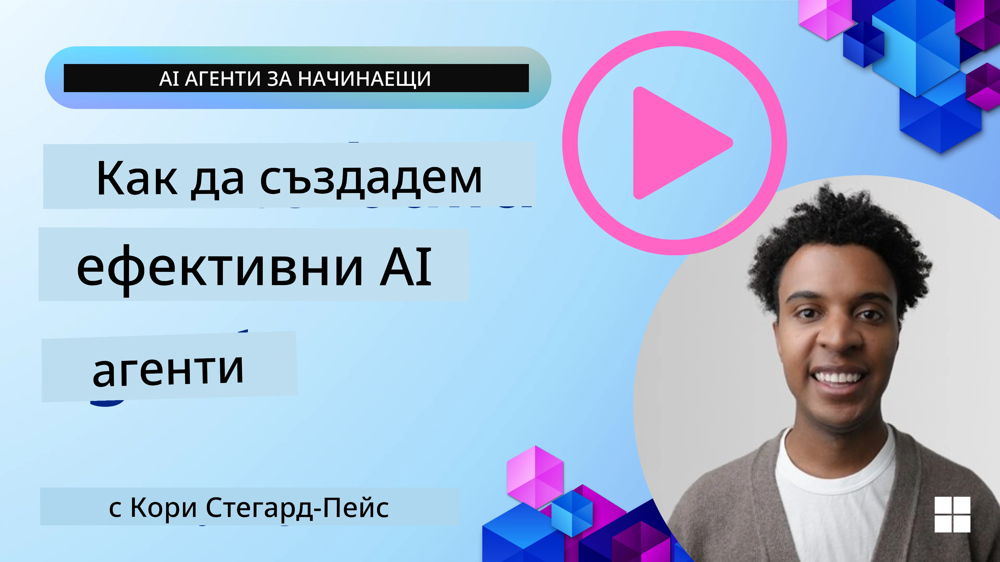
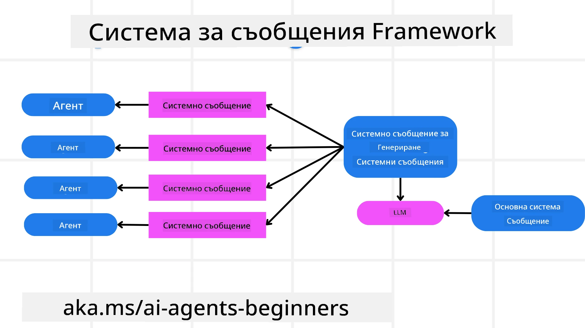
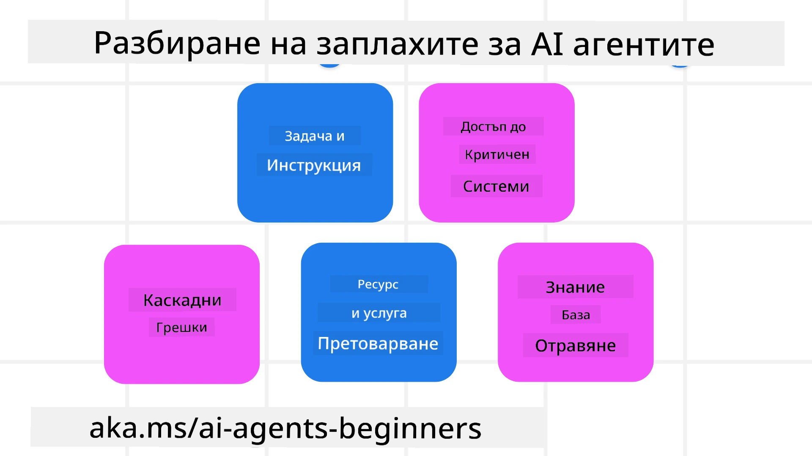
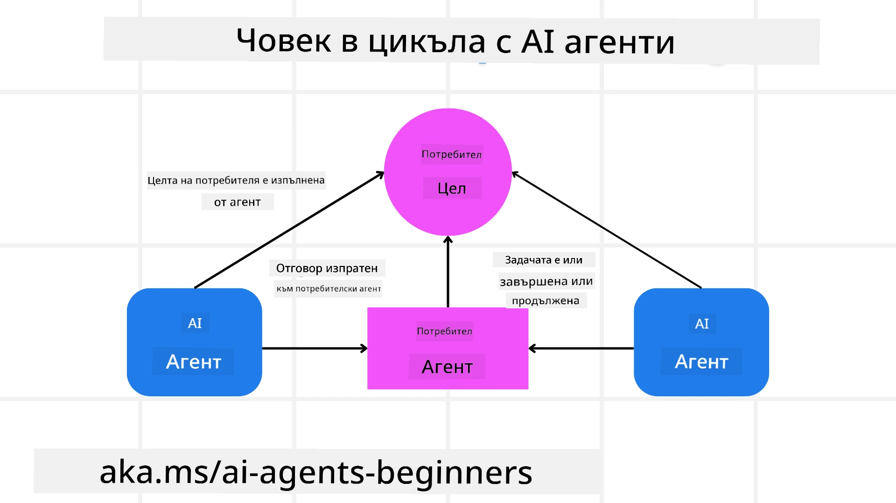

[](https://youtu.be/iZKkMEGBCUQ?si=Q-kEbcyHUMPoHp8L)

> _(Кликнете върху изображението по-горе, за да гледате видеото на този урок)_

# Създаване на доверени AI агенти

## Въведение

Този урок ще обхване:

- Как да изграждате и разгръщате безопасни и ефективни AI агенти
- Важни съображения за сигурността при разработване на AI агенти.
- Как да поддържате поверителността на данните и потребителите при разработването на AI агенти.

## Учебни цели

След завършване на този урок ще знаете как да:

- Идентифицирате и намалявате рисковете при създаване на AI агенти.
- Прилагате мерки за сигурност, за да осигурите правилно управление на данните и достъпа.
- Създавате AI агенти, които поддържат поверителността на данните и осигуряват качествено потребителско изживяване.

## Безопасност

Нека първо разгледаме изграждането на безопасни агентни приложения. Безопасността означава, че AI агентът изпълнява функциите както е проектиран. Като създатели на агентни приложения, ние разполагаме с методи и инструменти за максимизиране на безопасността:

### Изграждане на рамка за системни съобщения

Ако някога сте изграждали AI приложение, използвайки големи езикови модели (LLMs), знаете колко е важно проектирането на здрав системен промпт или системно съобщение. Тези промпти установяват мета правилата, инструкциите и насоките за това как LLM ще взаимодейства с потребителя и с данните.

За AI агентите системният промпт е още по-важен, тъй като AI агентите се нуждаят от много специфични инструкции, за да изпълнят задачите, които сме проектирали за тях.

За да създадем мащабируеми системни промпти, можем да използваме рамка за системни съобщения за изграждане на един или повече агенти в нашето приложение:



#### Стъпка 1: Създаване на мета системно съобщение

Мета промптът ще бъде използван от LLM за генериране на системните промпти за агентите, които създаваме. Проектираме го като шаблон, за да можем ефективно да създаваме множество агенти при нужда.

Ето пример за мета системно съобщение, което бихме предоставили на LLM:

```plaintext
You are an expert at creating AI agent assistants. 
You will be provided a company name, role, responsibilities and other
information that you will use to provide a system prompt for.
To create the system prompt, be descriptive as possible and provide a structure that a system using an LLM can better understand the role and responsibilities of the AI assistant. 
```

#### Стъпка 2: Създаване на основен промпт

Следващата стъпка е да създадем основен промпт, който описва AI агента. Трябва да включите ролята на агента, задачите, които агентът ще изпълнява, и всякакви други отговорности на агента.

Ето пример:

```plaintext
You are a travel agent for Contoso Travel that is great at booking flights for customers. To help customers you can perform the following tasks: lookup available flights, book flights, ask for preferences in seating and times for flights, cancel any previously booked flights and alert customers on any delays or cancellations of flights.  
```

#### Стъпка 3: Осигуряване на основно системно съобщение за LLM

Сега можем да оптимизираме това системно съобщение, като предоставим мета системното съобщение като системно съобщение заедно с нашето основно системно съобщение.

Това ще създаде системно съобщение, което е по-добре проектирано за насочване на нашите AI агенти:

```markdown
**Company Name:** Contoso Travel  
**Role:** Travel Agent Assistant

**Objective:**  
You are an AI-powered travel agent assistant for Contoso Travel, specializing in booking flights and providing exceptional customer service. Your main goal is to assist customers in finding, booking, and managing their flights, all while ensuring that their preferences and needs are met efficiently.

**Key Responsibilities:**

1. **Flight Lookup:**
    
    - Assist customers in searching for available flights based on their specified destination, dates, and any other relevant preferences.
    - Provide a list of options, including flight times, airlines, layovers, and pricing.
2. **Flight Booking:**
    
    - Facilitate the booking of flights for customers, ensuring that all details are correctly entered into the system.
    - Confirm bookings and provide customers with their itinerary, including confirmation numbers and any other pertinent information.
3. **Customer Preference Inquiry:**
    
    - Actively ask customers for their preferences regarding seating (e.g., aisle, window, extra legroom) and preferred times for flights (e.g., morning, afternoon, evening).
    - Record these preferences for future reference and tailor suggestions accordingly.
4. **Flight Cancellation:**
    
    - Assist customers in canceling previously booked flights if needed, following company policies and procedures.
    - Notify customers of any necessary refunds or additional steps that may be required for cancellations.
5. **Flight Monitoring:**
    
    - Monitor the status of booked flights and alert customers in real-time about any delays, cancellations, or changes to their flight schedule.
    - Provide updates through preferred communication channels (e.g., email, SMS) as needed.

**Tone and Style:**

- Maintain a friendly, professional, and approachable demeanor in all interactions with customers.
- Ensure that all communication is clear, informative, and tailored to the customer's specific needs and inquiries.

**User Interaction Instructions:**

- Respond to customer queries promptly and accurately.
- Use a conversational style while ensuring professionalism.
- Prioritize customer satisfaction by being attentive, empathetic, and proactive in all assistance provided.

**Additional Notes:**

- Stay updated on any changes to airline policies, travel restrictions, and other relevant information that could impact flight bookings and customer experience.
- Use clear and concise language to explain options and processes, avoiding jargon where possible for better customer understanding.

This AI assistant is designed to streamline the flight booking process for customers of Contoso Travel, ensuring that all their travel needs are met efficiently and effectively.

```

#### Стъпка 4: Итериране и подобрение

Стойността на тази рамка за системни съобщения е, че позволява по-лесно мащабиране при създаване на системни съобщения от множество агенти, както и подобряване на вашите системни съобщения във времето. Рядко ще имате системно съобщение, което работи перфектно от първия път за вашия цялостен случай на употреба. Възможността да правите малки корекции и подобрения чрез промяна на основното системно съобщение и провеждането му през системата ще ви позволи да сравнявате и оценявате резултатите.

## Разбиране на заплахите

За да изградите доверени AI агенти, е важно да разберете и намалите рисковете и заплахите за вашия AI агент. Да разгледаме само някои от различните заплахи към AI агентите и как можете по-добре да планирате и подготвите защита срещу тях.



### Задачи и инструкции

**Описание:** Нападатели се опитват да променят инструкциите или целите на AI агента чрез подсказване или манипулиране на входни данни.

**Намаляване:** Изпълнявайте проверки за валидност и филтри за входни данни, за да откриете потенциално опасни подсказвания преди те да бъдат обработени от AI агента. Тъй като тези атаки обикновено изискват честа комуникация с агента, ограничаването на броя ходове в разговор е още един начин за предотвратяване на тези типове атаки.

### Достъп до критични системи

**Описание:** Ако AI агент има достъп до системи и услуги, които съхраняват чувствителни данни, нападателите могат да компрометират комуникацията между агента и тези услуги. Тези атаки могат да бъдат директни или косвени опити за получаване на информация за системите чрез агента.

**Намаляване:** AI агентите трябва да имат достъп до системите само при необходимост, за да се предотвратят тези типове атаки. Комуникацията между агента и системата също трябва да е сигурна. Прилагането на удостоверяване и контрол на достъпа е друг начин за защита на тази информация.

### Претоварване на ресурси и услуги

**Описание:** AI агенти могат да използват различни инструменти и услуги за изпълнение на задачи. Нападателите могат да използват тази възможност, за да атакуват тези услуги чрез изпращане на голям обем заявки чрез AI агента, което може да доведе до системни сривове или високи разходи.

**Намаляване:** Прилагане на политики за ограничаване на броя заявки, които AI агент може да направи към дадена услуга. Ограничавайки броя ходове на разговор и заявките към вашия AI агент е друг начин за предотвратяване на тези видове атаки.

### Отравяне на базата знания

**Описание:** Този тип атака не е насочена директно към AI агента, а към базата знания и други услуги, които AI агентът използва. Това може да включва корумпиране на данните или информацията, която AI агентът използва, което води до пристрастни или нежелани отговори на потребителя.

**Намаляване:** Извършвайте редовна проверка на данните, които AI агентът използва в своите работни потоци. Осигурете, че достъпът до тези данни е сигурен и може да бъде променян само от доверени лица, за да се избегне този тип атака.

### Каскадни грешки

**Описание:** AI агентите използват различни инструменти и услуги за изпълнение на задачи. Грешки, причинени от нападатели, могат да доведат до сривове на други системи, свързани с AI агента, което прави атаката по-широка и по-трудна за отстраняване.

**Намаляване:** Един от начините да се избегне това е да се оперира AI агентът в ограничена среда, например чрез изпълнение на задачи в Docker контейнер, за да се предотвратят директни системни атаки. Създаването на резервни механизми и логика за повторен опит при отговори с грешка от определени системи е друг начин да се предотвратят по-големи системни сривове.

## Човек в цикъла

Друг ефективен начин за изграждане на доверени AI агентни системи е използването на човек в цикъла. Това създава поток, в който потребителите могат да предоставят обратна връзка на агентите по време на изпълнението. Потребителите действат като агенти в мултиагентна система, като одобряват или прекратяват изпълняващия се процес.



Ето примерен фрагмент от код, използвайки Microsoft Agent Framework, който показва как се прилага тази концепция:

```python
import os
from agent_framework.azure import AzureAIProjectAgentProvider
from azure.identity import AzureCliCredential

# Създайте доставчика с одобрение от човек в цикъла
provider = AzureAIProjectAgentProvider(
    credential=AzureCliCredential(),
)

# Създайте агента с стъпка за одобрение от човек
response = provider.create_response(
    input="Write a 4-line poem about the ocean.",
    instructions="You are a helpful assistant. Ask for user approval before finalizing.",
)

# Потребителят може да прегледа и одобри отговора
print(response.output_text)
user_input = input("Do you approve? (APPROVE/REJECT): ")
if user_input == "APPROVE":
    print("Response approved.")
else:
    print("Response rejected. Revising...")
```

## Заключение

Създаването на доверени AI агенти изисква внимателно проектиране, здрави мерки за сигурност и непрекъсната итерация. Чрез прилагане на структурирани системи за мета подсказване, разбиране на потенциалните заплахи и използване на стратегии за намаляване, разработчиците могат да създават AI агенти, които са както безопасни, така и ефективни. Освен това, включването на човек в цикъла гарантира, че AI агентите остават съобразени с нуждите на потребителите, като минимизират рисковете. С развитието на AI, поддържането на проактивна позиция по отношение на сигурността, поверителността и етичните съображения ще бъде ключово за изграждането на доверие и надеждност в AI-задвижвани системи.

### Имаш още въпроси за изграждането на доверени AI агенти?

Присъединете се към [Microsoft Foundry Discord](https://aka.ms/ai-agents/discord), за да срещнете други ученици, да участвате в офис часове и да получите отговори на въпросите си за AI агенти.

## Допълнителни ресурси

- <a href="https://learn.microsoft.com/azure/ai-studio/responsible-use-of-ai-overview" target="_blank">Преглед на отговорното използване на AI</a>
- <a href="https://learn.microsoft.com/azure/ai-studio/concepts/evaluation-approach-gen-ai" target="_blank">Оценка на генеративни AI модели и AI приложения</a>
- <a href="https://learn.microsoft.com/azure/ai-services/openai/concepts/system-message?context=%2Fazure%2Fai-studio%2Fcontext%2Fcontext&tabs=top-techniques" target="_blank">Системни съобщения за безопасност</a>
- <a href="https://blogs.microsoft.com/wp-content/uploads/prod/sites/5/2022/06/Microsoft-RAI-Impact-Assessment-Template.pdf?culture=en-us&country=us" target="_blank">Шаблон за оценка на риска</a>

## Предишен урок

[Agentic RAG](../05-agentic-rag/README.md)

## Следващ урок

[Дизайн на шаблон за планиране](../07-planning-design/README.md)

---

<!-- CO-OP TRANSLATOR DISCLAIMER START -->
**Отказ от отговорност**:  
Този документ е преведен с помощта на AI преводаческа услуга [Co-op Translator](https://github.com/Azure/co-op-translator). Въпреки че се стремим към точност, моля, имайте предвид, че автоматизираните преводи може да съдържат грешки или неточности. Оригиналният документ на неговия първичен език трябва да се счита за авторитетен източник. За критична информация се препоръчва професионален човешки превод. Ние не носим отговорност за каквито и да било недоразумения или неправилни тълкувания, възникнали при използването на този превод.
<!-- CO-OP TRANSLATOR DISCLAIMER END -->