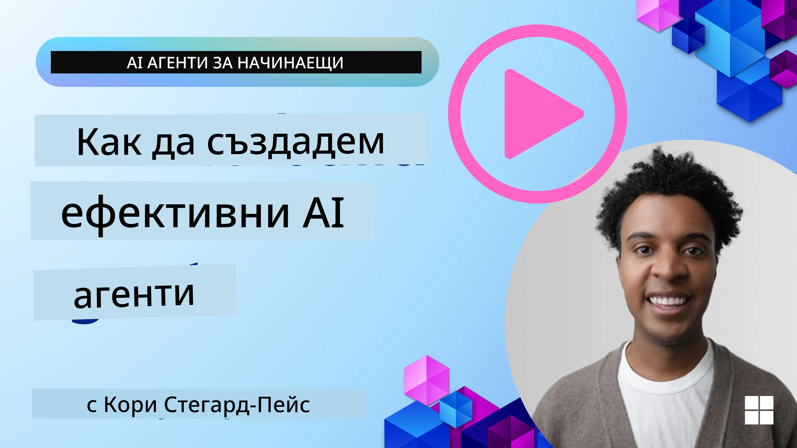
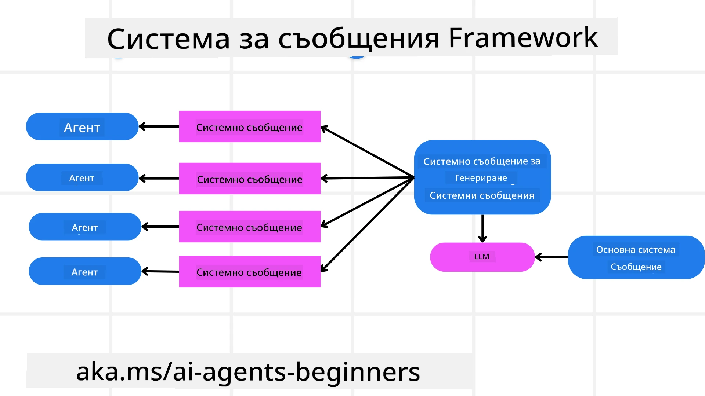
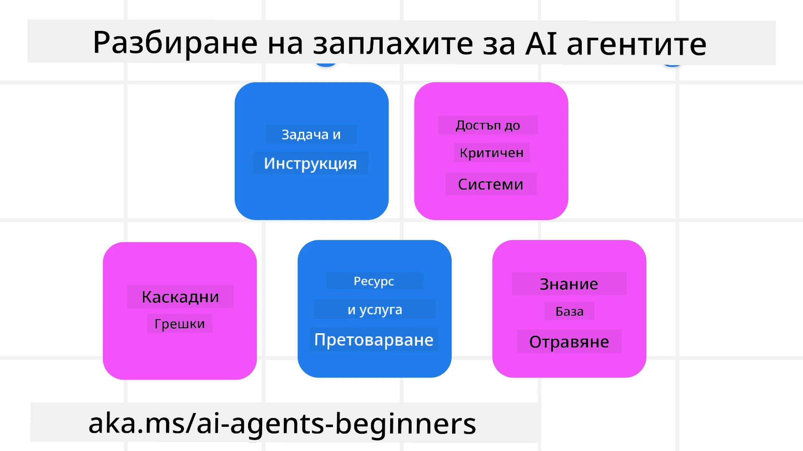
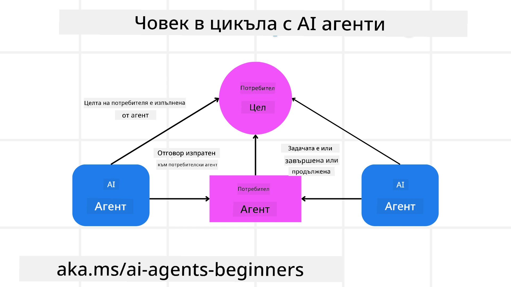

[](https://youtu.be/iZKkMEGBCUQ?si=Q-kEbcyHUMPoHp8L)

> _(Кликнете върху изображението по-горе, за да гледате видеото на този урок)_

# Създаване на достоверни AI агенти

## Въведение

Този урок ще обхване:

- Как да създадем и внедрим безопасни и ефективни AI агенти
- Важни съображения за сигурността при разработка на AI агенти.
- Как да поддържаме поверителността на данните и на потребителите при разработка на AI агенти.

## Цели на обучението

След завършване на този урок ще знаете как да:

- Идентифицирате и смекчавате рисковете при създаване на AI агенти.
- Прилагате мерки за сигурност, за да осигурите правилно управление на данните и достъпа.
- Създавате AI агенти, които поддържат поверителността на данните и осигуряват качествено потребителско изживяване.

## Безопасност

Нека първо разгледаме създаването на безопасни агентни приложения. Безопасността означава, че AI агентът функционира според предназначението. Като създатели на агентни приложения, ние разполагаме с методи и инструменти за максимизиране на безопасността:

### Създаване на рамка за системни съобщения

Ако някога сте изграждали AI приложение, използвайки големи езикови модели (LLMs), знаете колко е важно да се проектира здрав и стабилен системен подкана или системно съобщение. Тези подкани установяват метаправилата, инструкциите и насоките за това как LLM ще взаимодейства с потребителя и данните.

За AI агенти, системната подкана е още по-важна, тъй като агенти ще имат нужда от силно конкретни инструкции за изпълнение на задачите, които сме проектирали за тях.

За да създадем мащабируеми системни подкани, можем да използваме рамка за системни съобщения за изграждане на един или повече агенти в нашето приложение:



#### Стъпка 1: Създайте мета системно съобщение

Метаподканата ще се използва от LLM за генериране на системните подкани за агентите, които създаваме. Проектираме я като шаблон, за да можем ефективно да създаваме множество агенти, ако е необходимо.

Ето пример за мета системно съобщение, което бихме дали на LLM:

```plaintext
You are an expert at creating AI agent assistants. 
You will be provided a company name, role, responsibilities and other
information that you will use to provide a system prompt for.
To create the system prompt, be descriptive as possible and provide a structure that a system using an LLM can better understand the role and responsibilities of the AI assistant. 
```

#### Стъпка 2: Създайте основна подкана

Следващата стъпка е да се създаде основна подкана, която описва AI агента. Трябва да включите ролята на агента, задачите, които агентът ще изпълнява, и други отговорности.

Ето един пример:

```plaintext
You are a travel agent for Contoso Travel that is great at booking flights for customers. To help customers you can perform the following tasks: lookup available flights, book flights, ask for preferences in seating and times for flights, cancel any previously booked flights and alert customers on any delays or cancellations of flights.  
```

#### Стъпка 3: Дайте основната системна подкана на LLM

Сега можем да оптимизираме това системно съобщение, като предоставим мета системното съобщение като системно съобщение и нашето основно системно съобщение.

Това ще произведе системно съобщение, което е по-добре проектирано за насочване на нашите AI агенти:

```markdown
**Company Name:** Contoso Travel  
**Role:** Travel Agent Assistant

**Objective:**  
You are an AI-powered travel agent assistant for Contoso Travel, specializing in booking flights and providing exceptional customer service. Your main goal is to assist customers in finding, booking, and managing their flights, all while ensuring that their preferences and needs are met efficiently.

**Key Responsibilities:**

1. **Flight Lookup:**
    
    - Assist customers in searching for available flights based on their specified destination, dates, and any other relevant preferences.
    - Provide a list of options, including flight times, airlines, layovers, and pricing.
2. **Flight Booking:**
    
    - Facilitate the booking of flights for customers, ensuring that all details are correctly entered into the system.
    - Confirm bookings and provide customers with their itinerary, including confirmation numbers and any other pertinent information.
3. **Customer Preference Inquiry:**
    
    - Actively ask customers for their preferences regarding seating (e.g., aisle, window, extra legroom) and preferred times for flights (e.g., morning, afternoon, evening).
    - Record these preferences for future reference and tailor suggestions accordingly.
4. **Flight Cancellation:**
    
    - Assist customers in canceling previously booked flights if needed, following company policies and procedures.
    - Notify customers of any necessary refunds or additional steps that may be required for cancellations.
5. **Flight Monitoring:**
    
    - Monitor the status of booked flights and alert customers in real-time about any delays, cancellations, or changes to their flight schedule.
    - Provide updates through preferred communication channels (e.g., email, SMS) as needed.

**Tone and Style:**

- Maintain a friendly, professional, and approachable demeanor in all interactions with customers.
- Ensure that all communication is clear, informative, and tailored to the customer's specific needs and inquiries.

**User Interaction Instructions:**

- Respond to customer queries promptly and accurately.
- Use a conversational style while ensuring professionalism.
- Prioritize customer satisfaction by being attentive, empathetic, and proactive in all assistance provided.

**Additional Notes:**

- Stay updated on any changes to airline policies, travel restrictions, and other relevant information that could impact flight bookings and customer experience.
- Use clear and concise language to explain options and processes, avoiding jargon where possible for better customer understanding.

This AI assistant is designed to streamline the flight booking process for customers of Contoso Travel, ensuring that all their travel needs are met efficiently and effectively.

```

#### Стъпка 4: Повтаряне и подобряване

Стойността на тази рамка за системни съобщения е възможността да се мащабира създаването на системни съобщения от множество агенти по-лесно, както и да се подобряват системните съобщения с времето. Рядко ще имате системно съобщение, което работи от първия път за пълния ви случай на употреба. Способността да правите малки корекции и подобрения чрез промяна на основното системно съобщение и пускането му през системата ще ви позволи да сравнявате и оценявате резултатите.

## Разбиране на заплахите

За да създадем достоверни AI агенти, е важно да разберем и смекчим рисковете и заплахите за нашия AI агент. Нека разгледаме само някои от различните заплахи за AI агентите и как да планираме и подготвим по-добре за тях.



### Задача и инструкция

**Описание:** Хакерите се опитват да променят инструкциите или целите на AI агента чрез подкани или манипулация на входовете.

**Смекчаване:** Извършвайте проверки на валидността и филтри за вход, за да откриете потенциално опасни подкани преди те да бъдат обработени от AI агента. Тъй като тези атаки обикновено изискват честа интеракция с агента, ограничаването на броя на ходовете в разговора е друг начин за предотвратяване на този тип атаки.

### Достъп до критични системи

**Описание:** Ако AI агент има достъп до системи и услуги, съхраняващи чувствителни данни, нападателите могат да компрометират комуникацията между агента и тези услуги. Това могат да бъдат директни атаки или индиректни опити за получаване на информация за тези системи чрез агента.

**Смекчаване:** AI агентите трябва да имат достъп до системи само при необходимост, за да се предотвратят този тип атаки. Комуникацията между агента и системата също трябва да бъде сигурна. Прилагането на автентикация и контрол на достъпа е друг начин за защита на тази информация.

### Претоварване на ресурси и услуги

**Описание:** AI агентите могат да осъществяват достъп до различни инструменти и услуги, за да изпълняват задачи. Нападателите могат да използват тази възможност, за да атакуват тези услуги, като изпращат голям обем заявки чрез AI агента, което може да доведе до сривове на системата или високи разходи.

**Смекчаване:** Прилагайте политики за ограничаване на броя заявки, които AI агент може да направи към услуга. Ограничаването на броя на ходовете в разговор и заявките към AI агента е друг начин за предотвратяване на този тип атаки.

### Отравяне на база знания

**Описание:** Този тип атака не цели директно AI агента, а базата знания и други услуги, които агентът използва. Това може да включва корумпиране на данните или информацията, които AI агентът ще използва за изпълнение на задача, водещо до предубедени или нежелани отговори към потребителя.

**Смекчаване:** Извършвайте редовна проверка на данните, които AI агентът ще използва в своите работни потоци. Уверете се, че достъпът до тези данни е сигурен и промените се правят само от доверени лица, за да избегнете този тип атака.

### Каскадни грешки

**Описание:** AI агентите осъществяват достъп до различни инструменти и услуги за изпълнение на задачите. Грешките, предизвикани от нападатели, могат да доведат до сривове на други системи, свързани с AI агента, правейки атаката по-широкообхватна и по-трудна за отстраняване.

**Смекчаване:** Един метод за избягване е AI агентът да работи в ограничена среда, като изпълнява задачи в Docker контейнер, за предотвратяване на директни системни атаки. Създаването на резервни механизми и логика за повторен опит при грешка на определени системи е друг начин за предотвратяване на по-големи системни сривове.

## Човек в цикъла

Друг ефективен начин за създаване на достоверни AI агентни системи е използването на човек в цикъла. Това създава поток, при който потребителите могат да предоставят обратна връзка на агентите по време на действието. Потребителите фактически играят ролята на агенти в мултиагентна система, като позволяват одобрение или прекратяване на текущия процес.



Ето фрагмент от код, използвайки Microsoft Agent Framework, за да се покаже как се имплементира тази концепция:

```python
import os
from agent_framework.foundry import FoundryChatClient
from azure.identity import AzureCliCredential

# Създайте доставчика с одобрение от човек в цикъла
provider = FoundryChatClient(
    project_endpoint=os.environ["AZURE_AI_PROJECT_ENDPOINT"],
    model=os.environ["AZURE_AI_MODEL_DEPLOYMENT_NAME"],
    credential=AzureCliCredential(),
)

# Създайте агента с крачка за одобрение от човек
response = provider.create_response(
    input="Write a 4-line poem about the ocean.",
    instructions="You are a helpful assistant. Ask for user approval before finalizing.",
)

# Потребителят може да прегледа и одобри отговора
print(response.output_text)
user_input = input("Do you approve? (APPROVE/REJECT): ")
if user_input == "APPROVE":
    print("Response approved.")
else:
    print("Response rejected. Revising...")
```

## Заключение

Създаването на достоверни AI агенти изисква внимателен дизайн, здрави мерки за сигурност и непрекъснато усъвършенстване. Чрез прилагане на структуриран мета-подканващ системи, разбиране на потенциалните заплахи и прилагане на стратегии за смекчаване, разработчиците могат да създадат AI агенти, които са както безопасни, така и ефективни. Освен това, включването на подход с човек в цикъла гарантира, че AI агентите остават в съответствие с нуждите на потребителите, като минимизират рисковете. С развитието на AI, поддържането на проактивен подход към сигурността, поверителността и етичните съображения ще бъде ключово за изграждане на доверие и надеждност в системи, управлявани от AI.

## Примери с код

- [`code_samples/06-system-message-framework.ipynb`](code_samples/06-system-message-framework.ipynb): Демонстрация стъпка по стъпка на системната рамка с мета подкани.
- [`code_samples/06-human-in-the-loop.ipynb`](code_samples/06-human-in-the-loop.ipynb): Ворота за одобрение преди действие, ниво на риск и регистриране на одити за достоверни агенти.

### Имате ли още въпроси за създаването на достоверни AI агенти?

Присъединете се към [Microsoft Foundry Discord](https://discord.com/invite/ATgtXmAS5D), за да се срещнете с други обучаеми, да участвате в приемни часове и да получите отговори на въпроси за AI агентите.

## Допълнителни ресурси

- <a href="https://learn.microsoft.com/azure/ai-studio/responsible-use-of-ai-overview" target="_blank">Преглед на отговорното използване на AI</a>
- <a href="https://learn.microsoft.com/azure/ai-studio/concepts/evaluation-approach-gen-ai" target="_blank">Оценка на генеративни AI модели и AI приложения</a>
- <a href="https://learn.microsoft.com/azure/ai-services/openai/concepts/system-message?context=%2Fazure%2Fai-studio%2Fcontext%2Fcontext&tabs=top-techniques" target="_blank">Системни съобщения за безопасност</a>
- <a href="https://blogs.microsoft.com/wp-content/uploads/prod/sites/5/2022/06/Microsoft-RAI-Impact-Assessment-Template.pdf?culture=en-us&country=us" target="_blank">Шаблон за оценка на риска</a>

## Предишен урок

[Агентен RAG](../05-agentic-rag/README.md)

## Следващ урок

[Планиране и дизайн](../07-planning-design/README.md)

---

<!-- CO-OP TRANSLATOR DISCLAIMER START -->
**Отказ от отговорност**:
Този документ е преведен с помощта на AI преводачески услуга [Co-op Translator](https://github.com/Azure/co-op-translator). Въпреки че се стремим към точност, моля имайте предвид, че автоматизираните преводи могат да съдържат грешки или неточности. Оригиналният документ на неговия роден език трябва да се счита за авторитетен източник. За критична информация се препоръчва професионален човешки превод. Ние не носим отговорност за каквито и да е недоразумения или неправилни тълкувания, произтичащи от използването на този превод.
<!-- CO-OP TRANSLATOR DISCLAIMER END -->