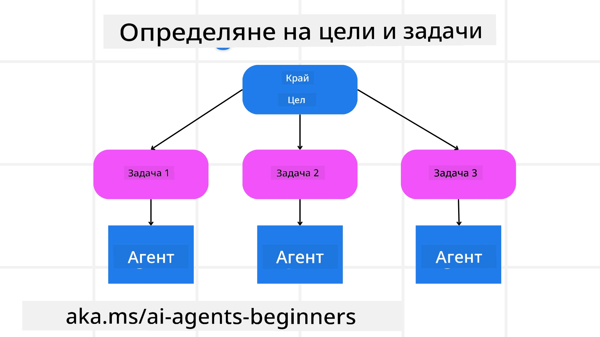

[](https://youtu.be/kPfJ2BrBCMY?si=9pYpPXp0sSbK91Dr)

> _(Кликнете върху изображението по-горе, за да гледате видео на този урок)_

# Планиращ дизайн

## Въведение

Този урок ще обхване

* Определяне на ясен общa цел и разбиване на сложна задача на управляеми задачи.
* Използване на структурирана изходна информация за по-надеждни и машинно четими отговори.
* Прилагане на подход, базиран на събития, за справяне с динамични задачи и неочаквани входни данни.

## Учебни цели

След завършване на този урок ще имате разбиране за:

* Идентифициране и задаване на обща цел за AI агент, като се гарантира, че ясно знае какво трябва да бъде постигнато.
* Разделяне на сложна задача на управляеми подзадачи и организиране на тях в логическа последователност.
* Осигуряване на агентите с подходящи инструменти (напр. инструменти за търсене или аналитични инструменти за данни), да се решава кога и как да се използват, и справяне с неочаквани ситуации, които възникват.
* Оценяване на резултатите от подзадачите, измерване на представянето и итерация върху действията за подобряване на крайния резултат.

## Определяне на общата цел и разделяне на задача



Повечето задачи от реалния свят са твърде сложни, за да бъдат решени на един етап. AI агентът се нуждае от кратка цел, за да ръководи своето планиране и действия. Например, разгледайте целта:

    "Създаване на 3-дневен маршрут за пътуване."

Въпреки че е просто да се заяви, тя все още се нуждае от усъвършенстване. Колкото по-ясна е целта, толкова по-добре агентът (и всички човешки сътрудници) може да се съсредоточи върху постигането на правилния резултат, като например създаване на изчерпателен маршрут с опции за полети, препоръки за хотели и предложения за дейности.

### Разлагане на задача

Големите или сложни задачи стават по-управляеми, когато се разделят на по-малки, целево ориентирани подзадачи.
За примера с маршрута за пътуване можете да разделите целта на:

* Резервация на полети
* Резервация на хотел
* Наем на кола
* Персонализация

Всяка подзадача може да бъде решена от специализирани агенти или процеси. Един агент може да се фокусира върху търсене на най-добрите оферти за полети, друг - върху резервациите за хотели и т.н. Координиращ или „downstream“ агент може след това да компилира тези резултати в един цялостен маршрут за крайния потребител.

Този модулен подход също позволява постепенно подобрение. Например, можете да добавите специализирани агенти за препоръки за храна или предложения за местни дейности и да усъвършенствате маршрута с времето.

### Структуриран изход

Големите езикови модели (LLMs) могат да генерират структуриран изход (например JSON), който е по-лесен за разбиране и обработка от downstream агенти или услуги. Това е особено полезно в контекст с множество агенти, където можем да действаме по тези задачи след получаване на планиращия изход.

Следният Python пример демонстрира прост планиращ агент, който разлага цел на подзадачи и генерира структуриран план:

```python
from pydantic import BaseModel
from enum import Enum
from typing import List, Optional, Union
import json
import os
from typing import Optional
from pprint import pprint
from agent_framework.azure import AzureAIProjectAgentProvider
from azure.identity import AzureCliCredential

class AgentEnum(str, Enum):
    FlightBooking = "flight_booking"
    HotelBooking = "hotel_booking"
    CarRental = "car_rental"
    ActivitiesBooking = "activities_booking"
    DestinationInfo = "destination_info"
    DefaultAgent = "default_agent"
    GroupChatManager = "group_chat_manager"

# Модел за подзадача на пътуване
class TravelSubTask(BaseModel):
    task_details: str
    assigned_agent: AgentEnum  # искаме да възложим задачата на агента

class TravelPlan(BaseModel):
    main_task: str
    subtasks: List[TravelSubTask]
    is_greeting: bool

provider = AzureAIProjectAgentProvider(credential=AzureCliCredential())

# Дефинирайте съобщението на потребителя
system_prompt = """You are a planner agent.
    Your job is to decide which agents to run based on the user's request.
    Provide your response in JSON format with the following structure:
{'main_task': 'Plan a family trip from Singapore to Melbourne.',
 'subtasks': [{'assigned_agent': 'flight_booking',
               'task_details': 'Book round-trip flights from Singapore to '
                               'Melbourne.'}
    Below are the available agents specialised in different tasks:
    - FlightBooking: For booking flights and providing flight information
    - HotelBooking: For booking hotels and providing hotel information
    - CarRental: For booking cars and providing car rental information
    - ActivitiesBooking: For booking activities and providing activity information
    - DestinationInfo: For providing information about destinations
    - DefaultAgent: For handling general requests"""

user_message = "Create a travel plan for a family of 2 kids from Singapore to Melbourne"

response = client.create_response(input=user_message, instructions=system_prompt)

response_content = response.output_text
pprint(json.loads(response_content))
```

### Планиращ агент с мултиагентна оркестрация

В този пример, Семантичен рутер агент получава потребителско запитване (напр. "Имам нужда от план за хотел за моето пътуване.").

Планиращият след това:

* Приема плана за хотел: Планиращият взема съобщението на потребителя и, основавайки се на системен промпт (включително информация за наличните агенти), генерира структуриран план за пътуване.
* Изброява агенти и техните инструменти: Регистърът на агентите съдържа списък с агенти (например за полети, хотели, наем на коли и дейности) заедно с функциите или инструментите, които те предлагат.
* Насочва плана към съответните агенти: В зависимост от броя на подзадачите, планиращият или изпраща съобщението директно на посветен агент (за сценарии с една задача), или координира чрез мениджър на групов чат за мултиагентно сътрудничество.
* Обобщава резултата: Накрая планиращият обобщава генерирания план за яснота.
Следният Python код илюстрира тези стъпки:

```python

from pydantic import BaseModel

from enum import Enum
from typing import List, Optional, Union

class AgentEnum(str, Enum):
    FlightBooking = "flight_booking"
    HotelBooking = "hotel_booking"
    CarRental = "car_rental"
    ActivitiesBooking = "activities_booking"
    DestinationInfo = "destination_info"
    DefaultAgent = "default_agent"
    GroupChatManager = "group_chat_manager"

# Модел за подзадачна пътуване

class TravelSubTask(BaseModel):
    task_details: str
    assigned_agent: AgentEnum # искаме да възложим задачата на агента

class TravelPlan(BaseModel):
    main_task: str
    subtasks: List[TravelSubTask]
    is_greeting: bool
import json
import os
from typing import Optional

from agent_framework.azure import AzureAIProjectAgentProvider
from azure.identity import AzureCliCredential

# Създайте клиента

provider = AzureAIProjectAgentProvider(credential=AzureCliCredential())

from pprint import pprint

# Определете потребителското съобщение

system_prompt = """You are a planner agent.
    Your job is to decide which agents to run based on the user's request.
    Below are the available agents specialized in different tasks:
    - FlightBooking: For booking flights and providing flight information
    - HotelBooking: For booking hotels and providing hotel information
    - CarRental: For booking cars and providing car rental information
    - ActivitiesBooking: For booking activities and providing activity information
    - DestinationInfo: For providing information about destinations
    - DefaultAgent: For handling general requests"""

user_message = "Create a travel plan for a family of 2 kids from Singapore to Melbourne"

response = client.create_response(input=user_message, instructions=system_prompt)

response_content = response.output_text

# Отпечатайте съдържанието на отговора след зареждането му като JSON

pprint(json.loads(response_content))
```

Следва изходът от предишния код и можете да използвате този структуриран изход, за да насочите към `assigned_agent` и да обобщите плана за пътуване за крайния потребител.

```json
{
    "is_greeting": "False",
    "main_task": "Plan a family trip from Singapore to Melbourne.",
    "subtasks": [
        {
            "assigned_agent": "flight_booking",
            "task_details": "Book round-trip flights from Singapore to Melbourne."
        },
        {
            "assigned_agent": "hotel_booking",
            "task_details": "Find family-friendly hotels in Melbourne."
        },
        {
            "assigned_agent": "car_rental",
            "task_details": "Arrange a car rental suitable for a family of four in Melbourne."
        },
        {
            "assigned_agent": "activities_booking",
            "task_details": "List family-friendly activities in Melbourne."
        },
        {
            "assigned_agent": "destination_info",
            "task_details": "Provide information about Melbourne as a travel destination."
        }
    ]
}
```

Примерен notebook с предишния код е наличен [тук](07-python-agent-framework.ipynb).

### Итеративно планиране

Някои задачи изискват напред-назад или повторно планиране, при което резултатът от една подзадача влияе на следващата. Например, ако агентът открие неочакван формат на данни по време на резервацията на полети, може да се наложи да адаптира своята стратегия преди да премине към резервации за хотели.

Освен това, обратната връзка от потребителя (напр. човек, който решава, че предпочита по-ранен полет) може да задейства частично пренасочване на плана. Този динамичен, итеративен подход гарантира, че крайното решение съответства на реални ограничения и развиващите се предпочитания на потребителя.

напр. примерен код

```python
from agent_framework.azure import AzureAIProjectAgentProvider
from azure.identity import AzureCliCredential
#.. същото като предишния код и предаване на историята на потребителя, текущия план

system_prompt = """You are a planner agent to optimize the
    Your job is to decide which agents to run based on the user's request.
    Below are the available agents specialized in different tasks:
    - FlightBooking: For booking flights and providing flight information
    - HotelBooking: For booking hotels and providing hotel information
    - CarRental: For booking cars and providing car rental information
    - ActivitiesBooking: For booking activities and providing activity information
    - DestinationInfo: For providing information about destinations
    - DefaultAgent: For handling general requests"""

user_message = "Create a travel plan for a family of 2 kids from Singapore to Melbourne"

response = client.create_response(
    input=user_message,
    instructions=system_prompt,
    context=f"Previous travel plan - {TravelPlan}",
)
# .. пренасочване на плана и изпращане на задачите на съответните агенти
```

За по-подробно планиране, разгледайте Magnetic One <a href="https://www.microsoft.com/research/articles/magentic-one-a-generalist-multi-agent-system-for-solving-complex-tasks" target="_blank">блогпост</a> за решаване на сложни задачи.

## Обобщение

В тази статия разгледахме пример как можем да създадем планиращ, който динамично избира наличните дефинирани агенти. Изходът на Планиращия разгражда задачите и разпределя агентите, за да могат да бъдат изпълнени. Предполага се, че агентите имат достъп до функциите/инструментите, необходими за изпълнение на задачата. Освен агентите, можете да включите и други шаблони като reflection, summarizer, и round robin chat за по-нататъшна персонализация.

## Допълнителни ресурси

Magentic One - генеричен мултиагентен систем за решаване на сложни задачи, който постига впечатляващи резултати на множество предизвикателни агентни показатели. Референция: <a href="https://www.microsoft.com/research/articles/magentic-one-a-generalist-multi-agent-system-for-solving-complex-tasks" target="_blank">Magentic One</a>. В тази реализация оркестраторът създава специфични за задачата планове и делегира тези задачи на наличните агенти. Освен планиране, оркестраторът използва и механизъм за проследяване на напредъка на задачата и при необходимост пренасочва плана.

### Имате още въпроси за шаблона за планиращ дизайн?

Присъединете се към [Microsoft Foundry Discord](https://aka.ms/ai-agents/discord), за да се срещнете с други учащи се, да участвате в офис часове и да получите отговори на вашите въпроси за AI Агентите.

## Предишен урок

[Създаване на надеждни AI агенти](../06-building-trustworthy-agents/README.md)

## Следващ урок

[Шаблон за мултиагентен дизайн](../08-multi-agent/README.md)

---

<!-- CO-OP TRANSLATOR DISCLAIMER START -->
**Отказ от отговорност**:
Този документ е преведен с помощта на AI преводаческа услуга [Co-op Translator](https://github.com/Azure/co-op-translator). Въпреки че се стремим към точност, моля, имайте предвид, че автоматизираните преводи могат да съдържат грешки или неточности. Оригиналният документ на неговия единствен език трябва да се счита за авторитетен източник. За критична информация се препоръчва професионален човешки превод. Ние не носим отговорност за каквито и да е недоразумения или неправилни тълкувания, произтичащи от използването на този превод.
<!-- CO-OP TRANSLATOR DISCLAIMER END -->