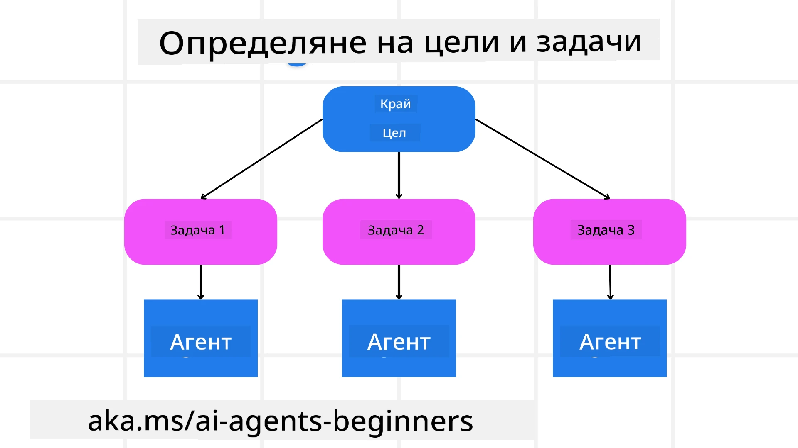

[](https://youtu.be/kPfJ2BrBCMY?si=9pYpPXp0sSbK91Dr)

> _(Кликнете върху изображението по-горе, за да гледате видеото на този урок)_

# Дизайн на планиране

## Въведение

Този урок ще обхване

* Определяне на ясен общa цел и разбиване на сложна задача на управляеми задачи.
* Използване на структурирани резултати за по-надеждни и машинно-разбираеми отговори.
* Прилагане на подход, базиран на събития, за обработка на динамични задачи и неочаквани входове.

## Цели за учене

След завършване на този урок ще разбирате:

* Как да идентифицирате и зададете обща цел за AI агент, като осигурите той ясно да знае какво трябва да постигне.
* Как да разбивате сложна задача на управляеми подзадачи и да ги организирате в логическа последователност.
* Как да осигурите агентите с правилните инструменти (напр. търсачки или инструменти за анализ на данни), да решавате кога и как да ги използвате и да се справяте с неочаквани ситуации.
* Как да оценявате резултатите от подзадачите, да измервате изпълнението и да повтаряте действия, за да подобрите крайния резултат.

## Определяне на общата цел и разбиване на задача



Повечето задачи в реалния свят са твърде сложни, за да бъдат решени с един единствен ход. AI агентът се нуждае от кратка цел, която да насочва планирането и действията му. Например, разгледайте целта:

    "Създай 3-дневен туристически маршрут."

Въпреки че е просто заявено, целта все още се нуждае от доуточняване. Колкото по-ясна е целта, толкова по-добре агентът (и всеки човешки сътрудник) може да се съсредоточи върху постигането на правилния резултат, като създаване на изчерпателен маршрут с опции за полети, препоръки за хотели и предложения за дейности.

### Разбиване на задачата

Големите или сложни задачи стават по-управляеми, когато се разделят на по-малки, целенасочени подзадачи.
За примера с туристическия маршрут, можете да разбите целта на:

* Резервация на полети
* Резервация на хотел
* Наемане на кола
* Персонализация

Всяка подзадача може да бъде обработена от специализирани агенти или процеси. Един агент може да се специализира в намирането на най-добрите оферти за полети, друг се фокусира върху резервациите на хотели и т.н. Координаторски агент или "downstream" агент може след това да събере тези резултати в едно цялостно предложение за крайния потребител.

Този модулен подход позволява и постепенно подобряване. Например може да се добавят специализирани агенти за препоръки за храни или предложения за местни дейности и да се усъвършенства маршрутът с времето.

### Структуриран изход

Големите езикови модели (LLMs) могат да генерират структуриран изход (напр. JSON), който е по-лесен за обработка от последващите агенти или услуги. Това е особено полезно в контекст с множество агенти, където можем да изпълняваме тези задачи след получаване на планиращия изход.

Следният Python код демонстрира прост планиращ агент, който разбива цел на подзадачи и генерира структуриран план:

```python
from pydantic import BaseModel
from enum import Enum
from typing import List, Optional, Union
import json
import os
from typing import Optional
from pprint import pprint
from agent_framework.foundry import FoundryChatClient
from azure.identity import AzureCliCredential

class AgentEnum(str, Enum):
    FlightBooking = "flight_booking"
    HotelBooking = "hotel_booking"
    CarRental = "car_rental"
    ActivitiesBooking = "activities_booking"
    DestinationInfo = "destination_info"
    DefaultAgent = "default_agent"
    GroupChatManager = "group_chat_manager"

# Модел на подзадача за пътуване
class TravelSubTask(BaseModel):
    task_details: str
    assigned_agent: AgentEnum  # искаме да възложим задачата на агента

class TravelPlan(BaseModel):
    main_task: str
    subtasks: List[TravelSubTask]
    is_greeting: bool

provider = FoundryChatClient(
    project_endpoint=os.environ["AZURE_AI_PROJECT_ENDPOINT"],
    model=os.environ["AZURE_AI_MODEL_DEPLOYMENT_NAME"],
    credential=AzureCliCredential(),
)

# Дефинирайте съобщението на потребителя
system_prompt = """You are a planner agent.
    Your job is to decide which agents to run based on the user's request.
    Provide your response in JSON format with the following structure:
{'main_task': 'Plan a family trip from Singapore to Melbourne.',
 'subtasks': [{'assigned_agent': 'flight_booking',
               'task_details': 'Book round-trip flights from Singapore to '
                               'Melbourne.'}
    Below are the available agents specialised in different tasks:
    - FlightBooking: For booking flights and providing flight information
    - HotelBooking: For booking hotels and providing hotel information
    - CarRental: For booking cars and providing car rental information
    - ActivitiesBooking: For booking activities and providing activity information
    - DestinationInfo: For providing information about destinations
    - DefaultAgent: For handling general requests"""

user_message = "Create a travel plan for a family of 2 kids from Singapore to Melbourne"

response = client.create_response(input=user_message, instructions=system_prompt)

response_content = response.output_text
pprint(json.loads(response_content))
```

### Планиращ агент с мулти-агентна оркестрация

В този пример агент Семантичен Рутер получава заявка от потребител (напр. "Имам нужда от хотелски план за пътуването си.").

Планиращият тогава:

* Получава хотелски план: Планиращият приема съобщението на потребителя и, базирано на системно подканване (включително данни за наличните агенти), генерира структуриран пътен план.
* Изброява агенти и техните инструменти: Регистърът на агентите държи списък с агенти (напр. за полети, хотели, коли под наем и дейности) заедно с функциите или инструментите, които предлагат.
* Насочва планa към съответните агенти: В зависимост от броя на подзадачите, планиращият или праща съобщението директно на специализиран агент (за сценарии с единствена задача), или координира чрез мениджър на групов чат за мулти-агентна колаборация.
* Обобщава резултата: Накрая планиращият обобщава генерирания план за яснота.
Следният примерен Python код илюстрира тези стъпки:

```python

from pydantic import BaseModel

from enum import Enum
from typing import List, Optional, Union

class AgentEnum(str, Enum):
    FlightBooking = "flight_booking"
    HotelBooking = "hotel_booking"
    CarRental = "car_rental"
    ActivitiesBooking = "activities_booking"
    DestinationInfo = "destination_info"
    DefaultAgent = "default_agent"
    GroupChatManager = "group_chat_manager"

# Модел за подзадача пътуване

class TravelSubTask(BaseModel):
    task_details: str
    assigned_agent: AgentEnum # искаме да зададем задачата на агента

class TravelPlan(BaseModel):
    main_task: str
    subtasks: List[TravelSubTask]
    is_greeting: bool
import json
import os
from typing import Optional

from agent_framework.foundry import FoundryChatClient
from azure.identity import AzureCliCredential

# Създайте клиента

provider = FoundryChatClient(
    project_endpoint=os.environ["AZURE_AI_PROJECT_ENDPOINT"],
    model=os.environ["AZURE_AI_MODEL_DEPLOYMENT_NAME"],
    credential=AzureCliCredential(),
)

from pprint import pprint

# Дефинирайте съобщението на потребителя

system_prompt = """You are a planner agent.
    Your job is to decide which agents to run based on the user's request.
    Below are the available agents specialized in different tasks:
    - FlightBooking: For booking flights and providing flight information
    - HotelBooking: For booking hotels and providing hotel information
    - CarRental: For booking cars and providing car rental information
    - ActivitiesBooking: For booking activities and providing activity information
    - DestinationInfo: For providing information about destinations
    - DefaultAgent: For handling general requests"""

user_message = "Create a travel plan for a family of 2 kids from Singapore to Melbourne"

response = client.create_response(input=user_message, instructions=system_prompt)

response_content = response.output_text

# Изведете съдържанието на отговора след като го заредите като JSON

pprint(json.loads(response_content))
```

Това е изходът от горния код и можете след това да използвате този структуриран изход, за да го насочите към `assigned_agent` и да обобщите пътния план към крайния потребител.

```json
{
    "is_greeting": "False",
    "main_task": "Plan a family trip from Singapore to Melbourne.",
    "subtasks": [
        {
            "assigned_agent": "flight_booking",
            "task_details": "Book round-trip flights from Singapore to Melbourne."
        },
        {
            "assigned_agent": "hotel_booking",
            "task_details": "Find family-friendly hotels in Melbourne."
        },
        {
            "assigned_agent": "car_rental",
            "task_details": "Arrange a car rental suitable for a family of four in Melbourne."
        },
        {
            "assigned_agent": "activities_booking",
            "task_details": "List family-friendly activities in Melbourne."
        },
        {
            "assigned_agent": "destination_info",
            "task_details": "Provide information about Melbourne as a travel destination."
        }
    ]
}
```

Примерен ноутбук с горния код е наличен [тук](./code_samples/07-python-agent-framework.ipynb).

### Итеративно планиране

Някои задачи изискват обратно-напред или преструктуриране на плана, където резултатът от една подзадача влияе на следващата. Например, ако агентът открие неочакван формат на данни при резервация на полети, може да трябва да адаптира стратегията си преди да премине към резервация на хотели.

Освен това, обратната връзка от потребителя (напр. човек, който решава, че предпочита по-ранен полет) може да задейства частично пренасочване на плана. Този динамичен, итеративен подход гарантира, че крайното решение съответства на реалните ограничения и променящите се предпочитания на потребителя.

напр. примерен код

```python
import os
from agent_framework.foundry import FoundryChatClient
from azure.identity import AzureCliCredential
#.. същото като предишния код и предава историята на потребителя, текущия план

system_prompt = """You are a planner agent to optimize the
    Your job is to decide which agents to run based on the user's request.
    Below are the available agents specialized in different tasks:
    - FlightBooking: For booking flights and providing flight information
    - HotelBooking: For booking hotels and providing hotel information
    - CarRental: For booking cars and providing car rental information
    - ActivitiesBooking: For booking activities and providing activity information
    - DestinationInfo: For providing information about destinations
    - DefaultAgent: For handling general requests"""

user_message = "Create a travel plan for a family of 2 kids from Singapore to Melbourne"

response = client.create_response(
    input=user_message,
    instructions=system_prompt,
    context=f"Previous travel plan - {TravelPlan}",
)
# .. пренасочи плана и изпрати задачите на съответните агенти
```

За по-подробно планиране вижте Magnetic One <a href="https://www.microsoft.com/research/articles/magentic-one-a-generalist-multi-agent-system-for-solving-complex-tasks" target="_blank">Блогпост</a> за решаване на комплексни задачи.

## Резюме

В тази статия разгледахме пример как можем да създадем планиращ, който динамично избира наличните агенти. Изходът на планиращия разбива задачите и възлага агентите, за да могат те да бъдат изпълнени. Предполага се, че агентите имат достъп до функциите/инструментите, необходими за изпълнение на задачата. Освен агентите можете да включите и други модели като рефлексия, обобщаване и ротационен чат, за да персонализирате още повече.

## Допълнителни ресурси

Magnetic One - генерален мултиагентен система за решаване на комплексни задачи, която е постигнала впечатляващи резултати в множество предизвикателни тестове за агенти. Референция: <a href="https://www.microsoft.com/research/articles/magentic-one-a-generalist-multi-agent-system-for-solving-complex-tasks" target="_blank">Magnetic One</a>. В тази имплементация оркестраторът създава целеви планове за задачи и делегира тези задачи на наличните агенти. Освен планирането, оркестраторът използва и механизъм за проследяване на напредъка и при необходимост пренасочва плана.

### Имаш ли още въпроси за модела на планиране?

Присъедини се към [Microsoft Foundry Discord](https://discord.com/invite/ATgtXmAS5D), за да общуваш с други учащи се, да посещаваш консултации и да получаваш отговори на въпросите си за AI агентите.

## Предишен урок

[Създаване на надеждни AI агенти](../06-building-trustworthy-agents/README.md)

## Следващ урок

[Модел на мулти-агентен дизайн](../08-multi-agent/README.md)

---

<!-- CO-OP TRANSLATOR DISCLAIMER START -->
**Отказ от отговорност**:
Този документ е преведен с помощта на AI преводачески услуга [Co-op Translator](https://github.com/Azure/co-op-translator). Въпреки че се стремим към точност, моля имайте предвид, че автоматизираните преводи могат да съдържат грешки или неточности. Оригиналният документ на неговия роден език трябва да се счита за авторитетен източник. За критична информация се препоръчва професионален човешки превод. Ние не носим отговорност за каквито и да е недоразумения или неправилни тълкувания, произтичащи от използването на този превод.
<!-- CO-OP TRANSLATOR DISCLAIMER END -->