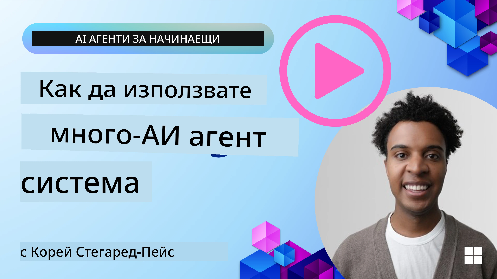
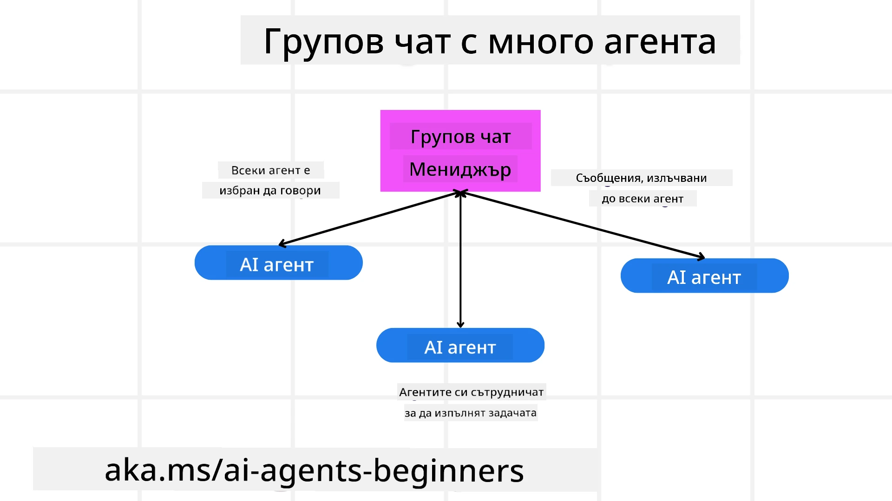
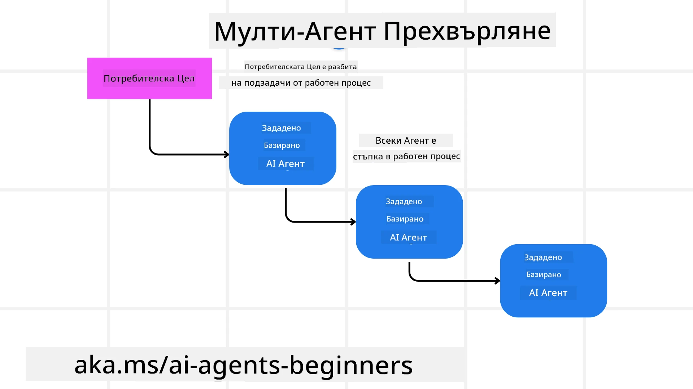
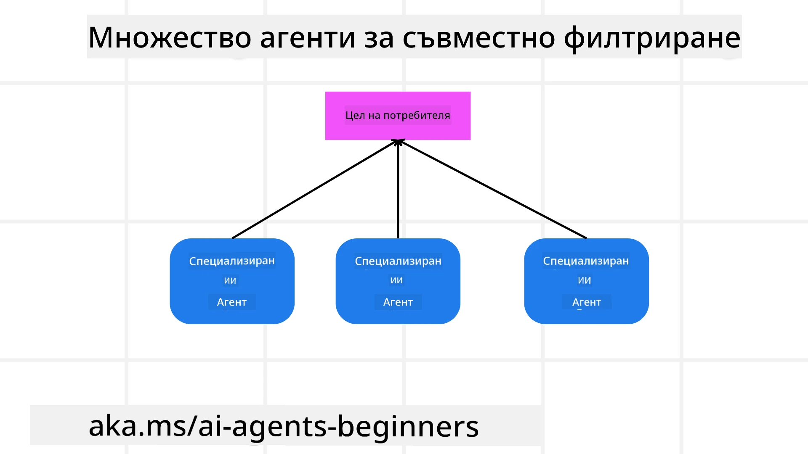

> _(Кликнете върху изображението по-горе, за да гледате видеото на този урок)_

# Патерни за дизайн с множество агенти

Веднага щом започнете да работите по проект, който включва множество агенти, ще трябва да обмислите патерна за дизайн с множество агенти. Въпреки това, може да не е веднага ясно кога трябва да преминете към множество агенти и какви са предимствата.

## Въведение

В този урок ще се опитаме да отговорим на следните въпроси:

- В какви сценарии са приложими множество агенти?
- Какви са предимствата на използването на множество агенти вместо един единствен агент, който изпълнява множество задачи?
- Какви са основните елементи при имплементирането на патерна за дизайн с множество агенти?
- Как да имаме видимост върху това как множеството агенти взаимодействат помежду си?

## Цели на обучението

След този урок трябва да можете:

- Да идентифицирате сценарии, в които множество агенти са приложими
- Да разпознавате предимствата на използването на множество агенти пред един единствен агент
- Да разбирате основните елементи при имплементирането на патерна за дизайн с множество агенти

Каква е по-голямата картина?

*Множествените агенти са патерн за дизайн, който позволява на няколко агента да работят заедно, за да постигнат обща цел*.

Този патерн е широко използван в различни области, включително роботика, автономни системи и разпределени изчисления.

## Сценарии, в които Множество Агенти са Приложими

Кои сценарии са добра причина за използване на множество агенти? Отговорът е, че има много сценарии, при които използването на няколко агенти е полезно, особено в следните случаи:

- **Голям обем работа**: Големите обеми работа могат да бъдат разделени на по-малки задачи и възложени на различни агенти, което позволява паралелна обработка и по-бързо изпълнение. Пример за това е голяма задача за обработка на данни.
- **Сложни задачи**: Както при големия обем работа, сложните задачи могат да бъдат разделени на по-малки подсектори и възложени на различни агенти, всеки със специализация в определена част от задачата. Добър пример са автономните превозни средства, където различни агенти управляват навигацията, откриването на препятствия и комуникацията с други превозни средства.
- **Разнообразни експертизи**: Различните агенти могат да притежават разнообразни експертизи, което им позволява да се справят по-ефективно с различни аспекти на задачата, отколкото един единствен агент. За този случай добър пример е сферата на здравеопазването, където агенти могат да управляват диагностика, планове за лечение и мониторинг на пациента.

## Предимства на използването на множество агенти спрямо един единствен агент

Система с един агент може да работи добре при прости задачи, но при по-сложни задачи използването на множество агенти може да предостави няколко предимства:

- **Специализация**: Всеки агент може да бъде специализирани за конкретна задача. Липсата на специализация в един агент означава, че имате агент, който може да върши всичко, но може да се затрудни при сложна задача. Например, той може да се окаже, че изпълнява задача, за която не е най-подходящ.
- **Мащабируемост**: По-лесно е да се мащабира системата чрез добавяне на повече агенти, отколкото да се претоварва един агент.
- **Толерантност към грешки**: Ако един агент се повреди, другите могат да продължат да функционират, което осигурява надеждност на системата.

Нека вземем пример – нека резервираме пътуване за потребител. Система с един агент би трябвало да се справи с всички аспекти на процеса на резервация – от намиране на полети до резервиране на хотели и коли под наем. За да постигне това, агентът трябва да разполага с инструменти за всички тези задачи. Това може да доведе до сложна и монолитна система, която е трудна за поддържане и мащабиране. Мулти-агентова система, от друга страна, може да има различни агенти, специализирани в намирането на полети, резервирането на хотели и коли под наем. Това прави системата по-модулна, по-лесна за поддръжка и мащабируема.

Сравнете това с туристическа агенция, управлявана като малък семеен бизнес, срещу туристическа агенция, управлявана като франчайз. Малкият бизнес би имал един агент, отговарящ за всички аспекти на резервацията на пътуването, докато франчайзът би имал различни агенти, отговарящи за различните аспекти на процеса.

## Основни елементи при имплементирането на патерна с множество агенти

Преди да можете да имплементирате патерна с множество агенти, трябва да разберете основните елементи, които го изграждат.

Нека направим това по-конкретно, като отново разгледаме примера с резервация на пътуване за потребител. В този случай основните елементи ще включват:

- **Комуникация между агенти**: Агентите, отговарящи за намирането на полети, резервирането на хотели и коли под наем, трябва да комуникират и да споделят информация за предпочитанията и ограниченията на потребителя. Трябва да решите кои протоколи и методи ще се използват за тази комуникация. Конкретно това означава, че агентът за намиране на полети трябва да комуникира с агента за резервиране на хотели, за да се увери, че хотелът е резервиран за същите дати както полетът. Това означава, че агентите трябва да споделят информация за датите на пътуване, което пък означава, че трябва да решите *кои агенти споделят информация и как я споделят*.
- **Механизми за координация**: Агентите трябва да координират действията си, за да гарантират, че предпочитанията и ограниченията на потребителя се спазват. Например, предпочитание на потребителя може да е хотел близо до летището, а ограничение - колите под наем да са налични само на летището. Това значи, че агентът за резервиране на хотели трябва да координира с агента за резервиране на коли под наем, за да гарантират, че изискванията на потребителя се спазват. Вие трябва да решите *как агентите координират действията си*.
- **Архитектура на агентите**: Агентите трябва да имат вътрешна структура за взимане на решения и учене от взаимодействията си с потребителя. Това означава, че агентът за намиране на полети трябва да разполага с вътрешна структура за взимане на решения относно кои полети да препоръча на потребителя. Трябва да решите *как агентите взимат решения и се учат от взаимодействията си с потребителя*. Пример за учене и подобряване може да е, че агентът за намиране на полети използва модел за машинно обучение, за да препоръчва полети на потребителя въз основа на предишните му предпочитания.
- **Видимост към взаимодействието между множество агенти**: Трябва да имате видимост как множеството агенти взаимодействат помежду си. Това означава, че трябва да притежавате инструменти и техники за проследяване на дейностите и взаимодействията на агентите. Това може да бъде под формата на инструменти за логване и мониторинг, визуализация и показатели за изпълнение.
- **Патерни за множество агенти**: Има различни патерни за имплементиране на системи с множество агенти, като централизирана, децентрализирана и хибридна архитектура. Трябва да решите кой патерн най-добре подхожда за вашия случай.
- **Човек в цикъла**: В повечето случаи ще имате човек в цикъла и трябва да инструктирате агентите кога да поискат човешка намеса. Това може да се изразява като потребител, който иска конкретен хотел или полет, който агентите не са препоръчали, или иска потвърждение преди да се направи резервация за полет или хотел.

## Видимост върху взаимодействията между множество агенти

Важно е да имате видимост как множеството агенти взаимодействат помежду си. Тази видимост е от съществено значение за дебъгване, оптимизиране и осигуряване на ефективността на цялата система. За постигане на това трябва да разполагате с инструменти и техники за проследяване на дейностите и взаимодействията на агентите. Това може да включва инструменти за логване и мониторинг, визуализация и показатели за производителност.

Например, при резервация на пътуване за потребител, може да имате табло, показващо статуса на всеки агент, предпочитанията и ограниченията на потребителя, както и взаимодействията между агентите. Това табло може да показва датите на пътуване, препоръчаните полети от агента за полети, препоръчаните хотели от агента за хотели и препоръчаните коли под наем от агента за коли. Така ще имате ясна представа как агентите взаимодействат един с друг и дали предпочитанията и ограниченията на потребителя са изпълнени.

Нека разгледаме всеки аспект по-подробно.

- **Инструменти за логване и мониторинг**: Желаете да логвате всяко действие, което е предприел агентът. Записът в лога може да съдържа информация за агента, предприел действието, действието, времето на действие и резултата от него. Тази информация може да се използва за дебъгване, оптимизиране и други.
- **Инструменти за визуализация**: Инструментите за визуализация могат да ви помогнат да видите взаимодействията между агентите по-интуитивно. Например, може да имате графика, показваща потока на информация между агентите. Това може да ви помогне да откриете тесни места, неефективности и други проблеми в системата.
- **Показатели за производителност**: Показателите могат да ви помогнат да проследите ефективността на системата с множество агенти. Например, можете да проследявате времето за изпълнение на задача, броя завършени задачи за единица време и точността на препоръките на агентите. Тази информация може да ви помогне да идентифицирате области за подобрение и да оптимизирате системата.

## Патерни за множество агенти

Нека разгледаме някои конкретни патерни, които можем да използваме за създаване на приложения с множество агенти. Ето няколко интересни патерна, които си заслужава да се обмислят:

### Групов чат

Този патерн е полезен, когато искате да създадете приложение за групов чат, където множество агенти могат да комуникират помежду си. Типични случаи за употреба на този патерн са екипното сътрудничество, поддръжката на клиенти и социалните мрежи.

В този патерн всеки агент представлява потребител в груповия чат, а съобщенията се обменят между агентите чрез протокол за съобщения. Агентите могат да изпращат съобщения към груповия чат, да получават съобщения от груповия чат и да отговарят на съобщения от други агенти.

Този патерн може да се реализира чрез централизирана архитектура, където всички съобщения минават през централен сървър, или чрез децентрализирана архитектура, където съобщенията се обменят директно.

### Предаване на задачи

Този патерн е полезен, когато искате да създадете приложение, в което множество агенти могат да предават задачи един на друг.

Типични случаи на употреба включват поддръжка на клиенти, управление на задачи и автоматизация на работни потоци.

В този патерн всеки агент представлява задача или стъпка в работен поток, а агентите могат да предават задачи на други агенти въз основа на предварително дефинирани правила.

### Съвместна филтрация

Този патерн е полезен, когато искате да създадете приложение, в което множество агенти сътрудничат, за да правят препоръки на потребителите.

Причината да искате множество агенти да сътрудничат е, че всеки агент има различна експертиза и може да допринесе за процеса на препоръки по различни начини.

Нека разгледаме пример, при който потребител иска препоръка за най-добра акция на фондовата борса.

- **Експерт по индустрия**: Един агент може да бъде експерт в конкретна индустрия.
- **Технически анализ**: Друг агент може да е експерт по технически анализ.
- **Фундаментален анализ**: Трети агент може да е експерт по фундаментален анализ. Чрез сътрудничество тези агенти могат да предоставят по-пълна препоръка на потребителя.

## Сценарий: Процес на възстановяване на суми

Разгледайте сценарий, в който клиент се опитва да получи възстановяване на суми за продукт. Понякога в този процес могат да участват доста агенти, но нека ги разделим между агенти, специфични за този процес, и общи агенти, които могат да се използват и в други процеси.

**Агенти, специфични за процеса на възстановяване**:

Следват някои агенти, които могат да бъдат замесени в процеса на възстановяване:

- **Агент клиент**: Този агент представлява клиента и отговаря за иницииране на процеса на възстановяване.
- **Агент продавач**: Този агент представлява продавача и отговаря за обработката на възстановяването.
- **Агент за плащания**: Този агент представлява плащането и отговаря за връщане на парите на клиента.
- **Агент по разрешаване**: Този агент представлява процеса по разрешаване на проблеми и отговаря за уреждане на възникнали проблеми по време на процеса.
- **Агент по съответствие**: Този агент отговаря за спазването на правила и политики във връзка с процеса на възстановяване.

**Общи агенти**:

Тези агенти могат да се използват и в други части на вашия бизнес.

- **Агент по доставка**: Този агент представлява процеса на доставка и отговаря за връщането на продукта към продавача. Този агент може да се използва както в процеса на възстановяване, така и за обща доставка на продукт, например при покупка.
- **Агент за обратна връзка**: Този агент представлява процеса за събиране на обратна връзка от клиентите. Обратна връзка може да се събира по всяко време, а не само по време на процеса на възстановяване.
- **Агент за ескалация**: Този агент отговаря за прехвърлянето на проблеми към по-високо ниво на поддръжка. Можете да използвате този тип агент за всякакъв процес, в който е необходима ескалация на проблем.
- **Агент за уведомяване**: Този агент отговаря за изпращане на уведомления към клиента на различни етапи от процеса на възстановяване.
- **Агент за анализи**: Този агент анализира данни, свързани с процеса на възстановяване.
- **Агент по одит**: Този агент проверява дали процесът на възстановяване се извършва правилно.
- **Агент за отчитане**: Този агент генерира отчети относно процеса на възстановяване.
- **Агент за знания**: Този агент поддържа база знания с информация, свързана с процеса на възстановяване. Този агент може да бъде експерт както по възстановяване, така и по други части на вашия бизнес.
- **Агент по сигурността**: Този агент осигурява сигурността на процеса по възстановяване.
- **Агент по качеството**: Този агент отговаря за осигуряване на качеството в процеса на възстановяване.

Вече изброихме доста агенти както за специфичния процес по възстановяване, така и за общите агенти, които могат да се използват в други части на вашия бизнес. Надявам се това да ви даде представа как да решите кои агенти да използвате във вашата система с множество агенти.

## Задача

Проектирайте система с множество агенти за процеса на поддръжка на клиенти. Идентифицирайте агенти, участващи в процеса, техните роли и отговорности, както и как те взаимодействат помежду си. Вземете предвид както агенти, специфични за процеса на поддръжка на клиенти, така и общи агенти, които могат да се използват и в други части на вашия бизнес.
> Помислете преди да прочетете следното решение, може да ви трябват повече агенти, отколкото мислите.

> СЪВЕТ: Помислете за различните етапи на процеса на клиентска поддръжка и също така обмислете агенти, необходими за всяка система.

## Решение

[Решение](./solution/solution.md)

## Проверки на знанията

Въпрос: Кога трябва да обмислите използването на мулти-агенти?

- [ ] A1: Когато имате малко натоварване и проста задача.
- [ ] A2: Когато имате голямо натоварване
- [ ] A3: Когато имате проста задача.

[Решение на викторината](./solution/solution-quiz.md)

## Резюме

В този урок разгледахме шаблона за мулти-агент дизайн, включително сценариите, в които мулти-агентите са приложими, предимствата на използването на мулти-агенти пред единствен агент, основните градивни елементи за реализиране на шаблона за мулти-агент дизайн и как да имаме видимост как множеството агенти си взаимодействат.

### Имате ли още въпроси за шаблона мулти-агент дизайн?

Присъединете се към [Microsoft Foundry Discord](https://aka.ms/ai-agents/discord), за да се срещнете с други учащи, да участвате в консултации и да получите отговори на вашите въпроси за AI агенти.

## Допълнителни ресурси

- <a href="https://learn.microsoft.com/azure/ai-services/agents/overview" target="_blank">Документация за Microsoft Agent Framework</a>
- <a href="https://www.analyticsvidhya.com/blog/2024/10/agentic-design-patterns/" target="_blank">Дизайнерски шаблони за агенти</a>

## Предходен урок

[Планиране на дизайна](../07-planning-design/README.md)

## Следващ урок

[Метакогниция в AI агенти](../09-metacognition/README.md)

---

<!-- CO-OP TRANSLATOR DISCLAIMER START -->
**Отказ от отговорност**:  
Този документ е преведен с помощта на AI преводаческа услуга [Co-op Translator](https://github.com/Azure/co-op-translator). Въпреки че се стремим към точност, имайте предвид, че автоматизираните преводи могат да съдържат грешки или неточности. Оригиналният документ на съответния език следва да се счита за авторитетен източник. За критична информация се препоръчва професионален превод от човек. Ние не носим отговорност за каквито и да е недоразумения или погрешни тълкувания, произтичащи от използването на този превод.
<!-- CO-OP TRANSLATOR DISCLAIMER END -->