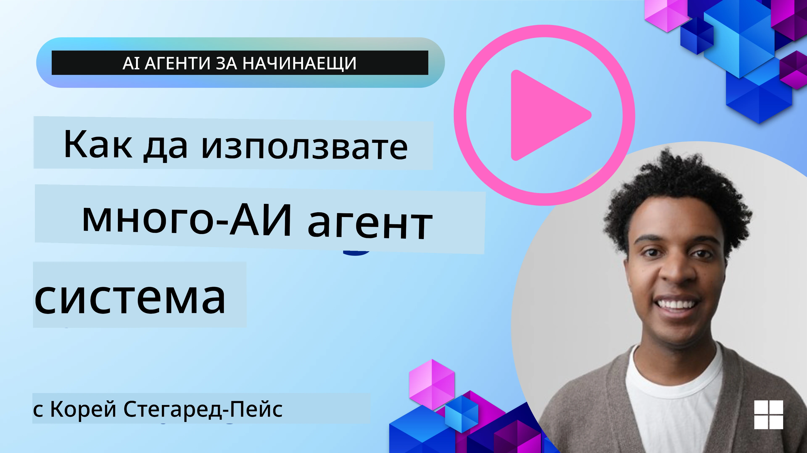
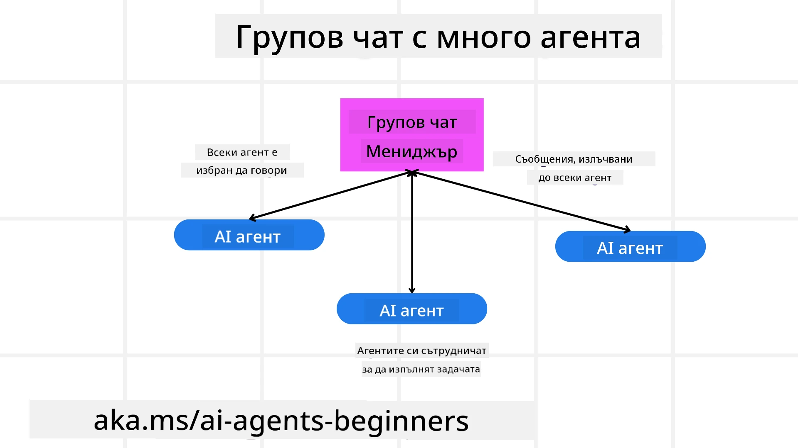
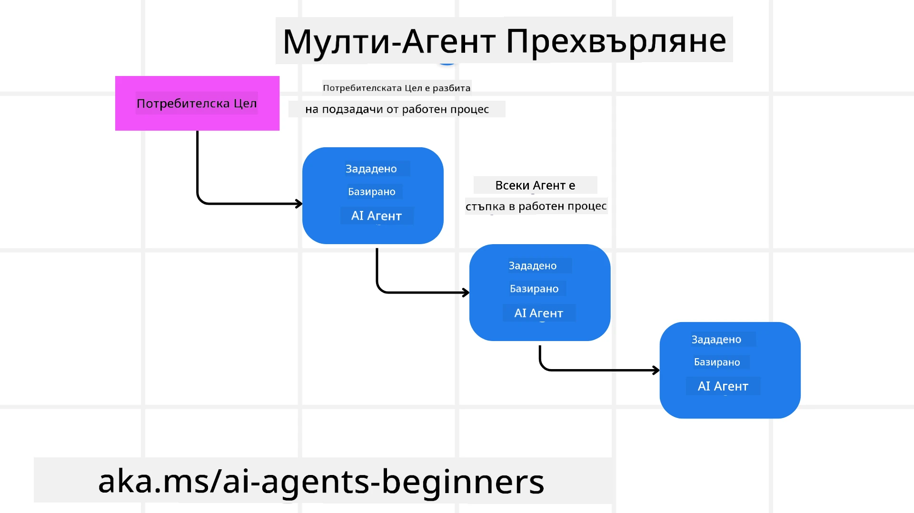
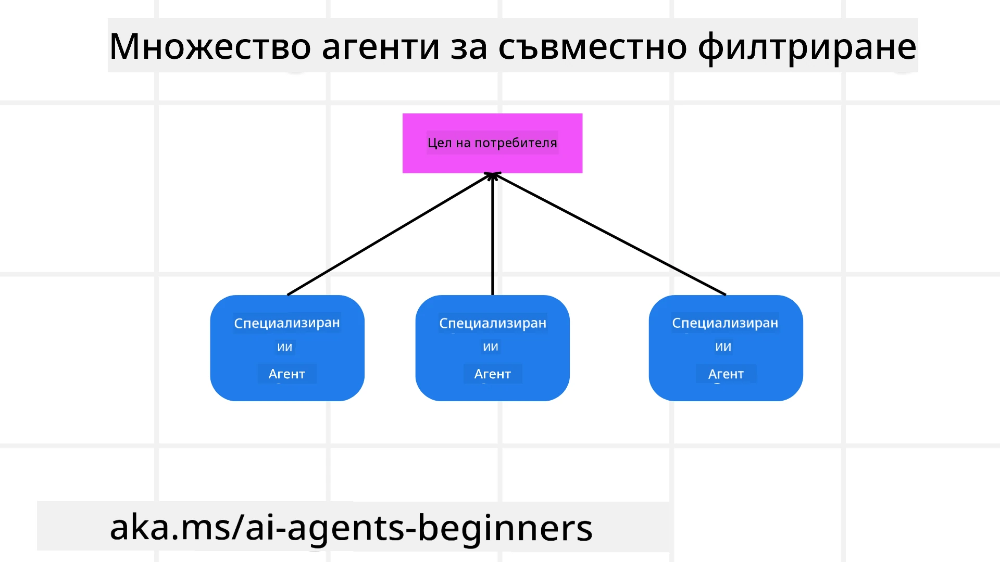

> _(Кликнете върху изображението по-горе, за да гледате видео на този урок)_

# Дизайнерски модели с множество агенти

Веднага щом започнете работа по проект, който включва множество агенти, ще трябва да обмислите модела за дизайн с множество агенти. Въпреки това, може да не е веднага ясно кога да преминете към множество агенти и какви са предимствата.

## Въведение

В този урок ще разгледаме отговорите на следните въпроси:

- При какви сценарии е приложим моделът с множество агенти?
- Какви са предимствата на използването на множество агенти вместо само един агент, който изпълнява множество задачи?
- Какви са основните компоненти за прилагането на модела за дизайн с множество агенти?
- Как можем да имаме видимост за начина, по който множество агенти взаимодействат помежду си?

## Цели на обучението

След този урок трябва да можете:

- Да идентифицирате сценарии, в които е приложимо използването на множество агенти
- Да разпознавате предимствата от използването на множество агенти спрямо единствен агент.
- Да разберете основните компоненти за прилагането на модела за дизайн с множество агенти.

Каква е по-голямата картина?

*Множество агенти са дизайнерски модел, който позволява множество агенти да работят заедно, за да постигнат обща цел*.

Този модел се използва широко в различни области, включително в роботика, автономни системи и разпределени изчисления.

## Сценарии, в които е приложим моделът с множество агенти

Кои сценарии са добър случай за използване на множество агенти? Отговорът е, че има много сценарии, при които използването на множество агенти е полезно, особено в следните случаи:

- **Големи натоварвания**: Големите натоварвания могат да се разделят на по-малки задачи и да се възложат на различни агенти, което позволява паралелна обработка и по-бързо изпълнение. Пример за това може да е голяма задача за обработка на данни.
- **Сложни задачи**: Сложни задачи, подобно на големите натоварвания, могат да се разбият на по-малки подзадачи и да се възложат на различни агенти, като всеки се специализира в конкретен аспект на задачата. Добър пример е в случая с автономните превозни средства, където различни агенти управляват навигацията, откриването на препятствия и комуникацията с други превозни средства.
- **Разнообразна експертиза**: Различни агенти могат да имат разнообразна експертиза, което им позволява да се справят с различни аспекти на задачата по-ефективно отколкото един агент. За този случай добър пример е здравеопазването, където агентите могат да управляват диагностика, планове за лечение и наблюдение на пациентите.

## Предимства на използването на множество агенти спрямо единствен агент

Система с един агент може да работи добре при прости задачи, но за по-сложни задачи използването на множество агенти може да осигури няколко предимства:

- **Специализация**: Всеки агент може да бъде специализиран за конкретна задача. Липсата на специализация в един агент означава, че агентът знае всичко, но може да се обърка какво да прави пред сложна задача. Например, той може да извърши задача, за която не е най-подходящ.
- **Мащабируемост**: По-лесно е да се разширяват системите чрез добавяне на повече агенти, вместо да се претоварва един единствен агент.
- **Устойчивост на грешки**: Ако един агент се повреди, останалите могат да продължат да функционират, осигурявайки надеждност на системата.

Нека разгледаме пример – да резервираме пътуване за потребител. Система с един агент трябва да обработи всички аспекти на процеса на резервация – от намиране на полети до резервиране на хотели и коли под наем. За да направи това, агентът трябва да има инструменти за всички тези задачи. Това може да доведе до сложна и монолитна система, която е трудна за поддръжка и мащабиране. От друга страна, система с множество агенти може да има различни агенти, специализирани в намиране на полети, резервиране на хотели и коли под наем. Това прави системата по-модулна, по-лесна за поддръжка и мащабируема.

Сравнете това с туристическа агенция, управлявана като малък семеен бизнес спрямо туристическа агенция, управлявана като франчайз. Малката агенция би имала един агент, който обработва всички аспекти на резервацията, докато франчайзът има различни агенти за различни аспекти.

## Основни компоненти за прилагане на модела с множество агенти

Преди да можете да приложите модела с множество агенти, трябва да разберете основните компоненти, които го съставляват.

Нека да го направим по-конкретно, като отново разгледаме примера с резервиране на пътуване за потребител. В този случай основните компоненти биха включвали:

- **Комуникация между агенти**: Агентите за намиране на полети, резервиране на хотели и коли под наем трябва да комуникират и да споделят информация за предпочитанията и ограниченията на потребителя. Трябва да решите протоколите и методите за тази комуникация. Това означава конкретно, че агентът, който намира полети, трябва да комуникира с агента, който резервира хотели, за да гарантират, че хотелът е резервиран за същите дати като полета. Това означава, че агентите трябва да споделят информация за датите на пътуване на потребителя, следователно трябва да решите *кои агенти споделят информация и как го правят*.
- **Механизми за координация**: Агентите трябва да координират действията си, за да изпълнят предпочитанията и ограниченията на потребителя. Например, потребител може да предпочита хотел близо до летището, докато ограничението е, че колите под наем са налични само на летището. Това означава, че агентът за резервиране на хотели трябва да се координира с агента за резервиране на коли, за да се спазят предпочитанията и ограниченията. Трябва да решите *как агентите координират действията си*.
- **Архитектура на агента**: Агентите трябва да имат вътрешна структура за вземане на решения и за учене от взаимодействията с потребителя. Това означава, че агентът за намиране на полети трябва да има вътрешна структура за вземане на решения за препоръчване на полети на потребителя. Трябва да решите *как агентите вземат решения и учат от взаимодействията с потребителя*. Пример за учене може да бъде, че агентът за намиране на полети използва модел за машинно обучение, за да препоръчва полети въз основа на миналите предпочитания.
- **Видимост в взаимодействията между множество агенти**: Трябва да имате видимост за това как multiple агенти взаимодействат помежду си. Това означава, че трябва да имате инструменти и техники за проследяване на дейностите и взаимодействията на агентите. Това може да бъде под формата на логване и мониторинг, визуализационни инструменти и метрики за представяне.
- **Модели за множество агенти**: Съществуват различни модели за изграждане на системи с множество агенти, като централизирана, децентрализирана и хибридна архитектура. Трябва да изберете модел, който най-добре подхожда на вашия случай.
- **Човек в цикъла**: В повечето случаи в цикъла има човек и трябва да инструктирате агентите кога да искат човешка намеса. Това може да бъде, когато потребител иска конкретен хотел или полет, който агентите не са препоръчали, или искат потвърждение преди резервация.

## Видимост в взаимодействията с множество агенти

Важно е да имате видимост за това как multiple агенти взаимодействат помежду си. Тази видимост е от съществено значение за отстраняване на грешки, оптимизация и гарантиране на ефективността на системата. За целта трябва да използвате инструменти и техники за проследяване на дейностите и взаимодействията на агентите. Това може да се реализира чрез логване и мониторинг, визуализации и метрики за представяне.

Например, във връзка с резервиране на пътуване за потребител, може да имате табло за управление, което показва статуса на всеки агент, предпочитанията и ограниченията на потребителя, както и взаимодействията между агентите. Това табло може да показва датите на пътуване, препоръчаните от агента за полети полети, препоръчаните от агента за хотели хотели и препоръчаните от агента за коли под наем коли. Това ще ви даде ясна представа как агентите взаимодействат помежду си и съответстват ли предпочитанията и ограниченията на потребителя.

Да разгледаме всеки от тези аспекти по-подробно.

- **Инструменти за логване и мониторинг**: Желаете да се извършва логване на всяко действие, предприето от агент. Записът в лог може да съдържа информация за агента, който е извършил действието, самото действие, времето на действие и резултата от него. Тази информация може да се използва за отстраняване на грешки, оптимизация и др.

- **Инструменти за визуализация**: Визуализационните инструменти могат да ви помогнат да видите взаимодействията между агентите по-интуитивно. Например, може да имате графика, която показва потока на информация между агентите. Това може да ви помогне да идентифицирате затруднения, неефективности и други проблеми в системата.

- **Метрики за представяне**: Метриките за представяне могат да ви помогнат да проследите ефективността на системата с множество агенти. Например, може да следите времето за изпълнение на задача, броя завършени задачи за единица време и точността на препоръките на агентите. Тази информация може да ви помогне да откриете области за подобрение и да оптимизирате системата.

## Модели за множество агенти

Нека разгледаме някои конкретни модели, които можем да използваме за създаване на приложения с множество агенти. Ето няколко интересни модела, които си струва да разгледаме:

### Групов чат

Този модел е полезен, когато искате да създадете групово чат приложение, където множество агенти могат да комуникират помежду си. Типични случаи за използване включват екипна колаборация, клиентска поддръжка и социални мрежи.

В този модел всеки агент представлява потребител в груповия чат и съобщенията се обменят между агентите чрез протокол за съобщения. Агентите могат да изпращат съобщения в групата, да получават такива и да отговарят на съобщения от други агенти.

Този модел може да се реализира чрез централизирана архитектура, където всички съобщения минават през централен сървър, или децентрализирана архитектура, където съобщенията се обменят директно.

### Прехвърляне на задачи

Този модел е полезен, когато искате да създадете приложение, в което множество агенти могат да прехвърлят задачи един на друг.

Типични случаи на използване са клиентска поддръжка, управление на задачи и автоматизация на работни процеси.

В този модел всеки агент представлява задача или стъпка в работния процес и може да предава задачи на други агенти въз основа на предварително дефинирани правила.

### Колаборативна филтрация

Този модел е полезен, когато искате да създадете приложение, в което множество агенти сътрудничат за предоставяне на препоръки на потребителите.

Причината за сътрудничеството е, че всеки агент може да има различна експертиза и да допринася по различен начин в процеса на препоръчване.

Например, потребител иска препоръка за най-добрата акция, която да купи на фондовия пазар.

- **Експерт по индустрията**: Един агент може да бъде експерт в конкретна индустрия.
- **Технически анализ**: Друг агент може да бъде експерт в техническия анализ.
- **Фундаментален анализ**: А трети агент може да бъде експерт във фундаменталния анализ. Сътрудничеството между тях им позволява да предоставят по-пълна препоръка на потребителя.

## Сценарий: Процес по връщане на пари

Да разгледаме сценарий, в който клиент иска връщане на продукт. В този процес могат да участват много агенти, но нека ги разделим на агенти, специфични за този процес, и общи агенти за други процеси.

**Агенти, специфични за процеса на връщане:**

Следват някои агенти, които могат да участват в процеса на връщане:

- **Агент на клиента**: Този агент представлява клиента и е отговорен за иницииране на процеса по връщане.
- **Агент на продавача**: Този агент представлява продавача и е отговорен за обработка на връщането.
- **Агент за плащане**: Този агент представлява процеса по плащане и отговаря за връщане на парите на клиента.
- **Агент за разрешаване**: Този агент управлява процеса по разрешаване на евентуални проблеми в процеса.
- **Агент за съответствие**: Този агент гарантира, че процесът по връщане отговаря на регулации и политики.

**Общи агенти**:

Тези агенти могат да се използват и в други части на бизнеса ви.

- **Агент по доставка**: Този агент управлява процеса на изпращане на продукта обратно на продавача. Може да се използва както за процеса на връщане, така и за обща доставка на продукт при покупка.
- **Агент за обратна връзка**: Този агент събира обратна връзка от клиента. Обратна връзка може да се дава по всяко време, не само при връщане.
- **Агент за ескалация**: Този агент управлява ескалиране на проблеми към по-високи нива на поддръжка. Може да се използва за всяка ситуация, изискваща ескалация.
- **Агент за уведомяване**: Този агент отговаря за изпращане на уведомления на клиента в различни етапи на процеса на връщане.
- **Агент за анализи**: Този агент анализира данните, свързани с процеса на връщане.
- **Агент за одит**: Този агент одитира процеса, за да гарантира, че се изпълнява правилно.
- **Агент за отчети**: Този агент генерира отчети за процеса на връщане.
- **Агент за знания**: Този агент поддържа база от знания, свързана с процеса на връщане. Може да разполага с информация както за връщания, така и за други части на бизнеса.
- **Агент за сигурност**: Този агент гарантира сигурността на процеса по връщане.
- **Агент за качество**: Този агент отговаря за контрол на качеството в процеса на връщане.

Вече изброихме доста агенти както за специфичния процес по връщане, така и за общи агенти, които могат да се използват в други части на бизнеса ви. Надявам се това да ви даде идея как да решите кои агенти да използвате във вашата система с множество агенти.

## Задача

Проектирайте система с множество агенти за процеса на клиентска поддръжка. Идентифицирайте агентите, участващи в процеса, техните роли и отговорности и как взаимодействат помежду си. Обмислете както агенти, специфични за процеса на клиентска поддръжка, така и общи агенти за други части на бизнеса.

> Помислете преди да прочетете следното решение, може да са ви необходими повече агенти, отколкото мислите.

> СЪВЕТ: Помислете за различните етапи на процеса на поддръжка на клиенти и също вземете под внимание агентите, необходими за всяка система.

## Решение

[Решение](./solution/solution.md)

## Провери знанията си

### Въпрос 1

Кой сценарий е най-подходящ за мулти-агент система?

- [ ] A1: Бот за поддръжка отговаря на често задавани въпроси, използвайки една база знания и малък набор от инструменти.
- [ ] A2: Работен процес за възстановяване на плащане изисква отделни роли за измами, плащания и съответствие, всяка със собствени инструменти, а резултатите им трябва да се координират.
- [ ] A3: Същата проста заявка за класификация пристига хиляди пъти на час.

### Въпрос 2

Кога обикновено е по-добър избор един агент?

- [ ] A1: Задачата може да бъде обработена с един набор от инструкции и инструменти, без специалисти за прехвърляне.
- [ ] A2: Агентът има достъп до повече от един инструмент.
- [ ] A3: Работният процес изисква отделни роли с различни разрешения и независими следи за одит.

[Решение на теста](./solution/solution-quiz.md)

## Обобщение

В този урок разгледахме модела за мулти-агентен дизайн, включително сценариите, в които мулти-агентите са приложими, предимствата на използването на мулти-агенти вместо един агент, основните елементи за реализиране на мулти-агентния дизайн и как да имаме видимост върху взаимодействието между множество агенти.

### Имаш ли още въпроси за модела на мулти-агентния дизайн?

Присъедини се към [Microsoft Foundry Discord](https://discord.com/invite/ATgtXmAS5D), за да срещнеш други учащи, да участваш в консултации и да получиш отговори на въпросите си относно AI агентите.

## Допълнителни ресурси

- <a href="https://learn.microsoft.com/azure/ai-services/agents/overview" target="_blank">Документация за Microsoft Agent Framework</a>
- <a href="https://www.analyticsvidhya.com/blog/2024/10/agentic-design-patterns/" target="_blank">Agentic design patterns</a>

## Предишен урок

[Проектиране на планиране](../07-planning-design/README.md)

## Следващ урок

[Метакогниция в AI агенти](../09-metacognition/README.md)

---

<!-- CO-OP TRANSLATOR DISCLAIMER START -->
**Отказ от отговорност**:
Този документ е преведен с помощта на AI преводачески услуга [Co-op Translator](https://github.com/Azure/co-op-translator). Въпреки че се стремим към точност, моля имайте предвид, че автоматизираните преводи могат да съдържат грешки или неточности. Оригиналният документ на неговия роден език трябва да се счита за авторитетен източник. За критична информация се препоръчва професионален човешки превод. Ние не носим отговорност за каквито и да е недоразумения или неправилни тълкувания, произтичащи от използването на този превод.
<!-- CO-OP TRANSLATOR DISCLAIMER END -->