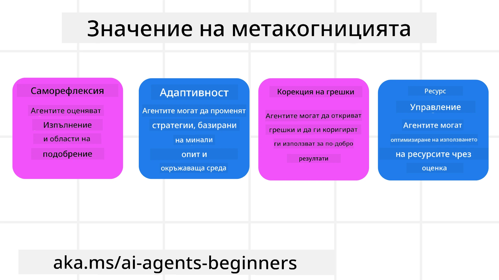
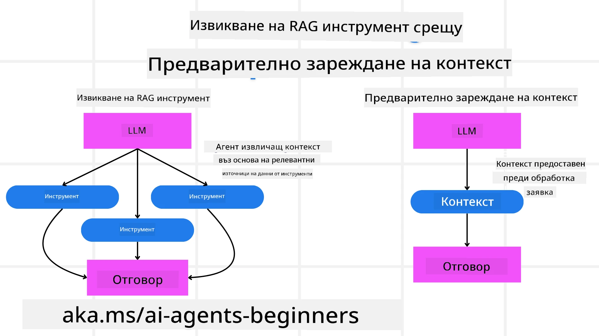

[](https://youtu.be/His9R6gw6Ec?si=3_RMb8VprNvdLRhX)

> _(Кликнете върху изображението по-горе, за да гледате видеото на този урок)_
# Метакогниция в AI Агенти

## Въведение

Добре дошли в урока за метакогниция в AI агенти! Този раздел е предназначен за начинаещи, които се интересуват как AI агентите могат да мислят за собствените си мисловни процеси. В края на този урок ще разберете ключови понятия и ще бъдете оборудвани с практически примери за приложението на метакогницията при проектирането на AI агенти.

## Цели на обучението

След завършване на този урок ще можете да:

1. Разберете последиците от цикли на разсъждение в дефинициите на агенти.
2. Използвате техники за планиране и оценяване, за да помогнете на агенти, които се самокоригират.
3. Създадете собствени агенти, способни да манипулират код за изпълнение на задачи.

## Въведение в Метакогницията

Метакогницията се отнася до по-високо порядъчните когнитивни процеси, които включват мислене за собственото мислене. За AI агенти това означава способност да оценяват и коригират действията си въз основа на самосъзнание и минал опит. Метакогницията, или "мислене за мисленето," е важна концепция в развитието на агентни AI системи. Тя включва AI системи, които са наясно със собствения си вътрешен процес и могат да наблюдават, регулират и адаптират поведението си съответно. Подобно на нас, когато „четем стаята” или разглеждаме даден проблем. Това самосъзнание може да помогне на AI системите да вземат по-добри решения, да идентифицират грешки и да подобрят представянето си с времето - отново връзка към теста на Тюринг и дебата дали AI ще завземе властта.

В контекста на агентните AI системи, метакогницията може да помогне в справянето с няколко предизвикателства, като например:
- Прозрачност: Гарантиране, че AI системите могат да обяснят разсъжденията и решенията си.
- Разсъждение: Подобряване на способността на AI системите да синтезират информация и да вземат здрави решения.
- Адаптация: Позволяване на AI системите да се адаптират към нови среди и променящи се условия.
- Възприятие: Подобряване на точността на AI системите при разпознаване и интерпретиране на данни от тяхната среда.

### Какво е Метакогниция?

Метакогницията, или "мислене за мисленето," е по-висш когнитивен процес, който включва самосъзнание и саморегулация на когнитивните процеси. В областта на AI метакогницията дава възможност на агентите да оценяват и адаптират стратегии и действия, което води до подобрени способности за решаване на проблеми и вземане на решения. Чрез разбирането на метакогницията можете да проектирате AI агенти, които не само са по-интелигентни, но и по-гъвкави и ефективни. При истинска метакогниция ще видите AI-то изрично да разсъждава за собственото си разсъждаване.

Пример: „Приоритетизирах по-евтини полети, защото... Може да пропускам директни полети, затова нека проверя отново.“
Записване как или защо е избран даден маршрут.
- Отбелязване, че е направил грешки, защото е разчитал прекалено на потребителските предпочитания от последния път, и затова модифицира стратегията си за вземане на решения, а не само крайната препоръка.
- Диагностициране на модели като: „Всеки път, когато виждам потребителят да споменава 'прекалено претъпкано', не трябва само да премахвам определени атракции, но и да осъзная, че методът ми за избор на ‘топ атракции’ е недостатъчен, ако винаги класирам по популярност.“

### Значението на Метакогницията в AI Агенти

Метакогницията играе ключова роля в дизайна на AI агенти по няколко причини:



- Саморефлексия: Агентите могат да оценят собственото си представяне и да идентифицират области за подобрение.
- Адаптивност: Агентите могат да модифицират стратегиите си въз основа на минал опит и променящи се условия.
- Корекция на грешки: Агентите могат автономно да откриват и поправят грешки, водещо до по-точни резултати.
- Управление на ресурси: Агентите могат да оптимизират използването на ресурси, като време и изчислителна мощност, чрез планиране и оценяване на действията си.

## Компоненти на AI Агент

Преди да преминем към метакогнитивните процеси, е важно да разберем основните компоненти на AI агент. Обикновено AI агент се състои от:

- Персона: Личността и характеристиките на агента, които определят как той взаимодейства с потребителите.
- Инструменти: Възможностите и функциите, които агентът може да изпълнява.
- Умения: Знанията и експертизата, които агентът притежава.

Тези компоненти работят заедно, за да създадат "единица експертиза," която може да изпълнява конкретни задачи.

**Пример**:
Представете си туристически агент, който не само планира вашата почивка, но и коригира пътя си въз основа на данни в реално време и предишния опит на клиента.

### Пример: Метакогниция в Туристически Агенски Сервиз

Представете си, че проектирате туристически агент, захранван от AI. Този агент, „Туристически Агент,“ помага на потребителите да планират ваканциите си. За да включите метакогниция, Туристическият Агент трябва да оценява и коригира действията си въз основа на самосъзнание и минал опит. Ето как метакогницията може да изиграе роля:

#### Текуща Задача

Текущата задача е да помогне на потребител да планира пътуване до Париж.

#### Стъпки за Изпълнение на Задачата

1. **Събиране на Предпочитанията на Потребителя**: Попитайте потребителя за дати на пътуване, бюджет, интереси (напр. музеи, кухня, пазаруване) и специфични изисквания.
2. **Събиране на Информация**: Търсене на опции за полети, настаняване, атракции и ресторанти, които съответстват на предпочитанията на потребителя.
3. **Генериране на Препоръки**: Предоставяне на персонализиран маршрут с детайли за полетите, хотелските резервации и предложените дейности.
4. **Коригиране на база Обратна връзка**: Попитайте потребителя за обратна връзка относно препоръките и направете необходимите корекции.

#### Необходими Ресурси

- Достъп до бази данни за резервации на полети и хотели.
- Информация за парижки атракции и ресторанти.
- Данни за обратна връзка от предишни взаимодействия.

#### Опит и Саморефлексия

Туристическият Агент използва метакогниция, за да оцени представянето си и да се учи от предишния опит. Например:

1. **Анализ на Обратна Връзка от Потребителя**: Туристическият Агент преглежда обратната връзка, за да определи кои препоръки са били добре приети и кои не, и съответно коригира бъдещите предложения.
2. **Адаптивност**: Ако потребителят е споменал, че не харесва претъпкани места, Туристическият Агент ще избегне препоръчването на популярни туристически обекти по време на пикови часове.
3. **Корекция на Грешки**: Ако Туристическият Агент е направил грешка в предишна резервация, например препоръчал хотел, който е изчерпан, той се учи да проверява наличността по-строго преди да направи предложения.

#### Практически Пример за Разработчик

Ето опростен пример как би изглеждал кодът на Туристически Агенти при включване на метакогниция:

```python
class Travel_Agent:
    def __init__(self):
        self.user_preferences = {}
        self.experience_data = []

    def gather_preferences(self, preferences):
        self.user_preferences = preferences

    def retrieve_information(self):
        # Търсене на полети, хотели и забележителности според предпочитанията
        flights = search_flights(self.user_preferences)
        hotels = search_hotels(self.user_preferences)
        attractions = search_attractions(self.user_preferences)
        return flights, hotels, attractions

    def generate_recommendations(self):
        flights, hotels, attractions = self.retrieve_information()
        itinerary = create_itinerary(flights, hotels, attractions)
        return itinerary

    def adjust_based_on_feedback(self, feedback):
        self.experience_data.append(feedback)
        # Анализиране на обратна връзка и коригиране на бъдещи препоръки
        self.user_preferences = adjust_preferences(self.user_preferences, feedback)

# Пример за употреба
travel_agent = Travel_Agent()
preferences = {
    "destination": "Paris",
    "dates": "2025-04-01 to 2025-04-10",
    "budget": "moderate",
    "interests": ["museums", "cuisine"]
}
travel_agent.gather_preferences(preferences)
itinerary = travel_agent.generate_recommendations()
print("Suggested Itinerary:", itinerary)
feedback = {"liked": ["Louvre Museum"], "disliked": ["Eiffel Tower (too crowded)"]}
travel_agent.adjust_based_on_feedback(feedback)
```

#### Защо Метакогницията е Важна

- **Саморефлексия**: Агентите могат да анализират представянето си и да идентифицират области за подобрение.
- **Адаптивност**: Агентите могат да променят стратегии въз основа на обратна връзка и променящи се условия.
- **Корекция на Грешки**: Агентите могат автономно да откриват и коригират грешки.
- **Управление на Ресурси**: Агентите могат да оптимизират използването на ресурси като време и изчислителна мощ.

Чрез интегрирането на метакогниция Туристическият Агент може да предоставя по-персонализирани и точни препоръки за пътуване, подобрявайки общото потребителско изживяване.

---

## 2. Планиране при Агентите

Планирането е критичен компонент от поведението на AI агентите. То включва очертаване на необходимите стъпки за постигане на цел, като се вземат предвид текущото състояние, ресурсите и възможните препятствия.

### Елементи на Планирането

- **Текуща Задача**: Определете задачата ясно.
- **Стъпки за Изпълнение на Задачата**: Разделете задачата на управляеми стъпки.
- **Необходими Ресурси**: Изяснете необходимите ресурси.
- **Опит**: Използвайте минал опит за информиране на планирането.

**Пример**:
Ето стъпките, които Туристическият Агент трябва да предприеме, за да помогне на потребител да планира пътуването си ефективно:

### Стъпки за Туристически Агент

1. **Събиране на Предпочитанията на Потребителя**
   - Попитайте потребителя за подробности относно датите на пътуване, бюджета, интересите и специфични изисквания.
   - Примери: "Кога планирате да пътувате?" "Какъв е приблизителният ви бюджет?" "Какви дейности ви харесват по време на ваканция?"

2. **Събиране на Информация**
   - Търсене на подходящи опции за пътуване въз основа на предпочитанията на потребителя.
   - **Полети**: Търсене на налични полети в рамките на бюджета и предпочитаните дати.
   - **Настаняване**: Намиране на хотели или имоти за наем, които съответстват на предпочитанията по отношение на местоположение, цена и удобства.
   - **Атракции и Ресторанти**: Идентифициране на популярни атракции, дейности и заведения за хранене, които съответстват на интересите на потребителя.

3. **Генериране на Препоръки**
   - Компилиране на събраната информация в персонализиран маршрут.
   - Осигуряване на детайли като възможности за полети, резервации за хотели и предложени дейности, съобразени с предпочитанията на потребителя.

4. **Представяне на Маршрута на Потребителя**
   - Споделяне на предложената програма с потребителя за преглед.
   - Пример: "Ето предложения маршрут за вашето пътуване до Париж. Той включва детайли за полети, хотелски резервации и списък с препоръчани дейности и ресторанти. Кажете ми мнението си!"

5. **Събиране на Обратна Връзка**
   - Попитайте потребителя за обратна връзка относно предложената програма.
   - Примери: "Харесват ли ви опциите за полети?" "Подходящ ли е хотелът за вашите нужди?" "Има ли дейности, които бихте искали да добавите или премахнете?"

6. **Корекция на база Обратна Връзка**
   - Модифициране на маршрута въз основа на обратната връзка.
   - Направете необходимите промени в препоръките за полети, настаняване и дейности, за да съответстват по-добре на предпочитанията на потребителя.

7. **Крайнo Потвърждение**
   - Представяне на актуализирания маршрут на потребителя за окончателно одобрение.
   - Пример: "Направих корекциите, базирани на вашата обратна връзка. Ето актуализирания маршрут. Всичко ли изглежда добре за вас?"

8. **Резервация и Потвърждение**
   - След одобрението на маршрута от потребителя, пристъпете към резервация на полети, настаняване и планирани дейности.
   - Изпратете потвърдителни данни на потребителя.

9. **Осигуряване на Продължаваща Поддръжка**
   - Останете на разположение за помощ при промени или допълнителни заявки преди и по време на пътуването.
   - Пример: "Ако имате нужда от допълнителна помощ по време на пътуването, не се колебайте да се свържете с мен по всяко време!"

### Пример за Взаимодействие

```python
class Travel_Agent:
    def __init__(self):
        self.user_preferences = {}
        self.experience_data = []

    def gather_preferences(self, preferences):
        self.user_preferences = preferences

    def retrieve_information(self):
        flights = search_flights(self.user_preferences)
        hotels = search_hotels(self.user_preferences)
        attractions = search_attractions(self.user_preferences)
        return flights, hotels, attractions

    def generate_recommendations(self):
        flights, hotels, attractions = self.retrieve_information()
        itinerary = create_itinerary(flights, hotels, attractions)
        return itinerary

    def adjust_based_on_feedback(self, feedback):
        self.experience_data.append(feedback)
        self.user_preferences = adjust_preferences(self.user_preferences, feedback)

# Пример за използване в заявка за резервиране
travel_agent = Travel_Agent()
preferences = {
    "destination": "Paris",
    "dates": "2025-04-01 to 2025-04-10",
    "budget": "moderate",
    "interests": ["museums", "cuisine"]
}
travel_agent.gather_preferences(preferences)
itinerary = travel_agent.generate_recommendations()
print("Suggested Itinerary:", itinerary)
feedback = {"liked": ["Louvre Museum"], "disliked": ["Eiffel Tower (too crowded)"]}
travel_agent.adjust_based_on_feedback(feedback)
```

## 3. Коригираща RAG Система

Първо нека започнем с разбирането на разликата между RAG Инструмент и Предварително Зареждане на Контекста



### Retrieval-Augmented Generation (RAG)

RAG комбинира система за извличане с генеративен модел. Когато се направи заявка, системата за извличане намира релевантни документи или данни от външен източник и тази извлечена информация се използва за обогатяване на входа към генеративния модел. Това помага на модела да генерира по-точни и контекстуално релевантни отговори.

В RAG система агентът извлича релевантна информация от база знания и я използва за генериране на подходящи отговори или действия.

### Подход на Коригираща RAG

Подходът на Коригираща RAG се фокусира върху използването на RAG техники за коригиране на грешки и подобряване на точността на AI агентите. Това включва:

1. **Техника на Подканване**: Използване на специфични подканващи фрази за насочване на агента към извличане на релевантна информация.
2. **Инструмент**: Имплементиране на алгоритми и механизми, които позволяват на агента да оценява релевантността на извлечената информация и да генерира точни отговори.
3. **Оценка**: Непрекъснато оценяване на представянето на агента и правене на корекции за подобряване на точността и ефективността.

#### Пример: Коригираща RAG при Търсещ Агент

Представете си търсещ агент, който извлича информация от мрежата, за да отговори на потребителски заявки. Подходът на Коригираща RAG може да включва:

1. **Техника на Подканване**: Формулиране на търсещи заявки въз основа на входа от потребителя.
2. **Инструмент**: Използване на алгоритми за обработка на естествен език и машинно обучение за класиране и филтриране на резултатите от търсенето.
3. **Оценка**: Анализ на обратна връзка от потребителя за идентифициране и коригиране на неточности в извлечената информация.

### Коригираща RAG в Туристически Агент

Коригиращата RAG (Retrieval-Augmented Generation) подобрява способността на AI да извлича и генерира информация, като коригира всякакви неточности. Нека видим как Туристическият Агент може да използва подхода Коригираща RAG, за да предостави по-точни и релевантни препоръки за пътувания.

Това включва:

- **Техника на Подканване:** Използване на специфични подканващи фрази за насочване на агента към извличане на релевантна информация.
- **Инструмент:** Имплементиране на алгоритми и механизми, които позволяват на агента да оценява релевантността на извлечената информация и да генерира точни отговори.
- **Оценка:** Непрекъснато оценяване на представянето на агента и правене на корекции за подобряване на точността и ефективността.

#### Стъпки за Имплементиране на Коригираща RAG в Туристически Агент

1. **Начално Взаимодействие с Потребителя**
   - Туристическият Агент събира първоначални предпочитания от потребителя, като дестинация, дати на пътуване, бюджет и интереси.
   - Пример:

     ```python
     preferences = {
         "destination": "Paris",
         "dates": "2025-04-01 to 2025-04-10",
         "budget": "moderate",
         "interests": ["museums", "cuisine"]
     }
     ```

2. **Извличане на Информация**
   - Туристическият Агент извлича информация за полети, настаняване, атракции и ресторанти въз основа на предпочитанията на потребителя.
   - Пример:

     ```python
     flights = search_flights(preferences)
     hotels = search_hotels(preferences)
     attractions = search_attractions(preferences)
     ```

3. **Генериране на Първоначални Препоръки**
   - Туристическият Агент използва извлечената информация за генериране на персонализиран маршрут.
   - Пример:

     ```python
     itinerary = create_itinerary(flights, hotels, attractions)
     print("Suggested Itinerary:", itinerary)
     ```

4. **Събиране на Обратна Връзка от Потребителя**
   - Туристическият Агент пита потребителя за обратна връзка относно първоначалните препоръки.
   - Пример:

     ```python
     feedback = {
         "liked": ["Louvre Museum"],
         "disliked": ["Eiffel Tower (too crowded)"]
     }
     ```

5. **Коригиращ RAG Процес**
   - **Техника на Подканване**: Туристическият Агент формулира нови търсещи заявки въз основа на обратната връзка.
     - Пример:

       ```python
       if "disliked" in feedback:
           preferences["avoid"] = feedback["disliked"]
       ```

   - **Инструмент**: Туристическият Агент използва алгоритми за класиране и филтриране на новите резултати от търсенето, като акцентира върху релевантността, базирана на обратната връзка.
     - Пример:

       ```python
       new_attractions = search_attractions(preferences)
       new_itinerary = create_itinerary(flights, hotels, new_attractions)
       print("Updated Itinerary:", new_itinerary)
       ```

   - **Оценка**: Туристическият Агент непрекъснато оценява релевантността и точността на препоръките си чрез анализ на обратната връзка и прави необходимите корекции.
     - Пример:

       ```python
       def adjust_preferences(preferences, feedback):
           if "liked" in feedback:
               preferences["favorites"] = feedback["liked"]
           if "disliked" in feedback:
               preferences["avoid"] = feedback["disliked"]
           return preferences

       preferences = adjust_preferences(preferences, feedback)
       ```

#### Практически Пример

Ето опростен пример на Python код, включващ подхода Коригираща RAG в Туристически Агент:

```python
class Travel_Agent:
    def __init__(self):
        self.user_preferences = {}
        self.experience_data = []

    def gather_preferences(self, preferences):
        self.user_preferences = preferences

    def retrieve_information(self):
        flights = search_flights(self.user_preferences)
        hotels = search_hotels(self.user_preferences)
        attractions = search_attractions(self.user_preferences)
        return flights, hotels, attractions

    def generate_recommendations(self):
        flights, hotels, attractions = self.retrieve_information()
        itinerary = create_itinerary(flights, hotels, attractions)
        return itinerary

    def adjust_based_on_feedback(self, feedback):
        self.experience_data.append(feedback)
        self.user_preferences = adjust_preferences(self.user_preferences, feedback)
        new_itinerary = self.generate_recommendations()
        return new_itinerary

# Пример за употреба
travel_agent = Travel_Agent()
preferences = {
    "destination": "Paris",
    "dates": "2025-04-01 to 2025-04-10",
    "budget": "moderate",
    "interests": ["museums", "cuisine"]
}
travel_agent.gather_preferences(preferences)
itinerary = travel_agent.generate_recommendations()
print("Suggested Itinerary:", itinerary)
feedback = {"liked": ["Louvre Museum"], "disliked": ["Eiffel Tower (too crowded)"]}
new_itinerary = travel_agent.adjust_based_on_feedback(feedback)
print("Updated Itinerary:", new_itinerary)
```

### Предварително Зареждане на Контекста


Предварително зареждане на контекст включва зареждане на релевантен контекст или фонова информация в модела преди обработката на заявка. Това означава, че моделът има достъп до тази информация от самото начало, което може да му помогне да генерира по-информирани отговори без да е необходимо да извлича допълнителни данни по време на процеса.

Ето един опростен пример за това как може да изглежда предварителното зареждане на контекст за приложение на туристически агент в Python:

```python
class TravelAgent:
    def __init__(self):
        # Предварително зареждане на популярни дестинации и тяхната информация
        self.context = {
            "Paris": {"country": "France", "currency": "Euro", "language": "French", "attractions": ["Eiffel Tower", "Louvre Museum"]},
            "Tokyo": {"country": "Japan", "currency": "Yen", "language": "Japanese", "attractions": ["Tokyo Tower", "Shibuya Crossing"]},
            "New York": {"country": "USA", "currency": "Dollar", "language": "English", "attractions": ["Statue of Liberty", "Times Square"]},
            "Sydney": {"country": "Australia", "currency": "Dollar", "language": "English", "attractions": ["Sydney Opera House", "Bondi Beach"]}
        }

    def get_destination_info(self, destination):
        # Извличане на информация за дестинации от предварително зареден контекст
        info = self.context.get(destination)
        if info:
            return f"{destination}:\nCountry: {info['country']}\nCurrency: {info['currency']}\nLanguage: {info['language']}\nAttractions: {', '.join(info['attractions'])}"
        else:
            return f"Sorry, we don't have information on {destination}."

# Пример за използване
travel_agent = TravelAgent()
print(travel_agent.get_destination_info("Paris"))
print(travel_agent.get_destination_info("Tokyo"))
```

#### Обяснение

1. **Инициализация (метод `__init__`)**: Класът `TravelAgent` предварително зарежда речник с информация за популярни дестинации като Париж, Токио, Ню Йорк и Сидни. Този речник включва детайли като държава, валута, език и основни забележителности за всяка дестинация.

2. **Извличане на информация (метод `get_destination_info`)**: Когато потребителят зададе въпрос за конкретна дестинация, методът `get_destination_info` извлича съответната информация от предварително заредения речник с контекст.

Чрез предварително зареждане на контекста, приложението на туристическия агент може бързо да отговаря на запитванията на потребителите без да се налага да извлича тази информация от външен източник в реално време. Това прави приложението по-ефективно и отзивчиво.

### Стартиране на плана с цел преди итерация

Стартирането на план с цел включва започване с ясна цел или целеви резултат в ума. Чрез дефиниране на тази цел предварително, моделът може да я използва като водещ принцип през целия итеративен процес. Това помага да се гарантира, че всяка итерация приближава до постигането на желания резултат, правейки процеса по-ефективен и насочен.

Ето пример за това как може да стартирате пътен план с цел преди итерация за туристически агент в Python:

### Сценарий

Туристически агент иска да планира персонализирана ваканция за клиент. Целта е да се създаде маршрут за пътуване, който максимизира удовлетвореността на клиента според техните предпочитания и бюджет.

### Стъпки

1. Дефиниране на предпочитанията и бюджета на клиента.
2. Стартиране на началния план въз основа на тези предпочитания.
3. Итерация за усъвършенстване на плана, оптимизирайки за удовлетвореността на клиента.

#### Python код

```python
class TravelAgent:
    def __init__(self, destinations):
        self.destinations = destinations

    def bootstrap_plan(self, preferences, budget):
        plan = []
        total_cost = 0

        for destination in self.destinations:
            if total_cost + destination['cost'] <= budget and self.match_preferences(destination, preferences):
                plan.append(destination)
                total_cost += destination['cost']

        return plan

    def match_preferences(self, destination, preferences):
        for key, value in preferences.items():
            if destination.get(key) != value:
                return False
        return True

    def iterate_plan(self, plan, preferences, budget):
        for i in range(len(plan)):
            for destination in self.destinations:
                if destination not in plan and self.match_preferences(destination, preferences) and self.calculate_cost(plan, destination) <= budget:
                    plan[i] = destination
                    break
        return plan

    def calculate_cost(self, plan, new_destination):
        return sum(destination['cost'] for destination in plan) + new_destination['cost']

# Пример за използване
destinations = [
    {"name": "Paris", "cost": 1000, "activity": "sightseeing"},
    {"name": "Tokyo", "cost": 1200, "activity": "shopping"},
    {"name": "New York", "cost": 900, "activity": "sightseeing"},
    {"name": "Sydney", "cost": 1100, "activity": "beach"},
]

preferences = {"activity": "sightseeing"}
budget = 2000

travel_agent = TravelAgent(destinations)
initial_plan = travel_agent.bootstrap_plan(preferences, budget)
print("Initial Plan:", initial_plan)

refined_plan = travel_agent.iterate_plan(initial_plan, preferences, budget)
print("Refined Plan:", refined_plan)
```

#### Обяснение на кода

1. **Инициализация (метод `__init__`)**: Класът `TravelAgent` се инициализира със списък потенциални дестинации, всяка с атрибути като име, цена и тип на активността.

2. **Стартиране на плана (метод `bootstrap_plan`)**: Този метод създава начален план за пътуване на база предпочитанията и бюджета на клиента. Той обхожда списъка с дестинации и ги добавя към плана, ако съответстват на предпочитанията на клиента и се вписват в бюджета.

3. **Съвпадение на предпочитанията (метод `match_preferences`)**: Този метод проверява дали дадена дестинация съответства на предпочитанията на клиента.

4. **Итерация на плана (метод `iterate_plan`)**: Този метод усъвършенства началния план, като се опитва да замени всяка дестинация в плана с по-подходяща, като взема предвид предпочитанията на клиента и ограниченията на бюджета.

5. **Изчисляване на разходите (метод `calculate_cost`)**: Този метод изчислява общата стойност на текущия план, включително евентуална нова дестинация.

#### Пример за използване

- **Начален план**: Туристическият агент създава начален план базиран на предпочитанията на клиента за разглеждане на забележителности и бюджет от 2000 долара.
- **Усъвършенстван план**: Туристическият агент итеративно усъвършенства плана, оптимизирайки според предпочитанията и бюджета на клиента.

Чрез стартиране на план с ясна цел (например максимизиране на удовлетвореността на клиента) и итерация за усъвършенстване на плана, туристическият агент може да създаде персонализиран и оптимизиран маршрут за клиента. Този подход осигурява съответствие на плана с предпочитанията и бюджета на клиента още от началото и подобряване с всяка итерация.

### Възползване от LLM за пре-подреждане и оценяване

Големите езикови модели (LLM) могат да се използват за пре-подреждане и оценяване чрез оценяване на релевантността и качеството на извлечените документи или генерираните отговори. Ето как работи това:

**Извличане:** Първоначалната стъпка за извличане взема набор от кандидати документи или отговори според заявката.

**Пре-подреждане:** LLM оценява тези кандидати и ги пре-подрежда на база релевантност и качество. Тази стъпка гарантира, че най-релевантната и качествена информация се показва първа.

**Оценяване:** LLM присвоява оценки на всеки кандидат, отразявайки тяхната релевантност и качество. Това помага да се избере най-добрият отговор или документ за потребителя.

Чрез използване на LLM за пре-подреждане и оценяване системата може да предостави по-точна и контекстуално релевантна информация, подобрявайки общото потребителско изживяване.

Ето пример за това как туристически агент може да използва Голям езиков модел (LLM) за пре-подреждане и оценяване на туристически дестинации според предпочитанията на потребителя в Python:

#### Сценарий - Пътуване според предпочитанията

Туристически агент иска да препоръча най-добрите туристически дестинации на клиент според техните предпочитания. LLM ще помогне да се пре-подредят и оценят дестинациите, за да се осигури представяне на най-релевантните опции.

#### Стъпки:

1. Събиране на предпочитания на потребителя.
2. Извличане на списък със потенциални туристически дестинации.
3. Използване на LLM за пре-подреждане и оценяване на дестинациите според предпочитанията на потребителя.

Ето как можете да актуализирате предишния пример, за да използвате Azure OpenAI услуги:

#### Изисквания

1. Трябва да имате Azure абонамент.
2. Създайте Azure OpenAI ресурс и вземете вашия API ключ.

#### Примерен Python код

```python
import requests
import json

class TravelAgent:
    def __init__(self, destinations):
        self.destinations = destinations

    def get_recommendations(self, preferences, api_key, endpoint):
        # Генериране на подканващ текст за Azure OpenAI
        prompt = self.generate_prompt(preferences)
        
        # Дефиниране на заглавки и съдържание за заявката
        headers = {
            'Content-Type': 'application/json',
            'Authorization': f'Bearer {api_key}'
        }
        payload = {
            "prompt": prompt,
            "max_tokens": 150,
            "temperature": 0.7
        }
        
        # Извикване на Azure OpenAI API за получаване на преордерирани и оценени дестинации
        response = requests.post(endpoint, headers=headers, json=payload)
        response_data = response.json()
        
        # Извличане и връщане на препоръките
        recommendations = response_data['choices'][0]['text'].strip().split('\n')
        return recommendations

    def generate_prompt(self, preferences):
        prompt = "Here are the travel destinations ranked and scored based on the following user preferences:\n"
        for key, value in preferences.items():
            prompt += f"{key}: {value}\n"
        prompt += "\nDestinations:\n"
        for destination in self.destinations:
            prompt += f"- {destination['name']}: {destination['description']}\n"
        return prompt

# Пример за използване
destinations = [
    {"name": "Paris", "description": "City of lights, known for its art, fashion, and culture."},
    {"name": "Tokyo", "description": "Vibrant city, famous for its modernity and traditional temples."},
    {"name": "New York", "description": "The city that never sleeps, with iconic landmarks and diverse culture."},
    {"name": "Sydney", "description": "Beautiful harbour city, known for its opera house and stunning beaches."},
]

preferences = {"activity": "sightseeing", "culture": "diverse"}
api_key = 'your_azure_openai_api_key'
endpoint = 'https://your-endpoint.com/openai/deployments/your-deployment-name/completions?api-version=2022-12-01'

travel_agent = TravelAgent(destinations)
recommendations = travel_agent.get_recommendations(preferences, api_key, endpoint)
print("Recommended Destinations:")
for rec in recommendations:
    print(rec)
```

#### Обяснение на кода - Резервация според предпочитания

1. **Инициализация**: Класът `TravelAgent` се инициализира със списък потенциални туристически дестинации, всяка с атрибути като име и описание.

2. **Получаване на препоръки (метод `get_recommendations`)**: Този метод генерира заявка (prompt) към Azure OpenAI услугата, базирана на предпочитанията на потребителя, и прави HTTP POST заявка към Azure OpenAI API за получаване на пре-подредени и оценени дестинации.

3. **Генериране на заявка (метод `generate_prompt`)**: Този метод конструира заявка за Azure OpenAI, включваща предпочитанията на потребителя и списъка с дестинации. Заявката насочва модела да пре-подреди и оцени дестинациите според зададените предпочитания.

4. **API извикване**: Библиотеката `requests` се използва за правене на HTTP POST заявка към Azure OpenAI API крайна точка. Отговорът съдържа пре-подредените и оценени дестинации.

5. **Пример за използване**: Туристическият агент събира предпочитания на потребителя (например интерес към разглеждане на забележителности и разнообразна култура) и използва Azure OpenAI услугата за получаване на пре-подредени и оценени препоръки за туристически дестинации.

Уверете се, че сте заменили `your_azure_openai_api_key` с вашия реален Azure OpenAI API ключ и `https://your-endpoint.com/...` с реалния URL на крайна точка на вашата Azure OpenAI инсталация.

Чрез използване на LLM за пре-подреждане и оценяване, туристическият агент може да предоставя по-персонализирани и релевантни препоръки за пътуване на клиентите, подобрявайки общото им изживяване.

### RAG: Техника за подканяне срещу Инструмент

Retrieval-Augmented Generation (RAG) може да бъде както техника за подканяне, така и инструмент при разработката на AI агенти. Разбирането на разликата между двете може да ви помогне да използвате RAG по-ефективно в проектите си.

#### RAG като техника за подканяне

**Какво е това?**

- Като техника за подканяне, RAG включва формулиране на конкретни заявки или подканвания за насочване към извличането на релевантна информация от голям корпус или база данни. Тази информация след това се използва за генериране на отговори или действия.

**Как работи:**

1. **Формиране на подканвания**: Създавайте добре структурирани подканвания или заявки, базирани на поставената задача или входа на потребителя.
2. **Извличане на информация**: Използвайте подканванията за търсене на релевантни данни от предварително съществуваща база знания или набор от данни.
3. **Генериране на отговор**: Комбинирайте извлечената информация с генеративни AI модели за създаване на цялостен и свързан отговор.

**Пример в туристически агент**:

- Потребителска заявка: "Искам да посетя музеи в Париж."
- Подканване: "Намери най-добрите музеи в Париж."
- Извлечена информация: Детайли за Лувъра, Мюзе д'Орсе и др.
- Генериран отговор: "Ето някои от най-добрите музеи в Париж: Лувър, Мюзе д'Орсе и Център Помпиду."

#### RAG като инструмент

**Какво е това?**

- Като инструмент, RAG е интегрирана система, която автоматизира процеса на извличане и генериране, улеснявайки разработчиците да внедрят сложни AI функции без да създават подканвания ръчно за всяка заявка.

**Как работи:**

1. **Интеграция**: Вградете RAG в архитектурата на AI агента, позволявайки му автоматично да се справя със задачите по извличане и генериране.
2. **Автоматизация**: Инструментът управлява целия процес от получаването на заявката на потребителя до генерирането на крайния отговор, без да са необходими явни подканвания за всяка стъпка.
3. **Ефективност**: Подобрява представянето на агента чрез оптимизиране на процесите на извличане и генериране, позволявайки по-бързи и по-точни отговори.

**Пример в туристически агент**:

- Потребителска заявка: "Искам да посетя музеи в Париж."
- Инструмент RAG: Автоматично извлича информация за музеи и генерира отговор.
- Генериран отговор: "Ето някои от най-добрите музеи в Париж: Лувър, Мюзе д'Орсе и Център Помпиду."

### Сравнение

| Аспект                | Техника за подканяне                                     | Инструмент                                            |
|------------------------|--------------------------------------------------------|-------------------------------------------------------|
| **Ръчно срещу автоматично** | Ръчно създаване на подканвания за всяка заявка.        | Автоматизиран процес за извличане и генериране.        |
| **Контрол**             | Предлага повече контрол върху процеса на извличане.      | Оптимизира и автоматизира извличането и генерирането.  |
| **Гъвкавост**           | Позволява персонализирани подканвания според нуждите.   | По-ефективно за големи внедрявания.                     |
| **Сложност**            | Изисква създаване и настройка на подканвания.           | По-лесно за интегриране в архитектурата на AI агент.   |

### Практически примери

**Пример за техника за подканяне:**

```python
def search_museums_in_paris():
    prompt = "Find top museums in Paris"
    search_results = search_web(prompt)
    return search_results

museums = search_museums_in_paris()
print("Top Museums in Paris:", museums)
```

**Пример за инструмент:**

```python
class Travel_Agent:
    def __init__(self):
        self.rag_tool = RAGTool()

    def get_museums_in_paris(self):
        user_input = "I want to visit museums in Paris."
        response = self.rag_tool.retrieve_and_generate(user_input)
        return response

travel_agent = Travel_Agent()
museums = travel_agent.get_museums_in_paris()
print("Top Museums in Paris:", museums)
```

### Оценяване на релевантност

Оценяването на релевантността е ключов аспект от представянето на AI агентите. То гарантира, че информацията, извлечена и генерирана от агента, е подходяща, точна и полезна за потребителя. Нека разгледаме как да оценяваме релевантността в AI агенти, включително практически примери и техники.

#### Основни концепции при оценяване на релевантността

1. **Осъзнаване на контекста**:
   - Агентът трябва да разбира контекста на заявката на потребителя, за да извлича и генерира релевантна информация.
   - Пример: Ако потребителят пита за "най-добрите ресторанти в Париж", агентът трябва да вземе предвид предпочитанията на потребителя, като тип кухня и бюджет.

2. **Точност**:
   - Информацията, предоставена от агента, трябва да е фактологично вярна и актуална.
   - Пример: Препоръчване на работещи ресторанти с добри отзиви, а не остарели или затворени.

3. **Намерение на потребителя**:
   - Агентът трябва да разбере намерението зад заявката на потребителя, за да предостави най-релевантната информация.
   - Пример: Ако потребителят пита за "бюджетни хотели", агентът дава предимство на достъпните опции.

4. **Обратна връзка**:
   - Непрекъснатото събиране и анализ на обратната връзка от потребителите помага на агента да усъвършенства оценяването на релевантността.
   - Пример: Включване на рейтинги и отзиви от потребителите върху предишни препоръки за подобряване на бъдещите отговори.

#### Практически техники за оценка на релевантността

1. **Оценка на релевантност**:
   - Присвояване на оценка за релевантност на всеки извлечен елемент според това колко добре съответства на заявката и предпочитанията на потребителя.
   - Пример:

     ```python
     def relevance_score(item, query):
         score = 0
         if item['category'] in query['interests']:
             score += 1
         if item['price'] <= query['budget']:
             score += 1
         if item['location'] == query['destination']:
             score += 1
         return score
     ```

2. **Филтриране и подреждане**:
   - Филтриране на нерелевантни елементи и подреждане на останалите по оценки за релевантност.
   - Пример:

     ```python
     def filter_and_rank(items, query):
         ranked_items = sorted(items, key=lambda item: relevance_score(item, query), reverse=True)
         return ranked_items[:10]  # Върнете топ 10 най-релевантни елемента
     ```

3. **Обработка на естествен език (NLP)**:
   - Използване на NLP техники за разбиране на заявката на потребителя и извличане на релевантна информация.
   - Пример:

     ```python
     def process_query(query):
         # Използвайте NLP за извличане на ключова информация от заявката на потребителя
         processed_query = nlp(query)
         return processed_query
     ```

4. **Интегриране на обратна връзка от потребители**:
   - Събиране на обратна връзка за предоставените препоръки и използването й за корекция на бъдещите оценки за релевантност.
   - Пример:

     ```python
     def adjust_based_on_feedback(feedback, items):
         for item in items:
             if item['name'] in feedback['liked']:
                 item['relevance'] += 1
             if item['name'] in feedback['disliked']:
                 item['relevance'] -= 1
         return items
     ```

#### Пример: Оценка на релевантността в туристически агент

Ето един практичен пример как Travel Agent може да оцени релевантността на туристически препоръки:

```python
class Travel_Agent:
    def __init__(self):
        self.user_preferences = {}
        self.experience_data = []

    def gather_preferences(self, preferences):
        self.user_preferences = preferences

    def retrieve_information(self):
        flights = search_flights(self.user_preferences)
        hotels = search_hotels(self.user_preferences)
        attractions = search_attractions(self.user_preferences)
        return flights, hotels, attractions

    def generate_recommendations(self):
        flights, hotels, attractions = self.retrieve_information()
        ranked_hotels = self.filter_and_rank(hotels, self.user_preferences)
        itinerary = create_itinerary(flights, ranked_hotels, attractions)
        return itinerary

    def filter_and_rank(self, items, query):
        ranked_items = sorted(items, key=lambda item: self.relevance_score(item, query), reverse=True)
        return ranked_items[:10]  # Върнете топ 10 релевантни елемента

    def relevance_score(self, item, query):
        score = 0
        if item['category'] in query['interests']:
            score += 1
        if item['price'] <= query['budget']:
            score += 1
        if item['location'] == query['destination']:
            score += 1
        return score

    def adjust_based_on_feedback(self, feedback, items):
        for item in items:
            if item['name'] in feedback['liked']:
                item['relevance'] += 1
            if item['name'] in feedback['disliked']:
                item['relevance'] -= 1
        return items

# Пример за използване
travel_agent = Travel_Agent()
preferences = {
    "destination": "Paris",
    "dates": "2025-04-01 to 2025-04-10",
    "budget": "moderate",
    "interests": ["museums", "cuisine"]
}
travel_agent.gather_preferences(preferences)
itinerary = travel_agent.generate_recommendations()
print("Suggested Itinerary:", itinerary)
feedback = {"liked": ["Louvre Museum"], "disliked": ["Eiffel Tower (too crowded)"]}
updated_items = travel_agent.adjust_based_on_feedback(feedback, itinerary['hotels'])
print("Updated Itinerary with Feedback:", updated_items)
```

### Търсене с намерение

Търсенето с намерение включва разбиране и интерпретиране на основната цел или причина зад заявката на потребителя, за да се извлече и генерира най-релевантната и полезна информация. Този подход надхвърля просто съвпадение на ключови думи и се фокусира върху разбирането на действителните нужди и контекст на потребителя.

#### Основни концепции при търсене с намерение

1. **Разбиране на намерението на потребителя**:
   - Намерението на потребителя може да се категоризира в три основни типа: информационно, навигационно и транзакционно.
     - **Информационно намерение**: Потребителят търси информация по тема (напр. "Кои са най-добрите музеи в Париж?").
     - **Навигационно намерение**: Потребителят иска да отиде до конкретен уебсайт или страница (напр. "Официален сайт на Лувъра").
     - **Транзакционно намерение**: Потребителят желае да извърши транзакция, като резервация на полет или покупка (напр. "Резервирай полет до Париж").

2. **Осъзнаване на контекста**:
   - Анализирането на контекста на заявката помага за точно определяне на намерението. Това включва вземане под внимание на предишни взаимодействия, предпочитанията на потребителя и конкретните детайли на текущата заявка.

3. **Обработка на естествен език (NLP)**:
   - NLP техники се прилагат за разбиране и интерпретиране на заявките на естествен език, предоставени от потребителите. Това включва задачи като разпознаване на единици, анализ на емоционалния заряд и парсиране на запитването.

4. **Персонализация**:
   - Персонализирането на резултатите от търсенето на база историята, предпочитанията и обратната връзка на потребителя подобрява релевантността на извлечената информация.

#### Практически пример: Търсене с намерение в туристически агент

Нека вземем Travel Agent за пример, за да видим как може да се реализира търсене с намерение.

1. **Събиране на предпочитанията на потребителя**

   ```python
   class Travel_Agent:
       def __init__(self):
           self.user_preferences = {}

       def gather_preferences(self, preferences):
           self.user_preferences = preferences
   ```

2. **Разбиране на намерението на потребителя**

   ```python
   def identify_intent(query):
       if "book" in query or "purchase" in query:
           return "transactional"
       elif "website" in query or "official" in query:
           return "navigational"
       else:
           return "informational"
   ```

3. **Осъзнаване на контекста**


   ```python
   def analyze_context(query, user_history):
       # Комбинирайте текущата заявка с историята на потребителя, за да разберете контекста
       context = {
           "current_query": query,
           "user_history": user_history
       }
       return context
   ```

4. **Търсене и персонализиране на резултатите**

   ```python
   def search_with_intent(query, preferences, user_history):
       intent = identify_intent(query)
       context = analyze_context(query, user_history)
       if intent == "informational":
           search_results = search_information(query, preferences)
       elif intent == "navigational":
           search_results = search_navigation(query)
       elif intent == "transactional":
           search_results = search_transaction(query, preferences)
       personalized_results = personalize_results(search_results, user_history)
       return personalized_results

   def search_information(query, preferences):
       # Примерна логика за търсене за информационно намерение
       results = search_web(f"best {preferences['interests']} in {preferences['destination']}")
       return results

   def search_navigation(query):
       # Примерна логика за търсене за навигационно намерение
       results = search_web(query)
       return results

   def search_transaction(query, preferences):
       # Примерна логика за търсене за транзакционно намерение
       results = search_web(f"book {query} to {preferences['destination']}")
       return results

   def personalize_results(results, user_history):
       # Примерна логика за персонализация
       personalized = [result for result in results if result not in user_history]
       return personalized[:10]  # Връща топ 10 персонализирани резултати
   ```

5. **Пример за използване**

   ```python
   travel_agent = Travel_Agent()
   preferences = {
       "destination": "Paris",
       "interests": ["museums", "cuisine"]
   }
   travel_agent.gather_preferences(preferences)
   user_history = ["Louvre Museum website", "Book flight to Paris"]
   query = "best museums in Paris"
   results = search_with_intent(query, preferences, user_history)
   print("Search Results:", results)
   ```

---

## 4. Генериране на код като инструмент

Агенти за генериране на код използват AI модели за писане и изпълнение на код, решавайки сложни проблеми и автоматизирайки задачи.

### Агенти за генериране на код

Агенти за генериране на код използват генеративни AI модели за писане и изпълнение на код. Тези агенти могат да решават сложни проблеми, да автоматизират задачи и да предоставят ценни прозрения чрез генериране и изпълнение на код на различни програмни езици.

#### Практически приложения

1. **Автоматизирано генериране на код**: Генериране на кодови откъси за конкретни задачи, като анализ на данни, уеб скрейпинг или машинно обучение.
2. **SQL като RAG**: Използване на SQL заявки за извличане и манипулиране на данни от бази данни.
3. **Решаване на проблеми**: Създаване и изпълнение на код за решаване на конкретни проблеми, като оптимизация на алгоритми или анализ на данни.

#### Пример: Агенти за генериране на код за анализ на данни

Представете си, че проектирате агент за генериране на код. Ето как би могъл да работи:

1. **Задача**: Анализ на набор от данни за идентифициране на тенденции и модели.
2. **Стъпки**:
   - Зареждане на набора от данни в инструмент за анализ на данни.
   - Генериране на SQL заявки за филтриране и агрегиране на данните.
   - Изпълнение на заявките и извличане на резултатите.
   - Използване на резултатите за генериране на визуализации и прозрения.
3. **Необходими ресурси**: Достъп до набора от данни, инструменти за анализ на данни и SQL възможности.
4. **Опит**: Използване на предишни резултати от анализ за подобряване на точността и релевантността на бъдещите анализи.

### Пример: Агенти за генериране на код за туристически агент

В този пример ще проектираме агент за генериране на код, Travel Agent, за асистиране на потребителите при планирането на техните пътувания чрез генериране и изпълнение на код. Този агент може да обработва задачи като извличане на пътни опции, филтриране на резултати и компилиране на маршрут с помощта на генеративен AI.

#### Преглед на агента за генериране на код

1. **Събиране на потребителски предпочитания**: Събира потребителски входни данни като дестинация, дати на пътуване, бюджет и интереси.
2. **Генериране на код за извличане на данни**: Генерира кодови откъси за извличане на данни за полети, хотели и атракции.
3. **Изпълнение на генериран код**: Изпълнява генерирания код за извличане на актуална информация.
4. **Генериране на маршрут**: Компилира извлечените данни в персонализиран пътеводител.
5. **Регулиране според обратна връзка**: Получава обратна връзка от потребителя и при необходимост регенерира кода, за да усъвършенства резултатите.

#### Имплементация стъпка по стъпка

1. **Събиране на потребителски предпочитания**

   ```python
   class Travel_Agent:
       def __init__(self):
           self.user_preferences = {}

       def gather_preferences(self, preferences):
           self.user_preferences = preferences
   ```

2. **Генериране на код за извличане на данни**

   ```python
   def generate_code_to_fetch_data(preferences):
       # Пример: Генериране на код за търсене на полети въз основа на предпочитанията на потребителя
       code = f"""
       def search_flights():
           import requests
           response = requests.get('https://api.example.com/flights', params={preferences})
           return response.json()
       """
       return code

   def generate_code_to_fetch_hotels(preferences):
       # Пример: Генериране на код за търсене на хотели
       code = f"""
       def search_hotels():
           import requests
           response = requests.get('https://api.example.com/hotels', params={preferences})
           return response.json()
       """
       return code
   ```

3. **Изпълнение на генериран код**

   ```python
   def execute_code(code):
       # Изпълнете генерирания код с помощта на exec
       exec(code)
       result = locals()
       return result

   travel_agent = Travel_Agent()
   preferences = {
       "destination": "Paris",
       "dates": "2025-04-01 to 2025-04-10",
       "budget": "moderate",
       "interests": ["museums", "cuisine"]
   }
   travel_agent.gather_preferences(preferences)
   
   flight_code = generate_code_to_fetch_data(preferences)
   hotel_code = generate_code_to_fetch_hotels(preferences)
   
   flights = execute_code(flight_code)
   hotels = execute_code(hotel_code)

   print("Flight Options:", flights)
   print("Hotel Options:", hotels)
   ```

4. **Генериране на маршрут**

   ```python
   def generate_itinerary(flights, hotels, attractions):
       itinerary = {
           "flights": flights,
           "hotels": hotels,
           "attractions": attractions
       }
       return itinerary

   attractions = search_attractions(preferences)
   itinerary = generate_itinerary(flights, hotels, attractions)
   print("Suggested Itinerary:", itinerary)
   ```

5. **Регулиране според обратна връзка**

   ```python
   def adjust_based_on_feedback(feedback, preferences):
       # Настройте предпочитанията въз основа на обратната връзка от потребителя
       if "liked" in feedback:
           preferences["favorites"] = feedback["liked"]
       if "disliked" in feedback:
           preferences["avoid"] = feedback["disliked"]
       return preferences

   feedback = {"liked": ["Louvre Museum"], "disliked": ["Eiffel Tower (too crowded)"]}
   updated_preferences = adjust_based_on_feedback(feedback, preferences)
   
   # Възстановете и изпълнете кода с актуализирани предпочитания
   updated_flight_code = generate_code_to_fetch_data(updated_preferences)
   updated_hotel_code = generate_code_to_fetch_hotels(updated_preferences)
   
   updated_flights = execute_code(updated_flight_code)
   updated_hotels = execute_code(updated_hotel_code)
   
   updated_itinerary = generate_itinerary(updated_flights, updated_hotels, attractions)
   print("Updated Itinerary:", updated_itinerary)
   ```

### Използване на осведоменост за околната среда и разсъждения

Въз основа на схемата на таблицата наистина може да се подобри процеса на генериране на заявки, като се използва осведоменост за околната среда и разсъждения.

Ето един пример как това може да бъде направено:

1. **Разбиране на схемата**: Системата ще разбере схемата на таблицата и ще използва тази информация, за да обоснове генерирането на заявки.
2. **Регулиране според обратна връзка**: Системата ще коригира потребителските предпочитания според обратната връзка и ще разсъждава кои полета в схемата трябва да бъдат актуализирани.
3. **Генериране и изпълнение на заявки**: Системата ще генерира и изпълнява заявки за извличане на актуализирани данни за полети и хотели въз основа на новите предпочитания.

Ето актуализиран пример на Python код, който включва тези концепции:

```python
def adjust_based_on_feedback(feedback, preferences, schema):
    # Настройте предпочитанията въз основа на обратната връзка от потребителя
    if "liked" in feedback:
        preferences["favorites"] = feedback["liked"]
    if "disliked" in feedback:
        preferences["avoid"] = feedback["disliked"]
    # Логическо разсъждение въз основа на схемата за настройка на други свързани предпочитания
    for field in schema:
        if field in preferences:
            preferences[field] = adjust_based_on_environment(feedback, field, schema)
    return preferences

def adjust_based_on_environment(feedback, field, schema):
    # Персонализирана логика за настройка на предпочитанията въз основа на схемата и обратната връзка
    if field in feedback["liked"]:
        return schema[field]["positive_adjustment"]
    elif field in feedback["disliked"]:
        return schema[field]["negative_adjustment"]
    return schema[field]["default"]

def generate_code_to_fetch_data(preferences):
    # Генерирайте код за извличане на данни за полети въз основа на актуализираните предпочитания
    return f"fetch_flights(preferences={preferences})"

def generate_code_to_fetch_hotels(preferences):
    # Генерирайте код за извличане на данни за хотели въз основа на актуализираните предпочитания
    return f"fetch_hotels(preferences={preferences})"

def execute_code(code):
    # Симулирайте изпълнението на кода и върнете примерни данни
    return {"data": f"Executed: {code}"}

def generate_itinerary(flights, hotels, attractions):
    # Генерирайте маршрут въз основа на полети, хотели и атракции
    return {"flights": flights, "hotels": hotels, "attractions": attractions}

# Примерна схема
schema = {
    "favorites": {"positive_adjustment": "increase", "negative_adjustment": "decrease", "default": "neutral"},
    "avoid": {"positive_adjustment": "decrease", "negative_adjustment": "increase", "default": "neutral"}
}

# Пример за използване
preferences = {"favorites": "sightseeing", "avoid": "crowded places"}
feedback = {"liked": ["Louvre Museum"], "disliked": ["Eiffel Tower (too crowded)"]}
updated_preferences = adjust_based_on_feedback(feedback, preferences, schema)

# Генерирайте наново и изпълнете кода с актуализирани предпочитания
updated_flight_code = generate_code_to_fetch_data(updated_preferences)
updated_hotel_code = generate_code_to_fetch_hotels(updated_preferences)

updated_flights = execute_code(updated_flight_code)
updated_hotels = execute_code(updated_hotel_code)

updated_itinerary = generate_itinerary(updated_flights, updated_hotels, feedback["liked"])
print("Updated Itinerary:", updated_itinerary)
```

#### Обяснение - Резервация въз основа на обратна връзка

1. **Осведоменост за схемата**: Речникът `schema` дефинира как трябва да се коригират предпочитанията въз основа на обратната връзка. Той включва полета като `favorites` и `avoid` с отговарящи корекции.
2. **Регулиране на предпочитанията (метод `adjust_based_on_feedback`)**: Този метод коригира предпочитанията според обратната връзка на потребителя и схемата.
3. **Регулиране въз основа на околната среда (метод `adjust_based_on_environment`)**: Този метод персонализира корекциите според схемата и обратната връзка.
4. **Генериране и изпълнение на заявки**: Системата генерира код за извличане на актуализирани данни за полети и хотели въз основа на коригираните предпочитания и симулира изпълнението на тези заявки.
5. **Генериране на маршрут**: Системата създава актуализиран маршрут въз основа на новите данни за полети, хотели и атракции.

Чрез правене на системата осъзната за околната среда и разсъждаваща спрямо схемата, тя може да генерира по-точни и релевантни заявки, което води до по-добри препоръки за пътуване и по-персонализирано потребителско изживяване.

### Използване на SQL като метод за Retrieval-Augmented Generation (RAG)

SQL (Structured Query Language) е мощен инструмент за взаимодействие с бази данни. Когато се използва като част от подхода Retrieval-Augmented Generation (RAG), SQL може да извлича релевантни данни от бази данни, за да информира и генерира отговори или действия в AI агенти. Нека разгледаме как SQL може да се използва като техника RAG в контекста на Travel Agent.

#### Ключови концепции

1. **Взаимодействие с базата данни**:
   - SQL се използва за заявяване към бази данни, извличане на релевантна информация и манипулиране на данни.
   - Пример: Извличане на данни за полети, хотели и атракции от база данни за пътувания.

2. **Интеграция с RAG**:
   - SQL заявки се генерират въз основа на потребителски вход и предпочитания.
   - Извлечените данни след това се използват за генериране на персонализирани препоръки или действия.

3. **Динамично генериране на заявки**:
   - AI агентът генерира динамични SQL заявки според контекста и нуждите на потребителя.
   - Пример: Персонализиране на SQL заявки за филтриране на резултати спрямо бюджет, дати и интереси.

#### Приложения

- **Автоматизирано генериране на код**: Генериране на кодови откъси за конкретни задачи.
- **SQL като RAG**: Използване на SQL заявки за манипулиране на данни.
- **Решаване на проблеми**: Създаване и изпълнение на код за решаване на проблеми.

**Пример**:
Агент за анализ на данни:

1. **Задача**: Анализира набор от данни за откриване на тенденции.
2. **Стъпки**:
   - Зареди набора от данни.
   - Генерирай SQL заявки за филтриране на данни.
   - Изпълни заявки и извлечи резултати.
   - Генерирай визуализации и прозрения.
3. **Ресурси**: Достъп до набора от данни, SQL възможности.
4. **Опит**: Използване на предишни резултати за подобряване на бъдещите анализи.

#### Практически пример: Използване на SQL в Travel Agent

1. **Събиране на потребителски предпочитания**

   ```python
   class Travel_Agent:
       def __init__(self):
           self.user_preferences = {}

       def gather_preferences(self, preferences):
           self.user_preferences = preferences
   ```

2. **Генериране на SQL заявки**

   ```python
   def generate_sql_query(table, preferences):
       query = f"SELECT * FROM {table} WHERE "
       conditions = []
       for key, value in preferences.items():
           conditions.append(f"{key}='{value}'")
       query += " AND ".join(conditions)
       return query
   ```

3. **Изпълнение на SQL заявки**

   ```python
   import sqlite3

   def execute_sql_query(query, database="travel.db"):
       connection = sqlite3.connect(database)
       cursor = connection.cursor()
       cursor.execute(query)
       results = cursor.fetchall()
       connection.close()
       return results
   ```

4. **Генериране на препоръки**

   ```python
   def generate_recommendations(preferences):
       flight_query = generate_sql_query("flights", preferences)
       hotel_query = generate_sql_query("hotels", preferences)
       attraction_query = generate_sql_query("attractions", preferences)
       
       flights = execute_sql_query(flight_query)
       hotels = execute_sql_query(hotel_query)
       attractions = execute_sql_query(attraction_query)
       
       itinerary = {
           "flights": flights,
           "hotels": hotels,
           "attractions": attractions
       }
       return itinerary

   travel_agent = Travel_Agent()
   preferences = {
       "destination": "Paris",
       "dates": "2025-04-01 to 2025-04-10",
       "budget": "moderate",
       "interests": ["museums", "cuisine"]
   }
   travel_agent.gather_preferences(preferences)
   itinerary = generate_recommendations(preferences)
   print("Suggested Itinerary:", itinerary)
   ```

#### Примерни SQL заявки

1. **Заявка за полет**

   ```sql
   SELECT * FROM flights WHERE destination='Paris' AND dates='2025-04-01 to 2025-04-10' AND budget='moderate';
   ```

2. **Заявка за хотел**

   ```sql
   SELECT * FROM hotels WHERE destination='Paris' AND budget='moderate';
   ```

3. **Заявка за атракция**

   ```sql
   SELECT * FROM attractions WHERE destination='Paris' AND interests='museums, cuisine';
   ```

Използвайки SQL като част от техниката Retrieval-Augmented Generation (RAG), AI агенти като Travel Agent могат динамично да извличат и използват релевантни данни за предоставяне на точни и персонализирани препоръки.

### Пример за метакогниция

За да демонстрираме имплементация на метакогниция, нека създадем прост агент, който *разсъждава върху процеса на вземане на решения*, докато решава проблем. За този пример ще изградим система, в която агентът се опитва да оптимизира избора на хотел, но след това оценява собствените си разсъждения и коригира стратегията си, когато допуска грешки или прави не оптимални избори.

Ще симулираме това с основен пример, където агентът избира хотели въз основа на комбинация от цена и качество, но "разсъждава" по своите решения и се коригира съответно.

#### Как това илюстрира метакогницията:

1. **Първоначално решение**: Агентът ще избере най-евтиния хотел, без да разбира влиянието на качеството.
2. **Разсъждение и оценка**: След първоначалния избор агентът ще провери дали хотелът е "лош" избор чрез обратна връзка от потребителя. Ако установи, че качеството на хотела е било твърде ниско, ще разсъждава върху собствените си доводи.
3. **Коригиране на стратегията**: Агентът коригира стратегията си въз основа на разсъжденията и преминава от "най-евтин" към "най-висококачествен", като по този начин подобрява процеса на вземане на решения в бъдещите итерации.

Ето един пример:

```python
class HotelRecommendationAgent:
    def __init__(self):
        self.previous_choices = []  # Съхранява предварително избраните хотели
        self.corrected_choices = []  # Съхранява коригираните избори
        self.recommendation_strategies = ['cheapest', 'highest_quality']  # Налични стратегии

    def recommend_hotel(self, hotels, strategy):
        """
        Recommend a hotel based on the chosen strategy.
        The strategy can either be 'cheapest' or 'highest_quality'.
        """
        if strategy == 'cheapest':
            recommended = min(hotels, key=lambda x: x['price'])
        elif strategy == 'highest_quality':
            recommended = max(hotels, key=lambda x: x['quality'])
        else:
            recommended = None
        self.previous_choices.append((strategy, recommended))
        return recommended

    def reflect_on_choice(self):
        """
        Reflect on the last choice made and decide if the agent should adjust its strategy.
        The agent considers if the previous choice led to a poor outcome.
        """
        if not self.previous_choices:
            return "No choices made yet."

        last_choice_strategy, last_choice = self.previous_choices[-1]
        # Нека приемем, че имаме обратна връзка от потребителя, която ни казва дали последният избор е бил добър или не
        user_feedback = self.get_user_feedback(last_choice)

        if user_feedback == "bad":
            # Коригира стратегията, ако предишният избор е бил неудовлетворителен
            new_strategy = 'highest_quality' if last_choice_strategy == 'cheapest' else 'cheapest'
            self.corrected_choices.append((new_strategy, last_choice))
            return f"Reflecting on choice. Adjusting strategy to {new_strategy}."
        else:
            return "The choice was good. No need to adjust."

    def get_user_feedback(self, hotel):
        """
        Simulate user feedback based on hotel attributes.
        For simplicity, assume if the hotel is too cheap, the feedback is "bad".
        If the hotel has quality less than 7, feedback is "bad".
        """
        if hotel['price'] < 100 or hotel['quality'] < 7:
            return "bad"
        return "good"

# Симулира списък с хотели (цена и качество)
hotels = [
    {'name': 'Budget Inn', 'price': 80, 'quality': 6},
    {'name': 'Comfort Suites', 'price': 120, 'quality': 8},
    {'name': 'Luxury Stay', 'price': 200, 'quality': 9}
]

# Създава агент
agent = HotelRecommendationAgent()

# Стъпка 1: Агентът препоръчва хотел, използвайки стратегията "най-евтин"
recommended_hotel = agent.recommend_hotel(hotels, 'cheapest')
print(f"Recommended hotel (cheapest): {recommended_hotel['name']}")

# Стъпка 2: Агентът разглежда избора и при необходимост коригира стратегията
reflection_result = agent.reflect_on_choice()
print(reflection_result)

# Стъпка 3: Агентът препоръчва отново, този път използвайки коригираната стратегия
adjusted_recommendation = agent.recommend_hotel(hotels, 'highest_quality')
print(f"Adjusted hotel recommendation (highest_quality): {adjusted_recommendation['name']}")
```

#### Метакогнитивни способности на агента

Ключовото тук е способността на агента да:
- Оценява предишните си избори и процеса на вземане на решения.
- Коригира стратегията си въз основа на това разсъждение, т.е. метакогниция в действие.

Това е проста форма на метакогниция, при която системата може да коригира процеса си на разсъждение въз основа на вътрешна обратна връзка.

### Заключение

Метакогницията е мощен инструмент, който може значително да подобри възможностите на AI агентите. Чрез интегриране на метакогнитивни процеси можете да проектирате агенти, които са по-интелигентни, адаптивни и ефективни. Използвайте допълнителните ресурси, за да изследвате по-задълбочено завладяващия свят на метакогницията при AI агенти.

### Имате ли още въпроси за дизайн патърна Метакогниция?

Присъединете се към [Microsoft Foundry Discord](https://discord.com/invite/ATgtXmAS5D), за да се срещнете с други обучаващи се, посетите работни часове и получите отговори на въпросите си за AI агенти.

## Предишен урок

[Multi-Agent Design Pattern](../08-multi-agent/README.md)

## Следващ урок

[AI Agents in Production](../10-ai-agents-production/README.md)

---

<!-- CO-OP TRANSLATOR DISCLAIMER START -->
**Отказ от отговорност**:
Този документ е преведен с помощта на AI преводачески услуга [Co-op Translator](https://github.com/Azure/co-op-translator). Въпреки че се стремим към точност, моля имайте предвид, че автоматизираните преводи могат да съдържат грешки или неточности. Оригиналният документ на неговия роден език трябва да се счита за авторитетен източник. За критична информация се препоръчва професионален човешки превод. Ние не носим отговорност за каквито и да е недоразумения или неправилни тълкувания, произтичащи от използването на този превод.
<!-- CO-OP TRANSLATOR DISCLAIMER END -->