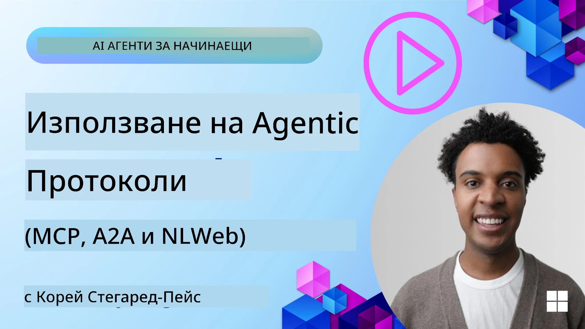
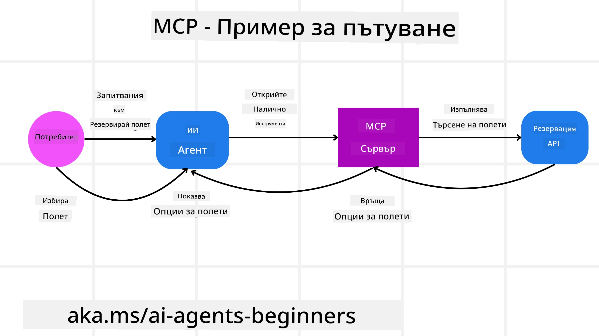
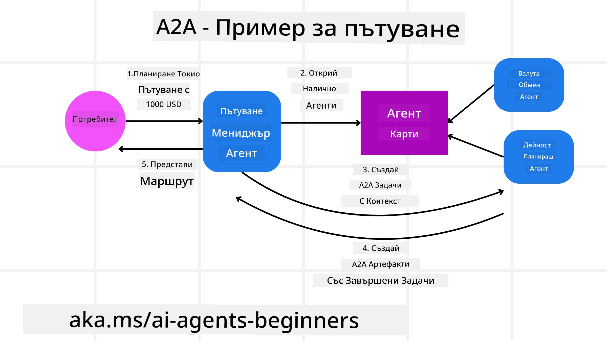
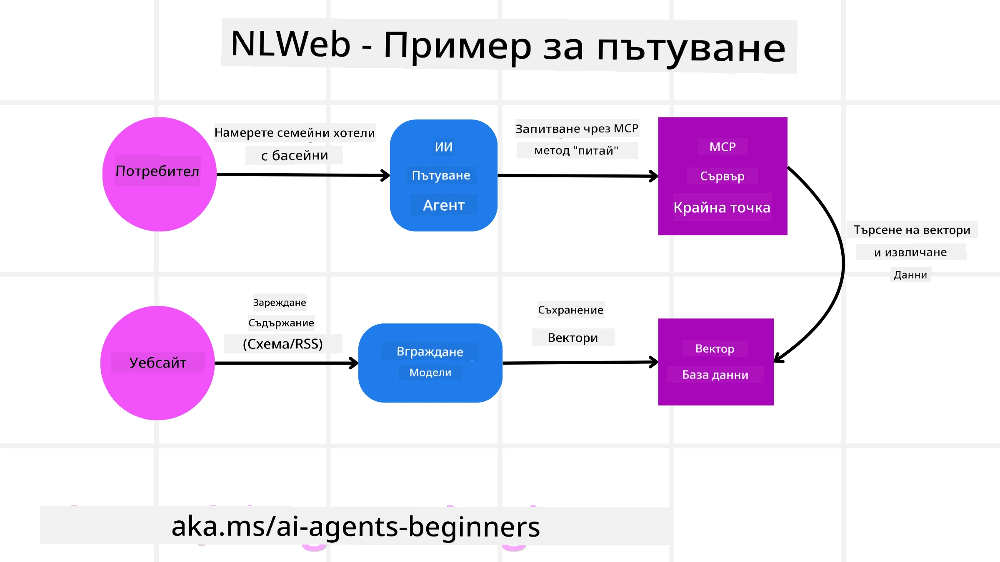

# Използване на агентни протоколи (MCP, A2A и NLWeb)

> _(Кликнете върху изображението по-горе, за да гледате видео на този урок)_

С нарастването на използването на AI агенти се увеличава и нуждата от протоколи, които осигуряват стандартизация, сигурност и подкрепят отворената иновация. В този урок ще разгледаме 3 протокола, които се стремят да отговорят на тази нужда - Model Context Protocol (MCP), Agent to Agent (A2A) и Natural Language Web (NLWeb).

## Въведение

В този урок ще разгледаме:

• Как **MCP** позволява на AI агенти да имат достъп до външни инструменти и данни за изпълнение на задачи на потребителя.

• Как **A2A** улеснява комуникацията и сътрудничеството между различни AI агенти.

• Как **NLWeb** превръща естествения език в интерфейс за всеки уебсайт, позволявайки на AI агентите да откриват и взаимодействат със съдържанието.

## Цели на обучението

• **Идентифициране** на основната цел и предимствата на MCP, A2A и NLWeb в контекста на AI агентите.

• **Обяснение** как всеки протокол улеснява комуникацията и взаимодействието между LLM, инструменти и други агенти.

• **Разпознаване** на различните роли, които всеки протокол играе при изграждането на сложни агентни системи.

## Model Context Protocol

**Model Context Protocol (MCP)** е отворен стандарт, който предоставя стандартизиран начин приложенията да осигуряват контекст и инструменти на LLM. Това позволява „универсален адаптер“ към различни източници на данни и инструменти, към които AI агентите могат да се свързват по последователен начин.

Нека разгледаме компонентите на MCP, предимствата спрямо директното използване на API и пример за това как AI агенти биха използвали MCP сървър.

### Основни компоненти на MCP

MCP работи на **клиент-сървър архитектура** и основните компоненти са:

• **Хостове** са LLM приложения (например редактор на код като VSCode), които стартират връзките със MCP сървър.

• **Клиенти** са компоненти в хост приложението, които поддържат връзки едно към едно със сървъри.

• **Сървъри** са леки програми, които предоставят определени възможности.

В протокола са включени три основни примитива, които са способностите на MCP сървър:

• **Инструменти**: Това са отделни действия или функции, които AI агентът може да извика, за да изпълни действие. Например, метеорологична услуга може да предостави инструмент „получаване на прогноза за времето“, или e-commerce сървър може да предостави инструмент „закупуване на продукт“. MCP сървърите рекламират името на всеки инструмент, описание и схема за вход/изход в своя списък с възможности.

• **Ресурси**: Това са документи или данни само за четене, които MCP сървър може да предостави, а клиентите могат да ги извличат при поискване. Примери са съдържание на файлове, записи в база данни или лог файлове. Ресурсите могат да бъдат текстови (като код или JSON) или двоични (като изображения или PDF).

• **Подканки**: Това са предварително дефинирани шаблони, които предлагат препоръчани подканки, позволяващи по-сложни работни потоци.

### Предимства на MCP

MCP предлага значителни предимства за AI агенти:

• **Динамично откриване на инструменти**: Агентите могат динамично да получават списък с налични инструменти от сървър с описания какво правят. Това контрастира с традиционните API, които често изискват статично кодиране за интеграции, като всяка промяна в API налага актуализиране на кода. MCP предлага подход „интегрирай веднъж“, водещ до по-голяма адаптивност.

• **Взаимодействие между различни LLM**: MCP работи с различни LLM, предоставяйки гъвкавост при смяна на основните модели за подобряване на представянето.

• **Стандартизирана сигурност**: MCP включва стандартен метод за автентикация, подобрявайки мащабируемостта при добавяне на достъп до допълнителни MCP сървъри. Това е по-просто в сравнение с управлението на различни ключове и типове автентикация за разнообразни традиционни API.

### Пример за MCP

Представете си потребител, който иска да резервира полет чрез AI асистент, захранван с MCP.

1. **Връзка**: AI асистентът (MCP клиент) се свързва с MCP сървър, предоставен от авиокомпания.

2. **Откриване на инструменти**: Клиентът пита MCP сървъра на авиокомпанията: „Какви инструменти предлагате?“ Сървърът отговаря с инструменти като „търсене на полети“ и „резервиране на полети“.

3. **Извикване на инструмент**: След това питате AI асистента: „Моля, намери полет от Портланд до Хонолулу.“ AI асистентът, използвайки своя LLM, разбира, че трябва да извика инструмента „търсене на полети“ и предава релевантните параметри (откъдето, където) на MCP сървъра.

4. **Изпълнение и отговор**: MCP сървърът, действащ като обвивка, прави действителното повикване към вътрешния API за резервации на авиокомпанията. След това получава информацията за полета (например JSON данни) и я изпраща обратно на AI асистента.

5. **По-нататъшно взаимодействие**: AI асистентът показва опциите за полети. След като изберете полет, асистентът може да извика инструмента „резервиране на полет“ на същия MCP сървър и да завърши резервацията.

## Протокол Агент към Агент (A2A)

Докато MCP се фокусира върху свързването на LLM с инструменти, **Протоколът Агент към Агент (A2A)** прави следващата крачка като позволява комуникация и сътрудничество между различни AI агенти. A2A свързва AI агенти от различни организации, среди и технологични стекове, за да изпълнят обща задача.

Ще разгледаме компонентите и предимствата на A2A, както и пример за прилагането му в нашето туристическо приложение.

### Основни компоненти на A2A

A2A се фокусира върху осигуряването на комуникация между агенти и тяхното съвместно изпълнение на подзадачи на потребителя. Всеки компонент на протокола допринася за това:

#### Карта на агента

Подобно на това как MCP сървър споделя списък с инструменти, Карта на агента съдържа:
- Името на агента.
- **описание на общите задачи**, които изпълнява.
- **списък с конкретни умения** с описания, които помагат на другите агенти (или дори на хора) да разберат кога и защо биха искали да извикат именно този агент.
- **текущия URL адрес на крайна точка** на агента.
- **версията** и **възможностите** на агента като поточно предаване на отговори и push известия.

#### Изпълнител на агента

Изпълнителят на агента е отговорен за **предаването на контекста на потребителския чат към отдалечения агент**, който се нуждае от него, за да разбере каква задача трябва да изпълни. В A2A сървър агентът използва собствен LLM, за да обработи входящите заявки и изпълни задачи с помощта на вътрешните си инструменти.

#### Артефакт

След като отдалеченият агент завърши поисканата задача, неговият работен продукт се създава като артефакт. Артефактът **съдържа резултата от работата на агента**, **описание на извършеното** и **текстовия контекст**, предаден по протокола. След изпращането на артефакта връзката с отдалечения агент се затваря до следващото му използване.

#### Опашка за събития

Този компонент се използва за **обработка на актуализации и предаване на съобщения**. Той е особено важен в производствена среда за агентни системи, за да се предотврати прекъсване на връзката между агенти преди завършване на задача, особено когато изпълнението ѝ може да отнеме по-дълго време.

### Предимства на A2A

• **Подобрено сътрудничество**: Позволява на агенти от различни доставчици и платформи да взаимодействат, споделят контекст и работят заедно, улеснявайки безпроблемната автоматизация между традиционно разединени системи.

• **Гъвкав избор на модел**: Всеки A2A агент може да реши кой LLM използва, за да обслужва заявките си, позволявайки оптимизирани или фино настроени модели на агентно ниво, за разлика от единичната LLM връзка в някои MCP сценарии.

• **Вградена автентикация**: Автентикацията е интегрирана директно в A2A протокола, осигурявайки стабилна рамка за сигурност при взаимодействията между агенти.

### Пример за A2A

Нека разширим нашия сценарий за резервация на пътуване, този път с използване на A2A.

1. **Потребителска заявка към мултиагент**: Потребителят взаимодейства с A2A агент „Туристически агент“, например с думите: „Моля, резервирай цялото пътуване до Хонолулу за следващата седмица, включително полети, хотел и наем на кола“.

2. **Оркестрация от Туристическия агент**: Туристическият агент получава тази сложна заявка. Той използва своя LLM, за да разсъждава върху задачата и да определи, че трябва да взаимодейства с други специализирани агенти.

3. **Комуникация между агенти**: Туристическият агент използва A2A протокола, за да се свърже с други агенти на по-ниско ниво, например „Авиокомпания агент“, „Хотел агент“ и „Агент за наем на коли“, създадени от различни компании.

4. **Делегирано изпълнение на задачи**: Туристическият агент изпраща конкретни задачи на тези специализирани агенти (например „Намери полети до Хонолулу“, „Резервирай хотел“, „Наеми кола“). Всеки от тези агенти с техните собствени LLM и използвайки собствените си инструменти (които също могат да бъдат MCP сървъри), изпълнява своята конкретна част от резервацията.

5. **Консолидиран отговор**: След като всички агенти завършат своите задачи, Туристическият агент събира резултатите (детайли за полети, потвърждение за хотел, резервация на кола) и изпраща цялостен чат-стил отговор обратно на потребителя.

## Natural Language Web (NLWeb)

Уебсайтовете отдавна са основният начин за потребителите да получават информация и данни в интернет.

Нека разгледаме различните компоненти на NLWeb, предимствата на NLWeb и пример за работа на NLWeb в нашето туристическо приложение.

### Компоненти на NLWeb

- **NLWeb приложение (ядрен код на услугата)**: Системата, която обработва въпроси на естествен език. Тя свързва различните части от платформата за създаване на отговори. Може да се разглежда като **двигателят, който захранва функциите за естествен език** на уебсайт.

- **Протокол NLWeb**: Това е **основен набор от правила за взаимодействие на естествен език** с уебсайт. Изпраща отговори във формат JSON (често използвайки Schema.org). Целта е да се създаде проста основа за „AI Уеб“, както HTML позволи споделянето на документи онлайн.

- **MCP сървър (крайна точка на Model Context Protocol)**: Всяка NLWeb настройка също действа като **MCP сървър**. Това означава, че може **да споделя инструменти (като метод „ask“) и данни** с други AI системи. На практика това прави съдържанието и възможностите на уебсайта използваеми от AI агенти, позволявайки на сайта да стане част от по-широката „агентна екосистема“.

- **Ембединг модели**: Тези модели се използват за **преобразуване на съдържанието на уебсайта в числови представяния, наречени вектори** (ембединг). Тези вектори улавят смисъла по начин, който компютрите могат да сравняват и търсят. Те се съхраняват в специална база данни и потребителите могат да избират кой ембединг модел да използват.

- **Векторна база данни (механизъм за извличане)**: Тази база данни **съхранява ембедингите на съдържанието на уебсайта**. Когато някой зададе въпрос, NLWeb проверява векторната база за най-релевантната информация. Тя предлага бърз списък с възможни отговори, подредени по сходство. NLWeb работи с различни системи за съхранение на вектори като Qdrant, Snowflake, Milvus, Azure AI Search и Elasticsearch.

### NLWeb по пример

Отново разгледайте нашия туристически уебсайт за резервации, но този път захранван от NLWeb.

1. **Въвеждане на данни**: Съществуващите каталози с продукти на туристическия сайт (например списъци с полети, описания на хотели, туристически пакети) се форматират с Schema.org или се зареждат чрез RSS емисии. Инструментите на NLWeb въвеждат тези структурирани данни, създават ембединг и ги съхраняват в локална или отдалечена векторна база данни.

2. **Запитване на естествен език (човек)**: Потребителят посещава уебсайта и вместо да навигира в менюта, въвежда в чат интерфейс: „Намери ми хотел, подходящ за семейства, в Хонолулу с басейн за следващата седмица“.

3. **Обработка от NLWeb**: NLWeb приложението получава запитването. Изпраща въпроса към LLM за разбиране и едновременно търси в своята векторна база данни релевантни обяви за хотели.

4. **Точни резултати**: LLM помага да се интерпретират резултатите от търсенето, да се идентифицират най-добрите съвпадения според критериите „подходящ за семейства“, „басейн“ и „Хонолулу“, след което форматира отговор на естествен език. Важно е, че отговорът се отнася до реални хотели от каталога, без измислена информация.

5. **Взаимодействие с AI агент**: Тъй като NLWeb действа като MCP сървър, външен AI туристически агент може също да се свърже с тази NLWeb инстанция на сайта. След това AI агентът може да използва метода `ask` на MCP, за да пита директно сайта: `ask("Има ли препоръчани веган ресторанти в района на Хонолулу от хотела?")`. NLWeb ще обработи това, използвайки своята база данни с ресторанти (ако е заредена), и ще върне структуриран JSON отговор.

### Имате ли още въпроси за MCP/A2A/NLWeb?

Присъединете се към [Microsoft Foundry Discord](https://discord.com/invite/ATgtXmAS5D), за да се срещнете с други ученици, да участвате в офис часове и да получите отговори на въпросите си за AI агенти.

## Ресурси

- [MCP за начинаещи](https://aka.ms/mcp-for-beginners)  
- [Документация за MCP](https://learn.microsoft.com/python/api/overview/azure/ai-projects-readme)
- [NLWeb Репо](https://github.com/nlweb-ai/NLWeb)
- [Microsoft агентна рамка](https://aka.ms/ai-agents-beginners/agent-framework)

---

<!-- CO-OP TRANSLATOR DISCLAIMER START -->
**Отказ от отговорност**:
Този документ е преведен с помощта на AI преводачески услуга [Co-op Translator](https://github.com/Azure/co-op-translator). Въпреки че се стремим към точност, моля имайте предвид, че автоматизираните преводи могат да съдържат грешки или неточности. Оригиналният документ на неговия роден език трябва да се счита за авторитетен източник. За критична информация се препоръчва професионален човешки превод. Ние не носим отговорност за каквито и да е недоразумения или неправилни тълкувания, произтичащи от използването на този превод.
<!-- CO-OP TRANSLATOR DISCLAIMER END -->