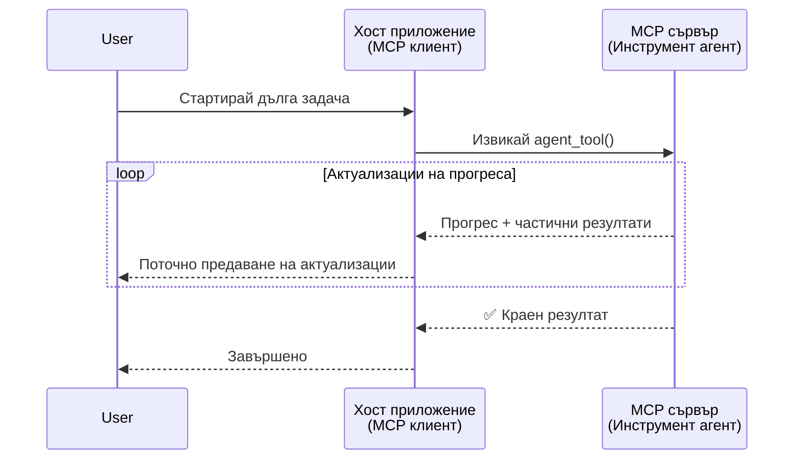
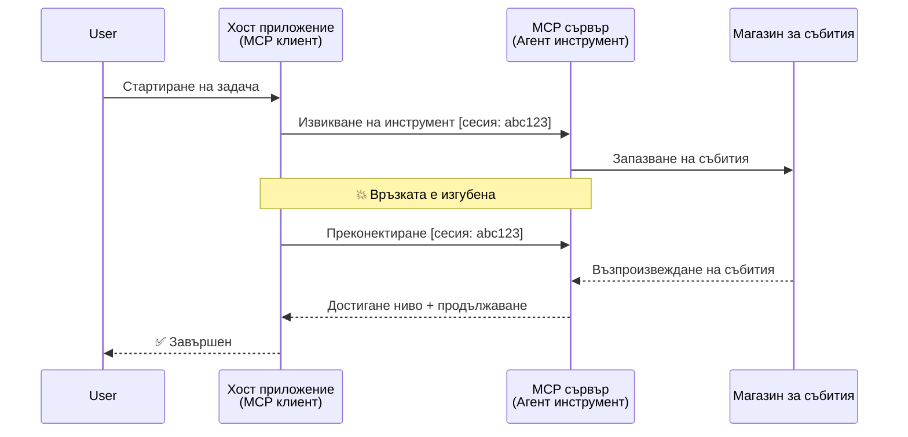
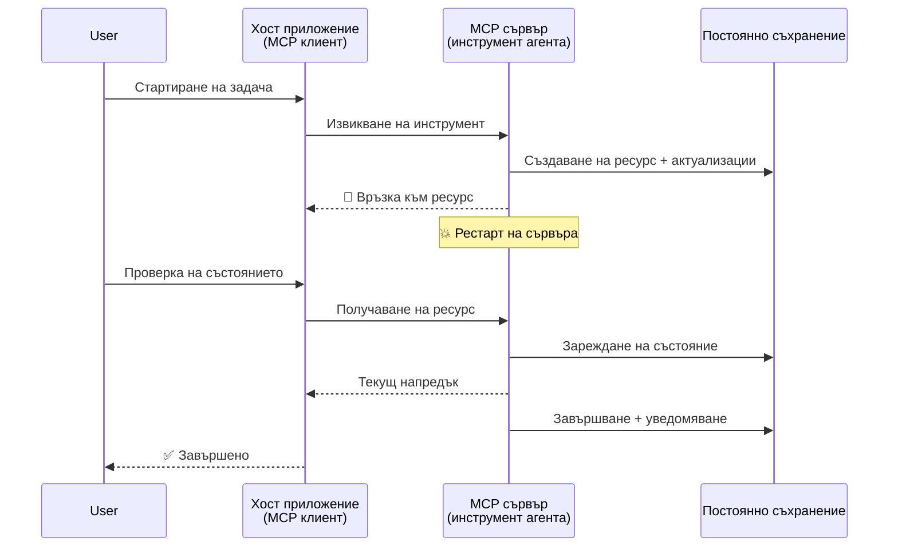
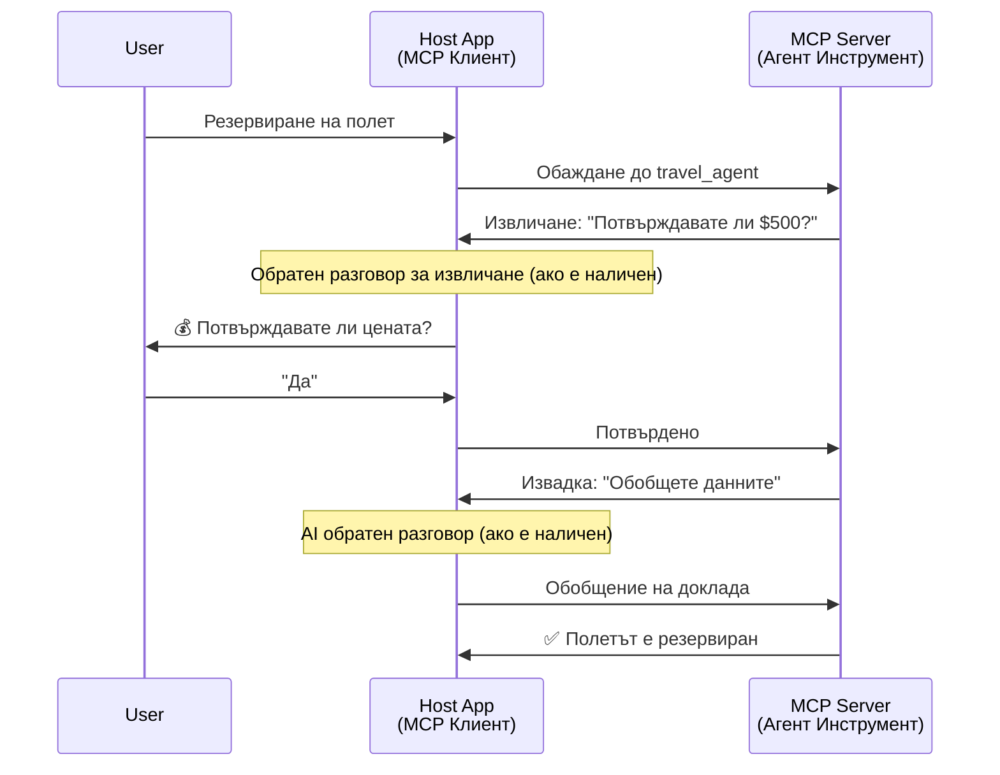
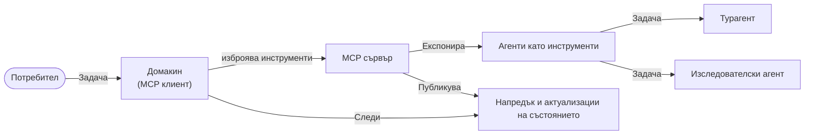

# Изграждане на системи за комуникация агент-срещу-агент с MCP

> В резюме - Можете ли да изградите комуникация агент2агент върху MCP? Да!

MCP се разви значително отвъд първоначалната си цел „да предоставя контекст на LLM“. С последните подобрения, включително [възобновяеми потоци](https://modelcontextprotocol.io/docs/concepts/transports#resumability-and-redelivery), [елицитация](https://modelcontextprotocol.io/specification/2025-06-18/client/elicitation), [семплиране](https://modelcontextprotocol.io/specification/2025-06-18/client/sampling) и известия ([прогрес](https://modelcontextprotocol.io/specification/2025-06-18/basic/utilities/progress) и [ресурси](https://modelcontextprotocol.io/specification/2025-06-18/schema#resourceupdatednotification)), MCP сега предоставя здрава основа за изграждане на сложни системи за комуникация агент-срещу-агент.

## Заблуда относно агентите/инструментите

С разрастването на инструментите с агентно поведение (работят продължително време, може да изискват допълнителен вход по средата на изпълнение и др.), честа заблуда е, че MCP не е подходящ, главно защото ранните му примери за инструменти се съсредоточаваха върху прости модели заявка-отговор.

Този възглед е остарял. Спецификацията на MCP беше значително разширена през последните няколко месеца с възможности, които запълват пропуските за изграждане на дълго изпълняващи се агентни поведения:

- **Поточна обработка и частични резултати**: Актуализации на прогреса в реално време по време на изпълнение
- **Възобновяемост**: Клиенти могат да се свързват отново и да продължават след прекъсване
- **Издръжливост**: Резултатите се съхраняват при рестартиране на сървъра (напр. чрез връзки към ресурси)
- **Многоходови взаимодействия**: Интерактивен вход по средата на изпълнение чрез елицитация и семплиране

Тези функции могат да се комбинират за създаване на сложни агентни и многоагентни приложения, всички работещи върху протокола MCP.

За справка, ще наричаме агент „инструмент“, наличен на MCP сървър. Това предполага съществуването на хост приложение, което имплементира MCP клиент, установяващ сесия със сървъра и който може да извиква агента.

## Какво прави един MCP инструмент „агентен“?

Преди да се потопим в реализацията, нека установим какви инфраструктурни възможности са необходими за поддръжка на дълго изпълняващи се агенти.

> Ще определим агент като обект, който може автономно да работи продължителни периоди, способен да се справя със сложни задачи, изискващи множество взаимодействия или корекции на базата на обратна връзка в реално време.

### 1. Поточно предаване и частични резултати

Традиционните модели заявка-отговор не са приложими за дълги задачи. Агентите трябва да предоставят:

- Актуализации на прогреса в реално време
- Междинни резултати

**Поддръжка в MCP**: Известия за актуализация на ресурси позволяват поточно изпращане на частични резултати, макар че трябва да се проектира внимателно, за да не се наруши моделът 1:1 заявка/отговор на JSON-RPC.

| Функция                   | Пример на използване                                                                                                                                                         | Поддръжка в MCP                                                                        |
| ------------------------- | ----------------------------------------------------------------------------------------------------------------------------------------------------------------------------- | -------------------------------------------------------------------------------------- |
| Актуализации в реално време | Потребител иска задача за миграция на кодова база. Агентът излъчва прогреса: "10% - Анализ на зависимости... 25% - Конвертиране на TypeScript файлове... 50% - Актуализиране на импорти..." | ✅ Известия за прогрес                                                                  |
| Частични резултати         | Задача „Генериране на книга“ предава частични резултати, напр. 1) Контур на сюжетната линия, 2) Списък с глави, 3) Всяка глава след завършване. Хоста може да преглежда, отменя или преориентира в някой етап. | ✅ Известия могат да бъдат „разширени“ за частични резултати, виж предложения в PR 383, 776 |

<div align="center" style="font-style: italic; font-size: 0.95em; margin-bottom: 0.5em;">
<strong>Фигура 1:</strong> Тази диаграма илюстрира как MCP агент предава поточно актуализации на прогреса и частични резултати в реално време към хост приложението по време на дълга задача, позволявайки на потребителя да следи изпълнението в реално време.
</div>



### 2. Възобновяемост

Агентите трябва да се справят с прекъсвания на мрежата безпроблемно:

- Пресвързване след прекъсване на (клиент)
- Продължаване от мястото, на което са прекъснали (повторна доставка на съобщения)

**Поддръжка в MCP**: Транспортът MCP StreamableHTTP днес поддържа възобновяване на сесии и повторна доставка на съобщения с идентификатори на сесии и последни събития. Важна забележка е, че сървърът трябва да имплементира EventStore, който позволява възпроизвеждане на събития при пресвързване на клиента.  
Обърнете внимание, че съществува общностно предложение (PR #975), което разглежда транспортно-независими възобновяеми потоци.

| Функция    | Пример на използване                                                                                                                                                    | Поддръжка в MCP                                                         |
| ---------- | --------------------------------------------------------------------------------------------------------------------------------------------------------------------- | --------------------------------------------------------------------- |
| Възобновяемост | Клиент се разединява по време на дълга задача. При ново свързване, сесията се възобновява с повторно възпроизвеждане на пропуснати събития, продължавайки безпроблемно от мястото на прекъсване. | ✅ Транспорт StreamableHTTP с идентификатори на сесии, възпроизвеждане на събития и EventStore |

<div align="center" style="font-style: italic; font-size: 0.95em; margin-bottom: 0.5em;">
<strong>Фигура 2:</strong> Тази диаграма показва как транспортът StreamableHTTP на MCP и хранилището за събития позволяват безпроблемно възобновяване на сесия: ако клиентът се разедини, може да се свърже отново и да възпроизведе пропуснати събития, продължавайки задачата без загуба на прогрес.
</div>



### 3. Издръжливост

Дълго изпълняващите се агенти се нуждаят от устойчив статус:

- Резултати оцеляващи през рестартиране на сървъра
- Статусът може да се получава отделно
- Проследяване на прогрес през сесии

**Поддръжка в MCP**: MCP вече поддържа тип връщане на Ресурсна връзка за извиквания на инструменти. Днес възможният модел е инструментът да създаде ресурс и веднага да върне връзка към него. Инструментът може да продължи да работи по задачата на заден план и да актуализира ресурса. Клиентът може да избира да проверява състоянието на този ресурс, за да получава частични или окончателни резултати (въз основа на актуализациите на ресурси, които сървърът предоставя) или да се абонира за ресурс за получаване на известия за актуализации.

Едно ограничение тук е, че постоянното питане на ресурси или абонирането за актуализации може да консумира ресурси с последствия в голям мащаб. Съществува открыто общностно предложение (включително #992), разглеждащо възможността за добавяне на уебкукове или задействания, които сървърът може да извиква за известяване на клиента/хост приложението за актуализации.

| Функция  | Пример на използване                                                                                                                        | Поддръжка в MCP                                                    |
| -------- | ----------------------------------------------------------------------------------------------------------------------------------------- | ------------------------------------------------------------------ |
| Издръжливост | Сървърът пада по време на задача за миграция на данни. Резултатите и прогресът оцелява след рестарт, клиентът може да провери статус и да продължи от устойчив ресурс. | ✅ Ресурсни връзки с устойчиво съхранение и известия за статус   |

Днес често срещан модел е инструментът да създаде ресурс и веднага да върне връзка към него. Инструментът може в заден план да се справя със задачата, да издава известия за ресурса, служащи като актуализации за прогрес или включващи частични резултати, и да актуализира съдържанието на ресурса при необходимост.

<div align="center" style="font-style: italic; font-size: 0.95em; margin-bottom: 0.5em;">
<strong>Фигура 3:</strong> Тази диаграма показва как MCP агентите използват устойчиви ресурси и известия за статус, за да гарантират, че дълго изпълняващите се задачи оцеляват през рестартиранията на сървъра, позволявайки на клиентите да проверяват прогреса и да извличат резултати дори след грешки.
</div>



### 4. Многоходови взаимодействия

Агентите често се нуждаят от допълнителен вход по средата на изпълнението:

- Човешко изяснение или одобрение
- Помощ от AI за сложни решения
- Динамично настройване на параметри

**Поддръжка в MCP**: Пълно поддържане чрез семплиране (за AI вход) и елицитация (за човешки вход).

| Функция               | Пример на използване                                                                                                                                       | Поддръжка в MCP                                         |
| --------------------- | ---------------------------------------------------------------------------------------------------------------------------------------------------------- | ------------------------------------------------------- |
| Многоходови взаимодействия | Агент за резервация на пътувания иска потвърждение на цена от потребителя, след това иска от AI да обобщи данни за пътуване преди финализиране на резервацията. | ✅ Елицитация за човешки вход, семплиране за AI вход    |

<div align="center" style="font-style: italic; font-size: 0.95em; margin-bottom: 0.5em;">
<strong>Фигура 4:</strong> Тази диаграма представя как MCP агентите могат интерактивно да искат човешки вход или AI помощ по средата на изпълнение, поддържайки сложни многоходови работни процеси като потвърждения и динамично вземане на решения.
</div>



## Реализиране на дълго изпълняващи се агенти върху MCP - преглед на кода

Като част от тази статия предоставяме [кодово хранилище](https://github.com/victordibia/ai-tutorials/tree/main/MCP%20Agents), съдържащо пълна реализация на дълго изпълняващи се агенти чрез MCP Python SDK с транспорт StreamableHTTP за възобновяване на сесии и повторна доставка на съобщения. Реализацията показва как възможностите на MCP могат да се комбинират за осигуряване на сложни агентни поведения.

По-конкретно, реализираме сървър с два основни агентни инструмента:

- **Агент за пътувания** - Симулира услуга за резервация с потвърждение на цена чрез елицитация
- **Агент за изследвания** - Извършва изследователски задачи с AI-подпомагани обобщения чрез семплиране

И двата агента демонстрират актуализации на прогреса в реално време, интерактивни потвърждения и пълно възобновяване на сесии.

### Ключови концепции за реализация

Следващите секции показват агентна реализация на сървърната страна и хендлинга от хост приложението като клиент за всяка възможност:

#### Поточно предаване и актуализации на прогреса - статус на задачата в реално време

Поточното предаване позволява на агентите да предоставят актуализации на прогреса в реално време по време на дълги задачи, информирайки потребителите за статуса и междинните резултати.

**Реализация на сървъра (агент изпраща известия за прогрес):**

```python
# От server/server.py - Туристически агент, изпращащ актуализации за напредъка
for i, step in enumerate(steps):
    await ctx.session.send_progress_notification(
        progress_token=ctx.request_id,
        progress=i * 25,
        total=100,
        message=step,
        related_request_id=str(ctx.request_id)
    )
    await anyio.sleep(2)  # Симулиране на работа

# Алтернатива: Логване на съобщения за подробно стъпка по стъпка обновяване
await ctx.session.send_log_message(
    level="info",
    data=f"Processing step {current_step}/{steps} ({progress_percent}%)",
    logger="long_running_agent",
    related_request_id=ctx.request_id,
)
```

**Реализация на клиента (хост получава актуализации за прогрес):**

```python
# От client/client.py - Клиент, обработващ известия в реално време
async def message_handler(message) -> None:
    if isinstance(message, types.ServerNotification):
        if isinstance(message.root, types.LoggingMessageNotification):
            console.print(f"📡 [dim]{message.root.params.data}[/dim]")
        elif isinstance(message.root, types.ProgressNotification):
            progress = message.root.params
            console.print(f"🔄 [yellow]{progress.message} ({progress.progress}/{progress.total})[/yellow]")

# Регистрирайте обработчик на съобщения при създаване на сесия
async with ClientSession(
    read_stream, write_stream,
    message_handler=message_handler
) as session:
```

#### Елицитация - Искане на вход от потребителя

Елицитацията позволява на агентите да искат вход от потребителя по средата на изпълнението. Това е ключово за потвърждения, уточнения или одобрения в дълги задачи.

**Реализация на сървъра (агент иска потвърждение):**

```python
# От server/server.py - Туристически агент иска потвърждение на цена
elicit_result = await ctx.session.elicit(
    message=f"Please confirm the estimated price of $1200 for your trip to {destination}",
    requestedSchema=PriceConfirmationSchema.model_json_schema(),
    related_request_id=ctx.request_id,
)

if elicit_result and elicit_result.action == "accept":
    # Продължете с резервацията
    logger.info(f"User confirmed price: {elicit_result.content}")
elif elicit_result and elicit_result.action == "decline":
    # Откажете резервацията
    booking_cancelled = True
```

**Реализация на клиента (хост предоставя обратна връзка за елицитация):**

```python
# От client/client.py - Обработка на клиентски заявки за извличане
async def elicitation_callback(context, params):
    console.print(f"💬 Server is asking for confirmation:")
    console.print(f"   {params.message}")

    response = console.input("Do you accept? (y/n): ").strip().lower()

    if response in ['y', 'yes']:
        return types.ElicitResult(
            action="accept",
            content={"confirm": True, "notes": "Confirmed by user"}
        )
    else:
        return types.ElicitResult(
            action="decline",
            content={"confirm": False, "notes": "Declined by user"}
        )

# Регистрирайте обратното повикване при създаване на сесия
async with ClientSession(
    read_stream, write_stream,
    elicitation_callback=elicitation_callback
) as session:
```

#### Семплиране - Искане на AI помощ

Семплирането позволява агентите да искат помощ от LLM за сложни решения или генериране на съдържание по време на изпълнението. Това позволява хибридни човеко-AI работни процеси.

**Реализация на сървъра (агент иска AI помощ):**

```python
# От server/server.py - Агент за изследване, който иска AI обобщение
sampling_result = await ctx.session.create_message(
    messages=[
        SamplingMessage(
            role="user",
            content=TextContent(type="text", text=f"Please summarize the key findings for research on: {topic}")
        )
    ],
    max_tokens=100,
    related_request_id=ctx.request_id,
)

if sampling_result and sampling_result.content:
    if sampling_result.content.type == "text":
        sampling_summary = sampling_result.content.text
        logger.info(f"Received sampling summary: {sampling_summary}")
```

**Реализация на клиента (хост предоставя обратна връзка за семплиране):**

```python
# От client/client.py - Клиентска обработка на заявки за семплиране
async def sampling_callback(context, params):
    message_text = params.messages[0].content.text if params.messages else 'No message'
    console.print(f"🧠 Server requested sampling: {message_text}")

    # В реално приложение това може да извика API на LLM
    # За демонстрационни цели предоставяме макетен отговор
    mock_response = "Based on current research, MCP has evolved significantly..."

    return types.CreateMessageResult(
        role="assistant",
        content=types.TextContent(type="text", text=mock_response),
        model="interactive-client",
        stopReason="endTurn"
    )

# Регистрирайте обратното извикване при създаване на сесия
async with ClientSession(
    read_stream, write_stream,
    sampling_callback=sampling_callback,
    elicitation_callback=elicitation_callback
) as session:
```

#### Възобновяемост - Непрекъснатост на сесията при прекъсвания

Възобновяемостта гарантира, че дългите задачи на агента оцелява при разединения на клиента и продължават безпроблемно при ново свързване. Това се осъществява чрез хранилища на събития и токени за възобновяване.

**Реализация на хранилището за събития (сървър държи състоянието на сесията):**

```python
# От server/event_store.py - Прост съхранител на събития в паметта
class SimpleEventStore(EventStore):
    def __init__(self):
        self._events: list[tuple[StreamId, EventId, JSONRPCMessage]] = []
        self._event_id_counter = 0

    async def store_event(self, stream_id: StreamId, message: JSONRPCMessage) -> EventId:
        """Store an event and return its ID."""
        self._event_id_counter += 1
        event_id = str(self._event_id_counter)
        self._events.append((stream_id, event_id, message))
        return event_id

    async def replay_events_after(self, last_event_id: EventId, send_callback: EventCallback) -> StreamId | None:
        """Replay events after the specified ID for resumption."""
        # Намери събития след последното известно събитие и ги възпроизведи
        for _, event_id, message in self._events[start_index:]:
            await send_callback(EventMessage(message, event_id))

# От server/server.py - Предаване на съхранител на събития към мениджъра на сесии
def create_server_app(event_store: Optional[EventStore] = None) -> Starlette:
    server = ResumableServer()

    # Създай мениджър на сесии със съхранител на събития за възобновяване
    session_manager = StreamableHTTPSessionManager(
        app=server,
        event_store=event_store,  # Съхранителят на събития позволява възобновяване на сесията
        json_response=False,
        security_settings=security_settings,
    )

    return Starlette(routes=[Mount("/mcp", app=session_manager.handle_request)])

# Използване: Инициализиране със съхранител на събития
event_store = SimpleEventStore()
app = create_server_app(event_store)
```

**Метаданни на клиента с токен за възобновяване (клиент се свързва отново с използване на запазено състояние):**

```python
# От client/client.py - Възобновяване на клиента с метаданни
if existing_tokens and existing_tokens.get("resumption_token"):
    # Използвайте съществуващ токен за възобновяване, за да продължите оттам, където спряхме
    metadata = ClientMessageMetadata(
        resumption_token=existing_tokens["resumption_token"],
    )
else:
    # Създайте callback, за да запазите токена за възобновяване при получаване
    def enhanced_callback(token: str):
        protocol_version = getattr(session, 'protocol_version', None)
        token_manager.save_tokens(session_id, token, protocol_version, command, args)

    metadata = ClientMessageMetadata(
        on_resumption_token_update=enhanced_callback,
    )

# Изпратете заявка с метаданни за възобновяване
result = await session.send_request(
    types.ClientRequest(
        types.CallToolRequest(
            method="tools/call",
            params=types.CallToolRequestParams(name=command, arguments=args)
        )
    ),
    types.CallToolResult,
    metadata=metadata,
)
```

Хост приложението поддържа локално идентификатори на сесии и токени за възобновяване, което му позволява да се свързва отново със съществуващи сесии без загуба на прогрес или състояние.

### Организация на кода

<div align="center" style="font-style: italic; font-size: 0.95em; margin-bottom: 0.5em;">
<strong>Фигура 5:</strong> Архитектура на система с агенти, базирана на MCP
</div>



**Ключови файлове:**

- **`server/server.py`** - Възобновяем MCP сървър с агенти за пътувания и изследвания, демонстриращи елицитация, семплиране и актуализации на прогреса
- **`client/client.py`** - Интерактивно хост приложение с поддръжка на възобновяване, обработка на обратни извиквания и управление на токени
- **`server/event_store.py`** - Имплементация на хранилище за събития, позволяващо възобновяване на сесия и повторна доставка на съобщения

## Разширяване до многоагентна комуникация върху MCP

Горната реализация може да бъде разширена към многоагентни системи чрез подобряване на интелигентността и обхвата на хост приложението:

- **Интелигентно разделяне на задачите**: Хостът анализира сложни заявки на потребителя и ги разгражда на подтasks за различни специализирани агенти
- **Координация между множество сървъри**: Хостът поддържа връзки с няколко MCP сървъра, всеки предоставящ различни агентни възможности
- **Управление на състоянието на задачи**: Хостът следи прогреса на множество едновременно изпълняващи се агентни задачи, управлява зависимости и последователности
- **Устойчивост и повторни опити**: Хостът управлява повреди, прилага логика за повторни опити и пренасочва задачи при недостъпност на агенти
- **Синтез на резултати**: Хостът комбинира изходите на множество агенти в коherentни окончателни резултати

Хостът се развива от прост клиент в интелигентен оркестратор, координиращ разпределени агентни способности, като запазва същата основа на MCP протокола.

## Заключение

Разширените възможности на MCP - известия за ресурси, елицитация/семплиране, възобновяеми потоци и устойчиви ресурси - позволяват сложни взаимодействия между агенти, като същевременно запазват простотата на протокола.

## Започване

Готови ли сте да изградите своя собствена агент2агент система? Следвайте тези стъпки:

### 1. Стартирайте Демо

```bash
# Стартирайте сървъра с хранилище на събития за възобновяване
python -m server.server --port 8006

# В друг терминал стартирайте интерактивния клиент
python -m client.client --url http://127.0.0.1:8006/mcp
```

**Налични команди в интерактивен режим:**

- `travel_agent` - Резервиране на пътуване с потвърждение на цена чрез елицитация
- `research_agent` - Изследване на теми с AI-подпомагани обобщения чрез семплиране
- `list` - Показване на всички налични инструменти
- `clean-tokens` - Изчистване на токени за възобновяване
- `help` - Показване на подробна помощ за команди
- `quit` - Изход от клиента

### 2. Тествайте възможностите за възобновяване

- Стартиране на дълго изпълняващ се агент (например `travel_agent`)
- Прекъснете клиента по време на изпълнение (Ctrl+C)
- Рестартирайте клиента - той автоматично възобновява където е прекъснал

### 3. Изучавайте и разширявайте

- **Изучавайте примерите**: Разгледайте [mcp-agents](https://github.com/victordibia/ai-tutorials/tree/main/MCP%20Agents)
- **Присъединете се към общността**: Участвайте в MCP дискусии в GitHub
- **Експериментирайте**: Започнете с проста дълга задача и постепенно добавяйте поточно предаване, възобновяемост и многоагентна координация

Това демонстрира как MCP позволява интелигентно агентско поведение, като същевременно запазва простотата на инструментите.

Като цяло спецификацията на MCP протокола се развива бързо; на читателя се препоръчва да преглежда официалния уебсайт за документация за най-новите актуализации - https://modelcontextprotocol.io/introduction

---

<!-- CO-OP TRANSLATOR DISCLAIMER START -->
**Отказ от отговорност**:
Този документ е преведен с помощта на AI преводачески услуга [Co-op Translator](https://github.com/Azure/co-op-translator). Въпреки че се стремим към точност, моля имайте предвид, че автоматизираните преводи могат да съдържат грешки или неточности. Оригиналният документ на неговия роден език трябва да се счита за авторитетен източник. За критична информация се препоръчва професионален човешки превод. Ние не носим отговорност за каквито и да е недоразумения или неправилни тълкувания, произтичащи от използването на този превод.
<!-- CO-OP TRANSLATOR DISCLAIMER END -->