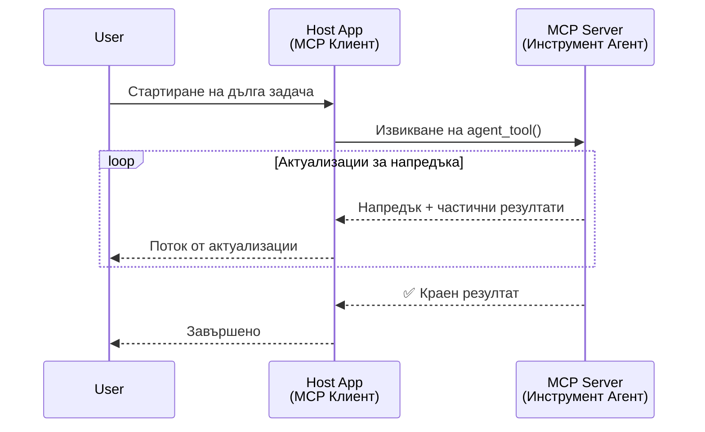
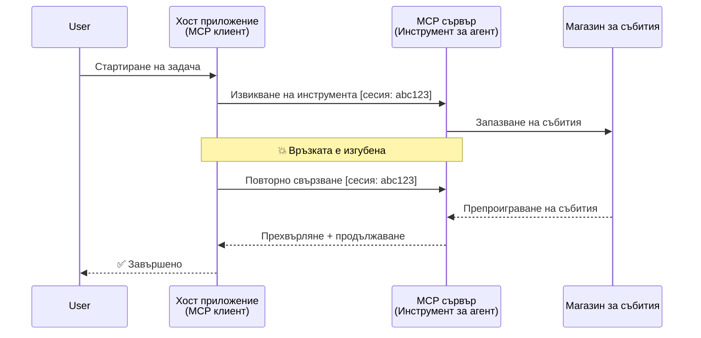
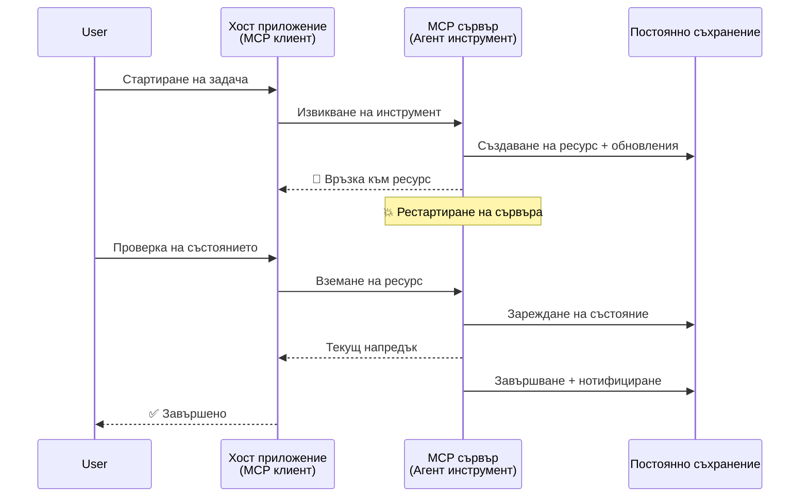
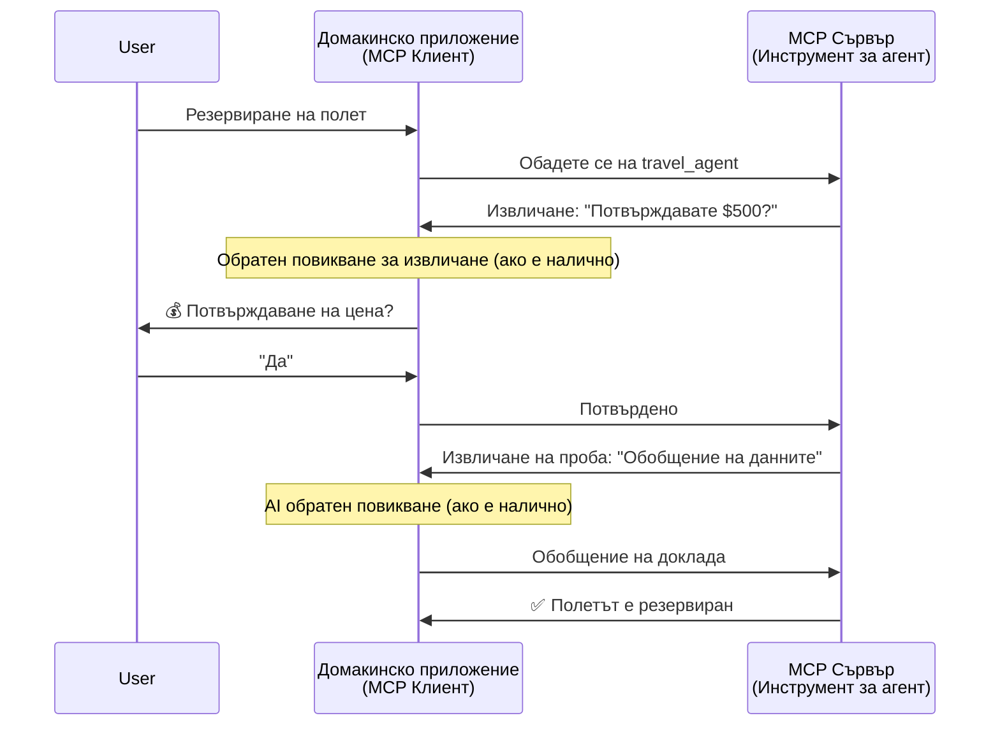

# Изграждане на системи за комуникация между агенти с MCP

> TL;DR - Можете ли да изградите комуникация агент-към-агент върху MCP? Да!

MCP се е развил значително отвъд първоначалната си цел "да предоставя контекст на LLM". С последните подобрения, включително [възобновяеми потоци](https://modelcontextprotocol.io/docs/concepts/transports#resumability-and-redelivery), [елицитация](https://modelcontextprotocol.io/specification/2025-06-18/client/elicitation), [семплиране](https://modelcontextprotocol.io/specification/2025-06-18/client/sampling) и уведомления ([прогрес](https://modelcontextprotocol.io/specification/2025-06-18/basic/utilities/progress) и [ресурси](https://modelcontextprotocol.io/specification/2025-06-18/schema#resourceupdatednotification)), MCP сега предлага стабилна основа за изграждане на сложни системи за комуникация между агенти.

## Грешното разбиране за агент/инструмент

С нарастването на броя от разработчици, които изследват инструменти с агентни поведения (работят продължително време, може да изискват допълнителен вход по време на изпълнение и др.), често срещано погрешно схващане е, че MCP е неподходящ, главно защото ранните примери за негови инструменти са били примитивни и са се фокусирали върху прости модели заявка-отговор.

Това възприятие е остаряло. Спецификацията на MCP беше значително подобрена през последните няколко месеца с възможности, които запълват празнините за изграждане на дългосрочно агентно поведение:

- **Поточно предаване и частични резултати**: Актуализации на прогреса в реално време по време на изпълнение
- **Възобновяемост**: Клиентите могат да се свържат отново и да продължат след прекъсване
- **Издръжливост**: Резултатите оцеляват при рестартиране на сървъра (например чрез връзки към ресурси)
- **Многократни завъртания**: Интерактивен вход по време на изпълнение чрез елицация и семплиране

Тези функции могат да се комбинират, за да позволят изграждането на сложни агентни и многоагентни приложения, всички реализирани върху протокола MCP.

За справка, ще се отнасяме към агент като "инструмент", който е наличен на MCP сървър. Това предполага съществуването на хост приложение, което реализира MCP клиент, който установява сесия със сървъра MCP и може да извиква агента.

## Какво прави един инструмент MCP "агентен"?

Преди да навлезем в реализирането, нека уточним кои инфраструктурни възможности са необходими за поддръжка на дългосрочни агенти.

> Ще дефинираме агент като същност, която може да работи автономно за продължителни периоди, способна да изпълнява сложни задачи, които може да изискват множество взаимодействия или корекции въз основа на обратна връзка в реално време.

### 1. Поточно предаване и частични резултати

Традиционните модели заявка-отговор не работят за дългосрочни задачи. Агенти трябва да предоставят:

- Актуализации на прогреса в реално време
- Промеждутъчни резултати

**Поддръжка в MCP**: Известията за актуализация на ресурс позволяват поточно предаване на частични резултати, макар че това изисква внимателен дизайн, за да не се наруши модела 1:1 заявка/отговор на JSON-RPC.

| Функция                   | Сценарий на използване                                                                                                                                | Поддръжка в MCP                                                                           |
| -------------------------- | ----------------------------------------------------------------------------------------------------------------------------------------------------- | ----------------------------------------------------------------------------------------- |
| Актуализации на прогрес в реално време | Потребителят заявява задача за миграция на кодова база. Агентът поточно изпраща прогрес: "10% - Анализ на зависимости... 25% - Преобразуване на TypeScript файлове... 50% - Актуализиране на импорти..." | ✅ Известия за прогрес                                                                    |
| Частични резултати         | Задача "Генерирай книга" поточно изпраща частични резултати, напр. 1) Очертание на сюжетната арка, 2) Списък на глави, 3) Всяка глава при завършване. Хостът може да инспектира, прекрати или пренасочи по всяко време. | ✅ Известията могат да се "разширят" да включват частични резултати, виж предложенията в PR 383, 776 |

<div align="center" style="font-style: italic; font-size: 0.95em; margin-bottom: 0.5em;">
<strong>Фигура 1:</strong> Тази диаграма илюстрира как агентът MCP поточно предава актуализации на реалния прогрес и частични резултати към хост приложението по време на дългосрочна задача, позволявайки на потребителя да следи изпълнението в реално време.
</div>



### 2. Възобновяемост

Агентите трябва да се справят елегантно с прекъсвания в мрежата:

- Повторно свързване след (клиентско) прекъсване
- Продължаване от мястото, където са спрели (повторно доставяне на съобщения)

**Поддръжка в MCP**: Транспортът MCP StreamableHTTP днес поддържа възобновяване на сесия и повторно доставяне на съобщения със сесийни идентификатори и идентификатори на последни събития. Важната забележка е, че сървърът трябва да реализира EventStore, който позволява повторно пускане на събития при повторно свързване на клиента.  
Обърнете внимание, че съществува предложение от общността (PR #975), което разглежда транспортно-независими възобновяеми потоци.

| Функция      | Сценарий на използване                                                                                                                                    | Поддръжка в MCP                                                            |
| ------------ | --------------------------------------------------------------------------------------------------------------------------------------------------------- | -------------------------------------------------------------------------- |
| Възобновяемост | Клиентът прекъсва връзката по време на дългосрочна задача. При повторно свързване сесията се възобновява с повторно пускане на пропуснати събития, продължавайки безпроблемно от мястото на прекъсване. | ✅ Транспорт StreamableHTTP със сесийни идентификатори, повторно пускане на събития и EventStore |

<div align="center" style="font-style: italic; font-size: 0.95em; margin-bottom: 0.5em;">
<strong>Фигура 2:</strong> Тази диаграма показва как транспортът StreamableHTTP на MCP и хранилището за събития позволяват безпроблемно възобновяване на сесията: ако клиентът прекъсне връзката, той може да се свърже отново и да пусне пропуснати събития, продължавайки задачата без загуба на прогрес.
</div>



### 3. Издръжливост

Дългосрочните агенти имат нужда от устойчиво състояние:

- Резултатите оцеляват при рестартиране на сървъра
- Статусът може да бъде извличан извън основния поток
- Проследяване на прогреса през сесии

**Поддръжка в MCP**: MCP вече поддържа тип връщан стойност връзка към ресурс за повиквания на инструменти. Днес възможен модел е да се проектира инструмент, който създава ресурс и веднага връща връзка към ресурс. Инструментът може да продължи да адресира задачата във фонов режим и да актуализира ресурса. Клиентът може да избере да проверява състоянието на този ресурс, за да получи частични или пълни резултати (въз основа на това какви актуализации на ресурса сървърът предоставя) или да се абонира за ресурса за известия при актуализации.

Едно ограничение тук е, че проверката на ресурси или абонаментът за актуализации могат да използват ресурси, което има последствия при мащабиране. Съществува отворено предложение от общността (включително #992), разглеждащо възможността за включване на уебхукове или тригери, които сървърът може да извиква, за да уведоми клиента/хост приложението за актуализации.

| Функция    | Сценарий на използване                                                                                                                                    | Поддръжка в MCP                                                        |
| ---------- | --------------------------------------------------------------------------------------------------------------------------------------------------------- | -------------------------------------------------------------------- |
| Издръжливост | Сървърът се срива по време на задача за миграция на данни. Резултатите и прогресът оцеляват рестартирането, клиентът може да проверява статуса и да продължи от устойчив ресурс. | ✅ Връзки към ресурси с устойчиво съхранение и известия за статус    |

Днес обичаен модел е да се проектира инструмент, който създава ресурс и веднага връща връзка към ресурс. Инструментът може във фонов режим да адресира задачата, да издава известия за ресурси, които служат като актуализации на прогреса или включват частични резултати, и да актуализира съдържанието в ресурса при нужда.

<div align="center" style="font-style: italic; font-size: 0.95em; margin-bottom: 0.5em;">
<strong>Фигура 3:</strong> Тази диаграма показва как агентите MCP използват устойчиви ресурси и известия за статус, за да осигурят оцеляване на дългосрочни задачи при рестартиране на сървъра, позволявайки на клиентите да проверяват прогреса и да извличат резултати дори след сривове.
</div>



### 4. Взаимодействия с многократни завъртания

Агентите често се нуждаят от допълнителен вход по време на изпълнение:

- Човешко изясняване или одобрение
- AI асистенция за сложни решения
- Динамична настройка на параметри

**Поддръжка в MCP**: Пълноценна поддръжка чрез семплиране (за AI вход) и елицация (за човешки вход).

| Функция                 | Сценарий на използване                                                                                                                           | Поддръжка в MCP                                           |
| ----------------------- | ------------------------------------------------------------------------------------------------------------------------------------------------ | --------------------------------------------------------- |
| Взаимодействия с многократни завъртания | Агент за резервации на пътувания иска от потребителя потвърждение на цена, след което пита AI да обобщи данните за пътуването преди да завърши трансакцията. | ✅ Елицация за човешки вход, семплиране за AI вход         |

<div align="center" style="font-style: italic; font-size: 0.95em; margin-bottom: 0.5em;">
<strong>Фигура 4:</strong> Тази диаграма показва как агентите MCP могат интерактивно да искат човешки вход или да заявяват AI асистенция по време на изпълнение, поддържайки сложни, многократни работни потоци като потвърждения и динамично вземане на решения.
</div>



## Реализиране на дългосрочни агенти в MCP – преглед на кода

Като част от тази статия предоставяме [репозитория с код](https://github.com/victordibia/ai-tutorials/tree/main/MCP%20Agents), който съдържа пълна реализация на дългосрочни агенти, използващи MCP Python SDK с транспортът StreamableHTTP за възобновяване на сесии и повторно доставяне на съобщения. Реализацията демонстрира как възможностите на MCP могат да се комбинират, за да се позволят сложни поведения, подобни на агенти.

Конкретно, реализираме сървър с два основни агента-инструмента:

- **Агент за пътуване** - Симулира услуга за резервации на пътувания с потвърждение на цена чрез елицация
- **Агент за изследвания** - Извършва изследователски задачи с AI-подпомагани обобщения чрез семплиране

И двата агента демонстрират актуализации на прогрес в реално време, интерактивни потвърждения и пълна възможност за възобновяване на сесии.

### Основни концепции за реализиране

Следващите секции показват реализиране на агенти от страна на сървъра и обработка от страна на клиента за всяка възможност:

#### Поточно предаване и актуализации на прогреса – статус на задачата в реално време

Поточното предаване позволява на агентите да предоставят актуализации на прогреса в реално време по време на дългосрочни задачи, като държат потребителите информирани за статуса на задачата и промеждутъчните резултати.

**Реализация на сървъра (агент изпраща известия за прогрес):**

```python
# От server/server.py - Туристически агент изпраща актуализации за напредъка
for i, step in enumerate(steps):
    await ctx.session.send_progress_notification(
        progress_token=ctx.request_id,
        progress=i * 25,
        total=100,
        message=step,
        related_request_id=str(ctx.request_id)
    )
    await anyio.sleep(2)  # Симулиране на работа

# Алтернатива: Записване на съобщения за подробни стъпка по стъпка актуализации
await ctx.session.send_log_message(
    level="info",
    data=f"Processing step {current_step}/{steps} ({progress_percent}%)",
    logger="long_running_agent",
    related_request_id=ctx.request_id,
)
```

**Реализация на клиента (хост получава актуализации на прогреса):**

```python
# От client/client.py - Клиент за обработка на известия в реално време
async def message_handler(message) -> None:
    if isinstance(message, types.ServerNotification):
        if isinstance(message.root, types.LoggingMessageNotification):
            console.print(f"📡 [dim]{message.root.params.data}[/dim]")
        elif isinstance(message.root, types.ProgressNotification):
            progress = message.root.params
            console.print(f"🔄 [yellow]{progress.message} ({progress.progress}/{progress.total})[/yellow]")

# Регистриране на обработчик на съобщения при създаване на сесия
async with ClientSession(
    read_stream, write_stream,
    message_handler=message_handler
) as session:
```

#### Елицация – Заявка за потребителски вход

Елицацията позволява на агентите да искат потребителски вход по време на изпълнение. Това е важно за потвърждения, изясняване или одобрения по време на дългосрочни задачи.

**Реализация на сървъра (агент иска потвърждение):**

```python
# От server/server.py - Туристически агент, искащ потвърждение на цена
elicit_result = await ctx.session.elicit(
    message=f"Please confirm the estimated price of $1200 for your trip to {destination}",
    requestedSchema=PriceConfirmationSchema.model_json_schema(),
    related_request_id=ctx.request_id,
)

if elicit_result and elicit_result.action == "accept":
    # Продължете с резервацията
    logger.info(f"User confirmed price: {elicit_result.content}")
elif elicit_result and elicit_result.action == "decline":
    # Откажете резервацията
    booking_cancelled = True
```

**Реализация на клиента (хост предоставя обратна връзка за елицация):**

```python
# От client/client.py - Управление на клиентски заявки за извличане на информация
async def elicitation_callback(context, params):
    console.print(f"💬 Server is asking for confirmation:")
    console.print(f"   {params.message}")

    response = console.input("Do you accept? (y/n): ").strip().lower()

    if response in ['y', 'yes']:
        return types.ElicitResult(
            action="accept",
            content={"confirm": True, "notes": "Confirmed by user"}
        )
    else:
        return types.ElicitResult(
            action="decline",
            content={"confirm": False, "notes": "Declined by user"}
        )

# Регистрирайте обратното повикване при създаване на сесия
async with ClientSession(
    read_stream, write_stream,
    elicitation_callback=elicitation_callback
) as session:
```

#### Семплиране – Заявка за AI асистенция

Семплирането позволява на агентите да искат помощ от LLM за сложни решения или генериране на съдържание по време на изпълнение. Това позволява хибридни човешко-AI работни потоци.

**Реализация на сървъра (агент иска AI асистенция):**

```python
# От server/server.py - Агент за изследване, искащ AI резюме
sampling_result = await ctx.session.create_message(
    messages=[
        SamplingMessage(
            role="user",
            content=TextContent(type="text", text=f"Please summarize the key findings for research on: {topic}")
        )
    ],
    max_tokens=100,
    related_request_id=ctx.request_id,
)

if sampling_result and sampling_result.content:
    if sampling_result.content.type == "text":
        sampling_summary = sampling_result.content.text
        logger.info(f"Received sampling summary: {sampling_summary}")
```

**Реализация на клиента (хост предоставя обратна връзка за семплиране):**

```python
# От client/client.py - Обработка на клиентски заявки за семплиране
async def sampling_callback(context, params):
    message_text = params.messages[0].content.text if params.messages else 'No message'
    console.print(f"🧠 Server requested sampling: {message_text}")

    # В реално приложение това може да извиква LLM API
    # За демонстрационни цели предоставяме фиктивен отговор
    mock_response = "Based on current research, MCP has evolved significantly..."

    return types.CreateMessageResult(
        role="assistant",
        content=types.TextContent(type="text", text=mock_response),
        model="interactive-client",
        stopReason="endTurn"
    )

# Регистрирайте обратното извикване при създаване на сесията
async with ClientSession(
    read_stream, write_stream,
    sampling_callback=sampling_callback,
    elicitation_callback=elicitation_callback
) as session:
```

#### Възобновяемост – Продължаване на сесии при прекъсване

Възобновяемостта осигурява оцеляване на дългосрочни задачи на агентите при прекъсвания на връзката с клиента и безпроблемно продължаване при повторно свързване. Това се реализира чрез хранилища за събития и токени за възобновяване.

**Реализация на хранилището за събития (сървър съхранява състоянието на сесията):**

```python
# От server/event_store.py - Прост съхраняващ за събития в паметта
class SimpleEventStore(EventStore):
    def __init__(self):
        self._events: list[tuple[StreamId, EventId, JSONRPCMessage]] = []
        self._event_id_counter = 0

    async def store_event(self, stream_id: StreamId, message: JSONRPCMessage) -> EventId:
        """Store an event and return its ID."""
        self._event_id_counter += 1
        event_id = str(self._event_id_counter)
        self._events.append((stream_id, event_id, message))
        return event_id

    async def replay_events_after(self, last_event_id: EventId, send_callback: EventCallback) -> StreamId | None:
        """Replay events after the specified ID for resumption."""
        start_index = None
        stream_id = None
        for index, (event_stream_id, event_id, _) in enumerate(self._events):
            if event_id == last_event_id:
                start_index = index + 1
                stream_id = event_stream_id
                break

        if start_index is None:
            return None

        # Възпроизвеждайте само по-късни събития от оригиналния поток на сесията.
        for event_stream_id, event_id, message in self._events[start_index:]:
            if event_stream_id != stream_id:
                continue
            await send_callback(EventMessage(message, event_id))

        return stream_id

# От server/server.py - Предаване на съхраняващ за събития към мениджъра на сесии
def create_server_app(event_store: Optional[EventStore] = None) -> Starlette:
    server = ResumableServer()

    # Създаване на мениджър на сесии със съхраняващ за събития за възобновяване
    session_manager = StreamableHTTPSessionManager(
        app=server,
        event_store=event_store,  # Съхраняващият за събития позволява възобновяване на сесията
        json_response=False,
        security_settings=security_settings,
    )

    return Starlette(routes=[Mount("/mcp", app=session_manager.handle_request)])

# Използване: Инициализиране със съхраняващ за събития
event_store = SimpleEventStore()
app = create_server_app(event_store)
```

**Метаданни на клиента с токен за възобновяване (клиентът се свързва отново, използвайки съхраненото състояние):**

```python
# От client/client.py - Продължаване на сесията с метаданни
if existing_tokens and existing_tokens.get("resumption_token"):
    # Използване на съществуващ токен за продължаване, за да продължим оттам, където спряхме
    metadata = ClientMessageMetadata(
        resumption_token=existing_tokens["resumption_token"],
    )
else:
    # Създаване на обратна функция за запазване на токена за продължаване при получаване
    def enhanced_callback(token: str):
        protocol_version = getattr(session, 'protocol_version', None)
        token_manager.save_tokens(session_id, token, protocol_version, command, args)

    metadata = ClientMessageMetadata(
        on_resumption_token_update=enhanced_callback,
    )

# Изпращане на заявка с метаданни за продължаване
result = await session.send_request(
    types.ClientRequest(
        types.CallToolRequest(
            method="tools/call",
            params=types.CallToolRequestParams(name=command, arguments=args)
        )
    ),
    types.CallToolResult,
    metadata=metadata,
)
```

Хост приложението поддържа сесийни идентификатори и токени за възобновяване локално, което му позволява да се свърже с вече съществуващи сесии без загуба на прогрес или състояние.

### Организация на кода

<div align="center" style="font-style: italic; font-size: 0.95em; margin-bottom: 0.5em;">
<strong>Фигура 5:</strong> Архитектура на система за агенти базирана на MCP
</div>


**Ключови файлове:**

- **`server/server.py`** - Възобновяем MCP сървър с агенти за пътуване и изследване, демонстриращи елицация, семплиране и актуализации на прогреса
- **`client/client.py`** - Интерактивно хост приложение с поддръжка за възобновяване, обработващи обратни повиквания и управление на токени
- **`server/event_store.py`** - Реализация на хранилище за събития, позволяващо възобновяване на сесии и повторно доставяне на съобщения

## Разширяване към многоагентна комуникация върху MCP

Горната реализация може да бъде разширена към многоагентни системи чрез подобряване на интелигентността и обхвата на хост приложението:

- **Интелигентно разпадане на задачи**: Хостът анализира сложни потребителски заявки и ги разбива на подзадачи за различни специализирани агенти
- **Координация между много сървъри**: Хостът поддържа връзки с множество MCP сървъри, всеки от които предоставя различни агентни възможности
- **Управление на състоянието на задачите**: Хостът следи прогреса на множество паралелни агентни задачи, управлявайки зависимости и последователност
- **Устойчивост и повторни опити**: Хостът управлява провали, реализира логика за повторни опити и пренасочва задачи при недостъпност на агенти
- **Синтез на резултати**: Хостът обединява изходите от множество агенти в коерентни крайни резултати

Хостът се развива от прост клиент до интелигентен оркестратор, който координира разпределени агентни възможности, запазвайки същата основа на протокола MCP.

## Заключение

Подобрените възможности на MCP – известия за ресурси, елицация/семплиране, възобновяеми потоци и устойчиви ресурси – позволяват сложни взаимодействия между агенти, като същевременно поддържат простотата на протокола.

## Започване

Готови ли сте да изградите своя собствена agent2agent система? Следвайте тези стъпки:

### 1. Стартирайте демонстрацията

```bash
# Стартирайте сървъра с event store за възобновяване
python -m server.server --port 8006

# В друг терминал стартирайте интерактивния клиент
python -m client.client --url http://127.0.0.1:8006/mcp
```

**Налични команди в интерактивен режим:**

- `travel_agent` - Резервиране на пътуване с потвърждение на цена чрез елицация
- `research_agent` - Изследване на теми с AI подпомагани обобщения чрез семплиране
- `list` - Показване на всички налични инструменти
- `clean-tokens` - Изчистване на токени за възобновяване
- `help` - Показване на подробна помощ за команди
- `quit` - Изход от клиента

### 2. Тествайте възможностите за възобновяване

- Стартирайте дългосрочен агент (например `travel_agent`)
- Прекъснете клиента по време на изпълнение (Ctrl+C)
- Рестартирайте клиента - той автоматично ще възобнови от мястото, където е спрял

### 3. Изследвайте и разширявайте

- **Проучете примерите**: Вижте този [mcp-agents](https://github.com/victordibia/ai-tutorials/tree/main/MCP%20Agents)
- **Присъединете се към общността**: Участвайте в дискусии за MCP в GitHub
- **Експериментирайте**: Започнете с проста дългосрочна задача и постепенно добавяйте поточно предаване, възобновяемост и координация между агенти

Това демонстрира как MCP позволява интелигентно поведение на агенти, запазвайки простотата на инструментите.

Общо взето, спецификацията на протокола MCP се развива бързо; препоръчваме на читателя да прегледа официалния уебсайт за документация за най-новите актуализации - https://modelcontextprotocol.io/introduction

---

<!-- CO-OP TRANSLATOR DISCLAIMER START -->
**Отказ от отговорност**:
Този документ е преведен с помощта на AI преводачески услуга [Co-op Translator](https://github.com/Azure/co-op-translator). Въпреки че се стремим към точност, моля имайте предвид, че автоматизираните преводи могат да съдържат грешки или неточности. Оригиналният документ на неговия роден език трябва да се счита за авторитетен източник. За критична информация се препоръчва професионален човешки превод. Ние не носим отговорност за каквито и да е недоразумения или неправилни тълкувания, произтичащи от използването на този превод.
<!-- CO-OP TRANSLATOR DISCLAIMER END -->