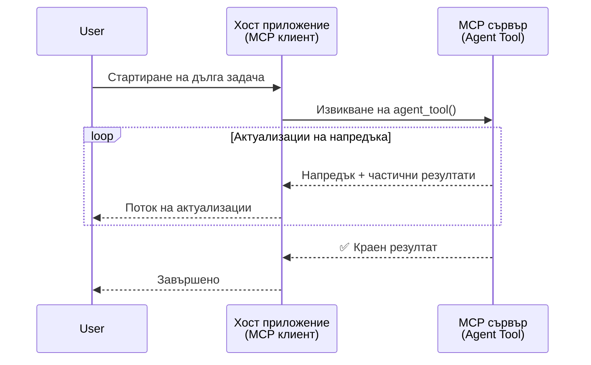
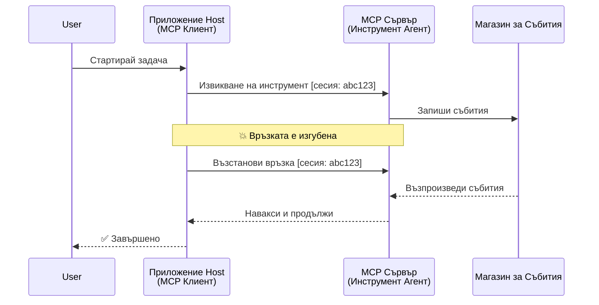
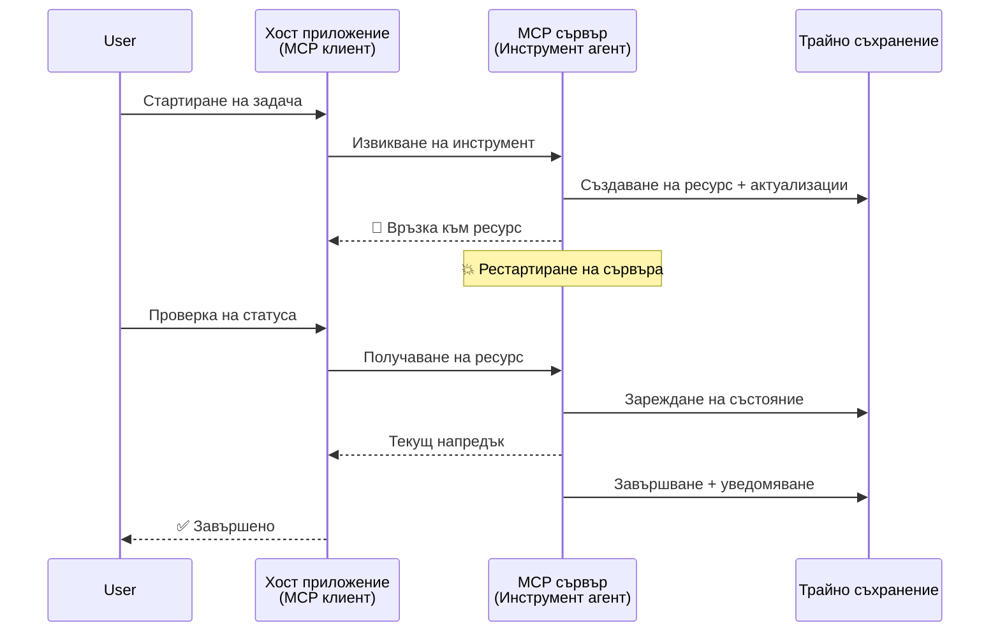
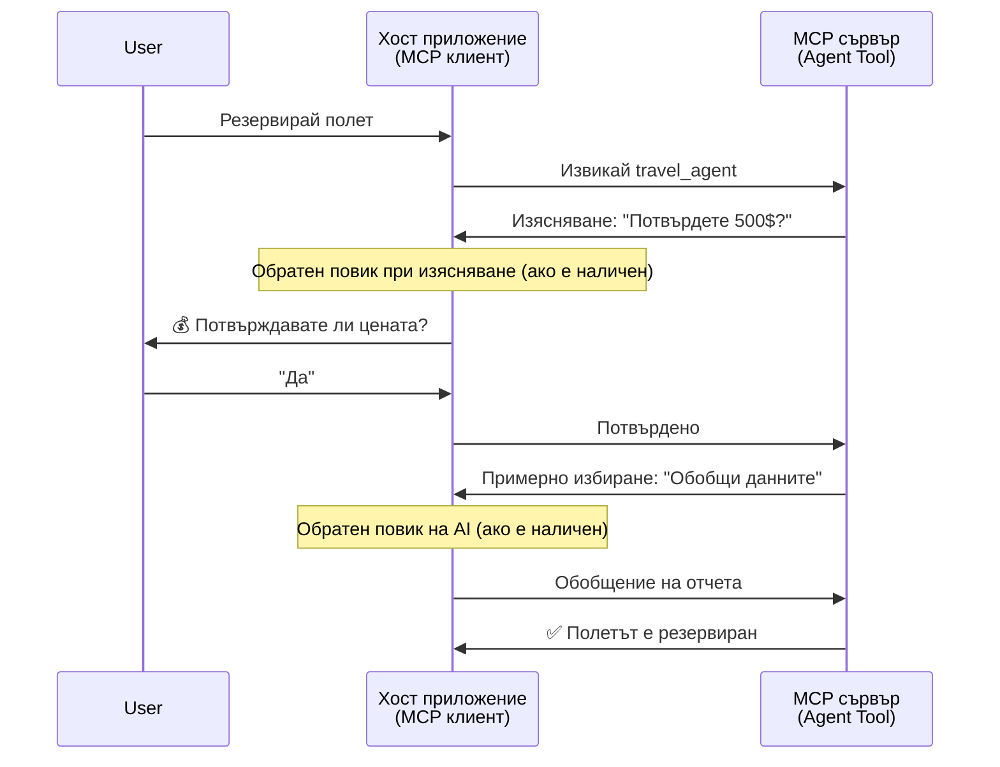
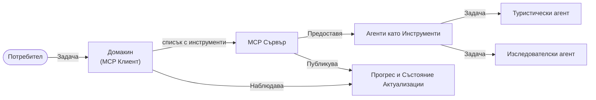

# Изграждане на системи за комуникация агент към агент с MCP

> Кратко резюме - Можете ли да изградите комуникация агент2агент върху MCP? Да!

MCP се е развил значително отвъд първоначалната си цел „да предоставя контекст на LLM“. С последните подобрения, включително [възобновяеми потоци](https://modelcontextprotocol.io/docs/concepts/transports#resumability-and-redelivery), [извличане](https://modelcontextprotocol.io/specification/2025-06-18/client/elicitation), [извадкови данни](https://modelcontextprotocol.io/specification/2025-06-18/client/sampling) и известия ([прогрес](https://modelcontextprotocol.io/specification/2025-06-18/basic/utilities/progress) и [ресурси](https://modelcontextprotocol.io/specification/2025-06-18/schema#resourceupdatednotification)), MCP сега предоставя солидна основа за изграждане на сложни системи за комуникация агент към агент.

## Заблуда относно агента/инструмента

Докато все повече разработчици изследват инструменти с агентски поведения (работа за дълги периоди, може да изискват допълнителен вход по време на изпълнението и т.н.), често срещаното погрешно схващане е, че MCP е неподходящ, главно защото ранните примери за инструменти бяха примитивни и съсредоточени върху прости модели заявка-отговор.

Това възприятие е остаряло. Спецификацията на MCP беше значително усъвършенствана през последните месеци с възможности, които преодоляват пропастта за изграждане на дългосрочно агентско поведение:

- **Поточно предаване и частични резултати**: Актуализации в реално време по време на изпълнение
- **Възобновяемост**: Клиентите могат да се свържат отново и да продължат след прекъсване
- **Издръжливост**: Резултатите оцеляват през рестартирания на сървъра (например чрез връзки към ресурси)
- **Многостъпковост**: Интерактивен вход по време на изпълнение чрез извличане и извадкови данни

Тези функции могат да бъдат комбинирани, за да позволят сложни агентски и мултиагентски приложения, всички базирани на протокола MCP.

За справка ще наричаме агент „инструмент“, който е достъпен на MCP сървър. Това предполага съществуването на хост приложение, което реализира MCP клиент, установява сесия със сървъра MCP и може да вика агента.

## Какво означава инструмент на MCP да е „агентски“?

Преди да навлезем в имплементацията, нека установим какви инфраструктурни възможности са необходими за поддържане на дългосрочни агенти.

> Ще дефинираме агент като еднообразен субект, който може да оперира автономно за продължителни периоди, способен да обработва сложни задачи, които могат да изискват множество взаимодействия или корекции въз основа на обратна връзка в реално време.

### 1. Поточно предаване и частични резултати

Традиционните модели заявка-отговор не работят за дългосрочни задачи. Агентите трябва да предоставят:

- Актуализации за напредъка в реално време
- Междинни резултати

**Поддръжка в MCP**: Известията за обновяване на ресурси позволяват поточно изпращане на частични резултати, макар че това изисква внимателен дизайн, за да се избегнат конфликти с модела 1:1 на JSON-RPC за заявки и отговори.

| Функция                     | Примерен случай                                                                                                                                                                | Поддръжка в MCP                                                                         |
| --------------------------- | --------------------------------------------------------------------------------------------------------------------------------------------------------------------------- | --------------------------------------------------------------------------------------- |
| Актуализации в реално време | Потребител поиска задача за миграция на кодова база. Агентът стриймва прогрес: „10% – Анализ на зависимости... 25% – Конвертиране на TypeScript файлове... 50% – Актуализиране на импорти...” | ✅ Известия за прогрес                                                                   |
| Частични резултати          | Задача „Генерирай книга“ стриймва частични резултати, напр. 1) Контур на сюжетната линия, 2) Списък с глави, 3) Всяка глава като завършена. Хостът може да инспектира, прекрати или пренасочи всяка стъпка. | ✅ Известията могат да се „разширят“ с частични резултати, виж предложенията в PR 383, 776 |

<div align="center" style="font-style: italic; font-size: 0.95em; margin-bottom: 0.5em;">
<strong>Фигура 1:</strong> Тази диаграма илюстрира как MCP агент стриймва актуализации за напредъка в реално време и частични резултати към хост приложението по време на дългосрочна задача, позволявайки на потребителя да следи изпълнението в реално време.
</div>



### 2. Възобновяемост

Агентите трябва да се справят внимателно с прекъсвания в мрежата:

- Да се свържат повторно след прекъсване от страна на клиента
- Да продължат от мястото, на което са прекъснали (повторно доставяне на съобщения)

**Поддръжка в MCP**: MCP StreamableHTTP транспортът днес поддържа възобновяване на сесии и повторно доставяне на съобщения чрез сесийни ID-та и ID-та на последни събития. Важното тук е, че сървърът трябва да реализира EventStore, който позволява повторно пускане на събития при повторна връзка на клиента.  
Има и предложение от общността (PR #975), което изследва транспортно-независими възобновяеми потоци.

| Функция        | Примерен случай                                                                                                                                                | Поддръжка в MCP                                                           |
| -------------- | ------------------------------------------------------------------------------------------------------------------------------------------------------------- | ------------------------------------------------------------------------- |
| Възобновяемост | Клиентът се прекъсва по време на дългосрочна задача. При повторно свързване сесията се възстановява с повторно пускане на пропуснати събития, продължавайки плавно | ✅ Транспорт StreamableHTTP със сесийни ID, повторно пускане на събития и EventStore |

<div align="center" style="font-style: italic; font-size: 0.95em; margin-bottom: 0.5em;">
<strong>Фигура 2:</strong> Тази диаграма показва как транспортът StreamableHTTP на MCP и event store позволяват плавно възобновяване на сесията: ако клиентът се прекъсне, той може да се свърже отново и да пусне пропуснатите събития, продължавайки задачата без загуба на напредък.
</div>



### 3. Издръжливост

Дългосрочните агенти имат нужда от устойчиво състояние:

- Резултатите оцеляват през рестартирания на сървъра
- Статусът може да бъде извлечен отделно
- Проследяване на напредъка през сесии

**Поддръжка в MCP**: MCP вече поддържа възвръщаем тип Resource link за повиквания на инструменти. Днес възможен модел е проектиране на инструмент, който създава ресурс и веднага връща линк към него. Инструментът може да продължи да обработва задачата във фонов режим и да обновява ресурса. Клиентът може да избира дали да следи състоянието на този ресурс чрез полинг за частични или пълни резултати (на базата на обновления от сървъра) или да се абонира за ресурс, за да получава известия за обновления.

Едно ограничение тук е, че полинговането на ресурси или абонаментите за обновления могат да консумират ресурси с последствия в голям мащаб. Има отворено предложение от общността (включително #992), което изследва възможността да включва уебхукове или тригери, които сървърът може да вика, за да уведоми клиента/хост приложението за обновления.

| Функция    | Примерен случай                                                                                                                          | Поддръжка в MCP                                                              |
| ---------- | ----------------------------------------------------------------------------------------------------------------------------------------- | ---------------------------------------------------------------------------- |
| Издръжливост | Сървърът претърпява срив по време на задача за миграция на данни. Резултатите и напредъкът преживяват рестарт, клиентът може да провери статуса и да продължи | ✅ Resource links с устойчиво съхранение и известия за статус                 |

Днес често използван модел е проектиране на инструмент, който създава ресурс и веднага връща линк към него. Инструментът във фонов режим адресира задачата, изпраща известия за ресурс, които служат като актуализации на прогреса или включват частични резултати, и актуализира съдържанието на ресурса при нужда.

<div align="center" style="font-style: italic; font-size: 0.95em; margin-bottom: 0.5em;">
<strong>Фигура 3:</strong> Тази диаграма демонстрира как MCP агенти използват устойчиви ресурси и известия за статус, за да гарантират, че дългосрочните задачи оцеляват през рестартирания на сървъра, позволявайки на клиентите да проверяват напредъка и да извличат резултати дори след повреди.
</div>



### 4. Многостъпкови Взаимодействия

Агентите често се нуждаят от допълнителен вход по време на изпълнение:

- Човешко уточнение или одобрение
- Помощ от изкуствен интелект за сложни решения
- Динамично настройване на параметри

**Поддръжка в MCP**: Пълноценна чрез изваждане (за човешки вход) и извадкови данни (за AI вход).

| Функция                  | Примерен случай                                                                                                                                | Поддръжка в MCP                                  |
| ------------------------ | ----------------------------------------------------------------------------------------------------------------------------------------------- | ------------------------------------------------ |
| Многостъпкови Взаимодействия | Агент за резервация пътуване поиска потвърждение на цена от потребителя, след което поиска AI за обобщаване на данните преди финалната резервация. | ✅ Извличане за човешки вход, извадки за AI вход |

<div align="center" style="font-style: italic; font-size: 0.95em; margin-bottom: 0.5em;">
<strong>Фигура 4:</strong> Тази диаграма изобразява как MCP агентите интерактивно извличат човешки вход или искат помощ от AI по време на изпълнение, подкрепяйки сложни многостъпкови работни процеси като потвърждения и динамични решения.
</div>



## Имплементиране на дългосрочни агенти върху MCP - Преглед на кода

В рамките на тази статия предоставяме [кодово хранилище](https://github.com/victordibia/ai-tutorials/tree/main/MCP%20Agents), което съдържа пълна имплементация на дългосрочни агенти с използване на MCP Python SDK с транспорт StreamableHTTP за възобновяване на сесии и повторно доставяне на съобщения. Имплементацията демонстрира как MCP възможностите могат да бъдат комбинирани, за да позволят усъвършенствани агентски поведения.

Конкретно, реализираме сървър с два основни агентски инструмента:

- **Агент за пътувания** – симулира услуга за резервация на пътуване с потвърждение на цена чрез извличане
- **Агент за изследвания** – извършва изследователски задачи с AI-подпомогнати обобщения чрез извадкови данни

И двата агента демонстрират актуализации на напредъка в реално време, интерактивни потвърждения и пълни възможности за възобновяване на сесии.

### Ключови концепции при имплементацията

Следващите раздели показват имплементация на агенти на страна на сървъра и обработка на хоста на клиента за всяка възможност:

#### Поточно предаване и актуализации за напредъка - текущ статус на задача

Поточното предаване позволява на агентите да предоставят актуализации за прогреса в реално време по време на дългосрочни задачи, като държат потребителите информирани за статуса на задачата и междинните резултати.

**Имплементация на сървъра (агент изпраща известия за прогрес):**

```python
# От server/server.py - Туристически агент, изпращащ актуализации на напредъка
for i, step in enumerate(steps):
    await ctx.session.send_progress_notification(
        progress_token=ctx.request_id,
        progress=i * 25,
        total=100,
        message=step,
        related_request_id=str(ctx.request_id)
    )
    await anyio.sleep(2)  # Симулирайте работа

# Алтернатива: Записване на съобщения за подробни актуализации стъпка по стъпка
await ctx.session.send_log_message(
    level="info",
    data=f"Processing step {current_step}/{steps} ({progress_percent}%)",
    logger="long_running_agent",
    related_request_id=ctx.request_id,
)
```

**Имплементация на клиента (хост получава актуализации за прогрес):**

```python
# От client/client.py - Клиент, обработващ известия в реално време
async def message_handler(message) -> None:
    if isinstance(message, types.ServerNotification):
        if isinstance(message.root, types.LoggingMessageNotification):
            console.print(f"📡 [dim]{message.root.params.data}[/dim]")
        elif isinstance(message.root, types.ProgressNotification):
            progress = message.root.params
            console.print(f"🔄 [yellow]{progress.message} ({progress.progress}/{progress.total})[/yellow]")

# Регистриране на обработчик на съобщения при създаване на сесия
async with ClientSession(
    read_stream, write_stream,
    message_handler=message_handler
) as session:
```

#### Извличане - заявка за вход от потребителя

Извличането позволява на агентите да поискат вход от потребителя по време на изпълнение. Това е съществено за потвърждения, уточнения или одобрения при дългосрочни задачи.

**Имплементация на сървъра (агент иска потвърждение):**

```python
# От server/server.py - Туристически агент, който иска потвърждение за цена
elicit_result = await ctx.session.elicit(
    message=f"Please confirm the estimated price of $1200 for your trip to {destination}",
    requestedSchema=PriceConfirmationSchema.model_json_schema(),
    related_request_id=ctx.request_id,
)

if elicit_result and elicit_result.action == "accept":
    # Продължи с резервацията
    logger.info(f"User confirmed price: {elicit_result.content}")
elif elicit_result and elicit_result.action == "decline":
    # Отмени резервацията
    booking_cancelled = True
```

**Имплементация на клиента (хост предоставя callback за извличане):**

```python
# От client/client.py - Обработка на заявки от клиента за извличане
async def elicitation_callback(context, params):
    console.print(f"💬 Server is asking for confirmation:")
    console.print(f"   {params.message}")

    response = console.input("Do you accept? (y/n): ").strip().lower()

    if response in ['y', 'yes']:
        return types.ElicitResult(
            action="accept",
            content={"confirm": True, "notes": "Confirmed by user"}
        )
    else:
        return types.ElicitResult(
            action="decline",
            content={"confirm": False, "notes": "Declined by user"}
        )

# Регистрирайте обратно повикване при създаване на сесия
async with ClientSession(
    read_stream, write_stream,
    elicitation_callback=elicitation_callback
) as session:
```

#### Извадкови данни - заявка за помощ от AI

Извадковите данни позволяват на агентите да поискат помощ от LLM за сложни решения или генериране на съдържание по време на изпълнение. Това позволява хибридни човеко-AI работни потоци.

**Имплементация на сървъра (агент иска AI помощ):**

```python
# От server/server.py - Изследователски агент, който поиска AI обобщение
sampling_result = await ctx.session.create_message(
    messages=[
        SamplingMessage(
            role="user",
            content=TextContent(type="text", text=f"Please summarize the key findings for research on: {topic}")
        )
    ],
    max_tokens=100,
    related_request_id=ctx.request_id,
)

if sampling_result and sampling_result.content:
    if sampling_result.content.type == "text":
        sampling_summary = sampling_result.content.text
        logger.info(f"Received sampling summary: {sampling_summary}")
```

**Имплементация на клиента (хост предоставя callback за извадкови данни):**

```python
# От client/client.py - Клиентска обработка на заявки за вземане на проби
async def sampling_callback(context, params):
    message_text = params.messages[0].content.text if params.messages else 'No message'
    console.print(f"🧠 Server requested sampling: {message_text}")

    # В реално приложение това може да извика API на LLM
    # За демонстрационни цели предоставяме фалшив отговор
    mock_response = "Based on current research, MCP has evolved significantly..."

    return types.CreateMessageResult(
        role="assistant",
        content=types.TextContent(type="text", text=mock_response),
        model="interactive-client",
        stopReason="endTurn"
    )

# Регистрирайте обратното повикване при създаване на сесия
async with ClientSession(
    read_stream, write_stream,
    sampling_callback=sampling_callback,
    elicitation_callback=elicitation_callback
) as session:
```

#### Възобновяемост - непрекъснатост на сесията при прекъсване

Възобновяемостта гарантира, че дългосрочните задачи на агента могат да оцеляват клиентски прекъсвания и да продължат плавно при повторна връзка. Това се реализира чрез event store и възобновителни токени.

**Имплементация на Event Store (сървър пази състоянието на сесията):**

```python
# От server/event_store.py - Прост съхранител на събития в паметта
class SimpleEventStore(EventStore):
    def __init__(self):
        self._events: list[tuple[StreamId, EventId, JSONRPCMessage]] = []
        self._event_id_counter = 0

    async def store_event(self, stream_id: StreamId, message: JSONRPCMessage) -> EventId:
        """Store an event and return its ID."""
        self._event_id_counter += 1
        event_id = str(self._event_id_counter)
        self._events.append((stream_id, event_id, message))
        return event_id

    async def replay_events_after(self, last_event_id: EventId, send_callback: EventCallback) -> StreamId | None:
        """Replay events after the specified ID for resumption."""
        # Намерете събитията след последното известно събитие и ги възпроизведете
        for _, event_id, message in self._events[start_index:]:
            await send_callback(EventMessage(message, event_id))

# От server/server.py - Предаване на съхранителя на събития към мениджъра на сесия
def create_server_app(event_store: Optional[EventStore] = None) -> Starlette:
    server = ResumableServer()

    # Създайте мениджър на сесия със съхранител на събития за възобновяване
    session_manager = StreamableHTTPSessionManager(
        app=server,
        event_store=event_store,  # Съхранителят на събития позволява възобновяване на сесията
        json_response=False,
        security_settings=security_settings,
    )

    return Starlette(routes=[Mount("/mcp", app=session_manager.handle_request)])

# Използване: Инициализирайте със съхранител на събития
event_store = SimpleEventStore()
app = create_server_app(event_store)
```

**Метаданни на клиента с възобновителен токен (клиент се свързва отново с използване на запазено състояние):**

```python
# От client/client.py - Продължаване на клиента с метаданни
if existing_tokens and existing_tokens.get("resumption_token"):
    # Използвайте съществуващ токен за продължаване, за да продължите от мястото, където спряхме
    metadata = ClientMessageMetadata(
        resumption_token=existing_tokens["resumption_token"],
    )
else:
    # Създайте обратна повикване за запазване на токена за продължаване при получаване
    def enhanced_callback(token: str):
        protocol_version = getattr(session, 'protocol_version', None)
        token_manager.save_tokens(session_id, token, protocol_version, command, args)

    metadata = ClientMessageMetadata(
        on_resumption_token_update=enhanced_callback,
    )

# Изпратете заявка с метаданни за продължаване
result = await session.send_request(
    types.ClientRequest(
        types.CallToolRequest(
            method="tools/call",
            params=types.CallToolRequestParams(name=command, arguments=args)
        )
    ),
    types.CallToolResult,
    metadata=metadata,
)
```

Хост приложението поддържа локално сесийни ID-та и възобновителни токени, което му позволява да се свързва към съществуващи сесии без загуба на напредък или състояние.

### Организация на кода

<div align="center" style="font-style: italic; font-size: 0.95em; margin-bottom: 0.5em;">
<strong>Фигура 5:</strong> Архитектура на агентна система базирана на MCP
</div>



**Ключови файлове:**

- **`server/server.py`** – възобновяем MCP сървър с агенти за пътувания и изследвания, които демонстрират извличане, извадкови данни и актуализации на прогреса
- **`client/client.py`** – интерактивно хост приложение с поддръжка на възобновяване на сесии, обработващи callback функции и мениджмънт на токени
- **`server/event_store.py`** – имплементация на event store, която позволява възобновяване на сесията и повторно доставяне на съобщения

## Разширяване към мултиагентна комуникация на MCP

Горната имплементация може да бъде разширена към мултиагентни системи чрез подобряване на интелигентността и обхвата на хост приложението:

- **Интелигентно разчленяване на задачи**: Хостът анализира сложни потребителски заявки и ги разбива на подзадачи за различни специализирани агенти
- **Координация на множество сървъри**: Хостът поддържа връзки към множество MCP сървъри, всеки с различни агентски възможности
- **Управление на състояния на задачи**: Хостът следи прогреса на множество едновременно изпълнявани агентски задачи, управлява зависимости и последователност
- **Устойчивост и повтаряне на опити**: Хостът управлява неудачи, прилага логика за повторен опит и пренасочване на задачи при недостъпност на агенти
- **Синтез на резултати**: Хостът комбинира изходни данни от множество агенти в съгласувани крайни резултати

Хостът се развива от прост клиент до интелигентен оркестратор, координиращ разпределените агентски възможности, докато запазва основата на протокола MCP.

## Заключение

Подобреният MCP - известия за ресурси, извличане/извадкови данни, възобновяеми потоци и устойчиви ресурси - позволява сложни взаимодействия агент към агент, като същевременно запазва простотата на протокола.

## Започнете

Готови ли сте да изградите своя собствена агентоагентска система? Следвайте тези стъпки:

### 1. Стартирайте демото

```bash
# Стартирайте сървъра с event store за възобновяване
python -m server.server --port 8006

# В друг терминал стартирайте интерактивния клиент
python -m client.client --url http://127.0.0.1:8006/mcp
```

**Налични команди в интерактивен режим:**

- `travel_agent` – Резервирайте пътуване с потвърждение на цена чрез извличане
- `research_agent` – Изследвайте теми с AI-подпомогнати обобщения чрез извадкови данни
- `list` – Покажете всички налични инструменти
- `clean-tokens` – Изчистете възобновителните токени
- `help` – Покажете подробна помощ за командите
- `quit` – Излезте от клиента

### 2. Тествайте възможностите за възобновяване

- Стартирайте дългосрочен агент (например `travel_agent`)
- Прекъснете клиента по време на изпълнение (Ctrl+C)
- Рестартирайте клиента - той автоматично ще се възобнови от мястото, на което е прекъснал

### 3. Изследвайте и разширявайте

- **Разгледайте примерите**: Вижте този [mcp-agents](https://github.com/victordibia/ai-tutorials/tree/main/MCP%20Agents)
- **Присъединете се към общността**: Участвайте в дискусиите за MCP в GitHub
- **Експериментирайте**: Започнете с проста дългосрочна задача и постепенно добавяйте поточно предаване, възобновяемост и мултиагентна координация

Това демонстрира как MCP позволява интелигентни агентски поведения, запазвайки инструментно базираната простота.

Общо взето, спецификацията на протокола MCP се развива бързо; на читателите се препоръчва да преглеждат официалния уебсайт с документацията за най-актуалните новости - https://modelcontextprotocol.io/introduction

---

<!-- CO-OP TRANSLATOR DISCLAIMER START -->
**Отказ от отговорност**:
Този документ е преведен с помощта на AI преводачески услуга [Co-op Translator](https://github.com/Azure/co-op-translator). Въпреки че се стремим към точност, моля имайте предвид, че автоматизираните преводи могат да съдържат грешки или неточности. Оригиналният документ на неговия роден език трябва да се счита за авторитетен източник. За критична информация се препоръчва професионален човешки превод. Ние не носим отговорност за каквито и да е недоразумения или неправилни тълкувания, произтичащи от използването на този превод.
<!-- CO-OP TRANSLATOR DISCLAIMER END -->